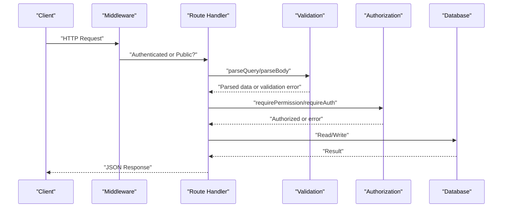
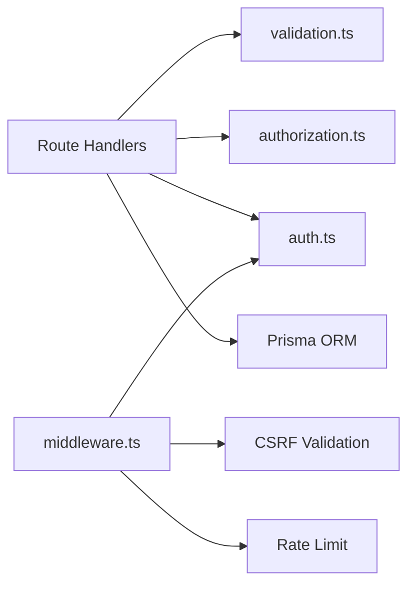
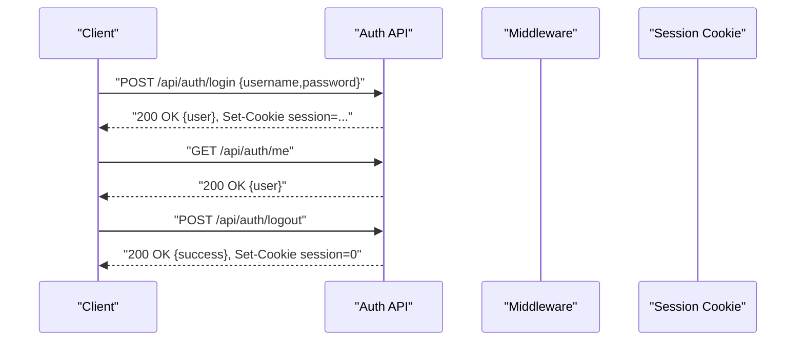

# API Reference

<cite>
**Referenced Files in This Document**
- [login/route.ts](file://app/api/auth/login/route.ts)
- [logout/route.ts](file://app/api/auth/logout/route.ts)
- [me/route.ts](file://app/api/auth/me/route.ts)
- [middleware.ts](file://middleware.ts)
- [auth.ts](file://lib/shared/auth.ts)
- [authorization.ts](file://lib/shared/authorization.ts)
- [validation.ts](file://lib/shared/validation.ts)
- [products/route.ts](file://app/api/accounting/products/route.ts)
- [products/[id]/route.ts](file://app/api/accounting/products/[id]/route.ts)
- [products/[id]/custom-fields/route.ts](file://app/api/accounting/products/[id]/custom-fields/route.ts)
- [documents/route.ts](file://app/api/accounting/documents/route.ts)
- [documents/[id]/cancel/route.ts](file://app/api/accounting/documents/[id]/cancel/route.ts)
- [counterparties/route.ts](file://app/api/accounting/counterparties/route.ts)
- [accounts/balances/route.ts](file://app/api/accounting/accounts/balances/route.ts)
- [payments/route.ts](file://app/api/finance/payments/route.ts)
- [finance/categories/route.ts](file://app/api/finance/categories/route.ts)
- [finance/reports/profit-loss/route.ts](file://app/api/finance/reports/profit-loss/route.ts)
- [finance/reports/balances/route.ts](file://app/api/finance/reports/balances/route.ts)
- [ecommerce/products/route.ts](file://app/api/ecommerce/products/route.ts)
- [ecommerce/products/[slug]/route.ts](file://app/api/ecommerce/products/[slug]/route.ts)
- [ecommerce/cart/route.ts](file://app/api/ecommerce/cart/route.ts)
- [ecommerce/checkout/route.ts](file://app/api/ecommerce/checkout/route.ts)
- [ecommerce/orders/route.ts](file://app/api/ecommerce/orders/route.ts)
</cite>

## Table of Contents
1. [Introduction](#introduction)
2. [Project Structure](#project-structure)
3. [Core Components](#core-components)
4. [Architecture Overview](#architecture-overview)
5. [Detailed Component Analysis](#detailed-component-analysis)
6. [Dependency Analysis](#dependency-analysis)
7. [Performance Considerations](#performance-considerations)
8. [Troubleshooting Guide](#troubleshooting-guide)
9. [Conclusion](#conclusion)
10. [Appendices](#appendices)

## Introduction
This document describes the ListOpt ERP REST API surface, focusing on public and authenticated endpoints grouped by functional domains: Authentication, Accounting, Finance, and E-commerce. It specifies HTTP methods, URL patterns, request/response schemas, authentication and authorization requirements, pagination, filtering, validation, error handling, and security headers. Guidance for client integration, SDK usage, and webhook patterns is included.

## Project Structure

```mermaid
graph TB
subgraph "Middleware"
MW["middleware.ts"]
end
subgraph "Authentication"
AUTH_LOGIN["POST /api/auth/login"]
AUTH_LOGOUT["POST /api/auth/logout"]
AUTH_ME["GET /api/auth/me"]
end
subgraph "Accounting"
ACC_PRODUCTS["GET/POST /api/accounting/products"]
ACC_PRODUCTS_ID["GET/PUT/DELETE /api/accounting/products/[id]"]
ACC_PRODUCTS_ID_CFS["PUT /api/accounting/products/[id]/custom-fields"]
ACC_DOCS["GET/POST /api/accounting/documents"]
ACC_DOCS_CANCEL["POST /api/accounting/documents/[id]/cancel"]
ACC_COUNTERPARTIES["GET/POST /api/accounting/counterparties"]
ACC_ACCOUNTS_BALANCES["GET /api/accounting/accounts/balances"]
end
subgraph "Finance"
FIN_PAYMENTS["GET/POST /api/finance/payments"]
FIN_CATEGORIES["GET/POST /api/finance/categories"]
FIN_REPORTS_PL["GET /api/finance/reports/profit-loss"]
FIN_REPORTS_BAL["GET /api/finance/reports/balances"]
end
subgraph "E-commerce"
EC_PRODS["GET /api/ecommerce/products"]
EC_PRODS_SLUG["GET /api/ecommerce/products/[slug]"]
EC_CART["GET/POST/DELETE /api/ecommerce/cart"]
EC_CHECKOUT["POST /api/ecommerce/checkout"]
EC_ORDERS["GET /api/ecommerce/orders"]
end
MW --> AUTH_LOGIN
MW --> AUTH_LOGOUT
MW --> AUTH_ME
MW --> ACC_PRODUCTS
MW --> ACC_PRODUCTS_ID
MW --> ACC_PRODUCTS_ID_CFS
MW --> ACC_DOCS
MW --> ACC_DOCS_CANCEL
MW --> ACC_COUNTERPARTIES
MW --> ACC_ACCOUNTS_BALANCES
MW --> FIN_PAYMENTS
MW --> FIN_CATEGORIES
MW --> FIN_REPORTS_PL
MW --> FIN_REPORTS_BAL
MW --> EC_PRODS
MW --> EC_PRODS_SLUG
MW --> EC_CART
MW --> EC_CHECKOUT
MW --> EC_ORDERS
```

The API is implemented as Next.js App Router pages under app/api/<domain>/<resource>/route.ts with optional dynamic segments. Middleware enforces authentication, CSRF protection, and rate limiting. Shared libraries provide validation, authorization, and session management.

**Diagram sources**
- [middleware.ts:45-151](file://middleware.ts#L45-L151)
- [login/route.ts:9-59](file://app/api/auth/login/route.ts#L9-L59)
- [logout/route.ts:3-13](file://app/api/auth/logout/route.ts#L3-L13)
- [me/route.ts:4-10](file://app/api/auth/me/route.ts#L4-L10)
- [products/route.ts:7-225](file://app/api/accounting/products/route.ts#L7-L225)
- [products/[id]/route.ts:9-119](file://app/api/accounting/products/[id]/route.ts#L9-L119)
- [products/[id]/custom-fields/route.ts:9-68](file://app/api/accounting/products/[id]/custom-fields/route.ts#L9-L68)
- [documents/route.ts:8-136](file://app/api/accounting/documents/route.ts#L8-L136)
- [documents/[id]/cancel/route.ts:11-69](file://app/api/accounting/documents/[id]/cancel/route.ts#L11-L69)
- [counterparties/route.ts:10-81](file://app/api/accounting/counterparties/route.ts#L10-L81)
- [accounts/balances/route.ts:5-28](file://app/api/accounting/accounts/balances/route.ts#L5-L28)
- [payments/route.ts:26-113](file://app/api/finance/payments/route.ts#L26-L113)
- [finance/categories/route.ts:12-60](file://app/api/finance/categories/route.ts#L12-L60)
- [finance/reports/profit-loss/route.ts:7-27](file://app/api/finance/reports/profit-loss/route.ts#L7-L27)
- [finance/reports/balances/route.ts:6-45](file://app/api/finance/reports/balances/route.ts#L6-L45)
- [ecommerce/products/route.ts:7-163](file://app/api/ecommerce/products/route.ts#L7-L163)
- [ecommerce/products/[slug]/route.ts:6-218](file://app/api/ecommerce/products/[slug]/route.ts#L6-L218)
- [ecommerce/cart/route.ts:7-189](file://app/api/ecommerce/cart/route.ts#L7-L189)
- [ecommerce/checkout/route.ts:8-100](file://app/api/ecommerce/checkout/route.ts#L8-L100)
- [ecommerce/orders/route.ts:7-64](file://app/api/ecommerce/orders/route.ts#L7-L64)

**Section sources**
- [middleware.ts:13-106](file://middleware.ts#L13-L106)
- [auth.ts:18-83](file://lib/shared/auth.ts#L18-L83)
- [authorization.ts:16-160](file://lib/shared/authorization.ts#L16-L160)
- [validation.ts:14-63](file://lib/shared/validation.ts#L14-L63)

## Core Components
- Authentication and Session Management
  - Login: POST /api/auth/login sets a session cookie.
  - Logout: POST /api/auth/logout clears the session cookie.
  - Current user: GET /api/auth/me reads the session.
- Authorization
  - Roles and permissions enforced via requirePermission and requireAuth.
  - Unauthorized and forbidden responses standardized.
- Validation
  - Zod-based request parsing for query parameters and request bodies.
  - Structured validation error responses.
- Middleware
  - Enforces authentication, CSRF protection, rate limiting, and redirects.
  - Public routes include login, setup, and selected e-commerce storefront endpoints.

**Section sources**
- [login/route.ts:9-59](file://app/api/auth/login/route.ts#L9-L59)
- [logout/route.ts:3-13](file://app/api/auth/logout/route.ts#L3-L13)
- [me/route.ts:4-10](file://app/api/auth/me/route.ts#L4-L10)
- [authorization.ts:104-160](file://lib/shared/authorization.ts#L104-L160)
- [validation.ts:14-63](file://lib/shared/validation.ts#L14-L63)
- [middleware.ts:45-151](file://middleware.ts#L45-L151)

## Architecture Overview
The API follows a layered architecture:
- HTTP handlers under app/api define routes and orchestrate domain logic.
- Shared modules provide validation, authorization, and session utilities.
- Middleware applies cross-cutting concerns (auth, CSRF, rate limiting).
- Domain-specific modules encapsulate business logic (e.g., accounting documents, finance reports).

**Diagram sources**
- [middleware.ts:45-151](file://middleware.ts#L45-L151)
- [validation.ts:14-63](file://lib/shared/validation.ts#L14-L63)
- [authorization.ts:104-160](file://lib/shared/authorization.ts#L104-L160)

## Detailed Component Analysis

### Authentication API
- Purpose: Manage ERP user sessions.
- Security Headers and Cookies
  - Session cookie named session with httpOnly, secure, sameSite lax, path "/", and 7-day maxAge.
  - Environment variable SESSION_SECRET required for signing tokens.
- Endpoints
  - POST /api/auth/login
    - Request: JSON { username, password }
    - Response: JSON { user: { id, username, role } }
    - On success: Sets session cookie.
    - On failure: 401 Unauthorized with error message.
  - POST /api/auth/logout
    - Response: JSON { success: true }
    - Clears session cookie.
  - GET /api/auth/me
    - Response: JSON { user }
    - Requires valid session; otherwise 401 Unauthorized.

**Section sources**
- [login/route.ts:9-59](file://app/api/auth/login/route.ts#L9-L59)
- [logout/route.ts:3-13](file://app/api/auth/logout/route.ts#L3-L13)
- [me/route.ts:4-10](file://app/api/auth/me/route.ts#L4-L10)
- [auth.ts:18-83](file://lib/shared/auth.ts#L18-L83)

### Accounting API
- Products
  - GET /api/accounting/products
    - Query parameters: search, categoryId, active, published, hasDiscount, variantStatus, sortBy, sortOrder, page, limit
    - Filtering: text search across name/sku/barcode; boolean filters; variantStatus supports masters, variants, unlinked
    - Sorting: name, sku, createdAt; purchasePrice/salePrice post-sorted
    - Response: { data: Product[], total, page, limit }
  - POST /api/accounting/products
    - Request: Product creation payload; optional auto SKU generation and slug generation
    - Response: Created product with computed prices
  - GET /api/accounting/products/[id]
    - Response: Product with related data and computed prices
  - PUT /api/accounting/products/[id]
    - Request: Partial updates; optional price updates handled atomically
    - Response: Updated product
  - DELETE /api/accounting/products/[id]
    - Deactivates product; returns success
  - PUT /api/accounting/products/[id]/custom-fields
    - Request: { fields: [{ definitionId, value }] }
    - Response: Upserted field values
- Documents
  - GET /api/accounting/documents
    - Query parameters: type, types (comma-separated), status, warehouseId, counterpartyId, dateFrom, dateTo, search, page, limit
    - Response: { data: Document[], total, page, limit }
  - POST /api/accounting/documents
    - Request: Document creation payload; items array with quantity/price; totals computed
    - Response: Created document with type/status names
  - POST /api/accounting/documents/[id]/cancel
    - Cancels a confirmed document; recalculates stock and counterparty balance if applicable
    - Response: Cancelled document with enriched metadata
- Counterparties
  - GET /api/accounting/counterparties
    - Query parameters: search, type, active, page, limit
    - Response: { data: Counterparty[], total, page, limit }
  - POST /api/accounting/counterparties
    - Request: Counterparty creation payload
    - Response: Created counterparty
- Accounts Balances
  - GET /api/accounting/accounts/balances
    - Response: { accountId: balance }

**Section sources**
- [products/route.ts:7-225](file://app/api/accounting/products/route.ts#L7-L225)
- [products/[id]/route.ts:9-119](file://app/api/accounting/products/[id]/route.ts#L9-L119)
- [products/[id]/custom-fields/route.ts:9-68](file://app/api/accounting/products/[id]/custom-fields/route.ts#L9-L68)
- [documents/route.ts:8-136](file://app/api/accounting/documents/route.ts#L8-L136)
- [documents/[id]/cancel/route.ts:11-69](file://app/api/accounting/documents/[id]/cancel/route.ts#L11-L69)
- [counterparties/route.ts:10-81](file://app/api/accounting/counterparties/route.ts#L10-L81)
- [accounts/balances/route.ts:5-28](file://app/api/accounting/accounts/balances/route.ts#L5-L28)

### Finance API
- Payments
  - GET /api/finance/payments
    - Query parameters: type, categoryId, counterpartyId, dateFrom, dateTo, page, limit
    - Response: { payments, total, page, limit, incomeTotal, expenseTotal, netCashFlow }
  - POST /api/finance/payments
    - Request: { type, categoryId, counterpartyId?, documentId?, amount, paymentMethod, date?, description? }
    - Response: Created payment with related entities
- Categories
  - GET /api/finance/categories
    - Query parameters: type (optional)
    - Response: { categories }
  - POST /api/finance/categories
    - Request: { name, type, defaultAccountCode? }
    - Response: Created category
- Reports
  - GET /api/finance/reports/profit-loss
    - Query parameters: dateFrom, dateTo
    - Response: Profit and loss report data
  - GET /api/finance/reports/balances
    - Query parameters: asOfDate (optional)
    - Response: { balances, receivable, payable, totalReceivable, totalPayable, netBalance }

**Section sources**
- [payments/route.ts:26-113](file://app/api/finance/payments/route.ts#L26-L113)
- [finance/categories/route.ts:12-60](file://app/api/finance/categories/route.ts#L12-L60)
- [finance/reports/profit-loss/route.ts:7-27](file://app/api/finance/reports/profit-loss/route.ts#L7-L27)
- [finance/reports/balances/route.ts:6-45](file://app/api/finance/reports/balances/route.ts#L6-L45)

### E-commerce API
- Public Catalog
  - GET /api/ecommerce/products
    - Query parameters: search, categoryId, minPrice, maxPrice, page, limit, sort (newest, price_asc, price_desc)
    - Response: { data: Product[], total, page, limit }
- Product Detail
  - GET /api/ecommerce/products/[slug]
    - Response: Detailed product with pricing, variants, reviews, stock, SEO, and variant hierarchy
- Cart
  - GET /api/ecommerce/cart
    - Response: { items: CartItem[] }
  - POST /api/ecommerce/cart
    - Request: { productId, variantId?, quantity }
    - Response: { success: true }
  - DELETE /api/ecommerce/cart?itemId=...
    - Response: { success: true }
- Checkout
  - POST /api/ecommerce/checkout
    - Request: { deliveryType, addressId?, notes? }
    - Response: { orderId, orderNumber, totalAmount }
- Orders
  - GET /api/ecommerce/orders
    - Query parameters: page, limit
    - Response: { orders: Order[], total, page, limit }

**Section sources**
- [ecommerce/products/route.ts:7-163](file://app/api/ecommerce/products/route.ts#L7-L163)
- [ecommerce/products/[slug]/route.ts:6-218](file://app/api/ecommerce/products/[slug]/route.ts#L6-L218)
- [ecommerce/cart/route.ts:7-189](file://app/api/ecommerce/cart/route.ts#L7-L189)
- [ecommerce/checkout/route.ts:8-100](file://app/api/ecommerce/checkout/route.ts#L8-L100)
- [ecommerce/orders/route.ts:7-64](file://app/api/ecommerce/orders/route.ts#L7-L64)

## Dependency Analysis
- Route handlers depend on:
  - Validation utilities for request parsing and error handling.
  - Authorization utilities for permission checks.
  - Database access via Prisma ORM.
- Middleware orchestrates:
  - Authentication via session cookie verification.
  - CSRF protection for mutating ERP API endpoints.
  - Rate limiting and request ID propagation.

**Diagram sources**
- [validation.ts:14-63](file://lib/shared/validation.ts#L14-L63)
- [authorization.ts:104-160](file://lib/shared/authorization.ts#L104-L160)
- [auth.ts:18-83](file://lib/shared/auth.ts#L18-L83)
- [middleware.ts:45-151](file://middleware.ts#L45-L151)

**Section sources**
- [validation.ts:14-63](file://lib/shared/validation.ts#L14-L63)
- [authorization.ts:104-160](file://lib/shared/authorization.ts#L104-L160)
- [auth.ts:18-83](file://lib/shared/auth.ts#L18-L83)
- [middleware.ts:45-151](file://middleware.ts#L45-L151)

## Performance Considerations
- Pagination
  - All list endpoints support page and limit parameters with total count.
- Sorting and Filtering
  - Server-side filtering and sorting where possible; price-based sorting is post-processed.
- Database Queries
  - Use selective includes and take/skip for efficient pagination.
- Recommendations
  - Prefer exact-match filters (IDs) when available.
  - Use date ranges with appropriate boundaries.
  - Cache static catalogs and product listings where feasible.

[No sources needed since this section provides general guidance]

## Troubleshooting Guide
- Authentication Failures
  - 401 Unauthorized on missing or invalid session cookie.
  - 403 Forbidden for insufficient permissions.
- Validation Errors
  - 400 Bad Request with structured fields map for invalid request bodies or query parameters.
- Authorization Errors
  - Standardized AuthorizationError thrown for missing roles or permissions.
- Middleware Interference
  - Public vs protected routes: ensure correct cookie/session is present for protected endpoints.

**Section sources**
- [middleware.ts:45-151](file://middleware.ts#L45-L151)
- [authorization.ts:137-160](file://lib/shared/authorization.ts#L137-L160)
- [validation.ts:54-63](file://lib/shared/validation.ts#L54-L63)

## Conclusion
The ListOpt ERP API provides a comprehensive set of endpoints across Authentication, Accounting, Finance, and E-commerce. It enforces robust authentication and authorization, offers consistent validation and error responses, and supports pagination and filtering. Clients should adhere to the documented authentication flows, respect CSRF and rate-limiting constraints, and leverage the provided schemas for reliable integrations.

[No sources needed since this section summarizes without analyzing specific files]

## Appendices

### Authentication Flow and Session Management

**Diagram sources**
- [login/route.ts:9-59](file://app/api/auth/login/route.ts#L9-L59)
- [logout/route.ts:3-13](file://app/api/auth/logout/route.ts#L3-L13)
- [me/route.ts:4-10](file://app/api/auth/me/route.ts#L4-L10)

### Request/Response Data Structures
- Authentication
  - Login request: { username, password }
  - Login response: { user: { id, username, role } }
  - Logout response: { success: boolean }
  - Me response: { user }
- Accounting Products
  - List query: { search?, categoryId?, active?, published?, hasDiscount?, variantStatus?, sortBy?, sortOrder?, page?, limit? }
  - Create request: Product creation payload; optional auto SKU and slug
  - Detail response: Product with computed prices, variants, discounts, stock, SEO
- Accounting Documents
  - List query: { type?, types?, status?, warehouseId?, counterpartyId?, dateFrom?, dateTo?, search?, page?, limit? }
  - Create request: Document payload with items array
  - Cancel response: Enriched document with type/status names
- Finance Payments
  - List query: { type?, categoryId?, counterpartyId?, dateFrom?, dateTo?, page?, limit? }
  - Create request: { type, categoryId, counterpartyId?, documentId?, amount, paymentMethod, date?, description? }
- E-commerce Catalog
  - List query: { search?, categoryId?, minPrice?, maxPrice?, page?, limit?, sort? }
  - Detail response: Product with pricing, variants, reviews, stock, SEO, and variant hierarchy

**Section sources**
- [login/route.ts:9-59](file://app/api/auth/login/route.ts#L9-L59)
- [logout/route.ts:3-13](file://app/api/auth/logout/route.ts#L3-L13)
- [me/route.ts:4-10](file://app/api/auth/me/route.ts#L4-L10)
- [products/route.ts:7-225](file://app/api/accounting/products/route.ts#L7-L225)
- [products/[id]/route.ts:9-119](file://app/api/accounting/products/[id]/route.ts#L9-L119)
- [documents/route.ts:8-136](file://app/api/accounting/documents/route.ts#L8-L136)
- [payments/route.ts:26-113](file://app/api/finance/payments/route.ts#L26-L113)
- [ecommerce/products/route.ts:7-163](file://app/api/ecommerce/products/route.ts#L7-L163)
- [ecommerce/products/[slug]/route.ts:6-218](file://app/api/ecommerce/products/[slug]/route.ts#L6-L218)

### Pagination, Filtering, and Search
- Pagination
  - page: integer, default 1
  - limit: integer, default 50
  - Response includes total, page, limit
- Filtering
  - Text search: search parameter applied to name/sku/barcode (accounting) or name/sku/description (storefront)
  - Boolean filters: active, published, publishedToStore, hasDiscount
  - Category filter: categoryId
  - Date range filters: dateFrom/dateTo
- Sorting
  - sortBy: name, sku, createdAt, purchasePrice, salePrice
  - sortOrder: asc, desc (default asc)
  - Price sorting is post-processed when needed

**Section sources**
- [products/route.ts:12-137](file://app/api/accounting/products/route.ts#L12-L137)
- [ecommerce/products/route.ts:10-155](file://app/api/ecommerce/products/route.ts#L10-L155)

### Error Response Formats
- Validation errors: 400 with { error, fields }
- Authorization errors: 401 or 403 with { error }
- Unexpected errors: 500 with { error }

**Section sources**
- [validation.ts:54-63](file://lib/shared/validation.ts#L54-L63)
- [authorization.ts:137-160](file://lib/shared/authorization.ts#L137-L160)

### Rate Limiting, CSRF, and Security Headers
- Rate Limiting
  - Enforced by middleware; clients should retry with exponential backoff on throttling.
- CSRF Protection
  - Required for mutating ERP API endpoints; validated using SESSION_SECRET.
- Security Headers
  - Session cookie: httpOnly, secure (when enabled), sameSite lax, path "/".
  - X-Request-Id header returned on all responses for tracing.

**Section sources**
- [middleware.ts:45-151](file://middleware.ts#L45-L151)
- [auth.ts:44-58](file://lib/shared/auth.ts#L44-L58)

### Client Implementation Guidelines
- Use HTTPS and persist the session cookie across requests.
- Validate all responses against documented schemas.
- Implement retries with backoff for transient failures.
- Respect pagination and apply filters server-side when possible.
- For e-commerce, manage customer_session cookie separately from ERP session.

[No sources needed since this section provides general guidance]

### Webhook Endpoints and Real-time Notifications
- Webhook routes are public and do not require authentication.
- Use X-Request-Id for correlation and logging.
- Implement idempotency on receipt to handle retries.

[No sources needed since this section provides general guidance]