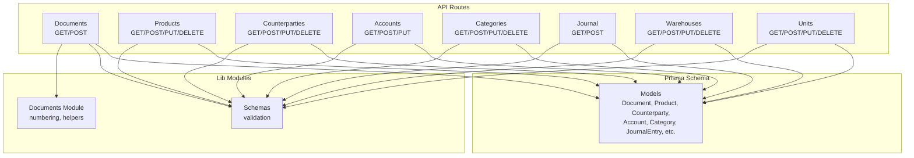
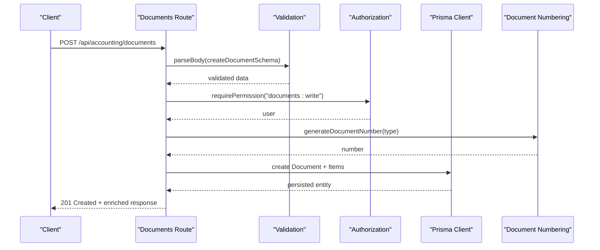
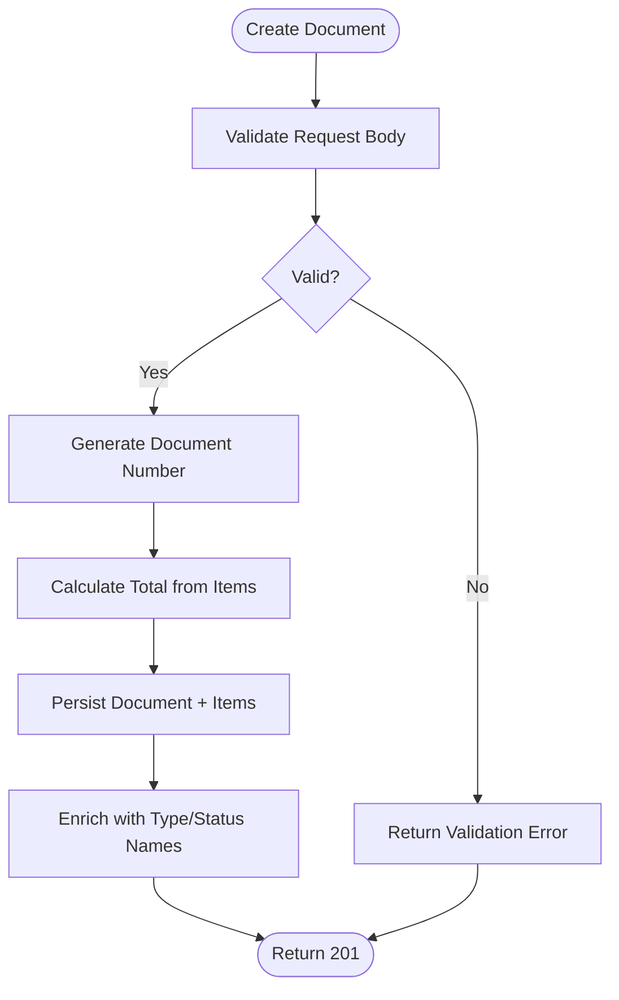
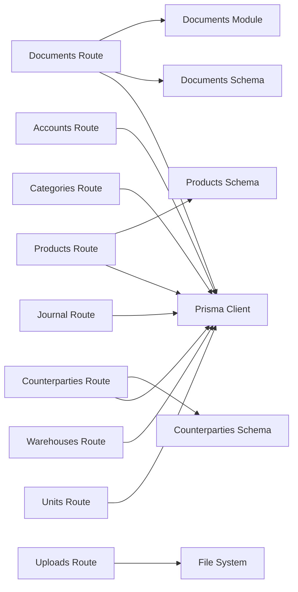
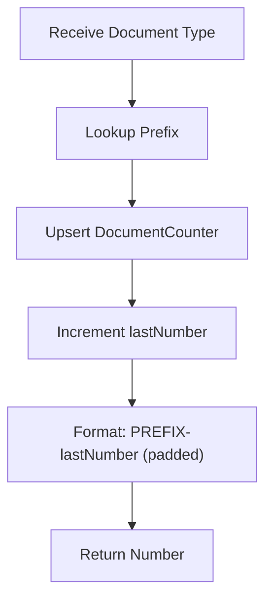
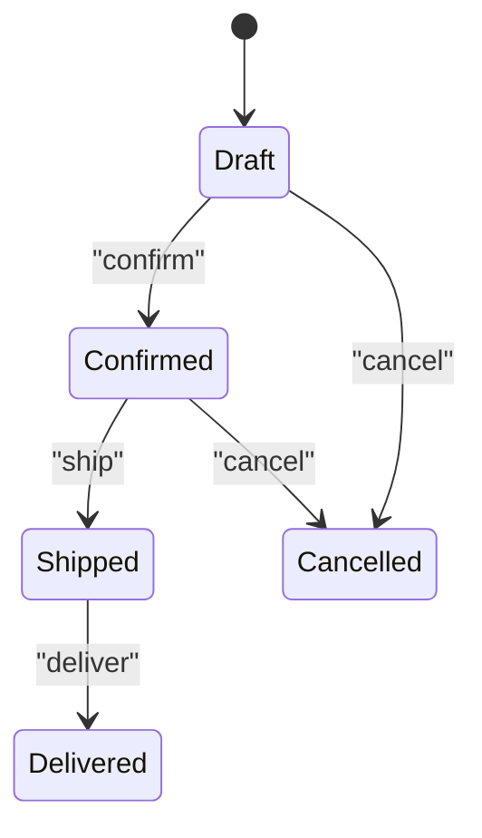
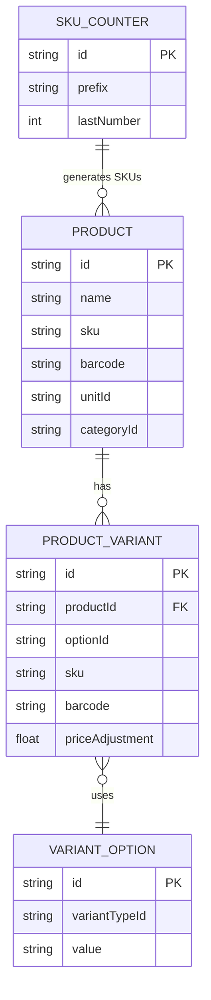
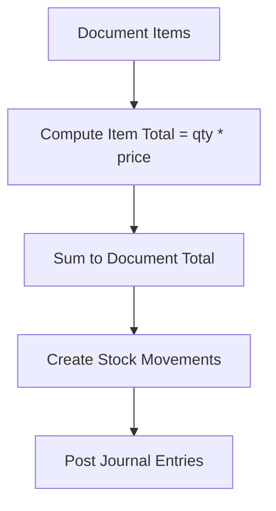

# Accounting API

<cite>
**Referenced Files in This Document**
- [documents.route.ts](file://app/api/accounting/documents/route.ts)
- [documents.schema.ts](file://lib/modules/accounting/schemas/documents.schema.ts)
- [documents.module.ts](file://lib/modules/accounting/documents.ts)
- [products.schema.ts](file://lib/modules/accounting/schemas/products.schema.ts)
- [counterparties.schema.ts](file://lib/modules/accounting/schemas/counterparties.schema.ts)
- [accounts.route.ts](file://app/api/accounting/accounts/route.ts)
- [accounts.balances.route.ts](file://app/api/accounting/accounts/balances/route.ts)
- [categories.route.ts](file://app/api/accounting/categories/route.ts)
- [categories.id.route.ts](file://app/api/accounting/categories/[id]/route.ts)
- [journal.route.ts](file://app/api/accounting/journal/route.ts)
- [journal.reverse.route.ts](file://app/api/accounting/journal/[id]/reverse/route.ts)
- [warehouses.route.ts](file://app/api/accounting/warehouses/route.ts)
- [warehouses.id.route.ts](file://app/api/accounting/warehouses/[id]/route.ts)
- [units.route.ts](file://app/api/accounting/units/route.ts)
- [units.id.route.ts](file://app/api/accounting/units/[id]/route.ts)
- [products.route.ts](file://app/api/accounting/products/route.ts)
- [products.id.route.ts](file://app/api/accounting/products/[id]/route.ts)
- [products.bulk.route.ts](file://app/api/accounting/products/bulk/route.ts)
- [products.export.route.ts](file://app/api/accounting/products/export/route.ts)
- [products.import.route.ts](file://app/api/accounting/products/import/route.ts)
- [products.id.variants.route.ts](file://app/api/accounting/products/[id]/variants/route.ts)
- [products.id.discounts.route.ts](file://app/api/accounting/products/[id]/discounts/route.ts)
- [products.id.custom-fields.route.ts](file://app/api/accounting/products/[id]/custom-fields/route.ts)
- [products.id.variant-links.route.ts](file://app/api/accounting/products/[id]/variant-links/route.ts)
- [products.id.suggestions.route.ts](file://app/api/accounting/products/[id]/suggestions/route.ts)
- [products.id.duplicate.route.ts](file://app/api/accounting/products/[id]/duplicate/route.ts)
- [counterparties.route.ts](file://app/api/accounting/counterparties/route.ts)
- [counterparties.id.route.ts](file://app/api/accounting/counterparties/[id]/route.ts)
- [counterparties.id.interactions.route.ts](file://app/api/accounting/counterparties/[id]/interactions/route.ts)
- [documents.id.route.ts](file://app/api/accounting/documents/[id]/route.ts)
- [documents.id.confirm.route.ts](file://app/api/accounting/documents/[id]/confirm/route.ts)
- [documents.id.cancel.route.ts](file://app/api/accounting/documents/[id]/cancel/route.ts)
- [documents.id.fill-inventory.route.ts](file://app/api/accounting/documents/[id]/fill-inventory/route.ts)
- [documents.id.journal.route.ts](file://app/api/accounting/documents/[id]/journal/route.ts)
- [documents.bulk-confirm.route.ts](file://app/api/accounting/documents/bulk-confirm/route.ts)
- [documents.export.route.ts](file://app/api/accounting/documents/export/route.ts)
- [upload.route.ts](file://app/api/accounting/upload/route.ts)
- [uploads.filename.route.ts](file://app/api/accounting/uploads/[filename]/route.ts)
- [schema.prisma](file://prisma/schema.prisma)
</cite>

## Table of Contents
1. [Introduction](#introduction)
2. [Project Structure](#project-structure)
3. [Core Components](#core-components)
4. [Architecture Overview](#architecture-overview)
5. [Detailed Component Analysis](#detailed-component-analysis)
6. [Dependency Analysis](#dependency-analysis)
7. [Performance Considerations](#performance-considerations)
8. [Troubleshooting Guide](#troubleshooting-guide)
9. [Conclusion](#conclusion)
10. [Appendices](#appendices)

## Introduction
This document provides comprehensive API documentation for the accounting domain endpoints. It covers CRUD operations for documents, products, counterparties, accounts, categories, journal entries, warehouses, and units. For each endpoint, you will find HTTP methods, URL patterns, request/response schemas, and validation rules. It also explains the document numbering system, state transitions, approval processes, product hierarchy with variants, SKU generation, barcode management, bulk operations, export functionality, file upload handling, validation errors, constraint violations, business rule enforcement, and integration patterns for external accounting systems and real-time synchronization.

## Project Structure
The API follows Next.js App Router conventions with route handlers under app/api. Business logic and validation schemas live in lib/modules and lib/shared. The Prisma schema defines the data model and relationships.

**Diagram sources**
- [documents.route.ts:1-136](file://app/api/accounting/documents/route.ts#L1-L136)
- [products.schema.ts:1-108](file://lib/modules/accounting/schemas/products.schema.ts#L1-L108)
- [documents.module.ts:1-144](file://lib/modules/accounting/documents.ts#L1-L144)
- [schema.prisma:38-517](file://prisma/schema.prisma#L38-L517)

**Section sources**
- [documents.route.ts:1-136](file://app/api/accounting/documents/route.ts#L1-L136)
- [schema.prisma:38-517](file://prisma/schema.prisma#L38-L517)

## Core Components
- Document numbering and state helpers
- Validation schemas for all major resources
- Route handlers implementing CRUD and specialized operations
- Data model definitions for accounting entities

Key responsibilities:
- Enforce permissions and validation
- Generate document numbers and enrich responses
- Manage inventory and financial impacts via stock movements and journal entries
- Support bulk actions, exports, and imports

**Section sources**
- [documents.module.ts:1-144](file://lib/modules/accounting/documents.ts#L1-L144)
- [documents.schema.ts:1-55](file://lib/modules/accounting/schemas/documents.schema.ts#L1-L55)
- [products.schema.ts:1-108](file://lib/modules/accounting/schemas/products.schema.ts#L1-L108)
- [counterparties.schema.ts:1-40](file://lib/modules/accounting/schemas/counterparties.schema.ts#L1-L40)

## Architecture Overview
The API is structured around resource-focused route groups. Each handler:
- Validates input using Zod schemas
- Applies permission checks
- Interacts with Prisma client
- Returns standardized JSON responses
- Handles pagination and filtering

**Diagram sources**
- [documents.route.ts:63-135](file://app/api/accounting/documents/route.ts#L63-L135)
- [documents.schema.ts:11-28](file://lib/modules/accounting/schemas/documents.schema.ts#L11-L28)
- [documents.module.ts:69-78](file://lib/modules/accounting/documents.ts#L69-L78)

## Detailed Component Analysis

### Documents
- Purpose: Create, list, update, delete documents; manage confirm/cancel; link to journal; support bulk confirm and export.
- Document numbering: Prefix per type, auto-incremented counter.
- State transitions: draft → confirmed → shipped → delivered; draft → cancelled; inventory_count triggers write-off/receipt linkage.
- Inventory and financial impact: Stock movements recorded; journal entries posted.

Endpoints:
- GET /api/accounting/documents
  - Query parameters: type, types (comma), status, warehouseId, counterpartyId, dateFrom, dateTo, search, page, limit
  - Response: { data: Document[], total, page, limit }
  - Validation: queryDocumentsSchema
- POST /api/accounting/documents
  - Request body: createDocumentSchema
  - Response: Document (201)
  - Behavior: Calculates total from items; generates number; persists items; enriches with type/status names
- GET /api/accounting/documents/[id]
  - Response: Document with enriched names
- PUT /api/accounting/documents/[id]
  - Request body: updateDocumentSchema
  - Response: Document
- DELETE /api/accounting/documents/[id]
  - Response: Deletion confirmation
- POST /api/accounting/documents/[id]/confirm
  - Response: Confirmed Document
- POST /api/accounting/documents/[id]/cancel
  - Response: Cancelled Document
- POST /api/accounting/documents/[id]/fill-inventory
  - Response: Inventory adjustment Document
- POST /api/accounting/documents/[id]/journal
  - Response: JournalEntry
- POST /api/accounting/documents/bulk-confirm
  - Request body: { ids: string[] }
  - Response: { success: true }
- GET /api/accounting/documents/export
  - Query parameters: format (csv), filters
  - Response: Export stream

Validation rules:
- type must be one of predefined DocumentType
- quantities and prices non-negative
- optional fields nullable
- pagination limits enforced

Example request (creation):
- Method: POST
- URL: /api/accounting/documents
- Body (JSON):
  - type: "incoming_shipment"
  - date: "2025-01-15"
  - warehouseId: "..."
  - counterpartyId: "..."
  - items: [{ productId: "...", quantity: 10, price: 100.0 }]

Example response (creation):
- Status: 201
- Body: Document with number, type name, status name, items, totals

**Diagram sources**
- [documents.route.ts:63-135](file://app/api/accounting/documents/route.ts#L63-L135)
- [documents.schema.ts:11-28](file://lib/modules/accounting/schemas/documents.schema.ts#L11-L28)
- [documents.module.ts:69-78](file://lib/modules/accounting/documents.ts#L69-L78)

**Section sources**
- [documents.route.ts:1-136](file://app/api/accounting/documents/route.ts#L1-L136)
- [documents.schema.ts:1-55](file://lib/modules/accounting/schemas/documents.schema.ts#L1-L55)
- [documents.module.ts:1-144](file://lib/modules/accounting/documents.ts#L1-L144)

### Products
- Purpose: CRUD products; manage variants, discounts, custom fields; bulk actions; import/export.
- Product hierarchy: Master product with child variants; variant links for grouping.
- SKU/barcode: Auto-generated or manual; unique constraints enforced.
- Pricing: Purchase/sale prices; discounts; variant price adjustments.

Endpoints:
- GET /api/accounting/products
  - Query: search, categoryId, active, published, hasDiscount, variantStatus, sortBy, sortOrder, page, limit
  - Response: { data: Product[], total, page, limit }
- POST /api/accounting/products
  - Request: createProductSchema
  - Response: Product
- GET /api/accounting/products/[id]
- PUT /api/accounting/products/[id]
  - Request: updateProductSchema
- DELETE /api/accounting/products/[id]
- POST /api/accounting/products/[id]/variants
  - Request: createVariantSchema
- POST /api/accounting/products/[id]/discounts
  - Request: createDiscountSchema
- PUT /api/accounting/products/[id]/custom-fields
  - Request: updateCustomFieldValuesSchema
- POST /api/accounting/products/[id]/variant-links
  - Request: createVariantLinkSchema
- GET /api/accounting/products/[id]/suggestions
  - Response: Suggestions
- POST /api/accounting/products/[id]/duplicate
  - Response: Duplicate Product
- POST /api/accounting/products/bulk
  - Request: bulkProductActionSchema
- GET /api/accounting/products/export
  - Query: format (csv), filters, columns
- POST /api/accounting/products/import
  - Request: importProductsSchema

Validation rules:
- Name and unitId required
- Prices coerce to non-negative numbers
- Discounts positive values
- Bulk action requires at least one product ID

Example request (import):
- Method: POST
- URL: /api/accounting/products/import
- Body (JSON):
  - products: [{ name: "Widget", unitName: "pcs", purchasePrice: 50, salePrice: 100 }]
  - updateExisting: true

Example response (import):
- Status: 200
- Body: Import summary

**Section sources**
- [products.schema.ts:1-108](file://lib/modules/accounting/schemas/products.schema.ts#L1-L108)
- [schema.prisma:108-166](file://prisma/schema.prisma#L108-L166)
- [schema.prisma:229-250](file://prisma/schema.prisma#L229-L250)

### Counterparties
- Purpose: CRUD counterparties; manage interactions.
- Types: customer, supplier, both.
- Integrations: linked to e-commerce customers.

Endpoints:
- GET /api/accounting/counterparties
  - Query: search, type, active, page, limit
  - Response: { data: Counterparty[], total, page, limit }
- POST /api/accounting/counterparties
  - Request: createCounterpartySchema
- GET /api/accounting/counterparties/[id]
- PUT /api/accounting/counterparties/[id]
  - Request: updateCounterpartySchema
- DELETE /api/accounting/counterparties/[id]
- POST /api/accounting/counterparties/[id]/interactions
  - Request: createInteractionSchema

Validation rules:
- Name required
- Optional contact fields
- Pagination limits

Example request (interaction):
- Method: POST
- URL: /api/accounting/counterparties/[id]/interactions
- Body (JSON):
  - type: "call"
  - subject: "Follow-up"

Example response (interaction):
- Status: 201
- Body: Interaction

**Section sources**
- [counterparties.schema.ts:1-40](file://lib/modules/accounting/schemas/counterparties.schema.ts#L1-L40)
- [schema.prisma:309-340](file://prisma/schema.prisma#L309-L340)

### Accounts
- Purpose: Chart of accounts; balances endpoint.
- Categories: asset, liability, equity, income, expense, off_balance.
- Types: active, passive, active_passive.
- Analytics: optional analytics type (counterparty, warehouse, product).

Endpoints:
- GET /api/accounting/accounts
- POST /api/accounting/accounts
- PUT /api/accounting/accounts/[id]
- DELETE /api/accounting/accounts/[id]
- GET /api/accounting/accounts/balances
  - Query: filters by account/category/date range
  - Response: Balances

Validation rules:
- Code uniqueness
- Required name and type
- Optional parent-child hierarchy

**Section sources**
- [schema.prisma:934-954](file://prisma/schema.prisma#L934-L954)
- [schema.prisma:956-1001](file://prisma/schema.prisma#L956-L1001)
- [accounts.route.ts](file://app/api/accounting/accounts/route.ts)
- [accounts.balances.route.ts](file://app/api/accounting/accounts/balances/route.ts)

### Categories
- Purpose: Product categories tree.
- Hierarchical: parent-child relations.

Endpoints:
- GET /api/accounting/categories
- POST /api/accounting/categories
- GET /api/accounting/categories/[id]
- PUT /api/accounting/categories/[id]
- DELETE /api/accounting/categories/[id]

Validation rules:
- Name required
- Unique ordering

**Section sources**
- [schema.prisma:92-106](file://prisma/schema.prisma#L92-L106)
- [categories.route.ts](file://app/api/accounting/categories/route.ts)
- [categories.id.route.ts](file://app/api/accounting/categories/[id]/route.ts)

### Journal Entries
- Purpose: Manual and source-driven journal entries; reversal support.
- Lines: debit/credit entries mapped to accounts and analytics dimensions.

Endpoints:
- GET /api/accounting/journal
- POST /api/accounting/journal
- POST /api/accounting/journal/[id]/reverse
  - Response: Reversal JournalEntry

Validation rules:
- Debit/Credit numeric
- Source linkage optional

**Section sources**
- [schema.prisma:956-1001](file://prisma/schema.prisma#L956-L1001)
- [journal.route.ts](file://app/api/accounting/journal/route.ts)
- [journal.reverse.route.ts](file://app/api/accounting/journal/[id]/reverse/route.ts)

### Warehouses
- Purpose: Storage locations; stock records and movements.
- Relations: documents, transfers.

Endpoints:
- GET /api/accounting/warehouses
- POST /api/accounting/warehouses
- GET /api/accounting/warehouses/[id]
- PUT /api/accounting/warehouses/[id]
- DELETE /api/accounting/warehouses/[id]

Validation rules:
- Name required
- Optional address/responsible

**Section sources**
- [schema.prisma:369-384](file://prisma/schema.prisma#L369-L384)
- [warehouses.route.ts](file://app/api/accounting/warehouses/route.ts)
- [warehouses.id.route.ts](file://app/api/accounting/warehouses/[id]/route.ts)

### Units
- Purpose: Measurement units; product association.
- Uniqueness: shortName unique.

Endpoints:
- GET /api/accounting/units
- POST /api/accounting/units
- GET /api/accounting/units/[id]
- PUT /api/accounting/units/[id]
- DELETE /api/accounting/units/[id]

Validation rules:
- Name and shortName required
- shortName unique

**Section sources**
- [schema.prisma:81-90](file://prisma/schema.prisma#L81-L90)
- [units.route.ts](file://app/api/accounting/units/route.ts)
- [units.id.route.ts](file://app/api/accounting/units/[id]/route.ts)

### Uploads
- Purpose: File upload handling; temporary storage.
- Endpoints:
  - POST /api/accounting/upload
  - GET /api/accounting/uploads/[filename]

Typical flow:
- Client uploads file
- Server stores under uploads directory
- Return download URL or metadata

**Section sources**
- [upload.route.ts](file://app/api/accounting/upload/route.ts)
- [uploads.filename.route.ts](file://app/api/accounting/uploads/[filename]/route.ts)

## Dependency Analysis
The API depends on:
- Prisma models for data persistence
- Zod schemas for validation
- Permission helpers for authorization
- Document numbering module for document sequences

**Diagram sources**
- [documents.route.ts:1-136](file://app/api/accounting/documents/route.ts#L1-L136)
- [documents.module.ts:1-144](file://lib/modules/accounting/documents.ts#L1-L144)
- [documents.schema.ts:1-55](file://lib/modules/accounting/schemas/documents.schema.ts#L1-L55)
- [products.schema.ts:1-108](file://lib/modules/accounting/schemas/products.schema.ts#L1-L108)
- [counterparties.schema.ts:1-40](file://lib/modules/accounting/schemas/counterparties.schema.ts#L1-L40)
- [schema.prisma:38-517](file://prisma/schema.prisma#L38-L517)

**Section sources**
- [schema.prisma:38-517](file://prisma/schema.prisma#L38-L517)

## Performance Considerations
- Pagination: Use page and limit parameters; max limit enforced in schemas.
- Filtering: Prefer indexed fields (type, status, date) for efficient queries.
- Includes: Limit included relations; avoid unnecessary joins.
- Batch operations: Use bulk endpoints for mass updates.
- Validation: Early validation prevents unnecessary DB calls.

## Troubleshooting Guide
Common validation errors:
- Missing required fields (e.g., name, unitId)
- Non-positive numbers for quantities/prices
- Invalid enums (type, status, paymentType)
- Exceeded pagination limits

Constraint violations:
- Unique SKU/barcode
- Unique unit shortName
- Unique category/account codes
- Unique counterparty identifiers

Business rule enforcement:
- Document numbering per type
- Stock movement direction based on document type
- Counterparty balance impact for payment and shipment types
- Inventory count does not directly affect stock; creates linked documents

Integration tips:
- Use webhook idempotency table to prevent duplicate processing
- Map external IDs to internal entities
- Validate and normalize data before persisting

**Section sources**
- [documents.schema.ts:1-55](file://lib/modules/accounting/schemas/documents.schema.ts#L1-L55)
- [products.schema.ts:1-108](file://lib/modules/accounting/schemas/products.schema.ts#L1-L108)
- [counterparties.schema.ts:1-40](file://lib/modules/accounting/schemas/counterparties.schema.ts#L1-L40)
- [schema.prisma:279-283](file://prisma/schema.prisma#L279-L283)
- [schema.prisma:1057-1066](file://prisma/schema.prisma#L1057-L1066)

## Conclusion
The Accounting API provides a comprehensive set of endpoints for managing documents, products, counterparties, accounts, categories, journal entries, warehouses, and units. It enforces strong validation, supports bulk operations and exports, manages document numbering and state transitions, and integrates with Prisma for robust persistence. The design emphasizes clarity, scalability, and adherence to business rules.

## Appendices

### Document Numbering System
- Prefixes per DocumentType
- Upsert counter increments lastNumber
- Format: "{PREFIX}-{NNNNN}"

**Diagram sources**
- [documents.module.ts:69-78](file://lib/modules/accounting/documents.ts#L69-L78)
- [schema.prisma:446-450](file://prisma/schema.prisma#L446-L450)

**Section sources**
- [documents.module.ts:1-144](file://lib/modules/accounting/documents.ts#L1-L144)
- [schema.prisma:446-450](file://prisma/schema.prisma#L446-L450)

### State Transitions and Approval
- Typical flow: draft → confirmed → shipped → delivered
- Special: inventory_count creates linked documents
- Approval: confirm/cancel endpoints
- Reversal: journal reversal endpoint

**Diagram sources**
- [documents.module.ts:37-43](file://lib/modules/accounting/documents.ts#L37-L43)
- [documents.id.confirm.route.ts](file://app/api/accounting/documents/[id]/confirm/route.ts)
- [documents.id.cancel.route.ts](file://app/api/accounting/documents/[id]/cancel/route.ts)

**Section sources**
- [schema.prisma:38-44](file://prisma/schema.prisma#L38-L44)
- [documents.module.ts:37-43](file://lib/modules/accounting/documents.ts#L37-L43)

### Product Hierarchy, Variants, SKU, Barcode
- Master/child variants
- Variant options and price adjustments
- SKU auto-generation counter
- Unique constraints on SKU/barcode

**Diagram sources**
- [schema.prisma:108-166](file://prisma/schema.prisma#L108-L166)
- [schema.prisma:229-250](file://prisma/schema.prisma#L229-L250)
- [schema.prisma:279-283](file://prisma/schema.prisma#L279-L283)

**Section sources**
- [schema.prisma:108-166](file://prisma/schema.prisma#L108-L166)
- [schema.prisma:229-250](file://prisma/schema.prisma#L229-L250)
- [schema.prisma:279-283](file://prisma/schema.prisma#L279-L283)

### Pricing Calculations and Inventory Movements
- Document items compute totals
- Stock movements reflect receipts/shipments/transfers
- Journal entries record debits/credits

**Diagram sources**
- [documents.route.ts:83-99](file://app/api/accounting/documents/route.ts#L83-L99)
- [schema.prisma:416-440](file://prisma/schema.prisma#L416-L440)
- [schema.prisma:956-1001](file://prisma/schema.prisma#L956-L1001)

**Section sources**
- [documents.route.ts:83-99](file://app/api/accounting/documents/route.ts#L83-L99)
- [schema.prisma:416-440](file://prisma/schema.prisma#L416-L440)
- [schema.prisma:956-1001](file://prisma/schema.prisma#L956-L1001)

### Example Requests and Responses
- Document creation:
  - Method: POST
  - URL: /api/accounting/documents
  - Body: { type, date, warehouseId, counterpartyId, items[], ... }
  - Response: 201 with enriched Document

- Product import:
  - Method: POST
  - URL: /api/accounting/products/import
  - Body: { products[], updateExisting }
  - Response: Import summary

- Bulk confirm documents:
  - Method: POST
  - URL: /api/accounting/documents/bulk-confirm
  - Body: { ids: [...] }
  - Response: { success: true }

- Export products:
  - Method: GET
  - URL: /api/accounting/products/export?format=csv&columns=name,sku
  - Response: CSV stream

- Upload file:
  - Method: POST
  - URL: /api/accounting/upload
  - Body: multipart/form-data
  - Response: Upload metadata

**Section sources**
- [documents.route.ts:63-135](file://app/api/accounting/documents/route.ts#L63-L135)
- [products.schema.ts:92-107](file://lib/modules/accounting/schemas/products.schema.ts#L92-L107)
- [documents.bulk-confirm.route.ts](file://app/api/accounting/documents/bulk-confirm/route.ts)
- [products.export.route.ts](file://app/api/accounting/products/export/route.ts)
- [upload.route.ts](file://app/api/accounting/upload/route.ts)