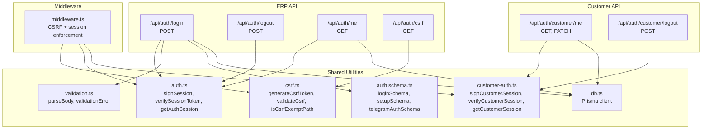
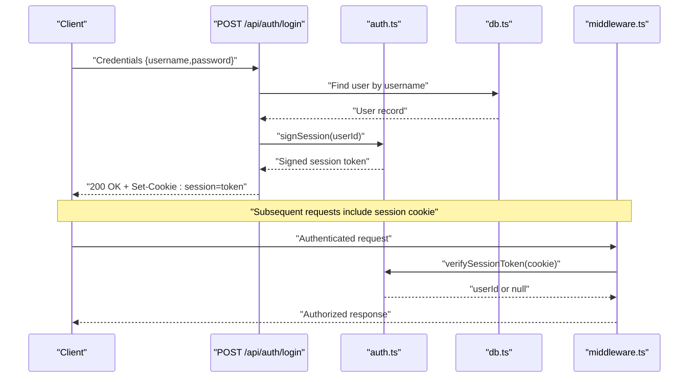
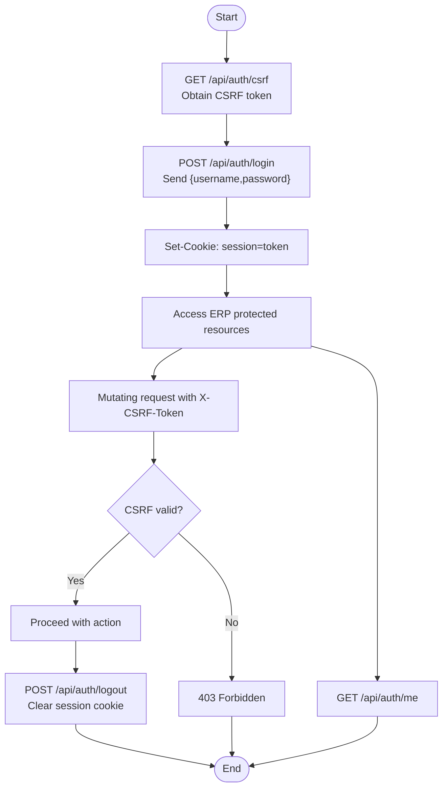
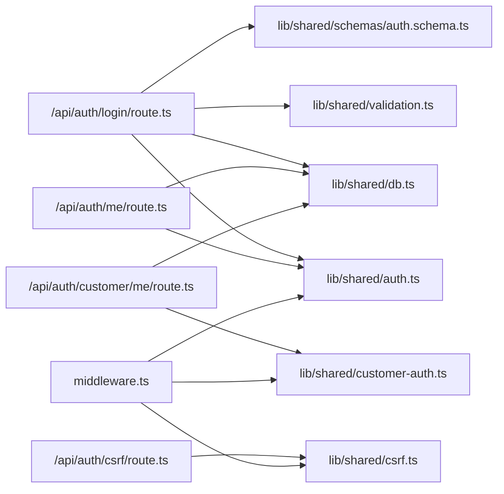

# Authentication API

<cite>
**Referenced Files in This Document**
- [login/route.ts](file://app/api/auth/login/route.ts)
- [logout/route.ts](file://app/api/auth/logout/route.ts)
- [me/route.ts](file://app/api/auth/me/route.ts)
- [csrf/route.ts](file://app/api/auth/csrf/route.ts)
- [customer/logout/route.ts](file://app/api/auth/customer/logout/route.ts)
- [customer/me/route.ts](file://app/api/auth/customer/me/route.ts)
- [auth.ts](file://lib/shared/auth.ts)
- [customer-auth.ts](file://lib/shared/customer-auth.ts)
- [csrf.ts](file://lib/shared/csrf.ts)
- [middleware.ts](file://middleware.ts)
- [auth.schema.ts](file://lib/shared/schemas/auth.schema.ts)
- [page.tsx](file://app/login/page.tsx)
- [auth.test.ts](file://tests/integration/api/auth.test.ts)
- [schema.prisma](file://prisma/schema.prisma)
- [db.ts](file://lib/shared/db.ts)
- [validation.ts](file://lib/shared/validation.ts)
</cite>

## Table of Contents
1. [Introduction](#introduction)
2. [Project Structure](#project-structure)
3. [Core Components](#core-components)
4. [Architecture Overview](#architecture-overview)
5. [Detailed Component Analysis](#detailed-component-analysis)
6. [Dependency Analysis](#dependency-analysis)
7. [Performance Considerations](#performance-considerations)
8. [Troubleshooting Guide](#troubleshooting-guide)
9. [Conclusion](#conclusion)

## Introduction
This document provides comprehensive API documentation for the authentication system. It covers login, logout, session management, and user profile endpoints for the ERP (accounting) domain. It also documents CSRF protection, cookie-based session handling, and the authentication flow from login through session maintenance to logout. Guidance is included for client implementation, error handling, and security considerations.

## Project Structure
Authentication endpoints are located under the Next.js app router at app/api/auth. Supporting utilities reside in lib/shared and are consumed by middleware.ts for CSRF protection and session enforcement.

**Diagram sources**
- [login/route.ts:1-60](file://app/api/auth/login/route.ts#L1-L60)
- [logout/route.ts:1-14](file://app/api/auth/logout/route.ts#L1-L14)
- [me/route.ts:1-11](file://app/api/auth/me/route.ts#L1-L11)
- [csrf/route.ts:1-42](file://app/api/auth/csrf/route.ts#L1-L42)
- [customer/me/route.ts:1-42](file://app/api/auth/customer/me/route.ts#L1-L42)
- [customer/logout/route.ts:1-16](file://app/api/auth/customer/logout/route.ts#L1-L16)
- [auth.ts:1-89](file://lib/shared/auth.ts#L1-L89)
- [customer-auth.ts:1-100](file://lib/shared/customer-auth.ts#L1-L100)
- [csrf.ts:1-140](file://lib/shared/csrf.ts#L1-L140)
- [validation.ts:1-63](file://lib/shared/validation.ts#L1-L63)
- [auth.schema.ts:1-25](file://lib/shared/schemas/auth.schema.ts#L1-L25)
- [db.ts:1-25](file://lib/shared/db.ts#L1-L25)
- [middleware.ts:1-169](file://middleware.ts#L1-L169)

**Section sources**
- [login/route.ts:1-60](file://app/api/auth/login/route.ts#L1-L60)
- [logout/route.ts:1-14](file://app/api/auth/logout/route.ts#L1-L14)
- [me/route.ts:1-11](file://app/api/auth/me/route.ts#L1-L11)
- [csrf/route.ts:1-42](file://app/api/auth/csrf/route.ts#L1-L42)
- [customer/me/route.ts:1-42](file://app/api/auth/customer/me/route.ts#L1-L42)
- [customer/logout/route.ts:1-16](file://app/api/auth/customer/logout/route.ts#L1-L16)
- [auth.ts:1-89](file://lib/shared/auth.ts#L1-L89)
- [customer-auth.ts:1-100](file://lib/shared/customer-auth.ts#L1-L100)
- [csrf.ts:1-140](file://lib/shared/csrf.ts#L1-L140)
- [validation.ts:1-63](file://lib/shared/validation.ts#L1-L63)
- [auth.schema.ts:1-25](file://lib/shared/schemas/auth.schema.ts#L1-L25)
- [db.ts:1-25](file://lib/shared/db.ts#L1-L25)
- [middleware.ts:1-169](file://middleware.ts#L1-L169)

## Core Components
- ERP Cookie-based Session
  - Login sets a session cookie named session with HttpOnly, SameSite lax, and configurable Secure flag.
  - Middleware enforces session presence for ERP routes and redirects unauthenticated users to /login.
- CSRF Protection
  - CSRF token retrieval via GET /api/auth/csrf returns a signed token and sets a CSRF cookie.
  - Middleware validates CSRF tokens for mutating requests unless exempt.
- User Profile Endpoint
  - GET /api/auth/me returns the authenticated user or 401.
- Customer Authentication (E-commerce)
  - Separate customer_session cookie and endpoints for profile and logout.
- Validation and Schemas
  - Zod schemas define request body validation for login and setup.
  - Shared validation utilities parse and normalize errors.

**Section sources**
- [login/route.ts:37-52](file://app/api/auth/login/route.ts#L37-L52)
- [logout/route.ts:3-12](file://app/api/auth/logout/route.ts#L3-L12)
- [me/route.ts:4-10](file://app/api/auth/me/route.ts#L4-L10)
- [csrf/route.ts:14-41](file://app/api/auth/csrf/route.ts#L14-L41)
- [middleware.ts:124-156](file://middleware.ts#L124-L156)
- [auth.ts:18-83](file://lib/shared/auth.ts#L18-L83)
- [csrf.ts:77-114](file://lib/shared/csrf.ts#L77-L114)
- [auth.schema.ts:3-7](file://lib/shared/schemas/auth.schema.ts#L3-L7)
- [validation.ts:14-30](file://lib/shared/validation.ts#L14-L30)

## Architecture Overview
The authentication flow integrates route handlers, shared utilities, and middleware. Login creates a signed session token and stores it in a cookie. Subsequent requests rely on the presence of the session cookie. CSRF protection is enforced for mutating API requests.

**Diagram sources**
- [login/route.ts:9-58](file://app/api/auth/login/route.ts#L9-L58)
- [auth.ts:18-83](file://lib/shared/auth.ts#L18-L83)
- [db.ts:1-25](file://lib/shared/db.ts#L1-L25)
- [middleware.ts:124-130](file://middleware.ts#L124-L130)

## Detailed Component Analysis

### Login Endpoint
- Method and Path
  - POST /api/auth/login
- Purpose
  - Authenticate ERP user with username and password, returning user info and setting a session cookie.
- Request Schema
  - Body fields:
    - username: string, required
    - password: string, required
- Response
  - 200 OK on success with user object { id, username, role }.
  - 400 Bad Request on validation error.
  - 401 Unauthorized on invalid credentials or inactive user.
  - 500 Internal Server Error on unexpected failure.
- Cookies
  - Sets session cookie with:
    - Name: session
    - HttpOnly: true
    - Secure: configurable via environment
    - SameSite: lax
    - Max-Age: 604800 seconds (7 days)
    - Path: /
- Security Notes
  - Password verification uses bcrypt comparison.
  - Session token is signed with HMAC-SHA256 using SESSION_SECRET.
- Example Requests and Responses
  - Request: POST /api/auth/login with { username, password }
  - Success Response: { user: { id, username, role } }
  - Error Response: { error: "Invalid credentials" } (401)
- Error Scenarios
  - Missing fields: 400 with field errors.
  - Wrong password or non-existent user: 401.
  - Server errors: 500.

**Section sources**
- [login/route.ts:9-58](file://app/api/auth/login/route.ts#L9-L58)
- [auth.schema.ts:3-7](file://lib/shared/schemas/auth.schema.ts#L3-L7)
- [validation.ts:54-62](file://lib/shared/validation.ts#L54-L62)
- [auth.ts:18-24](file://lib/shared/auth.ts#L18-L24)

### Logout Endpoint
- Method and Path
  - POST /api/auth/logout
- Purpose
  - Invalidate the ERP session by clearing the session cookie.
- Response
  - 200 OK with { success: true }.
- Cookies
  - Clears session cookie with:
    - Max-Age: 0
    - Other attributes as per login cookie policy.
- Example Requests and Responses
  - Request: POST /api/auth/logout
  - Response: { success: true }

**Section sources**
- [logout/route.ts:3-12](file://app/api/auth/logout/route.ts#L3-L12)

### Session Management and User Profile
- Get Current User
  - GET /api/auth/me
  - Returns authenticated user or 401 Unauthorized.
- Session Verification
  - Middleware checks session cookie presence for ERP routes.
  - On presence, verifies token signature and expiry; rejects invalid sessions.
- Example Requests and Responses
  - Request: GET /api/auth/me (with session cookie)
  - Response: { user: { id, username, role, isActive } }
  - Unauthorized Response: { error: "Unauthorized" } (401)

**Section sources**
- [me/route.ts:4-10](file://app/api/auth/me/route.ts#L4-L10)
- [middleware.ts:124-130](file://middleware.ts#L124-L130)
- [auth.ts:62-83](file://lib/shared/auth.ts#L62-L83)

### CSRF Protection
- Obtain CSRF Token
  - GET /api/auth/csrf
  - Returns { token, message } and sets HttpOnly CSRF cookie.
  - Header guidance: include token in X-CSRF-Token header for mutating requests.
- Validation
  - Middleware validates CSRF for mutating methods (POST, PUT, PATCH, DELETE) unless exempt.
  - Exempt paths include login, CSRF endpoint itself, webhooks, and selected e-commerce routes.
- Example Requests and Responses
  - Request: GET /api/auth/csrf
  - Response: { token, message }
  - Mutating Request: POST /api/some/resource with X-CSRF-Token header
- Error Scenarios
  - Missing or invalid CSRF cookie/token: 403 Forbidden with details.

**Section sources**
- [csrf/route.ts:14-41](file://app/api/auth/csrf/route.ts#L14-L41)
- [csrf.ts:77-114](file://lib/shared/csrf.ts#L77-L114)
- [middleware.ts:132-156](file://middleware.ts#L132-L156)
- [csrf.ts:127-137](file://lib/shared/csrf.ts#L127-L137)

### Customer Authentication (E-commerce)
- Customer Session Cookie
  - customer_session cookie is used for e-commerce flows.
- Endpoints
  - GET /api/auth/customer/me: returns authenticated customer or 401.
  - PATCH /api/auth/customer/me: updates profile fields (name, phone, email).
  - POST /api/auth/customer/logout: clears customer_session cookie.
- Validation
  - Profile update uses Zod schema with optional fields and length/email constraints.
- Example Requests and Responses
  - Request: PATCH /api/auth/customer/me with { name, phone, email }
  - Response: Updated customer object
  - Unauthorized Response: { error: "Unauthorized" } (401)

**Section sources**
- [customer/me/route.ts:6-41](file://app/api/auth/customer/me/route.ts#L6-L41)
- [customer/logout/route.ts:4-14](file://app/api/auth/customer/logout/route.ts#L4-L14)
- [customer-auth.ts:48-68](file://lib/shared/customer-auth.ts#L48-L68)
- [auth.schema.ts:15-24](file://lib/shared/schemas/auth.schema.ts#L15-L24)

### Authentication Flow Diagram

**Diagram sources**
- [csrf/route.ts:14-41](file://app/api/auth/csrf/route.ts#L14-L41)
- [login/route.ts:9-58](file://app/api/auth/login/route.ts#L9-L58)
- [me/route.ts:4-10](file://app/api/auth/me/route.ts#L4-L10)
- [csrf.ts:77-114](file://lib/shared/csrf.ts#L77-L114)
- [logout/route.ts:3-12](file://app/api/auth/logout/route.ts#L3-L12)

## Dependency Analysis
Authentication relies on shared utilities for signing/verifying tokens, validating requests, and enforcing CSRF/session policies. Middleware orchestrates enforcement across routes.

**Diagram sources**
- [login/route.ts:1-7](file://app/api/auth/login/route.ts#L1-L7)
- [me/route.ts:1-2](file://app/api/auth/me/route.ts#L1-L2)
- [csrf/route.ts:1-6](file://app/api/auth/csrf/route.ts#L1-L6)
- [customer/me/route.ts:1-4](file://app/api/auth/customer/me/route.ts#L1-L4)
- [auth.ts:1-11](file://lib/shared/auth.ts#L1-L11)
- [customer-auth.ts:1-14](file://lib/shared/customer-auth.ts#L1-L14)
- [csrf.ts:1-11](file://lib/shared/csrf.ts#L1-L11)
- [validation.ts:1-2](file://lib/shared/validation.ts#L1-L2)
- [auth.schema.ts:1-1](file://lib/shared/schemas/auth.schema.ts#L1-L1)
- [db.ts:1-4](file://lib/shared/db.ts#L1-L4)
- [middleware.ts:1-8](file://middleware.ts#L1-L8)

**Section sources**
- [middleware.ts:124-156](file://middleware.ts#L124-L156)
- [auth.ts:62-83](file://lib/shared/auth.ts#L62-L83)
- [customer-auth.ts:48-68](file://lib/shared/customer-auth.ts#L48-L68)
- [csrf.ts:77-114](file://lib/shared/csrf.ts#L77-L114)

## Performance Considerations
- Session Verification
  - Token verification performs HMAC comparison and database lookup; keep SESSION_SECRET strong and consistent.
- CSRF Validation
  - Minimal overhead; ensure CSRF cookie is set once per session to reduce repeated token generation.
- Rate Limiting
  - Middleware includes rate limiting hooks; consider enabling for login attempts to mitigate brute force.
- Cookie Attributes
  - HttpOnly and SameSite settings improve security; Secure flag should be enabled in production HTTPS environments.

[No sources needed since this section provides general guidance]

## Troubleshooting Guide
- Common Errors
  - 400 Validation Error: Incorrect or missing fields in request body; inspect returned fields map.
  - 401 Unauthorized: Missing or invalid session cookie; re-login and ensure cookies are accepted.
  - 403 CSRF Failure: Missing or mismatched X-CSRF-Token; call GET /api/auth/csrf and include the token.
  - 500 Server Error: Unexpected failures; check server logs and environment variables.
- CSRF Token Issues
  - Ensure the CSRF cookie is set and readable by the browser; verify SameSite and Secure flags match deployment.
- Session Expiration
  - Session cookie has a 7-day max age; if expired, re-authenticate.
- Testing
  - Integration tests demonstrate expected behavior for login, setup, and profile endpoints.

**Section sources**
- [auth.test.ts:92-170](file://tests/integration/api/auth.test.ts#L92-L170)
- [csrf.ts:77-114](file://lib/shared/csrf.ts#L77-L114)
- [login/route.ts:53-58](file://app/api/auth/login/route.ts#L53-L58)

## Conclusion
The authentication system uses cookie-based sessions for ERP users, with robust CSRF protection and clear session enforcement via middleware. Customer authentication is separated into a dedicated customer session. Clients should obtain CSRF tokens for mutating requests, maintain session cookies, and handle 401/403 responses appropriately. The provided endpoints and utilities enable secure, predictable authentication flows across the application.