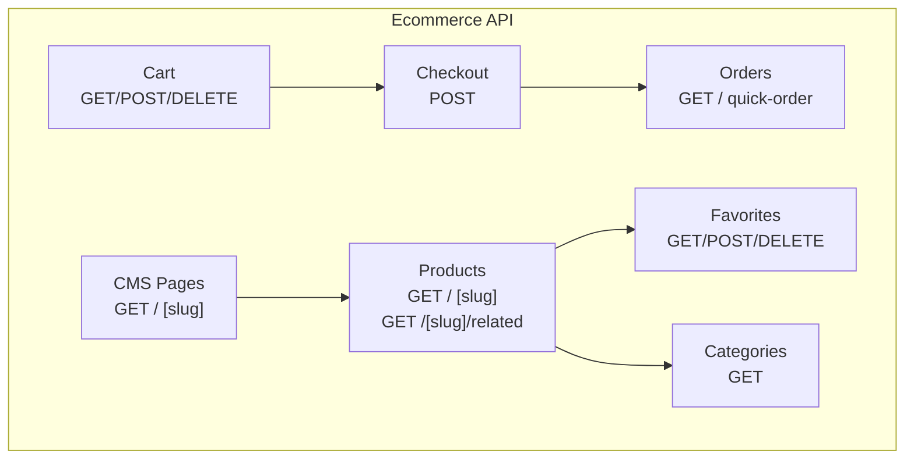
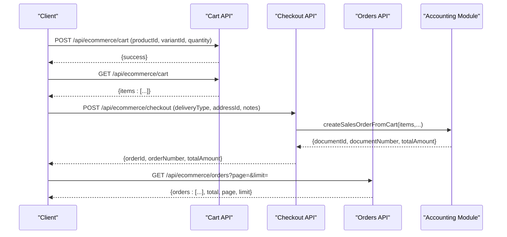
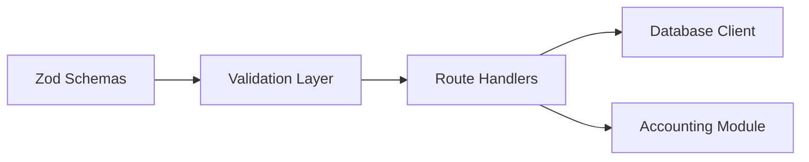

# E-commerce API

<cite>
**Referenced Files in This Document**
- [cart/route.ts](file://app/api/ecommerce/cart/route.ts)
- [products/route.ts](file://app/api/ecommerce/products/route.ts)
- [products/[slug]/route.ts](file://app/api/ecommerce/products/[slug]/route.ts)
- [products/[slug]/related/route.ts](file://app/api/ecommerce/products/[slug]/related/route.ts)
- [orders/route.ts](file://app/api/ecommerce/orders/route.ts)
- [orders/quick-order/route.ts](file://app/api/ecommerce/orders/quick-order/route.ts)
- [checkout/route.ts](file://app/api/ecommerce/checkout/route.ts)
- [categories/route.ts](file://app/api/ecommerce/categories/route.ts)
- [cms-pages/route.ts](file://app/api/ecommerce/cms-pages/route.ts)
- [cms-pages/[slug]/route.ts](file://app/api/ecommerce/cms-pages/[slug]/route.ts)
- [favorites/route.ts](file://app/api/ecommerce/favorites/route.ts)
- [cart.schema.ts](file://lib/modules/ecommerce/schemas/cart.schema.ts)
- [products.schema.ts](file://lib/modules/ecommerce/schemas/products.schema.ts)
- [favorites.schema.ts](file://lib/modules/ecommerce/schemas/favorites.schema.ts)
</cite>

## Table of Contents
1. [Introduction](#introduction)
2. [Project Structure](#project-structure)
3. [Core Components](#core-components)
4. [Architecture Overview](#architecture-overview)
5. [Detailed Component Analysis](#detailed-component-analysis)
6. [Dependency Analysis](#dependency-analysis)
7. [Performance Considerations](#performance-considerations)
8. [Troubleshooting Guide](#troubleshooting-guide)
9. [Conclusion](#conclusion)
10. [Appendices](#appendices)

## Introduction
This document provides comprehensive API documentation for the e-commerce domain endpoints. It covers shopping cart management, order processing, product catalog, CMS pages, and customer favorites. For each endpoint, we specify HTTP methods, URL patterns, request/response schemas, and business logic. We also explain product filtering, cart operations, order states, delivery calculations, product recommendation algorithms, inventory synchronization, pricing updates, search functionality, category navigation, promotional content management, delivery estimation, address validation, payment integration patterns, and integration guidelines for external shipping providers and payment processors.

## Project Structure
The e-commerce API is organized under app/api/ecommerce with dedicated routes for:
- Cart: add/update/remove items, list items
- Products: list products with filters, product detail by slug, related products
- Orders: list customer orders, quick order for guests
- Checkout: place order from cart
- Categories: category tree
- CMS Pages: list pages, page by slug
- Favorites: manage favorites list

**Diagram sources**
- [cart/route.ts:1-189](file://app/api/ecommerce/cart/route.ts#L1-L189)
- [products/route.ts:1-163](file://app/api/ecommerce/products/route.ts#L1-L163)
- [products/[slug]/route.ts](file://app/api/ecommerce/products/[slug]/route.ts#L1-L218)
- [products/[slug]/related/route.ts](file://app/api/ecommerce/products/[slug]/related/route.ts#L1-L105)
- [orders/route.ts:1-64](file://app/api/ecommerce/orders/route.ts#L1-L64)
- [orders/quick-order/route.ts:1-119](file://app/api/ecommerce/orders/quick-order/route.ts#L1-L119)
- [checkout/route.ts:1-100](file://app/api/ecommerce/checkout/route.ts#L1-L100)
- [categories/route.ts:1-49](file://app/api/ecommerce/categories/route.ts#L1-L49)
- [cms-pages/route.ts:1-37](file://app/api/ecommerce/cms-pages/route.ts#L1-L37)
- [cms-pages/[slug]/route.ts](file://app/api/ecommerce/cms-pages/[slug]/route.ts#L1-L39)
- [favorites/route.ts:1-172](file://app/api/ecommerce/favorites/route.ts#L1-L172)

**Section sources**
- [cart/route.ts:1-189](file://app/api/ecommerce/cart/route.ts#L1-L189)
- [products/route.ts:1-163](file://app/api/ecommerce/products/route.ts#L1-L163)
- [orders/route.ts:1-64](file://app/api/ecommerce/orders/route.ts#L1-L64)
- [checkout/route.ts:1-100](file://app/api/ecommerce/checkout/route.ts#L1-L100)
- [categories/route.ts:1-49](file://app/api/ecommerce/categories/route.ts#L1-L49)
- [cms-pages/route.ts:1-37](file://app/api/ecommerce/cms-pages/route.ts#L1-L37)
- [cms-pages/[slug]/route.ts](file://app/api/ecommerce/cms-pages/[slug]/route.ts#L1-L39)
- [favorites/route.ts:1-172](file://app/api/ecommerce/favorites/route.ts#L1-L172)
- [products/[slug]/route.ts](file://app/api/ecommerce/products/[slug]/route.ts#L1-L218)
- [products/[slug]/related/route.ts](file://app/api/ecommerce/products/[slug]/related/route.ts#L1-L105)
- [orders/quick-order/route.ts:1-119](file://app/api/ecommerce/orders/quick-order/route.ts#L1-L119)

## Core Components
- Shopping Cart Management
  - List cart items for the authenticated customer
  - Add or update items with product ID, optional variant ID, and quantity
  - Remove items by item ID
- Product Catalog
  - Public product listing with search, category filter, price range, pagination, and sorting
  - Product detail by slug with pricing, variants, reviews, SEO, and related data
  - Related products by category
- Order Processing
  - Customer order history retrieval
  - Quick order flow for guests using phone number
  - Checkout process to convert cart to a sales order
- CMS Pages
  - List pages filtered by header/footer visibility
  - Retrieve page by slug
- Favorites
  - List customer favorites
  - Add/remove favorites

**Section sources**
- [cart/route.ts:1-189](file://app/api/ecommerce/cart/route.ts#L1-L189)
- [products/route.ts:1-163](file://app/api/ecommerce/products/route.ts#L1-L163)
- [products/[slug]/route.ts](file://app/api/ecommerce/products/[slug]/route.ts#L1-L218)
- [products/[slug]/related/route.ts](file://app/api/ecommerce/products/[slug]/related/route.ts#L1-L105)
- [orders/route.ts:1-64](file://app/api/ecommerce/orders/route.ts#L1-L64)
- [orders/quick-order/route.ts:1-119](file://app/api/ecommerce/orders/quick-order/route.ts#L1-L119)
- [checkout/route.ts:1-100](file://app/api/ecommerce/checkout/route.ts#L1-L100)
- [cms-pages/route.ts:1-37](file://app/api/ecommerce/cms-pages/route.ts#L1-L37)
- [cms-pages/[slug]/route.ts](file://app/api/ecommerce/cms-pages/[slug]/route.ts#L1-L39)
- [favorites/route.ts:1-172](file://app/api/ecommerce/favorites/route.ts#L1-L172)

## Architecture Overview
The e-commerce API integrates with an ERP module for order creation and uses a shared database layer. Authentication is enforced per-request for customer-specific endpoints. Validation is performed using Zod schemas.

**Diagram sources**
- [cart/route.ts:55-157](file://app/api/ecommerce/cart/route.ts#L55-L157)
- [checkout/route.ts:8-99](file://app/api/ecommerce/checkout/route.ts#L8-L99)
- [orders/route.ts:7-63](file://app/api/ecommerce/orders/route.ts#L7-L63)

## Detailed Component Analysis

### Shopping Cart Endpoints
- GET /api/ecommerce/cart
  - Purpose: Retrieve all cart items for the authenticated customer
  - Response: items array with product metadata, variant info, quantity, and price snapshot
- POST /api/ecommerce/cart
  - Purpose: Add or update a cart item
  - Request body:
    - productId: string (required)
    - variantId: string (optional)
    - quantity: number (required, positive)
  - Pricing logic:
    - Base price from active sale price (default price list)
    - Apply active discount if present
    - Add variant price adjustment if applicable
    - Round to two decimals
  - Behavior:
    - Upserts item by customer/product/variant combination
    - Returns success on completion
- DELETE /api/ecommerce/cart?itemId=...
  - Purpose: Remove a cart item by ID
  - Validation:
    - Requires itemId query parameter
    - Verifies item ownership by customer ID
  - Behavior:
    - Deletes item and returns success

Validation schemas:
- addToCartSchema: productId (string), variantId (string, optional), quantity (positive number)

Example request (POST):
- Body: {"productId":"prod-uuid","variantId":"var-uuid","quantity":2}

Example response (GET):
- Body: {"items":[{"id":"cart-item-id","productId":"prod-uuid","productName":"Sample Product","productImageUrl":"https://...","productSlug":"sample-product","variantId":"var-uuid","variantOption":"Red","quantity":2,"priceSnapshot":129.99,"unitShortName":"pc"}]}

**Section sources**
- [cart/route.ts:7-53](file://app/api/ecommerce/cart/route.ts#L7-L53)
- [cart/route.ts:55-157](file://app/api/ecommerce/cart/route.ts#L55-L157)
- [cart/route.ts:159-188](file://app/api/ecommerce/cart/route.ts#L159-L188)
- [cart.schema.ts:1-9](file://lib/modules/ecommerce/schemas/cart.schema.ts#L1-L9)

### Product Catalog Endpoints
- GET /api/ecommerce/products
  - Purpose: Public product listing with filters and pagination
  - Query parameters:
    - search: string (optional)
    - categoryId: string (optional)
    - minPrice: number (optional, non-negative)
    - maxPrice: number (optional, non-negative)
    - page: integer (default 1)
    - limit: integer (default 24, max 60)
    - sort: enum ["name","newest","price_asc","price_desc"]
  - Response:
    - data: array of products with pricing, discount, rating, variants, childVariantCount, priceRange, SEO fields
    - total, page, limit
  - Filtering and sorting:
    - Search across name, SKU, description
    - Category filter
    - Post-fetch price filtering and sorting (price_asc/price_desc)
- GET /api/ecommerce/products/[slug]
  - Purpose: Product detail by slug
  - Response includes:
    - Basic product info, images, unit, category
    - Price, discountedPrice, discount info
    - Inventory: total stock, inStock flag, child variants with stock
    - Ratings and reviews
    - Characteristics (custom fields)
    - Variants and variant links
    - SEO fields
- GET /api/ecommerce/products/[slug]/related
  - Purpose: Related products by category
  - Response: up to 6 related products with price, discount, rating, unit

Pricing and inventory logic:
- Base price from latest active sale price (default price list)
- Active discount applied if valid (date range)
- Variant price adjustments included
- Rounded to two decimals
- Stock computed from aggregated stock records and child variants

**Section sources**
- [products/route.ts:7-162](file://app/api/ecommerce/products/route.ts#L7-L162)
- [products/[slug]/route.ts](file://app/api/ecommerce/products/[slug]/route.ts#L6-L217)
- [products/[slug]/related/route.ts](file://app/api/ecommerce/products/[slug]/related/route.ts#L5-L104)

### Order Processing Endpoints
- GET /api/ecommerce/orders
  - Purpose: Retrieve customer orders (mapped from Document sales orders)
  - Query parameters:
    - page: integer (default 1)
    - limit: integer (default 10)
  - Response:
    - orders array with orderNumber, status, deliveryType, totals, payment info, items, deliveryAddress
    - total, page, limit
- POST /api/ecommerce/orders/quick-order
  - Purpose: Place a single-product order for a guest customer
  - Request body:
    - productId: string (required)
    - variantId: string (optional)
    - quantity: number (required)
    - customerName: string (required)
    - customerPhone: string (required)
    - notes: string (optional)
  - Behavior:
    - Validates product availability and pricing
    - Creates or finds customer by phone
    - Creates sales order via ERP module
    - Returns orderNumber and totalAmount

Order lifecycle:
- Cart addition/removal
- Checkout converts cart items to a sales order
- Orders endpoint surfaces order history with status and timeline fields

**Section sources**
- [orders/route.ts:7-63](file://app/api/ecommerce/orders/route.ts#L7-L63)
- [orders/quick-order/route.ts:8-118](file://app/api/ecommerce/orders/quick-order/route.ts#L8-L118)

### Checkout Endpoint
- POST /api/ecommerce/checkout
  - Purpose: Convert cart to a sales order
  - Request body:
    - deliveryType: string (e.g., "pickup")
    - addressId: string (optional)
    - notes: string (optional)
  - Steps:
    - Load cart items with pricing (including discounts and variant adjustments)
    - Validate cart is not empty and all products are available
    - Create sales order via ERP module
    - Clear cart upon successful order creation
  - Response:
    - orderId, orderNumber, totalAmount

Delivery cost:
- Currently set to zero; placeholder for future integration

**Section sources**
- [checkout/route.ts:8-99](file://app/api/ecommerce/checkout/route.ts#L8-L99)

### Categories Endpoint
- GET /api/ecommerce/categories
  - Purpose: Public category tree (root categories with child counts)
  - Response: data array of root categories with children and product counts

**Section sources**
- [categories/route.ts:6-48](file://app/api/ecommerce/categories/route.ts#L6-L48)

### CMS Pages Endpoints
- GET /api/ecommerce/cms-pages
  - Purpose: List published pages, optionally filtered by header/footer visibility
  - Query parameters:
    - showInFooter: boolean string ("true")
    - showInHeader: boolean string ("true")
  - Response: data array of pages with id, title, slug, sortOrder, visibility flags
- GET /api/ecommerce/cms-pages/[slug]
  - Purpose: Retrieve a published page by slug
  - Response: page content with SEO fields

**Section sources**
- [cms-pages/route.ts:5-36](file://app/api/ecommerce/cms-pages/route.ts#L5-L36)
- [cms-pages/[slug]/route.ts](file://app/api/ecommerce/cms-pages/[slug]/route.ts#L5-L38)

### Favorites Endpoint
- GET /api/ecommerce/favorites
  - Purpose: Retrieve customer favorites with pricing and ratings
  - Response: items array with product info, discount, rating, unit
- POST /api/ecommerce/favorites
  - Purpose: Add a product to favorites
  - Request body:
    - productId: string (required)
  - Behavior:
    - Validates product existence and store publication status
    - Prevents duplicates
- DELETE /api/ecommerce/favorites?productId=...
  - Purpose: Remove a favorite by productId
  - Validation:
    - Requires productId query parameter
    - Verifies ownership

Validation schemas:
- addFavoriteSchema: productId (string)

**Section sources**
- [favorites/route.ts:7-89](file://app/api/ecommerce/favorites/route.ts#L7-L89)
- [favorites/route.ts:92-135](file://app/api/ecommerce/favorites/route.ts#L92-L135)
- [favorites/route.ts:137-171](file://app/api/ecommerce/favorites/route.ts#L137-L171)
- [favorites.schema.ts:1-7](file://lib/modules/ecommerce/schemas/favorites.schema.ts#L1-L7)

## Dependency Analysis
- Authentication and Authorization
  - Customer-required endpoints enforce authentication and ownership checks
- Data Access
  - Shared database client accessed via db model
- Validation
  - Zod schemas define request shapes and defaults
- Business Logic
  - Pricing: sale prices, discounts, variant adjustments
  - Inventory: stock aggregation and child variant stock
  - Orders: mapped from Document sales orders

**Diagram sources**
- [cart.schema.ts:1-9](file://lib/modules/ecommerce/schemas/cart.schema.ts#L1-L9)
- [products.schema.ts:1-19](file://lib/modules/ecommerce/schemas/products.schema.ts#L1-L19)
- [favorites.schema.ts:1-7](file://lib/modules/ecommerce/schemas/favorites.schema.ts#L1-L7)
- [cart/route.ts:1-189](file://app/api/ecommerce/cart/route.ts#L1-L189)
- [products/route.ts:1-163](file://app/api/ecommerce/products/route.ts#L1-L163)
- [orders/quick-order/route.ts:1-119](file://app/api/ecommerce/orders/quick-order/route.ts#L1-L119)

**Section sources**
- [cart/route.ts:1-189](file://app/api/ecommerce/cart/route.ts#L1-L189)
- [products/route.ts:1-163](file://app/api/ecommerce/products/route.ts#L1-L163)
- [orders/quick-order/route.ts:1-119](file://app/api/ecommerce/orders/quick-order/route.ts#L1-L119)

## Performance Considerations
- Pagination and limits:
  - Products listing supports page and limit with a maximum limit to prevent heavy queries
- Post-fetch filtering and sorting:
  - Price filtering and price sorting occur after fetching products to accommodate joined relations
- Efficient queries:
  - Use selective includes and take/limit clauses
  - Prefer indexed fields for search and category filters
- Caching:
  - Consider caching product lists and category trees for improved responsiveness

[No sources needed since this section provides general guidance]

## Troubleshooting Guide
Common errors and resolutions:
- Validation errors:
  - Occur when request bodies do not match Zod schemas; ensure required fields and types are provided
- Authentication errors:
  - Customer-required endpoints return unauthorized errors when missing or invalid session
- Not found errors:
  - Products, pages, and favorites may return 404 when resources are inactive or unpublished
- Empty cart:
  - Checkout returns bad request when cart is empty
- Unavailable products:
  - Checkout validates product availability and rejects orders for unavailable items

**Section sources**
- [cart/route.ts:48-52](file://app/api/ecommerce/cart/route.ts#L48-L52)
- [cart/route.ts:152-156](file://app/api/ecommerce/cart/route.ts#L152-L156)
- [checkout/route.ts:39-52](file://app/api/ecommerce/checkout/route.ts#L39-L52)
- [orders/quick-order/route.ts:41-46](file://app/api/ecommerce/orders/quick-order/route.ts#L41-L46)
- [cms-pages/route.ts:29-35](file://app/api/ecommerce/cms-pages/route.ts#L29-L35)

## Conclusion
The e-commerce API provides a robust foundation for storefront operations, including cart management, product catalog, order processing, CMS pages, and favorites. It enforces validation, handles pricing and inventory logic, and integrates with an ERP module for order creation. The documented endpoints and schemas enable consistent client integrations and predictable behavior across the platform.

[No sources needed since this section summarizes without analyzing specific files]

## Appendices

### API Definitions and Schemas

- Shopping Cart
  - POST /api/ecommerce/cart
    - Request body: productId (string), variantId (string, optional), quantity (number)
    - Response: success indicator
  - GET /api/ecommerce/cart
    - Response: items array with product metadata, variant info, quantity, price snapshot
  - DELETE /api/ecommerce/cart?itemId=...
    - Query: itemId (string)
    - Response: success indicator

- Product Catalog
  - GET /api/ecommerce/products
    - Query: search (string), categoryId (string), minPrice (number), maxPrice (number), page (integer), limit (integer), sort (enum)
    - Response: data array of products with pricing, discount, rating, variants, SEO
  - GET /api/ecommerce/products/[slug]
    - Path: slug (string)
    - Response: product detail with images, pricing, inventory, reviews, characteristics, variants, links
  - GET /api/ecommerce/products/[slug]/related
    - Path: slug (string)
    - Response: related products array

- Orders
  - GET /api/ecommerce/orders
    - Query: page (integer), limit (integer)
    - Response: orders array with status, totals, items, delivery address
  - POST /api/ecommerce/orders/quick-order
    - Request body: productId (string), variantId (string, optional), quantity (number), customerName (string), customerPhone (string), notes (string, optional)
    - Response: orderNumber and totalAmount

- Checkout
  - POST /api/ecommerce/checkout
    - Request body: deliveryType (string), addressId (string, optional), notes (string, optional)
    - Response: orderId, orderNumber, totalAmount

- Categories
  - GET /api/ecommerce/categories
    - Response: root categories with children and product counts

- CMS Pages
  - GET /api/ecommerce/cms-pages
    - Query: showInFooter (boolean), showInHeader (boolean)
    - Response: pages array with visibility flags
  - GET /api/ecommerce/cms-pages/[slug]
    - Path: slug (string)
    - Response: page content with SEO fields

- Favorites
  - GET /api/ecommerce/favorites
    - Response: items array with product info and discount
  - POST /api/ecommerce/favorites
    - Request body: productId (string)
    - Response: success indicator
  - DELETE /api/ecommerce/favorites?productId=...
    - Query: productId (string)
    - Response: success indicator

**Section sources**
- [cart/route.ts:7-53](file://app/api/ecommerce/cart/route.ts#L7-L53)
- [cart/route.ts:55-157](file://app/api/ecommerce/cart/route.ts#L55-L157)
- [cart/route.ts:159-188](file://app/api/ecommerce/cart/route.ts#L159-L188)
- [products/route.ts:7-162](file://app/api/ecommerce/products/route.ts#L7-L162)
- [products/[slug]/route.ts](file://app/api/ecommerce/products/[slug]/route.ts#L6-L217)
- [products/[slug]/related/route.ts](file://app/api/ecommerce/products/[slug]/related/route.ts#L5-L104)
- [orders/route.ts:7-63](file://app/api/ecommerce/orders/route.ts#L7-L63)
- [orders/quick-order/route.ts:8-118](file://app/api/ecommerce/orders/quick-order/route.ts#L8-L118)
- [checkout/route.ts:8-99](file://app/api/ecommerce/checkout/route.ts#L8-L99)
- [categories/route.ts:6-48](file://app/api/ecommerce/categories/route.ts#L6-L48)
- [cms-pages/route.ts:5-36](file://app/api/ecommerce/cms-pages/route.ts#L5-L36)
- [cms-pages/[slug]/route.ts](file://app/api/ecommerce/cms-pages/[slug]/route.ts#L5-L38)
- [favorites/route.ts:7-89](file://app/api/ecommerce/favorites/route.ts#L7-L89)
- [favorites/route.ts:92-135](file://app/api/ecommerce/favorites/route.ts#L92-L135)
- [favorites/route.ts:137-171](file://app/api/ecommerce/favorites/route.ts#L137-L171)

### Business Logic Details

- Product Filtering
  - Search: insensitivity across name, SKU, description
  - Category: direct category filter
  - Price range: post-filter after fetching products
  - Sorting: name asc by default; newest by creation date; price sorting after fetch

- Cart Operations
  - Pricing: base price from sale price, apply discount, add variant adjustment, round to two decimals
  - Upsert: deduplicate by customer/product/variant combination

- Order States and Timeline
  - Mapped from Document sales orders with status, payment status, and timestamps (paidAt, shippedAt, deliveredAt)

- Delivery Estimation and Cost
  - Delivery cost currently set to zero; placeholder for integration with shipping provider APIs

- Address Validation
  - Address selection via addressId; validation occurs during checkout

- Payment Integration Patterns
  - Orders endpoint exposes paymentMethod and paymentStatus; integrate with payment processor using orderNumber as reference

- External Shipping Provider Integration
  - Integrate shipping provider APIs to compute delivery cost and estimated delivery window
  - Update delivery cost in checkout payload prior to order creation

- External Payment Processor Integration
  - Use orderNumber as payment reference
  - Update payment status via ERP module after payment confirmation

[No sources needed since this section provides general guidance]