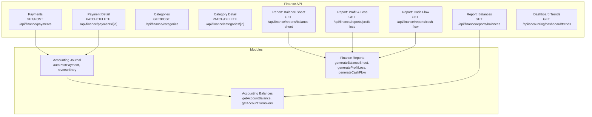
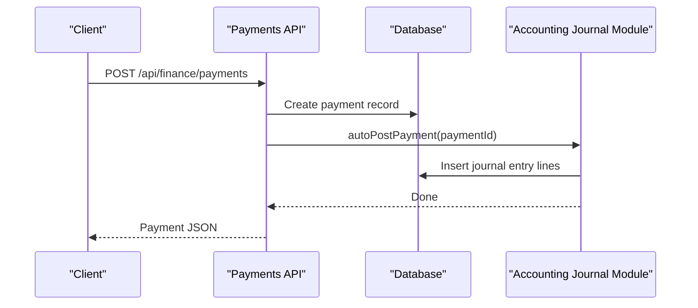
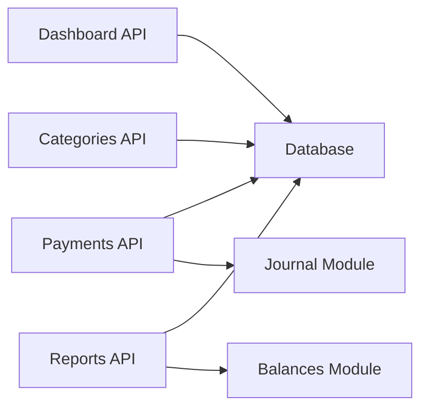
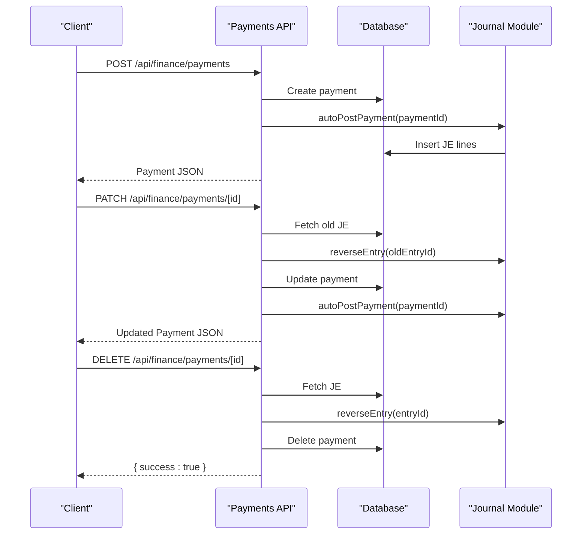
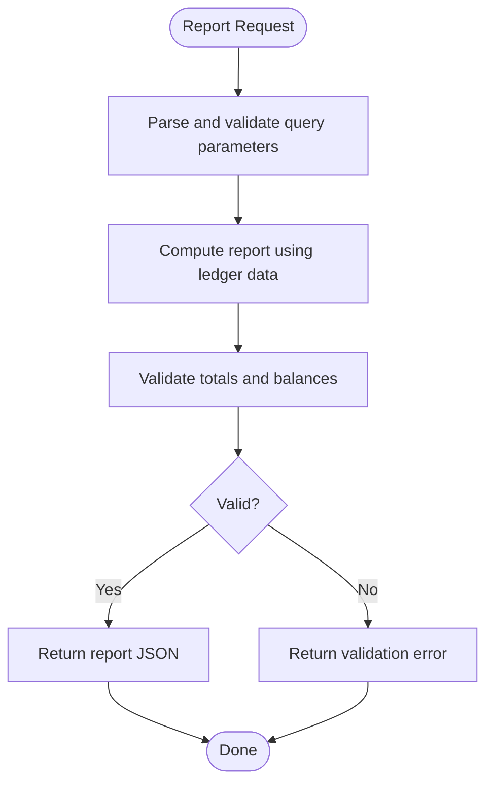

# Finance API

<cite>
**Referenced Files in This Document**
- [payments/route.ts](file://app/api/finance/payments/route.ts)
- [payments/[id]/route.ts](file://app/api/finance/payments/[id]/route.ts)
- [categories/route.ts](file://app/api/finance/categories/route.ts)
- [categories/[id]/route.ts](file://app/api/finance/categories/[id]/route.ts)
- [reports/balance-sheet/route.ts](file://app/api/finance/reports/balance-sheet/route.ts)
- [reports/profit-loss/route.ts](file://app/api/finance/reports/profit-loss/route.ts)
- [reports/cash-flow/route.ts](file://app/api/finance/reports/cash-flow/route.ts)
- [reports/balances/route.ts](file://app/api/finance/reports/balances/route.ts)
- [reports.schema.ts](file://lib/modules/finance/schemas/reports.schema.ts)
- [journal.ts](file://lib/modules/accounting/journal.ts)
- [balances.ts](file://lib/modules/accounting/balances.ts)
- [reports/balance-sheet.ts](file://lib/modules/finance/reports/balance-sheet.ts)
- [reports/profit-loss.ts](file://lib/modules/finance/reports/profit-loss.ts)
- [reports/cash-flow.ts](file://lib/modules/finance/reports/cash-flow.ts)
- [dashboard/trends/route.ts](file://app/api/accounting/dashboard/trends/route.ts)
</cite>

## Table of Contents
1. [Introduction](#introduction)
2. [Project Structure](#project-structure)
3. [Core Components](#core-components)
4. [Architecture Overview](#architecture-overview)
5. [Detailed Component Analysis](#detailed-component-analysis)
6. [Dependency Analysis](#dependency-analysis)
7. [Performance Considerations](#performance-considerations)
8. [Troubleshooting Guide](#troubleshooting-guide)
9. [Conclusion](#conclusion)
10. [Appendices](#appendices)

## Introduction
This document provides comprehensive API documentation for the Finance domain endpoints in the ERP system. It covers payment processing, financial reporting, account reconciliation, and dashboard analytics. For each endpoint, you will find HTTP methods, URL patterns, request/response schemas, parameter descriptions, and calculation algorithms. The documentation also explains the payment workflow from initiation through processing to reconciliation, and details financial report generation for balance sheets, profit and loss statements, and cash flow analysis. Multi-currency support and integration patterns for accounting software and financial data visualization are addressed.

## Project Structure
The Finance API is organized under the Next.js app router at app/api/finance. Core capabilities include:
- Payments: CRUD for income/expense payments with automatic journal posting and updates.
- Categories: Manage finance categories used by payments.
- Reports: Financial statements including balance sheet, profit and loss, cash flow, and balances.
- Dashboard: Trend analytics for sales and purchases.

**Diagram sources**
- [payments/route.ts:26-112](file://app/api/finance/payments/route.ts#L26-L112)
- [payments/[id]/route.ts](file://app/api/finance/payments/[id]/route.ts#L16-L128)
- [categories/route.ts:12-59](file://app/api/finance/categories/route.ts#L12-L59)
- [categories/[id]/route.ts](file://app/api/finance/categories/[id]/route.ts#L11-L73)
- [reports/balance-sheet/route.ts:11-28](file://app/api/finance/reports/balance-sheet/route.ts#L11-L28)
- [reports/profit-loss/route.ts:7-26](file://app/api/finance/reports/profit-loss/route.ts#L7-L26)
- [reports/cash-flow/route.ts:7-26](file://app/api/finance/reports/cash-flow/route.ts#L7-L26)
- [reports/balances/route.ts:6-44](file://app/api/finance/reports/balances/route.ts#L6-L44)
- [dashboard/trends/route.ts:12-65](file://app/api/accounting/dashboard/trends/route.ts#L12-L65)
- [journal.ts:251-325](file://lib/modules/accounting/journal.ts#L251-L325)
- [balances.ts:21-89](file://lib/modules/accounting/balances.ts#L21-L89)
- [reports/balance-sheet.ts:12-137](file://lib/modules/finance/reports/balance-sheet.ts#L12-L137)
- [reports/profit-loss.ts:19-63](file://lib/modules/finance/reports/profit-loss.ts#L19-L63)
- [reports/cash-flow.ts:12-70](file://lib/modules/finance/reports/cash-flow.ts#L12-L70)

**Section sources**
- [payments/route.ts:1-113](file://app/api/finance/payments/route.ts#L1-L113)
- [payments/[id]/route.ts](file://app/api/finance/payments/[id]/route.ts#L1-L129)
- [categories/route.ts:1-60](file://app/api/finance/categories/route.ts#L1-L60)
- [categories/[id]/route.ts](file://app/api/finance/categories/[id]/route.ts#L1-L74)
- [reports/balance-sheet/route.ts:1-29](file://app/api/finance/reports/balance-sheet/route.ts#L1-L29)
- [reports/profit-loss/route.ts:1-27](file://app/api/finance/reports/profit-loss/route.ts#L1-L27)
- [reports/cash-flow/route.ts:1-27](file://app/api/finance/reports/cash-flow/route.ts#L1-L27)
- [reports/balances/route.ts:1-45](file://app/api/finance/reports/balances/route.ts#L1-L45)
- [dashboard/trends/route.ts:1-66](file://app/api/accounting/dashboard/trends/route.ts#L1-L66)
- [journal.ts:251-325](file://lib/modules/accounting/journal.ts#L251-L325)
- [balances.ts:21-89](file://lib/modules/accounting/balances.ts#L21-L89)
- [reports.schema.ts:1-9](file://lib/modules/finance/schemas/reports.schema.ts#L1-L9)
- [reports/balance-sheet.ts:1-138](file://lib/modules/finance/reports/balance-sheet.ts#L1-L138)
- [reports/profit-loss.ts:1-64](file://lib/modules/finance/reports/profit-loss.ts#L1-L64)
- [reports/cash-flow.ts:1-71](file://lib/modules/finance/reports/cash-flow.ts#L1-L71)

## Core Components
- Payments: Create and list payments with filters, pagination, and summary totals. On creation, a journal entry is automatically posted. Updates trigger a reversal of the prior journal entry followed by a new posting. Deletion reverses the journal entry before removing the payment.
- Categories: Retrieve active categories optionally filtered by type; create new categories with ordering; update or delete categories with system protection and usage checks.
- Reports: Generate financial statements using ledger data:
  - Balance Sheet: Assets, Liabilities, Equity with validation.
  - Profit & Loss: Turnover-based calculation with margins.
  - Cash Flow: Cash account turnovers and balances.
  - Balances: Counterparty balances with receivable/payable split.
- Dashboard Analytics: Monthly trends for sales and purchases with percentage deltas.

**Section sources**
- [payments/route.ts:26-112](file://app/api/finance/payments/route.ts#L26-L112)
- [payments/[id]/route.ts](file://app/api/finance/payments/[id]/route.ts#L16-L128)
- [categories/route.ts:12-59](file://app/api/finance/categories/route.ts#L12-L59)
- [categories/[id]/route.ts](file://app/api/finance/categories/[id]/route.ts#L11-L73)
- [reports/balance-sheet/route.ts:11-28](file://app/api/finance/reports/balance-sheet/route.ts#L11-L28)
- [reports/profit-loss/route.ts:7-26](file://app/api/finance/reports/profit-loss/route.ts#L7-L26)
- [reports/cash-flow/route.ts:7-26](file://app/api/finance/reports/cash-flow/route.ts#L7-L26)
- [reports/balances/route.ts:6-44](file://app/api/finance/reports/balances/route.ts#L6-L44)
- [dashboard/trends/route.ts:12-65](file://app/api/accounting/dashboard/trends/route.ts#L12-L65)

## Architecture Overview
The Finance API integrates tightly with the Accounting module to maintain double-entry bookkeeping. Payments are persisted and immediately mirrored into the journal via auto-posting. Updates and deletions reverse prior entries before applying changes. Financial reports derive from ledger data to ensure accuracy and auditability.

**Diagram sources**
- [payments/route.ts:75-105](file://app/api/finance/payments/route.ts#L75-L105)
- [journal.ts:251-325](file://lib/modules/accounting/journal.ts#L251-L325)

**Section sources**
- [payments/route.ts:75-105](file://app/api/finance/payments/route.ts#L75-L105)
- [journal.ts:251-325](file://lib/modules/accounting/journal.ts#L251-L325)

## Detailed Component Analysis

### Payments Endpoints
- Base collection: GET and POST
- Single payment: PATCH and DELETE

#### Base Collection: GET /api/finance/payments
- Purpose: List payments with filters, pagination, and summary totals.
- Query parameters:
  - type: income or expense
  - categoryId: filter by category ID
  - counterpartyId: filter by counterparty ID
  - dateFrom/dateTo: inclusive date range (time normalized to end-of-day for dateTo)
  - page: integer, default 1
  - limit: integer, default 50
- Response fields:
  - payments: array of payment objects with category, counterparty, and document relations
  - total: total count matching filters
  - page, limit
  - incomeTotal, expenseTotal, netCashFlow
- Notes:
  - Includes aggregations for income and expense totals.
  - Uses include relations for category, counterparty, and document.

**Section sources**
- [payments/route.ts:26-69](file://app/api/finance/payments/route.ts#L26-L69)

#### Base Collection: POST /api/finance/payments
- Purpose: Create a new payment.
- Request body schema:
  - type: enum ["income","expense"]
  - categoryId: string (required)
  - counterpartyId: string (optional)
  - documentId: string (optional)
  - amount: number > 0
  - paymentMethod: enum ["cash","bank_transfer","card"]
  - date: string (optional, defaults to now)
  - description: string (optional)
- Response: Created payment object with relations.
- Workflow:
  - Validates payload with Zod schema.
  - Generates a sequential payment number.
  - Persists payment.
  - Calls autoPostPayment to create journal entry (non-critical failure handled).

**Section sources**
- [payments/route.ts:7-16](file://app/api/finance/payments/route.ts#L7-L16)
- [payments/route.ts:75-105](file://app/api/finance/payments/route.ts#L75-L105)
- [journal.ts:251-325](file://lib/modules/accounting/journal.ts#L251-L325)

#### Single Payment: PATCH /api/finance/payments/[id]
- Purpose: Update payment details.
- Path parameter: id (string)
- Request body schema (all optional):
  - categoryId: string
  - counterpartyId: string (nullable)
  - amount: number > 0
  - paymentMethod: enum ["cash","bank_transfer","card"]
  - date: string
  - description: string (nullable)
- Behavior:
  - Validates payload.
  - Updates payment record.
  - Reverses prior journal entry if present.
  - Re-posts journal entry with updated details (cash account depends on paymentMethod; category account defaults per type).
- Response: Updated payment object with relations.

**Section sources**
- [payments/[id]/route.ts](file://app/api/finance/payments/[id]/route.ts#L7-L14)
- [payments/[id]/route.ts](file://app/api/finance/payments/[id]/route.ts#L16-L99)
- [journal.ts:193-244](file://lib/modules/accounting/journal.ts#L193-L244)
- [journal.ts:251-325](file://lib/modules/accounting/journal.ts#L251-L325)

#### Single Payment: DELETE /api/finance/payments/[id]
- Purpose: Delete a payment.
- Path parameter: id (string)
- Behavior:
  - Validates existence.
  - Reverses associated journal entry if present.
  - Deletes payment record.
- Response: { success: true }

**Section sources**
- [payments/[id]/route.ts](file://app/api/finance/payments/[id]/route.ts#L102-L128)
- [journal.ts:193-244](file://lib/modules/accounting/journal.ts#L193-L244)

### Categories Endpoints
- Base collection: GET and POST
- Single category: PATCH and DELETE

#### Base Collection: GET /api/finance/categories
- Purpose: Retrieve active categories, optionally filtered by type.
- Query parameters:
  - type: "income" or "expense"
- Response: { categories: array }

**Section sources**
- [categories/route.ts:12-29](file://app/api/finance/categories/route.ts#L12-L29)

#### Base Collection: POST /api/finance/categories
- Purpose: Create a new category.
- Request body schema:
  - name: string (1–100 chars)
  - type: enum ["income","expense"]
  - defaultAccountCode: string|null (optional)
- Behavior:
  - Determines next order value for the type.
  - Creates category with isSystem=false.
- Response: Category object.

**Section sources**
- [categories/route.ts:6-10](file://app/api/finance/categories/route.ts#L6-L10)
- [categories/route.ts:32-52](file://app/api/finance/categories/route.ts#L32-L52)

#### Single Category: PATCH /api/finance/categories/[id]
- Purpose: Update category metadata.
- Path parameter: id (string)
- Request body schema (all optional):
  - name: string (1–100 chars)
  - defaultAccountCode: string|null
- Constraints:
  - Cannot rename system categories.
- Response: Updated category.

**Section sources**
- [categories/[id]/route.ts](file://app/api/finance/categories/[id]/route.ts#L6-L9)
- [categories/[id]/route.ts](file://app/api/finance/categories/[id]/route.ts#L11-L37)

#### Single Category: DELETE /api/finance/categories/[id]
- Purpose: Delete a category.
- Path parameter: id (string)
- Constraints:
  - Cannot delete system categories.
  - Cannot delete if used by payments.
- Response: { success: true } or error.

**Section sources**
- [categories/[id]/route.ts](file://app/api/finance/categories/[id]/route.ts#L46-L72)

### Financial Reporting Endpoints

#### Report: Balance Sheet
- Endpoint: GET /api/finance/reports/balance-sheet
- Query parameters:
  - asOfDate: string (optional)
- Calculation:
  - Assets: Non-current and current assets computed from ledger account balances.
  - Liabilities: Non-current and current liabilities computed from ledger account balances.
  - Equity: Capital and reserves computed from ledger account balances.
  - Validation: totalAssets vs totalLiabilitiesPlusEquity equality check.
- Response: Balance sheet structure with assets/liabilities/equity breakdown and balanced flag.

**Section sources**
- [reports/balance-sheet/route.ts:11-28](file://app/api/finance/reports/balance-sheet/route.ts#L11-L28)
- [reports/balance-sheet.ts:12-137](file://lib/modules/finance/reports/balance-sheet.ts#L12-L137)
- [balances.ts:21-48](file://lib/modules/accounting/balances.ts#L21-L48)

#### Report: Profit & Loss
- Endpoint: GET /api/finance/reports/profit-loss
- Query parameters:
  - dateFrom: string (required)
  - dateTo: string (required)
- Calculation:
  - Revenue from credit turnover of account 90.1.
  - COGS from debit turnover of account 90.2.
  - Gross profit = net revenue - COGS (net revenue excludes VAT).
  - Operating profit = gross profit - selling expenses (account 44).
  - Profit before tax = operating profit + other income - other expenses.
  - Net profit = profit before tax - income tax (account 68.04).
  - Margins computed as percentages.
- Response: Full P&L structure with turnovers, margins, and taxes.

**Section sources**
- [reports/profit-loss/route.ts:7-26](file://app/api/finance/reports/profit-loss/route.ts#L7-L26)
- [reports.schema.ts:3-6](file://lib/modules/finance/schemas/reports.schema.ts#L3-L6)
- [reports/profit-loss.ts:19-63](file://lib/modules/finance/reports/profit-loss.ts#L19-L63)
- [balances.ts:82-89](file://lib/modules/accounting/balances.ts#L82-L89)

#### Report: Cash Flow
- Endpoint: GET /api/finance/reports/cash-flow
- Query parameters:
  - dateFrom: string (required)
  - dateTo: string (required)
- Calculation:
  - Opening and closing cash balances from accounts 50/51/52.
  - Total inflows and outflows from turnovers of accounts 50/51/52.
  - Net cash flow = total inflows - total outflows.
  - Validation: closing balance ≈ opening balance + net cash flow.
- Response: Cash flow structure with inflows/outflows and balanced flag.

**Section sources**
- [reports/cash-flow/route.ts:7-26](file://app/api/finance/reports/cash-flow/route.ts#L7-L26)
- [reports.schema.ts:3-6](file://lib/modules/finance/schemas/reports.schema.ts#L3-L6)
- [reports/cash-flow.ts:12-70](file://lib/modules/finance/reports/cash-flow.ts#L12-L70)
- [balances.ts:50-79](file://lib/modules/accounting/balances.ts#L50-L79)

#### Report: Balances
- Endpoint: GET /api/finance/reports/balances
- Query parameters:
  - asOfDate: string (optional)
- Behavior:
  - Filters counterparty balances excluding zero balances.
  - Applies lastUpdatedAt threshold if provided.
  - Splits balances into receivable (positive) and payable (negative).
  - Computes totals and net balance.
- Response: balances, receivable, payable, totals, and net balance.

**Section sources**
- [reports/balances/route.ts:6-44](file://app/api/finance/reports/balances/route.ts#L6-L44)

### Dashboard Analytics
- Endpoint: GET /api/accounting/dashboard/trends
- Purpose: Compare current and previous month sales and purchases.
- Response:
  - currentMonth: label, sales (amount, count, delta), purchases (amount, count, delta)
  - previousMonth: label, sales/purchases amounts and counts
- Notes:
  - Delta computed as percentage change; null when previous is zero.

**Section sources**
- [dashboard/trends/route.ts:12-65](file://app/api/accounting/dashboard/trends/route.ts#L12-L65)

## Dependency Analysis
- Payments depend on:
  - Database persistence for payments and counters.
  - Accounting journal module for auto-posting and reversing entries.
- Reports depend on:
  - Accounting balances module for ledger-based calculations.
  - Shared validation for query parsing and permissions.
- Categories depend on:
  - Database for CRUD operations and referential integrity checks.

**Diagram sources**
- [payments/route.ts:1-113](file://app/api/finance/payments/route.ts#L1-L113)
- [journal.ts:251-325](file://lib/modules/accounting/journal.ts#L251-L325)
- [reports/balance-sheet/route.ts:1-29](file://app/api/finance/reports/balance-sheet/route.ts#L1-L29)
- [reports/profit-loss/route.ts:1-27](file://app/api/finance/reports/profit-loss/route.ts#L1-L27)
- [reports/cash-flow/route.ts:1-27](file://app/api/finance/reports/cash-flow/route.ts#L1-L27)
- [reports/balances/route.ts:1-45](file://app/api/finance/reports/balances/route.ts#L1-L45)
- [balances.ts:21-89](file://lib/modules/accounting/balances.ts#L21-L89)
- [categories/route.ts:1-60](file://app/api/finance/categories/route.ts#L1-L60)
- [dashboard/trends/route.ts:1-66](file://app/api/accounting/dashboard/trends/route.ts#L1-L66)

**Section sources**
- [payments/route.ts:1-113](file://app/api/finance/payments/route.ts#L1-L113)
- [journal.ts:251-325](file://lib/modules/accounting/journal.ts#L251-L325)
- [reports/balance-sheet/route.ts:1-29](file://app/api/finance/reports/balance-sheet/route.ts#L1-L29)
- [reports/profit-loss/route.ts:1-27](file://app/api/finance/reports/profit-loss/route.ts#L1-L27)
- [reports/cash-flow/route.ts:1-27](file://app/api/finance/reports/cash-flow/route.ts#L1-L27)
- [reports/balances/route.ts:1-45](file://app/api/finance/reports/balances/route.ts#L1-L45)
- [balances.ts:21-89](file://lib/modules/accounting/balances.ts#L21-L89)
- [categories/route.ts:1-60](file://app/api/finance/categories/route.ts#L1-L60)
- [dashboard/trends/route.ts:1-66](file://app/api/accounting/dashboard/trends/route.ts#L1-L66)

## Performance Considerations
- Payments listing uses concurrent aggregation and pagination to minimize latency.
- Report endpoints compute multiple account balances/turnovers concurrently.
- Journal posting is non-blocking during payment creation to avoid slow accounting operations affecting user experience.
- Filtering by date ranges and optional account joins are optimized in the journal retrieval logic.

[No sources needed since this section provides general guidance]

## Troubleshooting Guide
- Authentication and permissions:
  - Many endpoints require authentication and specific permissions (e.g., reports:read). Unauthorized or insufficient permission errors are returned as JSON with appropriate status codes.
- Validation errors:
  - Requests validated with Zod schemas return structured error details with status 400.
- Journal operations:
  - Journal entry creation validates debits equal credits and throws descriptive errors if unbalanced.
  - Reversals mark original entries as reversed to prevent duplicate postings.
- Payment lifecycle:
  - Updating a payment triggers a reversal of the prior journal entry; failures are handled gracefully.
  - Deleting a payment reverses its journal entry before deletion.

**Section sources**
- [payments/route.ts:106-112](file://app/api/finance/payments/route.ts#L106-L112)
- [journal.ts:98-103](file://lib/modules/accounting/journal.ts#L98-L103)
- [journal.ts:193-244](file://lib/modules/accounting/journal.ts#L193-L244)
- [payments/[id]/route.ts](file://app/api/finance/payments/[id]/route.ts#L94-L99)

## Conclusion
The Finance API provides robust endpoints for payment processing, category management, financial reporting, and dashboard analytics. Payments integrate seamlessly with the accounting journal to maintain accurate double-entry records. Financial reports are built on ledger data to ensure compliance and auditability. The design supports extensibility for future enhancements such as multi-currency and advanced export formats.

[No sources needed since this section summarizes without analyzing specific files]

## Appendices

### Payment Workflow Sequence

**Diagram sources**
- [payments/route.ts:75-105](file://app/api/finance/payments/route.ts#L75-L105)
- [payments/[id]/route.ts](file://app/api/finance/payments/[id]/route.ts#L16-L99)
- [journal.ts:193-244](file://lib/modules/accounting/journal.ts#L193-L244)
- [journal.ts:251-325](file://lib/modules/accounting/journal.ts#L251-L325)

### Financial Report Generation Flow

**Diagram sources**
- [reports/balance-sheet/route.ts:11-28](file://app/api/finance/reports/balance-sheet/route.ts#L11-L28)
- [reports/profit-loss/route.ts:7-26](file://app/api/finance/reports/profit-loss/route.ts#L7-L26)
- [reports/cash-flow/route.ts:7-26](file://app/api/finance/reports/cash-flow/route.ts#L7-L26)
- [reports/balance-sheet.ts:92-94](file://lib/modules/finance/reports/balance-sheet.ts#L92-L94)
- [reports/cash-flow.ts:46-49](file://lib/modules/finance/reports/cash-flow.ts#L46-L49)

### Example Requests and Responses
Note: The following examples describe request/response shapes. Replace placeholders with actual values as indicated by the schemas and parameters.

- Create Payment
  - Method: POST
  - URL: /api/finance/payments
  - Body:
    - type: "income" or "expense"
    - categoryId: string
    - counterpartyId: string|null
    - documentId: string|null
    - amount: number > 0
    - paymentMethod: "cash"|"bank_transfer"|"card"
    - date: "YYYY-MM-DD" (optional)
    - description: string|null
  - Response: Payment object with category, counterparty, and document relations.

- Update Payment
  - Method: PATCH
  - URL: /api/finance/payments/{id}
  - Body: Same optional fields as creation; at least one must be provided.
  - Response: Updated payment object.

- Delete Payment
  - Method: DELETE
  - URL: /api/finance/payments/{id}
  - Response: { success: true }

- List Payments
  - Method: GET
  - URL: /api/finance/payments?page=1&limit=50&dateFrom=YYYY-MM-DD&dateTo=YYYY-MM-DD&type=income&categoryId={id}&counterpartyId={id}
  - Response: { payments, total, page, limit, incomeTotal, expenseTotal, netCashFlow }

- Profit & Loss
  - Method: GET
  - URL: /api/finance/reports/profit-loss?dateFrom=YYYY-MM-DD&dateTo=YYYY-MM-DD
  - Response: { dateFrom, dateTo, revenue, vatOnSales, netRevenue, cogs, grossProfit, grossMarginPct, sellingExpenses, operatingProfit, otherIncome, otherExpenses, profitBeforeTax, incomeTax, netProfit, netMarginPct }

- Cash Flow
  - Method: GET
  - URL: /api/finance/reports/cash-flow?dateFrom=YYYY-MM-DD&dateTo=YYYY-MM-DD
  - Response: { dateFrom, dateTo, openingBalance, closingBalance, inflows, outflows, netCashFlow, balanced }

- Balance Sheet
  - Method: GET
  - URL: /api/finance/reports/balance-sheet?asOfDate=YYYY-MM-DD
  - Response: { asOfDate, assets, liabilities, equity, totalPassive, balanced }

- Counterparty Balances
  - Method: GET
  - URL: /api/finance/reports/balances?asOfDate=YYYY-MM-DD
  - Response: { balances, receivable, payable, totalReceivable, totalPayable, netBalance }

- Dashboard Trends
  - Method: GET
  - URL: /api/accounting/dashboard/trends
  - Response: { currentMonth: { label, sales: { amount, count, delta }, purchases: { amount, count, delta } }, previousMonth: { label, sales, purchases } }

**Section sources**
- [payments/route.ts:7-16](file://app/api/finance/payments/route.ts#L7-L16)
- [payments/[id]/route.ts](file://app/api/finance/payments/[id]/route.ts#L7-L14)
- [reports/profit-loss/route.ts:7-26](file://app/api/finance/reports/profit-loss/route.ts#L7-L26)
- [reports/cash-flow/route.ts:7-26](file://app/api/finance/reports/cash-flow/route.ts#L7-L26)
- [reports/balance-sheet/route.ts:11-28](file://app/api/finance/reports/balance-sheet/route.ts#L11-L28)
- [reports/balances/route.ts:6-44](file://app/api/finance/reports/balances/route.ts#L6-L44)
- [dashboard/trends/route.ts:12-65](file://app/api/accounting/dashboard/trends/route.ts#L12-L65)

### Currency Handling and Multi-Currency Support
- Journal entries currently use RUB for currency and amountRub fields.
- Cash flow report aggregates cash accounts 50/51/52; foreign currency (52) is included in totals.
- Multi-currency support is not implemented in the current codebase; all amounts are stored and reported in rubles.

**Section sources**
- [journal.ts:83-95](file://lib/modules/accounting/journal.ts#L83-L95)
- [journal.ts:310-319](file://lib/modules/accounting/journal.ts#L310-L319)
- [reports/cash-flow.ts:34-44](file://lib/modules/finance/reports/cash-flow.ts#L34-L44)

### Integration Patterns
- Accounting Software:
  - Use report endpoints to pull balance sheet, profit and loss, and cash flow data for external systems.
  - Leverage dashboard trends for high-level KPIs.
- Financial Data Visualization:
  - Consume report endpoints and transform data into charts and dashboards.
  - Use date range parameters to align with visualization timeframes.

[No sources needed since this section provides general guidance]