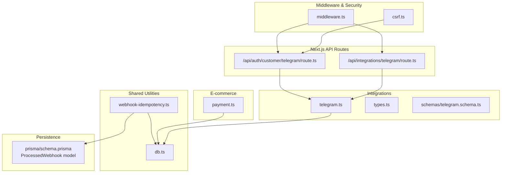
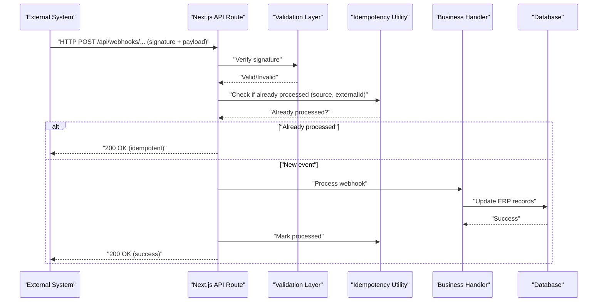
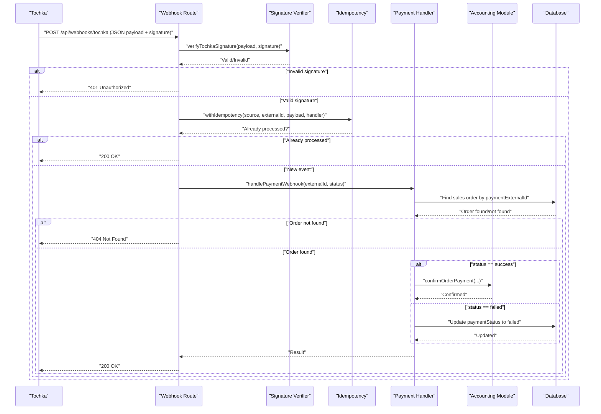
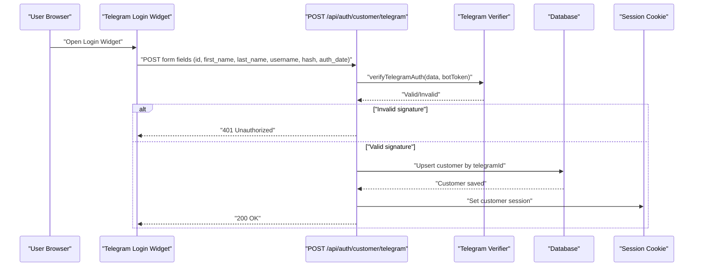
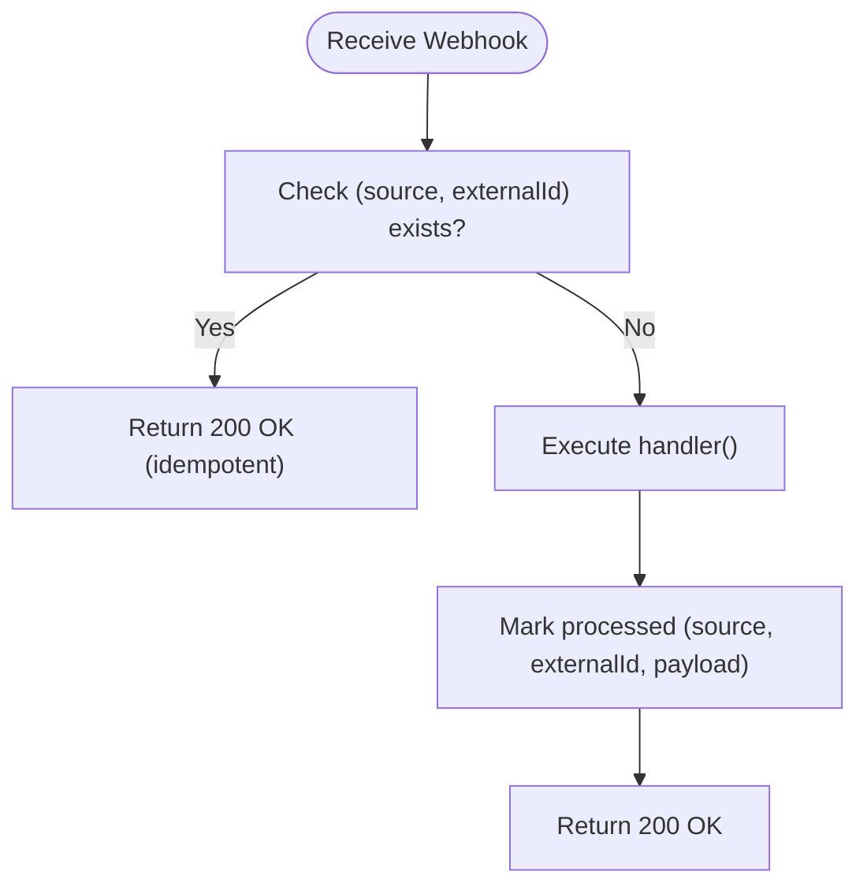
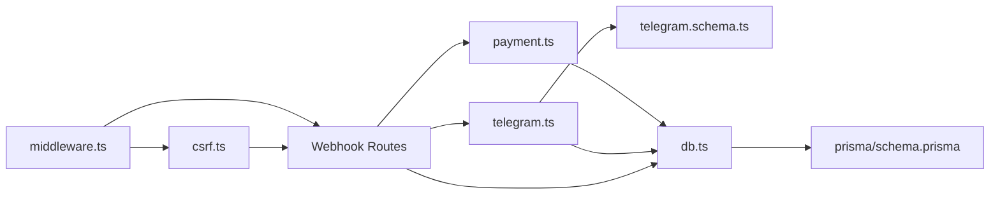

# Webhook API

<cite>
**Referenced Files in This Document**
- [webhook-idempotency.ts](file://lib/shared/webhook-idempotency.ts)
- [payment.ts](file://lib/modules/ecommerce/payment.ts)
- [telegram.ts](file://lib/modules/integrations/telegram.ts)
- [route.ts](file://app/api/auth/customer/telegram/route.ts)
- [route.ts](file://app/api/integrations/telegram/route.ts)
- [schema.ts](file://lib/modules/integrations/schemas/telegram.schema.ts)
- [types.ts](file://lib/modules/integrations/types.ts)
- [schema.prisma](file://prisma/schema.prisma)
- [middleware.ts](file://middleware.ts)
- [csrf.ts](file://lib/shared/csrf.ts)
- [db.ts](file://lib/shared/db.ts)
</cite>

## Table of Contents
1. [Introduction](#introduction)
2. [Project Structure](#project-structure)
3. [Core Components](#core-components)
4. [Architecture Overview](#architecture-overview)
5. [Detailed Component Analysis](#detailed-component-analysis)
6. [Dependency Analysis](#dependency-analysis)
7. [Performance Considerations](#performance-considerations)
8. [Troubleshooting Guide](#troubleshooting-guide)
9. [Conclusion](#conclusion)
10. [Appendices](#appendices)

## Introduction
This document provides comprehensive API documentation for webhook endpoints used to integrate external systems with the ERP. It covers webhook reception, validation, processing, and response patterns. It specifies HTTP methods, URL patterns, payload schemas, and verification mechanisms for:
- Tochka payment webhook
- Telegram integration callbacks
It also documents idempotency handling, retry and timeout considerations, error response requirements, rate limiting, security, payload size limits, webhook management, subscription handling, and testing methodologies. Integration guidelines are included for external payment processors, messaging platforms, and ERP systems.

## Project Structure
The webhook-related logic is implemented across shared utilities, integration modules, and Next.js API routes:
- Shared idempotency utilities manage deduplication of webhook events.
- E-commerce payment module handles Tochka payment webhooks.
- Telegram integration module manages bot settings and authentication verification.
- Next.js API routes expose endpoints for Telegram login widget and public Telegram settings.
- Middleware and CSRF utilities define route exposure and CSRF exemptions for webhook endpoints.

**Diagram sources**
- [webhook-idempotency.ts:1-60](file://lib/shared/webhook-idempotency.ts#L1-L60)
- [db.ts:1-25](file://lib/shared/db.ts#L1-L25)
- [telegram.ts:1-108](file://lib/modules/integrations/telegram.ts#L1-L108)
- [types.ts:1-27](file://lib/modules/integrations/types.ts#L1-L27)
- [schema.ts:1-14](file://lib/modules/integrations/schemas/telegram.schema.ts#L1-L14)
- [payment.ts:1-84](file://lib/modules/ecommerce/payment.ts#L1-L84)
- [route.ts:1-67](file://app/api/auth/customer/telegram/route.ts#L1-L67)
- [route.ts:1-29](file://app/api/integrations/telegram/route.ts#L1-L29)
- [middleware.ts:35-73](file://middleware.ts#L35-L73)
- [csrf.ts:175-188](file://lib/shared/csrf.ts#L175-L188)
- [schema.prisma:1057-1066](file://prisma/schema.prisma#L1057-L1066)

**Section sources**
- [webhook-idempotency.ts:1-60](file://lib/shared/webhook-idempotency.ts#L1-L60)
- [payment.ts:1-84](file://lib/modules/ecommerce/payment.ts#L1-L84)
- [telegram.ts:1-108](file://lib/modules/integrations/telegram.ts#L1-L108)
- [route.ts:1-67](file://app/api/auth/customer/telegram/route.ts#L1-L67)
- [route.ts:1-29](file://app/api/integrations/telegram/route.ts#L1-L29)
- [schema.ts:1-14](file://lib/modules/integrations/schemas/telegram.schema.ts#L1-L14)
- [types.ts:1-27](file://lib/modules/integrations/types.ts#L1-L27)
- [schema.prisma:1057-1066](file://prisma/schema.prisma#L1057-L1066)
- [middleware.ts:35-73](file://middleware.ts#L35-L73)
- [csrf.ts:175-188](file://lib/shared/csrf.ts#L175-L188)
- [db.ts:1-25](file://lib/shared/db.ts#L1-L25)

## Core Components
- Idempotency utilities: Prevent duplicate processing via a persisted record keyed by source and externalId.
- Tochka payment webhook handler: Validates signature, finds the associated sales order, updates payment status, and confirms accounting.
- Telegram integration: Manages bot settings, verifies Telegram Login Widget signatures, and exposes public settings.
- Next.js API routes: Expose endpoints for Telegram login widget callback and public Telegram settings.
- Middleware and CSRF: Defines webhook route exposure and CSRF exemption for webhook endpoints.

**Section sources**
- [webhook-idempotency.ts:1-60](file://lib/shared/webhook-idempotency.ts#L1-L60)
- [payment.ts:1-84](file://lib/modules/ecommerce/payment.ts#L1-L84)
- [telegram.ts:1-108](file://lib/modules/integrations/telegram.ts#L1-L108)
- [route.ts:1-67](file://app/api/auth/customer/telegram/route.ts#L1-L67)
- [route.ts:1-29](file://app/api/integrations/telegram/route.ts#L1-L29)
- [middleware.ts:35-73](file://middleware.ts#L35-L73)
- [csrf.ts:175-188](file://lib/shared/csrf.ts#L175-L188)

## Architecture Overview
The webhook architecture separates concerns:
- Reception: Public endpoints receive callbacks without session-based authentication.
- Validation: Signature verification for Tochka and Telegram Login Widget.
- Idempotency: Deduplication using a persisted record keyed by source and externalId.
- Processing: Business logic to update ERP records (e.g., payment confirmation).
- Persistence: Database-backed storage for processed webhook metadata.

**Diagram sources**
- [webhook-idempotency.ts:1-60](file://lib/shared/webhook-idempotency.ts#L1-L60)
- [payment.ts:1-84](file://lib/modules/ecommerce/payment.ts#L1-L84)
- [route.ts:1-67](file://app/api/auth/customer/telegram/route.ts#L1-L67)
- [route.ts:1-29](file://app/api/integrations/telegram/route.ts#L1-L29)
- [schema.prisma:1057-1066](file://prisma/schema.prisma#L1057-L1066)

## Detailed Component Analysis

### Tochka Payment Webhook
- Purpose: Receive payment status updates from Tochka and reconcile with sales orders.
- Endpoint: Public webhook endpoint (URL pattern defined in middleware).
- HTTP method: POST.
- Payload schema: Application/json body containing payment externalId and status.
- Verification mechanism: HMAC-SHA256 signature verification using a shared secret.
- Processing logic:
  - Validate signature against the raw payload.
  - Find the sales order by paymentExternalId.
  - On success: confirm payment in accounting; on failure: mark payment failed.
  - Idempotency: Use withIdempotency to prevent duplicate processing.
- Responses:
  - 200 OK on successful processing or idempotent repeat.
  - 400 Bad Request for invalid data.
  - 500 Internal Server Error for unhandled errors.

**Diagram sources**
- [payment.ts:1-84](file://lib/modules/ecommerce/payment.ts#L1-L84)
- [webhook-idempotency.ts:1-60](file://lib/shared/webhook-idempotency.ts#L1-L60)
- [middleware.ts:35-73](file://middleware.ts#L35-L73)

**Section sources**
- [payment.ts:1-84](file://lib/modules/ecommerce/payment.ts#L1-L84)
- [webhook-idempotency.ts:1-60](file://lib/shared/webhook-idempotency.ts#L1-L60)
- [middleware.ts:35-73](file://middleware.ts#L35-L73)

### Telegram Integration Callbacks
- Telegram Login Widget Callback
  - Endpoint: POST /api/auth/customer/telegram
  - HTTP method: POST.
  - Payload schema: Form fields validated by telegramAuthSchema.
  - Verification mechanism: HMAC-SHA256 over sorted key-value pairs using bot token as secret.
  - Processing logic:
    - Retrieve bot token from integration settings or environment.
    - Verify signature and auth_date freshness.
    - Upsert customer record and set session cookie.
  - Responses:
    - 200 OK on successful login.
    - 401 Unauthorized for invalid signature.
    - 500 Internal Server Error if Telegram is not configured.

- Public Telegram Settings
  - Endpoint: GET /api/integrations/telegram
  - HTTP method: GET.
  - Payload schema: None (returns public settings).
  - Verification mechanism: No authentication required.
  - Processing logic:
    - Fetch integration settings and return enabled state and public fields.
  - Responses:
    - 200 OK with settings.
    - 500 Internal Server Error on failure.

**Diagram sources**
- [route.ts:1-67](file://app/api/auth/customer/telegram/route.ts#L1-L67)
- [telegram.ts:71-95](file://lib/modules/integrations/telegram.ts#L71-L95)
- [schema.ts:1-14](file://lib/modules/integrations/schemas/telegram.schema.ts#L1-L14)

**Section sources**
- [route.ts:1-67](file://app/api/auth/customer/telegram/route.ts#L1-L67)
- [route.ts:1-29](file://app/api/integrations/telegram/route.ts#L1-L29)
- [telegram.ts:1-108](file://lib/modules/integrations/telegram.ts#L1-L108)
- [schema.ts:1-14](file://lib/modules/integrations/schemas/telegram.schema.ts#L1-L14)
- [types.ts:1-27](file://lib/modules/integrations/types.ts#L1-L27)

### Idempotency Handling
- Mechanism: Persisted record keyed by (source, externalId) prevents duplicate processing.
- Flow:
  - Check if (source, externalId) exists.
  - If yes, return idempotent success.
  - If no, execute handler and mark as processed.

**Diagram sources**
- [webhook-idempotency.ts:1-60](file://lib/shared/webhook-idempotency.ts#L1-L60)
- [schema.prisma:1057-1066](file://prisma/schema.prisma#L1057-L1066)

**Section sources**
- [webhook-idempotency.ts:1-60](file://lib/shared/webhook-idempotency.ts#L1-L60)
- [schema.prisma:1057-1066](file://prisma/schema.prisma#L1057-L1066)

## Dependency Analysis
- Route exposure: Webhook routes are whitelisted in middleware and CSRF is exempted for webhook paths.
- Database: Shared Prisma client is used across modules for persistence.
- Integration settings: Telegram settings are stored in the integration table and can be overridden by environment variables.

**Diagram sources**
- [middleware.ts:35-73](file://middleware.ts#L35-L73)
- [csrf.ts:175-188](file://lib/shared/csrf.ts#L175-L188)
- [payment.ts:1-84](file://lib/modules/ecommerce/payment.ts#L1-L84)
- [telegram.ts:1-108](file://lib/modules/integrations/telegram.ts#L1-L108)
- [schema.ts:1-14](file://lib/modules/integrations/schemas/telegram.schema.ts#L1-L14)
- [db.ts:1-25](file://lib/shared/db.ts#L1-L25)
- [schema.prisma:1057-1066](file://prisma/schema.prisma#L1057-L1066)

**Section sources**
- [middleware.ts:35-73](file://middleware.ts#L35-L73)
- [csrf.ts:175-188](file://lib/shared/csrf.ts#L175-L188)
- [db.ts:1-25](file://lib/shared/db.ts#L1-L25)
- [schema.prisma:1057-1066](file://prisma/schema.prisma#L1057-L1066)

## Performance Considerations
- Idempotency reduces redundant work and database writes.
- Keep webhook handlers synchronous and lightweight; delegate heavy tasks to background jobs if needed.
- Use database indexes on (source, processedAt) for efficient cleanup and reporting.
- Monitor payload sizes and apply size limits at the ingress layer if applicable.

## Troubleshooting Guide
- Tochka signature verification fails:
  - Ensure TOCHKA_WEBHOOK_SECRET is configured.
  - Confirm the signature header matches the HMAC-SHA256 digest of the raw payload.
- Telegram Login Widget unauthorized:
  - Verify bot token retrieval from integration settings or environment.
  - Check that auth_date is fresh (within 24 hours).
  - Ensure the check string is constructed from sorted key-value pairs.
- Duplicate webhook processing:
  - Confirm ProcessedWebhook record exists for (source, externalId).
  - Investigate handler completion and marking steps.
- Middleware and CSRF:
  - Confirm webhook routes are under "/api/webhooks/" and exempted from CSRF checks.

**Section sources**
- [payment.ts:20-27](file://lib/modules/ecommerce/payment.ts#L20-L27)
- [route.ts:23-41](file://app/api/auth/customer/telegram/route.ts#L23-L41)
- [webhook-idempotency.ts:1-60](file://lib/shared/webhook-idempotency.ts#L1-L60)
- [middleware.ts:35-73](file://middleware.ts#L35-L73)
- [csrf.ts:175-188](file://lib/shared/csrf.ts#L175-L188)

## Conclusion
The webhook system provides secure, idempotent, and extensible integration points for external systems. Tochka payment webhooks and Telegram integration callbacks are supported with robust verification and deduplication. Follow the documented patterns for signature verification, idempotency, and response handling to ensure reliable integrations.

## Appendices

### Endpoint Definitions

- Tochka Payment Webhook
  - Method: POST
  - URL Pattern: /api/webhooks/tochka
  - Headers:
    - Content-Type: application/json
    - X-Tochka-Signature: HMAC-SHA256 of raw payload
  - Body Schema:
    - externalId: string
    - status: "success" | "failed"
  - Responses:
    - 200 OK: {"result": "..."}
    - 400 Bad Request: {"error": "..."}
    - 401 Unauthorized: {"error": "Invalid signature"}
    - 404 Not Found: {"error": "Order not found"}
    - 500 Internal Server Error: {"error": "..."}

- Telegram Login Widget Callback
  - Method: POST
  - URL Pattern: /api/auth/customer/telegram
  - Body Schema (form fields):
    - id: string
    - first_name: string (optional)
    - last_name: string (optional)
    - username: string (optional)
    - hash: string
    - auth_date: string (timestamp)
  - Responses:
    - 200 OK: Session cookie set
    - 401 Unauthorized: {"error": "Invalid Telegram authentication"}
    - 500 Internal Server Error: {"error": "Telegram not configured"}

- Telegram Public Settings
  - Method: GET
  - URL Pattern: /api/integrations/telegram
  - Responses:
    - 200 OK: {"enabled": boolean, "botUsername": string|null, "enableStoreLogin": boolean, "enableAdminLogin": boolean}
    - 500 Internal Server Error: {"enabled": false}

**Section sources**
- [middleware.ts:35-73](file://middleware.ts#L35-L73)
- [route.ts:43-67](file://app/api/auth/customer/telegram/route.ts#L43-L67)
- [route.ts:5-29](file://app/api/integrations/telegram/route.ts#L5-L29)
- [schema.ts:1-14](file://lib/modules/integrations/schemas/telegram.schema.ts#L1-L14)
- [payment.ts:20-27](file://lib/modules/ecommerce/payment.ts#L20-L27)

### Payload Examples

- Tochka Payment Webhook (successful payment)
  - Body:
    - externalId: "txn_abc123"
    - status: "success"
  - Response:
    - 200 OK with reconciliation result

- Tochka Payment Webhook (failed payment)
  - Body:
    - externalId: "txn_def456"
    - status: "failed"
  - Response:
    - 200 OK with reconciliation result

- Telegram Login Widget (valid)
  - Body:
    - id: "987654321"
    - first_name: "John"
    - last_name: "Doe"
    - username: "johnd"
    - hash: "<HMAC_SHA256>"
    - auth_date: "1699173400"
  - Response:
    - 200 OK with session cookie

- Telegram Public Settings
  - Response:
    - 200 OK: {"enabled": true, "botUsername": "mybot", "enableStoreLogin": true, "enableAdminLogin": false}

**Section sources**
- [payment.ts:29-74](file://lib/modules/ecommerce/payment.ts#L29-L74)
- [route.ts:51-62](file://app/api/auth/customer/telegram/route.ts#L51-L62)
- [route.ts:18-24](file://app/api/integrations/telegram/route.ts#L18-L24)

### Retry, Timeout, and Error Handling
- Retry Mechanisms:
  - External systems should retry failed deliveries with exponential backoff.
  - Idempotency ensures idempotent retries do not cause side effects.
- Timeouts:
  - Set reasonable read/write timeouts for webhook endpoints.
- Error Responses:
  - 400 Bad Request for malformed payloads.
  - 401 Unauthorized for invalid signatures.
  - 404 Not Found for missing resources referenced by externalId.
  - 500 Internal Server Error for server failures.

**Section sources**
- [webhook-idempotency.ts:1-60](file://lib/shared/webhook-idempotency.ts#L1-L60)
- [payment.ts:99-112](file://lib/modules/ecommerce/payment.ts#L99-L112)
- [route.ts:48-62](file://app/api/auth/customer/telegram/route.ts#L48-L62)

### Rate Limiting and Security
- Rate Limiting:
  - Enforce per-source and per-externalId rate limits at the ingress or application level.
- Security:
  - Use HTTPS for all webhook endpoints.
  - Store secrets in environment variables or secure secret managers.
  - Avoid logging sensitive payload data.
  - Exempt webhook routes from CSRF checks as implemented.

**Section sources**
- [csrf.ts:175-188](file://lib/shared/csrf.ts#L175-L188)
- [middleware.ts:35-73](file://middleware.ts#L35-L73)

### Payload Size Limits
- Apply ingress-level or application-level payload size limits (e.g., 64 KB to 512 KB) depending on deployment constraints.
- Validate payload size before parsing to avoid resource exhaustion.

### Webhook Management and Subscription Handling
- Management:
  - Maintain a registry of subscribed sources and their secrets.
  - Rotate secrets periodically and update external systems.
- Subscription Handling:
  - External systems subscribe to specific events and provide unique externalId per event.
  - Use ProcessedWebhook to track and audit received events.

**Section sources**
- [schema.prisma:1057-1066](file://prisma/schema.prisma#L1057-L1066)
- [webhook-idempotency.ts:1-60](file://lib/shared/webhook-idempotency.ts#L1-L60)

### Testing Methodologies
- Unit Tests:
  - Mock signature verification and idempotency checks.
  - Test error branches (invalid signature, missing order, already processed).
- Integration Tests:
  - Simulate external system callbacks with signed payloads.
  - Verify database state changes and ProcessedWebhook entries.
- Load Tests:
  - Validate idempotency under concurrent retries.

### Integration Guidelines
- External Payment Processors:
  - Provide a shared secret and signature header.
  - Use externalId to correlate with sales orders.
  - Implement idempotency and retry handling on the processor side.
- Messaging Platforms:
  - For Telegram, configure bot token and username; verify Login Widget signatures.
  - Expose public settings endpoint for client-side configuration.
- ERP Systems:
  - Use externalId to link webhook events to internal documents.
  - Ensure idempotency and auditability via ProcessedWebhook.