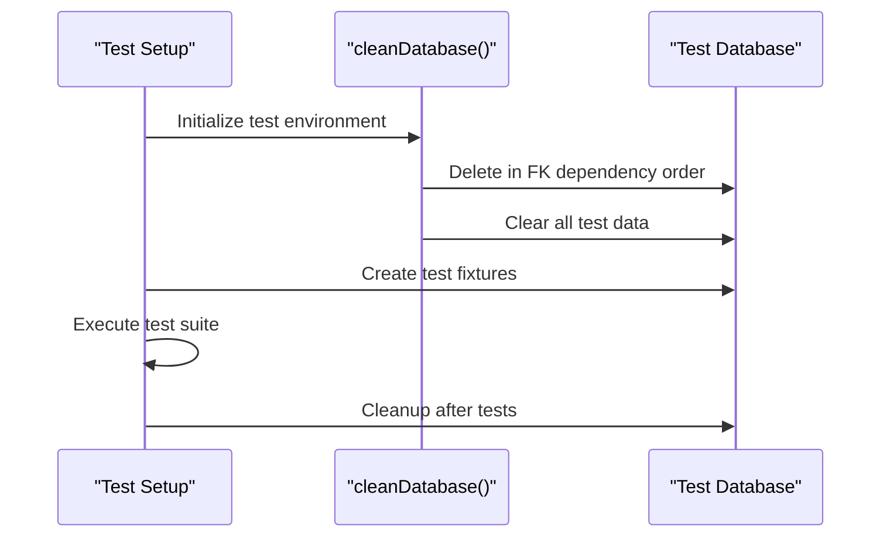
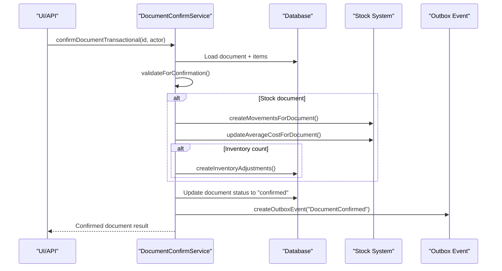
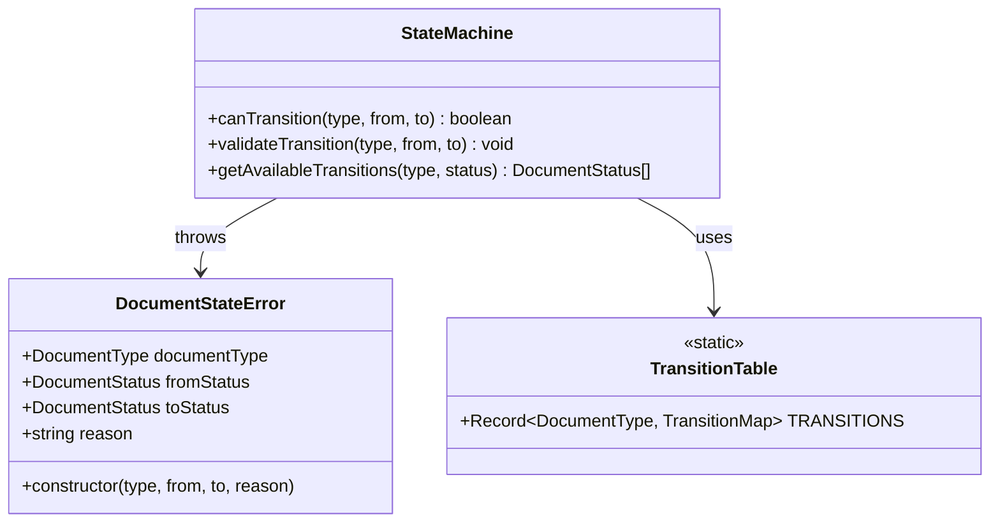
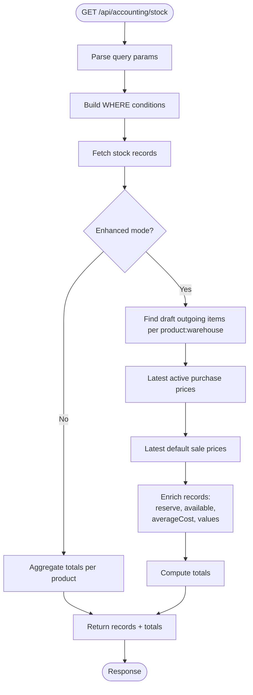
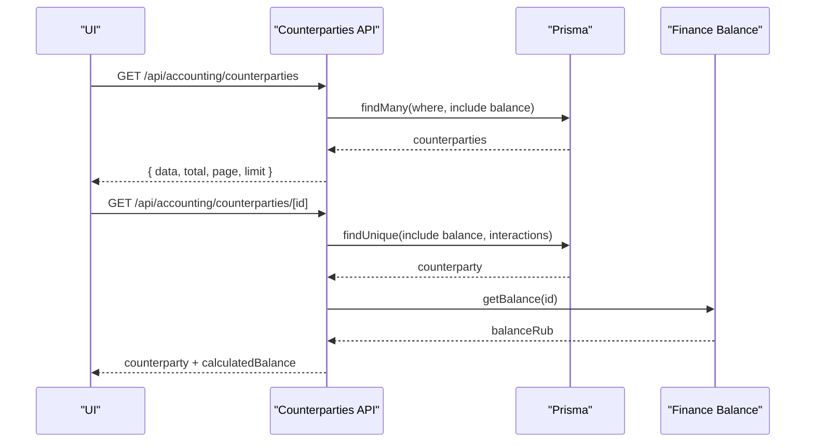
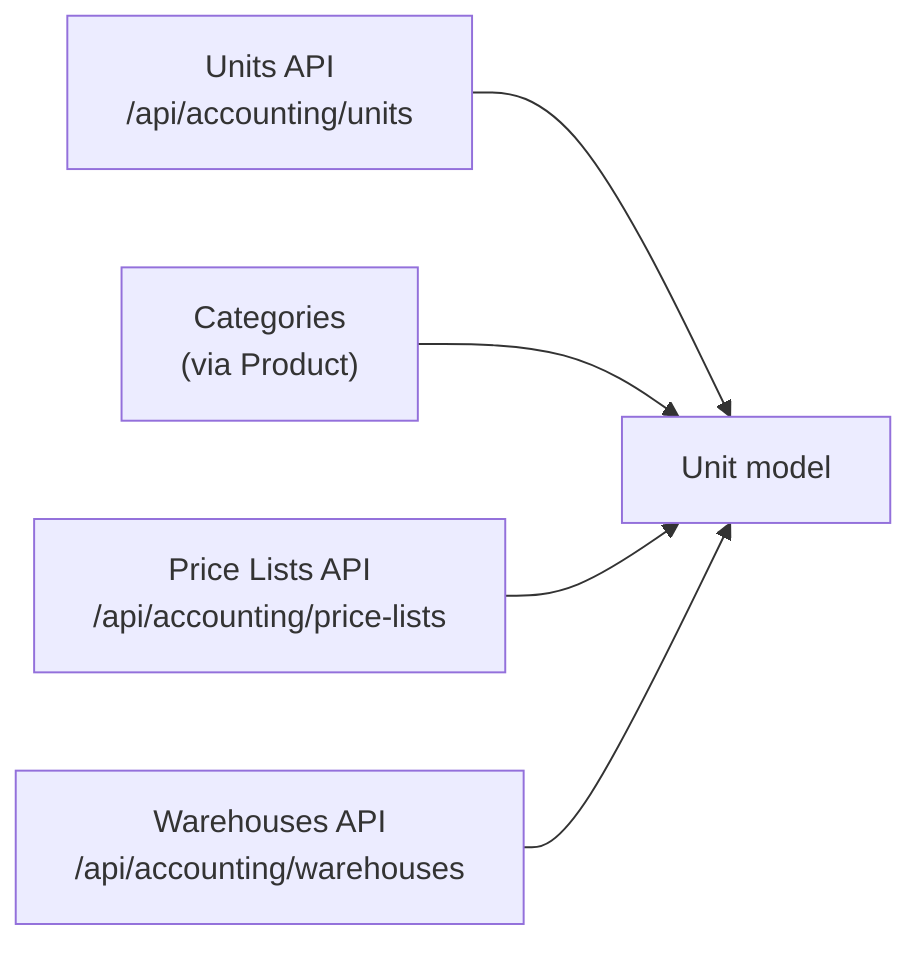
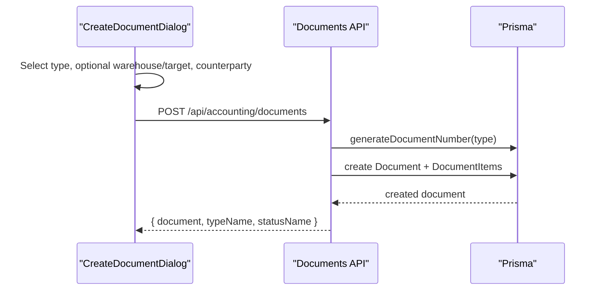

# Accounting Module

<cite>
**Referenced Files in This Document**
- [app/(accounting)/layout.tsx](file://app/(accounting)/layout.tsx)
- [app/(accounting)/page.tsx](file://app/(accounting)/page.tsx)
- [app/api/accounting/documents/route.ts](file://app/api/accounting/documents/route.ts)
- [app/api/accounting/documents/[id]/route.ts](file://app/api/accounting/documents/[id]/route.ts)
- [app/api/accounting/documents/[id]/confirm/route.ts](file://app/api/accounting/documents/[id]/confirm/route.ts)
- [app/api/accounting/documents/bulk-confirm/route.ts](file://app/api/accounting/documents/bulk-confirm/route.ts)
- [components/accounting/CreateDocumentDialog.tsx](file://components/accounting/CreateDocumentDialog.tsx)
- [lib/modules/accounting/services/document-confirm.service.ts](file://lib/modules/accounting/services/document-confirm.service.ts)
- [lib/modules/accounting/document-states.ts](file://lib/modules/accounting/document-states.ts)
- [lib/modules/accounting/documents.ts](file://lib/modules/accounting/documents.ts)
- [lib/modules/accounting/schemas/documents.schema.ts](file://lib/modules/accounting/schemas/documents.schema.ts)
- [lib/modules/accounting/inventory/predicates.ts](file://lib/modules/accounting/inventory/predicates.ts)
- [lib/modules/accounting/inventory/stock.ts](file://lib/modules/accounting/inventory/stock.ts)
- [lib/modules/accounting/inventory/stock-movements.ts](file://lib/modules/accounting/inventory/stock-movements.ts)
- [lib/modules/accounting/finance/cogs.ts](file://lib/modules/accounting/finance/cogs.ts)
- [app/api/accounting/stock/route.ts](file://app/api/accounting/stock/route.ts)
- [app/api/accounting/counterparties/route.ts](file://app/api/accounting/counterparties/route.ts)
- [app/api/accounting/counterparties/[id]/route.ts](file://app/api/accounting/counterparties/[id]/route.ts)
- [components/accounting/CounterpartiesTable.tsx](file://components/accounting/CounterpartiesTable.tsx)
- [app/api/accounting/warehouses/route.ts](file://app/api/accounting/warehouses/route.ts)
- [app/api/accounting/units/route.ts](file://app/api/accounting/units/route.ts)
- [app/api/accounting/price-lists/route.ts](file://app/api/accounting/price-lists/route.ts)
- [lib/modules/accounting/balance.ts](file://lib/modules/accounting/balance.ts)
- [lib/modules/accounting/index.ts](file://lib/modules/accounting/index.ts)
- [lib/modules/accounting/types.ts](file://lib/modules/accounting/types.ts)
- [lib/modules/accounting/schemas/index.ts](file://lib/modules/accounting/schemas/index.ts)
- [lib/domain/documents/queries.ts](file://lib/domain/documents/queries.ts)
- [components/domain/accounting/doc-types.ts](file://components/domain/accounting/doc-types.ts)
- [app/(accounting)/references/page.tsx](file://app/(accounting)/references/page.tsx)
- [prisma/schema.prisma](file://prisma/schema.prisma)
- [vitest.config.ts](file://vitest.config.ts)
- [vitest.integration.config.ts](file://vitest.integration.config.ts)
- [vitest.unit.config.ts](file://vitest.unit.config.ts)
- [vitest.service.config.ts](file://vitest.service.config.ts)
- [tests/setup.ts](file://tests/setup.ts)
- [tests/helpers/test-db.ts](file://tests/helpers/test-db.ts)
- [tests/integration/api/documents.test.ts](file://tests/integration/api/documents.test.ts)
- [tests/unit/lib/documents.test.ts](file://tests/unit/lib/documents.test.ts)
- [tests/unit/lib/stock-movements.test.ts](file://tests/unit/lib/stock-movements.test.ts)
- [package.json](file://package.json)
</cite>

## Update Summary
**Changes Made**
- Complete restructuring of accounting module with comprehensive service layer decomposition
- Consolidation of factory patterns and legacy code removal
- Enhanced document management with new service-based architecture
- Addition of 17 new service classes for specialized business operations
- Implementation of modular service organization with barrel exports
- Updated testing infrastructure with multi-tier configuration hierarchy

## Table of Contents
1. [Introduction](#introduction)
2. [Project Structure](#project-structure)
3. [Core Components](#core-components)
4. [Architecture Overview](#architecture-overview)
5. [Testing Infrastructure](#testing-infrastructure)
6. [Detailed Component Analysis](#detailed-component-analysis)
7. [Service Layer Decomposition](#service-layer-decomposition)
8. [Dependency Analysis](#dependency-analysis)
9. [Performance Considerations](#performance-considerations)
10. [Troubleshooting Guide](#troubleshooting-guide)
11. [Conclusion](#conclusion)
12. [Appendices](#appendices)

## Introduction
The Accounting module is the core business engine of ListOpt ERP, responsible for managing inventory, documents, and financial transactions. Following a major architectural restructuring, the module now features a comprehensive service layer decomposition with 17 specialized services, consolidated factory patterns, and enhanced document management capabilities.

The module orchestrates the lifecycle of 11 document types across four primary domains:
- Stock operations: stock receipt, transfer, write-off, inventory count
- Purchase operations: purchase order, incoming shipment, supplier return
- Sales operations: sales order, outgoing shipment, customer return
- Payment operations: incoming and outgoing payments

It provides real-time stock tracking with moving average cost calculations, multi-warehouse support, counterparty relationship management, and a robust reference data system for units, categories, price lists, and warehouses. The module integrates with the Finance module for balances and chart-of-accounts posting, and exposes APIs for reporting and audit trails.

**Updated** The module now features a transactional document confirmation service with enhanced atomicity guarantees, centralized state management with comprehensive validation, and a fully decomposed service architecture that enables scalable operations across multiple business domains.

## Project Structure
The module has undergone extensive restructuring with a comprehensive service layer organization:
- UI pages and dashboards: app/(accounting)/*
- API routes: app/api/accounting/* (documents, stock, counterparties, references)
- Service layer: lib/modules/accounting/services/* (17 specialized services)
- Domain services: lib/modules/accounting/* (documents, schemas, types)
- Shared logic and schemas: lib/modules/accounting/schemas/*
- Data model: prisma/schema.prisma

```mermaid
graph TB
subgraph "UI Layer"
L["Layout<br/>app/(accounting)/layout.tsx"]
D["Dashboard<br/>app/(accounting)/page.tsx"]
CDD["CreateDocumentDialog<br/>components/accounting/CreateDocumentDialog.tsx"]
CT["CounterpartiesTable<br/>components/accounting/CounterpartiesTable.tsx"]
REF["References Page<br/>app/(accounting)/references/page.tsx"]
end
subgraph "API Layer"
DOC["Documents API<br/>app/api/accounting/documents/*.ts"]
CONF["Confirmation API<br/>app/api/accounting/documents/*/confirm/*.ts"]
STOCK["Stock API<br/>app/api/accounting/stock/route.ts"]
CP["Counterparties API<br/>app/api/accounting/counterparties/*.ts"]
W["Warehouses API<br/>app/api/accounting/warehouses/route.ts"]
U["Units API<br/>app/api/accounting/units/route.ts"]
PL["Price Lists API<br/>app/api/accounting/price-lists/route.ts"]
end
subgraph "Service Layer"
BAL["Balance Service<br/>services/balance.service.ts"]
DOC_SVC["Document Service<br/>services/document.service.ts"]
STOCK_SVC["Stock Service<br/>services/stock.service.ts"]
PROD_SVC["Product Service<br/>services/product.service.ts"]
CP_SVC["Counterparty Service<br/>services/counterparty.service.ts"]
WH_SVC["Warehouse Service<br/>services/warehouse.service.ts"]
PRICE_SVC["Price Service<br/>services/price.service.ts"]
CAT_SVC["Category Service<br/>services/category.service.ts"]
UNIT_SVC["Unit Service<br/>services/unit.service.ts"]
VT_SVC["Variant Type Service<br/>services/variant-type.service.ts"]
CF_SVC["Custom Field Service<br/>services/custom-field.service.ts"]
CMS_SVC["CMS Page Service<br/>services/cms-page.service.ts"]
REP_SVC["Report Service<br/>services/report.service.ts"]
SETTINGS_SVC["Settings Service<br/>services/settings.service.ts"]
INT_SVC["Integration Service<br/>services/integration.service.ts"]
JOURNAL_SVC["Journal Service<br/>services/journal.service.ts"]
USER_SVC["User Service<br/>services/user.service.ts"]
EADMIN_SVC["Ecommerce Admin Service<br/>services/ecommerce-admin.service.ts"]
VG_SVC["Variant Group Service<br/>services/variant-group.service.ts"]
FR_SVC["Finance Report Service<br/>services/finance-report.service.ts"]
end
subgraph "Domain Services"
DOCUTIL["Document Utilities<br/>lib/modules/accounting/documents.ts"]
STATES["State Machine<br/>lib/modules/accounting/document-states.ts"]
CONFIRM["Document Confirmation Service<br/>lib/modules/accounting/services/document-confirm.service.ts"]
INV["Inventory Predicates<br/>lib/modules/accounting/inventory/predicates.ts"]
STOCKOPS["Stock Operations<br/>lib/modules/accounting/inventory/stock.ts"]
MOVEMENTS["Stock Movements<br/>lib/modules/accounting/inventory/stock-movements.ts"]
COGS["COGS Calculation<br/>lib/modules/accounting/finance/cogs.ts"]
TYPES["Types<br/>lib/modules/accounting/types.ts"]
SCHEMAS["Schemas<br/>lib/modules/accounting/schemas/index.ts"]
end
subgraph "Data Model"
PRISMA["Prisma Schema<br/>prisma/schema.prisma"]
end
L --> D
D --> DOC
D --> CONF
D --> STOCK
D --> CP
D --> REF
CDD --> DOC
CT --> CP
DOC --> DOCUTIL
CONF --> CONFIRM
CONFIRM --> STATES
CONFIRM --> INV
CONFIRM --> STOCKOPS
CONFIRM --> MOVEMENTS
CP --> COGS
DOC --- PRISMA
CONF --- PRISMA
STOCK --- PRISMA
CP --- PRISMA
W --- PRISMA
U --- PRISMA
PL --- PRISMA
BAL --> PRISMA
DOC_SVC --> PRISMA
STOCK_SVC --> PRISMA
PROD_SVC --> PRISMA
CP_SVC --> PRISMA
WH_SVC --> PRISMA
PRICE_SVC --> PRISMA
CAT_SVC --> PRISMA
UNIT_SVC --> PRISMA
VT_SVC --> PRISMA
CF_SVC --> PRISMA
CMS_SVC --> PRISMA
REP_SVC --> PRISMA
SETTINGS_SVC --> PRISMA
INT_SVC --> PRISMA
JOURNAL_SVC --> PRISMA
USER_SVC --> PRISMA
EADMIN_SVC --> PRISMA
VG_SVC --> PRISMA
FR_SVC --> PRISMA
```



**Diagram sources**
- [app/(accounting)/layout.tsx:1-24](file://app/(accounting)/layout.tsx#L1-L24)
- [app/(accounting)/page.tsx:1-273](file://app/(accounting)/page.tsx#L1-L273)
- [components/accounting/CreateDocumentDialog.tsx:1-244](file://components/accounting/CreateDocumentDialog.tsx#L1-L244)
- [components/accounting/CounterpartiesTable.tsx:1-190](file://components/accounting/CounterpartiesTable.tsx#L1-L190)
- [app/api/accounting/documents/route.ts:1-136](file://app/api/accounting/documents/route.ts#L1-L136)
- [app/api/accounting/documents/[id]/confirm/route.ts:1-34](file://app/api/accounting/documents/[id]/confirm/route.ts#L1-L34)
- [app/api/accounting/documents/bulk-confirm/route.ts:1-100](file://app/api/accounting/documents/bulk-confirm/route.ts#L1-L100)
- [app/api/accounting/stock/route.ts:1-192](file://app/api/accounting/stock/route.ts#L1-L192)
- [app/api/accounting/counterparties/route.ts:1-81](file://app/api/accounting/counterparties/route.ts#L1-L81)
- [app/api/accounting/counterparties/[id]/route.ts:1-87](file://app/api/accounting/counterparties/[id]/route.ts#L1-L87)
- [app/api/accounting/warehouses/route.ts:1-45](file://app/api/accounting/warehouses/route.ts#L1-L45)
- [app/api/accounting/units/route.ts:1-39](file://app/api/accounting/units/route.ts#L1-L39)
- [app/api/accounting/price-lists/route.ts:1-40](file://app/api/accounting/price-lists/route.ts#L1-L40)
- [app/(accounting)/references/page.tsx:73-75](file://app/(accounting)/references/page.tsx#L73-L75)
- [lib/modules/accounting/services/document-confirm.service.ts:1-637](file://lib/modules/accounting/services/document-confirm.service.ts#L1-L637)
- [lib/modules/accounting/document-states.ts:1-155](file://lib/modules/accounting/document-states.ts#L1-L155)
- [lib/modules/accounting/inventory/predicates.ts:1-55](file://lib/modules/accounting/inventory/predicates.ts#L1-L55)
- [lib/modules/accounting/inventory/stock.ts:1-39](file://lib/modules/accounting/inventory/stock.ts#L1-L39)
- [lib/modules/accounting/inventory/stock-movements.ts:1-30](file://lib/modules/accounting/inventory/stock-movements.ts#L1-L30)
- [lib/modules/accounting/finance/cogs.ts:39-89](file://lib/modules/accounting/finance/cogs.ts#L39-L89)
- [lib/modules/accounting/balance.ts:1-7](file://lib/modules/accounting/balance.ts#L1-L7)
- [lib/modules/accounting/index.ts:1-26](file://lib/modules/accounting/index.ts#L1-L26)
- [prisma/schema.prisma:1-1064](file://prisma/schema.prisma#L1-L1064)

**Section sources**
- [app/(accounting)/layout.tsx:1-24](file://app/(accounting)/layout.tsx#L1-L24)
- [app/(accounting)/page.tsx:1-273](file://app/(accounting)/page.tsx#L1-L273)
- [lib/modules/accounting/index.ts:1-26](file://lib/modules/accounting/index.ts#L1-L26)

## Core Components
- **Comprehensive service layer**: 17 specialized services for balance, document, stock, product, counterparty, warehouse, price, category, unit, variant type, custom field, CMS page, report, settings, integration, journal, user, ecommerce admin, variant group, and finance report management.
- **Transaction-safe document confirmation**: Atomic confirmation service ensuring stock movements, cost calculations, and state changes occur together.
- **Centralized state management**: Unified state machine controlling all document status transitions across domains.
- **Enhanced stock management**: Real-time tracking per warehouse/product with moving average cost, reserve calculation, and inventory adjustment workflow.
- **Domain-specific organization**: Inventory and finance modules separated for better maintainability and scalability.
- **Counterparty management**: Customer/supplier relationship lifecycle with balances and interaction history.
- **Reference data**: Units, product categories, price lists, and warehouses with comprehensive CRUD operations.
- **Integration points**: Finance module for balances and chart-of-accounts posting; e-commerce for order-to-document synchronization.
- **Comprehensive testing infrastructure**: Multi-tier testing approach with unit, service, and integration test configurations.
- **Factory consolidation**: Streamlined entity creation with tenant-aware operations and automatic dependency resolution.

**Updated** The service layer decomposition provides specialized business operations with clear separation of concerns, enabling independent development and testing of individual business capabilities.

**Section sources**
- [lib/modules/accounting/index.ts:6-26](file://lib/modules/accounting/index.ts#L6-L26)
- [lib/modules/accounting/services/document-confirm.service.ts:244-350](file://lib/modules/accounting/services/document-confirm.service.ts#L244-L350)
- [lib/modules/accounting/document-states.ts:114-155](file://lib/modules/accounting/document-states.ts#L114-L155)
- [lib/modules/accounting/inventory/stock.ts:15-39](file://lib/modules/accounting/inventory/stock.ts#L15-L39)
- [lib/modules/accounting/inventory/stock-movements.ts:1-30](file://lib/modules/accounting/inventory/stock-movements.ts#L1-L30)
- [lib/modules/accounting/documents.ts:17-32](file://lib/modules/accounting/documents.ts#L17-L32)
- [app/api/accounting/documents/route.ts:1-136](file://app/api/accounting/documents/route.ts#L1-L136)
- [app/api/accounting/stock/route.ts:1-192](file://app/api/accounting/stock/route.ts#L1-L192)
- [app/api/accounting/counterparties/route.ts:1-81](file://app/api/accounting/counterparties/route.ts#L1-L81)
- [lib/modules/accounting/balance.ts:1-7](file://lib/modules/accounting/balance.ts#L1-L7)

## Architecture Overview
The module follows a layered architecture with comprehensive service layer decomposition:
- UI layer: Next.js app directory pages and shared components.
- API layer: Next.js API routes implementing CRUD and domain workflows.
- Service layer: 17 specialized services for business operations with clear interfaces.
- Domain services: specialized services for document confirmation, inventory management, and financial calculations.
- State management: centralized state machine controlling all document transitions.
- Persistence: Prisma ORM mapping to PostgreSQL.

```mermaid
graph TB
UI["UI Pages<br/>app/(accounting)/*"] --> API["API Routes<br/>app/api/accounting/*"]
API --> SERVICES["Service Layer<br/>lib/modules/accounting/services/*"]
API --> CONFIRM["Document Confirmation<br/>lib/modules/accounting/services/document-confirm.service.ts"]
SERVICES --> BALANCE["Balance Service"]
SERVICES --> DOCUMENT["Document Service"]
SERVICES --> STOCK["Stock Service"]
SERVICES --> PRODUCT["Product Service"]
SERVICES --> COUNTERPARTY["Counterparty Service"]
SERVICES --> WAREHOUSE["Warehouse Service"]
SERVICES --> PRICE["Price Service"]
SERVICES --> CATEGORY["Category Service"]
SERVICES --> UNIT["Unit Service"]
SERVICES --> VARIANT_TYPE["Variant Type Service"]
SERVICES --> CUSTOM_FIELD["Custom Field Service"]
SERVICES --> CMS_PAGE["CMS Page Service"]
SERVICES --> REPORT["Report Service"]
SERVICES --> SETTINGS["Settings Service"]
SERVICES --> INTEGRATION["Integration Service"]
SERVICES --> JOURNAL["Journal Service"]
SERVICES --> USER["User Service"]
SERVICES --> ECOMMERCE_ADMIN["Ecommerce Admin Service"]
SERVICES --> VARIANT_GROUP["Variant Group Service"]
SERVICES --> FINANCE_REPORT["Finance Report Service"]
SERVICES --> STATES["State Machine<br/>lib/modules/accounting/document-states.ts"]
SERVICES --> INVENTORY["Inventory Domain<br/>lib/modules/accounting/inventory/*"]
SERVICES --> FINANCE["Finance Domain<br/>lib/modules/accounting/finance/*"]
API --> DB["Prisma Models<br/>prisma/schema.prisma"]
CONFIRM --> DB
INVENTORY --> DB
FINANCE --> DB
STATES --> DB
DB --> PG["PostgreSQL"]
```



**Diagram sources**
- [app/(accounting)/page.tsx:1-273](file://app/(accounting)/page.tsx#L1-L273)
- [app/api/accounting/documents/route.ts:1-136](file://app/api/accounting/documents/route.ts#L1-L136)
- [lib/modules/accounting/services/document-confirm.service.ts:1-637](file://lib/modules/accounting/services/document-confirm.service.ts#L1-L637)
- [lib/modules/accounting/document-states.ts:1-155](file://lib/modules/accounting/document-states.ts#L1-L155)
- [lib/modules/accounting/inventory/predicates.ts:1-55](file://lib/modules/accounting/inventory/predicates.ts#L1-L55)
- [lib/modules/accounting/finance/cogs.ts:39-89](file://lib/modules/accounting/finance/cogs.ts#L39-L89)
- [lib/modules/accounting/index.ts:6-26](file://lib/modules/accounting/index.ts#L6-L26)
- [prisma/schema.prisma:1-1064](file://prisma/schema.prisma#L1-L1064)

## Testing Infrastructure

The Accounting module employs a comprehensive multi-tier testing strategy using Vitest with specialized configurations for different testing scenarios:

### Test Configuration Hierarchy

```mermaid
graph TB
subgraph "Vitest Configuration Hierarchy"
ROOT["vitest.config.ts<br/>Base configuration"] --> UNIT["vitest.unit.config.ts<br/>Pure unit tests"]
ROOT --> SERVICE["vitest.service.config.ts<br/>Service-level tests"]
ROOT --> INTEGRATION["vitest.integration.config.ts<br/>Full integration tests"]
END
subgraph "Test Categories"
UNIT --> UNIT_TESTS["tests/unit/**/*"]
SERVICE --> SERVICE_TESTS["tests/unit/lib/* (DB-backed)"]
INTEGRATION --> INTEGRATION_TESTS["tests/integration/**/*"]
END
subgraph "Execution Scripts"
NPM["package.json scripts"] --> TEST_ALL["test:all"]
NPM --> TEST_UNIT["test:unit"]
NPM --> TEST_SERVICE["test:service"]
NPM --> TEST_INTEGRATION["test:integration"]
END
```

**Diagram sources**
- [vitest.config.ts:1-30](file://vitest.config.ts#L1-L30)
- [vitest.unit.config.ts:1-34](file://vitest.unit.config.ts#L1-L34)
- [vitest.service.config.ts:1-40](file://vitest.service.config.ts#L1-L40)
- [vitest.integration.config.ts:1-36](file://vitest.integration.config.ts#L1-L36)
- [package.json:5-33](file://package.json#L5-L33)

### Base Configuration (`vitest.config.ts`)
The root configuration establishes global testing settings including environment setup, timeout values, and parallelization controls. It serves as the foundation for all other test configurations.

### Unit Test Configuration (`vitest.unit.config.ts`)
Focused on pure unit tests that don't require database access. Excludes specific service tests that need database connectivity and allows parallel execution for faster feedback.

### Service Test Configuration (`vitest.service.config.ts`)
Targets business logic functions that require database access. These tests validate service-level operations against a real test database with sequential execution to prevent race conditions.

### Integration Test Configuration (`vitest.integration.config.ts`)
The most comprehensive test suite running against a real test database with full data flows. Includes repository queries, transaction boundaries, and API route handlers with strict sequential execution.

### Database Management and Isolation
The testing infrastructure includes sophisticated database management through helper utilities:



**Diagram sources**
- [tests/helpers/test-db.ts:1-75](file://tests/helpers/test-db.ts#L1-L75)
- [tests/setup.ts:1-26](file://tests/setup.ts#L1-L26)

**Section sources**
- [vitest.config.ts:1-30](file://vitest.config.ts#L1-L30)
- [vitest.unit.config.ts:1-34](file://vitest.unit.config.ts#L1-L34)
- [vitest.service.config.ts:1-40](file://vitest.service.config.ts#L1-L40)
- [vitest.integration.config.ts:1-36](file://vitest.integration.config.ts#L1-L36)
- [tests/helpers/test-db.ts:1-75](file://tests/helpers/test-db.ts#L1-L75)
- [tests/setup.ts:1-26](file://tests/setup.ts#L1-L26)
- [package.json:5-33](file://package.json#L5-L33)

## Detailed Component Analysis

### Document Confirmation Service
The transaction-safe document confirmation service ensures atomicity across all document confirmation operations. It validates documents, creates stock movements, updates projections, calculates costs, and marks documents confirmed in a strict sequence.



**Diagram sources**
- [lib/modules/accounting/services/document-confirm.service.ts:244-350](file://lib/modules/accounting/services/document-confirm.service.ts#L244-L350)
- [lib/modules/accounting/services/document-confirm.service.ts:99-160](file://lib/modules/accounting/services/document-confirm.service.ts#L99-L160)
- [lib/modules/accounting/services/document-confirm.service.ts:262-297](file://lib/modules/accounting/services/document-confirm.service.ts#L262-L297)

Key features:
- **Atomic operations**: All confirmation steps occur within a single database transaction
- **Strict ordering**: Stock movements, cost updates, and state changes happen in a defined sequence
- **Idempotent operations**: Stock movements and reversals are designed to be safe across retries
- **Inventory adjustments**: Automatic creation of write-off and stock-receipt documents for inventory discrepancies
- **Event-driven architecture**: Outbox pattern ensures post-confirmation handlers are triggered reliably

**Section sources**
- [lib/modules/accounting/services/document-confirm.service.ts:244-350](file://lib/modules/accounting/services/document-confirm.service.ts#L244-L350)
- [lib/modules/accounting/services/document-confirm.service.ts:99-160](file://lib/modules/accounting/services/document-confirm.service.ts#L99-L160)
- [lib/modules/accounting/services/document-confirm.service.ts:496-636](file://lib/modules/accounting/services/document-confirm.service.ts#L496-L636)

### Centralized State Management
The document state machine provides a single source of truth for all document status transitions across all domains. It defines allowed transitions and validates state changes before any business logic executes.



**Diagram sources**
- [lib/modules/accounting/document-states.ts:22-34](file://lib/modules/accounting/document-states.ts#L22-L34)
- [lib/modules/accounting/document-states.ts:114-155](file://lib/modules/accounting/document-states.ts#L114-L155)
- [lib/modules/accounting/document-states.ts:45-104](file://lib/modules/accounting/document-states.ts#L45-L104)

**Updated** The state machine now covers all document types including sales orders with extended lifecycle (draft → confirmed → shipped → delivered) and inventory counts with specialized validation.

**Section sources**
- [lib/modules/accounting/document-states.ts:1-155](file://lib/modules/accounting/document-states.ts#L1-L155)
- [app/api/accounting/documents/[id]/confirm/route.ts:12-34](file://app/api/accounting/documents/[id]/confirm/route.ts#L12-L34)

### Enhanced Stock Management
Real-time stock tracking maintains per-warehouse, per-product quantities and moving average costs with improved accuracy and performance. The system now includes automatic inventory adjustment creation and enhanced cost calculation methods.



**Diagram sources**
- [app/api/accounting/stock/route.ts:1-192](file://app/api/accounting/stock/route.ts#L1-L192)

Business rules:
- **Reserve calculation**: Sum of quantities in draft outgoing documents grouped by product and warehouse
- **Available stock**: Quantity minus reserve with real-time updates
- **Cost calculation**: Moving average from stock records with fallback to latest purchase price
- **Inventory adjustments**: Automatic creation of write-off and stock-receipt documents for inventory discrepancies
- **COGS tracking**: Accurate cost of goods sold calculation using stock records and ledger entries

**Section sources**
- [app/api/accounting/stock/route.ts:1-192](file://app/api/accounting/stock/route.ts#L1-L192)
- [lib/modules/accounting/inventory/stock.ts:15-39](file://lib/modules/accounting/inventory/stock.ts#L15-L39)
- [lib/modules/accounting/finance/cogs.ts:39-89](file://lib/modules/accounting/finance/cogs.ts#L39-L89)

### Domain-Specific Organization
The module has been restructured into domain-specific submodules for better maintainability and scalability:

- **Inventory domain**: Stock management, movement tracking, and cost calculations
- **Finance domain**: COGS calculation, balance management, and financial reporting
- **Services**: Transaction-safe document operations and business logic
- **Predicates**: Document type classifications and business rule definitions

```mermaid
graph LR
subgraph "Accounting Module"
ACCOUNTING["Accounting Root<br/>lib/modules/accounting/"]
subgraph "Inventory Domain"
PRED["Predicates<br/>inventory/predicates.ts"]
STOCK["Stock Operations<br/>inventory/stock.ts"]
MOVES["Stock Movements<br/>inventory/stock-movements.ts"]
END
subgraph "Finance Domain"
COGS["COGS Calculation<br/>finance/cogs.ts"]
END
subgraph "Services"
CONF["Document Confirmation<br/>services/document-confirm.service.ts"]
STATES["State Machine<br/>document-states.ts"]
END
ACCOUNTING --> PRED
ACCOUNTING --> STOCK
ACCOUNTING --> MOVES
ACCOUNTING --> COGS
ACCOUNTING --> CONF
ACCOUNTING --> STATES
```

**Diagram sources**
- [lib/modules/accounting/inventory/predicates.ts:1-55](file://lib/modules/accounting/inventory/predicates.ts#L1-L55)
- [lib/modules/accounting/inventory/stock.ts:1-39](file://lib/modules/accounting/inventory/stock.ts#L1-L39)
- [lib/modules/accounting/inventory/stock-movements.ts:1-30](file://lib/modules/accounting/inventory/stock-movements.ts#L1-L30)
- [lib/modules/accounting/finance/cogs.ts:39-89](file://lib/modules/accounting/finance/cogs.ts#L39-L89)
- [lib/modules/accounting/services/document-confirm.service.ts:1-637](file://lib/modules/accounting/services/document-confirm.service.ts#L1-L637)
- [lib/modules/accounting/document-states.ts:1-155](file://lib/modules/accounting/document-states.ts#L1-L155)

**Section sources**
- [lib/modules/accounting/inventory/predicates.ts:1-55](file://lib/modules/accounting/inventory/predicates.ts#L1-L55)
- [lib/modules/accounting/inventory/stock.ts:1-39](file://lib/modules/accounting/inventory/stock.ts#L1-L39)
- [lib/modules/accounting/inventory/stock-movements.ts:1-30](file://lib/modules/accounting/inventory/stock-movements.ts#L1-L30)
- [lib/modules/accounting/finance/cogs.ts:39-89](file://lib/modules/accounting/finance/cogs.ts#L39-L89)
- [lib/modules/accounting/services/document-confirm.service.ts:1-637](file://lib/modules/accounting/services/document-confirm.service.ts#L1-L637)
- [lib/modules/accounting/document-states.ts:1-155](file://lib/modules/accounting/document-states.ts#L1-L155)

### Counterparty Management
Counterparties represent customers and suppliers. The system tracks balances, interaction history, and supports filtering and search. Balances are recalculated via the Finance module.



**Diagram sources**
- [app/api/accounting/counterparties/route.ts:1-81](file://app/api/accounting/counterparties/route.ts#L1-L81)
- [app/api/accounting/counterparties/[id]/route.ts:1-87](file://app/api/accounting/counterparties/[id]/route.ts#L1-L87)
- [lib/modules/accounting/balance.ts:1-7](file://lib/modules/accounting/balance.ts#L1-L7)

**Section sources**
- [app/api/accounting/counterparties/route.ts:1-81](file://app/api/accounting/counterparties/route.ts#L1-L81)
- [app/api/accounting/counterparties/[id]/route.ts:1-87](file://app/api/accounting/counterparties/[id]/route.ts#L1-L87)
- [components/accounting/CounterpartiesTable.tsx:1-190](file://components/accounting/CounterpartiesTable.tsx#L1-L190)
- [lib/modules/accounting/balance.ts:1-7](file://lib/modules/accounting/balance.ts#L1-L7)

### Reference Data Management
Reference data includes units of measurement, product categories, price lists, and warehouses. These are maintained via dedicated APIs and used across documents and stock.



**Diagram sources**
- [app/api/accounting/units/route.ts:1-39](file://app/api/accounting/units/route.ts#L1-L39)
- [app/api/accounting/price-lists/route.ts:1-40](file://app/api/accounting/price-lists/route.ts#L1-L40)
- [app/api/accounting/warehouses/route.ts:1-45](file://app/api/accounting/warehouses/route.ts#L1-L45)
- [prisma/schema.prisma:81-106](file://prisma/schema.prisma#L81-L106)

**Section sources**
- [app/api/accounting/units/route.ts:1-39](file://app/api/accounting/units/route.ts#L1-L39)
- [app/api/accounting/price-lists/route.ts:1-40](file://app/api/accounting/price-lists/route.ts#L1-L40)
- [app/api/accounting/warehouses/route.ts:1-45](file://app/api/accounting/warehouses/route.ts#L1-L45)

### Document Creation Workflow
The CreateDocumentDialog drives document creation with dynamic visibility of warehouse, target warehouse, and counterparty based on document type.



**Diagram sources**
- [components/accounting/CreateDocumentDialog.tsx:1-244](file://components/accounting/CreateDocumentDialog.tsx#L1-L244)
- [app/api/accounting/documents/route.ts:63-135](file://app/api/accounting/documents/route.ts#L63-L135)
- [lib/modules/accounting/documents.ts:69-88](file://lib/modules/accounting/documents.ts#L69-L88)

**Section sources**
- [components/accounting/CreateDocumentDialog.tsx:1-244](file://components/accounting/CreateDocumentDialog.tsx#L1-L244)
- [lib/modules/accounting/documents.ts:1-144](file://lib/modules/accounting/documents.ts#L1-L144)

## Service Layer Decomposition

The Accounting module now features a comprehensive service layer with 17 specialized services, each handling specific business operations:

### Core Business Services
- **Balance Service**: Manages financial balances and account reconciliations
- **Document Service**: Handles document lifecycle, CRUD operations, and business rules
- **Stock Service**: Manages inventory tracking, movements, and cost calculations
- **Product Service**: Handles product catalog management and variant hierarchies
- **Counterparty Service**: Manages customer/supplier relationships and balances

### Reference Data Services
- **Warehouse Service**: Manages storage locations and capacity planning
- **Price Service**: Handles pricing strategies and discount calculations
- **Category Service**: Manages product categorization and classification
- **Unit Service**: Handles measurement units and conversions
- **Variant Type Service**: Manages product variant attributes and options
- **Variant Group Service**: Handles variant grouping and organization

### Administrative Services
- **Custom Field Service**: Manages dynamic field definitions and data collection
- **CMS Page Service**: Handles content management and page publishing
- **Report Service**: Generates financial and operational reports
- **Settings Service**: Manages system configuration and preferences
- **Integration Service**: Handles external system connections and data sync
- **Journal Service**: Manages accounting journal entries and postings
- **User Service**: Handles user management and authorization
- **Ecommerce Admin Service**: Manages online store integration and order processing
- **Finance Report Service**: Handles specialized financial reporting requirements

```mermaid
graph TB
subgraph "Service Layer Architecture"
CORE["Core Services"]
REFERENCE["Reference Data Services"]
ADMIN["Administrative Services"]
END
subgraph "Core Services"
BAL["Balance Service"]
DOC["Document Service"]
STOCK["Stock Service"]
PROD["Product Service"]
CP["Counterparty Service"]
END
subgraph "Reference Data Services"
WH["Warehouse Service"]
PRICE["Price Service"]
CAT["Category Service"]
UNIT["Unit Service"]
VT["Variant Type Service"]
VG["Variant Group Service"]
END
subgraph "Administrative Services"
CF["Custom Field Service"]
CMS["CMS Page Service"]
REP["Report Service"]
SETTINGS["Settings Service"]
INT["Integration Service"]
JOURNAL["Journal Service"]
USER["User Service"]
EADMIN["Ecommerce Admin Service"]
FR["Finance Report Service"]
END
CORE --> BAL
CORE --> DOC
CORE --> STOCK
CORE --> PROD
CORE --> CP
REFERENCE --> WH
REFERENCE --> PRICE
REFERENCE --> CAT
REFERENCE --> UNIT
REFERENCE --> VT
REFERENCE --> VG
ADMIN --> CF
ADMIN --> CMS
ADMIN --> REP
ADMIN --> SETTINGS
ADMIN --> INT
ADMIN --> JOURNAL
ADMIN --> USER
ADMIN --> EADMIN
ADMIN --> FR
```

**Diagram sources**
- [lib/modules/accounting/index.ts:6-26](file://lib/modules/accounting/index.ts#L6-L26)

**Section sources**
- [lib/modules/accounting/index.ts:6-26](file://lib/modules/accounting/index.ts#L6-L26)

## Dependency Analysis
The module exhibits clear separation of concerns with comprehensive service layer organization:
- UI depends on API routes and shared components.
- API routes depend on Prisma models and specialized domain services.
- Service layer provides specialized business operations with clear interfaces.
- Domain services encapsulate business logic and coordinate across inventory and finance domains.
- Centralized state machine provides consistent transition validation.
- Transaction-safe services ensure atomicity across multiple operations.

```mermaid
graph TB
UI["UI Components<br/>pages, dialogs"] --> API["API Routes"]
API --> SERVICES["Service Layer"]
API --> CONFIRM["Document Confirmation Service"]
SERVICES --> BALANCE["Balance Service"]
SERVICES --> DOCUMENT["Document Service"]
SERVICES --> STOCK["Stock Service"]
SERVICES --> PRODUCT["Product Service"]
SERVICES --> COUNTERPARTY["Counterparty Service"]
SERVICES --> WAREHOUSE["Warehouse Service"]
SERVICES --> PRICE["Price Service"]
SERVICES --> CATEGORY["Category Service"]
SERVICES --> UNIT["Unit Service"]
SERVICES --> VARIANT_TYPE["Variant Type Service"]
SERVICES --> CUSTOM_FIELD["Custom Field Service"]
SERVICES --> CMS_PAGE["CMS Page Service"]
SERVICES --> REPORT["Report Service"]
SERVICES --> SETTINGS["Settings Service"]
SERVICES --> INTEGRATION["Integration Service"]
SERVICES --> JOURNAL["Journal Service"]
SERVICES --> USER["User Service"]
SERVICES --> ECOMMERCE_ADMIN["Ecommerce Admin Service"]
SERVICES --> VARIANT_GROUP["Variant Group Service"]
SERVICES --> FINANCE_REPORT["Finance Report Service"]
SERVICES --> STATES["State Machine"]
SERVICES --> INVENTORY["Inventory Services"]
SERVICES --> FINANCE["Finance Services"]
CONFIRM --> STATES
CONFIRM --> INVENTORY
CONFIRM --> FINANCE
INVENTORY --> DB["Prisma Models"]
FINANCE --> DB
STATES --> DB
DB --> FIN["Finance Balance"]
```



**Diagram sources**
- [lib/modules/accounting/services/document-confirm.service.ts:16-46](file://lib/modules/accounting/services/document-confirm.service.ts#L16-L46)
- [lib/modules/accounting/document-states.ts:16-34](file://lib/modules/accounting/document-states.ts#L16-L34)
- [lib/modules/accounting/inventory/predicates.ts:12-26](file://lib/modules/accounting/inventory/predicates.ts#L12-L26)
- [lib/modules/accounting/finance/cogs.ts:39-89](file://lib/modules/accounting/finance/cogs.ts#L39-L89)
- [lib/modules/accounting/balance.ts:1-7](file://lib/modules/accounting/balance.ts#L1-L7)
- [lib/modules/accounting/index.ts:6-26](file://lib/modules/accounting/index.ts#L6-L26)
- [prisma/schema.prisma:1-1064](file://prisma/schema.prisma#L1-L1064)

**Section sources**
- [lib/modules/accounting/services/document-confirm.service.ts:16-46](file://lib/modules/accounting/services/document-confirm.service.ts#L16-L46)
- [lib/modules/accounting/document-states.ts:16-34](file://lib/modules/accounting/document-states.ts#L16-L34)
- [lib/modules/accounting/inventory/predicates.ts:12-26](file://lib/modules/accounting/inventory/predicates.ts#L12-L26)
- [lib/modules/accounting/finance/cogs.ts:39-89](file://lib/modules/accounting/finance/cogs.ts#L39-L89)
- [lib/modules/accounting/balance.ts:1-7](file://lib/modules/accounting/balance.ts#L1-L7)
- [lib/modules/accounting/index.ts:6-26](file://lib/modules/accounting/index.ts#L6-L26)
- [prisma/schema.prisma:1-1064](file://prisma/schema.prisma#L1-L1064)

## Performance Considerations
- **Transaction batching**: Document confirmation occurs within a single database transaction for atomicity and performance.
- **Idempotent operations**: Stock movements and reversals are designed to be safe across retries, reducing error handling overhead.
- **Domain-specific optimization**: Inventory and finance operations are optimized separately for their specific use cases.
- **Event-driven processing**: Outbox pattern ensures post-confirmation handlers don't block the main transaction.
- **Batch queries**: Dashboard loads multiple metrics concurrently to minimize latency.
- **Index optimization**: Strategic indexes on enums and frequently filtered fields improve query performance.
- **Aggregation optimization**: Enhanced stock report computes aggregates server-side to avoid client-side heavy computations.
- **Pagination**: APIs enforce limits and pagination to prevent large result sets.
- **Test parallelization**: Unit tests run in parallel for faster feedback, while service and integration tests execute sequentially to prevent database race conditions.
- **Service layer caching**: Frequently accessed reference data can be cached at the service level for improved performance.
- **Factory consolidation**: Streamlined entity creation reduces database round trips and improves throughput.

## Troubleshooting Guide
Common issues and resolutions:
- **Authentication/authorization errors**: Ensure proper permissions for document and reference data operations.
- **Validation errors**: Verify request bodies conform to Zod schemas; check required fields for document creation.
- **Draft-only edits**: Documents in non-draft status cannot be modified or deleted.
- **Missing balances**: Confirm Finance module balance recalculations are up to date.
- **Confirmation failures**: Check DocumentConfirmError details for specific validation failures (stock availability, inventory count requirements).
- **State transition errors**: Use validateTransition to check allowed transitions before attempting state changes.
- **Inventory adjustment issues**: Verify that inventory count documents have actual quantities filled and appropriate warehouse assignment.
- **Service layer errors**: Check individual service implementations for specific business rule violations.
- **Factory creation failures**: Verify tenant context and dependency resolution in entity creation workflows.
- **Test execution failures**: Check Vitest configuration for proper environment setup and database connectivity.
- **Database cleanup issues**: Ensure test database is properly initialized and cleaned between test runs.
- **Race condition errors**: Verify that service and integration tests are configured for sequential execution.

**Section sources**
- [app/api/accounting/documents/[id]/route.ts:63-165](file://app/api/accounting/documents/[id]/route.ts#L63-L165)
- [app/api/accounting/counterparties/[id]/route.ts:35-86](file://app/api/accounting/counterparties/[id]/route.ts#L35-L86)
- [lib/modules/accounting/services/document-confirm.service.ts:99-160](file://lib/modules/accounting/services/document-confirm.service.ts#L99-L160)
- [lib/modules/accounting/document-states.ts:128-142](file://lib/modules/accounting/document-states.ts#L128-L142)
- [tests/helpers/test-db.ts:1-75](file://tests/helpers/test-db.ts#L1-L75)
- [vitest.integration.config.ts:1-36](file://vitest.integration.config.ts#L1-L36)

## Conclusion
The Accounting module provides a comprehensive, extensible foundation for inventory, document processing, and counterparty management. Following the major restructuring, the module now features a transaction-safe document confirmation service, centralized state management, and a fully decomposed service architecture with 17 specialized services that enable scalable operations across multiple warehouses and document workflows. The new architecture ensures data integrity, improves maintainability, and provides a solid foundation for future enhancements.

**Updated** The enhanced service layer decomposition with comprehensive factory consolidation and legacy code removal provides a modern, maintainable architecture that supports independent development and testing of individual business capabilities while maintaining strong cohesion within each service domain.

## Appendices

### Document Types and Business Rules
- **Stock operations**: stock_receipt, write_off, stock_transfer, inventory_count
- **Purchase operations**: purchase_order, incoming_shipment, supplier_return
- **Sales operations**: sales_order, outgoing_shipment, customer_return
- **Payment operations**: incoming_payment, outgoing_payment

**Updated** Sales orders now support extended lifecycle with shipped and delivered states, while inventory counts trigger automatic adjustment document creation.

Rules:
- **Stock impact**: Increase/decrease classification determines inventory movement.
- **Counterparty impact**: Receivables/payables affected by sales/purchases and payments.
- **Numbering**: Type-specific prefixes with auto-increment counters.
- **Visibility**: UI dynamically shows required fields based on document type.
- **State transitions**: Centralized validation ensures consistent business rules across all document types.

**Section sources**
- [lib/modules/accounting/documents.ts:1-144](file://lib/modules/accounting/documents.ts#L1-L144)
- [lib/modules/accounting/document-states.ts:45-104](file://lib/modules/accounting/document-states.ts#L45-L104)
- [components/accounting/CreateDocumentDialog.tsx:17-31](file://components/accounting/CreateDocumentDialog.tsx#L17-L31)
- [components/domain/accounting/doc-types.ts:6-19](file://components/domain/accounting/doc-types.ts#L6-L19)

### Data Model Highlights
- **Document and DocumentItem**: Define transactional records with expected/actual quantities and differences.
- **StockRecord**: Maintains per-warehouse quantities and moving average cost for real-time tracking.
- **StockMovement**: Logs immutable inventory changes with movement types and reversal support.
- **Counterparty and CounterpartyBalance**: Track relationships and balances with finance integration.
- **Units, PriceList, and Warehouse**: Reference entities used across documents and stock operations.
- **Outbox Events**: Immutable event log for post-confirmation handlers and audit trails.
- **Company Settings**: Configuration for tax regimes, account codes, and business parameters.

**Updated** Enhanced data model now includes comprehensive company settings, improved audit trail functionality, and streamlined reference data relationships.

**Section sources**
- [prisma/schema.prisma:449-538](file://prisma/schema.prisma#L449-L538)
- [prisma/schema.prisma:386-437](file://prisma/schema.prisma#L386-L437)
- [prisma/schema.prisma:309-363](file://prisma/schema.prisma#L309-L363)
- [prisma/schema.prisma:81-106](file://prisma/schema.prisma#L81-L106)
- [prisma/schema.prisma:544-590](file://prisma/schema.prisma#L544-L590)
- [prisma/schema.prisma:369-384](file://prisma/schema.prisma#L369-L384)
- [prisma/schema.prisma:881-899](file://prisma/schema.prisma#L881-L899)

### Transaction Safety Guarantees
The document confirmation service provides strict transaction safety guarantees:
- **Atomic operations**: All confirmation steps occur within a single database transaction
- **Idempotent stock operations**: Stock movements and reversals are safe across retries
- **Consistent state**: Document status updates only occur after all stock effects succeed
- **Event reliability**: Outbox pattern ensures post-confirmation handlers are triggered reliably
- **Error rollback**: Any failure in the confirmation sequence rolls back all changes

**Section sources**
- [lib/modules/accounting/services/document-confirm.service.ts:244-350](file://lib/modules/accounting/services/document-confirm.service.ts#L244-L350)
- [lib/modules/accounting/services/document-confirm.service.ts:351-366](file://lib/modules/accounting/services/document-confirm.service.ts#L351-L366)

### Testing Strategy and Execution Patterns

The Accounting module employs a comprehensive testing strategy with distinct configurations for different test types:

#### Test Execution Commands
- **Full test suite**: `npm run test` - Runs all test configurations sequentially
- **Unit tests only**: `npm run test:unit` - Pure unit tests with parallel execution
- **Service tests**: `npm run test:service` - Database-backed service tests with sequential execution
- **Integration tests**: `npm run test:integration` - Full integration tests against real database
- **Watch mode**: `npm run test:watch` - Continuous test execution during development
- **Coverage**: `npm run test:cov` - Test coverage generation

#### Database Isolation and Cleanup
The testing infrastructure ensures proper database isolation through:
- **Sequential execution**: Prevents race conditions between test files
- **Database cleanup**: Comprehensive cleanup of test data in dependency order
- **Environment setup**: Proper environment variable loading for test databases
- **Connection management**: Graceful database connection handling and cleanup

**Section sources**
- [vitest.config.ts:1-30](file://vitest.config.ts#L1-L30)
- [vitest.unit.config.ts:1-34](file://vitest.unit.config.ts#L1-L34)
- [vitest.service.config.ts:1-40](file://vitest.service.config.ts#L1-L40)
- [vitest.integration.config.ts:1-36](file://vitest.integration.config.ts#L1-L36)
- [tests/helpers/test-db.ts:1-75](file://tests/helpers/test-db.ts#L1-L75)
- [tests/setup.ts:1-26](file://tests/setup.ts#L1-L26)
- [package.json:5-33](file://package.json#L5-L33)

### Service Layer Architecture Details

The 17 specialized services provide comprehensive coverage of business operations:

#### Core Business Services
- **Balance Service**: Financial balance management and reconciliation
- **Document Service**: Document lifecycle management and business rules
- **Stock Service**: Inventory tracking and cost calculations
- **Product Service**: Product catalog and variant management
- **Counterparty Service**: Customer/supplier relationship management

#### Reference Data Services
- **Warehouse Service**: Storage location management
- **Price Service**: Pricing strategy and discount management
- **Category Service**: Product categorization
- **Unit Service**: Measurement unit management
- **Variant Type Service**: Product attribute definition
- **Variant Group Service**: Variant organization

#### Administrative Services
- **Custom Field Service**: Dynamic field management
- **CMS Page Service**: Content management
- **Report Service**: Reporting and analytics
- **Settings Service**: System configuration
- **Integration Service**: External system integration
- **Journal Service**: Accounting journal management
- **User Service**: User and permission management
- **Ecommerce Admin Service**: Online store management
- **Finance Report Service**: Specialized financial reporting

**Section sources**
- [lib/modules/accounting/index.ts:6-26](file://lib/modules/accounting/index.ts#L6-L26)
- [lib/modules/accounting/types.ts:1-4](file://lib/modules/accounting/types.ts#L1-L4)
- [lib/modules/accounting/schemas/index.ts:1-13](file://lib/modules/accounting/schemas/index.ts#L1-L13)
- [lib/domain/documents/queries.ts:49-85](file://lib/domain/documents/queries.ts#L49-L85)
- [app/(accounting)/references/page.tsx:73-75](file://app/(accounting)/references/page.tsx#L73-L75)