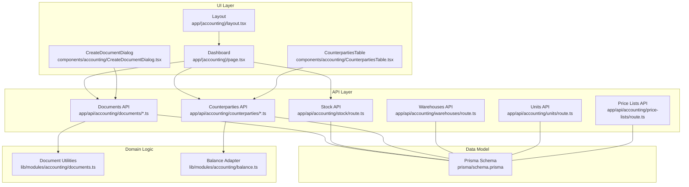
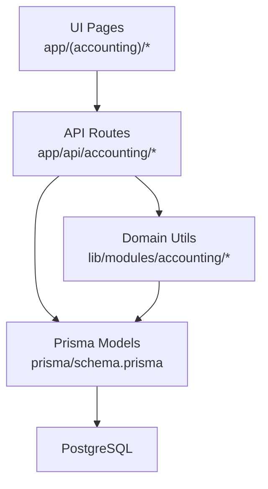
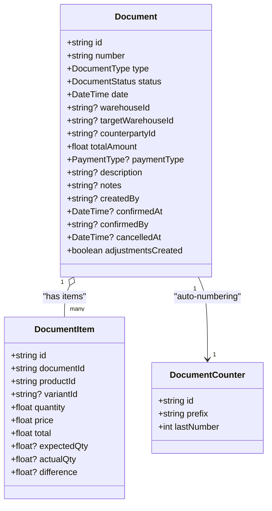
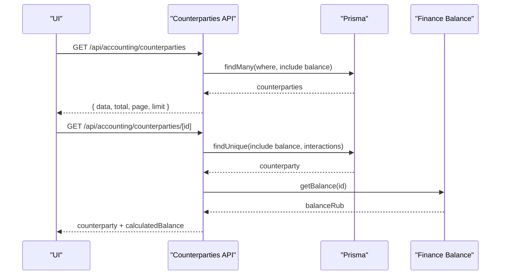
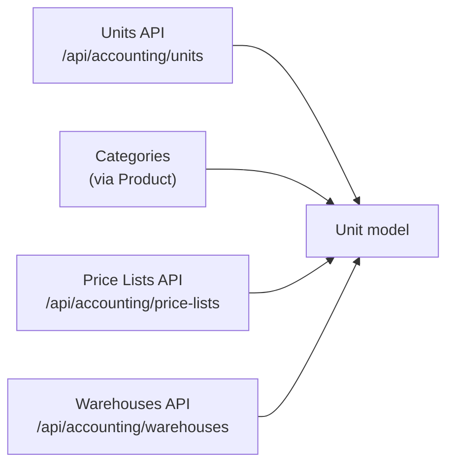
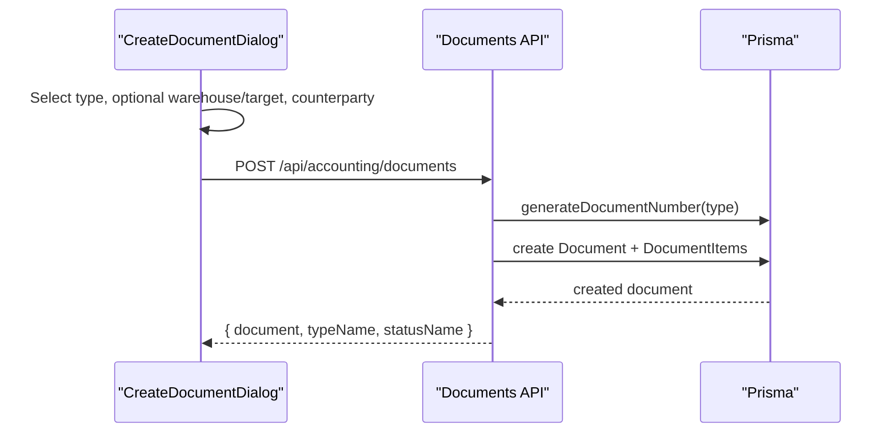
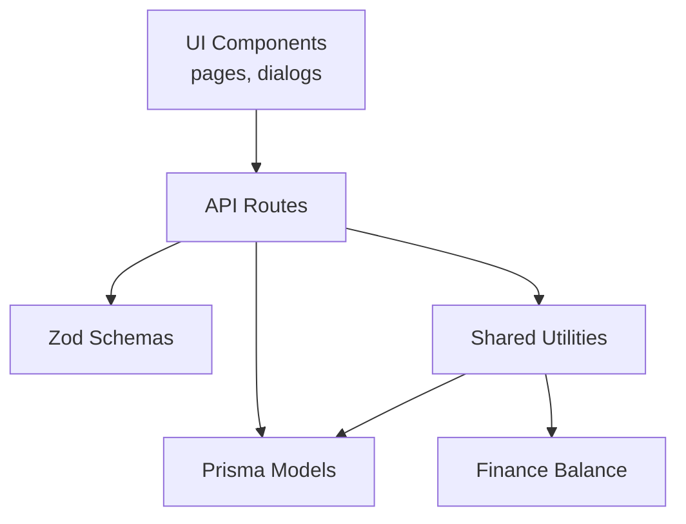

# Accounting Module

<cite>
**Referenced Files in This Document**
- [app/(accounting)/layout.tsx](file://app/(accounting)/layout.tsx)
- [app/(accounting)/page.tsx](file://app/(accounting)/page.tsx)
- [app/api/accounting/documents/route.ts](file://app/api/accounting/documents/route.ts)
- [app/api/accounting/documents/[id]/route.ts](file://app/api/accounting/documents/[id]/route.ts)
- [components/accounting/CreateDocumentDialog.tsx](file://components/accounting/CreateDocumentDialog.tsx)
- [lib/modules/accounting/documents.ts](file://lib/modules/accounting/documents.ts)
- [lib/modules/accounting/schemas/documents.schema.ts](file://lib/modules/accounting/schemas/documents.schema.ts)
- [app/api/accounting/stock/route.ts](file://app/api/accounting/stock/route.ts)
- [app/api/accounting/counterparties/route.ts](file://app/api/accounting/counterparties/route.ts)
- [app/api/accounting/counterparties/[id]/route.ts](file://app/api/accounting/counterparties/[id]/route.ts)
- [components/accounting/CounterpartiesTable.tsx](file://components/accounting/CounterpartiesTable.tsx)
- [app/api/accounting/warehouses/route.ts](file://app/api/accounting/warehouses/route.ts)
- [app/api/accounting/units/route.ts](file://app/api/accounting/units/route.ts)
- [app/api/accounting/price-lists/route.ts](file://app/api/accounting/price-lists/route.ts)
- [lib/modules/accounting/balance.ts](file://lib/modules/accounting/balance.ts)
- [prisma/schema.prisma](file://prisma/schema.prisma)
</cite>

## Table of Contents
1. [Introduction](#introduction)
2. [Project Structure](#project-structure)
3. [Core Components](#core-components)
4. [Architecture Overview](#architecture-overview)
5. [Detailed Component Analysis](#detailed-component-analysis)
6. [Dependency Analysis](#dependency-analysis)
7. [Performance Considerations](#performance-considerations)
8. [Troubleshooting Guide](#troubleshooting-guide)
9. [Conclusion](#conclusion)
10. [Appendices](#appendices)

## Introduction
The Accounting module is the core business engine of ListOpt ERP, responsible for managing inventory, documents, and financial transactions. It orchestrates the lifecycle of 11 document types across three primary domains:
- Stock operations: stock receipt, transfer, write-off, inventory count
- Purchase operations: purchase order, incoming shipment, supplier return
- Sales operations: sales order, outgoing shipment, customer return
- Payment operations: incoming and outgoing payments

It provides real-time stock tracking with moving average cost calculations, multi-warehouse support, counterparty relationship management, and a robust reference data system for units, categories, price lists, and warehouses. The module integrates with the Finance module for balances and chart-of-accounts posting, and exposes APIs for reporting and audit trails.

## Project Structure
The module is organized by feature areas under the accounting namespace:
- UI pages and dashboards: app/(accounting)/*
- API routes: app/api/accounting/* (documents, stock, counterparties, references)
- Shared logic and schemas: lib/modules/accounting/*
- Data model: prisma/schema.prisma

**Diagram sources**
- [app/(accounting)/layout.tsx:1-24](file://app/(accounting)/layout.tsx#L1-L24)
- [app/(accounting)/page.tsx:1-273](file://app/(accounting)/page.tsx#L1-L273)
- [components/accounting/CreateDocumentDialog.tsx:1-244](file://components/accounting/CreateDocumentDialog.tsx#L1-L244)
- [components/accounting/CounterpartiesTable.tsx:1-190](file://components/accounting/CounterpartiesTable.tsx#L1-L190)
- [app/api/accounting/documents/route.ts:1-136](file://app/api/accounting/documents/route.ts#L1-L136)
- [app/api/accounting/documents/[id]/route.ts:1-166](file://app/api/accounting/documents/[id]/route.ts#L1-L166)
- [app/api/accounting/stock/route.ts:1-192](file://app/api/accounting/stock/route.ts#L1-L192)
- [app/api/accounting/counterparties/route.ts:1-81](file://app/api/accounting/counterparties/route.ts#L1-L81)
- [app/api/accounting/counterparties/[id]/route.ts:1-87](file://app/api/accounting/counterparties/[id]/route.ts#L1-L87)
- [app/api/accounting/warehouses/route.ts:1-45](file://app/api/accounting/warehouses/route.ts#L1-L45)
- [app/api/accounting/units/route.ts:1-39](file://app/api/accounting/units/route.ts#L1-L39)
- [app/api/accounting/price-lists/route.ts:1-40](file://app/api/accounting/price-lists/route.ts#L1-L40)
- [lib/modules/accounting/documents.ts:1-144](file://lib/modules/accounting/documents.ts#L1-L144)
- [lib/modules/accounting/balance.ts:1-7](file://lib/modules/accounting/balance.ts#L1-L7)
- [prisma/schema.prisma:1-1064](file://prisma/schema.prisma#L1-L1064)

**Section sources**
- [app/(accounting)/layout.tsx:1-24](file://app/(accounting)/layout.tsx#L1-L24)
- [app/(accounting)/page.tsx:1-273](file://app/(accounting)/page.tsx#L1-L273)

## Core Components
- Document engine: creation, querying, editing, and linking of 11 document types with status transitions and numbering.
- Stock management: real-time tracking per warehouse/product with moving average cost, reserve calculation, and enhanced reporting.
- Counterparty management: customer/supplier relationship lifecycle with balances and interaction history.
- Reference data: units, product categories, price lists, and warehouses.
- Integration points: Finance module for balances and chart-of-accounts posting; e-commerce for order-to-document synchronization.

**Section sources**
- [lib/modules/accounting/documents.ts:1-144](file://lib/modules/accounting/documents.ts#L1-L144)
- [app/api/accounting/documents/route.ts:1-136](file://app/api/accounting/documents/route.ts#L1-L136)
- [app/api/accounting/stock/route.ts:1-192](file://app/api/accounting/stock/route.ts#L1-L192)
- [app/api/accounting/counterparties/route.ts:1-81](file://app/api/accounting/counterparties/route.ts#L1-L81)
- [lib/modules/accounting/balance.ts:1-7](file://lib/modules/accounting/balance.ts#L1-L7)

## Architecture Overview
The module follows a layered architecture:
- UI layer: Next.js app directory pages and shared components.
- API layer: Next.js API routes implementing CRUD and domain workflows.
- Domain logic: shared utilities for document types, numbering, and business rules.
- Persistence: Prisma ORM mapping to PostgreSQL.

**Diagram sources**
- [app/(accounting)/page.tsx:1-273](file://app/(accounting)/page.tsx#L1-L273)
- [app/api/accounting/documents/route.ts:1-136](file://app/api/accounting/documents/route.ts#L1-L136)
- [lib/modules/accounting/documents.ts:1-144](file://lib/modules/accounting/documents.ts#L1-L144)
- [prisma/schema.prisma:1-1064](file://prisma/schema.prisma#L1-L1064)

## Detailed Component Analysis

### Document Engine
The document engine supports 11 document types grouped by domain. It enforces business rules around stock impact, counterparty linkage, and status transitions. Documents are numbered automatically with type-specific prefixes and can be linked to form workflows (e.g., sales order → outgoing shipment → payment).

**Diagram sources**
- [prisma/schema.prisma:449-538](file://prisma/schema.prisma#L449-L538)
- [lib/modules/accounting/documents.ts:69-78](file://lib/modules/accounting/documents.ts#L69-L78)

Key behaviors:
- Numbering: Type-specific prefixes and incremental counters.
- Validation: Zod schemas for create/update/query.
- Status names and type names: Localized display names.
- Stock impact: Classification of document types affecting stock increases/decreases.
- Counterparty impact: Classification of document types affecting receivables/payables.

**Section sources**
- [lib/modules/accounting/documents.ts:1-144](file://lib/modules/accounting/documents.ts#L1-L144)
- [lib/modules/accounting/schemas/documents.schema.ts:1-55](file://lib/modules/accounting/schemas/documents.schema.ts#L1-L55)
- [app/api/accounting/documents/route.ts:1-136](file://app/api/accounting/documents/route.ts#L1-L136)
- [app/api/accounting/documents/[id]/route.ts:1-166](file://app/api/accounting/documents/[id]/route.ts#L1-L166)

### Stock Management
Real-time stock tracking maintains per-warehouse, per-product quantities and moving average costs. Enhanced stock reports compute reserve, available stock, and valuation using average cost or latest purchase/sale prices.

**Diagram sources**
- [app/api/accounting/stock/route.ts:1-192](file://app/api/accounting/stock/route.ts#L1-L192)

Business rules:
- Reserve: Sum of quantities in draft outgoing documents (outgoing_shipment, supplier_return, sales_order) grouped by product and warehouse.
- Available: Quantity minus reserve.
- Average cost: Uses moving average from stock records; falls back to latest purchase price if unavailable.
- Valuation: Cost value = quantity × averageCost; sale value = quantity × default sale price.

**Section sources**
- [app/api/accounting/stock/route.ts:1-192](file://app/api/accounting/stock/route.ts#L1-L192)

### Counterparty Management
Counterparties represent customers and suppliers. The system tracks balances, interaction history, and supports filtering and search. Balances are recalculated via the Finance module.

**Diagram sources**
- [app/api/accounting/counterparties/route.ts:1-81](file://app/api/accounting/counterparties/route.ts#L1-L81)
- [app/api/accounting/counterparties/[id]/route.ts:1-87](file://app/api/accounting/counterparties/[id]/route.ts#L1-L87)
- [lib/modules/accounting/balance.ts:1-7](file://lib/modules/accounting/balance.ts#L1-L7)

**Section sources**
- [app/api/accounting/counterparties/route.ts:1-81](file://app/api/accounting/counterparties/route.ts#L1-L81)
- [app/api/accounting/counterparties/[id]/route.ts:1-87](file://app/api/accounting/counterparties/[id]/route.ts#L1-L87)
- [components/accounting/CounterpartiesTable.tsx:1-190](file://components/accounting/CounterpartiesTable.tsx#L1-L190)
- [lib/modules/accounting/balance.ts:1-7](file://lib/modules/accounting/balance.ts#L1-L7)

### Reference Data Management
Reference data includes units of measurement, product categories, price lists, and warehouses. These are maintained via dedicated APIs and used across documents and stock.

**Diagram sources**
- [app/api/accounting/units/route.ts:1-39](file://app/api/accounting/units/route.ts#L1-L39)
- [app/api/accounting/price-lists/route.ts:1-40](file://app/api/accounting/price-lists/route.ts#L1-L40)
- [app/api/accounting/warehouses/route.ts:1-45](file://app/api/accounting/warehouses/route.ts#L1-L45)
- [prisma/schema.prisma:81-106](file://prisma/schema.prisma#L81-L106)

**Section sources**
- [app/api/accounting/units/route.ts:1-39](file://app/api/accounting/units/route.ts#L1-L39)
- [app/api/accounting/price-lists/route.ts:1-40](file://app/api/accounting/price-lists/route.ts#L1-L40)
- [app/api/accounting/warehouses/route.ts:1-45](file://app/api/accounting/warehouses/route.ts#L1-L45)

### Document Creation Workflow
The CreateDocumentDialog drives document creation with dynamic visibility of warehouse, target warehouse, and counterparty based on document type.

**Diagram sources**
- [components/accounting/CreateDocumentDialog.tsx:1-244](file://components/accounting/CreateDocumentDialog.tsx#L1-L244)
- [app/api/accounting/documents/route.ts:63-135](file://app/api/accounting/documents/route.ts#L63-L135)
- [lib/modules/accounting/documents.ts:69-88](file://lib/modules/accounting/documents.ts#L69-L88)

**Section sources**
- [components/accounting/CreateDocumentDialog.tsx:1-244](file://components/accounting/CreateDocumentDialog.tsx#L1-L244)
- [lib/modules/accounting/documents.ts:1-144](file://lib/modules/accounting/documents.ts#L1-L144)

## Dependency Analysis
The module exhibits clear separation of concerns:
- UI depends on API routes and shared components.
- API routes depend on Prisma models and shared utilities.
- Shared utilities encapsulate business logic and reduce duplication.
- Finance module is integrated for balance calculations.

**Diagram sources**
- [lib/modules/accounting/schemas/documents.schema.ts:1-55](file://lib/modules/accounting/schemas/documents.schema.ts#L1-L55)
- [lib/modules/accounting/documents.ts:1-144](file://lib/modules/accounting/documents.ts#L1-L144)
- [lib/modules/accounting/balance.ts:1-7](file://lib/modules/accounting/balance.ts#L1-L7)
- [prisma/schema.prisma:1-1064](file://prisma/schema.prisma#L1-L1064)

**Section sources**
- [lib/modules/accounting/schemas/documents.schema.ts:1-55](file://lib/modules/accounting/schemas/documents.schema.ts#L1-L55)
- [lib/modules/accounting/documents.ts:1-144](file://lib/modules/accounting/documents.ts#L1-L144)
- [lib/modules/accounting/balance.ts:1-7](file://lib/modules/accounting/balance.ts#L1-L7)
- [prisma/schema.prisma:1-1064](file://prisma/schema.prisma#L1-L1064)

## Performance Considerations
- Batch queries: Dashboard loads multiple metrics concurrently to minimize latency.
- Indexes: Strategic indexes on enums and frequently filtered fields improve query performance.
- Aggregation: Enhanced stock report computes aggregates server-side to avoid client-side heavy computations.
- Pagination: APIs enforce limits and pagination to prevent large result sets.

[No sources needed since this section provides general guidance]

## Troubleshooting Guide
Common issues and resolutions:
- Authentication/authorization errors: Ensure proper permissions for document and reference data operations.
- Validation errors: Verify request bodies conform to Zod schemas; check required fields for document creation.
- Draft-only edits: Documents in non-draft status cannot be modified or deleted.
- Missing balances: Confirm Finance module balance recalculations are up to date.

**Section sources**
- [app/api/accounting/documents/[id]/route.ts:63-165](file://app/api/accounting/documents/[id]/route.ts#L63-L165)
- [app/api/accounting/counterparties/[id]/route.ts:35-86](file://app/api/accounting/counterparties/[id]/route.ts#L35-L86)

## Conclusion
The Accounting module provides a cohesive, extensible foundation for inventory, document processing, and counterparty management. Its clear separation of UI, API, and domain logic, combined with robust reference data and stock tracking, enables scalable operations across multiple warehouses and document workflows.

[No sources needed since this section summarizes without analyzing specific files]

## Appendices

### Document Types and Business Rules
- Stock operations: stock_receipt, write_off, stock_transfer, inventory_count
- Purchase operations: purchase_order, incoming_shipment, supplier_return
- Sales operations: sales_order, outgoing_shipment, customer_return
- Payment operations: incoming_payment, outgoing_payment

Rules:
- Stock impact: Increase/decrease classification determines inventory movement.
- Counterparty impact: Receivables/payables affected by sales/purchases and payments.
- Numbering: Type-specific prefixes with auto-increment counters.
- Visibility: UI dynamically shows required fields based on document type.

**Section sources**
- [lib/modules/accounting/documents.ts:1-144](file://lib/modules/accounting/documents.ts#L1-L144)
- [components/accounting/CreateDocumentDialog.tsx:17-31](file://components/accounting/CreateDocumentDialog.tsx#L17-L31)

### Data Model Highlights
- Document and DocumentItem define transactional records with expected/actual quantities and differences.
- StockRecord maintains per-warehouse quantities and moving average cost.
- StockMovement logs immutable inventory changes with movement types.
- Counterparty and CounterpartyBalance track relationships and balances.
- Units, PriceList, and Warehouse are reference entities used across documents and stock.

**Section sources**
- [prisma/schema.prisma:449-538](file://prisma/schema.prisma#L449-L538)
- [prisma/schema.prisma:386-437](file://prisma/schema.prisma#L386-L437)
- [prisma/schema.prisma:309-363](file://prisma/schema.prisma#L309-L363)
- [prisma/schema.prisma:81-106](file://prisma/schema.prisma#L81-L106)
- [prisma/schema.prisma:544-590](file://prisma/schema.prisma#L544-L590)
- [prisma/schema.prisma:369-384](file://prisma/schema.prisma#L369-L384)