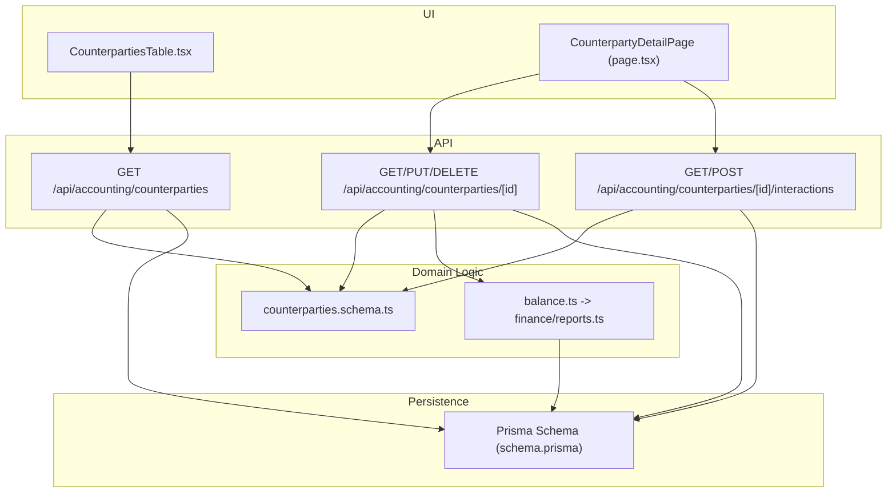
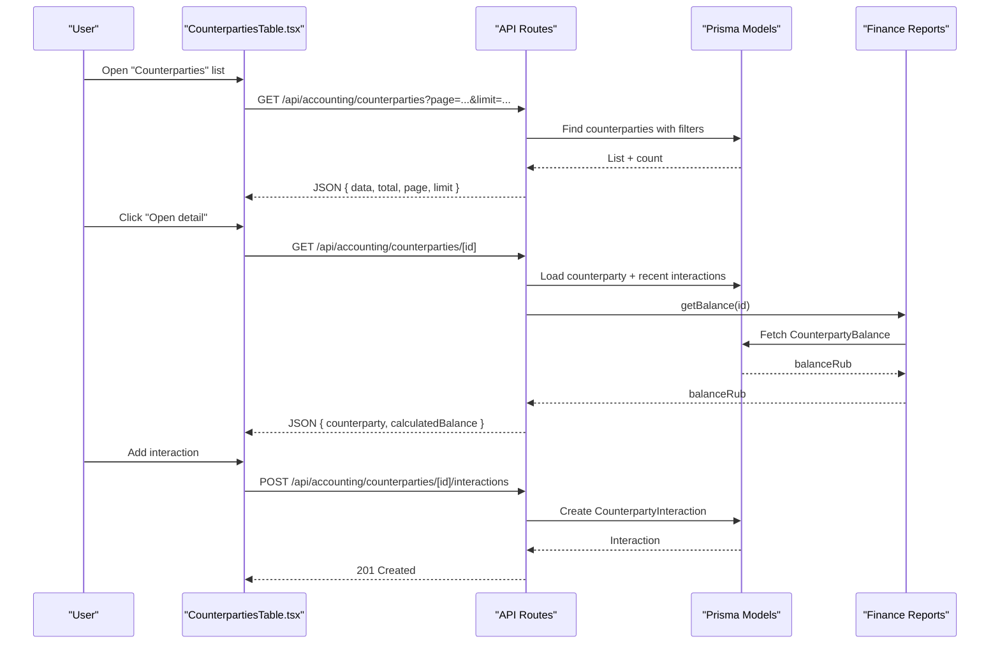
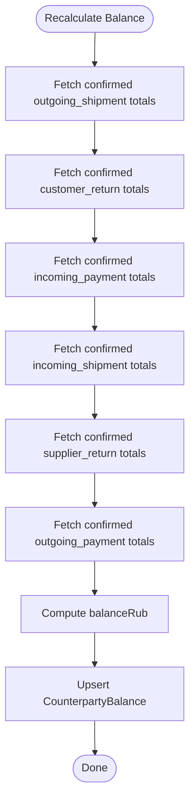
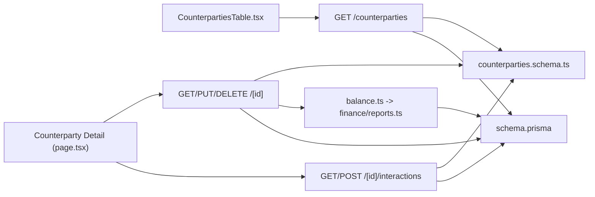

# Counterparty Management

<cite>
**Referenced Files in This Document**
- [route.ts](file://app/api/accounting/counterparties/route.ts)
- [route.ts](file://app/api/accounting/counterparties/[id]/route.ts)
- [route.ts](file://app/api/accounting/counterparties/[id]/interactions/route.ts)
- [page.tsx](file://app/(accounting)/counterparties/page.tsx)
- [page.tsx](file://app/(accounting)/counterparties/[id]/page.tsx)
- [CounterpartiesTable.tsx](file://components/accounting/CounterpartiesTable.tsx)
- [counterparties.schema.ts](file://lib/modules/accounting/schemas/counterparties.schema.ts)
- [balance.ts](file://lib/modules/accounting/balance.ts)
- [reports.ts](file://lib/modules/finance/reports.ts)
- [schema.prisma](file://prisma/schema.prisma)
</cite>

## Table of Contents
1. [Introduction](#introduction)
2. [Project Structure](#project-structure)
3. [Core Components](#core-components)
4. [Architecture Overview](#architecture-overview)
5. [Detailed Component Analysis](#detailed-component-analysis)
6. [Dependency Analysis](#dependency-analysis)
7. [Performance Considerations](#performance-considerations)
8. [Troubleshooting Guide](#troubleshooting-guide)
9. [Conclusion](#conclusion)
10. [Appendices](#appendices)

## Introduction
This document describes the Counterparty Management module within the ListOpt ERP accounting domain. It covers customer and supplier relationship management, balance tracking, and interaction history. It also documents counterparty classification, credit-related fields, payment terms, integration with document workflows for automatic balance updates, search and filtering, reporting, API endpoints for CRUD operations, interaction logging, balance queries, segmentation, communication history, and relationship analytics. Practical scenarios demonstrate setup, balance monitoring, and interaction tracking.

## Project Structure
Counterparty Management spans UI components, API routes, Prisma models, and shared business logic for balances and validations.



**Diagram sources**
- [CounterpartiesTable.tsx:39-188](file://components/accounting/CounterpartiesTable.tsx#L39-L188)
- [page.tsx](file://app/(accounting)/counterparties/page.tsx#L6-L13)
- [page.tsx](file://app/(accounting)/counterparties/[id]/page.tsx#L104-L463)
- [route.ts:10-48](file://app/api/accounting/counterparties/route.ts#L10-L48)
- [route.ts:10-86](file://app/api/accounting/counterparties/[id]/route.ts#L10-L86)
- [route.ts:9-46](file://app/api/accounting/counterparties/[id]/interactions/route.ts#L9-L46)
- [counterparties.schema.ts:1-40](file://lib/modules/accounting/schemas/counterparties.schema.ts#L1-L40)
- [balance.ts:1-7](file://lib/modules/accounting/balance.ts#L1-L7)
- [reports.ts:43-97](file://lib/modules/finance/reports.ts#L43-L97)
- [schema.prisma:309-363](file://prisma/schema.prisma#L309-L363)

**Section sources**
- [page.tsx](file://app/(accounting)/counterparties/page.tsx#L6-L13)
- [CounterpartiesTable.tsx:39-188](file://components/accounting/CounterpartiesTable.tsx#L39-L188)
- [route.ts:10-48](file://app/api/accounting/counterparties/route.ts#L10-L48)
- [route.ts:10-86](file://app/api/accounting/counterparties/[id]/route.ts#L10-L86)
- [route.ts:9-46](file://app/api/accounting/counterparties/[id]/interactions/route.ts#L9-L46)
- [counterparties.schema.ts:1-40](file://lib/modules/accounting/schemas/counterparties.schema.ts#L1-L40)
- [balance.ts:1-7](file://lib/modules/accounting/balance.ts#L1-L7)
- [reports.ts:43-97](file://lib/modules/finance/reports.ts#L43-L97)
- [schema.prisma:309-363](file://prisma/schema.prisma#L309-L363)

## Core Components
- Counterparty entity with classification (customer, supplier, both), identification (INN), banking details, contact info, and activity flag.
- Interaction model to capture communication history (call, email, meeting, note).
- Balance model to track calculated balances per counterparty.
- API endpoints for listing, creating, updating, deleting counterparties, retrieving details, and managing interactions.
- Frontend table and detail page for viewing, filtering, editing, and adding interactions.

Key capabilities:
- Classification and status management
- Search and filtering by name, legal name, INN, phone, type, and activity
- Balance calculation and retrieval via document workflow
- Interaction logging and retrieval
- Reporting on balances

**Section sources**
- [schema.prisma:309-363](file://prisma/schema.prisma#L309-L363)
- [counterparties.schema.ts:1-40](file://lib/modules/accounting/schemas/counterparties.schema.ts#L1-L40)
- [reports.ts:43-97](file://lib/modules/finance/reports.ts#L43-L97)
- [CounterpartiesTable.tsx:39-188](file://components/accounting/CounterpartiesTable.tsx#L39-L188)
- [page.tsx](file://app/(accounting)/counterparties/[id]/page.tsx#L104-L463)

## Architecture Overview
Counterparty Management integrates UI, API routes, validation schemas, and Prisma models. Balances are recalculated from confirmed documents and cached in the CounterpartyBalance model.



**Diagram sources**
- [CounterpartiesTable.tsx:44-58](file://components/accounting/CounterpartiesTable.tsx#L44-L58)
- [route.ts:10-48](file://app/api/accounting/counterparties/route.ts#L10-L48)
- [route.ts:10-33](file://app/api/accounting/counterparties/[id]/route.ts#L10-L33)
- [route.ts:25-46](file://app/api/accounting/counterparties/[id]/interactions/route.ts#L25-L46)
- [reports.ts:91-97](file://lib/modules/finance/reports.ts#L91-L97)
- [schema.prisma:342-363](file://prisma/schema.prisma#L342-L363)

## Detailed Component Analysis

### API Endpoints

- GET /api/accounting/counterparties
  - Permissions: counterparties:read
  - Query parameters: search, type, active, page, limit
  - Filters: OR on name, legalName, inn, phone; type equality; active boolean
  - Returns: paginated list with total count and current page metadata
  - Validation: queryCounterpartiesSchema

- POST /api/accounting/counterparties
  - Permissions: counterparties:write
  - Request body validated by createCounterpartySchema
  - Creates a new counterparty with basic and optional fields
  - Returns 201 with created entity

- GET /api/accounting/counterparties/[id]
  - Permissions: counterparties:read
  - Includes recent interactions and preloaded balance
  - Calculates real-time balance via getBalance(id)

- PUT /api/accounting/counterparties/[id]
  - Permissions: counterparties:write
  - Partial updates supported by updateCounterpartySchema
  - Supports toggling isActive

- DELETE /api/accounting/counterparties/[id]
  - Permissions: counterparties:write
  - Deactivates by setting isActive=false

- GET /api/accounting/counterparties/[id]/interactions
  - Permissions: counterparties:read
  - Returns all interactions for the counterparty ordered by creation time

- POST /api/accounting/counterparties/[id]/interactions
  - Permissions: counterparties:write
  - Validates type, subject, description
  - Creates a new interaction

**Section sources**
- [route.ts:10-81](file://app/api/accounting/counterparties/route.ts#L10-L81)
- [route.ts:10-87](file://app/api/accounting/counterparties/[id]/route.ts#L10-L87)
- [route.ts:9-47](file://app/api/accounting/counterparties/[id]/interactions/route.ts#L9-L47)
- [counterparties.schema.ts:25-40](file://lib/modules/accounting/schemas/counterparties.schema.ts#L25-L40)

### Data Model and Relationships

```mermaid
erDiagram
COUNTERPARTY {
string id PK
enum type
string name
string legalName
string inn UK
string kpp
string bankAccount
string bankName
string bik
string address
string phone
string email
string contactPerson
string notes
boolean isActive
datetime createdAt
datetime updatedAt
}
COUNTERPARTY_INTERACTION {
string id PK
string counterpartyId FK
string type
string subject
string description
string createdBy
datetime createdAt
}
COUNTERPARTY_BALANCE {
string id PK
string counterpartyId FK UK
float balanceRub
datetime lastUpdatedAt
}
COUNTERPARTY ||--o{ COUNTERPARTY_INTERACTION : "has"
COUNTERPARTY ||--o| COUNTERPARTY_BALANCE : "tracked_by"
```

**Diagram sources**
- [schema.prisma:309-363](file://prisma/schema.prisma#L309-L363)

**Section sources**
- [schema.prisma:309-363](file://prisma/schema.prisma#L309-L363)

### Balance Calculation and Workflow Integration
Balances are derived from confirmed documents:
- Receivables: outgoing_shipment
- Returns reducing receivables: customer_return
- Payments reducing receivables: incoming_payment
- Payables: incoming_shipment
- Returns reducing payables: supplier_return
- Payments reducing payables: outgoing_payment

Recalculation aggregates totals for confirmed documents and upserts the CounterpartyBalance record.



**Diagram sources**
- [reports.ts:43-97](file://lib/modules/finance/reports.ts#L43-L97)

**Section sources**
- [reports.ts:43-97](file://lib/modules/finance/reports.ts#L43-L97)

### Frontend Components

- CounterpartiesTable
  - Provides search, pagination, sorting, and type filtering
  - Loads data from GET /api/accounting/counterparties
  - Shows balance with color-coded formatting
  - Navigates to detail page

- Counterparty Detail Page
  - Displays main and banking info
  - Shows calculated balance and direction (receivable/payable)
  - Lists recent interactions with type badges and timestamps
  - Edit mode supports partial updates and activation toggle

**Section sources**
- [CounterpartiesTable.tsx:39-188](file://components/accounting/CounterpartiesTable.tsx#L39-L188)
- [page.tsx](file://app/(accounting)/counterparties/[id]/page.tsx#L104-L463)

## Dependency Analysis



**Diagram sources**
- [CounterpartiesTable.tsx:44-58](file://components/accounting/CounterpartiesTable.tsx#L44-L58)
- [page.tsx](file://app/(accounting)/counterparties/[id]/page.tsx#L124-L146)
- [route.ts:10-48](file://app/api/accounting/counterparties/route.ts#L10-L48)
- [route.ts:10-33](file://app/api/accounting/counterparties/[id]/route.ts#L10-L33)
- [route.ts:9-23](file://app/api/accounting/counterparties/[id]/interactions/route.ts#L9-L23)
- [counterparties.schema.ts:1-40](file://lib/modules/accounting/schemas/counterparties.schema.ts#L1-L40)
- [balance.ts:1-7](file://lib/modules/accounting/balance.ts#L1-L7)
- [reports.ts:91-97](file://lib/modules/finance/reports.ts#L91-L97)
- [schema.prisma:309-363](file://prisma/schema.prisma#L309-L363)

**Section sources**
- [CounterpartiesTable.tsx:39-188](file://components/accounting/CounterpartiesTable.tsx#L39-L188)
- [page.tsx](file://app/(accounting)/counterparties/[id]/page.tsx#L104-L463)
- [route.ts:10-48](file://app/api/accounting/counterparties/route.ts#L10-L48)
- [route.ts:10-87](file://app/api/accounting/counterparties/[id]/route.ts#L10-L87)
- [route.ts:9-47](file://app/api/accounting/counterparties/[id]/interactions/route.ts#L9-L47)
- [counterparties.schema.ts:1-40](file://lib/modules/accounting/schemas/counterparties.schema.ts#L1-L40)
- [balance.ts:1-7](file://lib/modules/accounting/balance.ts#L1-L7)
- [reports.ts:43-97](file://lib/modules/finance/reports.ts#L43-L97)
- [schema.prisma:309-363](file://prisma/schema.prisma#L309-L363)

## Performance Considerations
- Pagination and limits are enforced on list queries to avoid large payloads.
- Indexes on type, isActive, and name improve filtering and sorting performance.
- Balance retrieval uses a dedicated cached record to avoid repeated aggregation.
- Interaction listing is capped in the detail view to keep rendering efficient.

[No sources needed since this section provides general guidance]

## Troubleshooting Guide
Common issues and resolutions:
- Authentication/Authorization errors: Ensure the user has the counterparties:read or counterparties:write permission depending on the endpoint.
- Validation failures: Verify request bodies match createCounterpartySchema or updateCounterpartySchema; required fields include name and type.
- Not found errors: Accessing a non-existent counterparty ID returns a 404 message in the detail endpoint.
- Balance discrepancies: Trigger a balance recalculation to reconcile against confirmed documents.

**Section sources**
- [route.ts:43-47](file://app/api/accounting/counterparties/route.ts#L43-L47)
- [route.ts:23-32](file://app/api/accounting/counterparties/[id]/route.ts#L23-L32)
- [counterparties.schema.ts:3-18](file://lib/modules/accounting/schemas/counterparties.schema.ts#L3-L18)
- [reports.ts:43-97](file://lib/modules/finance/reports.ts#L43-L97)

## Conclusion
Counterparty Management provides a complete foundation for customer and supplier relationship administration, integrated with document workflows to maintain accurate balances. The module offers robust search, filtering, interaction logging, and reporting capabilities, with clear separation of concerns across UI, API, validation, and persistence layers.

[No sources needed since this section summarizes without analyzing specific files]

## Appendices

### API Definitions

- List counterparties
  - Method: GET
  - Path: /api/accounting/counterparties
  - Query parameters:
    - search: string
    - type: string
    - active: string ("true"|"false")
    - page: number (default 1)
    - limit: number (default 50, max 500)
  - Response: { data: Counterparty[], total: number, page: number, limit: number }

- Create counterparty
  - Method: POST
  - Path: /api/accounting/counterparties
  - Body: CreateCounterpartyInput
  - Response: 201 Created + Counterparty

- Get counterparty detail
  - Method: GET
  - Path: /api/accounting/counterparties/[id]
  - Response: Counterparty with calculatedBalance

- Update counterparty
  - Method: PUT
  - Path: /api/accounting/counterparties/[id]
  - Body: Partial UpdateCounterpartyInput (including optional isActive)
  - Response: Updated Counterparty

- Delete counterparty
  - Method: DELETE
  - Path: /api/accounting/counterparties/[id]
  - Response: { success: true }

- List interactions
  - Method: GET
  - Path: /api/accounting/counterparties/[id]/interactions
  - Response: CounterpartyInteraction[] ordered by createdAt desc

- Create interaction
  - Method: POST
  - Path: /api/accounting/counterparties/[id]/interactions
  - Body: CreateInteractionInput
  - Response: 201 Created + CounterpartyInteraction

**Section sources**
- [route.ts:10-81](file://app/api/accounting/counterparties/route.ts#L10-L81)
- [route.ts:10-87](file://app/api/accounting/counterparties/[id]/route.ts#L10-L87)
- [route.ts:9-47](file://app/api/accounting/counterparties/[id]/interactions/route.ts#L9-L47)
- [counterparties.schema.ts:3-39](file://lib/modules/accounting/schemas/counterparties.schema.ts#L3-L39)

### Scenarios

- Setup a new customer or supplier
  - Use POST /api/accounting/counterparties with required fields (name, type) and optional details (INN, bank details, contacts).
  - Navigate to the newly created counterparty detail to review and edit further if needed.

- Monitor balances
  - View balances in the CounterpartiesTable (column reflects balanceRub).
  - On the detail page, see the calculated balance and direction indicator.
  - Trigger recalculation via the underlying balance service if discrepancies arise.

- Track interactions
  - From the detail page, add interactions (call, email, meeting, note) using POST /api/accounting/counterparties/[id]/interactions.
  - Review recent interactions in the "Communication History" panel.

- Search and filter
  - Use the search box to filter by name, legal name, INN, or phone.
  - Filter by type (customer, supplier, both) and activity status.

**Section sources**
- [CounterpartiesTable.tsx:44-58](file://components/accounting/CounterpartiesTable.tsx#L44-L58)
- [page.tsx](file://app/(accounting)/counterparties/[id]/page.tsx#L148-L183)
- [route.ts:25-46](file://app/api/accounting/counterparties/[id]/interactions/route.ts#L25-L46)
- [reports.ts:91-97](file://lib/modules/finance/reports.ts#L91-L97)