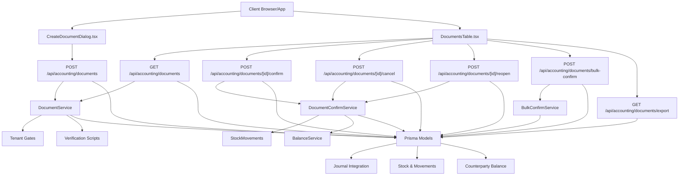
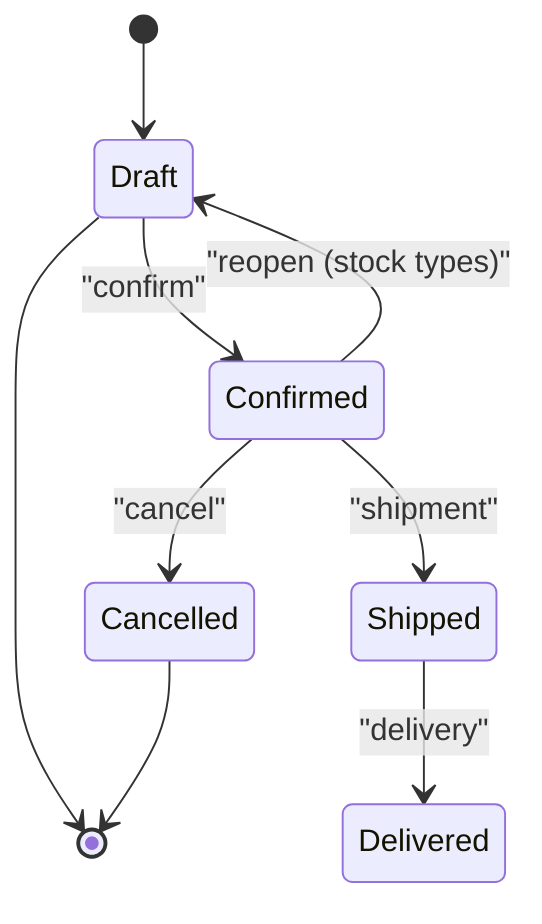
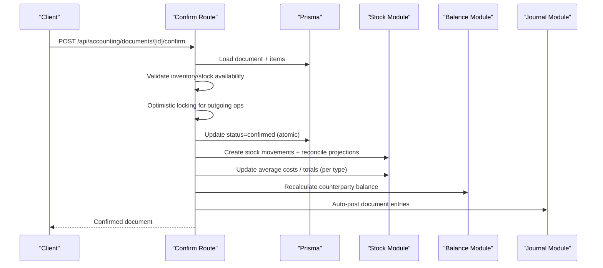
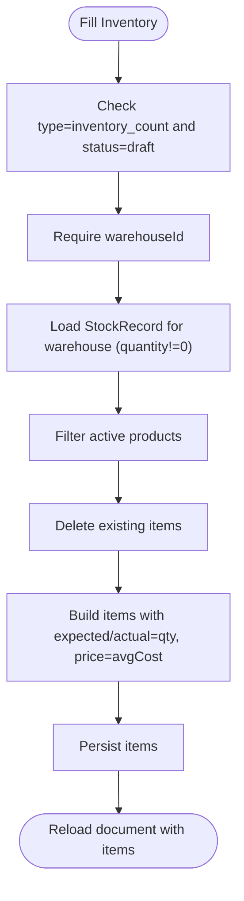
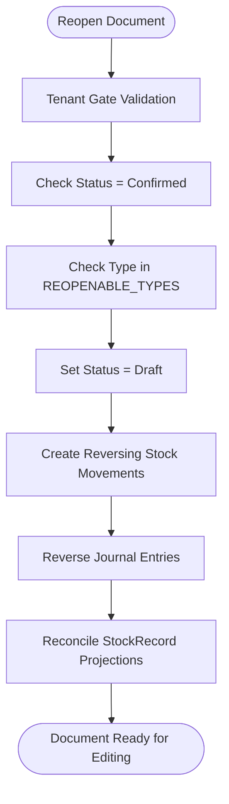
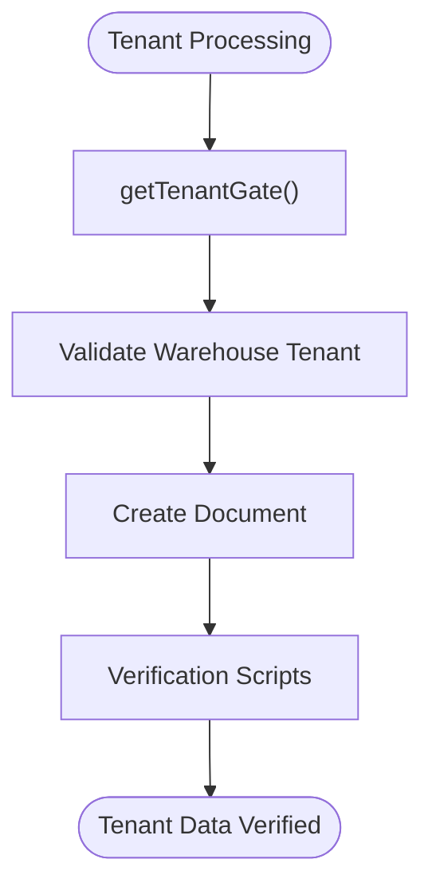
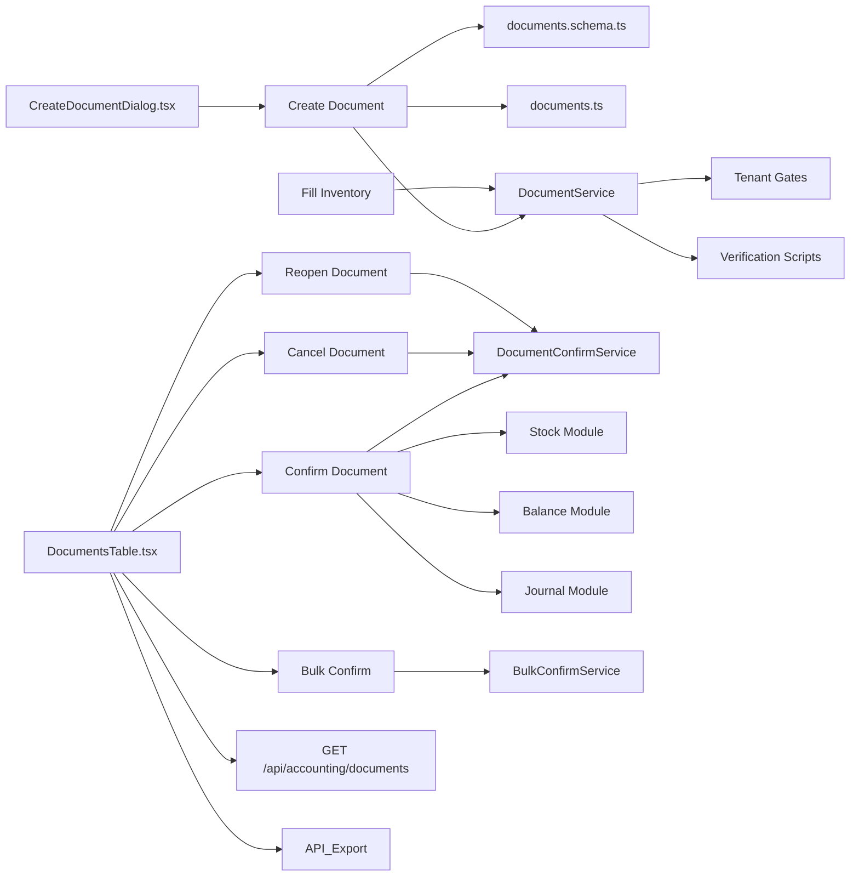

# Document Management System

<cite>
**Referenced Files in This Document**
- [route.ts](file://app/api/accounting/documents/route.ts)
- [route.ts](file://app/api/accounting/documents/[id]/route.ts)
- [route.ts](file://app/api/accounting/documents/[id]/confirm/route.ts)
- [route.ts](file://app/api/accounting/documents/[id]/cancel/route.ts)
- [route.ts](file://app/api/accounting/documents/[id]/fill-inventory/route.ts)
- [route.ts](file://app/api/accounting/documents/[id]/reopen/route.ts)
- [route.ts](file://app/api/accounting/documents/bulk-confirm/route.ts)
- [route.ts](file://app/api/accounting/documents/export/route.ts)
- [route.ts](file://app/api/accounting/documents/[id]/journal/route.ts)
- [document-confirm.service.ts](file://lib/modules/accounting/services/document-confirm.service.ts)
- [document-bulk-confirm.service.ts](file://lib/modules/accounting/services/document-bulk-confirm.service.ts)
- [document.service.ts](file://lib/modules/accounting/services/document.service.ts)
- [documents.ts](file://lib/modules/accounting/documents.ts)
- [stock-movements.ts](file://lib/modules/accounting/inventory/stock-movements.ts)
- [balance.service.ts](file://lib/modules/accounting/services/balance.service.ts)
- [schema.prisma](file://prisma/schema.prisma)
- [CreateDocumentDialog.tsx](file://components/accounting/CreateDocumentDialog.tsx)
- [DocumentsTable.tsx](file://components/accounting/DocumentsTable.tsx)
- [verify-document-tenant-gate.ts](file://scripts/verify-document-tenant-gate.ts)
- [backfill-document-tenant.ts](file://scripts/backfill-document-tenant.ts)
</cite>

## Update Summary
**Changes Made**
- Added comprehensive document reopening functionality for stock documents
- Enhanced document confirmation service with transaction safety and race condition protection
- Implemented tenant-aware processing with tenant gates and verification scripts
- Improved bulk operations with better error handling and policy enforcement
- Updated inventory count improvements with enhanced validation
- Added stock reconciliation capabilities for document state recovery

## Table of Contents
1. [Introduction](#introduction)
2. [Project Structure](#project-structure)
3. [Core Components](#core-components)
4. [Architecture Overview](#architecture-overview)
5. [Detailed Component Analysis](#detailed-component-analysis)
6. [Enhanced Features](#enhanced-features)
7. [Tenant-Aware Processing](#tenant-aware-processing)
8. [Dependency Analysis](#dependency-analysis)
9. [Performance Considerations](#performance-considerations)
10. [Troubleshooting Guide](#troubleshooting-guide)
11. [Conclusion](#conclusion)
12. [Appendices](#appendices)

## Introduction
This document describes the enhanced Document Management System within the ListOpt ERP accounting module. The system has been significantly upgraded with improved document confirmation services featuring transaction safety, document reopening functionality for stock operations, enhanced tenant-aware processing, and advanced bulk operations. It covers the 11 supported document types grouped into stock operations, purchase operations, sales operations, and payment operations. The system now provides robust workflow states, approval processes, audit trails, numbering, templates, batch operations, API endpoints, and integration with the journal system.

## Project Structure
The enhanced Document Management System spans backend API routes, transaction-safe services, tenant-aware processing, shared business logic, Prisma schema definitions, and frontend components that render and operate documents.

```mermaid
graph TB
subgraph "Frontend"
UI_Dialog["CreateDocumentDialog.tsx"]
UI_Table["DocumentsTable.tsx"]
end
subgraph "Backend API"
API_List["GET /api/accounting/documents"]
API_Create["POST /api/accounting/documents"]
API_Get["GET /api/accounting/documents/[id]"]
API_Update["PUT /api/accounting/documents/[id]"]
API_Delete["DELETE /api/accounting/documents/[id]"]
API_Confirm["POST /api/accounting/documents/[id]/confirm"]
API_Cancel["POST /api/accounting/documents/[id]/cancel"]
API_Reopen["POST /api/accounting/documents/[id]/reopen"]
API_FillInv["POST /api/accounting/documents/[id]/fill-inventory"]
API_BulkConfirm["POST /api/accounting/documents/bulk-confirm"]
API_Export["GET /api/accounting/documents/export"]
API_Journal["GET /api/accounting/documents/[id]/journal"]
end
subgraph "Transaction-Safe Services"
TS_Confirm["DocumentConfirmService"]
TS_Bulk["BulkConfirmService"]
TS_Service["DocumentService"]
end
subgraph "Domain Services"
INV_Movements["StockMovements"]
FIN_Balance["BalanceService"]
end
subgraph "Tenant Processing"
TEN_Gate["Tenant Gates"]
TEN_Verify["Verification Scripts"]
end
subgraph "Data Layer"
PRISMA["Prisma Schema (schema.prisma)"]
end
UI_Dialog --> API_Create
UI_Table --> API_List
UI_Table --> API_Confirm
UI_Table --> API_Cancel
UI_Table --> API_Reopen
UI_Table --> API_BulkConfirm
UI_Table --> API_Export
API_List --> TS_Service
API_Create --> TS_Service
API_Get --> TS_Service
API_Update --> TS_Service
API_Delete --> TS_Service
API_Confirm --> TS_Confirm
API_Cancel --> TS_Confirm
API_Reopen --> TS_Confirm
API_FillInv --> TS_Service
API_BulkConfirm --> TS_Bulk
API_Export --> TS_Service
API_Journal --> TS_Service
API_List --> PRISMA
API_Create --> PRISMA
API_Get --> PRISMA
API_Update --> PRISMA
API_Delete --> PRISMA
API_Confirm --> PRISMA
API_Cancel --> PRISMA
API_Reopen --> PRISMA
API_FillInv --> PRISMA
API_BulkConfirm --> PRISMA
API_Export --> PRISMA
API_Journal --> PRISMA
TS_Confirm --> INV_Movements
TS_Confirm --> FIN_Balance
TS_Bulk --> TS_Confirm
TS_Service --> TEN_Gate
TS_Service --> TEN_Verify
```



**Diagram sources**
- [route.ts:1-62](file://app/api/accounting/documents/route.ts#L1-L62)
- [route.ts:1-89](file://app/api/accounting/documents/[id]/route.ts#L1-L89)
- [route.ts:1-33](file://app/api/accounting/documents/[id]/confirm/route.ts#L1-L33)
- [route.ts:1-36](file://app/api/accounting/documents/[id]/cancel/route.ts#L1-L36)
- [route.ts:1-146](file://app/api/accounting/documents/[id]/reopen/route.ts#L1-L146)
- [route.ts:1-32](file://app/api/accounting/documents/[id]/fill-inventory/route.ts#L1-L32)
- [route.ts:1-56](file://app/api/accounting/documents/bulk-confirm/route.ts#L1-L56)
- [route.ts:1-79](file://app/api/accounting/documents/export/route.ts#L1-L79)
- [route.ts:1-38](file://app/api/accounting/documents/[id]/journal/route.ts#L1-L38)
- [document-confirm.service.ts:319-471](file://lib/modules/accounting/services/document-confirm.service.ts#L319-L471)
- [document-bulk-confirm.service.ts:65-114](file://lib/modules/accounting/services/document-bulk-confirm.service.ts#L65-L114)
- [document.service.ts:73-482](file://lib/modules/accounting/services/document.service.ts#L73-L482)
- [stock-movements.ts:485-498](file://lib/modules/accounting/inventory/stock-movements.ts#L485-L498)
- [balance.service.ts:30-76](file://lib/modules/accounting/services/balance.service.ts#L30-L76)
- [verify-document-tenant-gate.ts:30-101](file://scripts/verify-document-tenant-gate.ts#L30-L101)
- [backfill-document-tenant.ts:81-104](file://scripts/backfill-document-tenant.ts#L81-L104)

**Section sources**
- [route.ts:1-62](file://app/api/accounting/documents/route.ts#L1-L62)
- [route.ts:1-89](file://app/api/accounting/documents/[id]/route.ts#L1-L89)
- [document-confirm.service.ts:319-471](file://lib/modules/accounting/services/document-confirm.service.ts#L319-L471)
- [document-bulk-confirm.service.ts:65-114](file://lib/modules/accounting/services/document-bulk-confirm.service.ts#L65-L114)
- [document.service.ts:73-482](file://lib/modules/accounting/services/document.service.ts#L73-L482)
- [schema.prisma:449-538](file://prisma/schema.prisma#L449-L538)

## Core Components
- **Enhanced Document API endpoints**: CRUD, confirmation, cancellation, reopening, inventory filling, bulk confirmation, export, and journal linkage with tenant-aware processing.
- **Transaction-safe services**: Document confirmation service with strict operation ordering, race condition protection, and atomic transactions.
- **Bulk operations**: Improved bulk confirmation service with better error handling, policy enforcement, and tenant-scoped processing.
- **Tenant-aware processing**: Tenant gates, verification scripts, and security measures to prevent cross-tenant data access.
- **Document reopening**: Specialized functionality for reopening confirmed stock documents (inventory_count, write_off, stock_receipt) for editing.
- **Shared document utilities**: Numbering, type/status names, stock/balance impact checks, and helpers.
- **Prisma schema**: Defines Document, DocumentItem, DocumentCounter, and related entities with tenant support.
- **Frontend components**: Dialogs and tables for creating and managing documents with enhanced state management.

Key responsibilities:
- **Validation and permissions enforcement**: Strict tenant gates and permission checks at the API boundary.
- **State transitions and side effects**: Transaction-safe operations with race condition protection and idempotent stock movements.
- **Audit trail**: Immutable stock movements and journal entries with comprehensive reconciliation.
- **Export and reporting**: CSV generation with enhanced filtering and tenant scoping.
- **Stock reconciliation**: Automatic reconciliation of StockRecord projections after document operations.

**Section sources**
- [document-confirm.service.ts:319-471](file://lib/modules/accounting/services/document-confirm.service.ts#L319-L471)
- [document-bulk-confirm.service.ts:65-114](file://lib/modules/accounting/services/document-bulk-confirm.service.ts#L65-L114)
- [document.service.ts:73-482](file://lib/modules/accounting/services/document.service.ts#L73-L482)
- [schema.prisma:449-538](file://prisma/schema.prisma#L449-L538)

## Architecture Overview
The enhanced system follows a layered architecture with transaction safety and tenant awareness:
- **Presentation**: Next.js app pages and components with enhanced state management.
- **API**: Route handlers under app/api/accounting/documents implementing CRUD and workflows with tenant gates.
- **Transaction-safe services**: Enhanced modules in lib/modules/accounting handling document rules, integrations, and atomic operations.
- **Tenant processing**: Security measures and verification scripts ensuring data isolation.
- **Persistence**: Prisma ORM mapping to PostgreSQL with tenant support.



**Diagram sources**
- [CreateDocumentDialog.tsx:1-244](file://components/accounting/CreateDocumentDialog.tsx#L1-L244)
- [DocumentsTable.tsx:1-361](file://components/accounting/DocumentsTable.tsx#L1-L361)
- [route.ts:1-62](file://app/api/accounting/documents/route.ts#L1-L62)
- [route.ts:1-33](file://app/api/accounting/documents/[id]/confirm/route.ts#L1-L33)
- [document-confirm.service.ts:319-471](file://lib/modules/accounting/services/document-confirm.service.ts#L319-L471)
- [document-bulk-confirm.service.ts:65-114](file://lib/modules/accounting/services/document-bulk-confirm.service.ts#L65-L114)
- [document.service.ts:73-482](file://lib/modules/accounting/services/document.service.ts#L73-L482)
- [schema.prisma:449-538](file://prisma/schema.prisma#L449-L538)

## Detailed Component Analysis

### Document Types and Lifecycle
Supported document types remain the same with enhanced processing:
- **Stock operations**: stock_receipt, write_off, stock_transfer, inventory_count
- **Purchase operations**: purchase_order, incoming_shipment, supplier_return
- **Sales operations**: sales_order, outgoing_shipment, customer_return
- **Payment operations**: incoming_payment, outgoing_payment

Enhanced lifecycle stages:
- **Draft**: editable, deletable, confirmable.
- **Confirmed**: stock/balance adjusted, journal posted, cancellable, reopenable for specific types.
- **Cancelled**: reverses prior effects (subject to implementation).
- **Additional statuses**: shipped, delivered (used for e-commerce/sales-related documents).



**Diagram sources**
- [schema.prisma:38-44](file://prisma/schema.prisma#L38-L44)
- [documents.ts:36-43](file://lib/modules/accounting/documents.ts#L36-L43)
- [route.ts:11-146](file://app/api/accounting/documents/[id]/reopen/route.ts#L11-L146)

**Section sources**
- [schema.prisma:46-63](file://prisma/schema.prisma#L46-L63)
- [documents.ts:36-43](file://lib/modules/accounting/documents.ts#L36-L43)
- [route.ts:11-146](file://app/api/accounting/documents/[id]/reopen/route.ts#L11-L146)

### Document Numbering System
Each document type has a unique prefix and an auto-incrementing counter per prefix. The generator ensures unique, sequential numbering across types.


**Diagram sources**
- [documents.ts:77-86](file://lib/modules/accounting/documents.ts#L77-L86)

**Section sources**
- [documents.ts:77-86](file://lib/modules/accounting/documents.ts#L77-L86)

### Enhanced Workflow States and Approval Processes
**Updated** Enhanced with transaction safety and race condition protection:

- **Creation**: POST to create a draft document with items; totals computed automatically.
- **Confirmation**: Validates stock availability for outgoing/transfer, inventory count completeness, then executes transaction-safe operations with race condition protection, updates stock/movements, recalculates balances, posts to journal, and auto-creates payments for shipment documents.
- **Cancellation**: Reverts effects (stock recalculated), marks as cancelled with proper tenant scoping.
- **Reopening**: Specialized functionality for reopening confirmed stock documents (inventory_count, write_off, stock_receipt) for editing with automatic reversal of stock movements and journal entries.
- **Bulk confirmation**: Enhanced batch confirms up to 100 documents, skipping inventory_count and drafts without items or insufficient stock with improved error handling.



**Diagram sources**
- [route.ts:28-33](file://app/api/accounting/documents/[id]/confirm/route.ts#L28-L33)
- [document-confirm.service.ts:319-471](file://lib/modules/accounting/services/document-confirm.service.ts#L319-L471)
- [document-confirm.service.ts:350-365](file://lib/modules/accounting/services/document-confirm.service.ts#L350-L365)

**Section sources**
- [route.ts:28-33](file://app/api/accounting/documents/[id]/confirm/route.ts#L28-L33)
- [document-confirm.service.ts:319-471](file://lib/modules/accounting/services/document-confirm.service.ts#L319-L471)
- [document-confirm.service.ts:350-365](file://lib/modules/accounting/services/document-confirm.service.ts#L350-L365)

### Enhanced Inventory Filling
**Updated** Improved with enhanced validation and tenant-aware processing:

- Fills an inventory_count draft with current stock quantities and sets expectedQty/actualQty accordingly.
- Requires a warehouse and only operates on draft inventory documents.
- Enhanced with product filtering and average cost calculation.



**Diagram sources**
- [route.ts:15-32](file://app/api/accounting/documents/[id]/fill-inventory/route.ts#L15-L32)
- [document.service.ts:352-418](file://lib/modules/accounting/services/document.service.ts#L352-L418)

**Section sources**
- [route.ts:15-32](file://app/api/accounting/documents/[id]/fill-inventory/route.ts#L15-L32)
- [document.service.ts:352-418](file://lib/modules/accounting/services/document.service.ts#L352-L418)

### Audit Trails and Journal Integration
**Updated** Enhanced with comprehensive reconciliation and tenant processing:

- Stock movements are immutable records of receipts, shipments, transfers, write-offs, and adjustments with tenant scoping.
- Journal entries are auto-generated per confirmed document linking to accounts and analytics dimensions.
- Comprehensive reconciliation ensures StockRecord projections match movement history.

```mermaid
erDiagram
DOCUMENT {
string id PK
string number UK
enum type
enum status
datetime date
string? warehouseId FK
string? targetWarehouseId FK
string? counterpartyId FK
float totalAmount
enum paymentType
string? description
string? notes
string? createdBy
datetime? confirmedAt
string? confirmedBy
datetime? cancelledAt
string tenantId
}
DOCUMENT_ITEM {
string id PK
string documentId FK
string productId FK
string? variantId FK
float quantity
float price
float total
float? expectedQty
float? actualQty
float? difference
}
STOCK_MOVEMENT {
string id PK
string documentId FK
string productId FK
string warehouseId FK
string? variantId FK
float quantity
float cost
float totalCost
enum type
datetime createdAt
bool isReversing
string? reversesDocumentId FK
}
JOURNAL_ENTRY {
string id PK
string number UK
datetime date
string? description
string? sourceType
string? sourceId
string? sourceNumber
boolean isManual
boolean isReversed
string? reversedBy FK
string? createdBy
string tenantId
}
LEDGER_LINE {
string id PK
string entryId FK
string accountId FK
float debit
float credit
float amountRub
string? counterpartyId FK
string? warehouseId FK
string? productId FK
string tenantId
}
DOCUMENT ||--o{ DOCUMENT_ITEM : "has"
DOCUMENT ||--o{ STOCK_MOVEMENT : "generates"
DOCUMENT ||--o{ JOURNAL_ENTRY : "posts"
JOURNAL_ENTRY ||--o{ LEDGER_LINE : "lines"
```

**Diagram sources**
- [schema.prisma:449-538](file://prisma/schema.prisma#L449-L538)
- [schema.prisma:416-437](file://prisma/schema.prisma#L416-L437)
- [schema.prisma:953-998](file://prisma/schema.prisma#L953-L998)

**Section sources**
- [schema.prisma:416-437](file://prisma/schema.prisma#L416-L437)
- [schema.prisma:953-998](file://prisma/schema.prisma#L953-L998)

### Enhanced API Endpoints

**Updated** Enhanced with tenant-aware processing and improved error handling:

- **List documents**
  - Method: GET
  - Path: /api/accounting/documents
  - Query parameters: type, types (comma-separated), status, warehouseId, counterpartyId, dateFrom, dateTo, search, page, limit
  - Returns: paginated list with enriched type/status names and tenant scoping

- **Create document**
  - Method: POST
  - Path: /api/accounting/documents
  - Body: type, date, warehouseId, targetWarehouseId, counterpartyId, paymentType, description, notes, items, linkedDocumentId
  - Returns: created document with computed totals and enriched names
  - **Enhanced**: Tenant consistency validation and security measures

- **Get document**
  - Method: GET
  - Path: /api/accounting/documents/[id]
  - Returns: document with linked entities and enriched names with tenant gate

- **Update document**
  - Method: PUT
  - Path: /api/accounting/documents/[id]
  - Restrictions: only drafts editable
  - Body: same as create excluding type
  - Returns: updated document with tenant validation

- **Delete document**
  - Method: DELETE
  - Path: /api/accounting/documents/[id]
  - Restrictions: only drafts deletable
  - Returns: success indicator with tenant gate

- **Confirm document**
  - Method: POST
  - Path: /api/accounting/documents/[id]/confirm
  - Effects: transaction-safe stock movements, race condition protection, average cost updates, balance recalculation, journal posting, optional auto-payment creation for shipments
  - **Enhanced**: Optimistic locking for outgoing operations

- **Cancel document**
  - Method: POST
  - Path: /api/accounting/documents/[id]/cancel
  - Effects: transaction-safe stock recalculation, balance recalculation, tenant-aware processing

- **Reopen document**
  - Method: POST
  - Path: /api/accounting/documents/[id]/reopen
  - Purpose: Reopen confirmed stock documents (inventory_count, write_off, stock_receipt) for editing
  - **New**: Specialized reopening functionality with automatic reversal of effects

- **Fill inventory**
  - Method: POST
  - Path: /api/accounting/documents/[id]/fill-inventory
  - Purpose: populate inventory_count draft with current stock
  - **Enhanced**: Improved validation and product filtering

- **Bulk confirm**
  - Method: POST
  - Path: /api/accounting/documents/bulk-confirm
  - Body: ids[]
  - Limits: up to 100 documents
  - Behavior: enhanced error handling, tenant-scoped processing, skips inventory_count and drafts without items

- **Export**
  - Method: GET
  - Path: /api/accounting/documents/export
  - Query: group (purchases/sales/stock), type, dateFrom, dateTo
  - Returns: CSV with header and rows

- **Journal entries**
  - Method: GET
  - Path: /api/accounting/documents/[id]/journal
  - Returns: flattened journal entries for the document

**Section sources**
- [route.ts:8-32](file://app/api/accounting/documents/route.ts#L8-L32)
- [route.ts:10-89](file://app/api/accounting/documents/[id]/route.ts#L10-L89)
- [route.ts:15-32](file://app/api/accounting/documents/[id]/fill-inventory/route.ts#L15-L32)
- [route.ts:1-33](file://app/api/accounting/documents/[id]/confirm/route.ts#L1-L33)
- [route.ts:1-36](file://app/api/accounting/documents/[id]/cancel/route.ts#L1-L36)
- [route.ts:1-146](file://app/api/accounting/documents/[id]/reopen/route.ts#L1-L146)
- [route.ts:15-56](file://app/api/accounting/documents/bulk-confirm/route.ts#L15-L56)
- [route.ts:11-79](file://app/api/accounting/documents/export/route.ts#L11-L79)
- [route.ts:5-38](file://app/api/accounting/documents/[id]/journal/route.ts#L5-L38)

### Frontend Integration
**Updated** Enhanced with reopening functionality and improved state management:

- **CreateDocumentDialog**: selects document type, warehouse/target warehouse, counterparty, and submits to create endpoint with tenant validation.
- **DocumentsTable**: lists documents, supports filtering by type/group/status/date range, bulk confirm, per-row confirm/cancel/reopen actions, and enhanced state indicators.

**Section sources**
- [CreateDocumentDialog.tsx:1-244](file://components/accounting/CreateDocumentDialog.tsx#L1-L244)
- [DocumentsTable.tsx:1-361](file://components/accounting/DocumentsTable.tsx#L1-L361)

## Enhanced Features

### Document Reopening Functionality
**New Feature**: Specialized functionality for reopening confirmed stock documents for editing:

- **Applicable types**: inventory_count, write_off, stock_receipt
- **Process**: Validates document exists, belongs to tenant, and is confirmed; creates reversing stock movements; reverses journal entries; sets status back to draft
- **Benefits**: Allows corrections to confirmed documents without losing audit trail; maintains data integrity through automatic reversals



**Diagram sources**
- [route.ts:31-146](file://app/api/accounting/documents/[id]/reopen/route.ts#L31-L146)
- [document-confirm.service.ts:577-682](file://lib/modules/accounting/services/document-confirm.service.ts#L577-L682)

**Section sources**
- [route.ts:31-146](file://app/api/accounting/documents/[id]/reopen/route.ts#L31-L146)
- [document-confirm.service.ts:577-682](file://lib/modules/accounting/services/document-confirm.service.ts#L577-L682)

### Transaction Safety and Race Condition Protection
**Enhanced**: Transaction-safe operations with comprehensive safeguards:

- **Atomic transactions**: All document confirmation operations occur within atomic transactions
- **Race condition protection**: Optimistic locking for outgoing_shipment and stock_transfer operations
- **Idempotent operations**: Stock movements and reconciliation are designed to be safe for repeated execution
- **Comprehensive error handling**: Detailed error messages with context for troubleshooting

**Section sources**
- [document-confirm.service.ts:319-471](file://lib/modules/accounting/services/document-confirm.service.ts#L319-L471)
- [document-confirm.service.ts:81-129](file://lib/modules/accounting/services/document-confirm.service.ts#L81-L129)

### Enhanced Bulk Operations
**Improved**: Better error handling and policy enforcement:

- **Deduplication**: Input IDs are automatically deduplicated
- **Tenant-scoped processing**: Fast-path skip for non-existent or foreign-tenant documents
- **Policy enforcement**: Bulk-policy skips for inventory_count requiring manual confirmation
- **Error collection**: Per-document errors collected and returned individually
- **Sequential isolated processing**: Each document processed in its own transaction

**Section sources**
- [document-bulk-confirm.service.ts:65-114](file://lib/modules/accounting/services/document-bulk-confirm.service.ts#L65-L114)

## Tenant-Aware Processing

### Tenant Gates and Security
**New Feature**: Comprehensive tenant isolation and security measures:

- **Tenant gates**: All document operations enforce tenant ownership through getTenantGate()
- **Warehouse consistency**: Validate tenant consistency between documents and warehouses
- **Verification scripts**: Automated verification of tenant data integrity
- **Backfill scripts**: Data migration and backfill for tenant-aware processing



**Diagram sources**
- [document.service.ts:348-350](file://lib/modules/accounting/services/document.service.ts#L348-L350)
- [document.service.ts:140-166](file://lib/modules/accounting/services/document.service.ts#L140-L166)
- [verify-document-tenant-gate.ts:30-101](file://scripts/verify-document-tenant-gate.ts#L30-L101)

**Section sources**
- [document.service.ts:348-350](file://lib/modules/accounting/services/document.service.ts#L348-L350)
- [document.service.ts:140-166](file://lib/modules/accounting/services/document.service.ts#L140-L166)
- [verify-document-tenant-gate.ts:30-101](file://scripts/verify-document-tenant-gate.ts#L30-L101)

### Verification and Backfill Process
**New Feature**: Automated tenant data verification and migration:

- **Verification gates**: Three-step verification process ensuring data integrity
- **Backfill scripts**: Automated data migration for tenant-aware processing
- **Coverage checks**: 100% tenantId coverage verification
- **Mismatch detection**: Warehouse tenant consistency validation

**Section sources**
- [verify-document-tenant-gate.ts:30-101](file://scripts/verify-document-tenant-gate.ts#L30-L101)
- [backfill-document-tenant.ts:81-104](file://scripts/backfill-document-tenant.ts#L81-L104)

## Dependency Analysis
**Updated** Enhanced with new services and tenant processing:

- API routes depend on Zod schemas for validation and shared document utilities for type/status names, numbering, and stock/balance impact checks.
- **Enhanced**: Transaction-safe services with comprehensive error handling and tenant validation.
- **New**: Document reopening service with specialized stock movement reversal and journal entry reversal.
- **New**: Tenant processing services with verification and backfill capabilities.
- Frontend components drive API usage and pagination/filtering with enhanced state management.



**Diagram sources**
- [documents.ts:1-119](file://lib/modules/accounting/documents.ts#L1-L119)
- [document-confirm.service.ts:319-471](file://lib/modules/accounting/services/document-confirm.service.ts#L319-L471)
- [document-bulk-confirm.service.ts:65-114](file://lib/modules/accounting/services/document-bulk-confirm.service.ts#L65-L114)
- [document.service.ts:73-482](file://lib/modules/accounting/services/document.service.ts#L73-L482)
- [route.ts:1-33](file://app/api/accounting/documents/[id]/confirm/route.ts#L1-L33)
- [route.ts:1-36](file://app/api/accounting/documents/[id]/cancel/route.ts#L1-L36)
- [route.ts:1-146](file://app/api/accounting/documents/[id]/reopen/route.ts#L1-L146)
- [DocumentsTable.tsx:1-361](file://components/accounting/DocumentsTable.tsx#L1-L361)
- [CreateDocumentDialog.tsx:1-244](file://components/accounting/CreateDocumentDialog.tsx#L1-L244)

**Section sources**
- [documents.ts:1-119](file://lib/modules/accounting/documents.ts#L1-L119)
- [document-confirm.service.ts:319-471](file://lib/modules/accounting/services/document-confirm.service.ts#L319-L471)
- [document-bulk-confirm.service.ts:65-114](file://lib/modules/accounting/services/document-bulk-confirm.service.ts#L65-L114)
- [document.service.ts:73-482](file://lib/modules/accounting/services/document.service.ts#L73-L482)
- [route.ts:1-33](file://app/api/accounting/documents/[id]/confirm/route.ts#L1-L33)
- [route.ts:1-36](file://app/api/accounting/documents/[id]/cancel/route.ts#L1-L36)
- [route.ts:1-146](file://app/api/accounting/documents/[id]/reopen/route.ts#L1-L146)
- [DocumentsTable.tsx:1-361](file://components/accounting/DocumentsTable.tsx#L1-L361)
- [CreateDocumentDialog.tsx:1-244](file://components/accounting/CreateDocumentDialog.tsx#L1-L244)

## Performance Considerations
**Updated** Enhanced performance considerations:

- **Pagination and filtering**: API enforces max page size and server-side filtering to avoid large payloads.
- **Bulk confirm limits**: Caps batch size to prevent resource contention with improved error handling.
- **Asynchronous operations**: Stock updates, balance recalculation, and journal posting are separate steps; failures are handled gracefully to avoid blocking.
- **Immutable stock movements**: Provide fast reads for reporting and reconciliation.
- **Optimistic locking**: Race condition protection for outgoing operations reduces conflicts and improves concurrency.
- **Tenant processing**: Tenant gates and verification scripts ensure efficient cross-tenant data isolation.
- **Transaction safety**: Atomic operations prevent partial state changes and improve data consistency.

## Troubleshooting Guide
**Updated** Enhanced troubleshooting with new features:

Common issues and resolutions:
- **Validation errors**: Ensure required fields (warehouse for stock types, counterparty for trade/payment types) and numeric constraints are met.
- **Stock shortage during confirmation**: Add stock via receipts or transfers before confirming outgoing documents.
- **Inventory count discrepancies**: Use fill-inventory to pre-populate expected/actual quantities; confirm only when actual quantities are recorded.
- **Bulk confirm skips**: Check that documents are drafts, have items, and sufficient stock; inventory_count is intentionally skipped.
- **Export limitations**: Use group or type filters; date range is inclusive to seconds.
- **Reopen failures**: Ensure document is confirmed and of a reopenable type (inventory_count, write_off, stock_receipt).
- **Tenant errors**: Verify tenant consistency between documents and warehouses; run verification scripts if errors persist.
- **Race conditions**: For outgoing operations, retry if optimistic locking fails due to concurrent modifications.

**Section sources**
- [document-confirm.service.ts:350-365](file://lib/modules/accounting/services/document-confirm.service.ts#L350-L365)
- [route.ts:20-50](file://app/api/accounting/documents/bulk-confirm/route.ts#L20-L50)
- [route.ts:25-45](file://app/api/accounting/documents/[id]/fill-inventory/route.ts#L25-L45)
- [route.ts:11-38](file://app/api/accounting/documents/export/route.ts#L11-L38)
- [route.ts:61-66](file://app/api/accounting/documents/[id]/reopen/route.ts#L61-L66)

## Conclusion
The enhanced Document Management System provides a robust, auditable, tenant-aware, and transaction-safe solution for managing ERP documents across stock, purchases, sales, and payments. The system now features comprehensive document reopening functionality, transaction safety with race condition protection, tenant isolation with verification scripts, enhanced bulk operations, and improved inventory processing. It enforces strict validation, supports flexible workflows, maintains immutability via stock movements and journal entries, and offers efficient batch operations and reporting with comprehensive tenant processing.

## Appendices

### Document Types Reference
- **Stock**: stock_receipt, write_off, stock_transfer, inventory_count
- **Purchases**: purchase_order, incoming_shipment, supplier_return
- **Sales**: sales_order, outgoing_shipment, customer_return
- **Payments**: incoming_payment, outgoing_payment

**Section sources**
- [schema.prisma:46-63](file://prisma/schema.prisma#L46-L63)
- [documents.ts:21-34](file://lib/modules/accounting/documents.ts#L21-L34)

### Enhanced Example Workflows
**Updated** Enhanced workflows with new features:

- **Create a purchase order**: POST with type=purchase_order; later confirm to trigger stock reservations and balance tracking.
- **Receive goods**: POST stock_receipt; confirm to update stock and average cost with transaction safety.
- **Transfer stock**: POST stock_transfer; confirm to adjust source/target warehouse records with race condition protection.
- **Conduct inventory**: POST inventory_count; use fill-inventory; confirm to auto-generate write-offs or receipts for discrepancies.
- **Ship goods**: POST outgoing_shipment; confirm to update stock, cost of goods sold, and optionally auto-create a payment.
- **Reopen document**: POST /api/accounting/documents/[id]/reopen to edit confirmed stock documents with automatic effect reversal.
- **Bulk operations**: Use bulk-confirm endpoint to process multiple documents efficiently with tenant-aware processing.

**Section sources**
- [route.ts:34-61](file://app/api/accounting/documents/route.ts#L34-L61)
- [route.ts:15-32](file://app/api/accounting/documents/[id]/fill-inventory/route.ts#L15-L32)
- [route.ts:1-33](file://app/api/accounting/documents/[id]/confirm/route.ts#L1-L33)
- [route.ts:1-146](file://app/api/accounting/documents/[id]/reopen/route.ts#L1-L146)