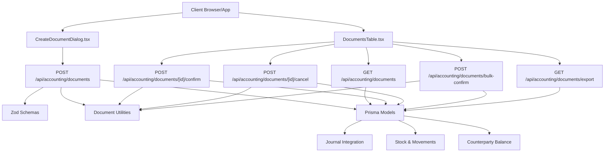
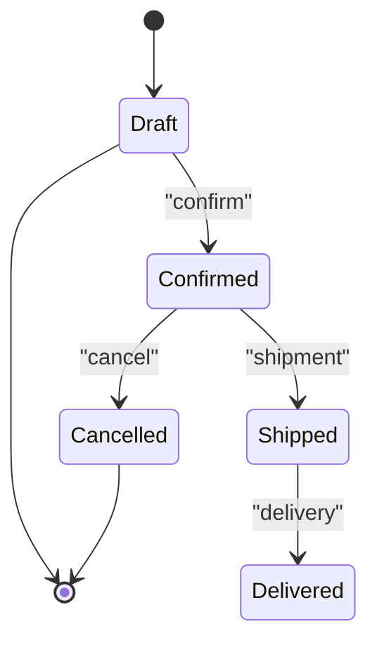
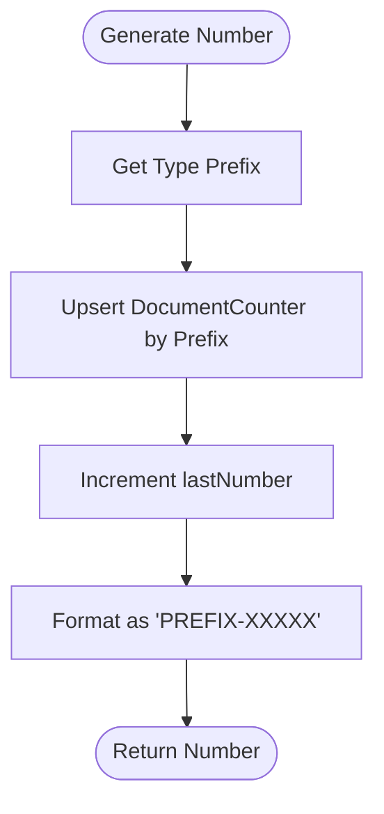
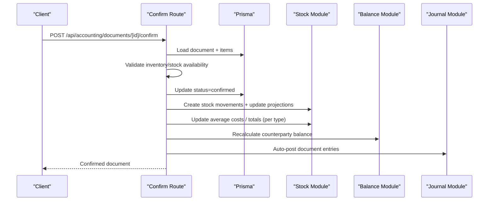
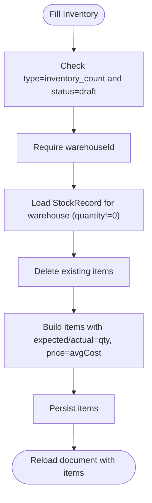
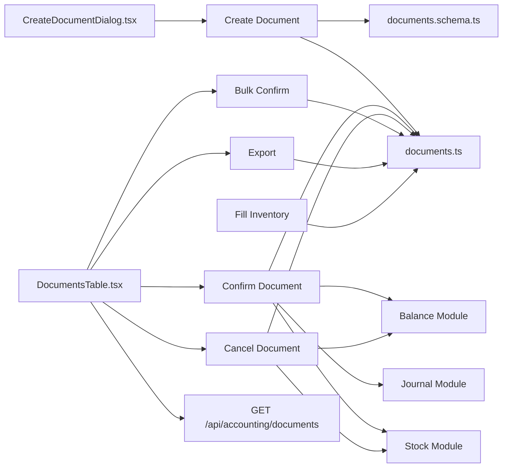

# Document Management System

<cite>
**Referenced Files in This Document**
- [route.ts](file://app/api/accounting/documents/route.ts)
- [route.ts](file://app/api/accounting/documents/[id]/route.ts)
- [route.ts](file://app/api/accounting/documents/[id]/confirm/route.ts)
- [route.ts](file://app/api/accounting/documents/[id]/cancel/route.ts)
- [route.ts](file://app/api/accounting/documents/[id]/fill-inventory/route.ts)
- [route.ts](file://app/api/accounting/documents/bulk-confirm/route.ts)
- [route.ts](file://app/api/accounting/documents/export/route.ts)
- [route.ts](file://app/api/accounting/documents/[id]/journal/route.ts)
- [documents.schema.ts](file://lib/modules/accounting/schemas/documents.schema.ts)
- [documents.ts](file://lib/modules/accounting/documents.ts)
- [schema.prisma](file://prisma/schema.prisma)
- [CreateDocumentDialog.tsx](file://components/accounting/CreateDocumentDialog.tsx)
- [DocumentsTable.tsx](file://components/accounting/DocumentsTable.tsx)
</cite>

## Table of Contents
1. [Introduction](#introduction)
2. [Project Structure](#project-structure)
3. [Core Components](#core-components)
4. [Architecture Overview](#architecture-overview)
5. [Detailed Component Analysis](#detailed-component-analysis)
6. [Dependency Analysis](#dependency-analysis)
7. [Performance Considerations](#performance-considerations)
8. [Troubleshooting Guide](#troubleshooting-guide)
9. [Conclusion](#conclusion)
10. [Appendices](#appendices)

## Introduction
This document describes the Document Management System within the ListOpt ERP accounting module. It covers the 11 supported document types grouped into stock operations, purchase operations, sales operations, and payment operations. It explains the document lifecycle from creation to confirmation, cancellation, and inventory filling, along with workflow states, approval processes, audit trails, numbering, templates, batch operations, API endpoints, and integration with the journal system. Examples illustrate typical workflows and reporting capabilities.

## Project Structure
The Document Management System spans backend API routes, shared business logic, Prisma schema definitions, and frontend components that render and operate documents.

```mermaid
graph TB
subgraph "Frontend"
UI_Dialog["CreateDocumentDialog.tsx"]
UI_Table["DocumentsTable.tsx"]
end
subgraph "Backend API"
API_List["GET /api/accounting/documents"]
API_Create["POST /api/accounting/documents"]
API_Get["GET /api/accounting/documents/[id]"]
API_Update["PUT /api/accounting/documents/[id]"]
API_Delete["DELETE /api/accounting/documents/[id]"]
API_Confirm["POST /api/accounting/documents/[id]/confirm"]
API_Cancel["POST /api/accounting/documents/[id]/cancel"]
API_FillInv["POST /api/accounting/documents/[id]/fill-inventory"]
API_BulkConfirm["POST /api/accounting/documents/bulk-confirm"]
API_Export["GET /api/accounting/documents/export"]
API_Journal["GET /api/accounting/documents/[id]/journal"]
end
subgraph "Shared Modules"
S_Schema["documents.schema.ts"]
S_Doc["documents.ts"]
end
subgraph "Data Layer"
PRISMA["Prisma Schema (schema.prisma)"]
end
UI_Dialog --> API_Create
UI_Table --> API_List
UI_Table --> API_Confirm
UI_Table --> API_Cancel
UI_Table --> API_BulkConfirm
UI_Table --> API_Export
API_List --> S_Schema
API_Create --> S_Schema
API_Get --> S_Doc
API_Update --> S_Schema
API_Delete --> S_Schema
API_Confirm --> S_Doc
API_Cancel --> S_Doc
API_FillInv --> S_Doc
API_BulkConfirm --> S_Doc
API_Export --> S_Doc
API_Journal --> S_Doc
API_List --> PRISMA
API_Create --> PRISMA
API_Get --> PRISMA
API_Update --> PRISMA
API_Delete --> PRISMA
API_Confirm --> PRISMA
API_Cancel --> PRISMA
API_FillInv --> PRISMA
API_BulkConfirm --> PRISMA
API_Export --> PRISMA
API_Journal --> PRISMA
```



**Diagram sources**
- [route.ts:1-136](file://app/api/accounting/documents/route.ts#L1-L136)
- [route.ts:1-166](file://app/api/accounting/documents/[id]/route.ts#L1-L166)
- [route.ts:1-421](file://app/api/accounting/documents/[id]/confirm/route.ts#L1-L421)
- [route.ts:1-69](file://app/api/accounting/documents/[id]/cancel/route.ts#L1-L69)
- [route.ts:1-100](file://app/api/accounting/documents/[id]/fill-inventory/route.ts#L1-L100)
- [route.ts:1-136](file://app/api/accounting/documents/bulk-confirm/route.ts#L1-L136)
- [route.ts:1-79](file://app/api/accounting/documents/export/route.ts#L1-L79)
- [route.ts:1-38](file://app/api/accounting/documents/[id]/journal/route.ts#L1-L38)
- [documents.schema.ts:1-55](file://lib/modules/accounting/schemas/documents.schema.ts#L1-L55)
- [documents.ts:1-144](file://lib/modules/accounting/documents.ts#L1-L144)
- [schema.prisma:449-538](file://prisma/schema.prisma#L449-L538)

**Section sources**
- [route.ts:1-136](file://app/api/accounting/documents/route.ts#L1-L136)
- [route.ts:1-166](file://app/api/accounting/documents/[id]/route.ts#L1-L166)
- [documents.schema.ts:1-55](file://lib/modules/accounting/schemas/documents.schema.ts#L1-L55)
- [documents.ts:1-144](file://lib/modules/accounting/documents.ts#L1-L144)
- [schema.prisma:449-538](file://prisma/schema.prisma#L449-L538)

## Core Components
- Document API endpoints: CRUD, confirmation, cancellation, inventory filling, bulk confirmation, export, and journal linkage.
- Shared document utilities: numbering, type/status names, stock/balance impact checks, and helpers.
- Prisma schema: defines Document, DocumentItem, DocumentCounter, and related entities.
- Frontend components: dialogs and tables for creating and managing documents.

Key responsibilities:
- Validation and permissions enforcement at the API boundary.
- State transitions and side effects (stock updates, balance recalculation, journal posting).
- Export and reporting support via CSV generation.
- Audit trail via immutable stock movements and journal entries.

**Section sources**
- [route.ts:1-136](file://app/api/accounting/documents/route.ts#L1-L136)
- [route.ts:1-421](file://app/api/accounting/documents/[id]/confirm/route.ts#L1-L421)
- [documents.ts:1-144](file://lib/modules/accounting/documents.ts#L1-L144)
- [schema.prisma:449-538](file://prisma/schema.prisma#L449-L538)

## Architecture Overview
The system follows a layered architecture:
- Presentation: Next.js app pages and components.
- API: Route handlers under app/api/accounting/documents implementing CRUD and workflows.
- Business logic: Shared modules in lib/modules/accounting handling document rules and integrations.
- Persistence: Prisma ORM mapping to PostgreSQL.



**Diagram sources**
- [CreateDocumentDialog.tsx:1-244](file://components/accounting/CreateDocumentDialog.tsx#L1-L244)
- [DocumentsTable.tsx:1-361](file://components/accounting/DocumentsTable.tsx#L1-L361)
- [route.ts:1-136](file://app/api/accounting/documents/route.ts#L1-L136)
- [route.ts:1-421](file://app/api/accounting/documents/[id]/confirm/route.ts#L1-L421)
- [documents.schema.ts:1-55](file://lib/modules/accounting/schemas/documents.schema.ts#L1-L55)
- [documents.ts:1-144](file://lib/modules/accounting/documents.ts#L1-L144)
- [schema.prisma:449-538](file://prisma/schema.prisma#L449-L538)

## Detailed Component Analysis

### Document Types and Lifecycle
Supported document types:
- Stock operations: stock_receipt, write_off, stock_transfer, inventory_count
- Purchase operations: purchase_order, incoming_shipment, supplier_return
- Sales operations: sales_order, outgoing_shipment, customer_return
- Payment operations: incoming_payment, outgoing_payment

Lifecycle stages:
- Draft: editable, deletable, confirmable.
- Confirmed: stock/balance adjusted, journal posted, cancellable.
- Cancelled: reverses prior effects (subject to implementation).
- Additional statuses: shipped, delivered (used for e-commerce/sales-related documents).



**Diagram sources**
- [schema.prisma:38-44](file://prisma/schema.prisma#L38-L44)
- [documents.ts:36-43](file://lib/modules/accounting/documents.ts#L36-L43)

**Section sources**
- [schema.prisma:46-63](file://prisma/schema.prisma#L46-L63)
- [documents.ts:36-43](file://lib/modules/accounting/documents.ts#L36-L43)

### Document Numbering System
Each document type has a unique prefix and an auto-incrementing counter per prefix. The generator ensures unique, sequential numbering across types.



**Diagram sources**
- [documents.ts:6-78](file://lib/modules/accounting/documents.ts#L6-L78)

**Section sources**
- [documents.ts:6-78](file://lib/modules/accounting/documents.ts#L6-L78)

### Workflow States and Approval Processes
- Creation: POST to create a draft document with items; totals computed automatically.
- Confirmation: Validates stock availability for outgoing/transfer, inventory count completeness, then transitions to confirmed, updates stock/movements, recalculates balances, posts to journal, and auto-creates payments for shipment documents.
- Cancellation: Reverts effects (stock recalculated), marks as cancelled.
- Bulk confirmation: Batch confirms up to 100 documents, skipping inventory_count and drafts without items or insufficient stock.



**Diagram sources**
- [route.ts:178-421](file://app/api/accounting/documents/[id]/confirm/route.ts#L178-L421)
- [documents.ts:90-144](file://lib/modules/accounting/documents.ts#L90-L144)

**Section sources**
- [route.ts:178-421](file://app/api/accounting/documents/[id]/confirm/route.ts#L178-L421)
- [documents.ts:90-144](file://lib/modules/accounting/documents.ts#L90-L144)

### Inventory Filling
- Fills an inventory_count draft with current stock quantities and sets expectedQty/actualQty accordingly.
- Requires a warehouse and only operates on draft inventory documents.



**Diagram sources**
- [route.ts:15-100](file://app/api/accounting/documents/[id]/fill-inventory/route.ts#L15-L100)

**Section sources**
- [route.ts:15-100](file://app/api/accounting/documents/[id]/fill-inventory/route.ts#L15-L100)

### Audit Trails and Journal Integration
- Stock movements are immutable records of receipts, shipments, transfers, write-offs, and adjustments.
- Journal entries are auto-generated per confirmed document linking to accounts and analytics dimensions.

```mermaid
erDiagram
DOCUMENT {
string id PK
string number UK
enum type
enum status
datetime date
string? warehouseId FK
string? targetWarehouseId FK
string? counterpartyId FK
float totalAmount
enum paymentType
string? description
string? notes
string? createdBy
datetime? confirmedAt
string? confirmedBy
datetime? cancelledAt
}
DOCUMENT_ITEM {
string id PK
string documentId FK
string productId FK
string? variantId FK
float quantity
float price
float total
float? expectedQty
float? actualQty
float? difference
}
STOCK_MOVEMENT {
string id PK
string documentId FK
string productId FK
string warehouseId FK
string? variantId FK
float quantity
float cost
float totalCost
enum type
datetime createdAt
}
JOURNAL_ENTRY {
string id PK
string number UK
datetime date
string? description
string? sourceType
string? sourceId
string? sourceNumber
boolean isManual
boolean isReversed
string? reversedBy FK
string? createdBy
}
LEDGER_LINE {
string id PK
string entryId FK
string accountId FK
float debit
float credit
float amountRub
string? counterpartyId FK
string? warehouseId FK
string? productId FK
}
DOCUMENT ||--o{ DOCUMENT_ITEM : "has"
DOCUMENT ||--o{ STOCK_MOVEMENT : "generates"
DOCUMENT ||--o{ JOURNAL_ENTRY : "posts"
JOURNAL_ENTRY ||--o{ LEDGER_LINE : "lines"
```

**Diagram sources**
- [schema.prisma:449-538](file://prisma/schema.prisma#L449-L538)
- [schema.prisma:416-437](file://prisma/schema.prisma#L416-L437)
- [schema.prisma:953-998](file://prisma/schema.prisma#L953-L998)

**Section sources**
- [schema.prisma:416-437](file://prisma/schema.prisma#L416-L437)
- [schema.prisma:953-998](file://prisma/schema.prisma#L953-L998)

### API Endpoints

- List documents
  - Method: GET
  - Path: /api/accounting/documents
  - Query parameters: type, types (comma-separated), status, warehouseId, counterpartyId, dateFrom, dateTo, search, page, limit
  - Returns: paginated list with enriched type/status names

- Create document
  - Method: POST
  - Path: /api/accounting/documents
  - Body: type, date, warehouseId, targetWarehouseId, counterpartyId, paymentType, description, notes, items, linkedDocumentId
  - Returns: created document with computed totals and enriched names

- Get document
  - Method: GET
  - Path: /api/accounting/documents/[id]
  - Returns: document with linked entities and enriched names

- Update document
  - Method: PUT
  - Path: /api/accounting/documents/[id]
  - Restrictions: only drafts editable
  - Body: same as create excluding type
  - Returns: updated document

- Delete document
  - Method: DELETE
  - Path: /api/accounting/documents/[id]
  - Restrictions: only drafts deletable
  - Returns: success indicator

- Confirm document
  - Method: POST
  - Path: /api/accounting/documents/[id]/confirm
  - Effects: stock movements, average cost updates, balance recalculation, journal posting, optional auto-payment creation for shipments

- Cancel document
  - Method: POST
  - Path: /api/accounting/documents/[id]/cancel
  - Effects: stock recalculation, balance recalculation

- Fill inventory
  - Method: POST
  - Path: /api/accounting/documents/[id]/fill-inventory
  - Purpose: populate inventory_count draft with current stock

- Bulk confirm
  - Method: POST
  - Path: /api/accounting/documents/bulk-confirm
  - Body: ids[]
  - Limits: up to 100 documents
  - Behavior: skips inventory_count, drafts without items, and documents with stock shortages

- Export
  - Method: GET
  - Path: /api/accounting/documents/export
  - Query: group (purchases/sales/stock), type, dateFrom, dateTo
  - Returns: CSV with header and rows

- Journal entries
  - Method: GET
  - Path: /api/accounting/documents/[id]/journal
  - Returns: flattened journal entries for the document

**Section sources**
- [route.ts:8-61](file://app/api/accounting/documents/route.ts#L8-L61)
- [route.ts:63-136](file://app/api/accounting/documents/route.ts#L63-L136)
- [route.ts:10-55](file://app/api/accounting/documents/[id]/route.ts#L10-L55)
- [route.ts:57-139](file://app/api/accounting/documents/[id]/route.ts#L57-L139)
- [route.ts:141-166](file://app/api/accounting/documents/[id]/route.ts#L141-L166)
- [route.ts:178-421](file://app/api/accounting/documents/[id]/confirm/route.ts#L178-L421)
- [route.ts:11-69](file://app/api/accounting/documents/[id]/cancel/route.ts#L11-L69)
- [route.ts:15-100](file://app/api/accounting/documents/[id]/fill-inventory/route.ts#L15-L100)
- [route.ts:15-136](file://app/api/accounting/documents/bulk-confirm/route.ts#L15-L136)
- [route.ts:11-79](file://app/api/accounting/documents/export/route.ts#L11-L79)
- [route.ts:5-38](file://app/api/accounting/documents/[id]/journal/route.ts#L5-L38)

### Frontend Integration
- CreateDocumentDialog: selects document type, warehouse/target warehouse, counterparty, and submits to create endpoint.
- DocumentsTable: lists documents, supports filtering by type/group/status/date range, bulk confirm, and per-row confirm/cancel actions.

**Section sources**
- [CreateDocumentDialog.tsx:1-244](file://components/accounting/CreateDocumentDialog.tsx#L1-L244)
- [DocumentsTable.tsx:1-361](file://components/accounting/DocumentsTable.tsx#L1-L361)

## Dependency Analysis
- API routes depend on Zod schemas for validation and shared document utilities for type/status names, numbering, and stock/balance impact checks.
- Confirmation/cancellation rely on stock, balance, and journal modules.
- Frontend components drive API usage and pagination/filtering.



**Diagram sources**
- [documents.schema.ts:1-55](file://lib/modules/accounting/schemas/documents.schema.ts#L1-L55)
- [documents.ts:1-144](file://lib/modules/accounting/documents.ts#L1-L144)
- [route.ts:1-421](file://app/api/accounting/documents/[id]/confirm/route.ts#L1-L421)
- [route.ts:1-69](file://app/api/accounting/documents/[id]/cancel/route.ts#L1-L69)
- [route.ts:1-136](file://app/api/accounting/documents/bulk-confirm/route.ts#L1-L136)
- [route.ts:1-79](file://app/api/accounting/documents/export/route.ts#L1-L79)
- [route.ts:1-100](file://app/api/accounting/documents/[id]/fill-inventory/route.ts#L1-L100)
- [DocumentsTable.tsx:1-361](file://components/accounting/DocumentsTable.tsx#L1-L361)
- [CreateDocumentDialog.tsx:1-244](file://components/accounting/CreateDocumentDialog.tsx#L1-L244)

**Section sources**
- [documents.schema.ts:1-55](file://lib/modules/accounting/schemas/documents.schema.ts#L1-L55)
- [documents.ts:1-144](file://lib/modules/accounting/documents.ts#L1-L144)
- [route.ts:1-421](file://app/api/accounting/documents/[id]/confirm/route.ts#L1-L421)
- [route.ts:1-69](file://app/api/accounting/documents/[id]/cancel/route.ts#L1-L69)
- [route.ts:1-136](file://app/api/accounting/documents/bulk-confirm/route.ts#L1-L136)
- [route.ts:1-79](file://app/api/accounting/documents/export/route.ts#L1-L79)
- [route.ts:1-100](file://app/api/accounting/documents/[id]/fill-inventory/route.ts#L1-L100)
- [DocumentsTable.tsx:1-361](file://components/accounting/DocumentsTable.tsx#L1-L361)
- [CreateDocumentDialog.tsx:1-244](file://components/accounting/CreateDocumentDialog.tsx#L1-L244)

## Performance Considerations
- Pagination and filtering: API enforces max page size and server-side filtering to avoid large payloads.
- Bulk confirm limits: caps batch size to prevent resource contention.
- Asynchronous operations: stock updates, balance recalculation, and journal posting are separate steps; failures are handled gracefully to avoid blocking.
- Immutable stock movements: provide fast reads for reporting and reconciliation.

[No sources needed since this section provides general guidance]

## Troubleshooting Guide
Common issues and resolutions:
- Validation errors: Ensure required fields (warehouse for stock types, counterparty for trade/payment types) and numeric constraints are met.
- Stock shortage during confirmation: Add stock via receipts or transfers before confirming outgoing documents.
- Inventory count discrepancies: Use fill-inventory to pre-populate expected/actual quantities; confirm only when actual quantities are recorded.
- Bulk confirm skips: Check that documents are drafts, have items, and sufficient stock; inventory_count is intentionally skipped.
- Export limitations: Use group or type filters; date range is inclusive to seconds.

**Section sources**
- [route.ts:205-267](file://app/api/accounting/documents/[id]/confirm/route.ts#L205-L267)
- [route.ts:20-50](file://app/api/accounting/documents/bulk-confirm/route.ts#L20-L50)
- [route.ts:25-45](file://app/api/accounting/documents/[id]/fill-inventory/route.ts#L25-L45)
- [route.ts:11-38](file://app/api/accounting/documents/export/route.ts#L11-L38)

## Conclusion
The Document Management System provides a robust, auditable, and integrated solution for managing ERP documents across stock, purchases, sales, and payments. It enforces strict validation, supports flexible workflows, maintains immutability via stock movements and journal entries, and offers efficient batch operations and reporting.

[No sources needed since this section summarizes without analyzing specific files]

## Appendices

### Document Types Reference
- Stock: stock_receipt, write_off, stock_transfer, inventory_count
- Purchases: purchase_order, incoming_shipment, supplier_return
- Sales: sales_order, outgoing_shipment, customer_return
- Payments: incoming_payment, outgoing_payment

**Section sources**
- [schema.prisma:46-63](file://prisma/schema.prisma#L46-L63)
- [documents.ts:21-34](file://lib/modules/accounting/documents.ts#L21-L34)

### Example Workflows
- Create a purchase order: POST with type=purchase_order; later confirm to trigger stock reservations and balance tracking.
- Receive goods: POST stock_receipt; confirm to update stock and average cost.
- Transfer stock: POST stock_transfer; confirm to adjust source/target warehouse records.
- Conduct inventory: POST inventory_count; use fill-inventory; confirm to auto-generate write-offs or receipts for discrepancies.
- Ship goods: POST outgoing_shipment; confirm to update stock, cost of goods sold, and optionally auto-create a payment.

**Section sources**
- [route.ts:63-136](file://app/api/accounting/documents/route.ts#L63-L136)
- [route.ts:178-421](file://app/api/accounting/documents/[id]/confirm/route.ts#L178-L421)
- [route.ts:15-100](file://app/api/accounting/documents/[id]/fill-inventory/route.ts#L15-L100)