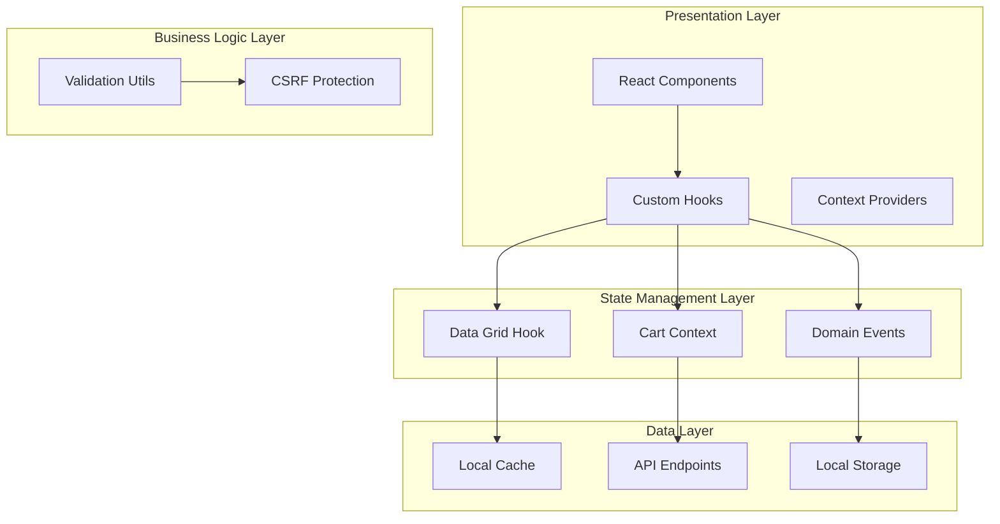
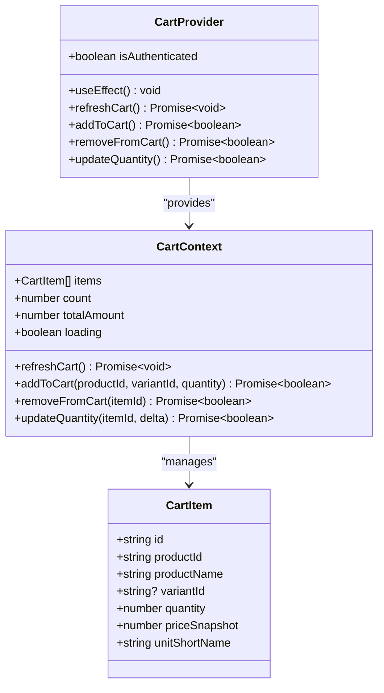
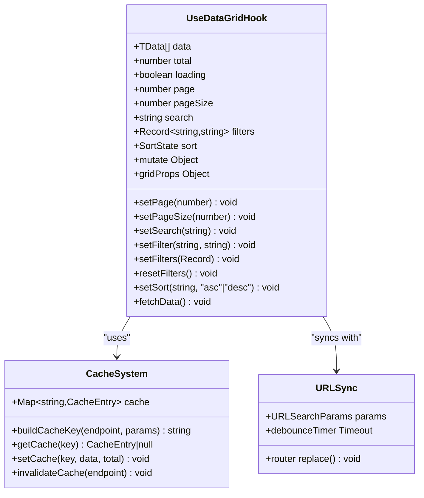
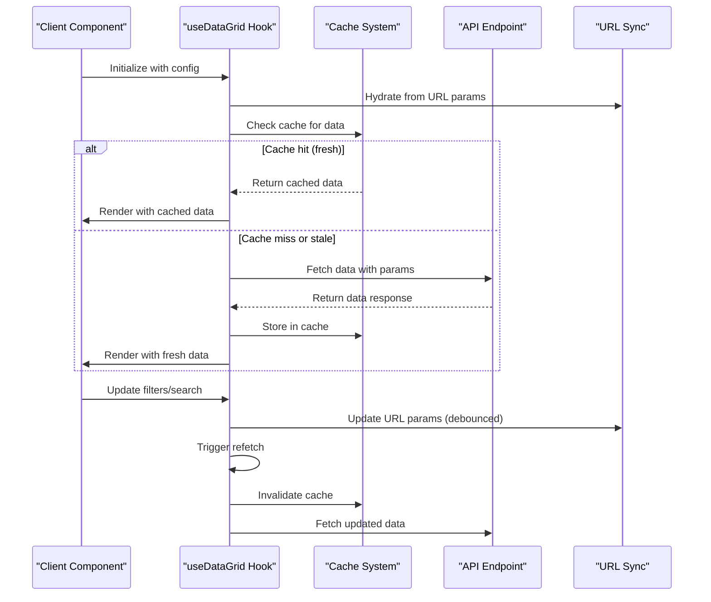
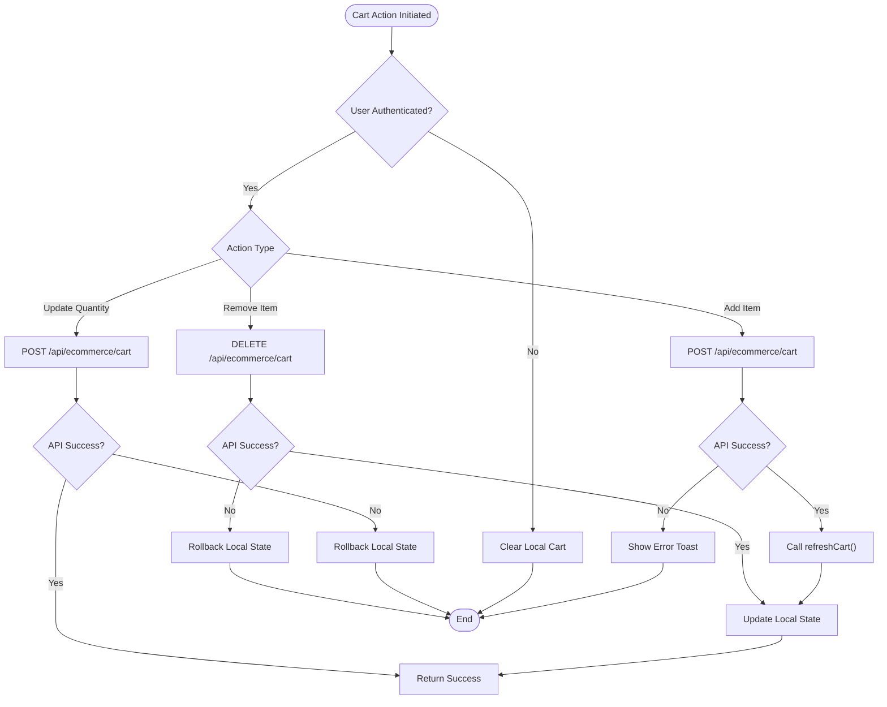
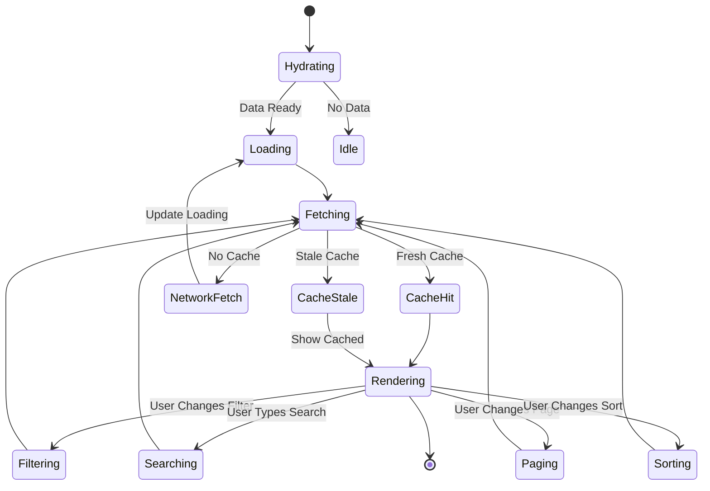
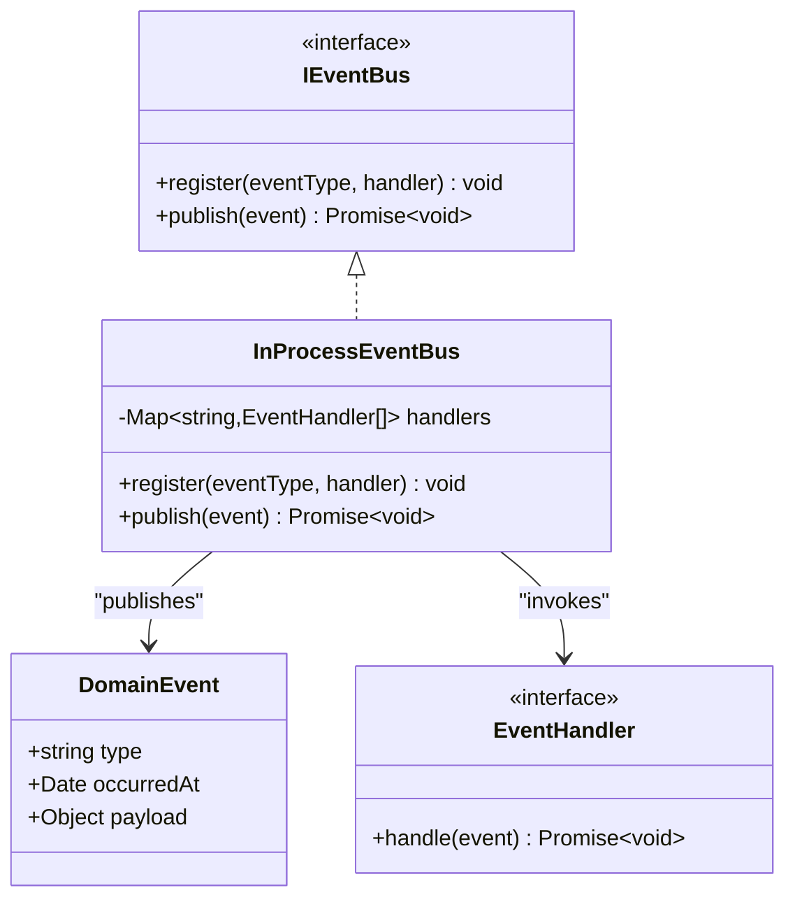
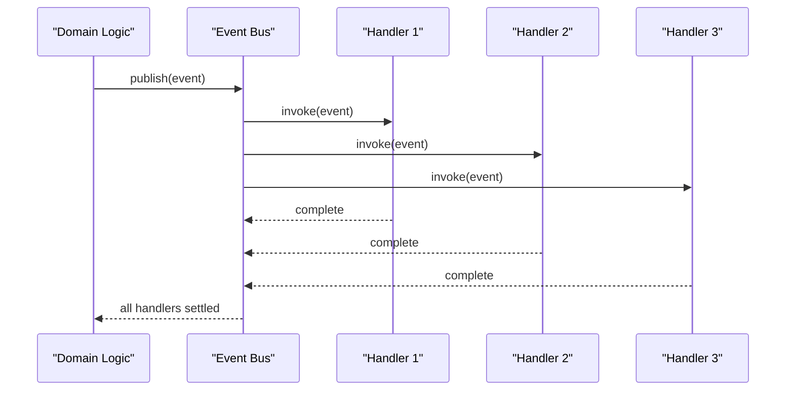
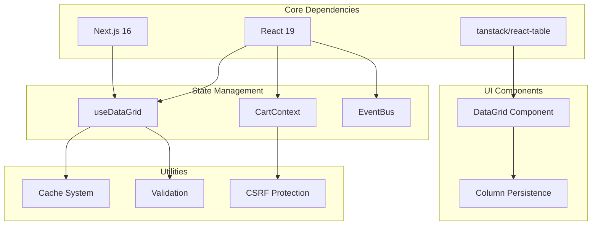

# Document State Management System

<cite>
**Referenced Files in This Document**
- [CartContext.tsx](file://components/ecommerce/CartContext.tsx)
- [use-data-grid.ts](file://lib/hooks/use-data-grid/use-data-grid.ts)
- [cache.ts](file://lib/hooks/use-data-grid/cache.ts)
- [data-grid.tsx](file://components/ui/data-grid/data-grid.tsx)
- [data-grid-persist.ts](file://components/ui/data-grid/data-grid-persist.ts)
- [DocumentsTable.tsx](file://components/accounting/DocumentsTable.tsx)
- [use-data-grid types.ts](file://lib/hooks/use-data-grid/types.ts)
- [domain-events.ts](file://lib/bootstrap/domain-events.ts)
- [event-bus.ts](file://lib/events/event-bus.ts)
- [outbox.ts](file://lib/events/outbox.ts)
- [validation.ts](file://lib/shared/validation.ts)
- [csrf.ts](file://lib/shared/csrf.ts)
- [README.md](file://README.md)
</cite>

## Table of Contents
1. [Introduction](#introduction)
2. [Project Structure](#project-structure)
3. [Core Components](#core-components)
4. [Architecture Overview](#architecture-overview)
5. [Detailed Component Analysis](#detailed-component-analysis)
6. [Dependency Analysis](#dependency-analysis)
7. [Performance Considerations](#performance-considerations)
8. [Troubleshooting Guide](#troubleshooting-guide)
9. [Conclusion](#conclusion)

## Introduction

The ListOpt ERP project implements a comprehensive state management system that spans multiple layers of the application architecture. This system manages state for e-commerce shopping carts, data grids with advanced filtering and pagination, domain events, and form validation. The state management approach combines React's built-in state management with custom hooks, context providers, and sophisticated caching mechanisms.

The system is designed to handle complex business requirements including real-time updates, optimistic UI patterns, and robust error handling across different functional domains such as accounting, e-commerce, and document management.

## Project Structure

The state management system is organized across several key architectural layers:

**Diagram sources**
- [CartContext.tsx:1-195](file://components/ecommerce/CartContext.tsx#L1-L195)
- [use-data-grid.ts:1-302](file://lib/hooks/use-data-grid/use-data-grid.ts#L1-L302)
- [event-bus.ts:1-92](file://lib/events/event-bus.ts#L1-L92)

**Section sources**
- [README.md:157-174](file://README.md#L157-L174)

## Core Components

### Shopping Cart State Management

The shopping cart system implements a sophisticated context-based state management solution with optimistic updates and error handling:

**Diagram sources**
- [CartContext.tsx:13-45](file://components/ecommerce/CartContext.tsx#L13-L45)
- [CartContext.tsx:56-194](file://components/ecommerce/CartContext.tsx#L56-L194)

### Data Grid State Management

The data grid hook provides comprehensive state management for tabular data with advanced filtering, pagination, and caching:

**Diagram sources**
- [use-data-grid.ts:17-301](file://lib/hooks/use-data-grid/use-data-grid.ts#L17-L301)
- [cache.ts:1-40](file://lib/hooks/use-data-grid/cache.ts#L1-L40)

**Section sources**
- [CartContext.tsx:56-194](file://components/ecommerce/CartContext.tsx#L56-L194)
- [use-data-grid.ts:17-301](file://lib/hooks/use-data-grid/use-data-grid.ts#L17-L301)

## Architecture Overview

The state management system follows a layered architecture pattern with clear separation of concerns:

**Diagram sources**
- [use-data-grid.ts:137-182](file://lib/hooks/use-data-grid/use-data-grid.ts#L137-L182)
- [cache.ts:17-31](file://lib/hooks/use-data-grid/cache.ts#L17-L31)

The architecture implements several key patterns:

1. **Optimistic Updates**: Immediate UI updates followed by server synchronization
2. **Cache-Aside Pattern**: Separate caching layer with explicit invalidation
3. **URL Synchronization**: Two-way binding between component state and URL parameters
4. **Debounced Operations**: Search and filter operations are debounced for performance

## Detailed Component Analysis

### Cart Context Implementation

The cart context provides a complete shopping cart management solution with the following features:

#### State Management Flow

**Diagram sources**
- [CartContext.tsx:83-173](file://components/ecommerce/CartContext.tsx#L83-L173)

#### Key Features

- **Optimistic UI Updates**: Cart state updates immediately, with rollback on API failure
- **Authentication-aware State**: Automatically clears cart when user logs out
- **Error Handling**: Comprehensive error handling with user-friendly messages
- **Loading States**: Proper loading indicators during async operations

**Section sources**
- [CartContext.tsx:56-194](file://components/ecommerce/CartContext.tsx#L56-L194)

### Data Grid Hook Architecture

The data grid hook implements a sophisticated state management system with multiple layers:

#### State Flow Diagram

**Diagram sources**
- [use-data-grid.ts:42-131](file://lib/hooks/use-data-grid/use-data-grid.ts#L42-L131)

#### Advanced Features

- **URL Synchronization**: Automatic synchronization with browser URL parameters
- **Debounced Search**: 300ms debounce for search operations
- **Cache Management**: 30-second freshness window with LRU eviction
- **Abort Controllers**: Prevent race conditions with stale requests
- **Mutation Support**: CRUD operations with optimistic updates

**Section sources**
- [use-data-grid.ts:17-301](file://lib/hooks/use-data-grid/use-data-grid.ts#L17-L301)
- [cache.ts:1-40](file://lib/hooks/use-data-grid/cache.ts#L1-L40)

### Domain Event System

The domain event system implements a publish-subscribe pattern for decoupled business logic:

**Diagram sources**
- [event-bus.ts:24-84](file://lib/events/event-bus.ts#L24-L84)

#### Event Flow

**Diagram sources**
- [event-bus.ts:62-76](file://lib/events/event-bus.ts#L62-L76)

**Section sources**
- [domain-events.ts:19-27](file://lib/bootstrap/domain-events.ts#L19-L27)
- [event-bus.ts:1-92](file://lib/events/event-bus.ts#L1-L92)

## Dependency Analysis

The state management system has well-defined dependencies that support modularity and maintainability:

**Diagram sources**
- [use-data-grid.ts:1-8](file://lib/hooks/use-data-grid/use-data-grid.ts#L1-L8)
- [CartContext.tsx:1-12](file://components/ecommerce/CartContext.tsx#L1-L12)

### Coupling and Cohesion Analysis

The system demonstrates excellent separation of concerns:

- **High Cohesion**: Each hook/module focuses on a specific domain (cart, data grid, events)
- **Low Coupling**: Components communicate through well-defined interfaces
- **Extensibility**: New state management patterns can be added without disrupting existing code

**Section sources**
- [use-data-grid.ts:17-35](file://lib/hooks/use-data-grid/use-data-grid.ts#L17-L35)
- [CartContext.tsx:37-45](file://components/ecommerce/CartContext.tsx#L37-L45)

## Performance Considerations

### Caching Strategy

The system implements a multi-layered caching approach:

1. **In-Memory Cache**: Fast access to recently fetched data
2. **URL Parameter Cache**: Persists user preferences across sessions
3. **Local Storage**: Long-term persistence for column configurations

### Optimization Techniques

- **Debounced Operations**: Search and filter operations are debounced to reduce network requests
- **Abort Controllers**: Cancel stale requests to prevent race conditions
- **Selective Re-rendering**: React.memo and useCallback for optimal performance
- **Lazy Loading**: Suspense boundaries for better user experience

## Troubleshooting Guide

### Common Issues and Solutions

#### Cart State Issues

**Problem**: Cart not updating after API calls
**Solution**: Verify that `refreshCart()` is called after successful mutations

#### Data Grid Performance Issues

**Problem**: Slow search operations
**Solution**: Adjust `searchDebounce` parameter in hook configuration

#### Cache Invalidation Problems

**Problem**: Stale data displayed after mutations
**Solution**: Ensure `invalidateCache()` is called after successful API operations

**Section sources**
- [CartContext.tsx:94-104](file://components/ecommerce/CartContext.tsx#L94-L104)
- [use-data-grid.ts:231-236](file://lib/hooks/use-data-grid/use-data-grid.ts#L231-L236)

## Conclusion

The ListOpt ERP state management system demonstrates a mature approach to handling complex application state across multiple domains. The system successfully balances simplicity with powerful features, providing:

- **Consistent Patterns**: Unified state management across different functional areas
- **Performance Focus**: Optimistic updates, caching, and debouncing for smooth user experience
- **Maintainability**: Clear separation of concerns and well-defined interfaces
- **Extensibility**: Modular design that supports future enhancements

The combination of React's native state management with custom hooks, context providers, and sophisticated caching mechanisms creates a robust foundation for the ERP system's complex business requirements. The system's architecture supports both current functionality and future growth while maintaining excellent performance characteristics.