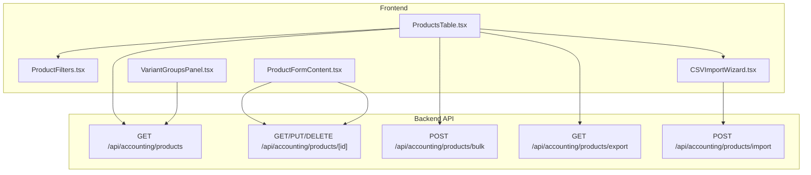
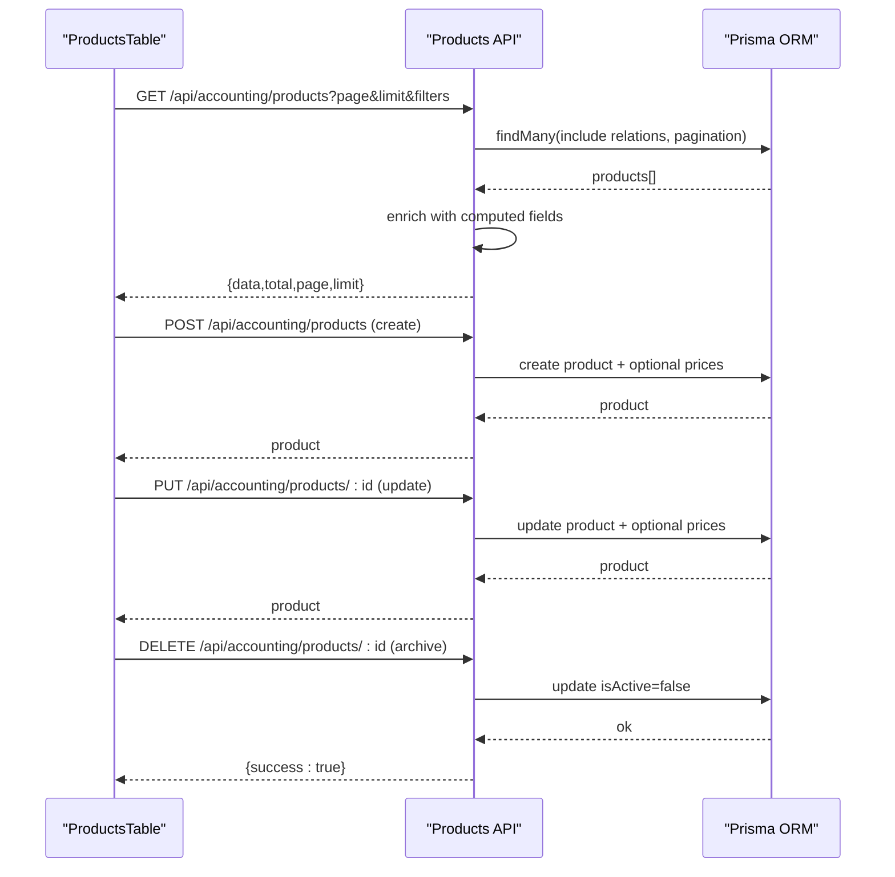
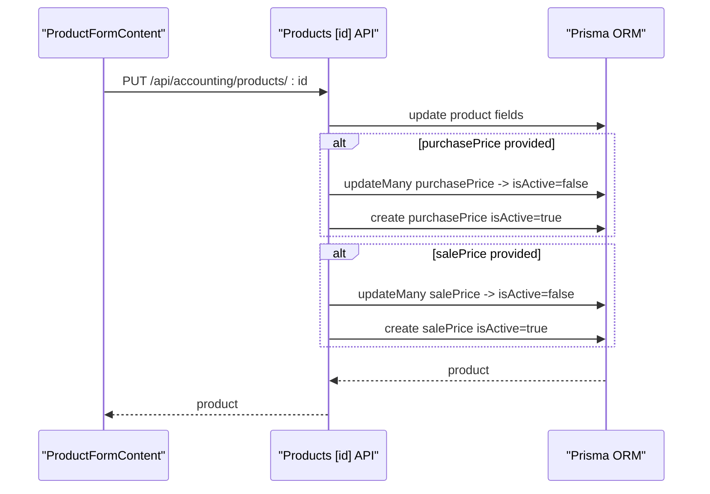
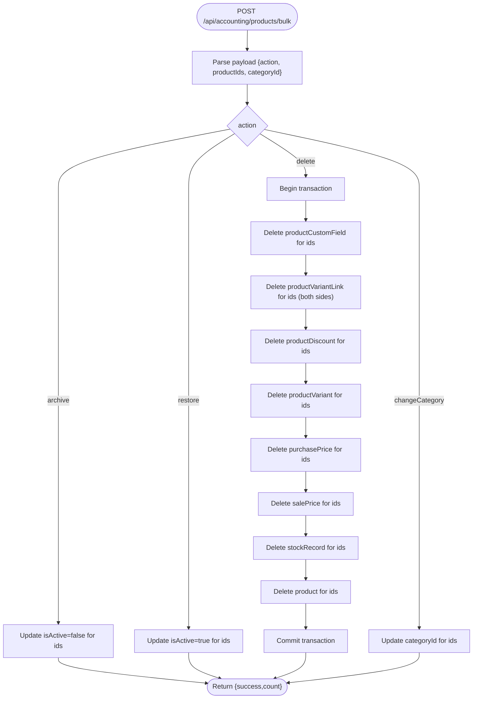
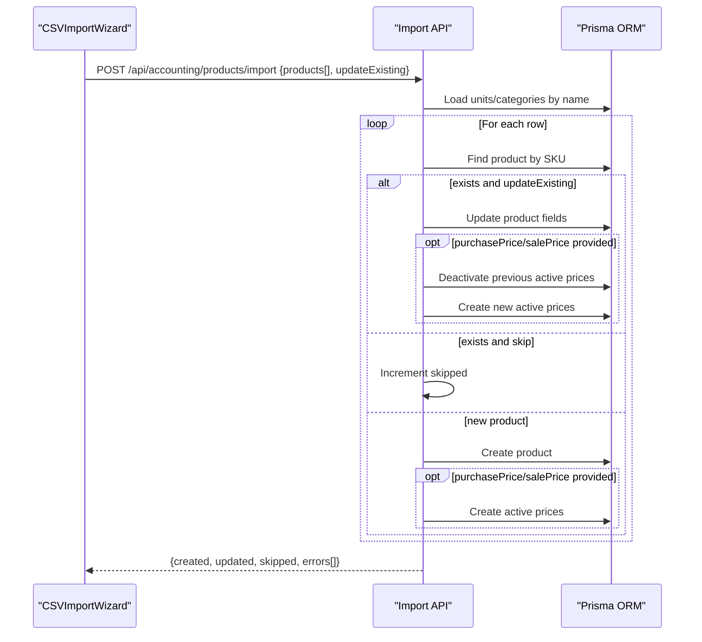
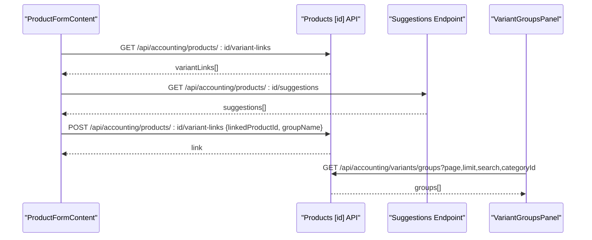
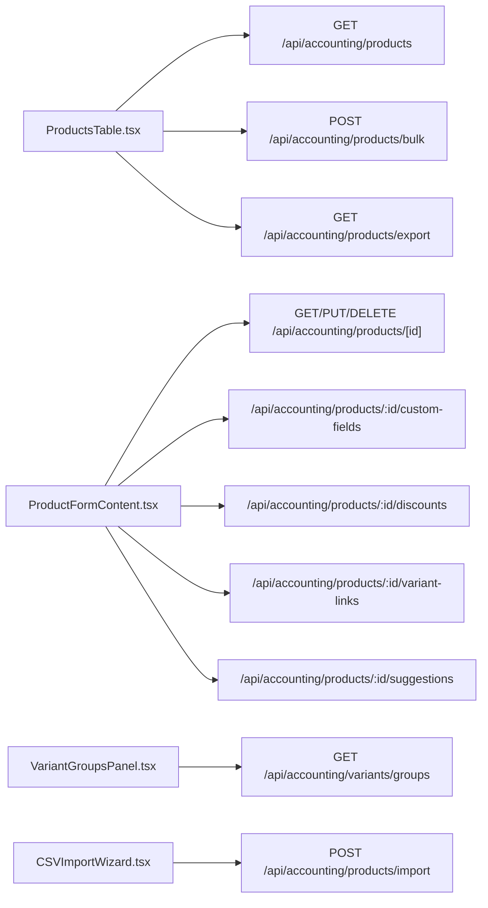

# Product Catalog Management

<cite>
**Referenced Files in This Document**
- [app/api/accounting/products/route.ts](file://app/api/accounting/products/route.ts)
- [app/api/accounting/products/[id]/route.ts](file://app/api/accounting/products/[id]/route.ts)
- [app/api/accounting/products/bulk/route.ts](file://app/api/accounting/products/bulk/route.ts)
- [app/api/accounting/products/export/route.ts](file://app/api/accounting/products/export/route.ts)
- [app/api/accounting/products/import/route.ts](file://app/api/accounting/products/import/route.ts)
- [components/accounting/catalog/ProductFormContent.tsx](file://components/accounting/catalog/ProductFormContent.tsx)
- [components/accounting/catalog/VariantGroupsPanel.tsx](file://components/accounting/catalog/VariantGroupsPanel.tsx)
- [components/accounting/catalog/CSVImportWizard.tsx](file://components/accounting/catalog/CSVImportWizard.tsx)
- [components/accounting/ProductsTable.tsx](file://components/accounting/ProductsTable.tsx)
- [components/accounting/catalog/ProductFilters.tsx](file://components/accounting/catalog/ProductFilters.tsx)
</cite>

## Table of Contents
1. [Introduction](#introduction)
2. [Project Structure](#project-structure)
3. [Core Components](#core-components)
4. [Architecture Overview](#architecture-overview)
5. [Detailed Component Analysis](#detailed-component-analysis)
6. [Dependency Analysis](#dependency-analysis)
7. [Performance Considerations](#performance-considerations)
8. [Troubleshooting Guide](#troubleshooting-guide)
9. [Conclusion](#conclusion)
10. [Appendices](#appendices)

## Introduction
This document describes the Product Catalog Management module within the ListOpt ERP accounting domain. It covers product master data lifecycle (create, read, update, archive), variant hierarchy and grouping, SKU generation, custom fields, pricing and discount management, bulk operations, import/export, and search/filter/reporting capabilities. It also documents the API endpoints used by the frontend and provides practical examples for product setup, variant configuration, and bulk operations.

## Project Structure
The product catalog feature spans backend API routes under the accounting namespace and frontend components responsible for forms, grids, filters, and import wizards.

**Diagram sources**
- [components/accounting/ProductsTable.tsx:59-85](file://components/accounting/ProductsTable.tsx#L59-L85)
- [components/accounting/catalog/ProductFilters.tsx:54-64](file://components/accounting/catalog/ProductFilters.tsx#L54-L64)
- [components/accounting/catalog/ProductFormContent.tsx:63-70](file://components/accounting/catalog/ProductFormContent.tsx#L63-L70)
- [components/accounting/catalog/VariantGroupsPanel.tsx:47-56](file://components/accounting/catalog/VariantGroupsPanel.tsx#L47-L56)
- [components/accounting/catalog/CSVImportWizard.tsx:131-139](file://components/accounting/catalog/CSVImportWizard.tsx#L131-L139)
- [app/api/accounting/products/route.ts:7-145](file://app/api/accounting/products/route.ts#L7-L145)
- [app/api/accounting/products/[id]/route.ts](file://app/api/accounting/products/[id]/route.ts#L9-L43)
- [app/api/accounting/products/bulk/route.ts:7-91](file://app/api/accounting/products/bulk/route.ts#L7-L91)
- [app/api/accounting/products/export/route.ts:42-165](file://app/api/accounting/products/export/route.ts#L42-L165)
- [app/api/accounting/products/import/route.ts:14-168](file://app/api/accounting/products/import/route.ts#L14-L168)

**Section sources**
- [components/accounting/ProductsTable.tsx:59-100](file://components/accounting/ProductsTable.tsx#L59-L100)
- [components/accounting/catalog/ProductFilters.tsx:54-64](file://components/accounting/catalog/ProductFilters.tsx#L54-L64)
- [components/accounting/catalog/ProductFormContent.tsx:63-70](file://components/accounting/catalog/ProductFormContent.tsx#L63-L70)
- [components/accounting/catalog/VariantGroupsPanel.tsx:47-56](file://components/accounting/catalog/VariantGroupsPanel.tsx#L47-L56)
- [components/accounting/catalog/CSVImportWizard.tsx:131-139](file://components/accounting/catalog/CSVImportWizard.tsx#L131-L139)
- [app/api/accounting/products/route.ts:7-145](file://app/api/accounting/products/route.ts#L7-L145)
- [app/api/accounting/products/[id]/route.ts](file://app/api/accounting/products/[id]/route.ts#L9-L43)
- [app/api/accounting/products/bulk/route.ts:7-91](file://app/api/accounting/products/bulk/route.ts#L7-L91)
- [app/api/accounting/products/export/route.ts:42-165](file://app/api/accounting/products/export/route.ts#L42-L165)
- [app/api/accounting/products/import/route.ts:14-168](file://app/api/accounting/products/import/route.ts#L14-L168)

## Core Components
- Product listing and filtering: ProductsTable renders a paginated, sortable grid with advanced filters and bulk actions. It integrates with ProductFilters and calls the products API.
- Product creation/editing: ProductFormContent manages product form state, image upload, SKU generation, custom fields, discounts, and variant linking. It posts to the product endpoints.
- Variant groups: VariantGroupsPanel displays grouped variants (master + children) with summary stats and expandable rows.
- Import/export: CSVImportWizard guides users through CSV import steps and calls the import endpoint. ProductsTable triggers exports via the export endpoint.
- Backend APIs: REST endpoints implement product CRUD, bulk operations, CSV import/export, and variant grouping.

**Section sources**
- [components/accounting/ProductsTable.tsx:59-100](file://components/accounting/ProductsTable.tsx#L59-L100)
- [components/accounting/catalog/ProductFormContent.tsx:63-70](file://components/accounting/catalog/ProductFormContent.tsx#L63-L70)
- [components/accounting/catalog/VariantGroupsPanel.tsx:47-56](file://components/accounting/catalog/VariantGroupsPanel.tsx#L47-L56)
- [components/accounting/catalog/CSVImportWizard.tsx:131-139](file://components/accounting/catalog/CSVImportWizard.tsx#L131-L139)
- [app/api/accounting/products/route.ts:7-145](file://app/api/accounting/products/route.ts#L7-L145)
- [app/api/accounting/products/[id]/route.ts](file://app/api/accounting/products/[id]/route.ts#L9-L43)
- [app/api/accounting/products/bulk/route.ts:7-91](file://app/api/accounting/products/bulk/route.ts#L7-L91)
- [app/api/accounting/products/export/route.ts:42-165](file://app/api/accounting/products/export/route.ts#L42-L165)
- [app/api/accounting/products/import/route.ts:14-168](file://app/api/accounting/products/import/route.ts#L14-L168)

## Architecture Overview
The system follows a layered pattern:
- Frontend components orchestrate user interactions and call backend endpoints.
- Backend routes validate requests, enforce permissions, and interact with the database via Prisma.
- Data is enriched with related entities (unit, category, prices, discounts, variants) and computed fields (discounted price).

**Diagram sources**
- [components/accounting/ProductsTable.tsx:65-85](file://components/accounting/ProductsTable.tsx#L65-L85)
- [app/api/accounting/products/route.ts:7-145](file://app/api/accounting/products/route.ts#L7-L145)
- [app/api/accounting/products/[id]/route.ts](file://app/api/accounting/products/[id]/route.ts#L45-L102)

## Detailed Component Analysis

### Product CRUD API
- GET /api/accounting/products
  - Supports search across name, SKU, barcode; category filter; active/archived; publication flag; discount presence; variant status (masters/variants/unlinked); sorting by name, SKU, created date, and price fields.
  - Includes unit, category, latest active purchase/sale prices, latest active discount, counts of variant links and child variants, and master product info.
  - Post-processes price-based sorts in memory when needed.
- POST /api/accounting/products
  - Creates a product with optional auto-generated SKU and slug.
  - Optionally creates initial purchase and sale prices.
  - Returns enriched product with latest prices.
- GET /api/accounting/products/[id]
  - Retrieves product with unit, category, stock records, latest active prices, custom fields, variants, and discounts.
- PUT /api/accounting/products/[id]
  - Updates product metadata; toggles active/published flags; updates prices by deactivating previous and inserting new active ones.
- DELETE /api/accounting/products/[id]
  - Archives a product by setting isActive=false.

**Diagram sources**
- [components/accounting/catalog/ProductFormContent.tsx:220-251](file://components/accounting/catalog/ProductFormContent.tsx#L220-L251)
- [app/api/accounting/products/[id]/route.ts](file://app/api/accounting/products/[id]/route.ts#L45-L102)

**Section sources**
- [app/api/accounting/products/route.ts:7-145](file://app/api/accounting/products/route.ts#L7-L145)
- [app/api/accounting/products/[id]/route.ts](file://app/api/accounting/products/[id]/route.ts#L9-L119)

### Bulk Operations API
- POST /api/accounting/products/bulk
  - Supported actions: archive, restore, delete, changeCategory.
  - delete performs a transaction to remove related records (custom fields, variant links, discounts, variants, prices, stock) before deleting products.

**Diagram sources**
- [app/api/accounting/products/bulk/route.ts:7-91](file://app/api/accounting/products/bulk/route.ts#L7-L91)

**Section sources**
- [app/api/accounting/products/bulk/route.ts:7-91](file://app/api/accounting/products/bulk/route.ts#L7-L91)

### Import/Export API
- Export
  - GET /api/accounting/products/export
  - Filters: search, category, active, published, hasDiscount.
  - Columns: configurable subset of name, SKU, barcode, category, unit, purchasePrice, salePrice, description, createdAt, isActive, publishedToStore.
  - Returns UTF-8 CSV with BOM and attachment headers.
- Import
  - POST /api/accounting/products/import
  - Accepts array of product rows with optional unit/category name resolution and SKU-based deduplication.
  - Supports updateExisting to modify existing SKUs.
  - Returns counts of created/updated/skipped and per-row errors.

**Diagram sources**
- [components/accounting/catalog/CSVImportWizard.tsx:199-241](file://components/accounting/catalog/CSVImportWizard.tsx#L199-L241)
- [app/api/accounting/products/import/route.ts:14-168](file://app/api/accounting/products/import/route.ts#L14-L168)

**Section sources**
- [app/api/accounting/products/export/route.ts:42-165](file://app/api/accounting/products/export/route.ts#L42-L165)
- [app/api/accounting/products/import/route.ts:14-168](file://app/api/accounting/products/import/route.ts#L14-L168)
- [components/accounting/catalog/CSVImportWizard.tsx:131-241](file://components/accounting/catalog/CSVImportWizard.tsx#L131-L241)

### Variant Management and Grouping
- Variant linking
  - ProductFormContent supports searching for other products and adding variant links with a group name (e.g., Color, Size).
  - It fetches suggestions from /api/accounting/products/:id/suggestions and allows accepting or dismissing them.
- Variant groups panel
  - VariantGroupsPanel queries grouped variants via /api/accounting/variants/groups, displaying master product, variant counts, price range, and stock totals, with expand/collapse.

**Diagram sources**
- [components/accounting/catalog/ProductFormContent.tsx:282-371](file://components/accounting/catalog/ProductFormContent.tsx#L282-L371)
- [components/accounting/catalog/VariantGroupsPanel.tsx:57-82](file://components/accounting/catalog/VariantGroupsPanel.tsx#L57-L82)

**Section sources**
- [components/accounting/catalog/ProductFormContent.tsx:282-371](file://components/accounting/catalog/ProductFormContent.tsx#L282-L371)
- [components/accounting/catalog/VariantGroupsPanel.tsx:47-82](file://components/accounting/catalog/VariantGroupsPanel.tsx#L47-L82)

### Custom Fields, Pricing, and Discounts
- Custom fields
  - ProductFormContent loads custom field definitions and supports creating/deleting definitions and assigning values to products.
  - Values are persisted via a dedicated endpoint for product custom fields.
- Pricing
  - Products maintain latest active purchasePrice and salePrice entries; updates deactivate previous entries and insert new active ones.
- Discounts
  - ProductFormContent supports adding/removing product discounts; the listing endpoint computes discountedPrice using the latest active discount and salePrice.

**Section sources**
- [components/accounting/catalog/ProductFormContent.tsx:124-133](file://components/accounting/catalog/ProductFormContent.tsx#L124-L133)
- [app/api/accounting/products/[id]/route.ts](file://app/api/accounting/products/[id]/route.ts#L45-L102)
- [app/api/accounting/products/route.ts:106-128](file://app/api/accounting/products/route.ts#L106-L128)

### Search, Filtering, and Reporting
- Search and filters
  - ProductsTable integrates ProductFiltersBar to apply search, category, active/archived, published, variant status, and “has discount” filters.
  - Sorting supports name, SKU, created date, and price fields (with server-side or post-processing sorts).
- Reporting
  - Export endpoint produces CSV with configurable columns and BOM for Excel compatibility.

**Section sources**
- [components/accounting/ProductsTable.tsx:59-138](file://components/accounting/ProductsTable.tsx#L59-L138)
- [components/accounting/catalog/ProductFilters.tsx:54-64](file://components/accounting/catalog/ProductFilters.tsx#L54-L64)
- [app/api/accounting/products/export/route.ts:42-165](file://app/api/accounting/products/export/route.ts#L42-L165)

## Dependency Analysis
- Frontend-to-backend coupling
  - ProductsTable depends on Products API for listing and bulk actions.
  - ProductFormContent depends on individual product endpoints for create/update and related endpoints for custom fields, discounts, and variant links.
  - CSVImportWizard depends on Import API and triggers refresh after successful import.
  - VariantGroupsPanel depends on the variants groups endpoint.
- Backend dependencies
  - Product endpoints depend on Prisma models for product, unit, category, prices, discounts, variants, and stock.
  - Bulk delete uses transactions to maintain referential integrity.

**Diagram sources**
- [components/accounting/ProductsTable.tsx:65-85](file://components/accounting/ProductsTable.tsx#L65-L85)
- [components/accounting/catalog/ProductFormContent.tsx:162-173](file://components/accounting/catalog/ProductFormContent.tsx#L162-L173)
- [components/accounting/catalog/VariantGroupsPanel.tsx:67-77](file://components/accounting/catalog/VariantGroupsPanel.tsx#L67-L77)
- [components/accounting/catalog/CSVImportWizard.tsx:218-231](file://components/accounting/catalog/CSVImportWizard.tsx#L218-L231)
- [app/api/accounting/products/route.ts:7-145](file://app/api/accounting/products/route.ts#L7-L145)
- [app/api/accounting/products/[id]/route.ts](file://app/api/accounting/products/[id]/route.ts#L9-L43)
- [app/api/accounting/products/bulk/route.ts:7-91](file://app/api/accounting/products/bulk/route.ts#L7-L91)
- [app/api/accounting/products/export/route.ts:42-165](file://app/api/accounting/products/export/route.ts#L42-L165)
- [app/api/accounting/products/import/route.ts:14-168](file://app/api/accounting/products/import/route.ts#L14-L168)

**Section sources**
- [components/accounting/ProductsTable.tsx:59-100](file://components/accounting/ProductsTable.tsx#L59-L100)
- [components/accounting/catalog/ProductFormContent.tsx:162-173](file://components/accounting/catalog/ProductFormContent.tsx#L162-L173)
- [components/accounting/catalog/VariantGroupsPanel.tsx:57-82](file://components/accounting/catalog/VariantGroupsPanel.tsx#L57-L82)
- [components/accounting/catalog/CSVImportWizard.tsx:199-241](file://components/accounting/catalog/CSVImportWizard.tsx#L199-L241)
- [app/api/accounting/products/route.ts:7-145](file://app/api/accounting/products/route.ts#L7-L145)
- [app/api/accounting/products/[id]/route.ts](file://app/api/accounting/products/[id]/route.ts#L9-L43)
- [app/api/accounting/products/bulk/route.ts:7-91](file://app/api/accounting/products/bulk/route.ts#L7-L91)
- [app/api/accounting/products/export/route.ts:42-165](file://app/api/accounting/products/export/route.ts#L42-L165)
- [app/api/accounting/products/import/route.ts:14-168](file://app/api/accounting/products/import/route.ts#L14-L168)

## Performance Considerations
- Efficient queries
  - Use includes judiciously; the listing endpoint includes only necessary relations and limits counts to reduce payload size.
  - Sorting by price fields incurs post-processing; consider indexing and caching strategies at the database level if performance becomes a concern.
- Pagination and limits
  - Default page size is 50; adjust based on UX needs and network constraints.
- Transactions for bulk delete
  - Ensures data integrity during hard deletes; consider batching large deletions to avoid long-running transactions.
- CSV export
  - Builds CSV in-memory; for very large datasets, consider streaming or server-side generation with file storage.

[No sources needed since this section provides general guidance]

## Troubleshooting Guide
- Authentication/permissions
  - All product endpoints require appropriate permissions; unauthorized requests are handled centrally.
- Validation errors
  - Requests are validated against schemas; validation errors are returned with structured messages.
- Import issues
  - CSVImportWizard collects per-row errors; ensure required fields (e.g., name) are mapped and encoding is UTF-8.
- Variant suggestions
  - If suggestions do not appear, verify that the product has sufficient characteristics and that related products exist.

**Section sources**
- [app/api/accounting/products/route.ts:140-144](file://app/api/accounting/products/route.ts#L140-L144)
- [app/api/accounting/products/[id]/route.ts](file://app/api/accounting/products/[id]/route.ts#L40-L42)
- [components/accounting/catalog/CSVImportWizard.tsx:236-241](file://components/accounting/catalog/CSVImportWizard.tsx#L236-L241)

## Conclusion
The Product Catalog Management module provides a robust, permission-enforced system for managing product master data, variants, custom fields, pricing, and discounts. It offers flexible search and filtering, efficient bulk operations, and reliable import/export workflows. The frontend components integrate seamlessly with backend APIs to deliver a smooth user experience for day-to-day catalog maintenance.

## Appendices

### API Reference Summary
- List and filter products
  - Method: GET
  - Path: /api/accounting/products
  - Query params: search, categoryId, active, published, hasDiscount, variantStatus, sortBy, sortOrder, page, limit
- Create product
  - Method: POST
  - Path: /api/accounting/products
  - Body: name, sku, barcode, description, unitId, categoryId, imageUrl, purchasePrice, salePrice, seoTitle, seoDescription, seoKeywords, slug, autoSku, publishedToStore
- Retrieve product
  - Method: GET
  - Path: /api/accounting/products/[id]
- Update product
  - Method: PUT
  - Path: /api/accounting/products/[id]
  - Body: name, sku, barcode, description, unitId, categoryId, imageUrl, isActive, seoTitle, seoDescription, seoKeywords, slug, publishedToStore, purchasePrice, salePrice
- Archive product
  - Method: DELETE
  - Path: /api/accounting/products/[id]
- Bulk actions
  - Method: POST
  - Path: /api/accounting/products/bulk
  - Body: action, productIds, categoryId (for changeCategory)
- Export products
  - Method: GET
  - Path: /api/accounting/products/export
  - Query params: search, categoryId, active, published, hasDiscount, columns
- Import products
  - Method: POST
  - Path: /api/accounting/products/import
  - Body: products[], updateExisting
- Variant groups
  - Method: GET
  - Path: /api/accounting/variants/groups
  - Query params: page, limit, search, categoryId

**Section sources**
- [app/api/accounting/products/route.ts:7-145](file://app/api/accounting/products/route.ts#L7-L145)
- [app/api/accounting/products/[id]/route.ts](file://app/api/accounting/products/[id]/route.ts#L9-L119)
- [app/api/accounting/products/bulk/route.ts:7-91](file://app/api/accounting/products/bulk/route.ts#L7-L91)
- [app/api/accounting/products/export/route.ts:42-165](file://app/api/accounting/products/export/route.ts#L42-L165)
- [app/api/accounting/products/import/route.ts:14-168](file://app/api/accounting/products/import/route.ts#L14-L168)
- [components/accounting/catalog/VariantGroupsPanel.tsx:67-77](file://components/accounting/catalog/VariantGroupsPanel.tsx#L67-L77)

### Examples

- Product setup
  - Create a product with auto-generated SKU and slug, set purchase and sale prices, and publish to store.
  - Steps: Open product form → fill basic info → optionally upload image → click Save.
  - Expected outcome: New product record with latest active prices.

- Variant configuration
  - From a product edit screen:
    - Go to Variants tab → enter group name (e.g., Color) → search and add linked products → review suggestions and accept high-confidence matches.
  - Outcome: Linked variants grouped under the master product.

- Bulk operations
  - Select multiple rows in the product grid → choose Bulk Actions (Archive, Restore, Delete) → confirm and observe results.

**Section sources**
- [components/accounting/catalog/ProductFormContent.tsx:220-251](file://components/accounting/catalog/ProductFormContent.tsx#L220-L251)
- [components/accounting/catalog/ProductFormContent.tsx:330-371](file://components/accounting/catalog/ProductFormContent.tsx#L330-L371)
- [components/accounting/ProductsTable.tsx:214-265](file://components/accounting/ProductsTable.tsx#L214-L265)