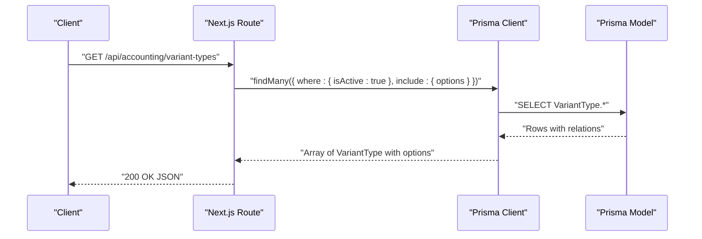
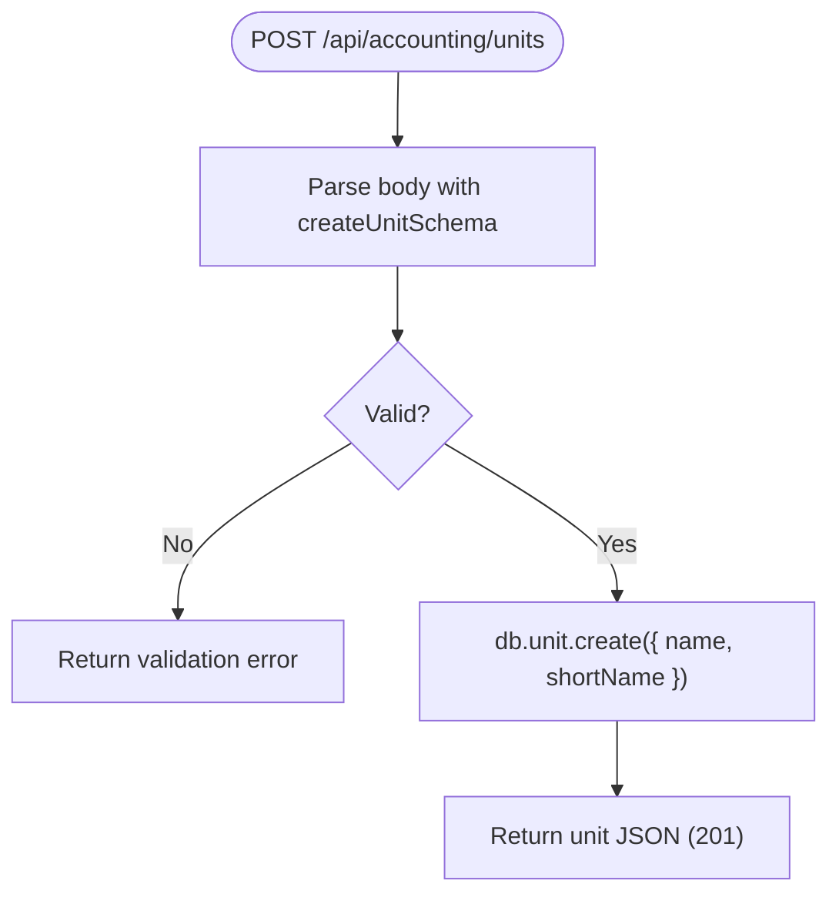
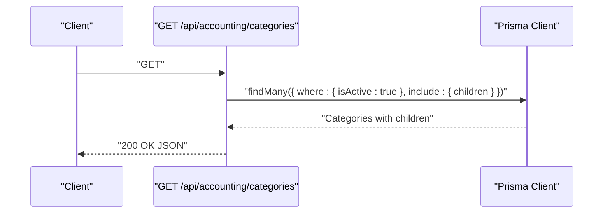
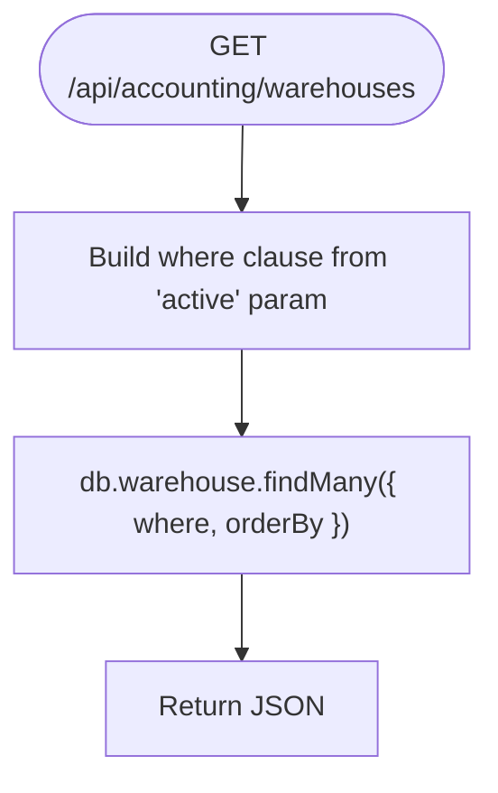
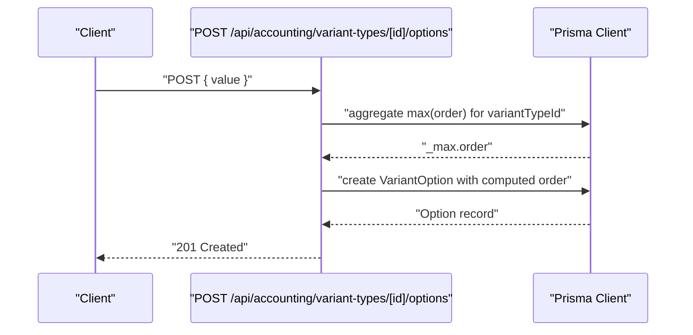
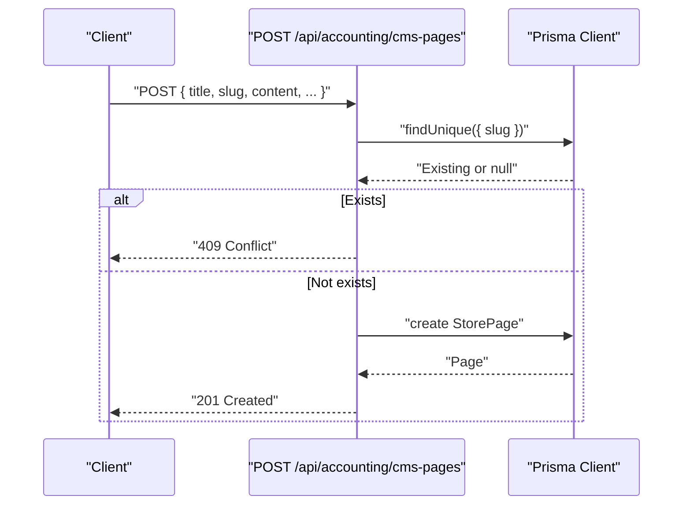
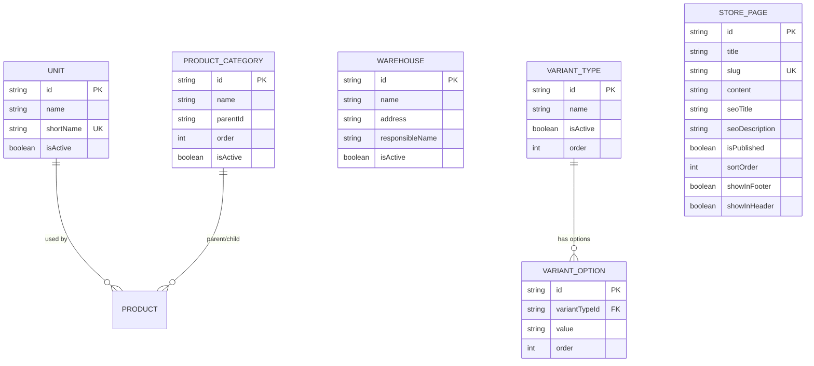

# Reference Data Management

<cite>
**Referenced Files in This Document**
- [schema.prisma](file://prisma/schema.prisma)
- [route.ts](file://app/api/accounting/accounts/route.ts)
- [route.ts](file://app/api/accounting/categories/route.ts)
- [route.ts](file://app/api/accounting/units/route.ts)
- [route.ts](file://app/api/accounting/warehouses/route.ts)
- [route.ts](file://app/api/accounting/cms-pages/route.ts)
- [route.ts](file://app/api/accounting/variant-types/route.ts)
- [route.ts](file://app/api/accounting/variant-types/[id]/route.ts)
- [route.ts](file://app/api/accounting/variant-types/[id]/options/route.ts)
- [categories.schema.ts](file://lib/modules/accounting/schemas/categories.schema.ts)
- [units.schema.ts](file://lib/modules/accounting/schemas/units.schema.ts)
- [variant-types.schema.ts](file://lib/modules/accounting/schemas/variant-types.schema.ts)
- [warehouses.schema.ts](file://lib/modules/accounting/schemas/warehouses.schema.ts)
</cite>

## Table of Contents
1. [Introduction](#introduction)
2. [Project Structure](#project-structure)
3. [Core Components](#core-components)
4. [Architecture Overview](#architecture-overview)
5. [Detailed Component Analysis](#detailed-component-analysis)
6. [Dependency Analysis](#dependency-analysis)
7. [Performance Considerations](#performance-considerations)
8. [Troubleshooting Guide](#troubleshooting-guide)
9. [Conclusion](#conclusion)
10. [Appendices](#appendices)

## Introduction
This document describes Reference Data Management within the ListOpt ERP accounting module. It covers master data configuration for accounts, categories, units of measurement, warehouses, and variant types, along with CMS page management for content publishing. It explains the hierarchical structure of variant types and their options, outlines data validation rules and lookup tables, and documents reference integrity. The document also lists API endpoints for CRUD operations across all reference entities, addresses import/export considerations, and clarifies relationships between reference data and business entities.

## Project Structure
Reference data is modeled in Prisma and exposed via Next.js routes under app/api/accounting. The primary reference entities include Units, Product Categories, Warehouses, Variant Types and Options, and Store Pages (CMS). Validation schemas reside under lib/modules/accounting/schemas.

```mermaid
graph TB
subgraph "API Layer"
A["GET /api/accounting/units"]
B["POST /api/accounting/units"]
C["GET /api/accounting/categories"]
D["POST /api/accounting/categories"]
E["GET /api/accounting/warehouses"]
F["POST /api/accounting/warehouses"]
G["GET /api/accounting/variant-types"]
H["POST /api/accounting/variant-types"]
I["PUT /api/accounting/variant-types/[id]"]
J["DELETE /api/accounting/variant-types/[id]"]
K["POST /api/accounting/variant-types/[id]/options"]
L["DELETE /api/accounting/variant-types/[id]/options?optionId=..."]
M["GET /api/accounting/cms-pages"]
N["POST /api/accounting/cms-pages"]
end
subgraph "Prisma Schema"
U["Unit"]
CAT["ProductCategory"]
WH["Warehouse"]
VT["VariantType"]
VO["VariantOption"]
SP["StorePage"]
end
A --> U
B --> U
C --> CAT
D --> CAT
E --> WH
F --> WH
G --> VT
H --> VT
I --> VT
J --> VT
K --> VO
L --> VO
M --> SP
N --> SP
```

**Diagram sources**
- [route.ts:1-39](file://app/api/accounting/units/route.ts#L1-L39)
- [route.ts:1-41](file://app/api/accounting/categories/route.ts#L1-L41)
- [route.ts:1-45](file://app/api/accounting/warehouses/route.ts#L1-L45)
- [route.ts:1-46](file://app/api/accounting/variant-types/route.ts#L1-L46)
- [route.ts:1-51](file://app/api/accounting/variant-types/[id]/route.ts#L1-L51)
- [route.ts:1-54](file://app/api/accounting/variant-types/[id]/options/route.ts#L1-L54)
- [route.ts:1-67](file://app/api/accounting/cms-pages/route.ts#L1-L67)
- [schema.prisma:81-90](file://prisma/schema.prisma#L81-L90)
- [schema.prisma:92-106](file://prisma/schema.prisma#L92-L106)
- [schema.prisma:369-384](file://prisma/schema.prisma#L369-L384)
- [schema.prisma:204-227](file://prisma/schema.prisma#L204-L227)
- [schema.prisma:217-227](file://prisma/schema.prisma#L217-L227)

**Section sources**
- [route.ts:1-39](file://app/api/accounting/units/route.ts#L1-L39)
- [route.ts:1-41](file://app/api/accounting/categories/route.ts#L1-L41)
- [route.ts:1-45](file://app/api/accounting/warehouses/route.ts#L1-L45)
- [route.ts:1-46](file://app/api/accounting/variant-types/route.ts#L1-L46)
- [route.ts:1-51](file://app/api/accounting/variant-types/[id]/route.ts#L1-L51)
- [route.ts:1-54](file://app/api/accounting/variant-types/[id]/options/route.ts#L1-L54)
- [route.ts:1-67](file://app/api/accounting/cms-pages/route.ts#L1-L67)
- [schema.prisma:81-90](file://prisma/schema.prisma#L81-L90)
- [schema.prisma:92-106](file://prisma/schema.prisma#L92-L106)
- [schema.prisma:369-384](file://prisma/schema.prisma#L369-L384)
- [schema.prisma:204-227](file://prisma/schema.prisma#L204-L227)
- [schema.prisma:217-227](file://prisma/schema.prisma#L217-L227)

## Core Components
- Units: Base measurement units with unique short names and optional activation flag.
- Product Categories: Hierarchical taxonomy with parent-child relations and ordering.
- Warehouses: Storage locations with optional address and responsible person.
- Variant Types and Options: Product variant attributes (e.g., Size, Color) and their discrete values.
- CMS Pages: Store front content pages with SEO metadata and publish controls.

Validation rules and lookup constraints are enforced by Prisma models and validated via Zod schemas in API routes.

**Section sources**
- [schema.prisma:81-90](file://prisma/schema.prisma#L81-L90)
- [schema.prisma:92-106](file://prisma/schema.prisma#L92-L106)
- [schema.prisma:369-384](file://prisma/schema.prisma#L369-L384)
- [schema.prisma:204-227](file://prisma/schema.prisma#L204-L227)
- [schema.prisma:217-227](file://prisma/schema.prisma#L217-L227)
- [categories.schema.ts:1-17](file://lib/modules/accounting/schemas/categories.schema.ts#L1-L17)
- [units.schema.ts:1-15](file://lib/modules/accounting/schemas/units.schema.ts#L1-L15)
- [variant-types.schema.ts:1-19](file://lib/modules/accounting/schemas/variant-types.schema.ts#L1-L19)
- [warehouses.schema.ts:1-17](file://lib/modules/accounting/schemas/warehouses.schema.ts#L1-L17)

## Architecture Overview
Reference data flows from API routes to Prisma models, with validation handled by Zod schemas. Routes enforce permissions and return structured JSON responses. Hierarchical data (categories, variant types) is returned with included children/options for client-side rendering.

**Diagram sources**
- [route.ts:1-46](file://app/api/accounting/variant-types/route.ts#L1-L46)
- [schema.prisma:204-227](file://prisma/schema.prisma#L204-L227)

**Section sources**
- [route.ts:1-46](file://app/api/accounting/variant-types/route.ts#L1-L46)
- [schema.prisma:204-227](file://prisma/schema.prisma#L204-L227)

## Detailed Component Analysis

### Units of Measurement
Units define base measurements used across products. Validation ensures non-empty name and shortName. ShortName is unique.

- API endpoints
  - GET /api/accounting/units: Returns active units ordered by name.
  - POST /api/accounting/units: Creates a new unit with validated payload.

- Validation rules
  - Name and shortName required.
  - Unique constraint on shortName.

- Lookup tables
  - Active units filtered by isActive.

**Diagram sources**
- [route.ts:1-39](file://app/api/accounting/units/route.ts#L1-L39)
- [units.schema.ts:1-15](file://lib/modules/accounting/schemas/units.schema.ts#L1-L15)

**Section sources**
- [route.ts:1-39](file://app/api/accounting/units/route.ts#L1-L39)
- [schema.prisma:81-90](file://prisma/schema.prisma#L81-L90)
- [units.schema.ts:1-15](file://lib/modules/accounting/schemas/units.schema.ts#L1-L15)

### Product Categories
Categories form a hierarchical tree with parent-child relations and ordering. Clients receive flattened lists with included children for tree construction.

- API endpoints
  - GET /api/accounting/categories: Returns active categories with active children, ordered by order.
  - POST /api/accounting/categories: Creates category with name, optional parentId, and order.

- Validation rules
  - Name required.
  - parentId nullable.
  - order coerced to int, default 0.

- Lookup tables
  - Tree traversal via parentId; index on (parentId, order).

**Diagram sources**
- [route.ts:1-41](file://app/api/accounting/categories/route.ts#L1-L41)
- [schema.prisma:92-106](file://prisma/schema.prisma#L92-L106)

**Section sources**
- [route.ts:1-41](file://app/api/accounting/categories/route.ts#L1-L41)
- [schema.prisma:92-106](file://prisma/schema.prisma#L92-L106)
- [categories.schema.ts:1-17](file://lib/modules/accounting/schemas/categories.schema.ts#L1-L17)

### Warehouses
Warehouses represent physical storage locations. Filtering supports retrieving only active warehouses.

- API endpoints
  - GET /api/accounting/warehouses: Optional active filter; returns ordered by name.
  - POST /api/accounting/warehouses: Creates warehouse with name, optional address/responsible.

- Validation rules
  - Name required.
  - Address and responsibleName nullable.

- Lookup tables
  - Index on isActive.

**Diagram sources**
- [route.ts:1-45](file://app/api/accounting/warehouses/route.ts#L1-L45)
- [warehouses.schema.ts:1-17](file://lib/modules/accounting/schemas/warehouses.schema.ts#L1-L17)

**Section sources**
- [route.ts:1-45](file://app/api/accounting/warehouses/route.ts#L1-L45)
- [schema.prisma:369-384](file://prisma/schema.prisma#L369-L384)
- [warehouses.schema.ts:1-17](file://lib/modules/accounting/schemas/warehouses.schema.ts#L1-L17)

### Variant Types and Options
Variant types define product attribute families (e.g., Size, Color). Each type contains ordered options. Creation sets default order to next available position.

- API endpoints
  - GET /api/accounting/variant-types: Returns active types with included options ordered by option order.
  - POST /api/accounting/variant-types: Creates type with name; assigns next order.
  - PUT /api/accounting/variant-types/[id]: Updates name, isActive, order.
  - DELETE /api/accounting/variant-types/[id]: Deactivates type by setting isActive=false.
  - POST /api/accounting/variant-types/[id]/options: Creates option with value; assigns next order.
  - DELETE /api/accounting/variant-types/[id]/options?optionId=...: Deletes option by id.

- Validation rules
  - Type: name required.
  - Option: value required.
  - Update type: optional fields; order coerced to int.

- Lookup tables
  - Types indexed by isActive and order.
  - Options indexed by (variantTypeId, order).

**Diagram sources**
- [route.ts:1-54](file://app/api/accounting/variant-types/[id]/options/route.ts#L1-L54)
- [schema.prisma:204-227](file://prisma/schema.prisma#L204-L227)
- [schema.prisma:217-227](file://prisma/schema.prisma#L217-L227)

**Section sources**
- [route.ts:1-46](file://app/api/accounting/variant-types/route.ts#L1-L46)
- [route.ts:1-51](file://app/api/accounting/variant-types/[id]/route.ts#L1-L51)
- [route.ts:1-54](file://app/api/accounting/variant-types/[id]/options/route.ts#L1-L54)
- [schema.prisma:204-227](file://prisma/schema.prisma#L204-L227)
- [schema.prisma:217-227](file://prisma/schema.prisma#L217-L227)
- [variant-types.schema.ts:1-19](file://lib/modules/accounting/schemas/variant-types.schema.ts#L1-L19)

### CMS Pages (Content Publishing)
CMS pages support content publishing with SEO metadata and navigation placement flags.

- API endpoints
  - GET /api/accounting/cms-pages: Optional title search; ordered by sortOrder then createdAt desc.
  - POST /api/accounting/cms-pages: Creates page with unique slug; validates SEO and flags.

- Validation rules
  - Title, slug, content, isPublished, sortOrder required.
  - Slug uniqueness enforced before creation.

- Lookup tables
  - Index on sortOrder and createdAt for ordering.

**Diagram sources**
- [route.ts:1-67](file://app/api/accounting/cms-pages/route.ts#L1-L67)
- [schema.prisma:1-1067](file://prisma/schema.prisma#L1-L1067)

**Section sources**
- [route.ts:1-67](file://app/api/accounting/cms-pages/route.ts#L1-L67)
- [schema.prisma:1-1067](file://prisma/schema.prisma#L1-L1067)

### Accounts (Accounting Chart)
Accounts endpoint returns chart of accounts with optional inclusion of inactive records.

- API endpoints
  - GET /api/accounting/accounts: Requires products:read permission; supports includeInactive query param.

- Notes
  - No POST/PUT/DELETE endpoints present in current routes; accounts are likely managed elsewhere or via import.

**Section sources**
- [route.ts:1-19](file://app/api/accounting/accounts/route.ts#L1-L19)

## Dependency Analysis
Reference data entities are interconnected through foreign keys and relations. Units relate to products; categories relate to products; variant types/options relate to product variants; warehouses relate to stock and documents.

**Diagram sources**
- [schema.prisma:81-90](file://prisma/schema.prisma#L81-L90)
- [schema.prisma:92-106](file://prisma/schema.prisma#L92-L106)
- [schema.prisma:204-227](file://prisma/schema.prisma#L204-L227)
- [schema.prisma:217-227](file://prisma/schema.prisma#L217-L227)
- [schema.prisma:1-1067](file://prisma/schema.prisma#L1-L1067)

**Section sources**
- [schema.prisma:81-90](file://prisma/schema.prisma#L81-L90)
- [schema.prisma:92-106](file://prisma/schema.prisma#L92-L106)
- [schema.prisma:204-227](file://prisma/schema.prisma#L204-L227)
- [schema.prisma:217-227](file://prisma/schema.prisma#L217-L227)
- [schema.prisma:1-1067](file://prisma/schema.prisma#L1-L1067)

## Performance Considerations
- Indexes
  - Category: (parentId, order)
  - Unit: unique shortName
  - VariantType: (isActive, order)
  - VariantOption: (variantTypeId, order)
  - Warehouse: isActive
  - StorePage: sortOrder, createdAt
- Queries
  - Prefer filtering by isActive and using orderBy to avoid large unsorted scans.
  - For hierarchical reads, include children/options to minimize round trips.

[No sources needed since this section provides general guidance]

## Troubleshooting Guide
- Validation errors
  - Zod schemas return field-specific errors for missing or invalid fields.
- Authorization
  - Routes check permissions per operation (e.g., categories:read, categories:write).
- Duplicate slug (CMS pages)
  - Creation fails with conflict if slug exists.
- Deactivation vs deletion
  - Variant types are deactivated (isActive=false) rather than deleted, preserving referential integrity.

**Section sources**
- [route.ts:1-39](file://app/api/accounting/units/route.ts#L1-L39)
- [route.ts:1-41](file://app/api/accounting/categories/route.ts#L1-L41)
- [route.ts:1-45](file://app/api/accounting/warehouses/route.ts#L1-L45)
- [route.ts:1-46](file://app/api/accounting/variant-types/route.ts#L1-L46)
- [route.ts:1-51](file://app/api/accounting/variant-types/[id]/route.ts#L1-L51)
- [route.ts:1-54](file://app/api/accounting/variant-types/[id]/options/route.ts#L1-L54)
- [route.ts:1-67](file://app/api/accounting/cms-pages/route.ts#L1-L67)

## Conclusion
Reference Data Management in ListOpt ERP centers on Units, Categories, Warehouses, Variant Types/Options, and CMS Pages. APIs enforce validation and permissions, while Prisma models ensure referential integrity and efficient lookups. Hierarchical structures are returned with included relations for client-side rendering. Variant types support ordered options, and CMS pages provide content publishing with SEO and navigation controls.

[No sources needed since this section summarizes without analyzing specific files]

## Appendices

### API Endpoints Summary
- Units
  - GET /api/accounting/units
  - POST /api/accounting/units
- Categories
  - GET /api/accounting/categories
  - POST /api/accounting/categories
- Warehouses
  - GET /api/accounting/warehouses
  - POST /api/accounting/warehouses
- Variant Types
  - GET /api/accounting/variant-types
  - POST /api/accounting/variant-types
  - PUT /api/accounting/variant-types/[id]
  - DELETE /api/accounting/variant-types/[id]
  - POST /api/accounting/variant-types/[id]/options
  - DELETE /api/accounting/variant-types/[id]/options?optionId=...
- CMS Pages
  - GET /api/accounting/cms-pages
  - POST /api/accounting/cms-pages
- Accounts
  - GET /api/accounting/accounts

**Section sources**
- [route.ts:1-39](file://app/api/accounting/units/route.ts#L1-L39)
- [route.ts:1-41](file://app/api/accounting/categories/route.ts#L1-L41)
- [route.ts:1-45](file://app/api/accounting/warehouses/route.ts#L1-L45)
- [route.ts:1-46](file://app/api/accounting/variant-types/route.ts#L1-L46)
- [route.ts:1-51](file://app/api/accounting/variant-types/[id]/route.ts#L1-L51)
- [route.ts:1-54](file://app/api/accounting/variant-types/[id]/options/route.ts#L1-L54)
- [route.ts:1-67](file://app/api/accounting/cms-pages/route.ts#L1-L67)
- [route.ts:1-19](file://app/api/accounting/accounts/route.ts#L1-L19)

### Data Import/Export and Consistency Checks
- Import/export considerations
  - Variant types and options: use POST endpoints to create types and options; maintain consistent order values.
  - Units: ensure unique shortName before POST.
  - Categories: respect parentId and order during import to preserve hierarchy.
  - Warehouses: filter by active=true for operational lists.
  - CMS pages: ensure unique slug before POST.
- Validation and consistency
  - Use Zod schemas for server-side validation.
  - Enforce unique constraints (shortName, slug).
  - Use isActive flags to soft-delete/reference-disable rather than hard delete.

[No sources needed since this section provides general guidance]

### Examples

- Reference data setup
  - Create a Unit: POST /api/accounting/units with name and shortName.
  - Create a Category: POST /api/accounting/categories with name and optional parentId/order.
  - Create a Warehouse: POST /api/accounting/warehouses with name and optional address/responsible.
  - Create a Variant Type: POST /api/accounting/variant-types with name.
  - Add Variant Options: POST /api/accounting/variant-types/[id]/options with value.
  - Publish a CMS Page: POST /api/accounting/cms-pages with unique slug and content.

- Variant configuration
  - Retrieve types with options: GET /api/accounting/variant-types.
  - Update type order/name: PUT /api/accounting/variant-types/[id].
  - Deactivate a type: DELETE /api/accounting/variant-types/[id].

- Content management scenario
  - List pages with search: GET /api/accounting/cms-pages?search=title.
  - Create a page: POST /api/accounting/cms-pages with SEO and navigation flags.

**Section sources**
- [route.ts:1-39](file://app/api/accounting/units/route.ts#L1-L39)
- [route.ts:1-41](file://app/api/accounting/categories/route.ts#L1-L41)
- [route.ts:1-45](file://app/api/accounting/warehouses/route.ts#L1-L45)
- [route.ts:1-46](file://app/api/accounting/variant-types/route.ts#L1-L46)
- [route.ts:1-51](file://app/api/accounting/variant-types/[id]/route.ts#L1-L51)
- [route.ts:1-54](file://app/api/accounting/variant-types/[id]/options/route.ts#L1-L54)
- [route.ts:1-67](file://app/api/accounting/cms-pages/route.ts#L1-L67)