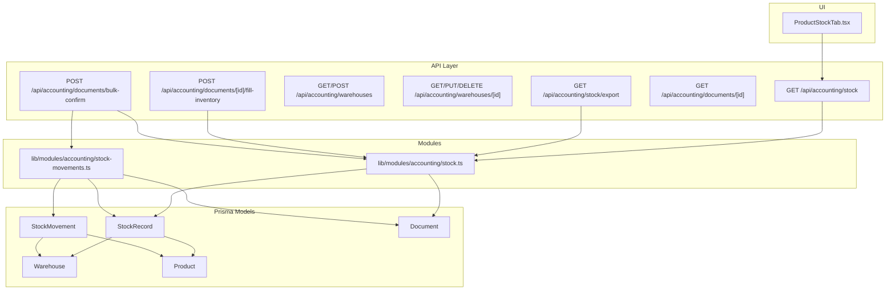
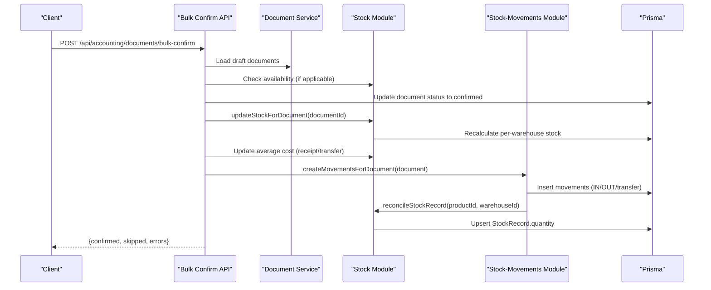
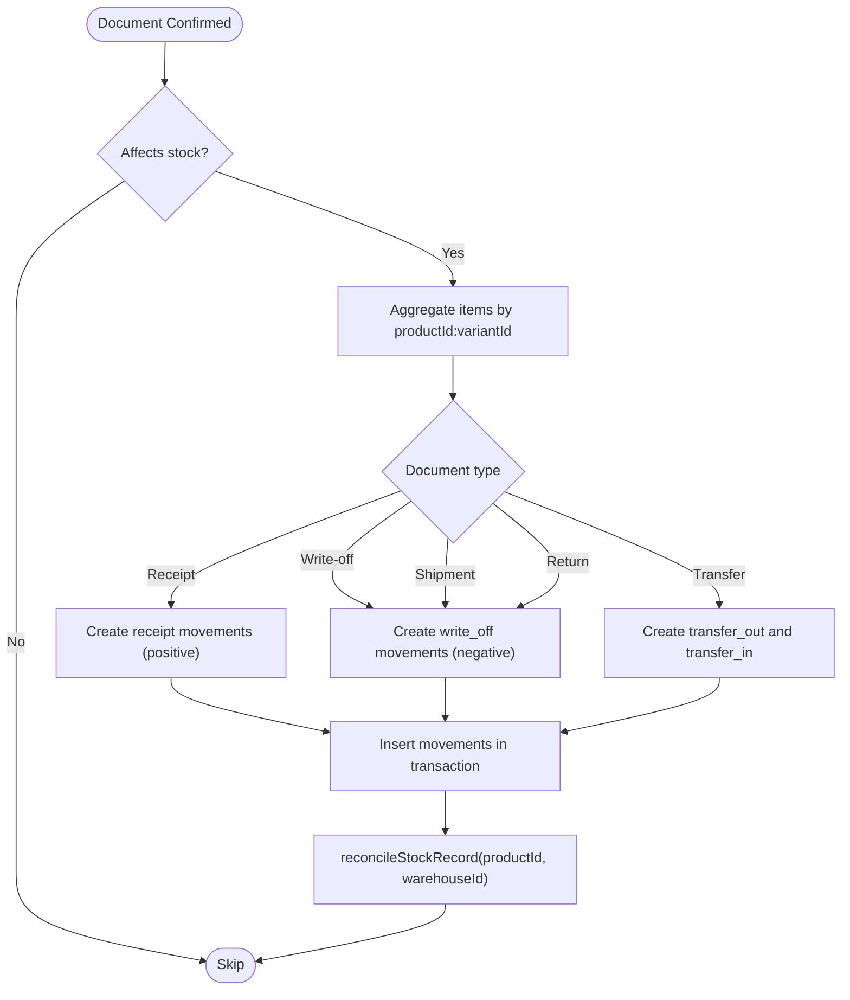
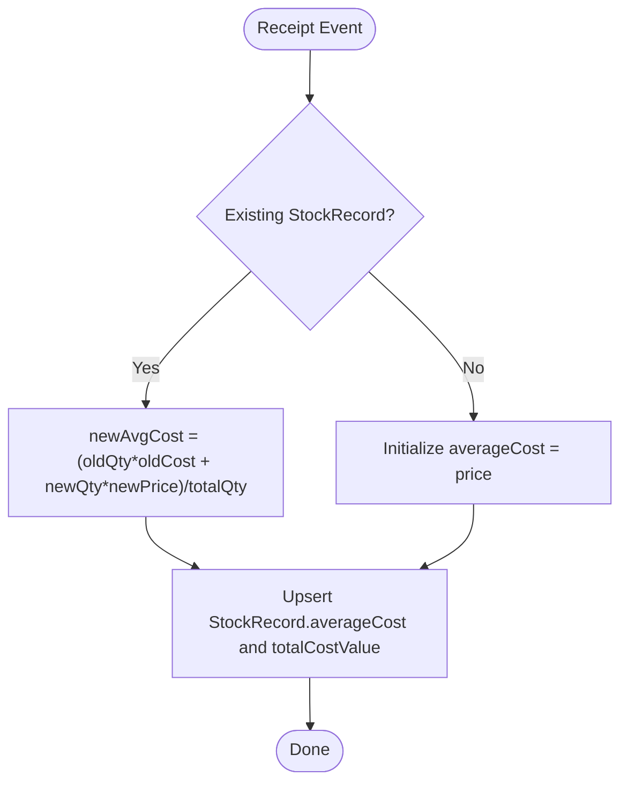
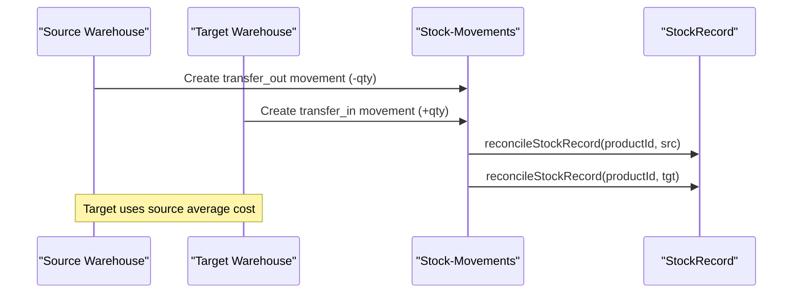
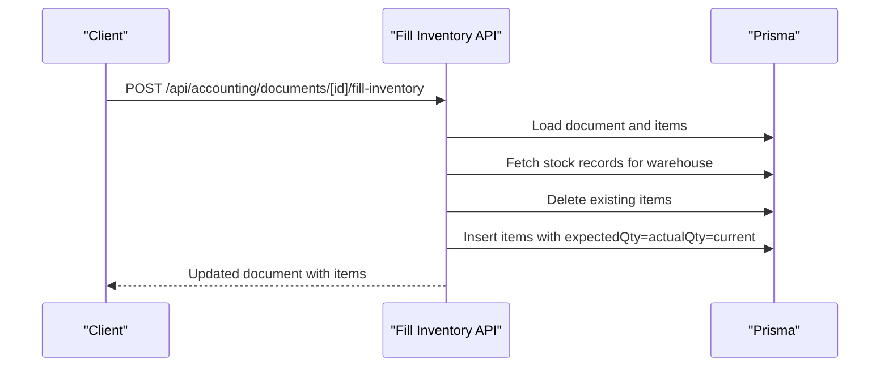
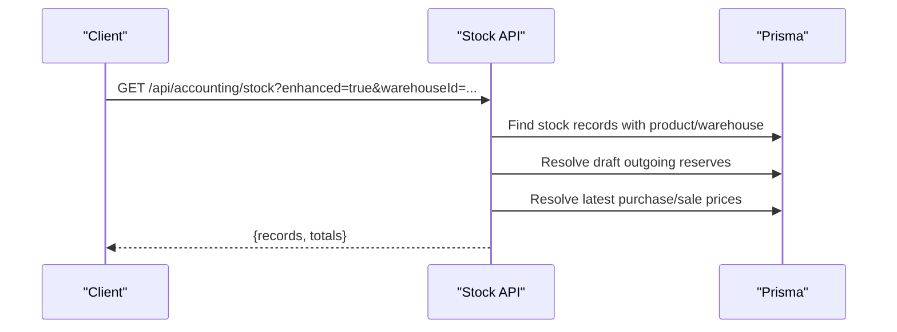
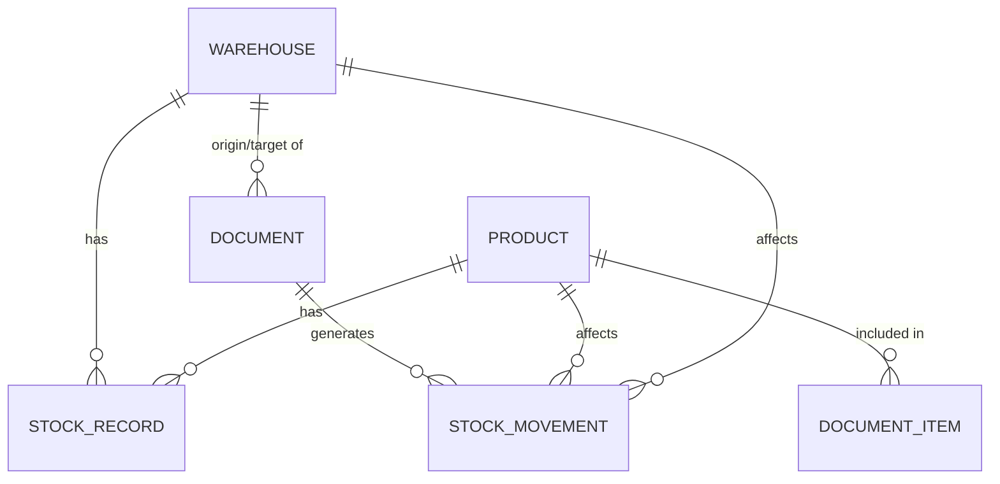

# Stock Management

<cite>
**Referenced Files in This Document**
- [route.ts](file://app/api/accounting/stock/route.ts)
- [route.ts](file://app/api/accounting/stock/export/route.ts)
- [route.ts](file://app/api/accounting/warehouses/route.ts)
- [route.ts](file://app/api/accounting/warehouses/[id]/route.ts)
- [route.ts](file://app/api/accounting/documents/[id]/fill-inventory/route.ts)
- [route.ts](file://app/api/accounting/documents/[id]/route.ts)
- [route.ts](file://app/api/accounting/documents/bulk-confirm/route.ts)
- [stock.ts](file://lib/modules/accounting/stock.ts)
- [stock-movements.ts](file://lib/modules/accounting/stock-movements.ts)
- [reports.schema.ts](file://lib/modules/accounting/schemas/reports.schema.ts)
- [warehouses.schema.ts](file://lib/modules/accounting/schemas/warehouses.schema.ts)
- [schema.prisma](file://prisma/schema.prisma)
- [ProductStockTab.tsx](file://components/accounting/catalog/ProductStockTab.tsx)
- [stock.test.ts](file://tests/integration/documents/stock.test.ts)
- [stock-movements.integration.test.ts](file://tests/integration/documents/stock-movements.integration.test.ts)
- [stock-assertions.ts](file://tests/helpers/stock-assertions.ts)
</cite>

## Table of Contents
1. [Introduction](#introduction)
2. [Project Structure](#project-structure)
3. [Core Components](#core-components)
4. [Architecture Overview](#architecture-overview)
5. [Detailed Component Analysis](#detailed-component-analysis)
6. [Dependency Analysis](#dependency-analysis)
7. [Performance Considerations](#performance-considerations)
8. [Troubleshooting Guide](#troubleshooting-guide)
9. [Conclusion](#conclusion)
10. [Appendices](#appendices)

## Introduction
This document describes the Stock Management system in the ListOpt ERP accounting module. It explains real-time inventory tracking via an immutable stock movement log, average cost calculation using moving average, multi-warehouse support, and integration with document workflows. It also covers stock movement recording, inventory valuation, stock adjustment procedures, reporting, low stock alerts, and batch operations. Examples of reconciliation, valuation calculations, and reporting scenarios are included to guide practical usage.

## Project Structure
The stock management system spans API routes, Prisma schema models, frontend components, and supporting modules:
- API endpoints expose stock queries, exports, warehouse management, and document-related stock operations.
- Prisma models define StockRecord (projection), StockMovement (audit log), and Document relationships.
- Modules implement stock reconciliation, average cost updates, and movement creation/cancellation.
- Frontend components render product stock across warehouses and totals.

**Diagram sources**
- [route.ts:1-192](file://app/api/accounting/stock/route.ts#L1-L192)
- [route.ts:1-69](file://app/api/accounting/stock/export/route.ts#L1-L69)
- [route.ts:1-45](file://app/api/accounting/warehouses/route.ts#L1-L45)
- [route.ts:1-79](file://app/api/accounting/warehouses/[id]/route.ts#L1-L79)
- [route.ts:1-100](file://app/api/accounting/documents/[id]/fill-inventory/route.ts#L1-L100)
- [route.ts:1-166](file://app/api/accounting/documents/[id]/route.ts#L1-L166)
- [route.ts:1-136](file://app/api/accounting/documents/bulk-confirm/route.ts#L1-L136)
- [stock.ts:1-220](file://lib/modules/accounting/stock.ts#L1-L220)
- [stock-movements.ts:1-454](file://lib/modules/accounting/stock-movements.ts#L1-L454)
- [schema.prisma:386-440](file://prisma/schema.prisma#L386-L440)
- [ProductStockTab.tsx:1-160](file://components/accounting/catalog/ProductStockTab.tsx#L1-L160)

**Section sources**
- [route.ts:1-192](file://app/api/accounting/stock/route.ts#L1-L192)
- [route.ts:1-69](file://app/api/accounting/stock/export/route.ts#L1-L69)
- [route.ts:1-45](file://app/api/accounting/warehouses/route.ts#L1-L45)
- [route.ts:1-79](file://app/api/accounting/warehouses/[id]/route.ts#L1-L79)
- [route.ts:1-100](file://app/api/accounting/documents/[id]/fill-inventory/route.ts#L1-L100)
- [route.ts:1-166](file://app/api/accounting/documents/[id]/route.ts#L1-L166)
- [route.ts:1-136](file://app/api/accounting/documents/bulk-confirm/route.ts#L1-L136)
- [stock.ts:1-220](file://lib/modules/accounting/stock.ts#L1-L220)
- [stock-movements.ts:1-454](file://lib/modules/accounting/stock-movements.ts#L1-L454)
- [schema.prisma:386-440](file://prisma/schema.prisma#L386-L440)
- [ProductStockTab.tsx:1-160](file://components/accounting/catalog/ProductStockTab.tsx#L1-L160)

## Core Components
- StockRecord: Projection of current stock per product per warehouse with average cost and total cost value.
- StockMovement: Immutable audit log of all stock changes with movement types and reversal tracking.
- Document integration: Automatic stock updates on document confirmation, with separate handling for inventory adjustments.
- Average cost: Moving average updated on receipts and transfers; valuation computed as quantity × average cost.
- Multi-warehouse: Separate StockRecord entries per warehouse; transfers move stock between warehouses at source average cost.
- Reporting: REST endpoints for stock queries and CSV export; enhanced mode computes reserve, available, cost, and sale values.

**Section sources**
- [schema.prisma:386-440](file://prisma/schema.prisma#L386-L440)
- [stock.ts:1-220](file://lib/modules/accounting/stock.ts#L1-L220)
- [stock-movements.ts:1-454](file://lib/modules/accounting/stock-movements.ts#L1-L454)
- [route.ts:1-192](file://app/api/accounting/stock/route.ts#L1-L192)
- [route.ts:1-69](file://app/api/accounting/stock/export/route.ts#L1-L69)

## Architecture Overview
The system follows an event-sourcing-like pattern:
- StockMovement is the immutable source of truth for stock quantities.
- StockRecord is a lightweight projection updated by reconciling movements.
- Document confirmations trigger movement creation and optional average cost updates.
- Queries serve both legacy and enhanced stock views.

**Diagram sources**
- [route.ts:1-136](file://app/api/accounting/documents/bulk-confirm/route.ts#L1-L136)
- [stock.ts:80-96](file://lib/modules/accounting/stock.ts#L80-L96)
- [stock-movements.ts:197-313](file://lib/modules/accounting/stock-movements.ts#L197-L313)

## Detailed Component Analysis

### Real-time Inventory Tracking via Stock Movements
- StockMovement captures all stock changes with types: receipt, write_off, shipment, return, transfer_out, transfer_in, adjustment.
- Movement creation aggregates document items by product/variant to avoid unique constraint conflicts.
- Idempotency: Movement creation checks for existing movements; cancel creates reversing movements without deleting originals.

**Diagram sources**
- [stock-movements.ts:197-313](file://lib/modules/accounting/stock-movements.ts#L197-L313)
- [stock-movements.ts:440-453](file://lib/modules/accounting/stock-movements.ts#L440-L453)

**Section sources**
- [stock-movements.ts:1-454](file://lib/modules/accounting/stock-movements.ts#L1-L454)
- [schema.prisma:406-440](file://prisma/schema.prisma#L406-L440)

### Average Cost Calculation (Moving Average)
- On receipts (stock_receipt, incoming_shipment, customer_return), average cost updates using:
  newAvgCost = (oldQty × oldCost + newQty × newPrice) / (oldQty + newQty)
- On transfers, target warehouse receives stock at source warehouse’s average cost.
- Total cost value is updated as quantity × average cost after outgoing transactions.

**Diagram sources**
- [stock.ts:143-176](file://lib/modules/accounting/stock.ts#L143-L176)
- [stock.ts:182-196](file://lib/modules/accounting/stock.ts#L182-L196)
- [stock.ts:202-218](file://lib/modules/accounting/stock.ts#L202-L218)

**Section sources**
- [stock.ts:143-196](file://lib/modules/accounting/stock.ts#L143-L196)
- [stock.ts:202-218](file://lib/modules/accounting/stock.ts#L202-L218)

### Multi-warehouse Support and Inter-warehouse Transfers
- Each StockRecord corresponds to a (warehouseId, productId) pair.
- Transfers create two movements: negative for source (transfer_out) and positive for target (transfer_in).
- Average cost for the target follows the source warehouse’s average cost.

**Diagram sources**
- [stock-movements.ts:261-292](file://lib/modules/accounting/stock-movements.ts#L261-L292)
- [stock.ts:182-196](file://lib/modules/accounting/stock.ts#L182-L196)

**Section sources**
- [schema.prisma:386-400](file://prisma/schema.prisma#L386-L400)
- [stock-movements.ts:261-292](file://lib/modules/accounting/stock-movements.ts#L261-L292)
- [stock.ts:182-196](file://lib/modules/accounting/stock.ts#L182-L196)

### Stock Movement Recording and Document Workflows
- Bulk confirm validates stock availability for outgoing and transfer documents, confirms documents, updates stock, and posts journal entries.
- Inventory count documents are filled with current stock data and do not directly affect stock until linked write-off or stock_receipt are created.

**Diagram sources**
- [route.ts:1-100](file://app/api/accounting/documents/[id]/fill-inventory/route.ts#L1-L100)

**Section sources**
- [route.ts:1-136](file://app/api/accounting/documents/bulk-confirm/route.ts#L1-L136)
- [route.ts:1-100](file://app/api/accounting/documents/[id]/fill-inventory/route.ts#L1-L100)

### Inventory Valuation Methods and Stock Adjustment Procedures
- Valuation: costValue = quantity × averageCost; saleValue computed from sale price if available.
- Adjustments: inventory_count documents populate expected vs. actual quantities; adjustments are created via linked documents (write_off or stock_receipt) which generate movements and update stock.

**Section sources**
- [route.ts:134-159](file://app/api/accounting/stock/route.ts#L134-L159)
- [route.ts:58-76](file://app/api/accounting/documents/[id]/fill-inventory/route.ts#L58-L76)

### Reporting, Low Stock Alerts, and Analytics
- REST endpoint supports:
  - Filtering by warehouseId, productId, and search terms.
  - Non-zero filter and enhanced mode computing reserve, available, cost, and sale values.
- Export endpoint generates CSV with product, SKU, category, warehouse, unit, quantity, average cost, and cost value.
- Frontend component renders per-warehouse stock and totals for a selected product.

**Diagram sources**
- [route.ts:7-192](file://app/api/accounting/stock/route.ts#L7-L192)
- [reports.schema.ts:9-16](file://lib/modules/accounting/schemas/reports.schema.ts#L9-L16)

**Section sources**
- [route.ts:1-192](file://app/api/accounting/stock/route.ts#L1-L192)
- [route.ts:1-69](file://app/api/accounting/stock/export/route.ts#L1-L69)
- [ProductStockTab.tsx:1-160](file://components/accounting/catalog/ProductStockTab.tsx#L1-L160)

### API Endpoints for Stock Queries, Export, and Batch Operations
- GET /api/accounting/stock
  - Query parameters: warehouseId, productId, search, nonZero, enhanced.
  - Returns legacy or enhanced stock view with reserve, available, cost, and sale values.
- GET /api/accounting/stock/export
  - Returns CSV of current non-zero stock with average cost and cost value.
- POST /api/accounting/documents/bulk-confirm
  - Confirms up to 100 draft documents, validates stock availability, updates stock, and posts journal entries.
- GET /api/accounting/warehouses
  - Lists warehouses optionally filtered by active flag.
- POST /api/accounting/warehouses
  - Creates a new warehouse.
- GET/PUT/DELETE /api/accounting/warehouses/[id]
  - Retrieves, updates, or deactivates a warehouse.
- POST /api/accounting/documents/[id]/fill-inventory
  - Populates an inventory_count document with current stock data.

**Section sources**
- [route.ts:1-192](file://app/api/accounting/stock/route.ts#L1-L192)
- [route.ts:1-69](file://app/api/accounting/stock/export/route.ts#L1-L69)
- [route.ts:1-136](file://app/api/accounting/documents/bulk-confirm/route.ts#L1-L136)
- [route.ts:1-45](file://app/api/accounting/warehouses/route.ts#L1-L45)
- [route.ts:1-79](file://app/api/accounting/warehouses/[id]/route.ts#L1-L79)
- [route.ts:1-100](file://app/api/accounting/documents/[id]/fill-inventory/route.ts#L1-L100)

## Dependency Analysis
- StockRecord depends on Product and Warehouse.
- StockMovement depends on Document, Product, Warehouse, and optionally ProductVariant.
- Document links to items and warehouses; stock updates occur after confirmation.
- Modules depend on Prisma client for database operations.

**Diagram sources**
- [schema.prisma:369-440](file://prisma/schema.prisma#L369-L440)

**Section sources**
- [schema.prisma:369-440](file://prisma/schema.prisma#L369-L440)

## Performance Considerations
- Movement aggregation prevents duplicate per-product/variant entries, reducing index conflicts.
- Enhanced stock view performs multiple queries for reserves, purchase/sale prices; consider caching or precomputing where appropriate.
- Bulk confirm limits batch size to 100 to maintain responsiveness.
- Reconciliation recomputes stock from movements; ensure indexes on productId, warehouseId, and createdAt are effective.

## Troubleshooting Guide
Common issues and resolutions:
- Missing warehouse on stock-affecting documents: Movement creation throws an error if warehouseId is absent.
- Duplicate confirm attempts: Movement creation is idempotent; existing movements are not recreated.
- Cancel without reversing movements: Reversing movements are created only if none exist; verify original movements before cancel.
- Stock discrepancies: Use reconciliation to align StockRecord with movements; verify movement types and quantities.

Validation and assertion utilities:
- Tests assert that StockRecord quantity matches the sum of movements and that reversing movements negate original quantities.
- Tests validate idempotency of confirm and cancel operations.

**Section sources**
- [stock-movements.ts:217-219](file://lib/modules/accounting/stock-movements.ts#L217-L219)
- [stock-movements.ts:323-328](file://lib/modules/accounting/stock-movements.ts#L323-L328)
- [stock-movements.ts:440-453](file://lib/modules/accounting/stock-movements.ts#L440-L453)
- [stock-assertions.ts:1-125](file://tests/helpers/stock-assertions.ts#L1-L125)
- [stock-movements.integration.test.ts:84-216](file://tests/integration/documents/stock-movements.integration.test.ts#L84-L216)

## Conclusion
The Stock Management system leverages an immutable movement log as the source of truth, ensuring accurate and auditable stock tracking. Average cost is maintained via moving average updates on receipts and transfers. Multi-warehouse support is first-class, with explicit transfer handling and cost propagation. Document workflows integrate seamlessly with stock updates, while robust APIs enable querying, exporting, and batch operations. Reporting and valuation are straightforward, and reconciliation utilities help maintain data integrity.

## Appendices

### Example Scenarios

- Stock Reconciliation
  - Trigger reconciliation for a product in a specific warehouse to compute quantity from movements and upsert StockRecord.
  - Verify that StockRecord.quantity equals the sum of movements.

- Average Cost Valuation
  - After a receipt: new average cost = (oldQty × oldCost + newQty × newPrice) / (oldQty + newQty).
  - After a transfer: target warehouse adopts source warehouse’s average cost.

- Reporting Scenario
  - Use enhanced stock endpoint to compute reserve (draft outgoing), available (quantity − reserve), cost value, and sale value per product per warehouse.

- Low Stock Alerts
  - Use bulk confirm to validate availability for outgoing/transfer documents; skipped documents indicate shortages.

**Section sources**
- [stock-movements.ts:440-453](file://lib/modules/accounting/stock-movements.ts#L440-L453)
- [stock.ts:143-196](file://lib/modules/accounting/stock.ts#L143-L196)
- [route.ts:134-159](file://app/api/accounting/stock/route.ts#L134-L159)
- [route.ts:52-74](file://app/api/accounting/documents/bulk-confirm/route.ts#L52-L74)