# Architecture Overview

<cite>
**Referenced Files in This Document**
- [ARCHITECTURE.md](file://ARCHITECTURE.md)
- [package.json](file://package.json)
- [next.config.ts](file://next.config.ts)
- [middleware.ts](file://middleware.ts)
- [prisma/schema.prisma](file://prisma/schema.prisma)
- [app/layout.tsx](file://app/layout.tsx)
- [lib/index.ts](file://lib/index.ts)
- [lib/shared/index.ts](file://lib/shared/index.ts)
- [components/app-sidebar.tsx](file://components/app-sidebar.tsx)
- [components/page-header.tsx](file://components/page-header.tsx)
- [lib/modules/accounting/index.ts](file://lib/modules/accounting/index.ts)
- [lib/modules/accounting/documents.ts](file://lib/modules/accounting/documents.ts)
- [app/api/accounting/documents/route.ts](file://app/api/accounting/documents/route.ts)
- [lib/shared/auth.ts](file://lib/shared/auth.ts)
- [lib/shared/authorization.ts](file://lib/shared/authorization.ts)
- [components/ui/data-grid/data-grid.tsx](file://components/ui/data-grid/data-grid.tsx)
- [components/accounting/DocumentsTable.tsx](file://components/accounting/DocumentsTable.tsx)
- [components/accounting/ProductsTable.tsx](file://components/accounting/ProductsTable.tsx)
- [lib/modules/accounting/schemas/documents.schema.ts](file://lib/modules/accounting/schemas/documents.schema.ts)
</cite>

## Table of Contents
1. [Introduction](#introduction)
2. [Project Structure](#project-structure)
3. [Core Components](#core-components)
4. [Architecture Overview](#architecture-overview)
5. [Detailed Component Analysis](#detailed-component-analysis)
6. [Dependency Analysis](#dependency-analysis)
7. [Performance Considerations](#performance-considerations)
8. [Troubleshooting Guide](#troubleshooting-guide)
9. [Conclusion](#conclusion)
10. [Appendices](#appendices)

## Introduction
This document describes the architecture of ListOpt ERP, a Next.js-based enterprise resource planning system for wholesale trading. It focuses on high-level design patterns, layered architecture, modular boundaries across accounting, finance, and e-commerce, and the integration of TypeScript, Prisma ORM, and React components. Cross-cutting concerns such as authentication, authorization, middleware processing, and error handling are documented alongside extensibility and integration points.

## Project Structure
The system follows Next.js App Router conventions with route groups for modules and a strict separation between presentation, business logic, and data access layers. The repository is organized as:
- app/: Next.js App Router pages and API routes grouped by domain (accounting, finance, ecommerce)
- components/: UI primitives and module-specific components
- lib/: shared utilities, typed Prisma client, and module business logic
- prisma/: database schema and migrations
- tests/: unit, integration, and e2e tests

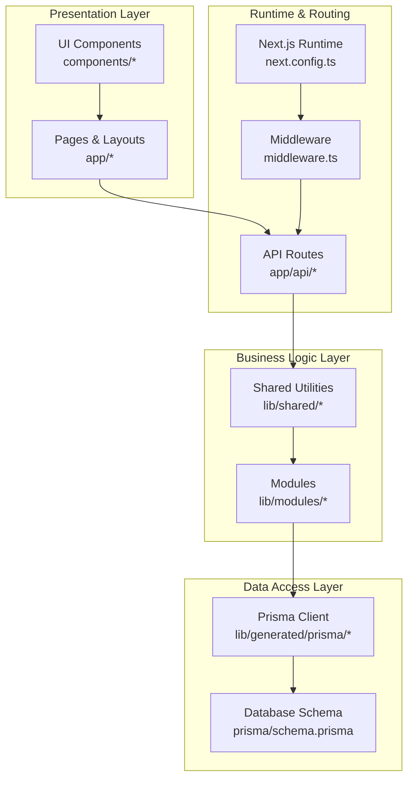

**Diagram sources**
- [next.config.ts:1-29](file://next.config.ts#L1-L29)
- [middleware.ts:1-156](file://middleware.ts#L1-L156)
- [lib/shared/index.ts:1-9](file://lib/shared/index.ts#L1-L9)
- [lib/index.ts:1-6](file://lib/index.ts#L1-L6)
- [prisma/schema.prisma:1-120](file://prisma/schema.prisma#L1-L120)

**Section sources**
- [ARCHITECTURE.md:3-77](file://ARCHITECTURE.md#L3-L77)
- [package.json:1-79](file://package.json#L1-L79)

## Core Components
- Presentation layer: Next.js App Router pages, route groups, and React components (UI primitives and domain-specific components).
- Business logic layer: Module-specific libraries under lib/modules with barrel exports and shared utilities under lib/shared.
- Data access layer: Prisma client generation and schema modeling for both ERP and e-commerce domains.
- Cross-cutting services: Middleware for routing, authentication, CSRF protection, rate limiting, and logging.

Key implementation patterns:
- Modular exports via barrel files for easy consumption across pages and API routes.
- Strong typing with Zod schemas for API request/response validation.
- Centralized Prisma client access through a shared module to enforce consistency.

**Section sources**
- [lib/index.ts:1-6](file://lib/index.ts#L1-L6)
- [lib/shared/index.ts:1-9](file://lib/shared/index.ts#L1-L9)
- [lib/modules/accounting/index.ts:1-8](file://lib/modules/accounting/index.ts#L1-L8)
- [lib/modules/accounting/schemas/documents.schema.ts:1-55](file://lib/modules/accounting/schemas/documents.schema.ts#L1-L55)

## Architecture Overview
The system employs a layered architecture:
- Presentation: Next.js App Router pages and route groups, with shared UI components and module-specific layouts.
- Business: Domain modules encapsulate business rules and orchestration logic.
- Data: Prisma ORM provides strongly-typed database access with centralized client initialization.

Authentication and authorization are enforced centrally via middleware and shared authorization utilities. API routes validate requests using Zod schemas and delegate to module business logic, which interacts with the database through the shared Prisma client.

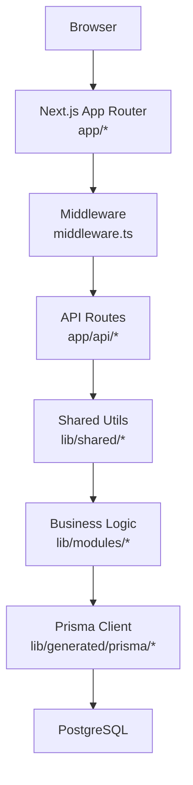

**Diagram sources**
- [middleware.ts:45-151](file://middleware.ts#L45-L151)
- [app/api/accounting/documents/route.ts:1-136](file://app/api/accounting/documents/route.ts#L1-L136)
- [lib/shared/auth.ts:1-89](file://lib/shared/auth.ts#L1-L89)
- [lib/shared/authorization.ts:1-160](file://lib/shared/authorization.ts#L1-L160)
- [prisma/schema.prisma:1-120](file://prisma/schema.prisma#L1-L120)

## Detailed Component Analysis

### Next.js App Router and Route Groups
- Route groups define module boundaries: (accounting), (finance), and (ecommerce).
- Pages are organized by domain with nested routes for entities (e.g., catalog, stock, purchases, sales, finance, ecommerce).
- Root layout applies global fonts and notifications; module-specific layouts can be added as needed.

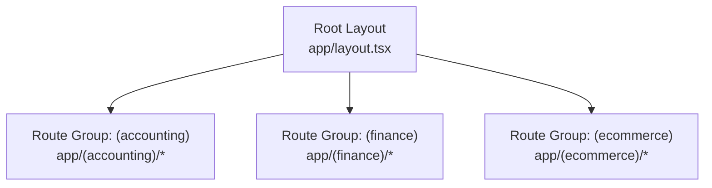

**Diagram sources**
- [app/layout.tsx:1-37](file://app/layout.tsx#L1-L37)

**Section sources**
- [ARCHITECTURE.md:7-41](file://ARCHITECTURE.md#L7-L41)

### Middleware Processing and Security
- Middleware enforces authentication and authorization for ERP routes, public routes, and e-commerce storefront endpoints.
- CSRF protection is applied to API routes based on method and exemption rules.
- Rate limiting and request tracing via request IDs are integrated.
- Redirects support legacy routes to new locations.

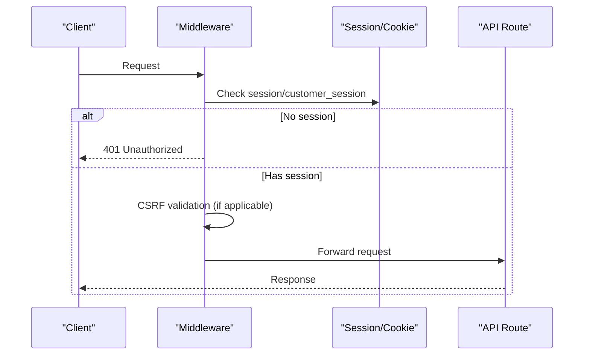

**Diagram sources**
- [middleware.ts:45-151](file://middleware.ts#L45-L151)

**Section sources**
- [middleware.ts:1-156](file://middleware.ts#L1-L156)

### Authentication and Authorization
- Session management uses signed tokens with expiration and HMAC verification.
- Authorization leverages role-based permissions with hierarchical checks.
- API routes require permissions before processing requests.

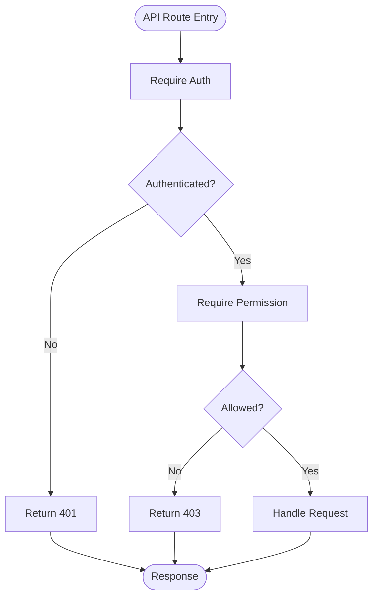

**Diagram sources**
- [lib/shared/auth.ts:62-83](file://lib/shared/auth.ts#L62-L83)
- [lib/shared/authorization.ts:105-135](file://lib/shared/authorization.ts#L105-L135)

**Section sources**
- [lib/shared/auth.ts:1-89](file://lib/shared/auth.ts#L1-89)
- [lib/shared/authorization.ts:1-160](file://lib/shared/authorization.ts#L1-160)

### API Route Pattern and Validation
- Standard CRUD endpoints follow REST-like conventions with pagination and filtering.
- Action endpoints (e.g., confirm/cancel) are supported.
- Request bodies and query parameters are validated with Zod schemas.

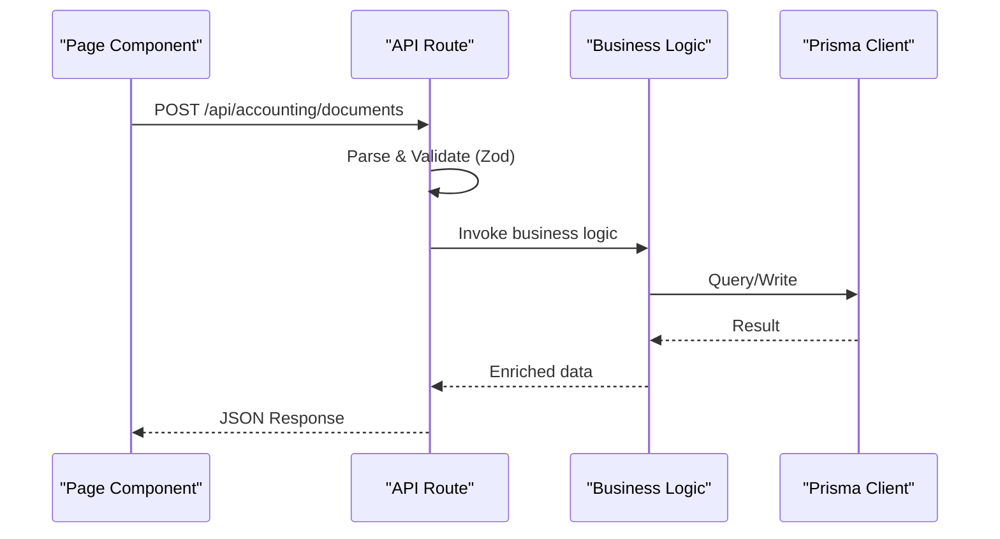

**Diagram sources**
- [app/api/accounting/documents/route.ts:63-135](file://app/api/accounting/documents/route.ts#L63-L135)
- [lib/modules/accounting/documents.ts:70-78](file://lib/modules/accounting/documents.ts#L70-L78)
- [lib/modules/accounting/schemas/documents.schema.ts:11-55](file://lib/modules/accounting/schemas/documents.schema.ts#L11-L55)

**Section sources**
- [ARCHITECTURE.md:161-190](file://ARCHITECTURE.md#L161-L190)
- [app/api/accounting/documents/route.ts:1-136](file://app/api/accounting/documents/route.ts#L1-L136)
- [lib/modules/accounting/schemas/documents.schema.ts:1-55](file://lib/modules/accounting/schemas/documents.schema.ts#L1-L55)

### Data Grid and Table Components
- DataGrid provides a reusable table with sorting, resizing, column visibility, pagination, and selection.
- Domain-specific tables (DocumentsTable, ProductsTable) integrate with API endpoints and expose actions (confirm, archive, export, etc.).

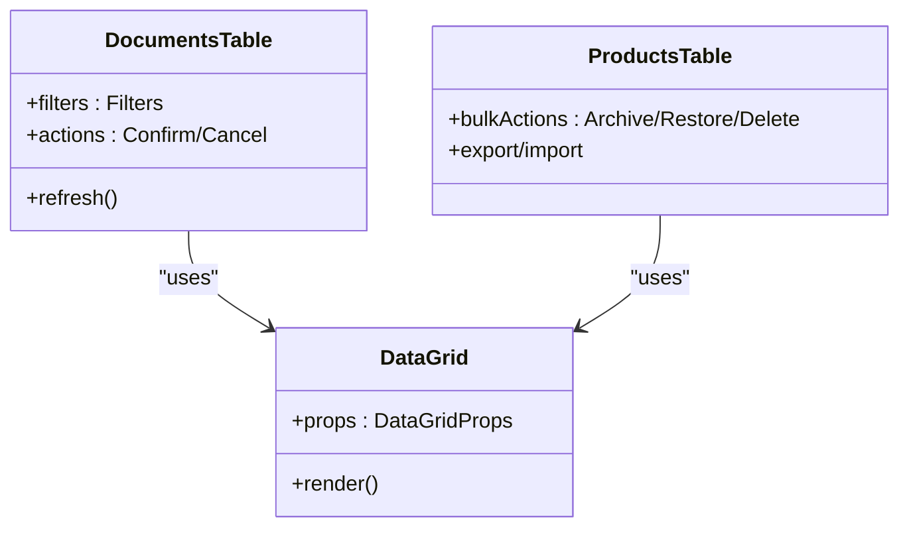

**Diagram sources**
- [components/ui/data-grid/data-grid.tsx:1-370](file://components/ui/data-grid/data-grid.tsx#L1-L370)
- [components/accounting/DocumentsTable.tsx:1-361](file://components/accounting/DocumentsTable.tsx#L1-L361)
- [components/accounting/ProductsTable.tsx:1-495](file://components/accounting/ProductsTable.tsx#L1-L495)

**Section sources**
- [components/ui/data-grid/data-grid.tsx:1-370](file://components/ui/data-grid/data-grid.tsx#L1-L370)
- [components/accounting/DocumentsTable.tsx:1-361](file://components/accounting/DocumentsTable.tsx#L1-L361)
- [components/accounting/ProductsTable.tsx:1-495](file://components/accounting/ProductsTable.tsx#L1-L495)

### Sidebar Navigation and Module Switching
- AppSidebar defines module navigation and supports switching between accounting, finance, and ecommerce modules.
- Navigation items are grouped per module and reflect current path.

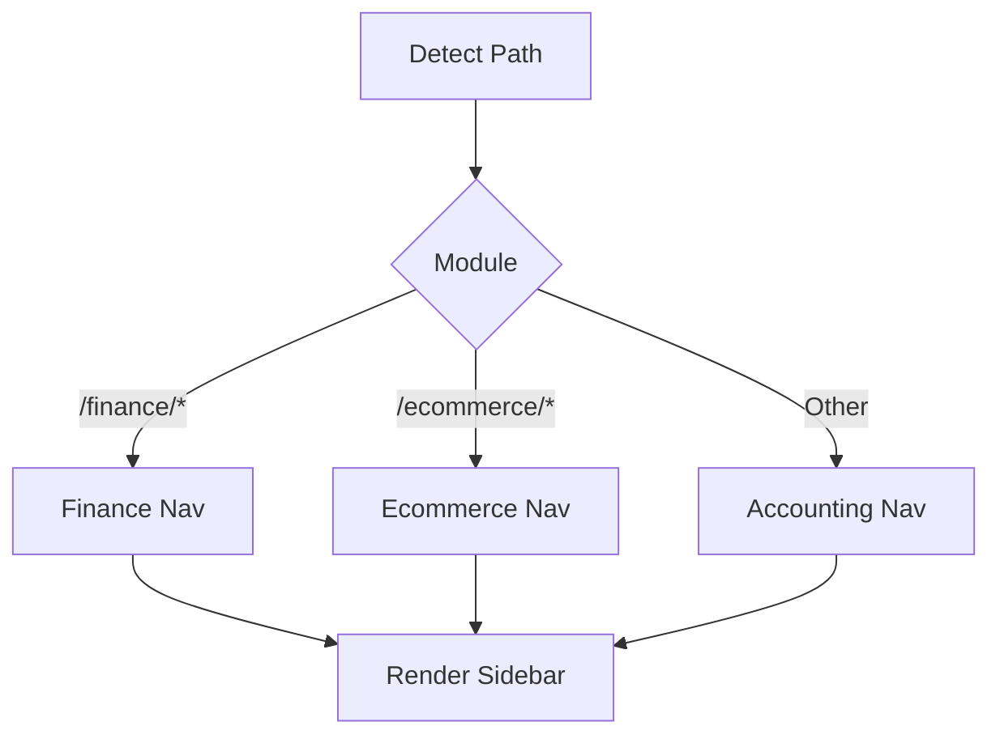

**Diagram sources**
- [components/app-sidebar.tsx:96-114](file://components/app-sidebar.tsx#L96-L114)
- [components/app-sidebar.tsx:50-75](file://components/app-sidebar.tsx#L50-L75)

**Section sources**
- [components/app-sidebar.tsx:1-317](file://components/app-sidebar.tsx#L1-L317)

### Database Model and Integration
- Prisma schema models ERP and e-commerce entities, including documents, counterparties, products, variants, stock movements, and customer orders.
- The schema supports enums for document types, statuses, and e-commerce order/payment states.
- Generated Prisma client is used consistently across business logic and API routes.

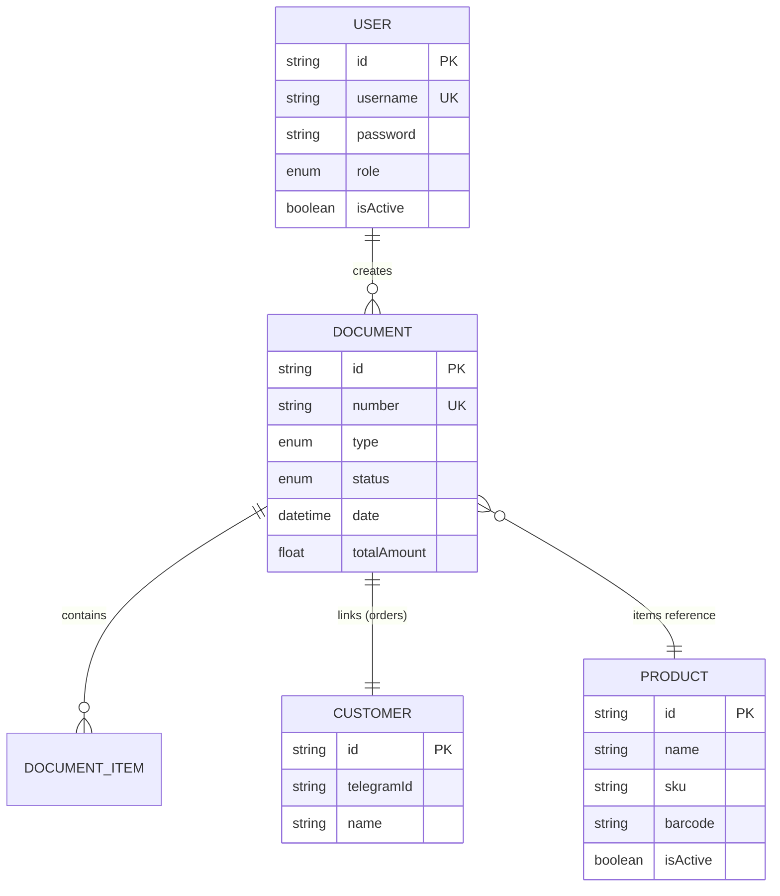

**Diagram sources**
- [prisma/schema.prisma:21-32](file://prisma/schema.prisma#L21-L32)
- [prisma/schema.prisma:449-513](file://prisma/schema.prisma#L449-L513)
- [prisma/schema.prisma:108-166](file://prisma/schema.prisma#L108-L166)
- [prisma/schema.prisma:625-652](file://prisma/schema.prisma#L625-L652)

**Section sources**
- [prisma/schema.prisma:1-120](file://prisma/schema.prisma#L1-L120)

## Dependency Analysis
- Presentation depends on business logic via barrel exports and shared utilities.
- Business logic depends on shared utilities and Prisma client.
- API routes depend on shared authorization and validation utilities and call module functions.
- Middleware orchestrates routing, authentication, and CSRF protection.

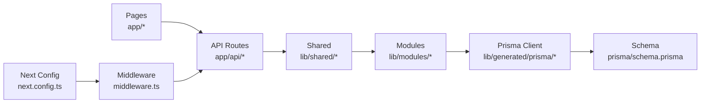

**Diagram sources**
- [lib/index.ts:1-6](file://lib/index.ts#L1-L6)
- [lib/shared/index.ts:1-9](file://lib/shared/index.ts#L1-L9)
- [app/api/accounting/documents/route.ts:1-136](file://app/api/accounting/documents/route.ts#L1-L136)
- [middleware.ts:45-151](file://middleware.ts#L45-L151)
- [next.config.ts:1-29](file://next.config.ts#L1-L29)

**Section sources**
- [lib/index.ts:1-6](file://lib/index.ts#L1-L6)
- [lib/shared/index.ts:1-9](file://lib/shared/index.ts#L1-L9)

## Performance Considerations
- Prefer server-side pagination and filtering in API routes to reduce payload sizes.
- Use column visibility and sizing persistence to minimize re-renders.
- Leverage debounced persistence for column sizing to avoid excessive writes.
- Apply appropriate indexes in Prisma schema to optimize frequent queries.

## Troubleshooting Guide
Common issues and resolutions:
- Authentication failures: Verify SESSION_SECRET and session cookie presence; ensure middleware allows public routes where intended.
- Authorization errors: Confirm user role and required permissions; check permission mapping and role hierarchy.
- CSRF validation failures: Ensure CSRF protection is configured and tokens are present for protected methods.
- Database connectivity: Confirm DATABASE_URL and Prisma client initialization; verify migrations are applied.

**Section sources**
- [middleware.ts:119-143](file://middleware.ts#L119-L143)
- [lib/shared/authorization.ts:137-160](file://lib/shared/authorization.ts#L137-L160)
- [lib/shared/auth.ts:5-11](file://lib/shared/auth.ts#L5-L11)

## Conclusion
ListOpt ERP adopts a clean, modular architecture with clear separation of concerns. The Next.js App Router enables scalable domain organization, while shared utilities and Prisma provide consistent business logic and data access. Middleware centralizes security and routing policies, and React components deliver a responsive, accessible user experience. The design supports extensibility through module addition patterns and maintains strong typing and validation across the stack.

## Appendices

### System Context Diagram
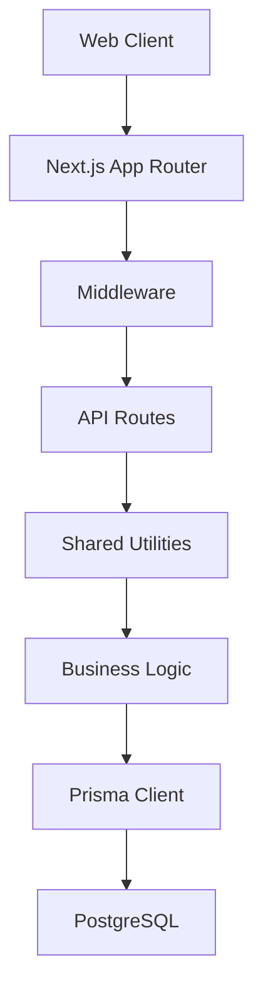

**Diagram sources**
- [middleware.ts:45-151](file://middleware.ts#L45-L151)
- [app/api/accounting/documents/route.ts:1-136](file://app/api/accounting/documents/route.ts#L1-L136)
- [lib/shared/index.ts:1-9](file://lib/shared/index.ts#L1-L9)
- [prisma/schema.prisma:1-120](file://prisma/schema.prisma#L1-L120)