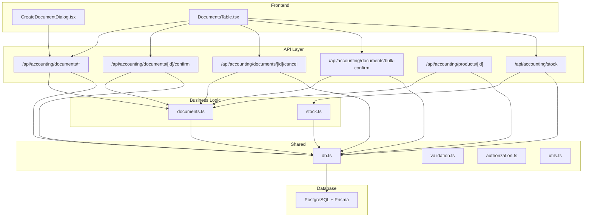
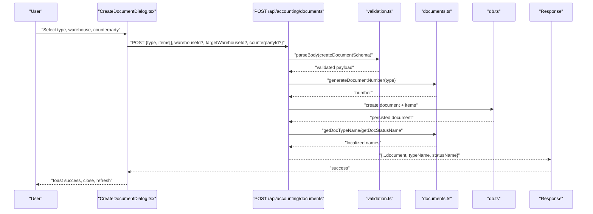
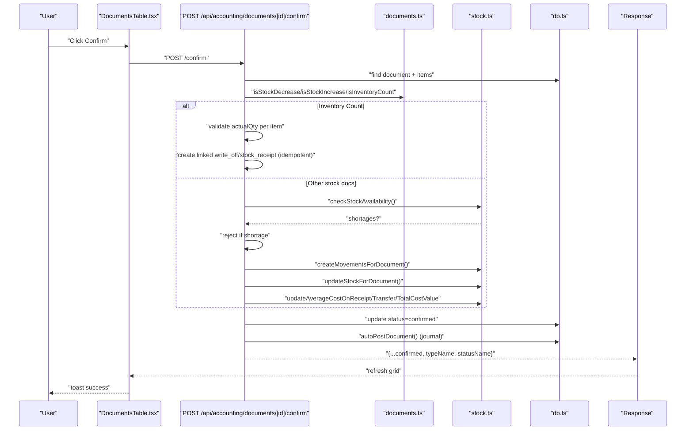
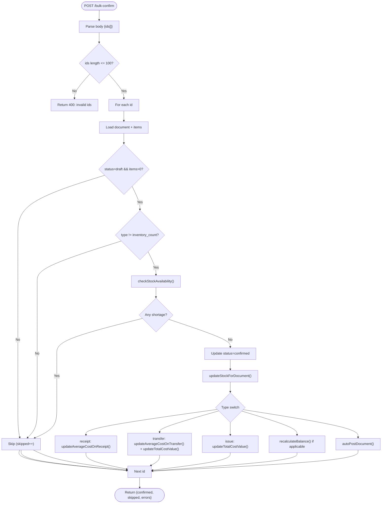
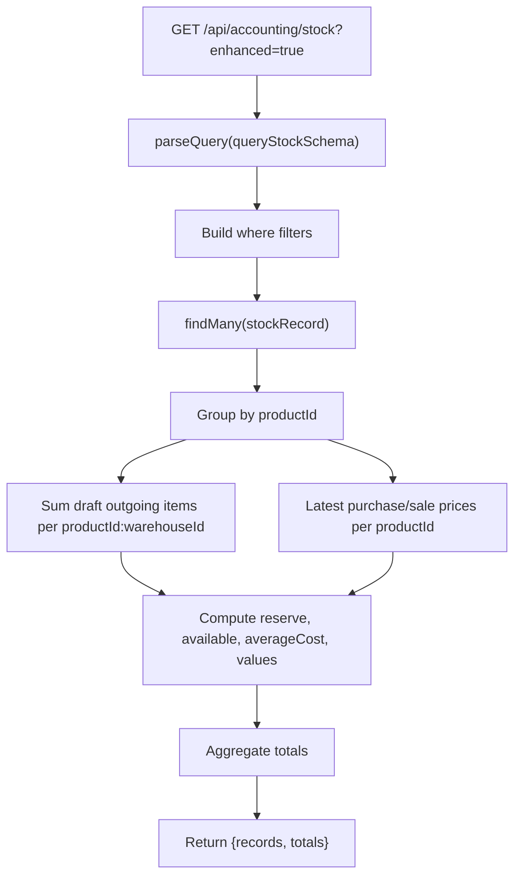
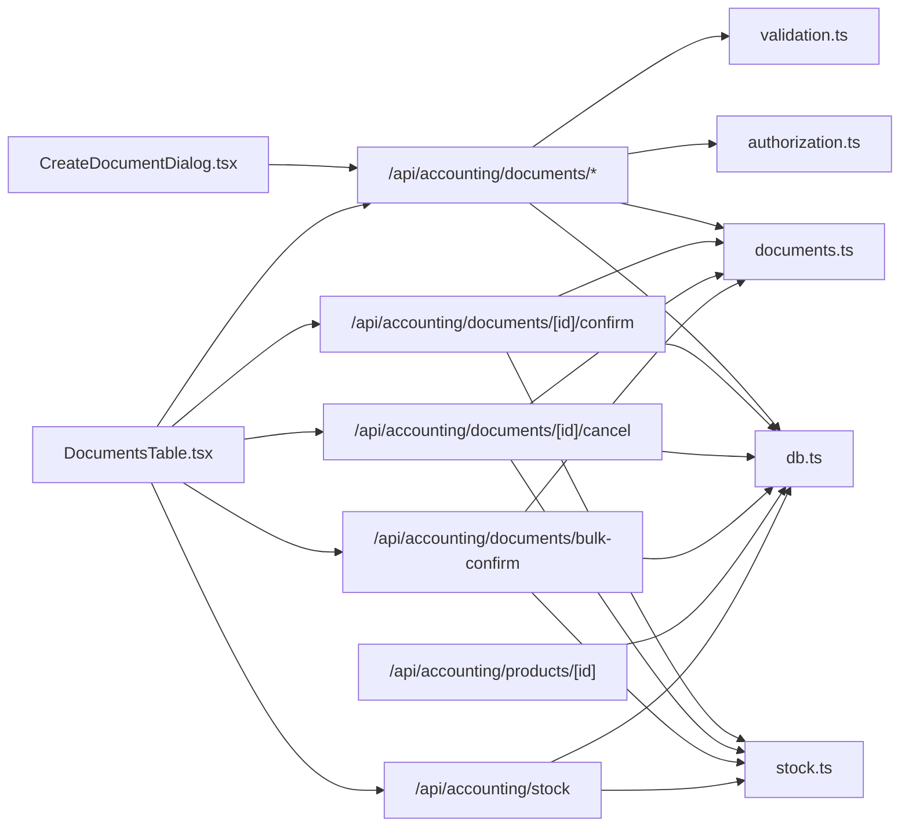

# Data Flow Architecture

<cite>
**Referenced Files in This Document**
- [README.md](file://README.md)
- [ARCHITECTURE.md](file://ARCHITECTURE.md)
- [db.ts](file://lib/shared/db.ts)
- [validation.ts](file://lib/shared/validation.ts)
- [authorization.ts](file://lib/shared/authorization.ts)
- [utils.ts](file://lib/shared/utils.ts)
- [documents.ts](file://lib/modules/accounting/documents.ts)
- [stock.ts](file://lib/modules/accounting/stock.ts)
- [documents.schema.ts](file://lib/modules/accounting/schemas/documents.schema.ts)
- [products.schema.ts](file://lib/modules/accounting/schemas/products.schema.ts)
- [route.ts](file://app/api/accounting/documents/route.ts)
- [route.ts](file://app/api/accounting/documents/[id]/route.ts)
- [route.ts](file://app/api/accounting/documents/[id]/confirm/route.ts)
- [route.ts](file://app/api/accounting/documents/[id]/cancel/route.ts)
- [route.ts](file://app/api/accounting/documents/bulk-confirm/route.ts)
- [route.ts](file://app/api/accounting/products/[id]/route.ts)
- [route.ts](file://app/api/accounting/stock/route.ts)
- [CreateDocumentDialog.tsx](file://components/accounting/CreateDocumentDialog.tsx)
- [DocumentsTable.tsx](file://components/accounting/DocumentsTable.tsx)
</cite>

## Table of Contents
1. [Introduction](#introduction)
2. [Project Structure](#project-structure)
3. [Core Components](#core-components)
4. [Architecture Overview](#architecture-overview)
5. [Detailed Component Analysis](#detailed-component-analysis)
6. [Dependency Analysis](#dependency-analysis)
7. [Performance Considerations](#performance-considerations)
8. [Troubleshooting Guide](#troubleshooting-guide)
9. [Conclusion](#conclusion)

## Introduction
This document describes the data flow architecture of ListOpt ERP, covering the end-to-end journey from the user interface to API routes, business logic, and database operations. It explains RESTful request/response patterns, data transformation pipelines, state management using React hooks and UI components, validation and sanitization, error handling and data consistency mechanisms, and caching/performance strategies.

## Project Structure
ListOpt ERP follows a layered architecture:
- Frontend (Next.js App Router): UI components and pages under app/ and components/.
- Backend (Next.js API Routes): Route handlers under app/api/ implementing REST endpoints.
- Business Logic: Pure functions under lib/modules/accounting/ and supporting modules.
- Shared Utilities: Validation, authorization, database access, formatting helpers under lib/shared/.
- Database: PostgreSQL via Prisma ORM.

**Diagram sources**
- [CreateDocumentDialog.tsx:116-136](file://components/accounting/CreateDocumentDialog.tsx#L116-L136)
- [DocumentsTable.tsx:80-104](file://components/accounting/DocumentsTable.tsx#L80-L104)
- [route.ts:1-136](file://app/api/accounting/documents/route.ts#L1-L136)
- [route.ts:178-420](file://app/api/accounting/documents/[id]/confirm/route.ts#L178-L420)
- [route.ts:12-81](file://app/api/accounting/documents/[id]/cancel/route.ts#L12-L81)
- [route.ts:15-136](file://app/api/accounting/documents/bulk-confirm/route.ts#L15-L136)
- [route.ts:9-119](file://app/api/accounting/products/[id]/route.ts#L9-L119)
- [route.ts:7-192](file://app/api/accounting/stock/route.ts#L7-L192)
- [documents.ts:1-144](file://lib/modules/accounting/documents.ts#L1-L144)
- [stock.ts:1-220](file://lib/modules/accounting/stock.ts#L1-L220)
- [db.ts:1-25](file://lib/shared/db.ts#L1-L25)

**Section sources**
- [README.md:14-21](file://README.md#L14-L21)
- [ARCHITECTURE.md:1-77](file://ARCHITECTURE.md#L1-L77)

## Core Components
- API Routes: Implement REST endpoints for CRUD and actions (confirm, cancel, bulk confirm). They validate inputs, enforce permissions, orchestrate business logic, and return normalized responses.
- Business Logic: Functions for document lifecycle, stock calculations, and financial impact handling.
- Shared Utilities: Validation (Zod), authorization (RBAC), database client, formatting helpers.
- UI Components: React components using hooks for data fetching/pagination and state updates.

Key responsibilities:
- Validation and sanitization via Zod schemas and parsers.
- Authorization checks per endpoint and permission scopes.
- Data transformation: enriching DB records with localized names and computed fields.
- Error handling: structured validation errors and authorization failures.
- Consistency: transactions for idempotent operations and movement creation.

**Section sources**
- [ARCHITECTURE.md:161-220](file://ARCHITECTURE.md#L161-L220)
- [validation.ts:1-63](file://lib/shared/validation.ts#L1-L63)
- [authorization.ts:1-160](file://lib/shared/authorization.ts#L1-L160)
- [db.ts:1-25](file://lib/shared/db.ts#L1-L25)

## Architecture Overview
The system adheres to RESTful conventions:
- GET /api/accounting/documents — list with pagination and filters.
- POST /api/accounting/documents — create document with items.
- GET/PUT/DELETE /api/accounting/documents/[id] — single document operations.
- POST /api/accounting/documents/[id]/confirm — confirm document with stock/balance effects.
- POST /api/accounting/documents/[id]/cancel — cancel document with reverses.
- POST /api/accounting/documents/bulk-confirm — batch confirm with per-item checks.
- GET /api/accounting/products/[id] — product detail with pricing and variants.
- GET /api/accounting/stock — stock balances with optional enhanced mode.

Responses:
- List: { data, total, page, limit }.
- Item: entity with localized fields (typeName, statusName).
- Errors: { error, fields? }.

**Section sources**
- [ARCHITECTURE.md:161-191](file://ARCHITECTURE.md#L161-L191)
- [route.ts:8-61](file://app/api/accounting/documents/route.ts#L8-L61)
- [route.ts:10-55](file://app/api/accounting/documents/[id]/route.ts#L10-L55)
- [route.ts:9-43](file://app/api/accounting/products/[id]/route.ts#L9-L43)
- [route.ts:7-65](file://app/api/accounting/stock/route.ts#L7-L65)

## Detailed Component Analysis

### Document Creation Flow
End-to-end flow for creating a document via UI to backend and persistence.

**Diagram sources**
- [CreateDocumentDialog.tsx:99-142](file://components/accounting/CreateDocumentDialog.tsx#L99-L142)
- [route.ts:63-135](file://app/api/accounting/documents/route.ts#L63-L135)
- [documents.schema.ts:11-28](file://lib/modules/accounting/schemas/documents.schema.ts#L11-L28)
- [documents.ts:70-78](file://lib/modules/accounting/documents.ts#L70-L78)
- [validation.ts:14-30](file://lib/shared/validation.ts#L14-L30)

**Section sources**
- [CreateDocumentDialog.tsx:99-142](file://components/accounting/CreateDocumentDialog.tsx#L99-L142)
- [route.ts:63-135](file://app/api/accounting/documents/route.ts#L63-L135)
- [documents.schema.ts:11-28](file://lib/modules/accounting/schemas/documents.schema.ts#L11-L28)
- [documents.ts:70-78](file://lib/modules/accounting/documents.ts#L70-L78)

### Document Confirmation Flow
Confirms a draft document, validates stock availability, applies stock movements, updates averages, recalculates balances, and posts to the journal.

**Diagram sources**
- [DocumentsTable.tsx:138-151](file://components/accounting/DocumentsTable.tsx#L138-L151)
- [route.ts:178-420](file://app/api/accounting/documents/[id]/confirm/route.ts#L178-L420)
- [documents.ts:90-143](file://lib/modules/accounting/documents.ts#L90-L143)
- [stock.ts:98-120](file://lib/modules/accounting/stock.ts#L98-L120)
- [stock.ts:306-354](file://lib/modules/accounting/stock.ts#L306-L354)

**Section sources**
- [DocumentsTable.tsx:138-151](file://components/accounting/DocumentsTable.tsx#L138-L151)
- [route.ts:178-420](file://app/api/accounting/documents/[id]/confirm/route.ts#L178-L420)
- [stock.ts:98-120](file://lib/modules/accounting/stock.ts#L98-L120)

### Bulk Confirmation Flow
Batch confirms multiple documents with per-document validation and idempotent stock updates.

**Diagram sources**
- [route.ts:15-136](file://app/api/accounting/documents/bulk-confirm/route.ts#L15-L136)
- [stock.ts:306-354](file://lib/modules/accounting/stock.ts#L306-L354)

**Section sources**
- [route.ts:15-136](file://app/api/accounting/documents/bulk-confirm/route.ts#L15-L136)

### Stock Report Enhancement Pipeline
The stock endpoint supports legacy and enhanced modes, computing reserve, available, cost, and sale values.

**Diagram sources**
- [route.ts:7-192](file://app/api/accounting/stock/route.ts#L7-L192)

**Section sources**
- [route.ts:7-192](file://app/api/accounting/stock/route.ts#L7-L192)

### Data Transformation Pipeline
- API routes enrich DB entities with localized names and computed fields.
- Validation transforms request bodies into typed data using Zod schemas.
- Business logic computes derived values (e.g., moving average cost, reserve/available).
- UI components format amounts, dates, and render badges.

**Section sources**
- [route.ts:37-49](file://app/api/accounting/documents/[id]/route.ts#L37-L49)
- [route.ts:134-159](file://app/api/accounting/stock/route.ts#L134-L159)
- [utils.ts:8-39](file://lib/shared/utils.ts#L8-L39)

### State Management Approach
React components manage local state with hooks:
- CreateDocumentDialog: form state (type, warehouse, target, counterparty) and submission state.
- DocumentsTable: grid state (filters, sorting, pagination), selection, and mutation refresh.
- useDataGrid hook orchestrates endpoint-driven data fetching, search, and persistence of grid preferences.

UI-to-API interactions:
- Dialog submits to POST /api/accounting/documents.
- Table fetches from GET /api/accounting/documents, triggers POST /confirm, POST /cancel, and POST /bulk-confirm.

**Section sources**
- [CreateDocumentDialog.tsx:68-92](file://components/accounting/CreateDocumentDialog.tsx#L68-L92)
- [DocumentsTable.tsx:80-104](file://components/accounting/DocumentsTable.tsx#L80-L104)
- [DocumentsTable.tsx:138-188](file://components/accounting/DocumentsTable.tsx#L138-L188)

### Validation and Sanitization
- Query parameters validated via parseQuery(schema) with field-specific errors.
- Request bodies validated via parseBody(schema) with structured field errors.
- Zod schemas define allowed values, coercions, and defaults.

**Section sources**
- [validation.ts:32-62](file://lib/shared/validation.ts#L32-L62)
- [documents.schema.ts:42-54](file://lib/modules/accounting/schemas/documents.schema.ts#L42-L54)
- [products.schema.ts:27-39](file://lib/modules/accounting/schemas/products.schema.ts#L27-L39)

### Error Handling and Data Consistency
- Validation errors return 400 with { error, fields }.
- Authorization errors return 401/403 with { error }.
- Document confirmation uses transactions for idempotent inventory adjustments and stock movements.
- Cancellation creates reversing movements idempotently and recalculates balances.
- Journal posting and payment auto-creation are non-critical and do not block confirmation.

**Section sources**
- [validation.ts:54-62](file://lib/shared/validation.ts#L54-L62)
- [authorization.ts:137-160](file://lib/shared/authorization.ts#L137-L160)
- [route.ts:30-47](file://app/api/accounting/documents/[id]/confirm/route.ts#L30-L47)
- [route.ts:47-64](file://app/api/accounting/documents/[id]/cancel/route.ts#L47-L64)

## Dependency Analysis

**Diagram sources**
- [route.ts:1-136](file://app/api/accounting/documents/route.ts#L1-L136)
- [route.ts:1-421](file://app/api/accounting/documents/[id]/confirm/route.ts#L1-L421)
- [route.ts:1-82](file://app/api/accounting/documents/[id]/cancel/route.ts#L1-L82)
- [route.ts:1-136](file://app/api/accounting/documents/bulk-confirm/route.ts#L1-L136)
- [route.ts:1-119](file://app/api/accounting/products/[id]/route.ts#L1-L119)
- [route.ts:1-192](file://app/api/accounting/stock/route.ts#L1-L192)
- [documents.ts:1-144](file://lib/modules/accounting/documents.ts#L1-L144)
- [stock.ts:1-220](file://lib/modules/accounting/stock.ts#L1-L220)
- [validation.ts:1-63](file://lib/shared/validation.ts#L1-L63)
- [authorization.ts:1-160](file://lib/shared/authorization.ts#L1-L160)
- [db.ts:1-25](file://lib/shared/db.ts#L1-L25)
- [CreateDocumentDialog.tsx:1-244](file://components/accounting/CreateDocumentDialog.tsx#L1-L244)
- [DocumentsTable.tsx:1-361](file://components/accounting/DocumentsTable.tsx#L1-L361)

**Section sources**
- [ARCHITECTURE.md:192-220](file://ARCHITECTURE.md#L192-L220)

## Performance Considerations
- Pagination and filtering: API routes support efficient pagination and indexed filters.
- Batch operations: Bulk confirm reduces round-trips while enforcing per-document checks.
- Computed fields: Enhanced stock endpoint precomputes reserve/available and aggregates totals server-side.
- Transactions: Critical sequences (inventory adjustments, confirm/cancel) use transactions to maintain consistency.
- Idempotency: Movement creation and reversal checks prevent duplicate writes.

[No sources needed since this section provides general guidance]

## Troubleshooting Guide
Common issues and resolutions:
- Validation errors: Inspect { error, fields } in 400 responses; ensure query/body matches schemas.
- Authorization failures: Verify user session and required permissions (e.g., documents:confirm).
- Stock shortages: Confirm document type allows stock decrease and warehouse is set; review shortages array.
- Inventory count discrepancies: Ensure actualQty is provided for all items.
- Journal/payment auto-creation failures: Non-critical; confirm document status remains consistent.

**Section sources**
- [validation.ts:54-62](file://lib/shared/validation.ts#L54-L62)
- [authorization.ts:137-160](file://lib/shared/authorization.ts#L137-L160)
- [route.ts:205-267](file://app/api/accounting/documents/[id]/confirm/route.ts#L205-L267)
- [route.ts:362-408](file://app/api/accounting/documents/[id]/confirm/route.ts#L362-L408)

## Conclusion
ListOpt ERP’s data flow is structured around RESTful API routes, robust validation, explicit authorization, and cohesive business logic modules. The system ensures data consistency through transactions and idempotent operations, while UI components provide responsive state management and efficient data access via standardized hooks and endpoints.