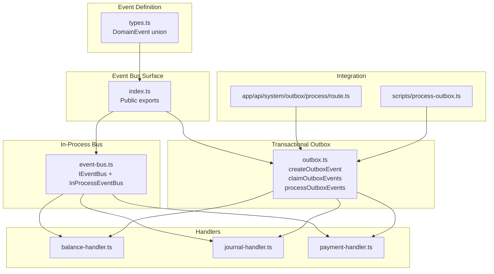
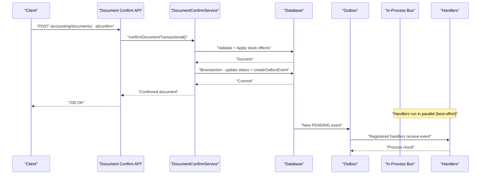
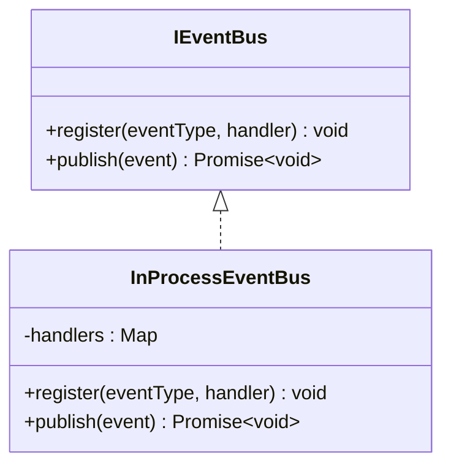
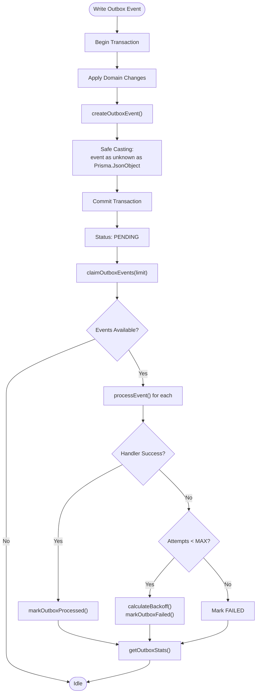
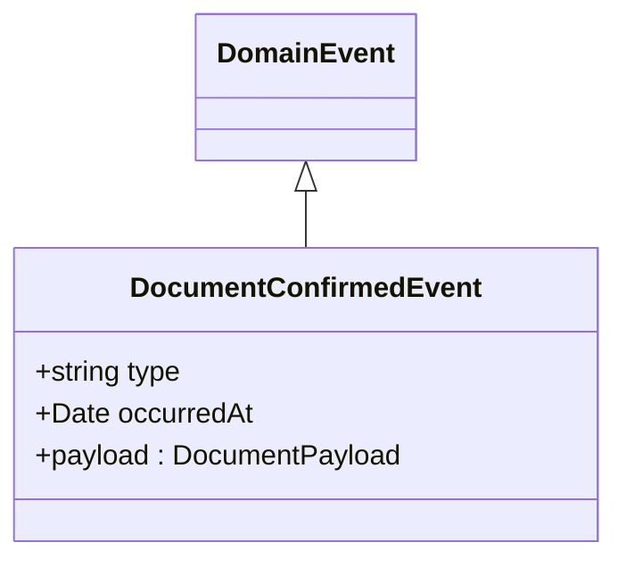
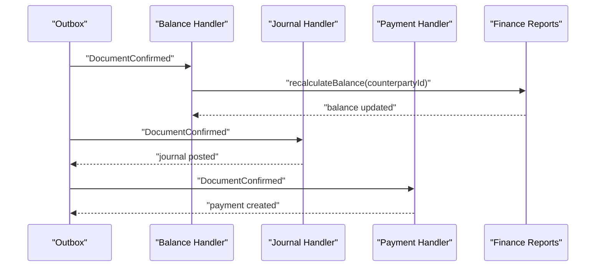
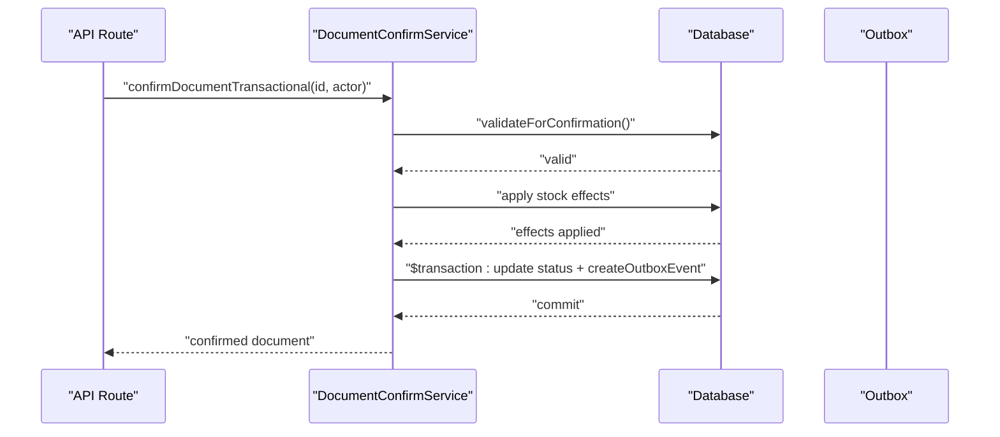
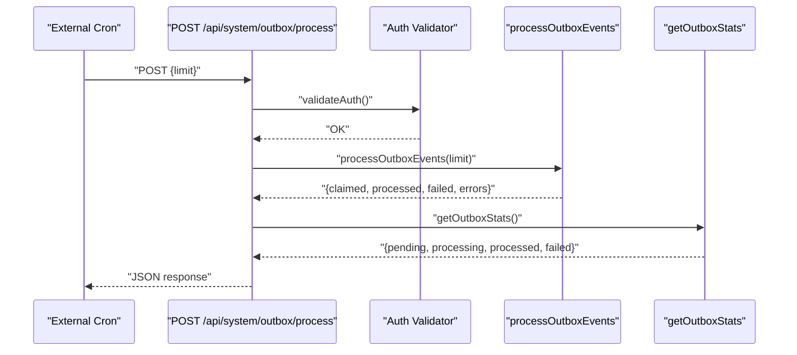
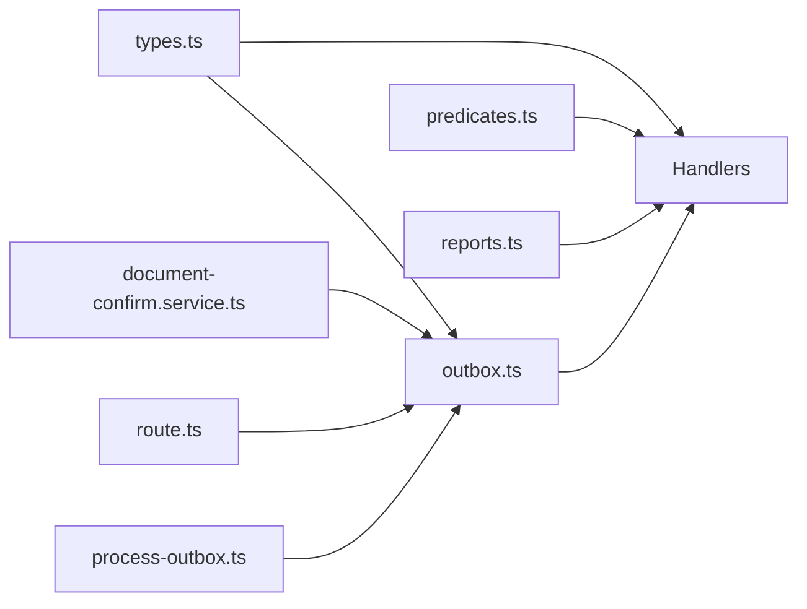

# Event-Driven Architecture

<cite>
**Referenced Files in This Document**
- [index.ts](file://lib/events/index.ts)
- [event-bus.ts](file://lib/events/event-bus.ts)
- [outbox.ts](file://lib/events/outbox.ts)
- [types.ts](file://lib/events/types.ts)
- [process-outbox.ts](file://scripts/process-outbox.ts)
- [route.ts](file://app/api/system/outbox/process/route.ts)
- [balance-handler.ts](file://lib/modules/accounting/handlers/balance-handler.ts)
- [journal-handler.ts](file://lib/modules/accounting/handlers/journal-handler.ts)
- [payment-handler.ts](file://lib/modules/accounting/handlers/payment-handler.ts)
- [predicates.ts](file://lib/modules/accounting/finance/predicates.ts)
- [reports.ts](file://lib/modules/finance/reports.ts)
- [document-confirm.service.ts](file://lib/modules/accounting/services/document-confirm.service.ts)
- [event-bus.test.ts](file://tests/unit/lib/event-bus.test.ts)
</cite>

## Update Summary
**Changes Made**
- Updated type safety section to reflect improved payload type casting
- Enhanced transactional outbox pattern documentation with better type safety practices
- Added details about the safer casting approach from `event as any` to `event as unknown as Prisma.JsonObject`

## Table of Contents
1. [Introduction](#introduction)
2. [Project Structure](#project-structure)
3. [Core Components](#core-components)
4. [Architecture Overview](#architecture-overview)
5. [Detailed Component Analysis](#detailed-component-analysis)
6. [Dependency Analysis](#dependency-analysis)
7. [Performance Considerations](#performance-considerations)
8. [Troubleshooting Guide](#troubleshooting-guide)
9. [Conclusion](#conclusion)

## Introduction
This document explains the event-driven architecture implemented in the ERP system. The system uses a two-phase approach:
- Phase 1.5: In-process event bus for immediate reactions within the same process
- Phase 2.1+: Transactional outbox pattern for durable, asynchronous event processing across services and deployments

The architecture centers around domain events (currently DocumentConfirmed) emitted when critical business operations complete, with handlers reacting to these events to maintain financial consistency, balances, and journals.

## Project Structure
The event system spans several layers:
- Event definitions and public API surface
- In-process event bus for immediate reactions
- Transactional outbox for durable delivery with enhanced type safety
- Domain handlers for accounting and finance
- Integration endpoints and CLI workers for outbox processing
- Tests validating event bus behavior

**Diagram sources**
- [types.ts:1-36](file://lib/events/types.ts#L1-L36)
- [index.ts:1-24](file://lib/events/index.ts#L1-L24)
- [event-bus.ts:1-92](file://lib/events/event-bus.ts#L1-L92)
- [outbox.ts:1-271](file://lib/events/outbox.ts#L1-L271)
- [balance-handler.ts:1-22](file://lib/modules/accounting/handlers/balance-handler.ts#L1-L22)
- [journal-handler.ts:1-24](file://lib/modules/accounting/handlers/journal-handler.ts#L1-L24)
- [payment-handler.ts:1-67](file://lib/modules/accounting/handlers/payment-handler.ts#L1-L67)
- [route.ts:1-151](file://app/api/system/outbox/process/route.ts#L1-L151)
- [process-outbox.ts:1-109](file://scripts/process-outbox.ts#L1-L109)

**Section sources**
- [index.ts:1-24](file://lib/events/index.ts#L1-L24)
- [event-bus.ts:1-92](file://lib/events/event-bus.ts#L1-L92)
- [outbox.ts:1-271](file://lib/events/outbox.ts#L1-L271)

## Core Components
- Domain Event Types: Discriminated union defining event shapes (currently DocumentConfirmed)
- Event Bus Interface: IEventBus defines registration and publish contracts
- In-Process Bus: Implements IEventBus with best-effort delivery and per-handler isolation
- Outbox Service: Writes events atomically with domain changes, claims work, retries with exponential backoff, and tracks stats with enhanced type safety
- Handler Registry: Maps event types to handler functions for outbox processing
- Document Confirmation Service: Emits DocumentConfirmed events within the same transaction as document confirmation

**Section sources**
- [types.ts:15-36](file://lib/events/types.ts#L15-L36)
- [event-bus.ts:28-46](file://lib/events/event-bus.ts#L28-L46)
- [event-bus.ts:50-84](file://lib/events/event-bus.ts#L50-L84)
- [outbox.ts:35-47](file://lib/events/outbox.ts#L35-L47)
- [outbox.ts:201-213](file://lib/events/outbox.ts#L201-L213)
- [document-confirm.service.ts:321-340](file://lib/modules/accounting/services/document-confirm.service.ts#L321-L340)

## Architecture Overview
The system separates concerns between immediate reactions (in-process) and reliable asynchronous processing (outbox). Handlers are registered once and react to events without tight coupling to the emitting service.

**Diagram sources**
- [document-confirm.service.ts:244-350](file://lib/modules/accounting/services/document-confirm.service.ts#L244-L350)
- [outbox.ts:60-77](file://lib/events/outbox.ts#L60-L77)
- [event-bus.ts:62-76](file://lib/events/event-bus.ts#L62-L76)

## Detailed Component Analysis

### Event Bus Implementation
The in-process event bus provides:
- Registration of handlers per event type
- Publish method that invokes all handlers with per-handler error isolation
- A factory for isolated buses in tests

**Diagram sources**
- [event-bus.ts:28-84](file://lib/events/event-bus.ts#L28-L84)

**Section sources**
- [event-bus.ts:28-84](file://lib/events/event-bus.ts#L28-L84)
- [event-bus.test.ts:1-81](file://tests/unit/lib/event-bus.test.ts#L1-L81)

### Transactional Outbox Pattern
The outbox ensures:
- Atomicity: events are written in the same transaction as the domain change
- Claiming: UPDATE with subquery prevents race conditions
- Retries: exponential backoff with max attempts
- Observability: stats for pending/processing/processed/failed
- **Enhanced Type Safety**: Safe casting from DomainEvent to Prisma.JsonObject using `event as unknown as Prisma.JsonObject`

**Updated** Improved type safety in payload casting to prevent runtime type errors and ensure Prisma JSON compatibility

**Diagram sources**
- [outbox.ts:60-77](file://lib/events/outbox.ts#L60-L77)
- [outbox.ts:86-102](file://lib/events/outbox.ts#L86-L102)
- [outbox.ts:238-270](file://lib/events/outbox.ts#L238-L270)

**Section sources**
- [outbox.ts:21-31](file://lib/events/outbox.ts#L21-L31)
- [outbox.ts:86-102](file://lib/events/outbox.ts#L86-L102)
- [outbox.ts:121-156](file://lib/events/outbox.ts#L121-L156)
- [outbox.ts:161-187](file://lib/events/outbox.ts#L161-L187)

### Domain Event Types
The system currently defines a single domain event:
- DocumentConfirmed: carries metadata about the document and who confirmed it

**Diagram sources**
- [types.ts:15-28](file://lib/events/types.ts#L15-L28)

**Section sources**
- [types.ts:15-36](file://lib/events/types.ts#L15-L36)

### Accounting Handlers
Three handlers react to DocumentConfirmed:
- Balance handler: recalculates counterparty balance for balance-affecting document types
- Journal handler: auto-posts the document to the double-entry journal
- Payment handler: creates Finance Payment records for shipment documents

**Diagram sources**
- [balance-handler.ts:13-21](file://lib/modules/accounting/handlers/balance-handler.ts#L13-L21)
- [journal-handler.ts:12-23](file://lib/modules/accounting/handlers/journal-handler.ts#L12-L23)
- [payment-handler.ts:15-67](file://lib/modules/accounting/handlers/payment-handler.ts#L15-L67)
- [reports.ts:43-89](file://lib/modules/finance/reports.ts#L43-L89)

**Section sources**
- [balance-handler.ts:1-22](file://lib/modules/accounting/handlers/balance-handler.ts#L1-L22)
- [journal-handler.ts:1-24](file://lib/modules/accounting/handlers/journal-handler.ts#L1-L24)
- [payment-handler.ts:1-67](file://lib/modules/accounting/handlers/payment-handler.ts#L1-L67)
- [predicates.ts:21-38](file://lib/modules/accounting/finance/predicates.ts#L21-L38)
- [reports.ts:43-89](file://lib/modules/finance/reports.ts#L43-L89)

### Document Confirmation Flow
The DocumentConfirmService orchestrates stock effects and emits the DocumentConfirmed event atomically with the status update.

**Diagram sources**
- [document-confirm.service.ts:244-350](file://lib/modules/accounting/services/document-confirm.service.ts#L244-L350)
- [outbox.ts:60-77](file://lib/events/outbox.ts#L60-L77)

**Section sources**
- [document-confirm.service.ts:244-350](file://lib/modules/accounting/services/document-confirm.service.ts#L244-L350)

### Outbox Processing Endpoints
Two mechanisms process outbox events:
- Next.js API route: validates auth, processes a configurable batch, and returns stats
- CLI script: registers handlers and processes events with optional stats-only mode

**Diagram sources**
- [route.ts:77-128](file://app/api/system/outbox/process/route.ts#L77-L128)
- [process-outbox.ts:60-97](file://scripts/process-outbox.ts#L60-L97)

**Section sources**
- [route.ts:1-151](file://app/api/system/outbox/process/route.ts#L1-L151)
- [process-outbox.ts:1-109](file://scripts/process-outbox.ts#L1-L109)

## Dependency Analysis
Key dependencies and relationships:
- Event types are imported by handlers and the outbox service
- Handlers depend on domain predicates and finance reports
- Document confirmation service depends on outbox creation and writes events
- Outbox processing depends on handler registration and database connectivity

**Diagram sources**
- [types.ts:15-36](file://lib/events/types.ts#L15-L36)
- [balance-handler.ts:9-11](file://lib/modules/accounting/handlers/balance-handler.ts#L9-L11)
- [journal-handler.ts:9-10](file://lib/modules/accounting/handlers/journal-handler.ts#L9-L10)
- [payment-handler.ts:11-13](file://lib/modules/accounting/handlers/payment-handler.ts#L11-L13)
- [predicates.ts:13-38](file://lib/modules/accounting/finance/predicates.ts#L13-L38)
- [reports.ts:1-98](file://lib/modules/finance/reports.ts#L1-L98)
- [document-confirm.service.ts:25-46](file://lib/modules/accounting/services/document-confirm.service.ts#L25-L46)
- [outbox.ts:14-17](file://lib/events/outbox.ts#L14-L17)
- [route.ts:25-29](file://app/api/system/outbox/process/route.ts#L25-L29)
- [process-outbox.ts:18-25](file://scripts/process-outbox.ts#L18-L25)

**Section sources**
- [index.ts:7-23](file://lib/events/index.ts#L7-L23)
- [document-confirm.service.ts:25-46](file://lib/modules/accounting/services/document-confirm.service.ts#L25-L46)

## Performance Considerations
- Best-effort delivery: handlers run concurrently; failures in one do not block others
- Exponential backoff: reduces load on failing handlers while preventing thundering herds
- Batch limits: API and CLI enforce upper bounds on events processed per invocation
- Idempotency: handlers should be idempotent (e.g., auto-posting checks for existing entries)
- Monitoring: outbox stats enable alerting on stuck or growing pending queues
- **Enhanced Type Safety**: Safer casting approach prevents runtime type errors and improves reliability

## Troubleshooting Guide
Common issues and remedies:
- Unauthorized access to outbox endpoint: verify Authorization header and OUTBOX_SECRET environment variable
- Handler errors: inspect per-event errors returned by outbox processing; check handler logs
- Stuck pending events: review oldest pending timestamp and adjust backoff or handler capacity
- Double-registration in development: ensure handlers are registered once at startup, not per-request
- **Type Casting Issues**: If encountering Prisma JSON type errors, verify that events are properly cast using the safe `event as unknown as Prisma.JsonObject` pattern

Operational commands:
- Show outbox stats: use the GET endpoint or CLI with --stats
- Process a small batch: use CLI with --limit=1 or API with limit=1 for safety
- Health monitoring: monitor stats and error rates

**Section sources**
- [route.ts:51-73](file://app/api/system/outbox/process/route.ts#L51-L73)
- [route.ts:138-149](file://app/api/system/outbox/process/route.ts#L138-L149)
- [process-outbox.ts:36-56](file://scripts/process-outbox.ts#L36-L56)
- [process-outbox.ts:87-96](file://scripts/process-outbox.ts#L87-L96)

## Conclusion
The system implements a robust event-driven architecture with immediate reactions for low-latency needs and a transactional outbox for reliable asynchronous processing. The design isolates handlers, maintains idempotency, and provides observability through comprehensive stats and logging. 

**Recent Enhancement**: The system now includes improved type safety in the event processing pipeline, specifically in the transactional outbox pattern where events are safely cast from DomainEvent to Prisma.JsonObject using the safer `event as unknown as Prisma.JsonObject` pattern. This enhancement prevents runtime type errors while maintaining the flexibility needed for Prisma's JSON field compatibility.

As the system evolves, the event bus interface enables seamless migration to an outbox-backed implementation without changing handler code, while the enhanced type safety ensures more reliable event processing across the entire architecture.