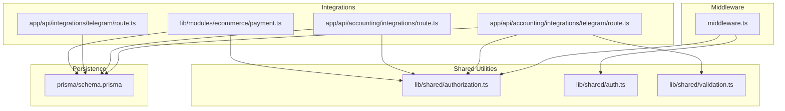
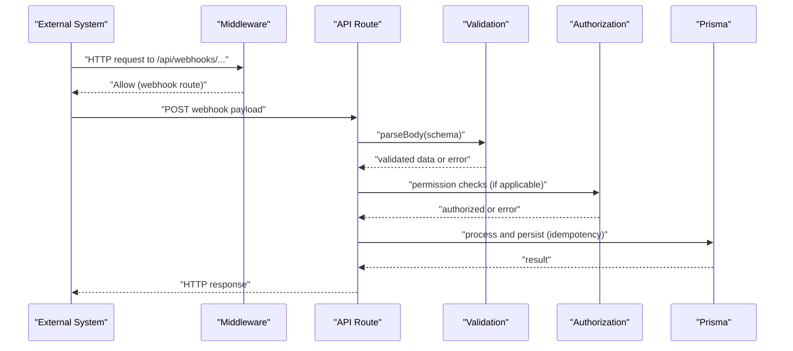
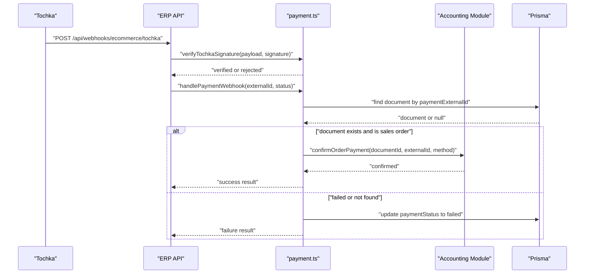
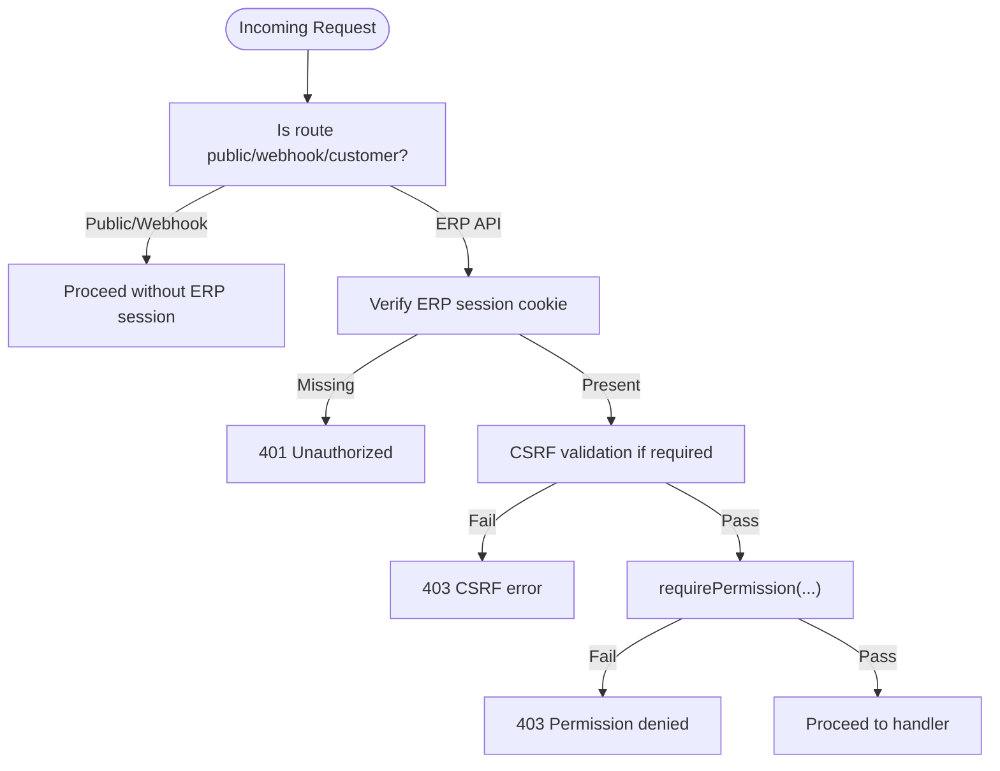
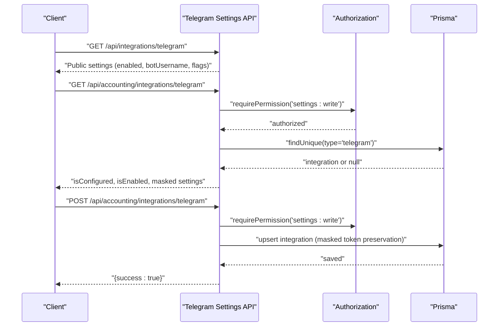
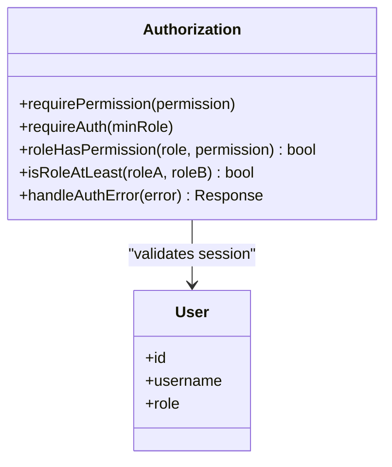
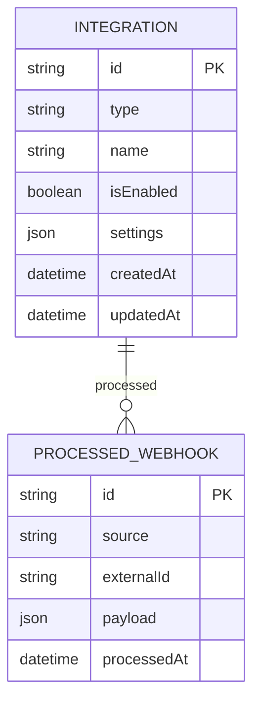
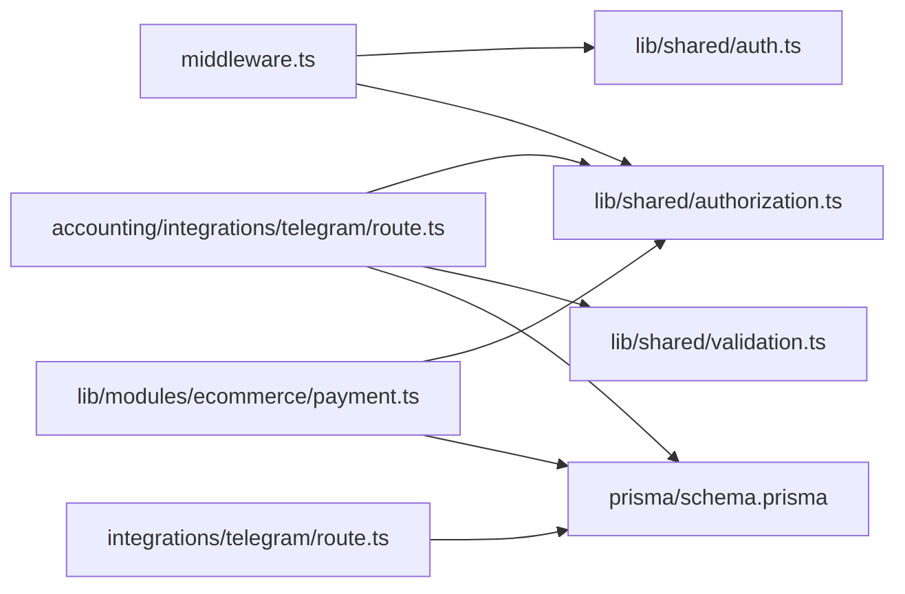

# Integration Patterns

<cite>
**Referenced Files in This Document**
- [middleware.ts](file://middleware.ts)
- [lib/shared/authorization.ts](file://lib/shared/authorization.ts)
- [lib/shared/auth.ts](file://lib/shared/auth.ts)
- [lib/shared/validation.ts](file://lib/shared/validation.ts)
- [lib/modules/ecommerce/payment.ts](file://lib/modules/ecommerce/payment.ts)
- [app/api/integrations/telegram/route.ts](file://app/api/integrations/telegram/route.ts)
- [app/api/accounting/integrations/telegram/route.ts](file://app/api/accounting/integrations/telegram/route.ts)
- [app/api/accounting/integrations/route.ts](file://app/api/accounting/integrations/route.ts)
- [prisma/schema.prisma](file://prisma/schema.prisma)
</cite>

## Table of Contents
1. [Introduction](#introduction)
2. [Project Structure](#project-structure)
3. [Core Components](#core-components)
4. [Architecture Overview](#architecture-overview)
5. [Detailed Component Analysis](#detailed-component-analysis)
6. [Dependency Analysis](#dependency-analysis)
7. [Performance Considerations](#performance-considerations)
8. [Troubleshooting Guide](#troubleshooting-guide)
9. [Conclusion](#conclusion)
10. [Appendices](#appendices)

## Introduction
This document describes the integration patterns used in ListOpt ERP, focusing on webhook processing for external systems, specifically the Tochka payment webhook implementation. It also explains authentication and authorization patterns across integration endpoints, API endpoint patterns for external integrations and their security measures, role-based access control (RBAC) and permission checking, integration testing strategies, successful integration examples, common integration challenges, error handling and retry mechanisms, monitoring approaches, and extensibility points for adding new integration types.

## Project Structure
ListOpt ERP organizes integration-related logic across:
- Middleware for route classification and CSRF protection
- Shared authorization and authentication utilities
- Validation utilities for request parsing and schema enforcement
- E-commerce payment module implementing Tochka webhook verification and processing
- API endpoints for public and administrative integration settings
- Prisma schema modeling integration configuration and webhook idempotency

**Diagram sources**
- [middleware.ts:1-169](file://middleware.ts#L1-L169)
- [lib/shared/authorization.ts:1-160](file://lib/shared/authorization.ts#L1-L160)
- [lib/shared/auth.ts:1-89](file://lib/shared/auth.ts#L1-L89)
- [lib/shared/validation.ts:1-63](file://lib/shared/validation.ts#L1-L63)
- [lib/modules/ecommerce/payment.ts:1-84](file://lib/modules/ecommerce/payment.ts#L1-L84)
- [app/api/integrations/telegram/route.ts:1-30](file://app/api/integrations/telegram/route.ts#L1-L30)
- [app/api/accounting/integrations/telegram/route.ts:1-110](file://app/api/accounting/integrations/telegram/route.ts#L1-L110)
- [app/api/accounting/integrations/route.ts:1-18](file://app/api/accounting/integrations/route.ts#L1-L18)
- [prisma/schema.prisma:1057-1066](file://prisma/schema.prisma#L1057-L1066)

**Section sources**
- [middleware.ts:26-83](file://middleware.ts#L26-L83)
- [lib/shared/authorization.ts:16-82](file://lib/shared/authorization.ts#L16-L82)
- [lib/shared/auth.ts:61-83](file://lib/shared/auth.ts#L61-L83)
- [lib/shared/validation.ts:14-30](file://lib/shared/validation.ts#L14-L30)
- [lib/modules/ecommerce/payment.ts:20-74](file://lib/modules/ecommerce/payment.ts#L20-L74)
- [app/api/integrations/telegram/route.ts:5-29](file://app/api/integrations/telegram/route.ts#L5-L29)
- [app/api/accounting/integrations/telegram/route.ts:7-44](file://app/api/accounting/integrations/telegram/route.ts#L7-L44)
- [app/api/accounting/integrations/route.ts:5-17](file://app/api/accounting/integrations/route.ts#L5-L17)
- [prisma/schema.prisma:1057-1066](file://prisma/schema.prisma#L1057-L1066)

## Core Components
- Authentication and session management:
  - Session signing and verification utilities
  - Retrieval of authenticated ERP users from cookies
- Authorization and RBAC:
  - Role hierarchy and permission matrix
  - Permission checks and error handling
- Validation:
  - Request body parsing with Zod schemas and structured error responses
- Webhook processing:
  - Tochka signature verification and payment status handling
  - Idempotent processing via stored records
- Integration settings:
  - Public Telegram settings retrieval
  - Administrative Telegram settings management with masking and upsert
  - Listing integrations with permission gating

**Section sources**
- [lib/shared/auth.ts:18-83](file://lib/shared/auth.ts#L18-L83)
- [lib/shared/authorization.ts:92-135](file://lib/shared/authorization.ts#L92-L135)
- [lib/shared/validation.ts:14-62](file://lib/shared/validation.ts#L14-L62)
- [lib/modules/ecommerce/payment.ts:20-74](file://lib/modules/ecommerce/payment.ts#L20-L74)
- [prisma/schema.prisma:1057-1066](file://prisma/schema.prisma#L1057-L1066)
- [app/api/integrations/telegram/route.ts:5-29](file://app/api/integrations/telegram/route.ts#L5-L29)
- [app/api/accounting/integrations/telegram/route.ts:7-44](file://app/api/accounting/integrations/telegram/route.ts#L7-L44)
- [app/api/accounting/integrations/route.ts:5-17](file://app/api/accounting/integrations/route.ts#L5-L17)

## Architecture Overview
The integration architecture separates concerns across middleware, shared utilities, and API endpoints. Webhook routes bypass ERP session requirements, while administrative endpoints enforce permissions. Validation ensures robust request handling, and persistence supports idempotent webhook processing.

**Diagram sources**
- [middleware.ts:38-83](file://middleware.ts#L38-L83)
- [lib/shared/validation.ts:14-30](file://lib/shared/validation.ts#L14-L30)
- [lib/shared/authorization.ts:122-135](file://lib/shared/authorization.ts#L122-L135)
- [prisma/schema.prisma:1057-1066](file://prisma/schema.prisma#L1057-L1066)

## Detailed Component Analysis

### Webhook Processing Pattern (Tochka Payment)
The Tochka payment webhook implementation verifies signatures, resolves orders by external identifiers, updates payment statuses, and confirms payments through the accounting module. It leverages idempotency to prevent duplicate processing.

**Diagram sources**
- [lib/modules/ecommerce/payment.ts:20-74](file://lib/modules/ecommerce/payment.ts#L20-L74)
- [prisma/schema.prisma:1057-1066](file://prisma/schema.prisma#L1057-L1066)

Key implementation notes:
- Signature verification uses HMAC-SHA256 against a configured secret.
- Idempotency is enforced by storing processed webhook records keyed by source and externalId.
- Payment success triggers accounting confirmation; failures update payment status.

**Section sources**
- [lib/modules/ecommerce/payment.ts:20-74](file://lib/modules/ecommerce/payment.ts#L20-L74)
- [prisma/schema.prisma:1057-1066](file://prisma/schema.prisma#L1057-L1066)

### Authentication and Authorization Patterns
- ERP session-based authentication:
  - Session tokens are signed and verified; user is resolved from the database.
  - Middleware enforces session presence for ERP routes and redirects unauthenticated users.
- CSRF protection:
  - CSRF validation is applied to ERP API routes except whitelisted paths.
- RBAC and permissions:
  - Roles have hierarchical precedence; permissions are mapped per role.
  - Functions require either a minimum role or a specific permission, returning structured errors otherwise.

**Diagram sources**
- [middleware.ts:58-163](file://middleware.ts#L58-L163)
- [lib/shared/auth.ts:61-83](file://lib/shared/auth.ts#L61-L83)
- [lib/shared/authorization.ts:104-135](file://lib/shared/authorization.ts#L104-L135)

**Section sources**
- [middleware.ts:26-83](file://middleware.ts#L26-L83)
- [lib/shared/auth.ts:18-83](file://lib/shared/auth.ts#L18-L83)
- [lib/shared/authorization.ts:92-135](file://lib/shared/authorization.ts#L92-L135)

### API Endpoint Patterns for Integrations
- Public Telegram settings:
  - GET endpoint returns enabled state and public metadata without exposing secrets.
- Administrative Telegram settings:
  - GET/POST/DELETE endpoints require permission to manage integration configuration.
  - Tokens are masked when returned; partial token updates preserve existing values.
- Integration listing:
  - GET endpoint lists integrations with ordering and permission gating.

**Diagram sources**
- [app/api/integrations/telegram/route.ts:5-29](file://app/api/integrations/telegram/route.ts#L5-L29)
- [app/api/accounting/integrations/telegram/route.ts:7-44](file://app/api/accounting/integrations/telegram/route.ts#L7-L44)
- [app/api/accounting/integrations/route.ts:5-17](file://app/api/accounting/integrations/route.ts#L5-L17)
- [lib/shared/authorization.ts:122-135](file://lib/shared/authorization.ts#L122-L135)

**Section sources**
- [app/api/integrations/telegram/route.ts:5-29](file://app/api/integrations/telegram/route.ts#L5-L29)
- [app/api/accounting/integrations/telegram/route.ts:47-92](file://app/api/accounting/integrations/telegram/route.ts#L47-L92)
- [app/api/accounting/integrations/route.ts:5-17](file://app/api/accounting/integrations/route.ts#L5-L17)
- [lib/shared/authorization.ts:122-135](file://lib/shared/authorization.ts#L122-L135)

### Role-Based Access Control (RBAC) and Permission Checking
- Roles and permissions:
  - Roles include admin, manager, accountant, viewer with strict hierarchy.
  - Permissions cover product, category, unit, counterparty, warehouse, stock, document, pricing, payment, report, settings, and user management scopes.
- Checks:
  - requirePermission throws a structured error for missing permissions.
  - handleAuthError converts authorization errors to HTTP responses.

**Diagram sources**
- [lib/shared/authorization.ts:92-135](file://lib/shared/authorization.ts#L92-L135)

**Section sources**
- [lib/shared/authorization.ts:16-82](file://lib/shared/authorization.ts#L16-L82)
- [lib/shared/authorization.ts:122-160](file://lib/shared/authorization.ts#L122-L160)

### Integration Testing Strategies
Recommended strategies for external integrations:
- Unit tests for signature verification and webhook handlers using mocked database and accounting confirmations.
- Integration tests validating middleware routing, CSRF protection, and permission enforcement.
- End-to-end tests simulating webhook delivery with realistic payloads and verifying idempotency.
- Load and chaos tests to evaluate resilience under high throughput and partial failures.

[No sources needed since this section provides general guidance]

### Examples of Successful Integration Implementations
- Tochka payment webhook:
  - Verified signature, resolved sales order by externalId, confirmed payment via accounting module, and updated status on failure.
- Telegram integration:
  - Public endpoint exposes enabled state and public metadata.
  - Administrative endpoint manages settings with masking and upsert behavior.

**Section sources**
- [lib/modules/ecommerce/payment.ts:29-74](file://lib/modules/ecommerce/payment.ts#L29-L74)
- [app/api/integrations/telegram/route.ts:5-29](file://app/api/integrations/telegram/route.ts#L5-L29)
- [app/api/accounting/integrations/telegram/route.ts:47-92](file://app/api/accounting/integrations/telegram/route.ts#L47-L92)

### Common Integration Challenges
- Signature verification failures due to misconfigured secrets or altered payloads.
- Duplicate webhook processing leading to inconsistent states; addressed by idempotency keys.
- Permission drift where roles change but legacy access remains; mitigated by strict RBAC checks.
- Token exposure risks; solved by masking sensitive values in responses.

**Section sources**
- [lib/modules/ecommerce/payment.ts:20-27](file://lib/modules/ecommerce/payment.ts#L20-L27)
- [prisma/schema.prisma:1057-1066](file://prisma/schema.prisma#L1057-L1066)
- [app/api/accounting/integrations/telegram/route.ts:28-41](file://app/api/accounting/integrations/telegram/route.ts#L28-L41)

### Error Handling, Retry Mechanisms, and Monitoring
- Error handling:
  - Structured authorization errors with appropriate HTTP status codes.
  - Validation errors return field-specific messages.
- Retry mechanisms:
  - Implement exponential backoff for webhook retries with idempotency to avoid duplicates.
- Monitoring:
  - Log webhook events with request IDs for traceability.
  - Track CSRF violations and authorization failures.

**Section sources**
- [lib/shared/authorization.ts:137-160](file://lib/shared/authorization.ts#L137-L160)
- [lib/shared/validation.ts:54-62](file://lib/shared/validation.ts#L54-L62)
- [middleware.ts:142-155](file://middleware.ts#L142-L155)

### Extensibility Points for New Integration Types
- Define integration type and configuration model in shared types.
- Add CRUD endpoints under accounting/integrations/<type> with permission gating.
- Implement public retrieval endpoint under integrations/<type> for consumer-facing data.
- Extend validation schemas and masking logic for new settings.
- Add idempotency storage for webhook sources and external IDs.

**Diagram sources**
- [prisma/schema.prisma:1057-1066](file://prisma/schema.prisma#L1057-L1066)

**Section sources**
- [lib/modules/integrations/types.ts:1-27](file://lib/modules/integrations/types.ts#L1-L27)
- [app/api/accounting/integrations/route.ts:5-17](file://app/api/accounting/integrations/route.ts#L5-L17)
- [prisma/schema.prisma:1057-1066](file://prisma/schema.prisma#L1057-L1066)

## Dependency Analysis
- Middleware orchestrates route classification, session validation, CSRF protection, and redirections.
- API endpoints depend on shared authorization utilities and validation.
- Payment module depends on authorization and persistence for idempotency.
- Integration settings endpoints depend on Prisma models and masking logic.

**Diagram sources**
- [middleware.ts:58-163](file://middleware.ts#L58-L163)
- [lib/shared/authorization.ts:104-135](file://lib/shared/authorization.ts#L104-L135)
- [lib/shared/validation.ts:14-30](file://lib/shared/validation.ts#L14-L30)
- [lib/modules/ecommerce/payment.ts:20-74](file://lib/modules/ecommerce/payment.ts#L20-L74)
- [app/api/integrations/telegram/route.ts:5-29](file://app/api/integrations/telegram/route.ts#L5-L29)
- [app/api/accounting/integrations/telegram/route.ts:7-44](file://app/api/accounting/integrations/telegram/route.ts#L7-L44)
- [prisma/schema.prisma:1057-1066](file://prisma/schema.prisma#L1057-L1066)

**Section sources**
- [middleware.ts:26-83](file://middleware.ts#L26-L83)
- [lib/shared/authorization.ts:122-135](file://lib/shared/authorization.ts#L122-L135)
- [lib/shared/validation.ts:14-30](file://lib/shared/validation.ts#L14-L30)
- [lib/modules/ecommerce/payment.ts:20-74](file://lib/modules/ecommerce/payment.ts#L20-L74)
- [app/api/integrations/telegram/route.ts:5-29](file://app/api/integrations/telegram/route.ts#L5-L29)
- [app/api/accounting/integrations/telegram/route.ts:7-44](file://app/api/accounting/integrations/telegram/route.ts#L7-L44)
- [prisma/schema.prisma:1057-1066](file://prisma/schema.prisma#L1057-L1066)

## Performance Considerations
- Prefer idempotent webhook processing to avoid redundant work.
- Use masked tokens in responses to reduce risk without impacting performance.
- Apply rate limiting and circuit breakers for external service calls.
- Cache frequently accessed integration settings where safe.

[No sources needed since this section provides general guidance]

## Troubleshooting Guide
- Unauthorized errors:
  - Verify ERP session cookie presence and validity.
  - Confirm CSRF protection is not blocking legitimate requests.
- Permission errors:
  - Ensure the user’s role meets the required permission level.
- Validation errors:
  - Inspect field-specific error messages returned by validation utilities.
- Webhook issues:
  - Confirm signature secret configuration and payload integrity.
  - Check idempotency records to diagnose duplicate processing.

**Section sources**
- [middleware.ts:123-156](file://middleware.ts#L123-L156)
- [lib/shared/authorization.ts:137-160](file://lib/shared/authorization.ts#L137-L160)
- [lib/shared/validation.ts:54-62](file://lib/shared/validation.ts#L54-L62)
- [lib/modules/ecommerce/payment.ts:20-27](file://lib/modules/ecommerce/payment.ts#L20-L27)
- [prisma/schema.prisma:1057-1066](file://prisma/schema.prisma#L1057-L1066)

## Conclusion
ListOpt ERP integrates external systems through secure, permission-gated endpoints and robust webhook processing. Middleware enforces authentication and CSRF protection, while shared utilities provide consistent validation and RBAC. The Tochka payment integration demonstrates signature verification, idempotent processing, and accounting confirmation. Administrative and public integration endpoints follow consistent patterns, and extensibility is supported through shared types and Prisma models.

[No sources needed since this section summarizes without analyzing specific files]

## Appendices
- Environment variables:
  - SESSION_SECRET: Required for session signing and CSRF validation.
  - TOCHKA_WEBHOOK_SECRET: Required for Tochka webhook signature verification.
- Request ID tracing:
  - Middleware injects X-Request-Id headers for cross-service correlation.

**Section sources**
- [lib/shared/auth.ts:5-11](file://lib/shared/auth.ts#L5-L11)
- [lib/modules/ecommerce/payment.ts:21-23](file://lib/modules/ecommerce/payment.ts#L21-L23)
- [middleware.ts:52-56](file://middleware.ts#L52-L56)