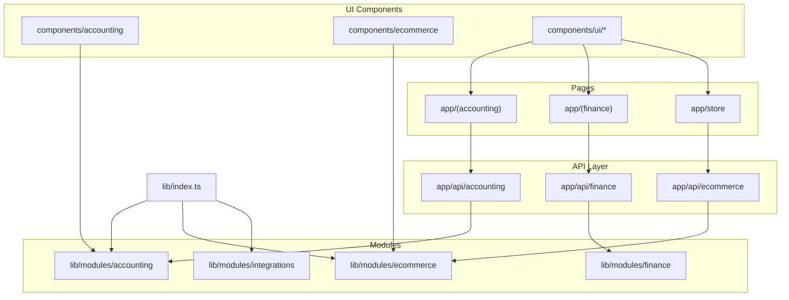
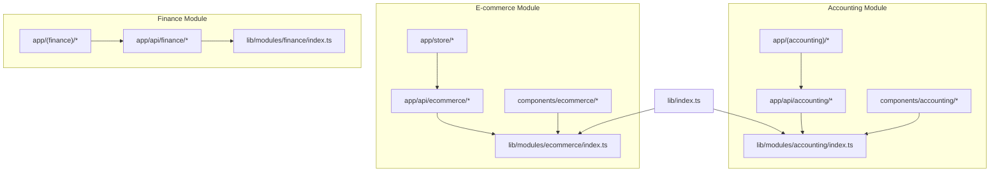
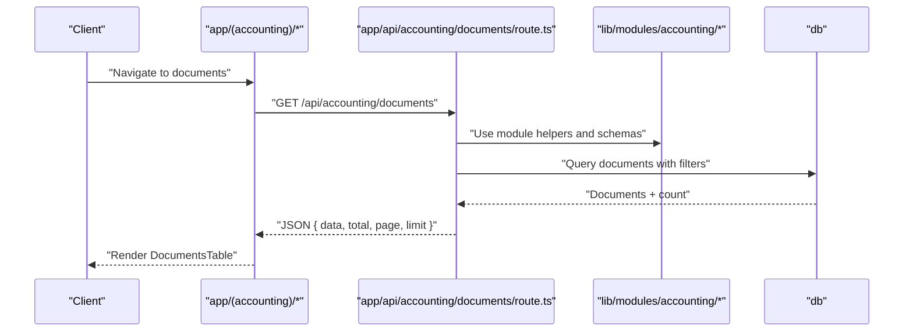
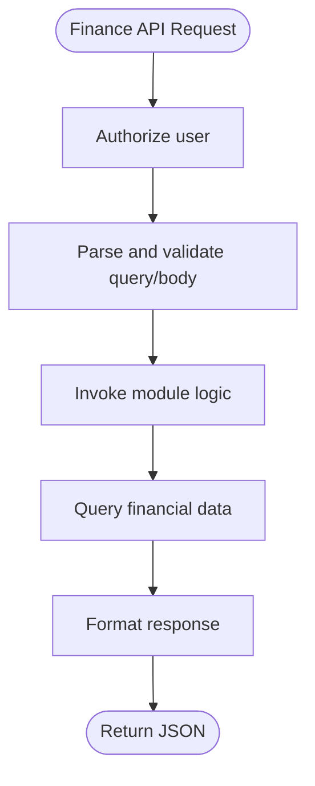
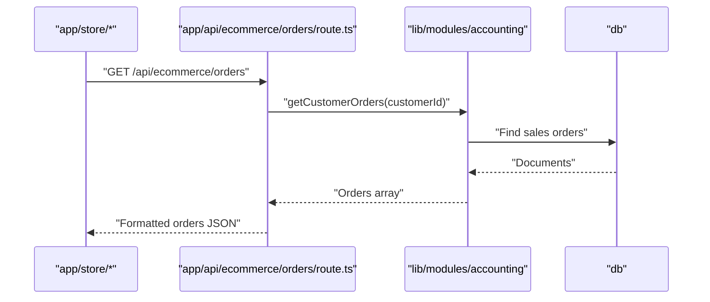
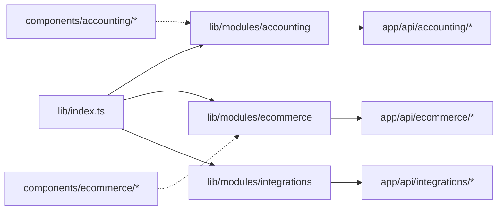
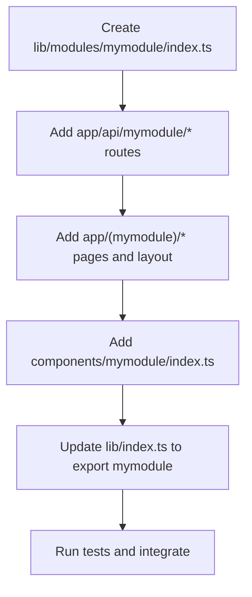
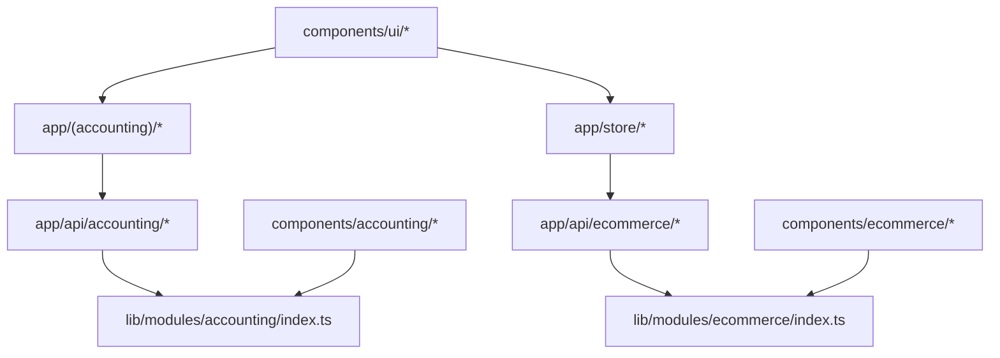

# Module Architecture

<cite>
**Referenced Files in This Document**
- [lib/index.ts](file://lib/index.ts)
- [lib/modules/accounting/index.ts](file://lib/modules/accounting/index.ts)
- [lib/modules/ecommerce/index.ts](file://lib/modules/ecommerce/index.ts)
- [lib/modules/integrations/index.ts](file://lib/modules/integrations/index.ts)
- [app/(accounting)/layout.tsx](file://app/(accounting)/layout.tsx)
- [app/(finance)/layout.tsx](file://app/(finance)/layout.tsx)
- [app/api/accounting/documents/route.ts](file://app/api/accounting/documents/route.ts)
- [app/api/ecommerce/orders/route.ts](file://app/api/ecommerce/orders/route.ts)
- [components/accounting/index.ts](file://components/accounting/index.ts)
- [components/ui/data-grid/index.ts](file://components/ui/data-grid/index.ts)
- [tests/integration/api/auth.test.ts](file://tests/integration/api/auth.test.ts)
- [tests/unit/lib/auth.test.ts](file://tests/unit/lib/auth.test.ts)
- [tests/e2e/specs/accounting/catalog.spec.ts](file://tests/e2e/specs/accounting/catalog.spec.ts)
</cite>

## Table of Contents
1. [Introduction](#introduction)
2. [Project Structure](#project-structure)
3. [Core Components](#core-components)
4. [Architecture Overview](#architecture-overview)
5. [Detailed Component Analysis](#detailed-component-analysis)
6. [Dependency Analysis](#dependency-analysis)
7. [Performance Considerations](#performance-considerations)
8. [Troubleshooting Guide](#troubleshooting-guide)
9. [Conclusion](#conclusion)
10. [Appendices](#appendices)

## Introduction
This document explains the module architecture of ListOpt ERP, focusing on the three primary modules: accounting, finance, and e-commerce. It describes the established structure pattern for organizing business logic, API routes, pages, and UI components per module, the module registration mechanism via a central barrel export, module isolation principles, inter-module communication through well-defined interfaces, routing and layout conventions, and testing strategies that isolate modules for reliable development and validation.

## Project Structure
ListOpt ERP follows a clear module-centric structure:
- Business logic per module resides under lib/modules/{module}/
- API routes per module live under app/api/{module}/
- Pages per module live under app/({module})/
- UI components per module live under components/{module}/
- Central module registration is performed in lib/index.ts via barrel re-exports

**Diagram sources**
- [lib/index.ts:1-6](file://lib/index.ts#L1-L6)
- [lib/modules/accounting/index.ts:1-8](file://lib/modules/accounting/index.ts#L1-L8)
- [lib/modules/ecommerce/index.ts:1-6](file://lib/modules/ecommerce/index.ts#L1-L6)
- [lib/modules/integrations/index.ts:1-5](file://lib/modules/integrations/index.ts#L1-L5)
- [app/api/accounting/documents/route.ts:1-136](file://app/api/accounting/documents/route.ts#L1-L136)
- [app/api/ecommerce/orders/route.ts:1-64](file://app/api/ecommerce/orders/route.ts#L1-L64)
- [app/(accounting)/layout.tsx:1-24](file://app/(accounting)/layout.tsx#L1-L24)
- [app/(finance)/layout.tsx:1-24](file://app/(finance)/layout.tsx#L1-L24)
- [components/accounting/index.ts:1-12](file://components/accounting/index.ts#L1-L12)
- [components/ui/data-grid/index.ts:1-15](file://components/ui/data-grid/index.ts#L1-L15)

**Section sources**
- [lib/index.ts:1-6](file://lib/index.ts#L1-L6)
- [lib/modules/accounting/index.ts:1-8](file://lib/modules/accounting/index.ts#L1-L8)
- [lib/modules/ecommerce/index.ts:1-6](file://lib/modules/ecommerce/index.ts#L1-L6)
- [lib/modules/integrations/index.ts:1-5](file://lib/modules/integrations/index.ts#L1-L5)

## Core Components
- Module registration via lib/index.ts
  - The central barrel export re-exports modules by namespace, enabling consumers to import module APIs uniformly.
  - Example references:
    - [lib/index.ts:3-5](file://lib/index.ts#L3-L5)
    - [lib/modules/accounting/index.ts:1-8](file://lib/modules/accounting/index.ts#L1-L8)
    - [lib/modules/ecommerce/index.ts:1-6](file://lib/modules/ecommerce/index.ts#L1-L6)
    - [lib/modules/integrations/index.ts:1-5](file://lib/modules/integrations/index.ts#L1-L5)

- Module-specific UI component exports
  - Each module exposes a local index.ts that consolidates its public components for easy consumption.
  - Example references:
    - [components/accounting/index.ts:1-12](file://components/accounting/index.ts#L1-L12)
    - [components/ui/data-grid/index.ts:1-15](file://components/ui/data-grid/index.ts#L1-L15)

- Module layouts and pages
  - Each module defines a dedicated layout under app/({module})/ for consistent navigation and sidebar behavior.
  - Example references:
    - [app/(accounting)/layout.tsx:1-24](file://app/(accounting)/layout.tsx#L1-L24)
    - [app/(finance)/layout.tsx:1-24](file://app/(finance)/layout.tsx#L1-L24)

**Section sources**
- [lib/index.ts:1-6](file://lib/index.ts#L1-L6)
- [components/accounting/index.ts:1-12](file://components/accounting/index.ts#L1-L12)
- [components/ui/data-grid/index.ts:1-15](file://components/ui/data-grid/index.ts#L1-L15)
- [app/(accounting)/layout.tsx:1-24](file://app/(accounting)/layout.tsx#L1-L24)
- [app/(finance)/layout.tsx:1-24](file://app/(finance)/layout.tsx#L1-L24)

## Architecture Overview
The module architecture enforces separation of concerns:
- Business logic is encapsulated within lib/modules/{module}/ and re-exported via lib/index.ts
- API routes in app/api/{module}/ depend on module logic and shared utilities
- Pages in app/({module})/ render module UI and orchestrate data fetching
- UI components in components/{module}/ are published through local indices for reuse

**Diagram sources**
- [lib/index.ts:1-6](file://lib/index.ts#L1-L6)
- [lib/modules/accounting/index.ts:1-8](file://lib/modules/accounting/index.ts#L1-L8)
- [lib/modules/ecommerce/index.ts:1-6](file://lib/modules/ecommerce/index.ts#L1-L6)
- [app/api/accounting/documents/route.ts:1-136](file://app/api/accounting/documents/route.ts#L1-L136)
- [app/api/ecommerce/orders/route.ts:1-64](file://app/api/ecommerce/orders/route.ts#L1-L64)
- [app/(accounting)/layout.tsx:1-24](file://app/(accounting)/layout.tsx#L1-L24)
- [app/(finance)/layout.tsx:1-24](file://app/(finance)/layout.tsx#L1-L24)
- [components/accounting/index.ts:1-12](file://components/accounting/index.ts#L1-L12)
- [components/ui/data-grid/index.ts:1-15](file://components/ui/data-grid/index.ts#L1-L15)

## Detailed Component Analysis

### Accounting Module
Responsibilities:
- Manage documents, counterparties, products, stock, and balances
- Provide schemas and typed models for domain entities
- Expose module-level APIs consumed by both internal pages and external integrations

Key structure:
- Business logic and exports: [lib/modules/accounting/index.ts:1-8](file://lib/modules/accounting/index.ts#L1-L8)
- API routes demonstrate module-to-business logic integration and shared utilities usage: [app/api/accounting/documents/route.ts:1-136](file://app/api/accounting/documents/route.ts#L1-L136)
- UI components exported for reuse: [components/accounting/index.ts:1-12](file://components/accounting/index.ts#L1-L12)

Communication pattern:
- API routes import module logic and shared validation/authentication utilities to enforce permissions and transform domain data for clients.

**Diagram sources**
- [app/api/accounting/documents/route.ts:1-136](file://app/api/accounting/documents/route.ts#L1-L136)
- [lib/modules/accounting/index.ts:1-8](file://lib/modules/accounting/index.ts#L1-L8)

**Section sources**
- [lib/modules/accounting/index.ts:1-8](file://lib/modules/accounting/index.ts#L1-L8)
- [app/api/accounting/documents/route.ts:1-136](file://app/api/accounting/documents/route.ts#L1-L136)
- [components/accounting/index.ts:1-12](file://components/accounting/index.ts#L1-L12)

### Finance Module
Responsibilities:
- Financial reporting, chart of accounts, journals, payments, and analytics
- Provide financial dashboards and balance views

Key structure:
- Module exports: [lib/modules/finance/index.ts](file://lib/modules/finance/index.ts)
- API routes for categories, payments, and reports: [app/api/finance/*](file://app/api/finance/*)
- Module layout: [app/(finance)/layout.tsx:1-24](file://app/(finance)/layout.tsx#L1-L24)

Communication pattern:
- Finance API routes consume shared authorization and validation utilities while delegating domain logic to module internals.

[No sources needed since this diagram shows conceptual workflow, not actual code structure]

**Section sources**
- [app/(finance)/layout.tsx:1-24](file://app/(finance)/layout.tsx#L1-L24)

### E-commerce Module
Responsibilities:
- Storefront pages, cart, checkout, orders, categories, CMS pages, promotions, and reviews
- Integrate with accounting for order fulfillment and reporting

Key structure:
- Module exports: [lib/modules/ecommerce/index.ts:1-6](file://lib/modules/ecommerce/index.ts#L1-L6)
- API routes for store operations and order retrieval: [app/api/ecommerce/*](file://app/api/ecommerce/*)
- Inter-module integration example: [app/api/ecommerce/orders/route.ts:1-64](file://app/api/ecommerce/orders/route.ts#L1-L64)

Inter-module communication:
- E-commerce API routes call into accounting module logic to fetch customer orders, ensuring consistent data representation across modules.

**Diagram sources**
- [app/api/ecommerce/orders/route.ts:1-64](file://app/api/ecommerce/orders/route.ts#L1-L64)
- [lib/modules/accounting/index.ts:1-8](file://lib/modules/accounting/index.ts#L1-L8)

**Section sources**
- [lib/modules/ecommerce/index.ts:1-6](file://lib/modules/ecommerce/index.ts#L1-L6)
- [app/api/ecommerce/orders/route.ts:1-64](file://app/api/ecommerce/orders/route.ts#L1-L64)

### Module Registration and Isolation
- Registration: lib/index.ts re-exports modules by namespace, enabling centralized imports and consistent module discovery.
  - Reference: [lib/index.ts:3-5](file://lib/index.ts#L3-L5)
- Isolation: Each module’s lib/modules/{module}/ acts as a bounded context. API routes depend on module exports and shared utilities, not on other modules’ internals. UI components are published through local indices, preventing cross-module coupling in component usage.

**Diagram sources**
- [lib/index.ts:1-6](file://lib/index.ts#L1-L6)
- [lib/modules/accounting/index.ts:1-8](file://lib/modules/accounting/index.ts#L1-L8)
- [lib/modules/ecommerce/index.ts:1-6](file://lib/modules/ecommerce/index.ts#L1-L6)
- [lib/modules/integrations/index.ts:1-5](file://lib/modules/integrations/index.ts#L1-L5)

**Section sources**
- [lib/index.ts:1-6](file://lib/index.ts#L1-L6)

### Routing and Layout Conventions
- Module routing: Pages are organized under app/({module})/ with a dedicated layout for each module.
  - References:
    - [app/(accounting)/layout.tsx:1-24](file://app/(accounting)/layout.tsx#L1-L24)
    - [app/(finance)/layout.tsx:1-24](file://app/(finance)/layout.tsx#L1-L24)
- API routing: Routes mirror module boundaries under app/api/{module}/, keeping HTTP endpoints aligned with domain boundaries.
  - References:
    - [app/api/accounting/documents/route.ts:1-136](file://app/api/accounting/documents/route.ts#L1-L136)
    - [app/api/ecommerce/orders/route.ts:1-64](file://app/api/ecommerce/orders/route.ts#L1-L64)

**Section sources**
- [app/(accounting)/layout.tsx:1-24](file://app/(accounting)/layout.tsx#L1-L24)
- [app/(finance)/layout.tsx:1-24](file://app/(finance)/layout.tsx#L1-L24)
- [app/api/accounting/documents/route.ts:1-136](file://app/api/accounting/documents/route.ts#L1-L136)
- [app/api/ecommerce/orders/route.ts:1-64](file://app/api/ecommerce/orders/route.ts#L1-L64)

### Adding a New Module (Pattern Example)
Follow these steps to add a new module named mymodule:
1. Create business logic exports
   - Add lib/modules/mymodule/index.ts and export submodules/types as needed.
2. Define API routes
   - Add app/api/mymodule/* routes that import shared utilities and module logic.
3. Create pages
   - Add app/(mymodule)/* pages and a layout if needed.
4. Publish UI components
   - Add components/mymodule/index.ts to expose reusable components.
5. Register the module
   - Update lib/index.ts to export the new module namespace.

[No sources needed since this diagram shows conceptual workflow, not actual code structure]

## Dependency Analysis
Module dependencies are intentionally shallow and unidirectional:
- API routes depend on module exports and shared utilities
- Pages depend on API routes
- UI components depend on module indices and shared UI primitives

**Diagram sources**
- [lib/modules/accounting/index.ts:1-8](file://lib/modules/accounting/index.ts#L1-L8)
- [lib/modules/ecommerce/index.ts:1-6](file://lib/modules/ecommerce/index.ts#L1-L6)
- [app/api/accounting/documents/route.ts:1-136](file://app/api/accounting/documents/route.ts#L1-L136)
- [app/api/ecommerce/orders/route.ts:1-64](file://app/api/ecommerce/orders/route.ts#L1-L64)
- [components/accounting/index.ts:1-12](file://components/accounting/index.ts#L1-L12)
- [components/ui/data-grid/index.ts:1-15](file://components/ui/data-grid/index.ts#L1-L15)

**Section sources**
- [lib/modules/accounting/index.ts:1-8](file://lib/modules/accounting/index.ts#L1-L8)
- [lib/modules/ecommerce/index.ts:1-6](file://lib/modules/ecommerce/index.ts#L1-L6)
- [app/api/accounting/documents/route.ts:1-136](file://app/api/accounting/documents/route.ts#L1-L136)
- [app/api/ecommerce/orders/route.ts:1-64](file://app/api/ecommerce/orders/route.ts#L1-L64)
- [components/accounting/index.ts:1-12](file://components/accounting/index.ts#L1-L12)
- [components/ui/data-grid/index.ts:1-15](file://components/ui/data-grid/index.ts#L1-L15)

## Performance Considerations
- Keep module boundaries strict to minimize unnecessary imports and reduce bundle size.
- Prefer pagination and filtering in API routes to avoid large payloads.
- Use shared validation and authorization utilities to centralize checks and reduce duplication.
- Cache-friendly UI components and avoid deep nesting in module pages to improve rendering performance.

[No sources needed since this section provides general guidance]

## Troubleshooting Guide
- Authentication and authorization errors
  - Verify permission checks and error handling in API routes.
  - References:
    - [app/api/accounting/documents/route.ts:56-60](file://app/api/accounting/documents/route.ts#L56-L60)
    - [app/api/ecommerce/orders/route.ts:58-62](file://app/api/ecommerce/orders/route.ts#L58-L62)
- Testing module integration
  - Integration tests demonstrate mocking and isolated route testing.
  - References:
    - [tests/integration/api/auth.test.ts:1-197](file://tests/integration/api/auth.test.ts#L1-L197)
    - [tests/unit/lib/auth.test.ts:1-81](file://tests/unit/lib/auth.test.ts#L1-L81)
- End-to-end module coverage
  - E2E tests validate module pages and workflows in isolation.
  - Reference:
    - [tests/e2e/specs/accounting/catalog.spec.ts:1-60](file://tests/e2e/specs/accounting/catalog.spec.ts#L1-L60)

**Section sources**
- [app/api/accounting/documents/route.ts:56-60](file://app/api/accounting/documents/route.ts#L56-L60)
- [app/api/ecommerce/orders/route.ts:58-62](file://app/api/ecommerce/orders/route.ts#L58-L62)
- [tests/integration/api/auth.test.ts:1-197](file://tests/integration/api/auth.test.ts#L1-L197)
- [tests/unit/lib/auth.test.ts:1-81](file://tests/unit/lib/auth.test.ts#L1-L81)
- [tests/e2e/specs/accounting/catalog.spec.ts:1-60](file://tests/e2e/specs/accounting/catalog.spec.ts#L1-L60)

## Conclusion
ListOpt ERP’s module architecture cleanly separates business logic, API surfaces, pages, and UI components by module. The central registration in lib/index.ts, strict module boundaries, and well-defined inter-module interfaces enable maintainability, scalability, and testability. Following the documented pattern ensures new modules integrate seamlessly while preserving isolation and clarity.

## Appendices
- Example references for quick navigation:
  - [lib/index.ts:1-6](file://lib/index.ts#L1-L6)
  - [lib/modules/accounting/index.ts:1-8](file://lib/modules/accounting/index.ts#L1-L8)
  - [lib/modules/ecommerce/index.ts:1-6](file://lib/modules/ecommerce/index.ts#L1-L6)
  - [app/api/accounting/documents/route.ts:1-136](file://app/api/accounting/documents/route.ts#L1-L136)
  - [app/api/ecommerce/orders/route.ts:1-64](file://app/api/ecommerce/orders/route.ts#L1-L64)
  - [components/accounting/index.ts:1-12](file://components/accounting/index.ts#L1-L12)
  - [components/ui/data-grid/index.ts:1-15](file://components/ui/data-grid/index.ts#L1-L15)