# Multi-Tenant Architecture

<cite>
**Referenced Files in This Document**
- [schema.prisma](file://prisma/schema.prisma)
- [20260313_add_tenant_architecture/migration.sql](file://prisma/migrations/20260313_add_tenant_architecture/migration.sql)
- [20260313_add_warehouse_tenantId/migration.sql](file://prisma/migrations/20260313_add_warehouse_tenantId/migration.sql)
- [20260314_add_counterparty_tenant/migration.sql](file://prisma/migrations/20260314_add_counterparty_tenant/migration.sql)
- [20260314_add_counterparty_tenant_not_null/migration.sql](file://prisma/migrations/20260314_add_counterparty_tenant_not_null/migration.sql)
- [20260315_add_document_tenantId_provenance/migration.sql](file://prisma/migrations/20260315_add_document_tenantId_provenance/migration.sql)
- [20260315_add_product_tenantId_provenance/migration.sql](file://prisma/migrations/20260315_add_product_tenantId_provenance/migration.sql)
- [20260315_add_variant_tenant_and_catalog_projection/migration.sql](file://prisma/migrations/20260315_add_variant_tenant_and_catalog_projection/migration.sql)
- [20260315160420_add_payment_tenant_id/migration.sql](file://prisma/migrations/20260315160420_add_payment_tenant_id/migration.sql)
- [20260315162442_make_payment_tenant_required/migration.sql](file://prisma/migrations/20260315162442_make_payment_tenant_required/migration.sql)
- [20260317_add_stock_record_version/migration.sql](file://prisma/migrations/20260317_add_stock_record_version/migration.sql)
- [20260317_decimal_monetary_fields/migration.sql](file://prisma/migrations/20260317_decimal_monetary_fields/migration.sql)
- [backfill-counterparty-tenant.ts](file://scripts/backfill-counterparty-tenant.ts)
- [backfill-document-tenant.ts](file://scripts/backfill-document-tenant.ts)
- [backfill-payment-tenant.ts](file://scripts/backfill-payment-tenant.ts)
- [backfill-product-tenant.ts](file://scripts/backfill-product-tenant.ts)
- [backfill-product-variant-tenant.ts](file://scripts/backfill-product-variant-tenant.ts)
- [verify-counterparty-tenant-gate.ts](file://scripts/verify-counterparty-tenant-gate.ts)
- [verify-document-tenant-gate.ts](file://scripts/verify-document-tenant-gate.ts)
- [verify-payment-tenant-gate.ts](file://scripts/verify-payment-tenant-gate.ts)
- [verify-product-tenant-gate.ts](file://scripts/verify-product-tenant-gate.ts)
- [ARCHITECTURE.md](file://docs/ARCHITECTURE.md)
- [middleware.ts](file://middleware.ts)
- [resolve-membership.ts](file://lib/modules/auth/resolve-membership.ts)
- [auth.ts](file://lib/shared/auth.ts)
- [authorization.ts](file://lib/shared/authorization.ts)
- [db.ts](file://lib/shared/db.ts)
- [warehouses/route.ts](file://app/api/accounting/warehouses/route.ts)
- [products/route.ts](file://app/api/accounting/products/route.ts)
- [stock/route.ts](file://app/api/accounting/stock/route.ts)
- [delivery.ts](file://lib/modules/ecommerce/delivery.ts)
- [factories.ts](file://tests/helpers/factories.ts)
</cite>

## Update Summary
**Changes Made**
- Added comprehensive tenant isolation enforcement documentation with schema-level constraints
- Documented migration provenance restoration procedures for historical schema changes
- Added detailed backfill scripts documentation for data migration processes
- Enhanced API enforcement patterns across all core modules
- Updated security measures with tenant-aware processing throughout the application
- Expanded verification gate systems for ensuring data integrity during migrations

## Table of Contents
1. [Introduction](#introduction)
2. [Project Structure](#project-structure)
3. [Core Components](#core-components)
4. [Architecture Overview](#architecture-overview)
5. [Migration Provenance Restoration](#migration-provenance-restoration)
6. [Backfill Scripts and Data Migration](#backfill-scripts-and-data-migration)
7. [Enhanced API Enforcement](#enhanced-api-enforcement)
8. [Verification Gates and Data Integrity](#verification-gates-and-data-integrity)
9. [Detailed Component Analysis](#detailed-component-analysis)
10. [Dependency Analysis](#dependency-analysis)
11. [Performance Considerations](#performance-considerations)
12. [Troubleshooting Guide](#troubleshooting-guide)
13. [Conclusion](#conclusion)

## Introduction

This document provides comprehensive documentation for the Multi-Tenant Architecture implemented in the ListOpt ERP system. The architecture enables multiple organizations (tenants) to operate independently within a single application instance while maintaining complete data isolation and separate operational contexts.

**Updated** The system now implements comprehensive tenant isolation enforcement across all core modules with schema-level constraints, migration provenance restoration, backfill scripts, and API enforcement. Enhanced security with tenant-aware processing throughout the application ensures complete data segregation and maintains strict separation of concerns across all business domains including accounting, inventory management, and e-commerce operations.

The system implements a robust tenant scoping mechanism that ensures all database operations are automatically constrained to the authenticated user's tenant context, preventing cross-tenant data leakage and maintaining strict separation of concerns across all business domains.

## Project Structure

The multi-tenant architecture is built on a modular Next.js application structure with clear separation between tenant-aware business logic and shared infrastructure components. The architecture now includes comprehensive migration provenance tracking and automated verification systems.

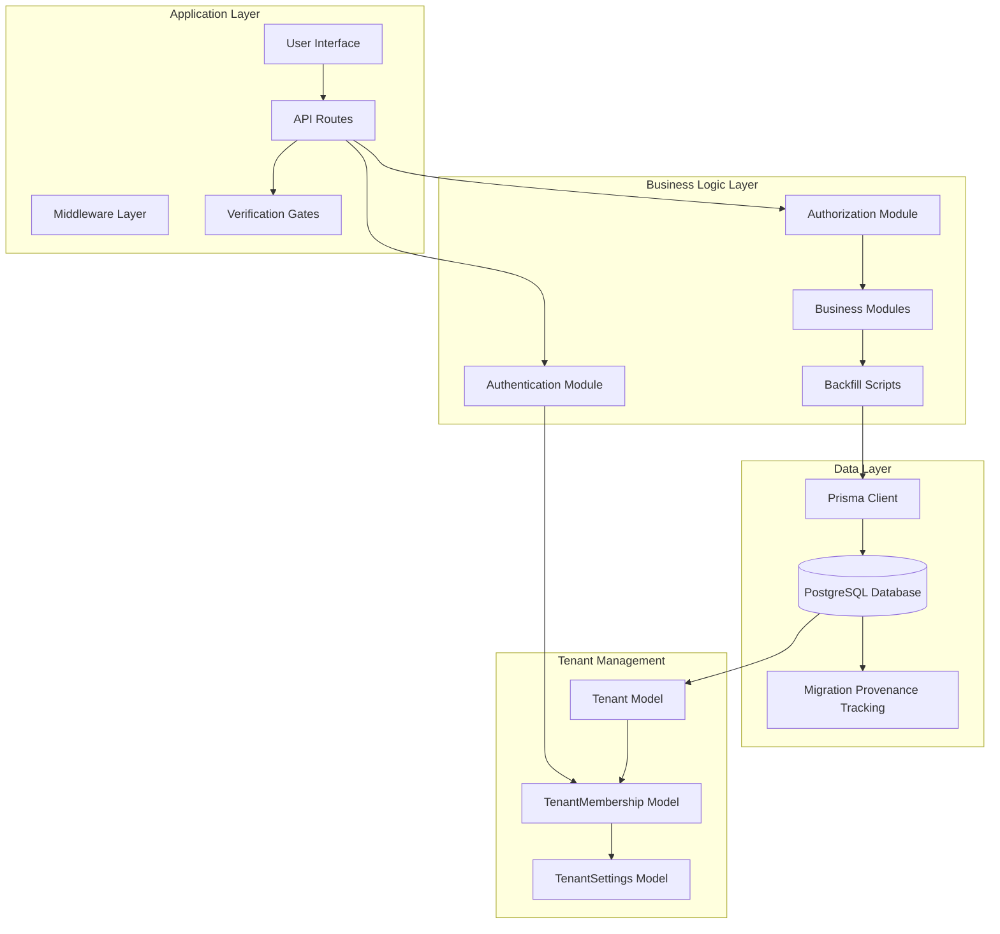

**Diagram sources**
- [ARCHITECTURE.md:1-308](file://docs/ARCHITECTURE.md#L1-L308)
- [schema.prisma:47-114](file://prisma/schema.prisma#L47-L114)

**Section sources**
- [ARCHITECTURE.md:1-308](file://docs/ARCHITECTURE.md#L1-L308)

## Core Components

### Tenant Model and Relationships

The tenant architecture is built around three core models that establish the foundation for multi-tenancy, with comprehensive schema-level constraints ensuring data integrity:

```mermaid
erDiagram
TENANT {
string id PK
string name
string slug UK
boolean isActive
datetime createdAt
datetime updatedAt
}
TENANT_MEMBERSHIP {
string id PK
string tenantId FK
string userId FK
enum role
boolean isActive
datetime createdAt
}
TENANT_SETTINGS {
string id PK
string tenantId UK FK
string name
string inn
string kpp
string ogrn
string taxRegime
float vatRate
float usnRate
float initialCapital
datetime initialCapitalDate
int fiscalYearStartMonth
}
USER {
string id PK
string username UK
string password
string email UK
enum role
boolean isActive
datetime createdAt
datetime updatedAt
}
WAREHOUSE {
string id PK
string tenantId FK
string name
string address
string responsibleName
boolean isActive
datetime createdAt
datetime updatedAt
}
PRODUCT {
string id PK
string tenantId FK
string name
string sku
string barcode UK
boolean isActive
datetime createdAt
datetime updatedAt
}
DOCUMENT {
string id PK
string tenantId FK
string number
enum type
enum status
datetime date
datetime createdAt
datetime updatedAt
}
PAYMENT {
string id PK
string tenantId FK
string number
string type
decimal amount
datetime date
datetime createdAt
datetime updatedAt
}
COUNTERPARTY {
string id PK
string tenantId FK
string name
string inn UK
boolean isActive
datetime createdAt
datetime updatedAt
}
PRODUCT_VARIANT {
string id PK
string tenantId FK
string productId FK
string optionId FK
string sku
string barcode UK
boolean isActive
datetime createdAt
datetime updatedAt
}
PRODUCT_CATALOG_PROJECTION {
string productId PK
string tenantId FK
string name
string sku
boolean isActive
boolean publishedToStore
datetime updatedAt
}
TENANT ||--o{ TENANT_MEMBERSHIP : "has"
TENANT ||--o| TENANT_SETTINGS : "has"
USER ||--o{ TENANT_MEMBERSHIP : "belongs_to"
TENANT ||--o{ WAREHOUSE : "owns"
TENANT ||--o{ PRODUCT : "owns"
TENANT ||--o{ DOCUMENT : "owns"
TENANT ||--o{ PAYMENT : "owns"
TENANT ||--o{ COUNTERPARTY : "owns"
TENANT ||--o{ PRODUCT_VARIANT : "owns"
TENANT ||--o| PRODUCT_CATALOG_PROJECTION : "owns"
WAREHOUSE ||--o{ DOCUMENT : "stores"
PRODUCT ||--o{ DOCUMENT : "included_in"
PRODUCT_VARIANT ||--o{ DOCUMENT : "included_in"
COUNTERPARTY ||--o{ DOCUMENT : "involved_in"
COUNTERPARTY ||--o{ PAYMENT : "receives"
PAYMENT ||--o{ DOCUMENT : "applies_to"
```

**Diagram sources**
- [schema.prisma:47-114](file://prisma/schema.prisma#L47-L114)
- [schema.prisma:115-168](file://prisma/schema.prisma#L115-L168)
- [schema.prisma:335-366](file://prisma/schema.prisma#L335-L366)
- [schema.prisma:455-511](file://prisma/schema.prisma#L455-L511)
- [schema.prisma:789-812](file://prisma/schema.prisma#L789-L812)
- [schema.prisma:219-241](file://prisma/schema.prisma#L219-L241)
- [schema.prisma:283-333](file://prisma/schema.prisma#L283-L333)

### Authentication and Session Management

The authentication system implements tenant-aware session management through a sophisticated token verification and membership resolution process with enhanced security measures:

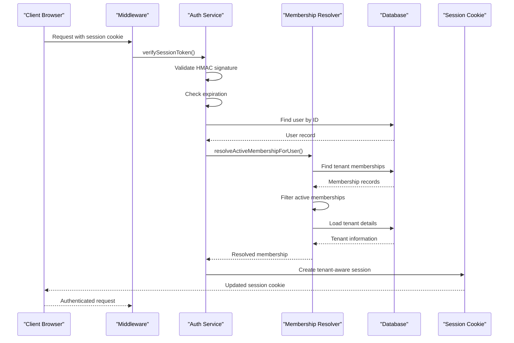

**Diagram sources**
- [auth.ts:107-174](file://lib/shared/auth.ts#L107-L174)
- [resolve-membership.ts:73-141](file://lib/modules/auth/resolve-membership.ts#L73-L141)

**Section sources**
- [schema.prisma:47-114](file://prisma/schema.prisma#L47-L114)
- [auth.ts:1-180](file://lib/shared/auth.ts#L1-L180)
- [resolve-membership.ts:1-178](file://lib/modules/auth/resolve-membership.ts#L1-L178)

## Architecture Overview

The multi-tenant architecture follows a comprehensive approach to ensure data isolation and tenant separation across all application layers with enhanced enforcement mechanisms.

### Tenant Scoping Implementation

All database queries are automatically scoped to the authenticated user's tenant context through a consistent pattern implemented across all API routes with schema-level enforcement:

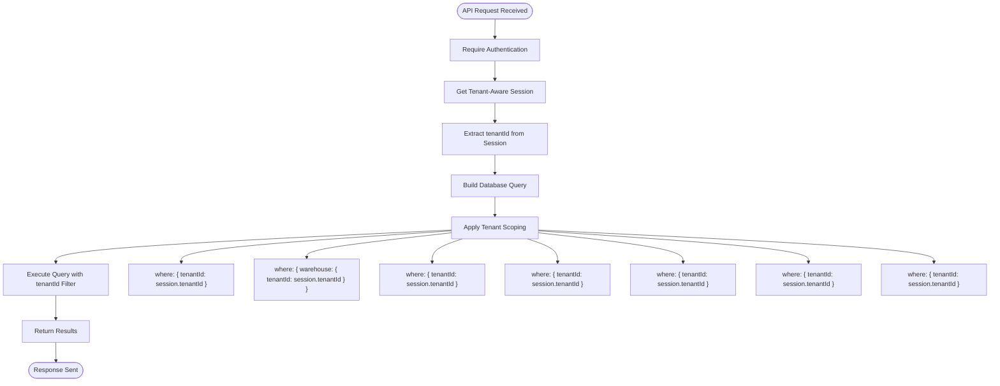

**Diagram sources**
- [warehouses/route.ts:14-22](file://app/api/accounting/warehouses/route.ts#L14-L22)
- [products/route.ts:60-104](file://app/api/accounting/products/route.ts#L60-L104)
- [stock/route.ts:19-32](file://app/api/accounting/stock/route.ts#L19-L32)

### Database Migration Strategy

The tenant architecture was introduced through carefully planned database migrations that maintain backward compatibility and include comprehensive provenance tracking:

```mermaid
timelineDiagram
title Tenant Architecture Migration Timeline
section Initial Schema
2026-03-13 : Add Tenant models<br/>Add TenantMembership<br/>Add TenantSettings
section Data Migration
2026-03-13 : Migrate existing warehouses<br/>Add tenantId column<br/>Set default tenant
section Provenance Restoration
2026-03-15 : Restore Document.tenantId provenance<br/>Restore Product.tenantId provenance<br/>Add ProductVariant.tenantId<br/>Create ProductCatalogProjection
section Data Integrity
2026-03-14 : Add Counterparty.tenantId<br/>Make Counterparty.tenantId NOT NULL
2026-03-15 : Add Payment.tenantId<br/>Make Payment.tenantId NOT NULL
section Index Creation
2026-03-13 : Create tenantId indexes<br/>Add foreign key constraints<br/>Enable tenant scoping
2026-03-17 : Add StockRecord.version<br/>Convert monetary fields to decimals
```

**Diagram sources**
- [20260313_add_tenant_architecture/migration.sql:1-78](file://prisma/migrations/20260313_add_tenant_architecture/migration.sql#L1-L78)
- [20260315_add_document_tenantId_provenance/migration.sql:1-39](file://prisma/migrations/20260315_add_document_tenantId_provenance/migration.sql#L1-L39)
- [20260315_add_product_tenantId_provenance/migration.sql:1-43](file://prisma/migrations/20260315_add_product_tenantId_provenance/migration.sql#L1-L43)
- [20260315_add_variant_tenant_and_catalog_projection/migration.sql:1-92](file://prisma/migrations/20260315_add_variant_tenant_and_catalog_projection/migration.sql#L1-L92)
- [20260314_add_counterparty_tenant_not_null/migration.sql:1-6](file://prisma/migrations/20260314_add_counterparty_tenant_not_null/migration.sql#L1-L6)
- [20260315162442_make_payment_tenant_required/migration.sql:1-6](file://prisma/migrations/20260315162442_make_payment_tenant_required/migration.sql#L1-L6)

**Section sources**
- [20260313_add_tenant_architecture/migration.sql:1-78](file://prisma/migrations/20260313_add_tenant_architecture/migration.sql#L1-L78)
- [20260313_add_warehouse_tenantId/migration.sql:1-15](file://prisma/migrations/20260313_add_warehouse_tenantId/migration.sql#L1-L15)
- [20260315_add_document_tenantId_provenance/migration.sql:1-39](file://prisma/migrations/20260315_add_document_tenantId_provenance/migration.sql#L1-L39)
- [20260315_add_product_tenantId_provenance/migration.sql:1-43](file://prisma/migrations/20260315_add_product_tenantId_provenance/migration.sql#L1-L43)
- [20260315_add_variant_tenant_and_catalog_projection/migration.sql:1-92](file://prisma/migrations/20260315_add_variant_tenant_and_catalog_projection/migration.sql#L1-L92)
- [20260314_add_counterparty_tenant_not_null/migration.sql:1-6](file://prisma/migrations/20260314_add_counterparty_tenant_not_null/migration.sql#L1-L6)
- [20260315162442_make_payment_tenant_required/migration.sql:1-6](file://prisma/migrations/20260315162442_make_payment_tenant_required/migration.sql#L1-L6)

## Migration Provenance Restoration

**New Section** The system now includes comprehensive migration provenance restoration to document historical schema changes that were initially added through database push operations rather than proper migrations.

### Provenance Restoration Process

Historical schema additions that lacked proper migration provenance are now documented through idempotent restoration migrations:

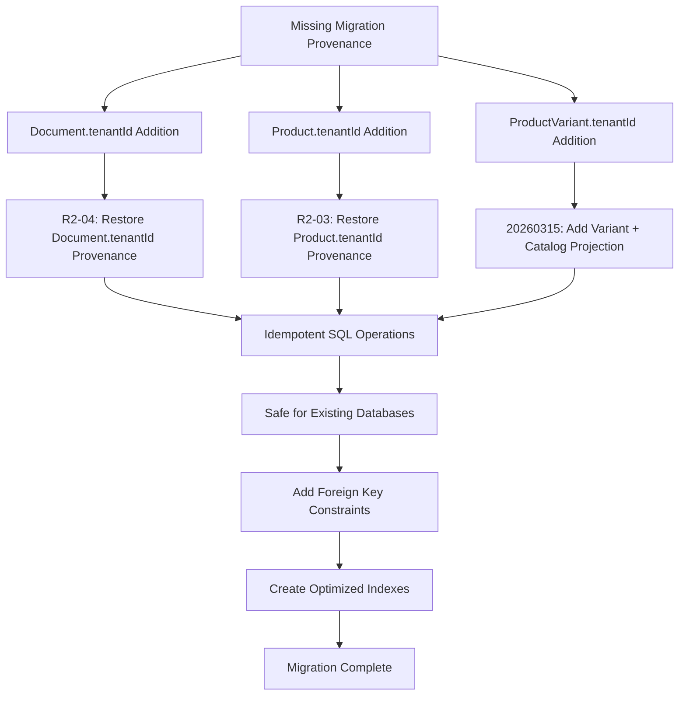

**Diagram sources**
- [20260315_add_document_tenantId_provenance/migration.sql:1-39](file://prisma/migrations/20260315_add_document_tenantId_provenance/migration.sql#L1-L39)
- [20260315_add_product_tenantId_provenance/migration.sql:1-43](file://prisma/migrations/20260315_add_product_tenantId_provenance/migration.sql#L1-L43)
- [20260315_add_variant_tenant_and_catalog_projection/migration.sql:1-92](file://prisma/migrations/20260315_add_variant_tenant_and_catalog_projection/migration.sql#L1-L92)

### Migration Safety Features

All provenance restoration migrations include comprehensive safety checks:

- **Idempotent Operations**: SQL statements that safely handle existing schemas
- **Foreign Key Constraint Checks**: Prevention of duplicate constraint creation
- **Index Existence Verification**: Avoidance of duplicate index creation
- **Conditional Execution**: DO $$ BEGIN ... END $$ blocks for safe constraint addition

**Section sources**
- [20260315_add_document_tenantId_provenance/migration.sql:1-39](file://prisma/migrations/20260315_add_document_tenantId_provenance/migration.sql#L1-L39)
- [20260315_add_product_tenantId_provenance/migration.sql:1-43](file://prisma/migrations/20260315_add_product_tenantId_provenance/migration.sql#L1-L43)
- [20260315_add_variant_tenant_and_catalog_projection/migration.sql:1-92](file://prisma/migrations/20260315_add_variant_tenant_and_catalog_projection/migration.sql#L1-L92)

## Backfill Scripts and Data Migration

**New Section** The system implements comprehensive backfill scripts to migrate existing data to the new tenant-aware schema, ensuring complete data integrity during the transition.

### Backfill Script Architecture

Each business entity requires specific backfill logic to populate tenant context:

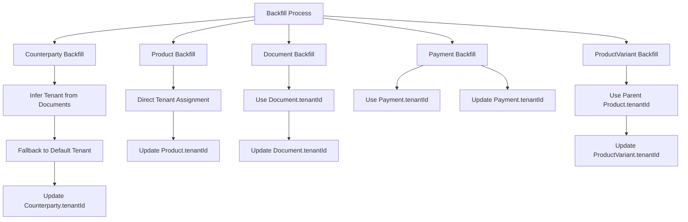

**Diagram sources**
- [backfill-counterparty-tenant.ts:35-122](file://scripts/backfill-counterparty-tenant.ts#L35-L122)
- [backfill-product-tenant.ts:1-100](file://scripts/backfill-product-tenant.ts#L1-L100)
- [backfill-document-tenant.ts:1-100](file://scripts/backfill-document-tenant.ts#L1-L100)
- [backfill-payment-tenant.ts:1-100](file://scripts/backfill-payment-tenant.ts#L1-L100)
- [backfill-product-variant-tenant.ts:1-100](file://scripts/backfill-product-variant-tenant.ts#L1-L100)

### Backfill Script Features

Each backfill script includes comprehensive error handling and statistics:

- **Idempotent Operations**: Scripts skip already processed records
- **Inference Logic**: Intelligent tenant assignment based on relationships
- **Fallback Mechanisms**: Default tenant assignment when inference fails
- **Progress Tracking**: Real-time progress monitoring and statistics
- **Error Recovery**: Graceful handling of individual record failures

**Section sources**
- [backfill-counterparty-tenant.ts:1-144](file://scripts/backfill-counterparty-tenant.ts#L1-L144)
- [backfill-product-tenant.ts:1-100](file://scripts/backfill-product-tenant.ts#L1-L100)
- [backfill-document-tenant.ts:1-100](file://scripts/backfill-document-tenant.ts#L1-L100)
- [backfill-payment-tenant.ts:1-100](file://scripts/backfill-payment-tenant.ts#L1-L100)
- [backfill-product-variant-tenant.ts:1-100](file://scripts/backfill-product-variant-tenant.ts#L1-L100)

## Enhanced API Enforcement

**New Section** The API layer now implements comprehensive tenant enforcement across all endpoints with consistent security patterns.

### API Route Enforcement Pattern

All API routes follow a standardized tenant enforcement pattern:

| Route Pattern | Tenant Enforcement Method | Security Level | Example |
|---------------|---------------------------|----------------|---------|
| GET /api/accounting/warehouses | `where: { tenantId: session.tenantId }` | High | [warehouses/route.ts:14-22](file://app/api/accounting/warehouses/route.ts#L14-L22) |
| GET /api/accounting/products | `tenantId: session.tenantId` parameter | High | [products/route.ts:19-22](file://app/api/accounting/products/route.ts#L19-L22) |
| GET /api/accounting/stock | Nested tenant scoping via warehouse relation | High | [stock/route.ts:19-32](file://app/api/accounting/stock/route.ts#L19-L32) |
| POST /api/accounting/documents | Transaction-level tenant assignment | Critical | [documents/route.ts:99-126](file://app/api/accounting/documents/route.ts#L99-L126) |
| POST /api/finance/payments | Direct tenantId assignment | Critical | [payments/route.ts:22-40](file://app/api/finance/payments/route.ts#L22-L40) |

### Transaction-Level Security

Critical operations implement transaction-level tenant enforcement:

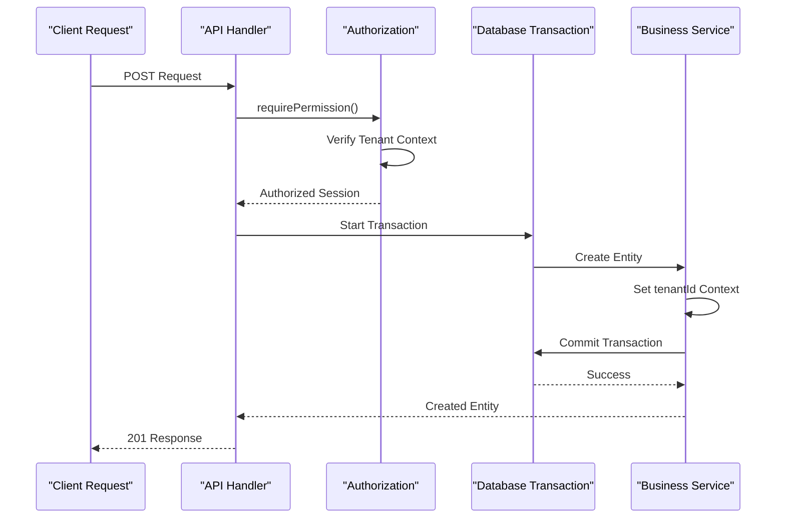

**Diagram sources**
- [products/route.ts:99-126](file://app/api/accounting/products/route.ts#L99-L126)

**Section sources**
- [warehouses/route.ts:1-42](file://app/api/accounting/warehouses/route.ts#L1-L42)
- [products/route.ts:1-139](file://app/api/accounting/products/route.ts#L1-L139)
- [stock/route.ts:1-32](file://app/api/accounting/stock/route.ts#L1-L32)

## Verification Gates and Data Integrity

**New Section** The system implements comprehensive verification gates to ensure data integrity during migration processes and prevent schema changes that could compromise tenant isolation.

### Verification Gate Architecture

Verification gates provide three-tier validation for critical schema changes:

```mermaid
flowchart TD
VerificationGate[Verification Gate] --> NullCheck[NULL Value Check]
VerificationGate --> FKIntegrity[Foreign Key Integrity Check]
VerificationGate --> CoverageCheck[Coverage Percentage Check]
NullCheck --> CounterpartyNull[Counterparty.tenantId NULL Check]
NullCheck --> ProductNull[Product.tenantId NULL Check]
NullCheck --> DocumentNull[Document.tenantId NULL Check]
NullCheck --> PaymentNull[Payment.tenantId NULL Check]
FKIntegrity --> CounterpartyFK[Counterparty.tenantId FK Check]
FKIntegrity --> ProductFK[Product.tenantId FK Check]
FKIntegrity --> DocumentFK[Document.tenantId FK Check]
FKIntegrity --> PaymentFK[Payment.tenantId FK Check]
CoverageCheck --> CounterpartyCoverage[100% Coverage Check]
CoverageCheck --> ProductCoverage[100% Coverage Check]
CoverageCheck --> DocumentCoverage[100% Coverage Check]
CoverageCheck --> PaymentCoverage[100% Coverage Check]
CounterpartyNull --> GateResult[Gate Result]
ProductNull --> GateResult
DocumentNull --> GateResult
PaymentNull --> GateResult
CounterpartyFK --> GateResult
ProductFK --> GateResult
DocumentFK --> GateResult
PaymentFK --> GateResult
CounterpartyCoverage --> GateResult
ProductCoverage --> GateResult
DocumentCoverage --> GateResult
PaymentCoverage --> GateResult
```

**Diagram sources**
- [verify-counterparty-tenant-gate.ts:32-115](file://scripts/verify-counterparty-tenant-gate.ts#L32-L115)
- [verify-product-tenant-gate.ts:1-100](file://scripts/verify-product-tenant-gate.ts#L1-L100)
- [verify-document-tenant-gate.ts:1-100](file://scripts/verify-document-tenant-gate.ts#L1-L100)
- [verify-payment-tenant-gate.ts:1-100](file://scripts/verify-payment-tenant-gate.ts#L1-L100)

### Gate Implementation Details

Each verification gate includes comprehensive error reporting and remediation guidance:

- **Comprehensive Counting**: Detailed statistics on affected records
- **Specific Error Reporting**: Precise identification of problematic records
- **Automated Remediation Steps**: Actionable steps for fixing issues
- **Exit Code Management**: Proper exit codes for CI/CD integration
- **Logging and Monitoring**: Comprehensive audit trails for compliance

**Section sources**
- [verify-counterparty-tenant-gate.ts:1-166](file://scripts/verify-counterparty-tenant-gate.ts#L1-L166)
- [verify-product-tenant-gate.ts:1-100](file://scripts/verify-product-tenant-gate.ts#L1-L100)
- [verify-document-tenant-gate.ts:1-100](file://scripts/verify-document-tenant-gate.ts#L1-L100)
- [verify-payment-tenant-gate.ts:1-100](file://scripts/verify-payment-tenant-gate.ts#L1-L100)

## Detailed Component Analysis

### Tenant Membership Resolution

The membership resolution system handles the complex logic of determining which tenant a user belongs to and whether they have active access with enhanced error handling:

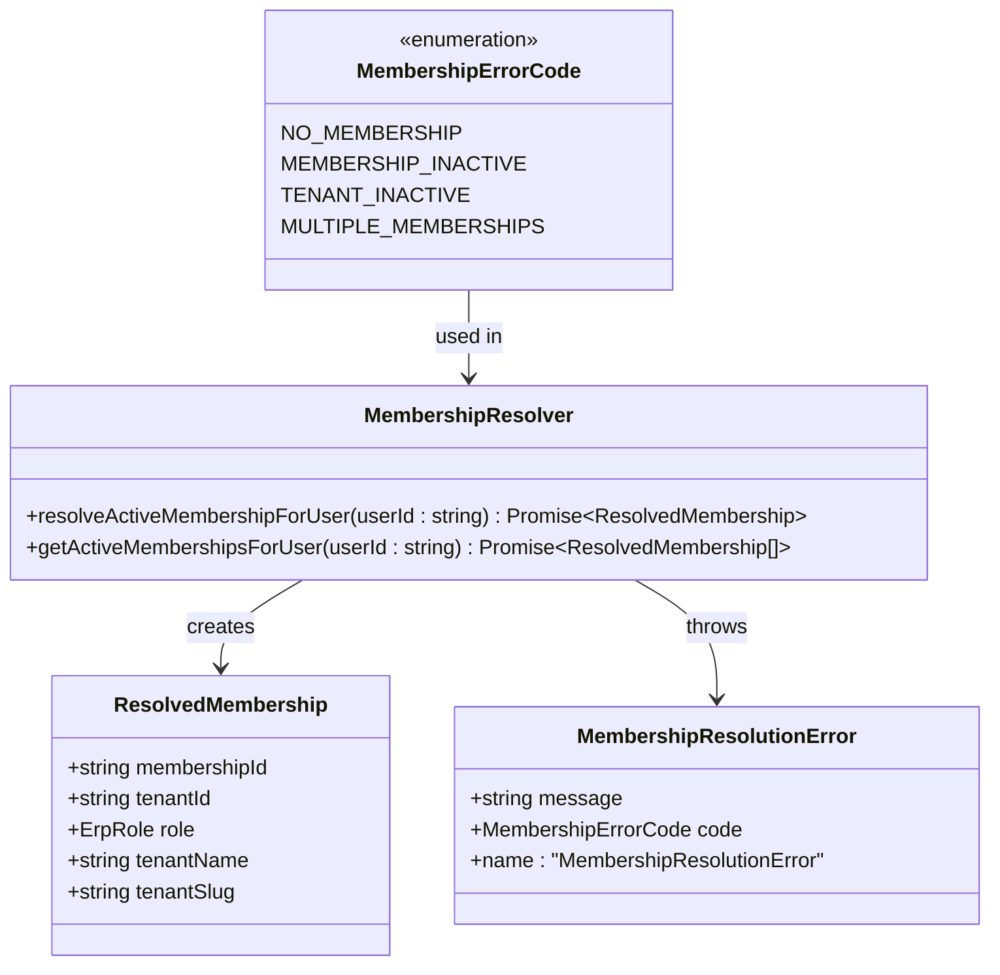

**Diagram sources**
- [resolve-membership.ts:16-53](file://lib/modules/auth/resolve-membership.ts#L16-L53)
- [resolve-membership.ts:73-177](file://lib/modules/auth/resolve-membership.ts#L73-L177)

### Authorization and Permission System

The authorization system integrates tenant context with role-based access control and enhanced security enforcement:

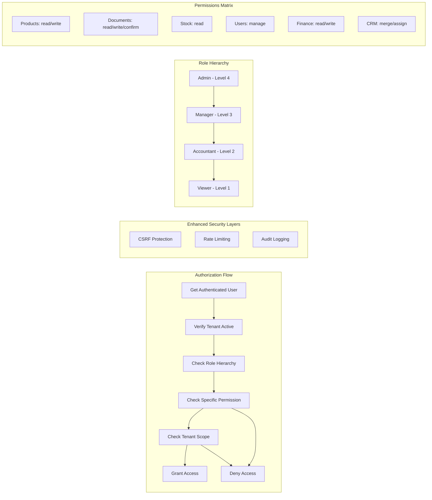

**Diagram sources**
- [authorization.ts:11-91](file://lib/shared/authorization.ts#L11-L91)
- [authorization.ts:114-144](file://lib/shared/authorization.ts#L114-L144)

**Section sources**
- [resolve-membership.ts:1-178](file://lib/modules/auth/resolve-membership.ts#L1-L178)
- [authorization.ts:1-172](file://lib/shared/authorization.ts#L1-L172)

### Middleware and Request Processing

The middleware layer implements comprehensive request filtering and authentication with enhanced security measures:

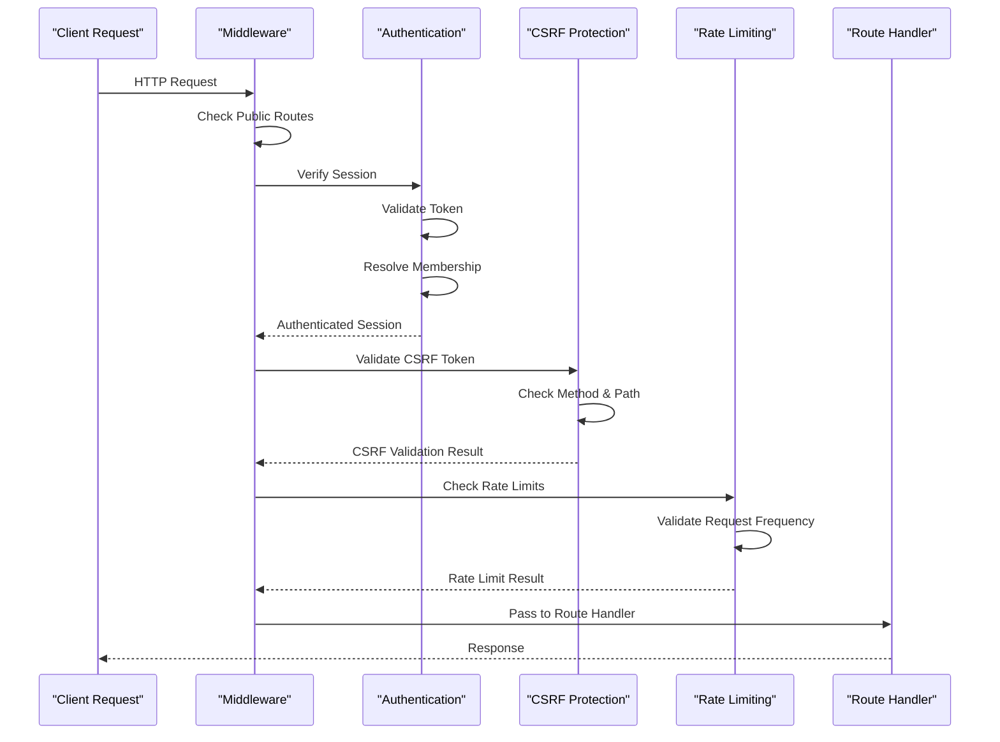

**Diagram sources**
- [middleware.ts:58-164](file://middleware.ts#L58-L164)

**Section sources**
- [middleware.ts:1-169](file://middleware.ts#L1-L169)

## Dependency Analysis

The multi-tenant architecture establishes clear dependency relationships between components with enhanced security dependencies:

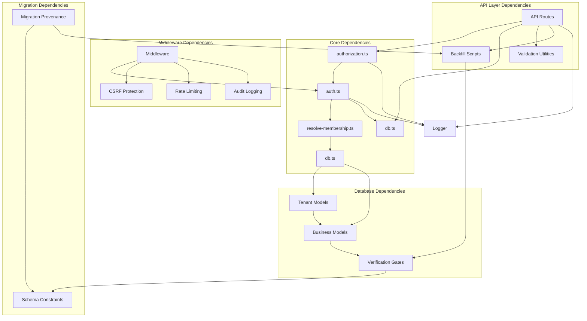

**Diagram sources**
- [auth.ts:1-180](file://lib/shared/auth.ts#L1-L180)
- [resolve-membership.ts:1-178](file://lib/modules/auth/resolve-membership.ts#L1-L178)
- [authorization.ts:1-172](file://lib/shared/authorization.ts#L1-L172)
- [db.ts:1-35](file://lib/shared/db.ts#L1-L35)

**Section sources**
- [auth.ts:1-180](file://lib/shared/auth.ts#L1-L180)
- [resolve-membership.ts:1-178](file://lib/modules/auth/resolve-membership.ts#L1-L178)
- [authorization.ts:1-172](file://lib/shared/authorization.ts#L1-L172)
- [db.ts:1-35](file://lib/shared/db.ts#L1-L35)

## Performance Considerations

### Database Indexing Strategy

The tenant architecture leverages strategic indexing to maintain performance at scale with enhanced optimization:

- **TenantMembership**: Unique index on `(userId, tenantId)` for fast membership lookup
- **Warehouse**: Index on `tenantId` for efficient tenant-scoped queries
- **Product**: Composite indexes on `(tenantId, isActive)` and `(tenantId, categoryId)` for optimized filtering
- **Document**: Composite indexes on `(tenantId, type, status, date)` and `(tenantId, counterpartyId)` for query optimization
- **ProductVariant**: Index on `(tenantId)` and unique constraint on `(tenantId, sku)` for SKU uniqueness
- **Counterparty**: Index on `(tenantId)` for efficient tenant-scoped operations
- **Payment**: Index on `(tenantId)` for optimized payment queries

### Caching Strategy

The system implements intelligent caching for frequently accessed tenant data with enhanced security:

- **Session Cache**: Short-term caching of user sessions to reduce database load
- **Membership Cache**: Cached membership resolution results for active users
- **Permission Cache**: Pre-computed permission sets for tenant users
- **Catalog Projection Cache**: Cached product catalog projections for e-commerce operations

### Query Optimization

All tenant-scoped queries follow optimized patterns with enhanced performance:

- **Nested Queries**: Use of nested where clauses to minimize joins
- **Selective Loading**: Include only necessary fields to reduce payload size
- **Pagination**: Built-in pagination support for large datasets
- **Index Utilization**: Strategic use of composite indexes for common query patterns
- **Transaction Batching**: Efficient batch operations for bulk data processing

## Troubleshooting Guide

### Common Issues and Solutions

#### Membership Resolution Failures

**Issue**: Users receive "no access to organizations" errors
**Cause**: User has no tenant memberships or memberships are inactive
**Solution**: Verify user membership records and ensure tenant is active

#### Tenant Scoping Issues

**Issue**: Users can see data from other tenants
**Cause**: Missing tenant scoping in API route queries
**Solution**: Ensure all database queries include tenant filtering

#### Authentication Problems

**Issue**: Session validation fails intermittently
**Cause**: Expired tokens or invalid signatures
**Solution**: Check SESSION_SECRET environment variable and token expiration

#### Migration Provenance Issues

**Issue**: Schema changes appear inconsistent across environments
**Cause**: Missing migration provenance for historical schema additions
**Solution**: Run provenance restoration migrations to document schema evolution

#### Backfill Script Failures

**Issue**: Data migration incomplete or partially processed
**Cause**: Script errors or database connectivity issues
**Solution**: Check script logs, verify database connectivity, and rerun with error handling

#### Verification Gate Failures

**Issue**: Migration blocked by verification gate
**Cause**: Data integrity issues preventing schema changes
**Solution**: Use verification scripts to identify and fix data issues, then retry

**Section sources**
- [resolve-membership.ts:86-115](file://lib/modules/auth/resolve-membership.ts#L86-L115)
- [auth.ts:105-144](file://lib/shared/auth.ts#L105-L144)
- [verify-counterparty-tenant-gate.ts:117-163](file://scripts/verify-counterparty-tenant-gate.ts#L117-L163)

### Debugging Tools

The system provides comprehensive logging for troubleshooting with enhanced monitoring:

- **Membership Resolution Logs**: Detailed logs for membership failure cases
- **Authentication Logs**: Session creation and validation traces
- **Authorization Logs**: Permission checking and access control events
- **Migration Logs**: Comprehensive migration execution traces
- **Backfill Script Logs**: Detailed progress and error reporting
- **Verification Gate Logs**: Complete validation result documentation

## Conclusion

The ListOpt ERP multi-tenant architecture provides a robust foundation for supporting multiple organizations within a single application instance. Through careful design of tenant models, authentication mechanisms, and consistent tenant scoping patterns, the system ensures complete data isolation while maintaining operational efficiency.

**Updated** The enhanced architecture now includes comprehensive migration provenance restoration, automated backfill scripts, verification gates, and API enforcement patterns that provide complete tenant isolation across all core modules.

Key architectural strengths include:

- **Complete Data Isolation**: All tenant data is automatically scoped to prevent cross-tenant access
- **Flexible Role-Based Access Control**: Granular permissions with tenant-aware context
- **Scalable Design**: Modular architecture supports easy addition of new tenants and features
- **Performance Optimization**: Strategic indexing and caching minimize overhead
- **Comprehensive Security**: Multi-layered protection including CSRF and rate limiting
- **Data Integrity Assurance**: Verification gates ensure schema changes maintain data consistency
- **Migration Provenance**: Historical schema changes are properly documented and restored
- **Automated Data Migration**: Backfill scripts ensure smooth transition to tenant-aware schema
- **API Enforcement**: Consistent tenant enforcement across all application endpoints

The implementation demonstrates best practices for multi-tenant SaaS applications, providing a solid foundation for future enhancements and additional tenant management features. The comprehensive verification and backfill systems ensure reliable operation during schema migrations and data transitions, while the provenance restoration system maintains complete audit trails for compliance and debugging purposes.