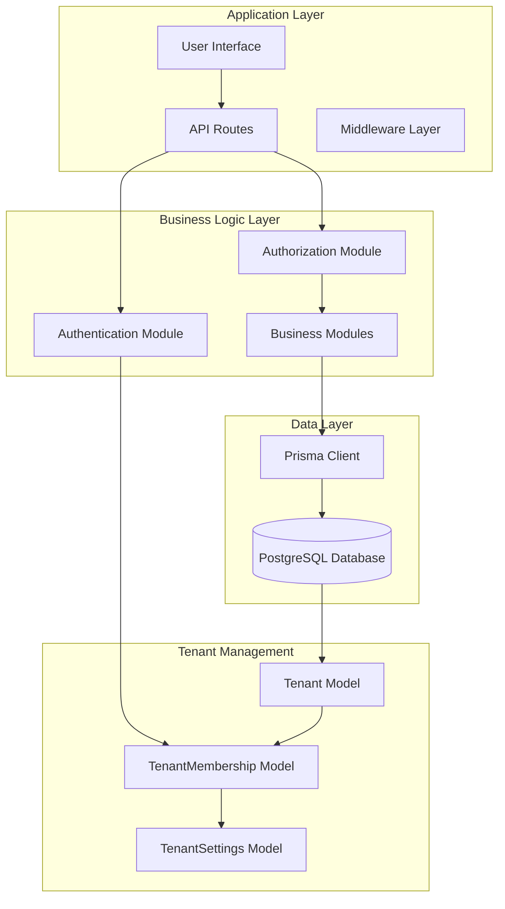
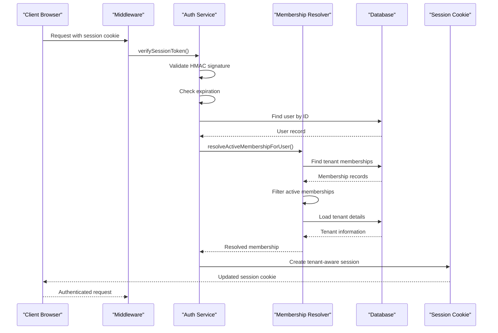
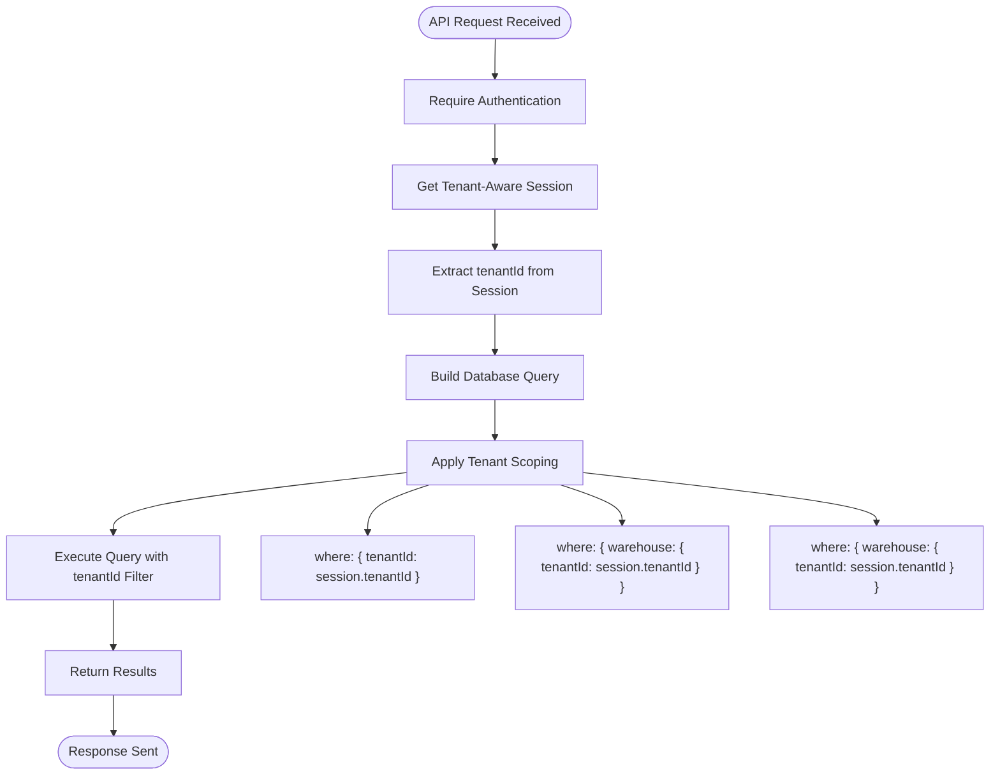
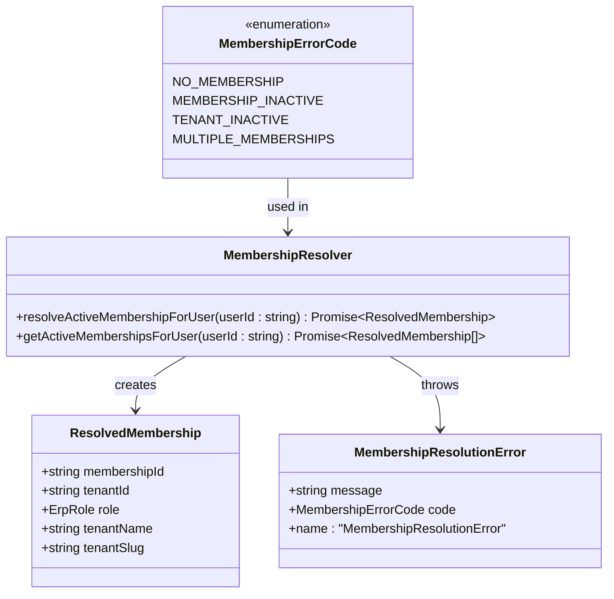
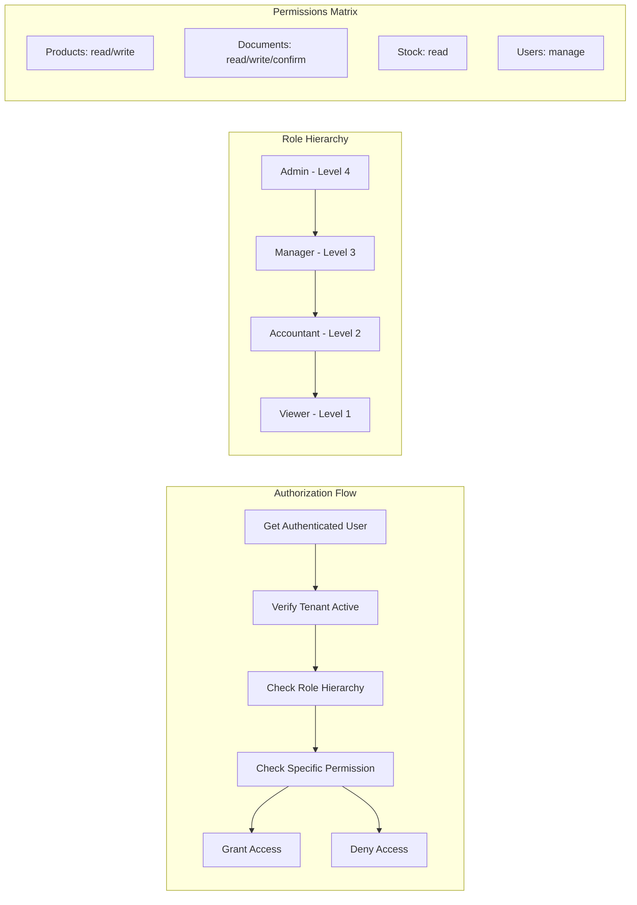
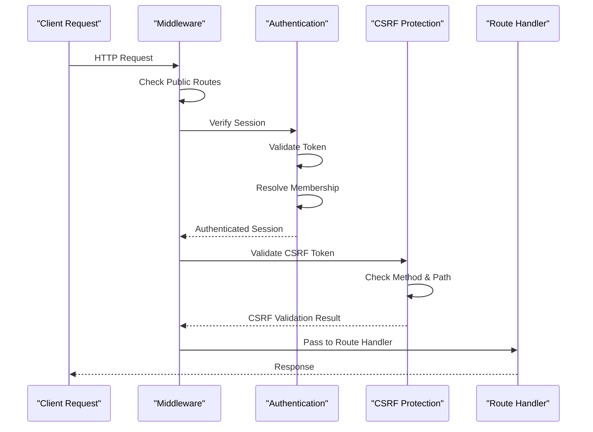
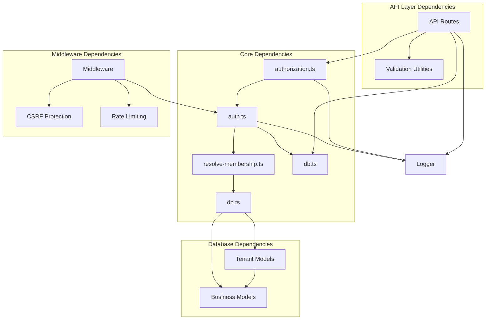

# Multi-Tenant Architecture

<cite>
**Referenced Files in This Document**
- [schema.prisma](file://prisma/schema.prisma)
- [20260313_add_tenant_architecture/migration.sql](file://prisma/migrations/20260313_add_tenant_architecture/migration.sql)
- [20260313_add_warehouse_tenantId/migration.sql](file://prisma/migrations/20260313_add_warehouse_tenantId/migration.sql)
- [ARCHITECTURE.md](file://ARCHITECTURE.md)
- [middleware.ts](file://middleware.ts)
- [resolve-membership.ts](file://lib/modules/auth/resolve-membership.ts)
- [auth.ts](file://lib/shared/auth.ts)
- [authorization.ts](file://lib/shared/authorization.ts)
- [db.ts](file://lib/shared/db.ts)
- [warehouses/route.ts](file://app/api/accounting/warehouses/route.ts)
- [stock/route.ts](file://app/api/accounting/stock/route.ts)
- [delivery.ts](file://lib/modules/ecommerce/delivery.ts)
- [factories.ts](file://tests/helpers/factories.ts)
</cite>

## Table of Contents
1. [Introduction](#introduction)
2. [Project Structure](#project-structure)
3. [Core Components](#core-components)
4. [Architecture Overview](#architecture-overview)
5. [Detailed Component Analysis](#detailed-component-analysis)
6. [Dependency Analysis](#dependency-analysis)
7. [Performance Considerations](#performance-considerations)
8. [Troubleshooting Guide](#troubleshooting-guide)
9. [Conclusion](#conclusion)

## Introduction

This document provides comprehensive documentation for the Multi-Tenant Architecture implemented in the ListOpt ERP system. The architecture enables multiple organizations (tenants) to operate independently within a single application instance while maintaining complete data isolation and separate operational contexts.

The system implements a robust tenant scoping mechanism that ensures all database operations are automatically constrained to the authenticated user's tenant context, preventing cross-tenant data leakage and maintaining strict separation of concerns across all business domains including accounting, inventory management, and e-commerce operations.

## Project Structure

The multi-tenant architecture is built on a modular Next.js application structure with clear separation between tenant-aware business logic and shared infrastructure components.



**Diagram sources**
- [ARCHITECTURE.md:1-308](file://ARCHITECTURE.md#L1-L308)
- [schema.prisma:47-114](file://prisma/schema.prisma#L47-L114)

**Section sources**
- [ARCHITECTURE.md:1-308](file://ARCHITECTURE.md#L1-L308)

## Core Components

### Tenant Model and Relationships

The tenant architecture is built around three core models that establish the foundation for multi-tenancy:

```mermaid
erDiagram
TENANT {
string id PK
string name
string slug UK
boolean isActive
datetime createdAt
datetime updatedAt
}
TENANT_MEMBERSHIP {
string id PK
string tenantId FK
string userId FK
enum role
boolean isActive
datetime createdAt
}
TENANT_SETTINGS {
string id PK
string tenantId UK FK
string name
string inn
string kpp
string ogrn
string taxRegime
float vatRate
float usnRate
float initialCapital
datetime initialCapitalDate
int fiscalYearStartMonth
}
USER {
string id PK
string username UK
string password
string email UK
enum role
boolean isActive
datetime createdAt
datetime updatedAt
}
WAREHOUSE {
string id PK
string tenantId FK
string name
string address
string responsibleName
boolean isActive
datetime createdAt
datetime updatedAt
}
TENANT ||--o{ TENANT_MEMBERSHIP : "has"
TENANT ||--o| TENANT_SETTINGS : "has"
USER ||--o{ TENANT_MEMBERSHIP : "belongs_to"
TENANT ||--o{ WAREHOUSE : "owns"
```

**Diagram sources**
- [schema.prisma:47-114](file://prisma/schema.prisma#L47-L114)
- [schema.prisma:451-469](file://prisma/schema.prisma#L451-L469)

### Authentication and Session Management

The authentication system implements tenant-aware session management through a sophisticated token verification and membership resolution process:



**Diagram sources**
- [auth.ts:89-148](file://lib/shared/auth.ts#L89-L148)
- [resolve-membership.ts:73-141](file://lib/modules/auth/resolve-membership.ts#L73-L141)

**Section sources**
- [schema.prisma:47-114](file://prisma/schema.prisma#L47-L114)
- [auth.ts:1-154](file://lib/shared/auth.ts#L1-L154)
- [resolve-membership.ts:1-178](file://lib/modules/auth/resolve-membership.ts#L1-L178)

## Architecture Overview

The multi-tenant architecture follows a comprehensive approach to ensure data isolation and tenant separation across all application layers:

### Tenant Scoping Implementation

All database queries are automatically scoped to the authenticated user's tenant context through a consistent pattern implemented across all API routes:



**Diagram sources**
- [warehouses/route.ts:14-22](file://app/api/accounting/warehouses/route.ts#L14-L22)
- [stock/route.ts:19-32](file://app/api/accounting/stock/route.ts#L19-L32)

### Database Migration Strategy

The tenant architecture was introduced through carefully planned database migrations that maintain backward compatibility:

```mermaid
timelineDiagram
title Tenant Architecture Migration Timeline
section Initial Schema
2026-03-13 : Add Tenant models<br/>Add TenantMembership<br/>Add TenantSettings
section Data Migration
2026-03-13 : Migrate existing warehouses<br/>Add tenantId column<br/>Set default tenant
section Index Creation
2026-03-13 : Create tenantId indexes<br/>Add foreign key constraints<br/>Enable tenant scoping
```

**Diagram sources**
- [20260313_add_tenant_architecture/migration.sql:1-78](file://prisma/migrations/20260313_add_tenant_architecture/migration.sql#L1-L78)
- [20260313_add_warehouse_tenantId/migration.sql:1-15](file://prisma/migrations/20260313_add_warehouse_tenantId/migration.sql#L1-L15)

**Section sources**
- [20260313_add_tenant_architecture/migration.sql:1-78](file://prisma/migrations/20260313_add_tenant_architecture/migration.sql#L1-L78)
- [20260313_add_warehouse_tenantId/migration.sql:1-15](file://prisma/migrations/20260313_add_warehouse_tenantId/migration.sql#L1-L15)

## Detailed Component Analysis

### Tenant Membership Resolution

The membership resolution system handles the complex logic of determining which tenant a user belongs to and whether they have active access:



**Diagram sources**
- [resolve-membership.ts:16-53](file://lib/modules/auth/resolve-membership.ts#L16-L53)
- [resolve-membership.ts:73-177](file://lib/modules/auth/resolve-membership.ts#L73-L177)

### Authorization and Permission System

The authorization system integrates tenant context with role-based access control:



**Diagram sources**
- [authorization.ts:11-91](file://lib/shared/authorization.ts#L11-L91)
- [authorization.ts:114-144](file://lib/shared/authorization.ts#L114-L144)

**Section sources**
- [resolve-membership.ts:1-178](file://lib/modules/auth/resolve-membership.ts#L1-L178)
- [authorization.ts:1-169](file://lib/shared/authorization.ts#L1-L169)

### API Route Implementation Pattern

All API routes follow a consistent tenant scoping pattern:

| Route Pattern | Tenant Scoping Method | Example |
|---------------|----------------------|---------|
| GET /api/accounting/warehouses | `where: { tenantId: session.tenantId }` | [warehouses/route.ts:14-22](file://app/api/accounting/warehouses/route.ts#L14-L22) |
| GET /api/accounting/stock | `where: { warehouse: { tenantId: session.tenantId } }` | [stock/route.ts:19-32](file://app/api/accounting/stock/route.ts#L19-L32) |
| GET /api/accounting/products | `include: { warehouse: { where: { tenantId: session.tenantId } } }` | [products/route.ts:60-104](file://app/api/accounting/products/route.ts#L60-L104) |

**Section sources**
- [warehouses/route.ts:1-51](file://app/api/accounting/warehouses/route.ts#L1-L51)
- [stock/route.ts:1-32](file://app/api/accounting/stock/route.ts#L1-L32)
- [products/route.ts:1-226](file://app/api/accounting/products/route.ts#L1-L226)

### Middleware and Request Processing

The middleware layer implements comprehensive request filtering and authentication:



**Diagram sources**
- [middleware.ts:58-164](file://middleware.ts#L58-L164)

**Section sources**
- [middleware.ts:1-169](file://middleware.ts#L1-L169)

## Dependency Analysis

The multi-tenant architecture establishes clear dependency relationships between components:



**Diagram sources**
- [auth.ts:1-154](file://lib/shared/auth.ts#L1-L154)
- [resolve-membership.ts:1-178](file://lib/modules/auth/resolve-membership.ts#L1-L178)
- [authorization.ts:1-169](file://lib/shared/authorization.ts#L1-L169)
- [db.ts:1-25](file://lib/shared/db.ts#L1-L25)

**Section sources**
- [auth.ts:1-154](file://lib/shared/auth.ts#L1-L154)
- [resolve-membership.ts:1-178](file://lib/modules/auth/resolve-membership.ts#L1-L178)
- [authorization.ts:1-169](file://lib/shared/authorization.ts#L1-L169)
- [db.ts:1-25](file://lib/shared/db.ts#L1-L25)

## Performance Considerations

### Database Indexing Strategy

The tenant architecture leverages strategic indexing to maintain performance at scale:

- **TenantMembership**: Unique index on `(userId, tenantId)` for fast membership lookup
- **Warehouse**: Index on `tenantId` for efficient tenant-scoped queries
- **User**: Index on `isActive` for authentication filtering
- **Product**: Composite indexes on `(categoryId, isActive)` and `(masterProductId, variantGroupName)`

### Caching Strategy

The system implements intelligent caching for frequently accessed tenant data:

- **Session Cache**: Short-term caching of user sessions to reduce database load
- **Membership Cache**: Cached membership resolution results for active users
- **Permission Cache**: Pre-computed permission sets for tenant users

### Query Optimization

All tenant-scoped queries follow optimized patterns:

- **Nested Queries**: Use of nested where clauses to minimize joins
- **Selective Loading**: Include only necessary fields to reduce payload size
- **Pagination**: Built-in pagination support for large datasets

## Troubleshooting Guide

### Common Issues and Solutions

#### Membership Resolution Failures

**Issue**: Users receive "no access to organizations" errors
**Cause**: User has no tenant memberships or memberships are inactive
**Solution**: Verify user membership records and ensure tenant is active

#### Tenant Scoping Issues

**Issue**: Users can see data from other tenants
**Cause**: Missing tenant scoping in API route queries
**Solution**: Ensure all database queries include tenant filtering

#### Authentication Problems

**Issue**: Session validation fails intermittently
**Cause**: Expired tokens or invalid signatures
**Solution**: Check SESSION_SECRET environment variable and token expiration

**Section sources**
- [resolve-membership.ts:86-115](file://lib/modules/auth/resolve-membership.ts#L86-L115)
- [auth.ts:105-144](file://lib/shared/auth.ts#L105-L144)

### Debugging Tools

The system provides comprehensive logging for troubleshooting:

- **Membership Resolution Logs**: Detailed logs for membership failure cases
- **Authentication Logs**: Session creation and validation traces
- **Authorization Logs**: Permission checking and access control events

## Conclusion

The ListOpt ERP multi-tenant architecture provides a robust foundation for supporting multiple organizations within a single application instance. Through careful design of tenant models, authentication mechanisms, and consistent tenant scoping patterns, the system ensures complete data isolation while maintaining operational efficiency.

Key architectural strengths include:

- **Complete Data Isolation**: All tenant data is automatically scoped to prevent cross-tenant access
- **Flexible Role-Based Access Control**: Granular permissions with tenant-aware context
- **Scalable Design**: Modular architecture supports easy addition of new tenants and features
- **Performance Optimization**: Strategic indexing and caching minimize overhead
- **Comprehensive Security**: Multi-layered protection including CSRF and rate limiting

The implementation demonstrates best practices for multi-tenant SaaS applications, providing a solid foundation for future enhancements and additional tenant management features.