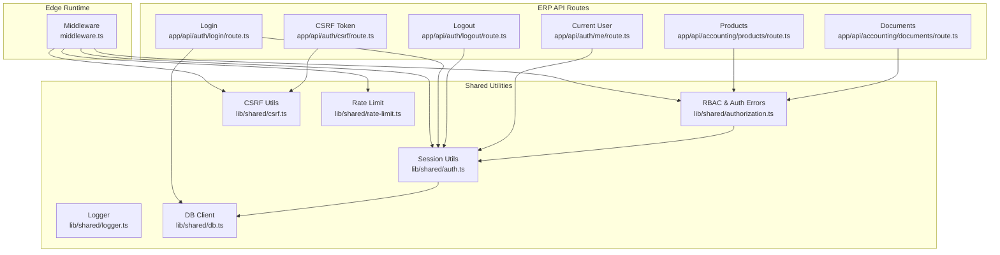
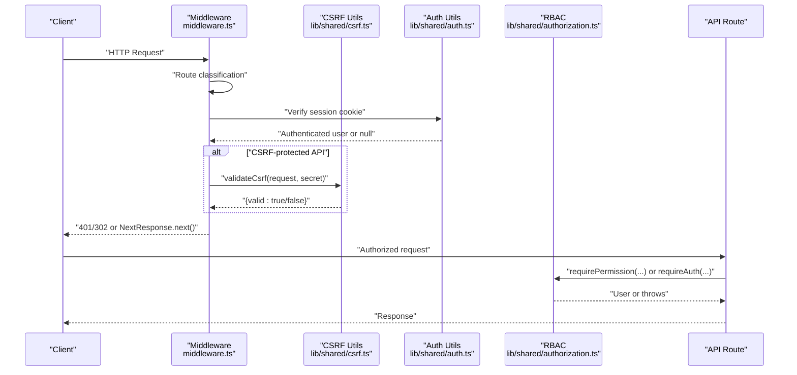
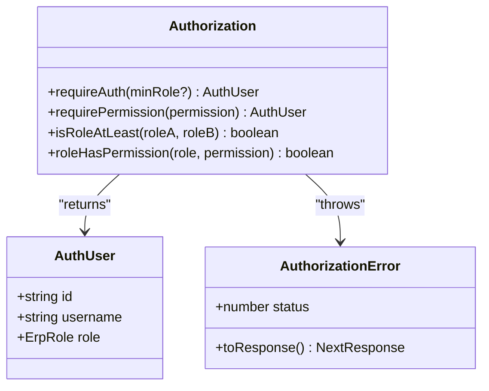
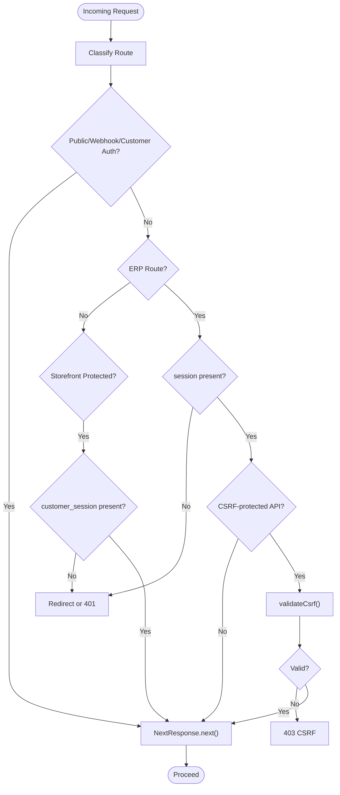
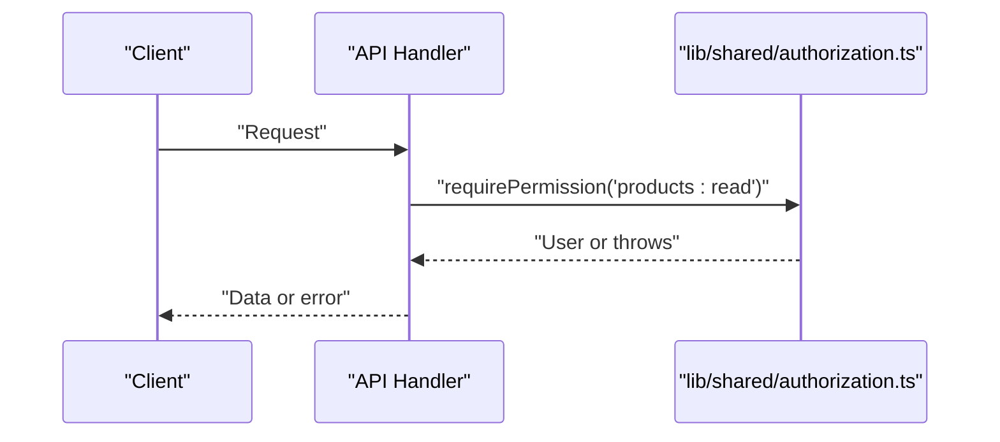
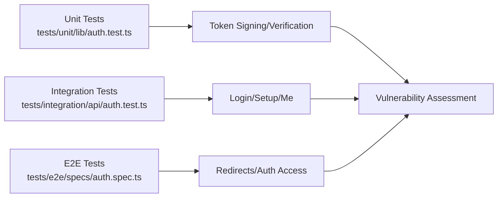
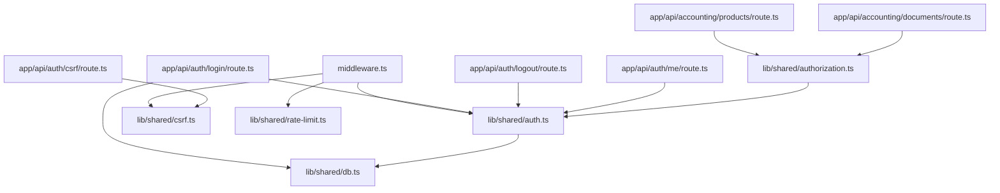

# Security Architecture

<cite>
**Referenced Files in This Document**
- [middleware.ts](file://middleware.ts)
- [auth.ts](file://lib/shared/auth.ts)
- [authorization.ts](file://lib/shared/authorization.ts)
- [csrf.ts](file://lib/shared/csrf.ts)
- [rate-limit.ts](file://lib/shared/rate-limit.ts)
- [logger.ts](file://lib/shared/logger.ts)
- [db.ts](file://lib/shared/db.ts)
- [login.route.ts](file://app/api/auth/login/route.ts)
- [logout.route.ts](file://app/api/auth/logout/route.ts)
- [me.route.ts](file://app/api/auth/me/route.ts)
- [csrf.route.ts](file://app/api/auth/csrf/route.ts)
- [products.route.ts](file://app/api/accounting/products/route.ts)
- [documents.route.ts](file://app/api/accounting/documents/route.ts)
- [next.config.ts](file://next.config.ts)
- [package.json](file://package.json)
- [auth.test.ts](file://tests/unit/lib/auth.test.ts)
- [auth.integration.test.ts](file://tests/integration/api/auth.test.ts)
- [auth.e2e.spec.ts](file://tests/e2e/specs/auth.spec.ts)
</cite>

## Table of Contents
1. [Introduction](#introduction)
2. [Project Structure](#project-structure)
3. [Core Components](#core-components)
4. [Architecture Overview](#architecture-overview)
5. [Detailed Component Analysis](#detailed-component-analysis)
6. [Dependency Analysis](#dependency-analysis)
7. [Performance Considerations](#performance-considerations)
8. [Troubleshooting Guide](#troubleshooting-guide)
9. [Conclusion](#conclusion)
10. [Appendices](#appendices)

## Introduction
This document describes the security architecture of ListOpt ERP, focusing on authentication and session management, role-based access control (RBAC), middleware-driven request enforcement, CSRF protection, secure cookie configuration, authorization patterns in API routes, secure coding practices, encryption and secure communication, audit logging, security testing strategies, and deployment considerations. The implementation relies on a custom session token scheme, a lightweight RBAC model, Next.js middleware for enforcement, and a dedicated CSRF protection mechanism.

## Project Structure
Security-related logic is organized across middleware, shared utilities, and API routes:
- Middleware enforces authentication, CSRF checks, and redirects for ERP and storefront contexts.
- Shared utilities implement session signing/verification, RBAC, CSRF token generation/signing/verification, rate limiting, and logging.
- API routes apply authorization checks and return standardized responses.
- Next.js configuration adds security headers.
- Tests validate session security, auth flows, and CSRF protections.



**Diagram sources**
- [middleware.ts:58-164](file://middleware.ts#L58-L164)
- [auth.ts:18-83](file://lib/shared/auth.ts#L18-L83)
- [authorization.ts:105-135](file://lib/shared/authorization.ts#L105-L135)
- [csrf.ts:47-101](file://lib/shared/csrf.ts#L47-L101)
- [rate-limit.ts:58-96](file://lib/shared/rate-limit.ts#L58-L96)
- [logger.ts:17-35](file://lib/shared/logger.ts#L17-L35)
- [db.ts:5-24](file://lib/shared/db.ts#L5-L24)
- [login.route.ts:9-59](file://app/api/auth/login/route.ts#L9-L59)
- [logout.route.ts:4-21](file://app/api/auth/logout/route.ts#L4-L21)
- [me.route.ts:4-10](file://app/api/auth/me/route.ts#L4-L10)
- [csrf.route.ts:14-41](file://app/api/auth/csrf/route.ts#L14-L41)
- [products.route.ts:7-145](file://app/api/accounting/products/route.ts#L7-L145)
- [documents.route.ts:8-135](file://app/api/accounting/documents/route.ts#L8-L135)

**Section sources**
- [middleware.ts:58-164](file://middleware.ts#L58-L164)
- [auth.ts:18-83](file://lib/shared/auth.ts#L18-L83)
- [authorization.ts:105-135](file://lib/shared/authorization.ts#L105-L135)
- [csrf.ts:47-101](file://lib/shared/csrf.ts#L47-L101)
- [rate-limit.ts:58-96](file://lib/shared/rate-limit.ts#L58-L96)
- [logger.ts:17-35](file://lib/shared/logger.ts#L17-L35)
- [db.ts:5-24](file://lib/shared/db.ts#L5-L24)
- [login.route.ts:9-59](file://app/api/auth/login/route.ts#L9-L59)
- [logout.route.ts:4-21](file://app/api/auth/logout/route.ts#L4-L21)
- [me.route.ts:4-10](file://app/api/auth/me/route.ts#L4-L10)
- [csrf.route.ts:14-41](file://app/api/auth/csrf/route.ts#L14-L41)
- [products.route.ts:7-145](file://app/api/accounting/products/route.ts#L7-L145)
- [documents.route.ts:8-135](file://app/api/accounting/documents/route.ts#L8-L135)
- [next.config.ts:14-25](file://next.config.ts#L14-L25)
- [package.json:34-84](file://package.json#L34-L84)

## Core Components
- Session Management: Custom signed tokens with expiration and HMAC signature; stored in HttpOnly cookies.
- Authentication: Login validates credentials, sets session cookie; Logout clears session and CSRF cookies.
- RBAC: Role hierarchy and permission matrix; requireAuth and requirePermission enforce access.
- CSRF Protection: Signed CSRF cookie and token validation for state-changing requests.
- Middleware Enforcement: Centralized routing, authentication, CSRF, and redirect logic.
- Logging and Auditing: Structured logs for auth events and CSRF failures.
- Rate Limiting: In-memory rate limiter for basic protection (single instance).
- Secure Headers: Next.js headers block common browser exploits.

**Section sources**
- [auth.ts:18-83](file://lib/shared/auth.ts#L18-L83)
- [login.route.ts:37-50](file://app/api/auth/login/route.ts#L37-L50)
- [logout.route.ts:6-19](file://app/api/auth/logout/route.ts#L6-L19)
- [authorization.ts:9-135](file://lib/shared/authorization.ts#L9-L135)
- [csrf.ts:47-101](file://lib/shared/csrf.ts#L47-L101)
- [middleware.ts:58-164](file://middleware.ts#L58-L164)
- [logger.ts:17-35](file://lib/shared/logger.ts#L17-L35)
- [rate-limit.ts:58-96](file://lib/shared/rate-limit.ts#L58-L96)
- [next.config.ts:14-25](file://next.config.ts#L14-L25)

## Architecture Overview
The system enforces security at the edge via middleware, authenticates users with signed session tokens, and applies RBAC at the API boundary. CSRF protection is enforced for state-changing API requests. Secure cookies and headers mitigate common attack vectors.



**Diagram sources**
- [middleware.ts:58-164](file://middleware.ts#L58-L164)
- [csrf.ts:126-163](file://lib/shared/csrf.ts#L126-L163)
- [auth.ts:62-83](file://lib/shared/auth.ts#L62-L83)
- [authorization.ts:105-135](file://lib/shared/authorization.ts#L105-L135)
- [products.route.ts:9-145](file://app/api/accounting/products/route.ts#L9-L145)

## Detailed Component Analysis

### Authentication Flow and Session Management
- Login validates credentials, hashes match, and creates a signed session token with expiration. The token is stored in an HttpOnly, SameSite lax cookie. On API requests, the middleware checks for the presence of the session cookie and verifies the token.
- Logout clears both the session and CSRF cookies.
- The session token format includes a payload with user ID and expiration, signed with HMAC-SHA256 using a secret from environment variables.

```mermaid
sequenceDiagram
participant Client as "Client"
participant Login as "POST /api/auth/login"
participant Auth as "lib/shared/auth.ts"
participant MW as "middleware.ts"
Client->>Login : "Credentials"
Login->>Auth : "signSession(userId)"
Auth-->>Login : "Signed token"
Login-->>Client : "Set-Cookie : session=...; HttpOnly; SameSite=Lax"
Client->>MW : "Subsequent request"
MW->>Auth : "verifySessionToken(cookie)"
Auth-->>MW : "userId or null"
MW-->>Client : "Allow or redirect/401"
```

**Diagram sources**
- [login.route.ts:9-59](file://app/api/auth/login/route.ts#L9-L59)
- [auth.ts:18-59](file://lib/shared/auth.ts#L18-L59)
- [middleware.ts:123-130](file://middleware.ts#L123-L130)

**Section sources**
- [login.route.ts:9-59](file://app/api/auth/login/route.ts#L9-L59)
- [logout.route.ts:4-21](file://app/api/auth/logout/route.ts#L4-L21)
- [auth.ts:18-59](file://lib/shared/auth.ts#L18-L59)
- [middleware.ts:123-130](file://middleware.ts#L123-L130)

### Role-Based Access Control (RBAC)
- Roles and permissions are defined centrally with a strict hierarchy. Functions requireAuth and requirePermission enforce minimum role thresholds and specific permissions respectively. AuthorizationError standardizes error responses.



**Diagram sources**
- [authorization.ts:92-135](file://lib/shared/authorization.ts#L92-L135)

**Section sources**
- [authorization.ts:9-135](file://lib/shared/authorization.ts#L9-L135)

### Middleware Pattern and Request Enforcement
- The middleware classifies routes into public, webhook, customer-auth, storefront, and ERP contexts. It enforces:
  - Session presence for ERP routes.
  - CSRF validation for state-changing API requests.
  - Redirects for unauthenticated ERP access.
  - Customer session enforcement for storefront protected routes.
  - Old route redirects for authenticated users.



**Diagram sources**
- [middleware.ts:58-164](file://middleware.ts#L58-L164)

**Section sources**
- [middleware.ts:58-164](file://middleware.ts#L58-L164)

### CSRF Protection Mechanisms
- CSRF cookie is signed with HMAC-SHA256 using the session secret and marked HttpOnly and SameSite strict. The client obtains a token via a dedicated endpoint and includes it in the X-CSRF-Token header for state-changing requests. Exempt paths exclude login, CSRF endpoint, webhooks, and customer-authenticated e-commerce endpoints.

```mermaid
sequenceDiagram
participant Client as "Client"
participant CSRFRoute as "GET /api/auth/csrf"
participant CSRF as "lib/shared/csrf.ts"
participant MW as "middleware.ts"
Client->>CSRFRoute : "Get CSRF token"
CSRFRoute->>CSRF : "generateCsrfToken()"
CSRF-->>CSRFRoute : "token"
CSRFRoute->>CSRF : "signCsrfToken(token, secret)"
CSRF-->>CSRFRoute : "signedToken"
CSRFRoute-->>Client : "Set-Cookie : csrf_token=...; HttpOnly; SameSite=Strict"
Client->>MW : "Mutating request with X-CSRF-Token"
MW->>CSRF : "validateCsrf(request, secret)"
CSRF-->>MW : "{valid : true/false}"
MW-->>Client : "403 or continue"
```

**Diagram sources**
- [csrf.route.ts:14-41](file://app/api/auth/csrf/route.ts#L14-L41)
- [csrf.ts:47-101](file://lib/shared/csrf.ts#L47-L101)
- [csrf.ts:126-163](file://lib/shared/csrf.ts#L126-L163)
- [middleware.ts:132-156](file://middleware.ts#L132-L156)

**Section sources**
- [csrf.route.ts:14-41](file://app/api/auth/csrf/route.ts#L14-L41)
- [csrf.ts:168-186](file://lib/shared/csrf.ts#L168-L186)
- [middleware.ts:132-156](file://middleware.ts#L132-L156)

### Secure Cookie Configuration
- Session cookie: HttpOnly, SameSite lax, path "/", configurable secure flag, 7-day max age.
- CSRF cookie: HttpOnly, SameSite strict, path "/", configurable secure flag, 24-hour max age.
- Logout clears both cookies with maxAge=0.

**Section sources**
- [login.route.ts:44-50](file://app/api/auth/login/route.ts#L44-L50)
- [logout.route.ts:6-19](file://app/api/auth/logout/route.ts#L6-L19)
- [csrf.route.ts:32-38](file://app/api/auth/csrf/route.ts#L32-L38)

### Authorization Patterns in API Routes
- API routes call requirePermission or requireAuth early to authorize access. Validation errors and authorization errors are normalized via shared utilities.



**Diagram sources**
- [products.route.ts:9-145](file://app/api/accounting/products/route.ts#L9-L145)
- [authorization.ts:123-135](file://lib/shared/authorization.ts#L123-L135)

**Section sources**
- [products.route.ts:9-145](file://app/api/accounting/products/route.ts#L9-L145)
- [documents.route.ts:10-60](file://app/api/accounting/documents/route.ts#L10-L60)
- [authorization.ts:123-135](file://lib/shared/authorization.ts#L123-L135)

### Secure Coding Practices and Vulnerability Prevention
- Timing-safe token verification prevents timing attacks.
- Environment variables enforce secrets and secure cookie behavior.
- Validation layer rejects malformed payloads and returns structured errors.
- CSRF protection for state-changing operations.
- Strict role comparisons and explicit permission checks.
- Structured logging for audit trails.

**Section sources**
- [auth.ts:45-58](file://lib/shared/auth.ts#L45-L58)
- [csrf.ts:34-41](file://lib/shared/csrf.ts#L34-L41)
- [login.route.ts:53-58](file://app/api/auth/login/route.ts#L53-L58)
- [validation.ts:14-30](file://lib/shared/validation.ts#L14-L30)
- [logger.ts:17-35](file://lib/shared/logger.ts#L17-L35)

### Data Encryption, Secure Communication, and Audit Logging
- Session secret and CSRF signing rely on HMAC-SHA256 with environment-provided keys.
- Secure cookies are enabled conditionally via environment variable.
- Next.js headers add defense-in-depth headers (X-Content-Type-Options, X-Frame-Options, Referrer-Policy, X-XSS-Protection, Permissions-Policy).
- Logger writes structured messages to stdout/stderr for observability.

**Section sources**
- [auth.ts:5-11](file://lib/shared/auth.ts#L5-L11)
- [csrf.ts:58-74](file://lib/shared/csrf.ts#L58-L74)
- [login.route.ts:46-47](file://app/api/auth/login/route.ts#L46-L47)
- [csrf.route.ts:34-35](file://app/api/auth/csrf/route.ts#L34-L35)
- [next.config.ts:14-25](file://next.config.ts#L14-L25)
- [logger.ts:17-35](file://lib/shared/logger.ts#L17-L35)

### Security Testing Strategies and Vulnerability Assessment
- Unit tests validate token signing, expiration, tampering, and timing-safe verification.
- Integration tests validate login flows, setup, and unauthorized access.
- End-to-end tests validate redirects and authenticated access.
- CSRF tests would assert cookie signing and header validation (conceptual guidance).



**Diagram sources**
- [auth.test.ts:4-80](file://tests/unit/lib/auth.test.ts#L4-L80)
- [auth.integration.test.ts:20-196](file://tests/integration/api/auth.test.ts#L20-L196)
- [auth.e2e.spec.ts:6-45](file://tests/e2e/specs/auth.spec.ts#L6-L45)

**Section sources**
- [auth.test.ts:4-80](file://tests/unit/lib/auth.test.ts#L4-L80)
- [auth.integration.test.ts:20-196](file://tests/integration/api/auth.test.ts#L20-L196)
- [auth.e2e.spec.ts:6-45](file://tests/e2e/specs/auth.spec.ts#L6-L45)

### Deployment Security Considerations and Environment Variable Management
- Required environment variables:
  - SESSION_SECRET for session and CSRF signing.
  - DATABASE_URL for database connection.
  - SECURE_COOKIES to toggle secure flag on cookies.
- Recommended practices:
  - Rotate SESSION_SECRET regularly.
  - Use secrets management for DATABASE_URL and SESSION_SECRET.
  - Enforce HTTPS and reverse proxy termination.
  - Restrict filesystem and process exposure.
  - Monitor logs and alerts for CSRF and auth failures.

**Section sources**
- [auth.ts:5-11](file://lib/shared/auth.ts#L5-L11)
- [db.ts:6-9](file://lib/shared/db.ts#L6-L9)
- [login.route.ts:46-47](file://app/api/auth/login/route.ts#L46-L47)
- [csrf.route.ts:34-35](file://app/api/auth/csrf/route.ts#L34-L35)

## Dependency Analysis
The security subsystem exhibits low coupling and clear separation of concerns:
- Middleware depends on auth, CSRF, and rate-limit utilities.
- API routes depend on auth and authorization utilities.
- DB client is isolated and accessed lazily to avoid circular dependencies.



**Diagram sources**
- [middleware.ts:1-10](file://middleware.ts#L1-L10)
- [auth.ts:1-4](file://lib/shared/auth.ts#L1-L4)
- [authorization.ts:1-4](file://lib/shared/authorization.ts#L1-L4)
- [csrf.ts:1-10](file://lib/shared/csrf.ts#L1-L10)
- [rate-limit.ts:1-10](file://lib/shared/rate-limit.ts#L1-L10)
- [login.route.ts:1-7](file://app/api/auth/login/route.ts#L1-L7)
- [logout.route.ts:1-3](file://app/api/auth/logout/route.ts#L1-L3)
- [me.route.ts:1-2](file://app/api/auth/me/route.ts#L1-L2)
- [csrf.route.ts:1-6](file://app/api/auth/csrf/route.ts#L1-L6)
- [products.route.ts:1-6](file://app/api/accounting/products/route.ts#L1-L6)
- [documents.route.ts:1-6](file://app/api/accounting/documents/route.ts#L1-L6)

**Section sources**
- [middleware.ts:1-10](file://middleware.ts#L1-L10)
- [auth.ts:1-4](file://lib/shared/auth.ts#L1-L4)
- [authorization.ts:1-4](file://lib/shared/authorization.ts#L1-L4)
- [csrf.ts:1-10](file://lib/shared/csrf.ts#L1-L10)
- [rate-limit.ts:1-10](file://lib/shared/rate-limit.ts#L1-L10)
- [login.route.ts:1-7](file://app/api/auth/login/route.ts#L1-L7)
- [logout.route.ts:1-3](file://app/api/auth/logout/route.ts#L1-L3)
- [me.route.ts:1-2](file://app/api/auth/me/route.ts#L1-L2)
- [csrf.route.ts:1-6](file://app/api/auth/csrf/route.ts#L1-L6)
- [products.route.ts:1-6](file://app/api/accounting/products/route.ts#L1-L6)
- [documents.route.ts:1-6](file://app/api/accounting/documents/route.ts#L1-L6)

## Performance Considerations
- In-memory rate limiter is simple but not suitable for multi-instance deployments; consider Redis-based solutions for horizontal scaling.
- Session verification uses timing-safe HMAC comparison to mitigate timing attacks without significant overhead.
- Lazy DB import in auth avoids circular dependencies and reduces initialization cost.

[No sources needed since this section provides general guidance]

## Troubleshooting Guide
- CSRF failures: Check that the CSRF cookie is set and the X-CSRF-Token header matches the cookie’s contained token. Verify SESSION_SECRET is configured.
- Unauthorized responses: Confirm the session cookie exists and is valid; ensure the user is active.
- Permission denied: Verify the user’s role and required permission; ensure the permission matrix aligns with the role.
- Logging: Use structured logs to trace auth events and CSRF failures; adjust LOG_LEVEL for verbosity.

**Section sources**
- [csrf.ts:126-163](file://lib/shared/csrf.ts#L126-L163)
- [auth.ts:62-83](file://lib/shared/auth.ts#L62-L83)
- [authorization.ts:105-135](file://lib/shared/authorization.ts#L105-L135)
- [logger.ts:17-35](file://lib/shared/logger.ts#L17-L35)

## Conclusion
ListOpt ERP employs a layered security model: robust session management with signed tokens, centralized RBAC, middleware-driven enforcement, CSRF protection, secure cookies, and defensive headers. The modular design enables maintainable security controls, while tests and logging support continuous monitoring and improvement.

[No sources needed since this section summarizes without analyzing specific files]

## Appendices

### Appendix A: Environment Variables
- SESSION_SECRET: Secret key for signing session and CSRF tokens.
- DATABASE_URL: PostgreSQL connection string for Prisma.
- SECURE_COOKIES: Boolean flag to enable secure cookies.

**Section sources**
- [auth.ts:5-11](file://lib/shared/auth.ts#L5-L11)
- [db.ts:6-9](file://lib/shared/db.ts#L6-L9)
- [login.route.ts:46-47](file://app/api/auth/login/route.ts#L46-L47)
- [csrf.route.ts:34-35](file://app/api/auth/csrf/route.ts#L34-L35)

### Appendix B: Security Headers
- X-Content-Type-Options: nosniff
- X-Frame-Options: DENY
- Referrer-Policy: strict-origin-when-cross-origin
- X-XSS-Protection: 1; mode=block
- Permissions-Policy: camera=(), microphone=(), geolocation=()

**Section sources**
- [next.config.ts:14-25](file://next.config.ts#L14-L25)