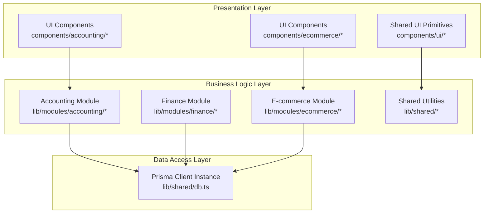
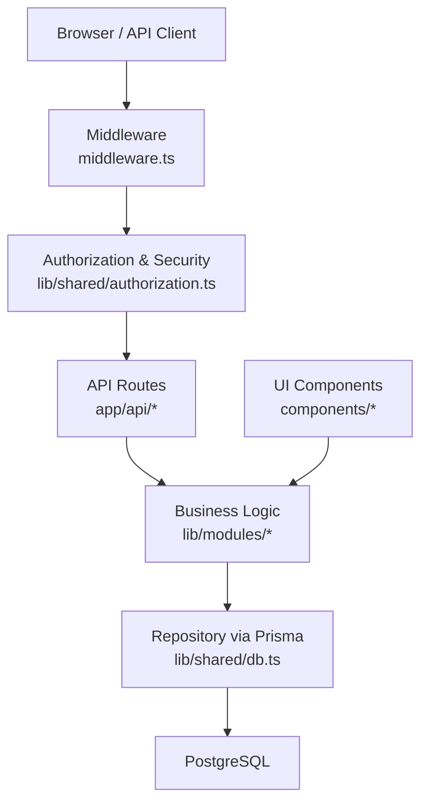
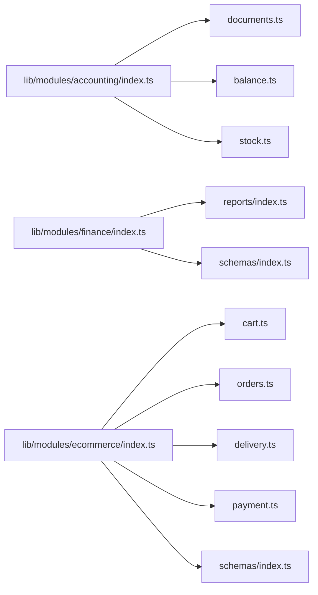
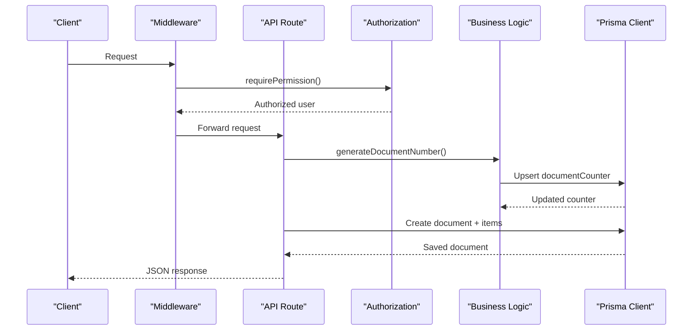
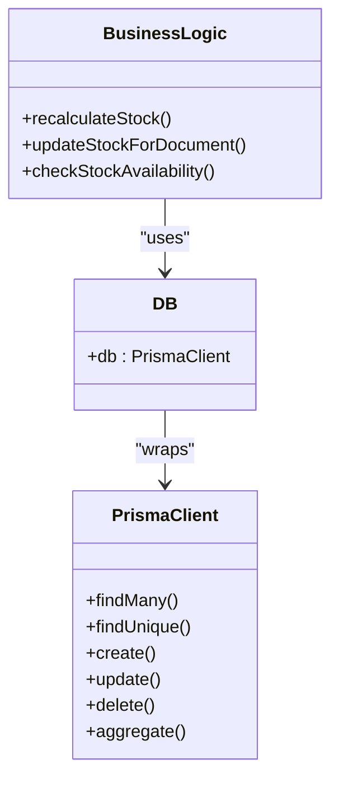
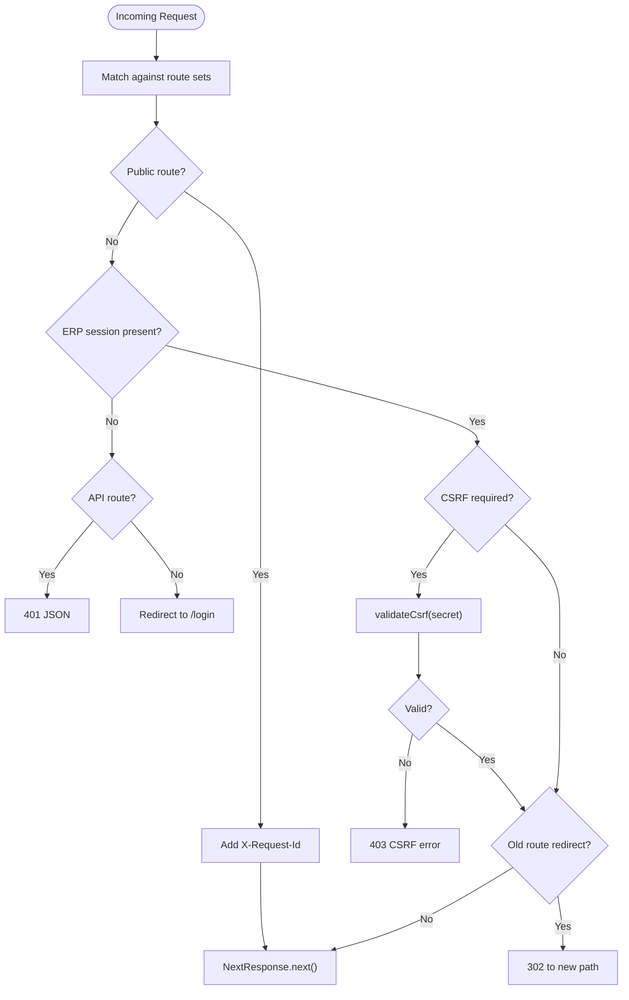
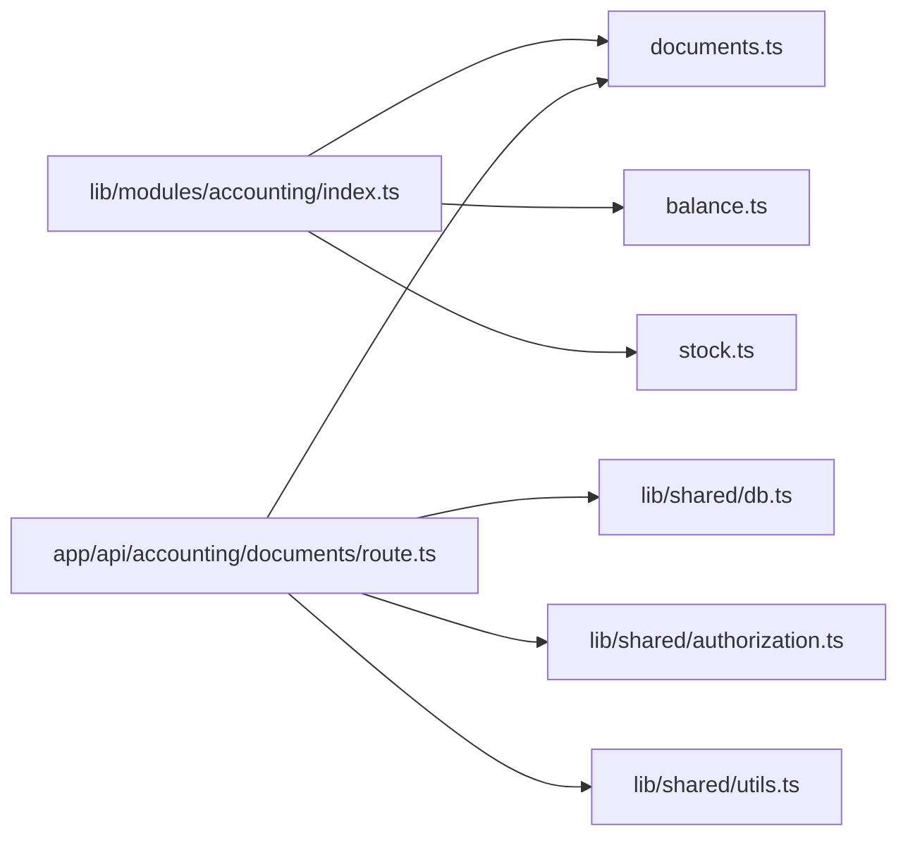

# System Design Patterns

<cite>
**Referenced Files in This Document**
- [ARCHITECTURE.md](file://ARCHITECTURE.md)
- [middleware.ts](file://middleware.ts)
- [lib/index.ts](file://lib/index.ts)
- [lib/shared/db.ts](file://lib/shared/db.ts)
- [lib/shared/authorization.ts](file://lib/shared/authorization.ts)
- [lib/shared/auth.ts](file://lib/shared/auth.ts)
- [lib/shared/utils.ts](file://lib/shared/utils.ts)
- [lib/modules/accounting/index.ts](file://lib/modules/accounting/index.ts)
- [lib/modules/accounting/documents.ts](file://lib/modules/accounting/documents.ts)
- [lib/modules/accounting/stock.ts](file://lib/modules/accounting/stock.ts)
- [lib/modules/finance/index.ts](file://lib/modules/finance/index.ts)
- [lib/modules/ecommerce/index.ts](file://lib/modules/ecommerce/index.ts)
- [components/accounting/index.ts](file://components/accounting/index.ts)
- [components/ui/data-grid/index.ts](file://components/ui/data-grid/index.ts)
- [app/api/accounting/documents/route.ts](file://app/api/accounting/documents/route.ts)
- [tests/unit/lib/documents.test.ts](file://tests/unit/lib/documents.test.ts)
- [tests/integration/api/documents.test.ts](file://tests/integration/api/documents.test.ts)
</cite>

## Table of Contents
1. [Introduction](#introduction)
2. [Project Structure](#project-structure)
3. [Core Components](#core-components)
4. [Architecture Overview](#architecture-overview)
5. [Detailed Component Analysis](#detailed-component-analysis)
6. [Dependency Analysis](#dependency-analysis)
7. [Performance Considerations](#performance-considerations)
8. [Troubleshooting Guide](#troubleshooting-guide)
9. [Conclusion](#conclusion)

## Introduction
This document explains the system design patterns implemented in the ListOpt ERP application. It focuses on:
- Modular architecture separating accounting, finance, and e-commerce domains
- Barrel export pattern for clean imports across modules
- Layered architecture with presentation, business logic, and data access layers
- Factory pattern for document numbering and component creation
- Repository pattern abstraction via a shared Prisma client
- Middleware pattern for centralized request processing and security
- Concrete examples from the codebase and their benefits for maintainability and scalability

## Project Structure
The project follows a domain-driven structure with clear separation of concerns:
- app/: Next.js App Router pages and API routes grouped by domain
- components/: UI components organized per domain and shared primitives
- lib/: Business logic modules and shared utilities
- prisma/: Database schema and migrations
- tests/: Unit and integration tests

**Diagram sources**
- [ARCHITECTURE.md](file://ARCHITECTURE.md)
- [lib/modules/accounting/index.ts](file://lib/modules/accounting/index.ts)
- [lib/modules/finance/index.ts](file://lib/modules/finance/index.ts)
- [lib/modules/ecommerce/index.ts](file://lib/modules/ecommerce/index.ts)
- [lib/shared/db.ts](file://lib/shared/db.ts)

**Section sources**
- [ARCHITECTURE.md](file://ARCHITECTURE.md)

## Core Components
This section outlines the primary design patterns and how they are implemented.

- Modular architecture pattern
  - Clear separation between accounting, finance, and e-commerce domains
  - Domain-specific route groups and UI components
  - Centralized module exports via barrel files

- Barrel export pattern
  - Barrel files in lib/modules/*/index.ts and components/*/index.ts
  - Enables clean imports across modules and reduces path verbosity

- Layered architecture
  - Presentation: React UI components and Next.js pages
  - Business logic: Pure functions and domain logic under lib/modules/*
  - Data access: Shared Prisma client instance

- Factory pattern
  - Document numbering factory: generateDocumentNumber produces numbered sequences per document type
  - Component creation: UI barrel exports expose domain-specific components

- Repository pattern
  - Abstraction over Prisma through a single db client instance
  - Consistent data access across modules

- Middleware pattern
  - Centralized request processing and security in middleware.ts
  - Authentication, authorization, CSRF protection, rate limiting, and redirects

**Section sources**
- [lib/modules/accounting/index.ts](file://lib/modules/accounting/index.ts)
- [lib/modules/finance/index.ts](file://lib/modules/finance/index.ts)
- [lib/modules/ecommerce/index.ts](file://lib/modules/ecommerce/index.ts)
- [components/accounting/index.ts](file://components/accounting/index.ts)
- [components/ui/data-grid/index.ts](file://components/ui/data-grid/index.ts)
- [lib/shared/db.ts](file://lib/shared/db.ts)
- [lib/modules/accounting/documents.ts](file://lib/modules/accounting/documents.ts)
- [middleware.ts](file://middleware.ts)

## Architecture Overview
The system enforces a layered architecture with explicit boundaries:
- Presentation layer consumes domain-specific UI components and shared primitives
- Business logic layer encapsulates domain rules and orchestrates data access
- Data access layer abstracts database operations behind a shared Prisma client

**Diagram sources**
- [middleware.ts](file://middleware.ts)
- [lib/shared/authorization.ts](file://lib/shared/authorization.ts)
- [app/api/accounting/documents/route.ts](file://app/api/accounting/documents/route.ts)
- [lib/shared/db.ts](file://lib/shared/db.ts)

## Detailed Component Analysis

### Modular Architecture Pattern
- Domain separation
  - Accounting: documents, stock, balances, references
  - Finance: reports, payments, categories
  - E-commerce: orders, cart, delivery, payment
- Route groups and pages mirror domain boundaries
- Barrel exports simplify imports across modules

**Diagram sources**
- [lib/modules/accounting/index.ts](file://lib/modules/accounting/index.ts)
- [lib/modules/finance/index.ts](file://lib/modules/finance/index.ts)
- [lib/modules/ecommerce/index.ts](file://lib/modules/ecommerce/index.ts)

**Section sources**
- [ARCHITECTURE.md](file://ARCHITECTURE.md)
- [lib/modules/accounting/index.ts](file://lib/modules/accounting/index.ts)
- [lib/modules/finance/index.ts](file://lib/modules/finance/index.ts)
- [lib/modules/ecommerce/index.ts](file://lib/modules/ecommerce/index.ts)

### Barrel Export Pattern
- lib/modules/accounting/index.ts re-exports all module functions
- components/accounting/index.ts exposes domain UI components
- components/ui/data-grid/index.ts provides shared UI building blocks
- lib/index.ts aggregates shared utilities and all modules for top-level imports

Benefits:
- Simplifies imports across the app
- Encourages cohesive module boundaries
- Reduces brittle relative paths

**Section sources**
- [lib/modules/accounting/index.ts](file://lib/modules/accounting/index.ts)
- [components/accounting/index.ts](file://components/accounting/index.ts)
- [components/ui/data-grid/index.ts](file://components/ui/data-grid/index.ts)
- [lib/index.ts](file://lib/index.ts)

### Layered Architecture
- Presentation: UI components and Next.js pages
- Business logic: pure functions and domain logic
- Data access: shared Prisma client

Example: API route orchestrating business logic and data access
- app/api/accounting/documents/route.ts validates permissions, parses queries, calls business logic, and persists via the shared db client

**Diagram sources**
- [middleware.ts](file://middleware.ts)
- [lib/shared/authorization.ts](file://lib/shared/authorization.ts)
- [lib/modules/accounting/documents.ts](file://lib/modules/accounting/documents.ts)
- [app/api/accounting/documents/route.ts](file://app/api/accounting/documents/route.ts)
- [lib/shared/db.ts](file://lib/shared/db.ts)

**Section sources**
- [app/api/accounting/documents/route.ts](file://app/api/accounting/documents/route.ts)
- [lib/shared/db.ts](file://lib/shared/db.ts)

### Factory Pattern: Document Numbering and Component Creation
- Document numbering factory
  - generateDocumentNumber(type) uses a per-prefix counter stored in the database
  - Ensures unique, formatted document numbers per document type
- Component creation
  - UI barrel exports provide domain-specific components for reuse

**Diagram sources**
- [lib/modules/accounting/documents.ts](file://lib/modules/accounting/documents.ts)
- [lib/shared/db.ts](file://lib/shared/db.ts)

**Section sources**
- [lib/modules/accounting/documents.ts](file://lib/modules/accounting/documents.ts)
- [components/accounting/index.ts](file://components/accounting/index.ts)

### Repository Pattern: Database Access Abstraction
- Shared Prisma client instance
  - lib/shared/db.ts creates a singleton Prisma client using a PostgreSQL adapter
  - All business logic imports db from the shared location
- Consistent data access
  - Business logic functions call db.* methods without exposing Prisma internals
  - Tests can import the same db instance for deterministic scenarios

**Diagram sources**
- [lib/shared/db.ts](file://lib/shared/db.ts)
- [lib/modules/accounting/stock.ts](file://lib/modules/accounting/stock.ts)

**Section sources**
- [lib/shared/db.ts](file://lib/shared/db.ts)
- [lib/modules/accounting/stock.ts](file://lib/modules/accounting/stock.ts)

### Middleware Pattern: Centralized Request Processing and Security
- Authentication and authorization
  - requireAuth and requirePermission enforce session and permission checks
  - AuthorizationError centralizes error handling
- CSRF protection
  - validateCsrf applied to protected API routes
- Rate limiting and logging
  - rateLimit and logger integrated centrally
- Routing and redirects
  - PUBLIC_ROUTES, STOREFRONT_PUBLIC/CUSTOMER, WEBHOOK_ROUTES, ECOMMERCE_CUSTOMER_API define access policies
  - Old route redirects handled centrally

**Diagram sources**
- [middleware.ts](file://middleware.ts)
- [lib/shared/authorization.ts](file://lib/shared/authorization.ts)

**Section sources**
- [middleware.ts](file://middleware.ts)
- [lib/shared/authorization.ts](file://lib/shared/authorization.ts)
- [lib/shared/auth.ts](file://lib/shared/auth.ts)

## Dependency Analysis
- Module cohesion
  - Each domain module re-exports its public API via barrel files
  - UI components are grouped by domain and re-exported for clean imports
- Cross-cutting concerns
  - Shared utilities (formatting, auth, authorization) are imported from lib/shared/*
  - All business logic depends on the shared db client
- API route dependencies
  - API routes import shared auth and validation utilities and delegate to business logic

**Diagram sources**
- [lib/modules/accounting/index.ts](file://lib/modules/accounting/index.ts)
- [lib/modules/accounting/documents.ts](file://lib/modules/accounting/documents.ts)
- [app/api/accounting/documents/route.ts](file://app/api/accounting/documents/route.ts)
- [lib/shared/db.ts](file://lib/shared/db.ts)
- [lib/shared/authorization.ts](file://lib/shared/authorization.ts)
- [lib/shared/utils.ts](file://lib/shared/utils.ts)

**Section sources**
- [lib/modules/accounting/index.ts](file://lib/modules/accounting/index.ts)
- [app/api/accounting/documents/route.ts](file://app/api/accounting/documents/route.ts)

## Performance Considerations
- Centralized Prisma client
  - Singleton pattern avoids connection overhead and ensures consistent configuration
- Batch operations
  - Business logic aggregates counts and sums to minimize round-trips
- Efficient queries
  - API routes use targeted selects and includes to reduce payload sizes
- Middleware overhead
  - Minimal checks for static assets and public routes
  - Early returns for public paths reduce unnecessary processing

## Troubleshooting Guide
- Authentication failures
  - requireAuth throws AuthorizationError; handleAuthError converts to JSON response
  - Verify SESSION_SECRET and session cookie presence
- Authorization failures
  - requirePermission checks role and permission matrices; ensure user role grants required permission
- CSRF validation failures
  - validateCsrf invoked for protected API routes; ensure secret is configured and tokens are valid
- Database connectivity
  - db client requires DATABASE_URL; verify environment configuration and connection pool settings
- API route validation
  - parseQuery and parseBody validate inputs; check schema definitions and error responses

**Section sources**
- [lib/shared/authorization.ts](file://lib/shared/authorization.ts)
- [lib/shared/auth.ts](file://lib/shared/auth.ts)
- [middleware.ts](file://middleware.ts)
- [lib/shared/db.ts](file://lib/shared/db.ts)

## Conclusion
The ListOpt ERP system employs well-defined design patterns that promote maintainability and scalability:
- Modular architecture cleanly separates domains
- Barrel exports simplify imports and improve cohesion
- Layered architecture isolates presentation, business logic, and data access
- Factory pattern centralizes document numbering
- Repository pattern abstracts database operations via a shared Prisma client
- Middleware pattern provides centralized request processing and robust security controls

These patterns collectively enable clear boundaries, reusable components, and consistent behavior across the application.