# System Design Patterns

<cite>
**Referenced Files in This Document**
- [ARCHITECTURE.md](file://ARCHITECTURE.md)
- [middleware.ts](file://middleware.ts)
- [lib/index.ts](file://lib/index.ts)
- [lib/shared/db.ts](file://lib/shared/db.ts)
- [lib/shared/authorization.ts](file://lib/shared/authorization.ts)
- [lib/shared/auth.ts](file://lib/shared/auth.ts)
- [lib/shared/utils.ts](file://lib/shared/utils.ts)
- [lib/modules/accounting/index.ts](file://lib/modules/accounting/index.ts)
- [lib/modules/accounting/documents.ts](file://lib/modules/accounting/documents.ts)
- [lib/modules/finance/index.ts](file://lib/modules/finance/index.ts)
- [lib/modules/ecommerce/index.ts](file://lib/modules/ecommerce/index.ts)
- [lib/modules/auth/resolve-membership.ts](file://lib/modules/auth/resolve-membership.ts)
- [lib/party/index.ts](file://lib/party/index.ts)
- [lib/party/types.ts](file://lib/party/types.ts)
- [lib/events/event-bus.ts](file://lib/events/event-bus.ts)
- [lib/events/outbox.ts](file://lib/events/outbox.ts)
- [lib/events/types.ts](file://lib/events/types.ts)
- [components/accounting/index.ts](file://components/accounting/index.ts)
- [components/ui/data-grid/index.ts](file://components/ui/data-grid/index.ts)
- [components/crm/index.ts](file://components/crm/index.ts)
- [app/api/accounting/documents/route.ts](file://app/api/accounting/documents/route.ts)
- [app/(crm)/layout.tsx](file://app/(crm)/layout.tsx)
- [tests/unit/lib/documents.test.ts](file://tests/unit/lib/documents.test.ts)
- [tests/integration/api/documents.test.ts](file://tests/integration/api/documents.test.ts)
- [tests/unit/lib/resolve-membership.test.ts](file://tests/unit/lib/resolve-membership.test.ts)
- [tests/unit/lib/event-bus.test.ts](file://tests/unit/lib/event-bus.test.ts)
- [prisma/migrations/20260313_add_tenant_architecture/migration.sql](file://prisma/migrations/20260313_add_tenant_architecture/migration.sql)
</cite>

## Update Summary
**Changes Made**
- Added comprehensive multi-tenant architecture documentation with tenant membership resolution
- Documented new event-driven architecture with in-process event bus and outbox pattern
- Added CRM module documentation covering party-centric design and merge functionality
- Updated architectural patterns to reflect new tenant-aware authentication and authorization
- Enhanced middleware pattern documentation with tenant context handling
- Added new section on event-driven patterns and durable event delivery

## Table of Contents
1. [Introduction](#introduction)
2. [Project Structure](#project-structure)
3. [Core Components](#core-components)
4. [Architecture Overview](#architecture-overview)
5. [Detailed Component Analysis](#detailed-component-analysis)
6. [Multi-Tenant Architecture](#multi-tenant-architecture)
7. [Event-Driven Architecture](#event-driven-architecture)
8. [CRM Module Integration](#crm-module-integration)
9. [Dependency Analysis](#dependency-analysis)
10. [Performance Considerations](#performance-considerations)
11. [Troubleshooting Guide](#troubleshooting-guide)
12. [Conclusion](#conclusion)

## Introduction
This document explains the system design patterns implemented in the ListOpt ERP application. The system has undergone a major architectural refactor with multi-tenant support, event-driven patterns, and new CRM modules. It focuses on:
- Modular architecture separating accounting, finance, e-commerce, and CRM domains
- Barrel export pattern for clean imports across modules
- Layered architecture with presentation, business logic, and data access layers
- Factory pattern for document numbering and component creation
- Repository pattern abstraction via a shared Prisma client
- Middleware pattern for centralized request processing and security
- Multi-tenant architecture with tenant membership resolution
- Event-driven architecture with in-process and outbox patterns
- CRM module with party-centric design and merge functionality
- Concrete examples from the codebase and their benefits for maintainability and scalability

## Project Structure
The project follows a domain-driven structure with clear separation of concerns and multi-tenant support:
- app/: Next.js App Router pages and API routes grouped by domain
- components/: UI components organized per domain and shared primitives
- lib/: Business logic modules, shared utilities, and event infrastructure
- prisma/: Database schema and migrations with tenant architecture
- tests/: Unit and integration tests

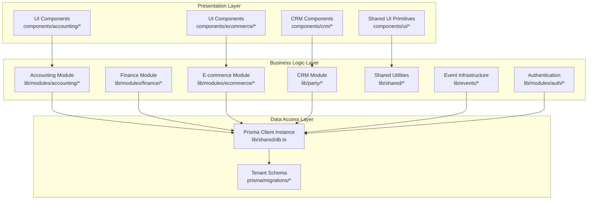

**Diagram sources**
- [ARCHITECTURE.md](file://ARCHITECTURE.md)
- [lib/modules/accounting/index.ts](file://lib/modules/accounting/index.ts)
- [lib/modules/finance/index.ts](file://lib/modules/finance/index.ts)
- [lib/modules/ecommerce/index.ts](file://lib/modules/ecommerce/index.ts)
- [lib/party/index.ts](file://lib/party/index.ts)
- [lib/shared/db.ts](file://lib/shared/db.ts)
- [lib/modules/auth/resolve-membership.ts](file://lib/modules/auth/resolve-membership.ts)
- [lib/events/event-bus.ts](file://lib/events/event-bus.ts)

**Section sources**
- [ARCHITECTURE.md](file://ARCHITECTURE.md)

## Core Components
This section outlines the primary design patterns and how they are implemented.

- Modular architecture pattern
  - Clear separation between accounting, finance, e-commerce, and CRM domains
  - Domain-specific route groups and UI components
  - Centralized module exports via barrel files

- Barrel export pattern
  - Barrel files in lib/modules/*/index.ts and components/*/index.ts
  - Enables clean imports across modules and reduces path verbosity

- Layered architecture
  - Presentation: React UI components and Next.js pages
  - Business logic: Pure functions and domain logic under lib/modules/* and lib/party/*
  - Data access: Shared Prisma client instance

- Factory pattern
  - Document numbering factory: generateDocumentNumber produces numbered sequences per document type
  - Component creation: UI barrel exports expose domain-specific components

- Repository pattern
  - Abstraction over Prisma through a single db client instance
  - Consistent data access across modules

- Middleware pattern
  - Centralized request processing and security in middleware.ts
  - Authentication, authorization, CSRF protection, rate limiting, and redirects
  - Tenant-aware session handling

- Multi-tenant architecture
  - Tenant membership resolution with dynamic tenant switching
  - Tenant-aware database queries and authorization
  - Tenant settings and configuration management

- Event-driven architecture
  - In-process event bus for immediate event handling
  - Outbox pattern for durable event delivery
  - Domain event modeling and handler registration

- CRM module
  - Party-centric design with unified customer representation
  - Party merge functionality for deduplication
  - Activity ingestion and ownership management

**Section sources**
- [lib/modules/accounting/index.ts](file://lib/modules/accounting/index.ts)
- [lib/modules/finance/index.ts](file://lib/modules/finance/index.ts)
- [lib/modules/ecommerce/index.ts](file://lib/modules/ecommerce/index.ts)
- [lib/party/index.ts](file://lib/party/index.ts)
- [components/accounting/index.ts](file://components/accounting/index.ts)
- [components/ui/data-grid/index.ts](file://components/ui/data-grid/index.ts)
- [components/crm/index.ts](file://components/crm/index.ts)
- [lib/shared/db.ts](file://lib/shared/db.ts)
- [lib/modules/accounting/documents.ts](file://lib/modules/accounting/documents.ts)
- [middleware.ts](file://middleware.ts)
- [lib/modules/auth/resolve-membership.ts](file://lib/modules/auth/resolve-membership.ts)
- [lib/events/event-bus.ts](file://lib/events/event-bus.ts)
- [lib/events/outbox.ts](file://lib/events/outbox.ts)

## Architecture Overview
The system enforces a layered architecture with explicit boundaries and multi-tenant support:
- Presentation layer consumes domain-specific UI components and shared primitives
- Business logic layer encapsulates domain rules and orchestrates data access
- Data access layer abstracts database operations behind a shared Prisma client
- Event infrastructure handles asynchronous processing and cross-domain communication
- Multi-tenant layer manages tenant context and isolation

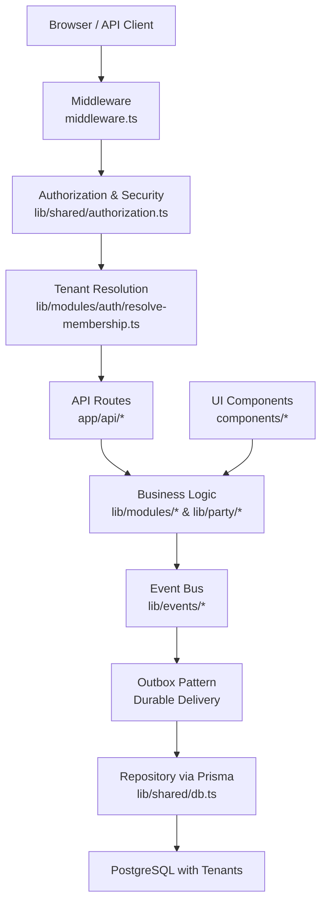

**Diagram sources**
- [middleware.ts](file://middleware.ts)
- [lib/shared/authorization.ts](file://lib/shared/authorization.ts)
- [lib/modules/auth/resolve-membership.ts](file://lib/modules/auth/resolve-membership.ts)
- [app/api/accounting/documents/route.ts](file://app/api/accounting/documents/route.ts)
- [lib/shared/db.ts](file://lib/shared/db.ts)
- [lib/events/event-bus.ts](file://lib/events/event-bus.ts)
- [lib/events/outbox.ts](file://lib/events/outbox.ts)

## Detailed Component Analysis

### Modular Architecture Pattern
- Domain separation
  - Accounting: documents, stock, balances, references
  - Finance: reports, payments, categories
  - E-commerce: orders, cart, delivery, payment
  - CRM: parties, party profiles, merge functionality
- Route groups and pages mirror domain boundaries
- Barrel exports simplify imports across modules

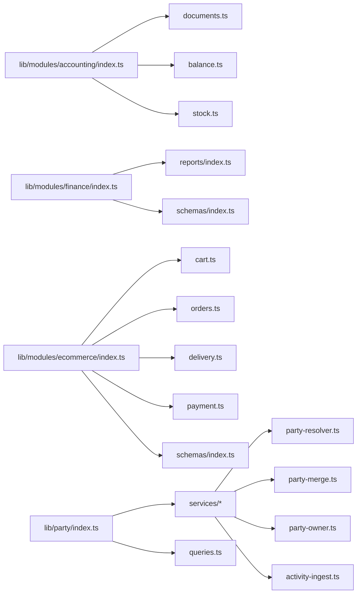

**Diagram sources**
- [lib/modules/accounting/index.ts](file://lib/modules/accounting/index.ts)
- [lib/modules/finance/index.ts](file://lib/modules/finance/index.ts)
- [lib/modules/ecommerce/index.ts](file://lib/modules/ecommerce/index.ts)
- [lib/party/index.ts](file://lib/party/index.ts)

**Section sources**
- [ARCHITECTURE.md](file://ARCHITECTURE.md)
- [lib/modules/accounting/index.ts](file://lib/modules/accounting/index.ts)
- [lib/modules/finance/index.ts](file://lib/modules/finance/index.ts)
- [lib/modules/ecommerce/index.ts](file://lib/modules/ecommerce/index.ts)
- [lib/party/index.ts](file://lib/party/index.ts)

### Barrel Export Pattern
- lib/modules/accounting/index.ts re-exports all module functions
- components/accounting/index.ts exposes domain UI components
- components/crm/index.ts exposes CRM components
- components/ui/data-grid/index.ts provides shared UI building blocks
- lib/index.ts aggregates shared utilities and all modules for top-level imports

Benefits:
- Simplifies imports across the app
- Encourages cohesive module boundaries
- Reduces brittle relative paths

**Section sources**
- [lib/modules/accounting/index.ts](file://lib/modules/accounting/index.ts)
- [components/accounting/index.ts](file://components/accounting/index.ts)
- [components/crm/index.ts](file://components/crm/index.ts)
- [components/ui/data-grid/index.ts](file://components/ui/data-grid/index.ts)
- [lib/index.ts](file://lib/index.ts)

### Layered Architecture
- Presentation: UI components and Next.js pages
- Business logic: pure functions and domain logic
- Data access: shared Prisma client

Example: API route orchestrating business logic and data access
- app/api/accounting/documents/route.ts validates permissions, parses queries, calls business logic, and persists via the shared db client

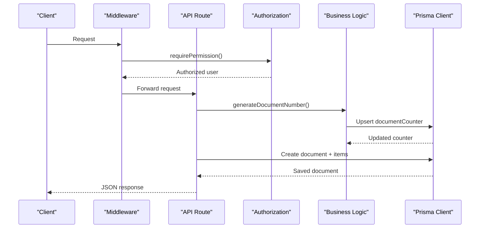

**Diagram sources**
- [middleware.ts](file://middleware.ts)
- [lib/shared/authorization.ts](file://lib/shared/authorization.ts)
- [lib/modules/accounting/documents.ts](file://lib/modules/accounting/documents.ts)
- [app/api/accounting/documents/route.ts](file://app/api/accounting/documents/route.ts)
- [lib/shared/db.ts](file://lib/shared/db.ts)

**Section sources**
- [app/api/accounting/documents/route.ts](file://app/api/accounting/documents/route.ts)
- [lib/shared/db.ts](file://lib/shared/db.ts)

### Factory Pattern: Document Numbering and Component Creation
- Document numbering factory
  - generateDocumentNumber(type) uses a per-prefix counter stored in the database
  - Ensures unique, formatted document numbers per document type
- Component creation
  - UI barrel exports provide domain-specific components for reuse

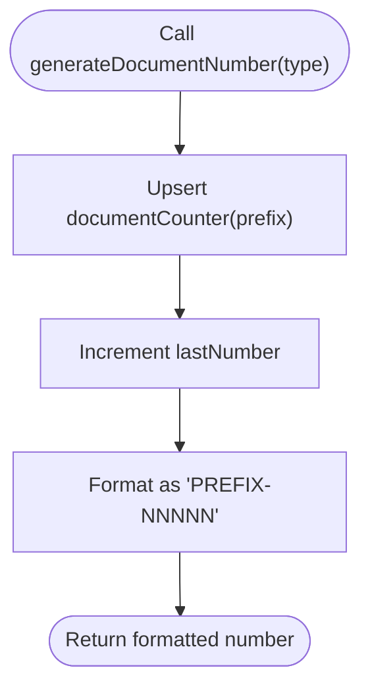

**Diagram sources**
- [lib/modules/accounting/documents.ts](file://lib/modules/accounting/documents.ts)
- [lib/shared/db.ts](file://lib/shared/db.ts)

**Section sources**
- [lib/modules/accounting/documents.ts](file://lib/modules/accounting/documents.ts)
- [components/accounting/index.ts](file://components/accounting/index.ts)

### Repository Pattern: Database Access Abstraction
- Shared Prisma client instance
  - lib/shared/db.ts creates a singleton Prisma client using a PostgreSQL adapter
  - All business logic imports db from the shared location
- Consistent data access
  - Business logic functions call db.* methods without exposing Prisma internals
  - Tests can import the same db instance for deterministic scenarios

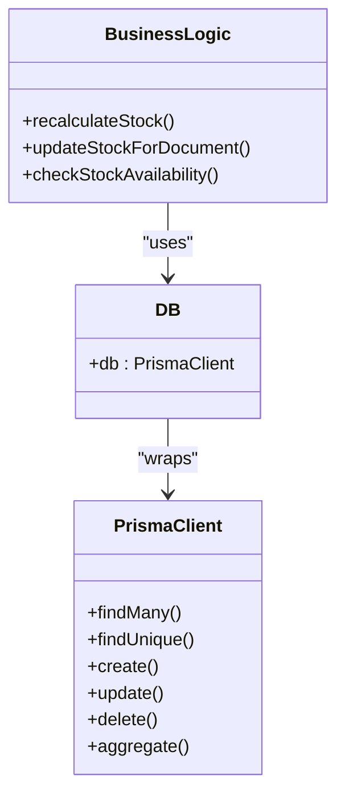

**Diagram sources**
- [lib/shared/db.ts](file://lib/shared/db.ts)
- [lib/modules/accounting/stock.ts](file://lib/modules/accounting/stock.ts)

**Section sources**
- [lib/shared/db.ts](file://lib/shared/db.ts)
- [lib/modules/accounting/stock.ts](file://lib/modules/accounting/stock.ts)

### Middleware Pattern: Centralized Request Processing and Security
- Authentication and authorization
  - requireAuth and requirePermission enforce session and permission checks
  - AuthorizationError centralizes error handling
- CSRF protection
  - validateCsrf applied to protected API routes
- Rate limiting and logging
  - rateLimit and logger integrated centrally
- Routing and redirects
  - PUBLIC_ROUTES, STOREFRONT_PUBLIC/CUSTOMER, WEBHOOK_ROUTES, ECOMMERCE_CUSTOMER_API define access policies
  - Old route redirects handled centrally
- Tenant-aware session handling
  - getAuthSession returns TenantAwareSession with tenant context
  - Lazy loading of membership resolution to avoid circular dependencies

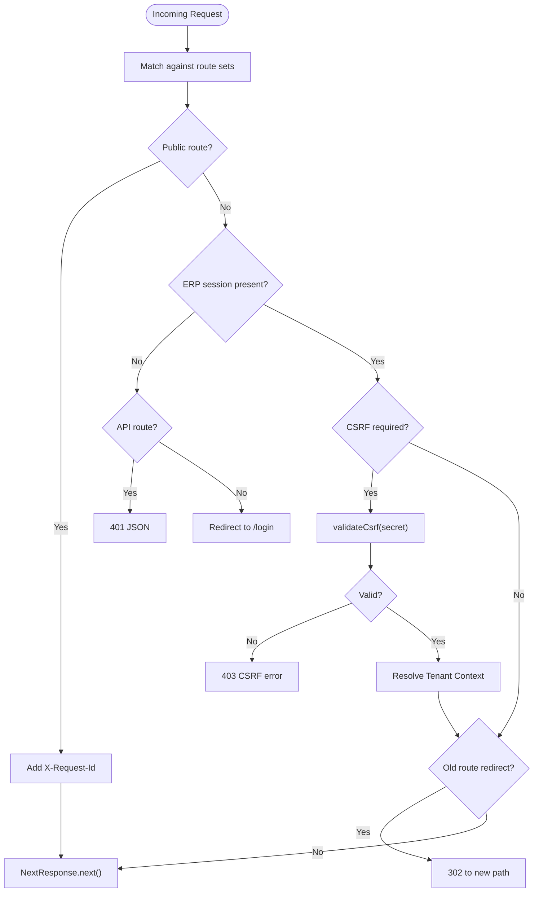

**Diagram sources**
- [middleware.ts](file://middleware.ts)
- [lib/shared/authorization.ts](file://lib/shared/authorization.ts)
- [lib/shared/auth.ts](file://lib/shared/auth.ts)
- [lib/shared/auth.ts:89-112](file://lib/shared/auth.ts#L89-L112)

**Section sources**
- [middleware.ts](file://middleware.ts)
- [lib/shared/authorization.ts](file://lib/shared/authorization.ts)
- [lib/shared/auth.ts](file://lib/shared/auth.ts)

## Multi-Tenant Architecture
The system implements a comprehensive multi-tenant architecture supporting tenant membership resolution and tenant-aware operations.

### Tenant Membership Resolution
- Dynamic tenant switching based on user membership
- Support for single and future multi-tenant scenarios
- Comprehensive error handling for membership states
- Tenant-aware session management

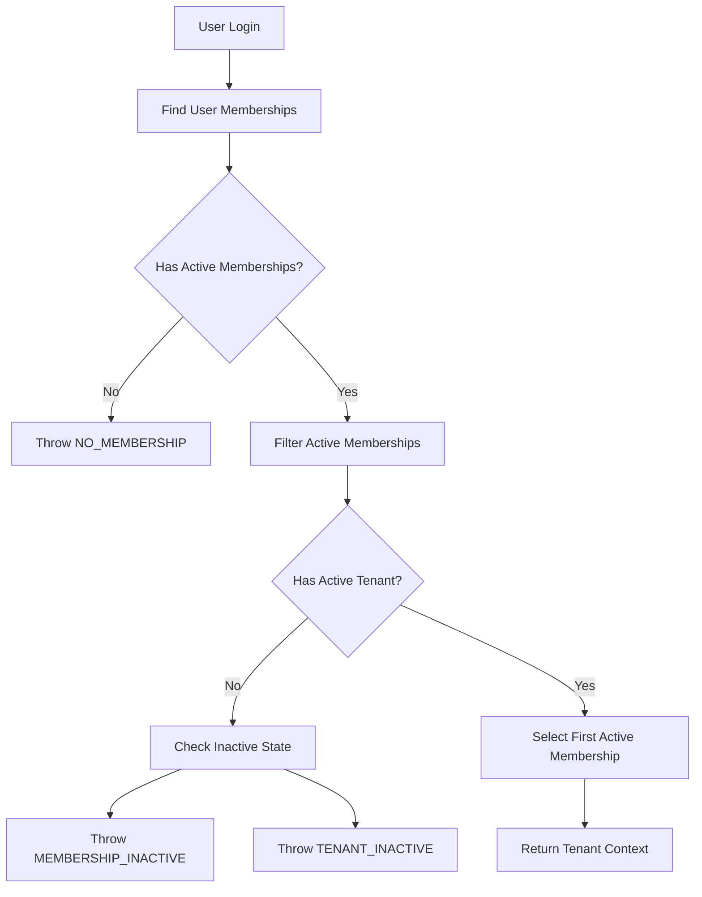

**Diagram sources**
- [lib/modules/auth/resolve-membership.ts:73-141](file://lib/modules/auth/resolve-membership.ts#L73-L141)

### Tenant-Aware Database Operations
- Tenant membership table linking users to organizations
- Tenant settings and configuration management
- Tenant isolation through tenantId filtering
- Tenant-aware reporting and analytics

**Section sources**
- [lib/modules/auth/resolve-membership.ts](file://lib/modules/auth/resolve-membership.ts)
- [tests/unit/lib/resolve-membership.test.ts](file://tests/unit/lib/resolve-membership.test.ts)
- [prisma/migrations/20260313_add_tenant_architecture/migration.sql](file://prisma/migrations/20260313_add_tenant_architecture/migration.sql)

## Event-Driven Architecture
The system implements an event-driven architecture with both in-process and durable event delivery mechanisms.

### In-Process Event Bus
- Immediate event handling within the same process
- Handler isolation with individual try/catch blocks
- Best-effort delivery guarantee
- Easy testing with isolated event buses

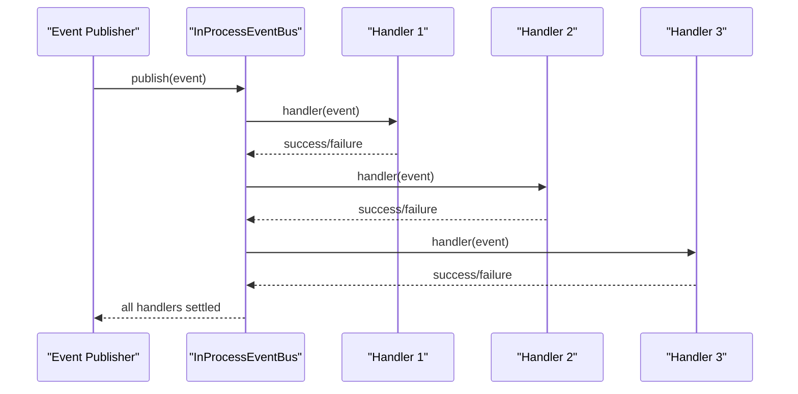

**Diagram sources**
- [lib/events/event-bus.ts:62-76](file://lib/events/event-bus.ts#L62-L76)

### Outbox Pattern for Durable Delivery
- Transactional event persistence alongside domain changes
- Atomic claim mechanism preventing race conditions
- Exponential backoff with retry limits
- Comprehensive error handling and monitoring

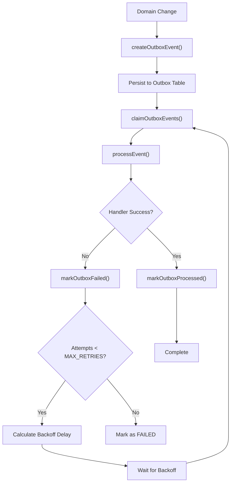

**Diagram sources**
- [lib/events/outbox.ts:60-77](file://lib/events/outbox.ts#L60-L77)
- [lib/events/outbox.ts:86-102](file://lib/events/outbox.ts#L86-L102)
- [lib/events/outbox.ts:107-156](file://lib/events/outbox.ts#L107-L156)

### Domain Event Modeling
- Discriminated union pattern for type safety
- Document-focused events (confirmed, cancelled, etc.)
- Extensible event system for future domain events
- Strongly typed event payloads

**Section sources**
- [lib/events/event-bus.ts](file://lib/events/event-bus.ts)
- [lib/events/outbox.ts](file://lib/events/outbox.ts)
- [lib/events/types.ts](file://lib/events/types.ts)
- [tests/unit/lib/event-bus.test.ts](file://tests/unit/lib/event-bus.test.ts)

## CRM Module Integration
The CRM module provides party-centric functionality built on top of existing accounting and e-commerce domains.

### Party-Centric Design
- Unified party representation across all domains
- Party resolution from multiple sources (customer, counterparty, telegram)
- Party merge functionality for deduplication
- Activity ingestion from various touchpoints

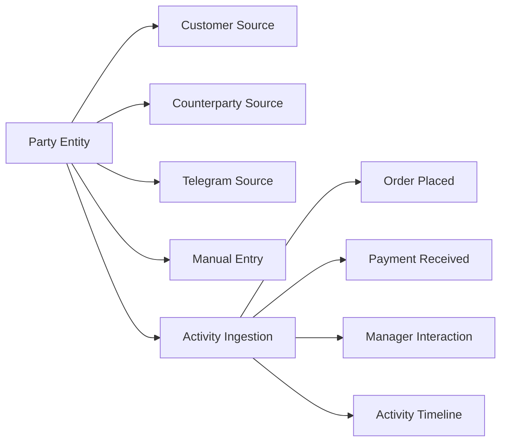

**Diagram sources**
- [lib/party/types.ts:11-49](file://lib/party/types.ts#L11-L49)
- [lib/party/types.ts:83-96](file://lib/party/types.ts#L83-L96)

### Party Merge Workflow
- Automated merge request detection
- Approval workflow for merges
- Execution of party consolidation
- History tracking of merge operations

**Section sources**
- [lib/party/index.ts](file://lib/party/index.ts)
- [lib/party/types.ts](file://lib/party/types.ts)

## Dependency Analysis
- Module cohesion
  - Each domain module re-exports its public API via barrel files
  - UI components are grouped by domain and re-exported for clean imports
  - CRM components integrate seamlessly with existing domains
- Cross-cutting concerns
  - Shared utilities (formatting, auth, authorization) are imported from lib/shared/*
  - All business logic depends on the shared db client
  - Event infrastructure provides decoupled communication
  - Tenant resolution adds multi-tenant awareness
- API route dependencies
  - API routes import shared auth and validation utilities and delegate to business logic
  - Tenant context flows through the authentication pipeline

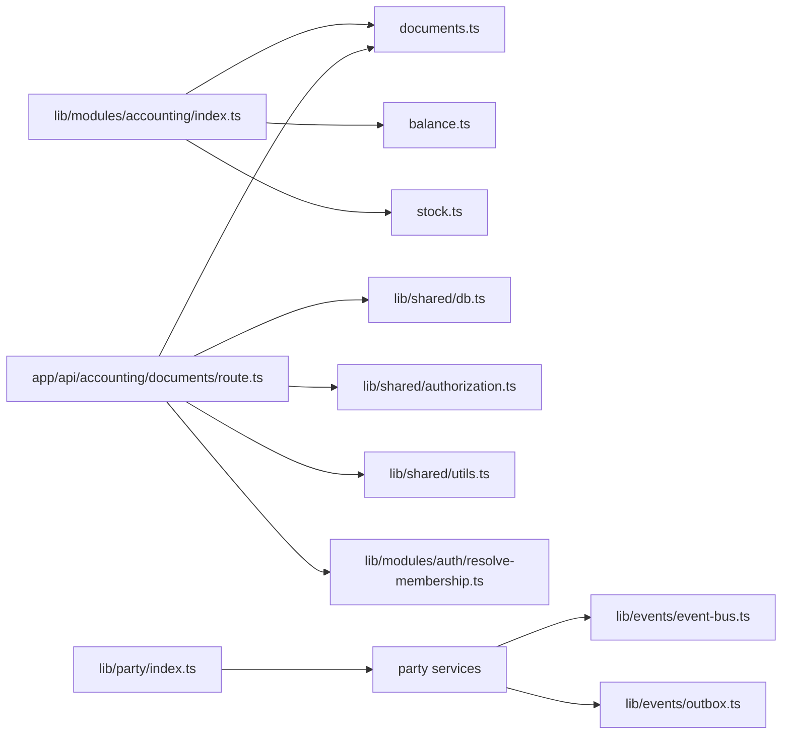

**Diagram sources**
- [lib/modules/accounting/index.ts](file://lib/modules/accounting/index.ts)
- [lib/modules/accounting/documents.ts](file://lib/modules/accounting/documents.ts)
- [app/api/accounting/documents/route.ts](file://app/api/accounting/documents/route.ts)
- [lib/shared/db.ts](file://lib/shared/db.ts)
- [lib/shared/authorization.ts](file://lib/shared/authorization.ts)
- [lib/shared/utils.ts](file://lib/shared/utils.ts)
- [lib/modules/auth/resolve-membership.ts](file://lib/modules/auth/resolve-membership.ts)
- [lib/party/index.ts](file://lib/party/index.ts)
- [lib/events/event-bus.ts](file://lib/events/event-bus.ts)
- [lib/events/outbox.ts](file://lib/events/outbox.ts)

**Section sources**
- [lib/modules/accounting/index.ts](file://lib/modules/accounting/index.ts)
- [app/api/accounting/documents/route.ts](file://app/api/accounting/documents/route.ts)
- [lib/party/index.ts](file://lib/party/index.ts)

## Performance Considerations
- Centralized Prisma client
  - Singleton pattern avoids connection overhead and ensures consistent configuration
- Batch operations
  - Business logic aggregates counts and sums to minimize round-trips
- Efficient queries
  - API routes use targeted selects and includes to reduce payload sizes
- Middleware overhead
  - Minimal checks for static assets and public routes
  - Early returns for public paths reduce unnecessary processing
- Event processing
  - In-process events provide immediate response times
  - Outbox pattern enables background processing without blocking requests
- Multi-tenant optimization
  - Tenant context resolution cached in session
  - Tenant-aware queries optimized with proper indexing

## Troubleshooting Guide
- Authentication failures
  - requireAuth throws AuthorizationError; handleAuthError converts to JSON response
  - Verify SESSION_SECRET and session cookie presence
- Authorization failures
  - requirePermission checks role and permission matrices; ensure user role grants required permission
- CSRF validation failures
  - validateCsrf invoked for protected API routes; ensure secret is configured and tokens are valid
- Database connectivity
  - db client requires DATABASE_URL; verify environment configuration and connection pool settings
- API route validation
  - parseQuery and parseBody validate inputs; check schema definitions and error responses
- Tenant resolution failures
  - resolveActiveMembershipForUser throws MembershipResolutionError with specific codes
  - Check user memberships, tenant activation status, and membership constraints
- Event processing issues
  - InProcessEventBus logs handler failures but continues processing
  - Outbox pattern handles retries with exponential backoff; monitor failed events
- CRM merge conflicts
  - Party merge operations require approval workflow
  - Check merge request status and conflict resolution

**Section sources**
- [lib/shared/authorization.ts](file://lib/shared/authorization.ts)
- [lib/shared/auth.ts](file://lib/shared/auth.ts)
- [middleware.ts](file://middleware.ts)
- [lib/shared/db.ts](file://lib/shared/db.ts)
- [lib/modules/auth/resolve-membership.ts](file://lib/modules/auth/resolve-membership.ts)
- [lib/events/event-bus.ts](file://lib/events/event-bus.ts)
- [lib/events/outbox.ts](file://lib/events/outbox.ts)

## Conclusion
The ListOpt ERP system employs well-defined design patterns that promote maintainability and scalability with significant architectural enhancements:
- Modular architecture cleanly separates domains including the new CRM module
- Barrel exports simplify imports and improve cohesion across all modules
- Layered architecture isolates presentation, business logic, and data access
- Factory pattern centralizes document numbering
- Repository pattern abstracts database operations via a shared Prisma client
- Middleware pattern provides centralized request processing and robust security controls
- Multi-tenant architecture enables tenant membership resolution and tenant-aware operations
- Event-driven architecture supports both immediate and durable event processing
- CRM module provides party-centric functionality built on existing domains

These patterns collectively enable clear boundaries, reusable components, consistent behavior, and scalable multi-tenant support across the application.