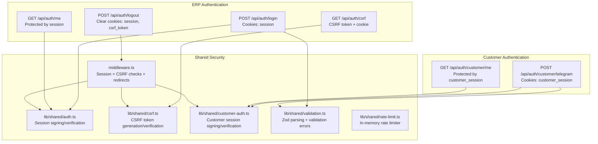
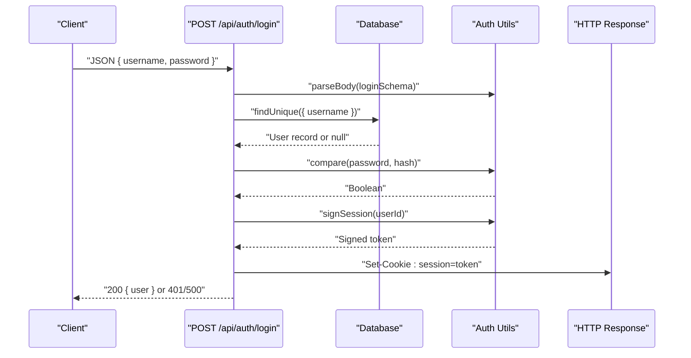
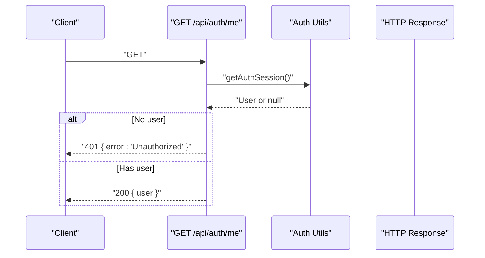
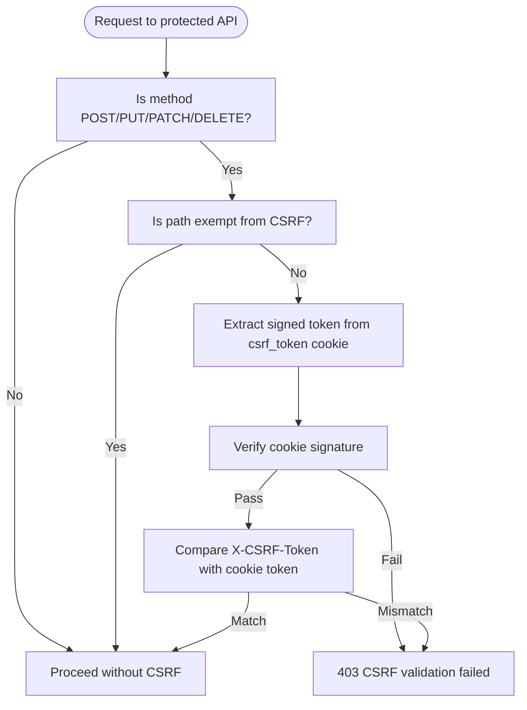
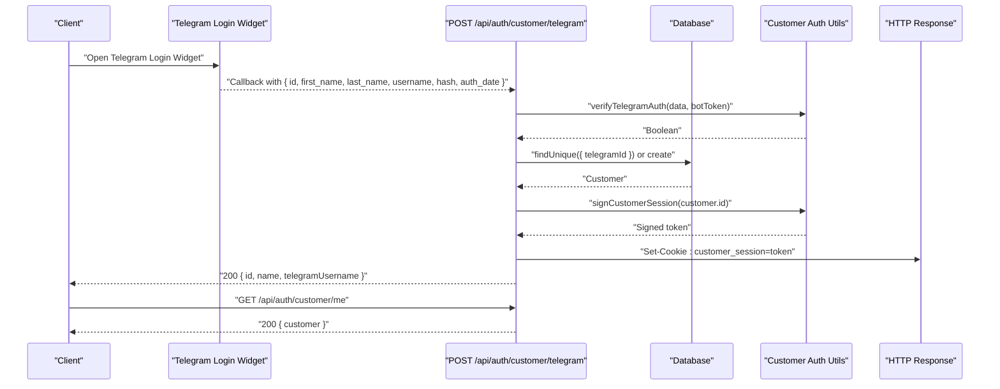
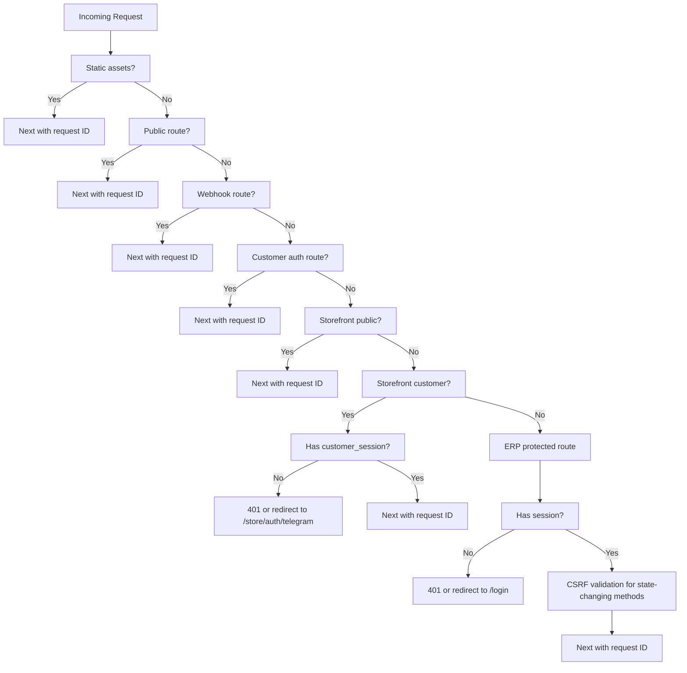
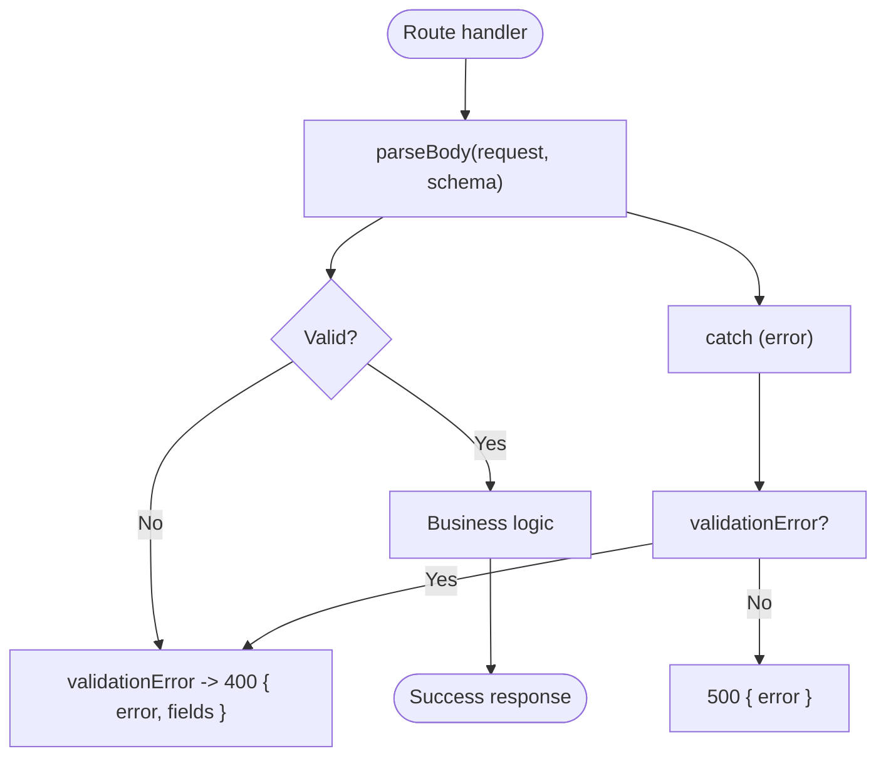
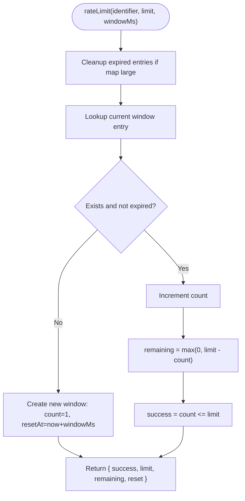
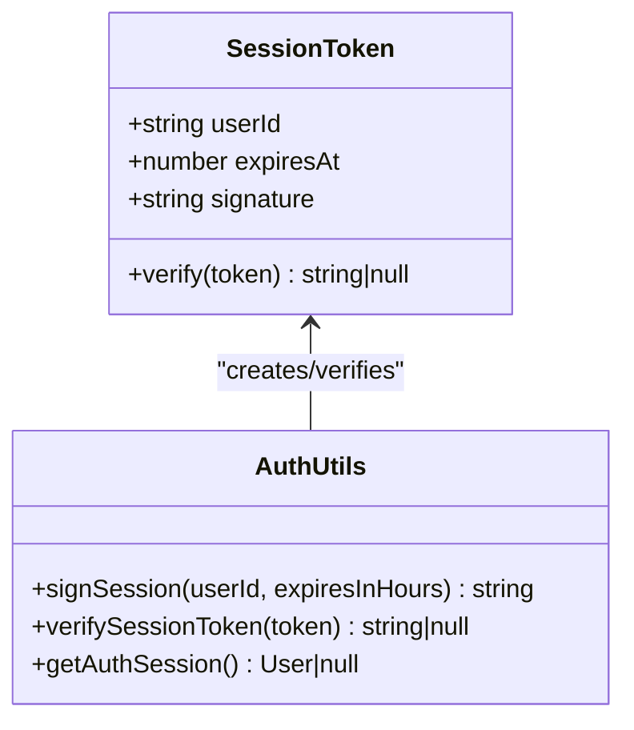
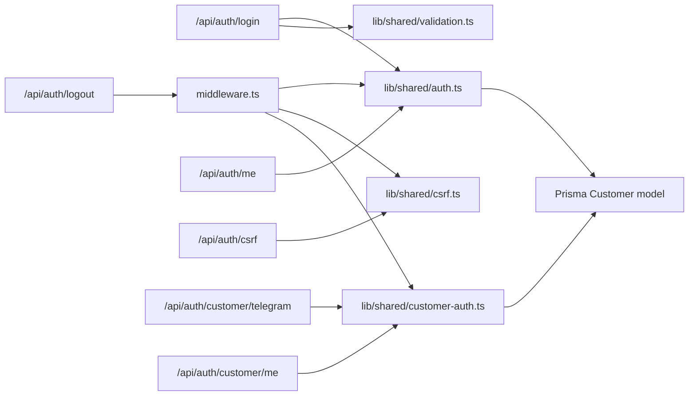

# API Security

<cite>
**Referenced Files in This Document**
- [login/route.ts](file://app/api/auth/login/route.ts)
- [logout/route.ts](file://app/api/auth/logout/route.ts)
- [me/route.ts](file://app/api/auth/me/route.ts)
- [csrf/route.ts](file://app/api/auth/csrf/route.ts)
- [customer/me/route.ts](file://app/api/auth/customer/me/route.ts)
- [customer/telegram/route.ts](file://app/api/auth/customer/telegram/route.ts)
- [auth.ts](file://lib/shared/auth.ts)
- [csrf.ts](file://lib/shared/csrf.ts)
- [customer-auth.ts](file://lib/shared/customer-auth.ts)
- [middleware.ts](file://middleware.ts)
- [validation.ts](file://lib/shared/validation.ts)
- [rate-limit.ts](file://lib/shared/rate-limit.ts)
- [auth.schema.ts](file://lib/shared/schemas/auth.schema.ts)
- [schema.prisma](file://prisma/schema.prisma)
- [auth.test.ts](file://tests/unit/lib/auth.test.ts)
- [rate-limit.test.ts](file://tests/unit/lib/rate-limit.test.ts)
</cite>

## Table of Contents
1. [Introduction](#introduction)
2. [Project Structure](#project-structure)
3. [Core Components](#core-components)
4. [Architecture Overview](#architecture-overview)
5. [Detailed Component Analysis](#detailed-component-analysis)
6. [Dependency Analysis](#dependency-analysis)
7. [Performance Considerations](#performance-considerations)
8. [Troubleshooting Guide](#troubleshooting-guide)
9. [Conclusion](#conclusion)
10. [Appendices](#appendices)

## Introduction
This document provides comprehensive API security documentation for ListOpt ERP’s authentication endpoints. It covers authentication flows, session management via cookies, CSRF protection, rate limiting, and error handling patterns. It also outlines token-based session mechanics, customer authentication via Telegram, webhook security considerations, and best practices for secure API consumption.

## Project Structure
Authentication-related endpoints are organized under the Next.js App Router at app/api/auth and app/api/auth/customer. Shared security utilities reside in lib/shared, including session signing/verification, CSRF handling, customer session management, middleware enforcement, validation, and rate limiting.



**Diagram sources**
- [login/route.ts:1-60](file://app/api/auth/login/route.ts#L1-L60)
- [logout/route.ts:1-22](file://app/api/auth/logout/route.ts#L1-L22)
- [me/route.ts:1-11](file://app/api/auth/me/route.ts#L1-L11)
- [csrf/route.ts:1-42](file://app/api/auth/csrf/route.ts#L1-L42)
- [customer/me/route.ts:1-42](file://app/api/auth/customer/me/route.ts#L1-L42)
- [customer/telegram/route.ts:1-119](file://app/api/auth/customer/telegram/route.ts#L1-L119)
- [auth.ts:1-89](file://lib/shared/auth.ts#L1-L89)
- [csrf.ts:1-189](file://lib/shared/csrf.ts#L1-L189)
- [customer-auth.ts:1-100](file://lib/shared/customer-auth.ts#L1-L100)
- [middleware.ts:1-169](file://middleware.ts#L1-L169)
- [validation.ts:1-63](file://lib/shared/validation.ts#L1-L63)
- [rate-limit.ts:1-115](file://lib/shared/rate-limit.ts#L1-L115)

**Section sources**
- [login/route.ts:1-60](file://app/api/auth/login/route.ts#L1-L60)
- [logout/route.ts:1-22](file://app/api/auth/logout/route.ts#L1-L22)
- [me/route.ts:1-11](file://app/api/auth/me/route.ts#L1-L11)
- [csrf/route.ts:1-42](file://app/api/auth/csrf/route.ts#L1-L42)
- [customer/me/route.ts:1-42](file://app/api/auth/customer/me/route.ts#L1-L42)
- [customer/telegram/route.ts:1-119](file://app/api/auth/customer/telegram/route.ts#L1-L119)
- [auth.ts:1-89](file://lib/shared/auth.ts#L1-L89)
- [csrf.ts:1-189](file://lib/shared/csrf.ts#L1-L189)
- [customer-auth.ts:1-100](file://lib/shared/customer-auth.ts#L1-L100)
- [middleware.ts:1-169](file://middleware.ts#L1-L169)
- [validation.ts:1-63](file://lib/shared/validation.ts#L1-L63)
- [rate-limit.ts:1-115](file://lib/shared/rate-limit.ts#L1-L115)

## Core Components
- Session-based authentication for ERP users using a signed cookie named session.
- CSRF protection via a signed cookie csrf_token and a request header X-CSRF-Token for state-changing requests.
- Customer authentication via Telegram Login Widget with a dedicated customer_session cookie.
- Validation and error handling using Zod schemas and a shared validation utility.
- Middleware enforcing session presence and CSRF validation for protected routes.
- In-memory rate limiting for basic protection against brute force and abuse.

**Section sources**
- [auth.ts:1-89](file://lib/shared/auth.ts#L1-L89)
- [csrf.ts:1-189](file://lib/shared/csrf.ts#L1-L189)
- [customer-auth.ts:1-100](file://lib/shared/customer-auth.ts#L1-L100)
- [middleware.ts:1-169](file://middleware.ts#L1-L169)
- [validation.ts:1-63](file://lib/shared/validation.ts#L1-L63)
- [rate-limit.ts:1-115](file://lib/shared/rate-limit.ts#L1-L115)

## Architecture Overview
The authentication architecture combines cookie-based sessions, CSRF protection, and middleware enforcement. ERP endpoints require a valid session cookie; customer endpoints use a separate customer_session cookie. CSRF tokens are fetched via a dedicated endpoint and included in the X-CSRF-Token header for state-changing requests.

```mermaid
sequenceDiagram
participant Client as "Client"
participant API as "ERP API"
participant MW as "Middleware"
participant CSRF as "CSRF Utils"
participant AUTH as "Auth Utils"
Client->>API : "POST /api/auth/login"
API->>AUTH : "Verify credentials"
API-->>Client : "Set-Cookie : session=...; HttpOnly; Secure; SameSite=Lax"
Client->>API : "GET /api/auth/me"
API->>MW : "Enforce session"
MW->>AUTH : "Verify session cookie"
AUTH-->>MW : "User info or null"
MW-->>Client : "200 OK { user } or 401 Unauthorized"
Client->>API : "GET /api/auth/csrf"
API-->>Client : "{ token } + Set-Cookie : csrf_token=signed"
Client->>API : "POST /api/protected (with X-CSRF-Token)"
API->>MW : "Enforce CSRF"
MW->>CSRF : "Validate signed token"
CSRF-->>MW : "Valid or invalid"
MW-->>Client : "200 OK or 403 CSRF failed"
```

**Diagram sources**
- [login/route.ts:1-60](file://app/api/auth/login/route.ts#L1-L60)
- [me/route.ts:1-11](file://app/api/auth/me/route.ts#L1-L11)
- [csrf/route.ts:1-42](file://app/api/auth/csrf/route.ts#L1-L42)
- [auth.ts:1-89](file://lib/shared/auth.ts#L1-L89)
- [csrf.ts:1-189](file://lib/shared/csrf.ts#L1-L189)
- [middleware.ts:1-169](file://middleware.ts#L1-L169)

## Detailed Component Analysis

### ERP Login Endpoint
- Purpose: Authenticate ERP users and establish a session via a signed cookie.
- Request: JSON body validated by a Zod schema requiring username and password.
- Response: On success, returns user info and sets a session cookie with HttpOnly, Secure, SameSite=Lax, 7-day maxAge.
- Error handling: 401 for invalid credentials; 500 for server errors; validation errors return 400 with field details.



**Diagram sources**
- [login/route.ts:1-60](file://app/api/auth/login/route.ts#L1-L60)
- [auth.ts:1-89](file://lib/shared/auth.ts#L1-L89)
- [auth.schema.ts:1-25](file://lib/shared/schemas/auth.schema.ts#L1-L25)
- [validation.ts:1-63](file://lib/shared/validation.ts#L1-L63)

**Section sources**
- [login/route.ts:1-60](file://app/api/auth/login/route.ts#L1-L60)
- [auth.schema.ts:1-25](file://lib/shared/schemas/auth.schema.ts#L1-L25)
- [validation.ts:1-63](file://lib/shared/validation.ts#L1-L63)
- [auth.ts:1-89](file://lib/shared/auth.ts#L1-L89)

### ERP Logout Endpoint
- Purpose: Invalidate the ERP session by clearing the session and CSRF cookies.
- Behavior: Sets both session and csrf_token cookies with maxAge=0 to expire immediately.
- Response: 200 with { success: true }.

```mermaid
sequenceDiagram
participant Client as "Client"
participant Logout as "POST /api/auth/logout"
participant Resp as "HTTP Response"
Client->>Logout : "POST"
Logout->>Resp : "Set-Cookie : session=; maxAge=0"
Logout->>Resp : "Set-Cookie : csrf_token=; maxAge=0"
Logout-->>Client : "200 { success : true }"
```

**Diagram sources**
- [logout/route.ts:1-22](file://app/api/auth/logout/route.ts#L1-L22)

**Section sources**
- [logout/route.ts:1-22](file://app/api/auth/logout/route.ts#L1-L22)

### Session Validation Endpoint
- Purpose: Retrieve currently authenticated ERP user based on session cookie.
- Behavior: Calls getAuthSession; returns 401 if no valid session; otherwise returns user object.



**Diagram sources**
- [me/route.ts:1-11](file://app/api/auth/me/route.ts#L1-L11)
- [auth.ts:1-89](file://lib/shared/auth.ts#L1-L89)

**Section sources**
- [me/route.ts:1-11](file://app/api/auth/me/route.ts#L1-L11)
- [auth.ts:1-89](file://lib/shared/auth.ts#L1-L89)

### CSRF Protection
- Token acquisition: GET /api/auth/csrf returns a token and sets a signed csrf_token cookie (HttpOnly, Secure, SameSite=Strict).
- Request validation: Middleware enforces CSRF for state-changing methods on API routes, excluding specific paths.
- Validation logic: Compares X-CSRF-Token header against the token embedded in the csrf_token cookie.



**Diagram sources**
- [csrf/route.ts:1-42](file://app/api/auth/csrf/route.ts#L1-L42)
- [csrf.ts:1-189](file://lib/shared/csrf.ts#L1-L189)
- [middleware.ts:1-169](file://middleware.ts#L1-L169)

**Section sources**
- [csrf/route.ts:1-42](file://app/api/auth/csrf/route.ts#L1-L42)
- [csrf.ts:1-189](file://lib/shared/csrf.ts#L1-L189)
- [middleware.ts:1-169](file://middleware.ts#L1-L169)

### Customer Authentication (Telegram Login Widget)
- Purpose: Authenticate customers via Telegram Login Widget and establish a customer_session cookie.
- Verification: Validates Telegram data using HMAC-SHA256 with a bot token derived from DB or environment.
- Session: Creates a signed customer_session cookie with HttpOnly, Secure, SameSite=Lax, 30-day maxAge.
- Profile management: GET /api/auth/customer/me returns customer; PATCH updates name/phone/email with Zod validation.



**Diagram sources**
- [customer/telegram/route.ts:1-119](file://app/api/auth/customer/telegram/route.ts#L1-L119)
- [customer-auth.ts:1-100](file://lib/shared/customer-auth.ts#L1-L100)
- [schema.prisma:629-656](file://prisma/schema.prisma#L629-L656)

**Section sources**
- [customer/telegram/route.ts:1-119](file://app/api/auth/customer/telegram/route.ts#L1-L119)
- [customer-auth.ts:1-100](file://lib/shared/customer-auth.ts#L1-L100)
- [schema.prisma:629-656](file://prisma/schema.prisma#L629-L656)

### Middleware Enforcement and Redirects
- Public routes: No authentication required (e.g., login, setup, integrations).
- ERP protected routes: Require session cookie; missing session results in redirect to /login or 401 for API.
- CSRF enforcement: Applies to state-changing API requests based on method and path exemptions.
- Customer flows: Separate customer_session cookie governs storefront/customer endpoints.



**Diagram sources**
- [middleware.ts:1-169](file://middleware.ts#L1-L169)

**Section sources**
- [middleware.ts:1-169](file://middleware.ts#L1-L169)

### Validation and Error Handling Patterns
- Zod schemas define request/response shapes for authentication endpoints.
- parseBody and parseQuery enforce schema validation and raise ValidationError.
- validationError converts validation errors to 400 responses with field details.
- Authentication routes wrap logic in try/catch and return standardized 4xx/5xx responses.



**Diagram sources**
- [validation.ts:1-63](file://lib/shared/validation.ts#L1-L63)
- [auth.schema.ts:1-25](file://lib/shared/schemas/auth.schema.ts#L1-L25)
- [login/route.ts:1-60](file://app/api/auth/login/route.ts#L1-L60)
- [customer/me/route.ts:1-42](file://app/api/auth/customer/me/route.ts#L1-L42)

**Section sources**
- [validation.ts:1-63](file://lib/shared/validation.ts#L1-L63)
- [auth.schema.ts:1-25](file://lib/shared/schemas/auth.schema.ts#L1-L25)
- [login/route.ts:1-60](file://app/api/auth/login/route.ts#L1-L60)
- [customer/me/route.ts:1-42](file://app/api/auth/customer/me/route.ts#L1-L42)

### Rate Limiting
- In-memory implementation tracks request counts per identifier within a sliding window.
- getClientIp extracts the client IP from x-forwarded-for or x-real-ip headers.
- Warning: Not suitable for multi-instance/serverless deployments; recommended to use Redis-based solutions in production.



**Diagram sources**
- [rate-limit.ts:1-115](file://lib/shared/rate-limit.ts#L1-L115)

**Section sources**
- [rate-limit.ts:1-115](file://lib/shared/rate-limit.ts#L1-L115)
- [rate-limit.test.ts:1-151](file://tests/unit/lib/rate-limit.test.ts#L1-L151)

### Session Token Mechanics
- ERP session tokens embed userId and expiration timestamp, signed with HMAC-SHA256 using SESSION_SECRET.
- Verification performs timing-safe signature comparison and expiry checks.
- Tests validate token creation, expiration, tampering detection, and timing safety.



**Diagram sources**
- [auth.ts:1-89](file://lib/shared/auth.ts#L1-L89)
- [auth.test.ts:1-81](file://tests/unit/lib/auth.test.ts#L1-L81)

**Section sources**
- [auth.ts:1-89](file://lib/shared/auth.ts#L1-L89)
- [auth.test.ts:1-81](file://tests/unit/lib/auth.test.ts#L1-L81)

## Dependency Analysis
Authentication endpoints depend on shared utilities for session signing, CSRF handling, validation, and middleware enforcement. The database model defines user roles and customer records used by authentication flows.



**Diagram sources**
- [login/route.ts:1-60](file://app/api/auth/login/route.ts#L1-L60)
- [logout/route.ts:1-22](file://app/api/auth/logout/route.ts#L1-L22)
- [me/route.ts:1-11](file://app/api/auth/me/route.ts#L1-L11)
- [csrf/route.ts:1-42](file://app/api/auth/csrf/route.ts#L1-L42)
- [customer/telegram/route.ts:1-119](file://app/api/auth/customer/telegram/route.ts#L1-L119)
- [customer/me/route.ts:1-42](file://app/api/auth/customer/me/route.ts#L1-L42)
- [auth.ts:1-89](file://lib/shared/auth.ts#L1-L89)
- [csrf.ts:1-189](file://lib/shared/csrf.ts#L1-L189)
- [customer-auth.ts:1-100](file://lib/shared/customer-auth.ts#L1-L100)
- [middleware.ts:1-169](file://middleware.ts#L1-L169)
- [schema.prisma:21-32](file://prisma/schema.prisma#L21-L32)
- [schema.prisma:629-656](file://prisma/schema.prisma#L629-L656)

**Section sources**
- [login/route.ts:1-60](file://app/api/auth/login/route.ts#L1-L60)
- [logout/route.ts:1-22](file://app/api/auth/logout/route.ts#L1-L22)
- [me/route.ts:1-11](file://app/api/auth/me/route.ts#L1-L11)
- [csrf/route.ts:1-42](file://app/api/auth/csrf/route.ts#L1-L42)
- [customer/telegram/route.ts:1-119](file://app/api/auth/customer/telegram/route.ts#L1-L119)
- [customer/me/route.ts:1-42](file://app/api/auth/customer/me/route.ts#L1-L42)
- [auth.ts:1-89](file://lib/shared/auth.ts#L1-L89)
- [csrf.ts:1-189](file://lib/shared/csrf.ts#L1-L189)
- [customer-auth.ts:1-100](file://lib/shared/customer-auth.ts#L1-L100)
- [middleware.ts:1-169](file://middleware.ts#L1-L169)
- [schema.prisma:21-32](file://prisma/schema.prisma#L21-L32)
- [schema.prisma:629-656](file://prisma/schema.prisma#L629-L656)

## Performance Considerations
- In-memory rate limiter is lightweight but unsuitable for multi-instance deployments; consider Redis-backed solutions for horizontal scaling.
- Session and CSRF token verification rely on HMAC operations; ensure SESSION_SECRET is strong and environment-managed.
- Middleware runs on every request; keep path lists precise to minimize unnecessary checks.

[No sources needed since this section provides general guidance]

## Troubleshooting Guide
Common issues and resolutions:
- 401 Unauthorized on protected endpoints: Ensure session cookie is present and unexpired; verify middleware redirects for non-API routes.
- CSRF validation failed (403): Obtain a fresh CSRF token from /api/auth/csrf and include X-CSRF-Token header for state-changing requests.
- Validation errors (400): Review field-level error messages returned by validation utilities; ensure request body matches Zod schemas.
- Rate limit exceeded: Reduce request frequency or adjust window/limit parameters; consider implementing client-side backoff.

**Section sources**
- [middleware.ts:1-169](file://middleware.ts#L1-L169)
- [csrf/route.ts:1-42](file://app/api/auth/csrf/route.ts#L1-L42)
- [validation.ts:1-63](file://lib/shared/validation.ts#L1-L63)
- [rate-limit.ts:1-115](file://lib/shared/rate-limit.ts#L1-L115)

## Conclusion
ListOpt ERP employs robust cookie-based session management for ERP users, complemented by CSRF protection and middleware enforcement. Customer authentication leverages Telegram Login Widget with a dedicated session cookie. Validation and error handling are standardized using Zod and shared utilities. For production, consider upgrading rate limiting to a distributed store and hardening secrets management.

[No sources needed since this section summarizes without analyzing specific files]

## Appendices

### API Endpoints and Schemas

- POST /api/auth/login
  - Request: { username, password }
  - Response: { user: { id, username, role } }
  - Cookies: session (HttpOnly, Secure, SameSite=Lax, 7 days)
  - Errors: 400 (validation), 401 (credentials), 500 (server)

- POST /api/auth/logout
  - Response: { success: true }
  - Side effects: Clears session and csrf_token cookies

- GET /api/auth/me
  - Response: { user }
  - Errors: 401 (unauthorized)

- GET /api/auth/csrf
  - Response: { token, message }
  - Cookies: csrf_token (HttpOnly, Secure, SameSite=Strict, 24 hours)
  - Errors: 500 (missing SESSION_SECRET)

- POST /api/auth/customer/telegram
  - Request: Telegram Login Widget payload
  - Response: { id, name, telegramUsername }
  - Cookies: customer_session (HttpOnly, Secure, SameSite=Lax, 30 days)
  - Errors: 401 (invalid), 403 (deactivated), 500 (server)

- GET /api/auth/customer/me
  - Response: { customer }
  - Errors: 401 (unauthorized)

- PATCH /api/auth/customer/me
  - Request: { name?, phone?, email? }
  - Response: { customer }
  - Errors: 400 (validation), 401 (unauthorized), 500 (server)

**Section sources**
- [login/route.ts:1-60](file://app/api/auth/login/route.ts#L1-L60)
- [logout/route.ts:1-22](file://app/api/auth/logout/route.ts#L1-L22)
- [me/route.ts:1-11](file://app/api/auth/me/route.ts#L1-L11)
- [csrf/route.ts:1-42](file://app/api/auth/csrf/route.ts#L1-L42)
- [customer/telegram/route.ts:1-119](file://app/api/auth/customer/telegram/route.ts#L1-L119)
- [customer/me/route.ts:1-42](file://app/api/auth/customer/me/route.ts#L1-L42)
- [auth.schema.ts:1-25](file://lib/shared/schemas/auth.schema.ts#L1-L25)

### Security Best Practices
- Transport security: Enable HTTPS and set Secure cookies in production.
- Cookie attributes: Use HttpOnly and SameSite policies; prefer Strict for CSRF cookie.
- Secrets management: Store SESSION_SECRET and bot tokens in environment variables; rotate regularly.
- Token storage: Do not store session tokens in localStorage; rely on HttpOnly cookies.
- CSRF: Always fetch a fresh token and include X-CSRF-Token for state-changing requests.
- Rate limiting: Deploy Redis-backed rate limiter for multi-instance environments.
- Input validation: Enforce strict Zod schemas on all endpoints; sanitize and validate early.

[No sources needed since this section provides general guidance]

### Webhook Security and External Integrations
- Webhook routes are public and intentionally do not use cookie-based authentication.
- Implement signature verification using shared secrets or HMAC over request bodies.
- Validate source IP ranges or use platform-specific signatures (e.g., Telegram).
- Apply idempotency checks to prevent duplicate processing.

[No sources needed since this section provides general guidance]