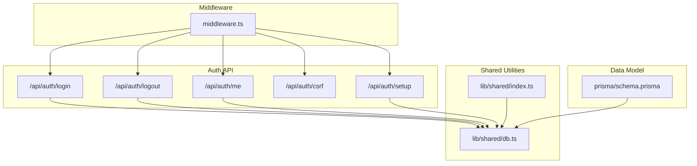
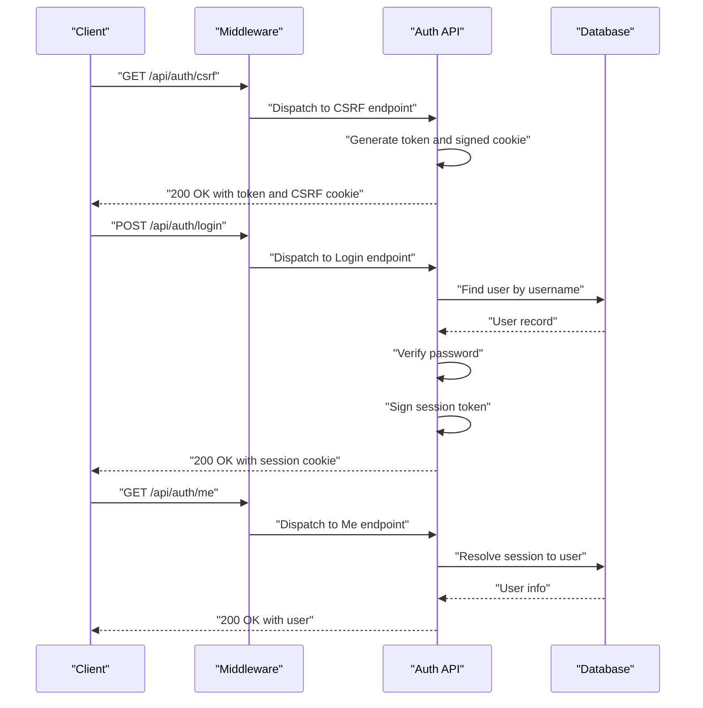
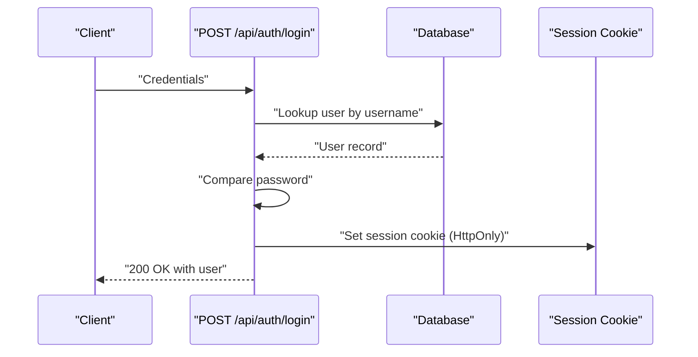
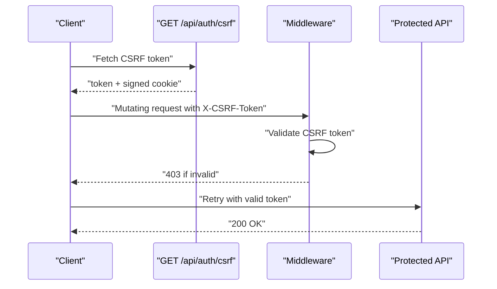
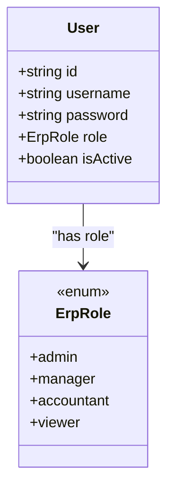
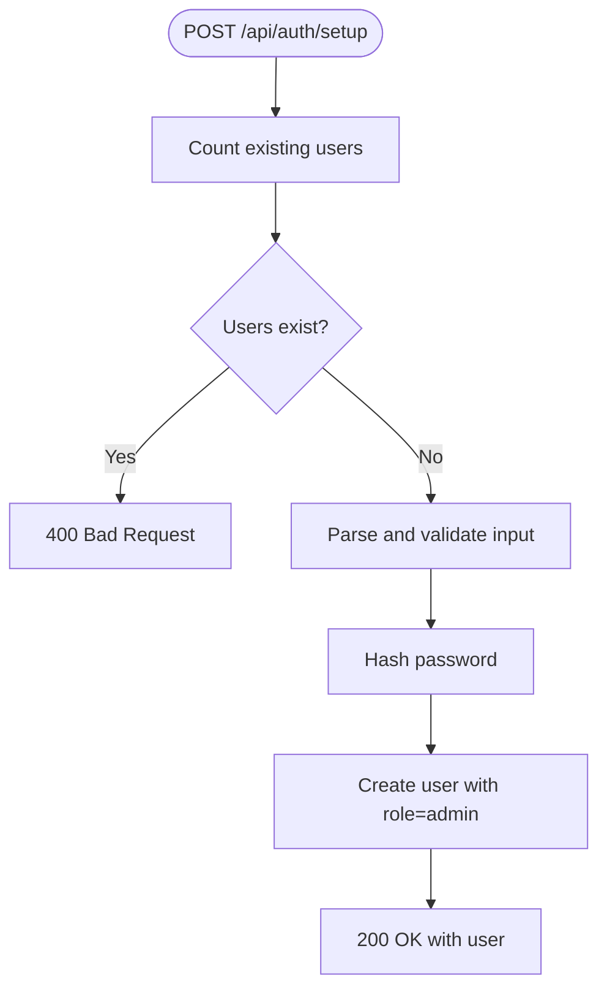
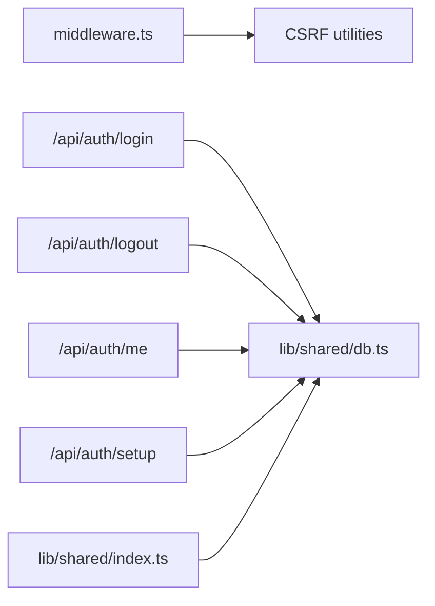

# Authentication & Authorization

<cite>
**Referenced Files in This Document**
- [middleware.ts](file://middleware.ts)
- [login route.ts](file://app/api/auth/login/route.ts)
- [logout route.ts](file://app/api/auth/logout/route.ts)
- [me route.ts](file://app/api/auth/me/route.ts)
- [csrf route.ts](file://app/api/auth/csrf/route.ts)
- [setup route.ts](file://app/api/auth/setup/route.ts)
- [db.ts](file://lib/shared/db.ts)
- [index.ts (lib/shared)](file://lib/shared/index.ts)
- [schema.prisma](file://prisma/schema.prisma)
</cite>

## Table of Contents
1. [Introduction](#introduction)
2. [Project Structure](#project-structure)
3. [Core Components](#core-components)
4. [Architecture Overview](#architecture-overview)
5. [Detailed Component Analysis](#detailed-component-analysis)
6. [Dependency Analysis](#dependency-analysis)
7. [Performance Considerations](#performance-considerations)
8. [Troubleshooting Guide](#troubleshooting-guide)
9. [Conclusion](#conclusion)
10. [Appendices](#appendices)

## Introduction
This document describes the authentication and authorization model for ListOpt ERP. It covers the security model including user roles, permissions, and access control mechanisms; the authentication flow from login to session management; CSRF protection and token handling; the authorization system with role-based access control (RBAC); middleware implementation for request processing and session validation; API authentication methods and secure session management; best practices for passwords and account management; and integration points for external authentication providers and social login. It also includes troubleshooting guidance for common authentication issues and security configuration.

## Project Structure
Authentication and authorization are implemented primarily via:
- Middleware for request routing, session validation, CSRF protection, and rate limiting
- API endpoints for login, logout, session retrieval, CSRF token provisioning, and initial setup
- Shared utilities for database access, logging, rate limiting, and validation
- Prisma schema defining the user model and roles

**Diagram sources**
- [middleware.ts:45-151](file://middleware.ts#L45-L151)
- [login route.ts:9-59](file://app/api/auth/login/route.ts#L9-L59)
- [logout route.ts:3-13](file://app/api/auth/logout/route.ts#L3-L13)
- [me route.ts:4-10](file://app/api/auth/me/route.ts#L4-L10)
- [csrf route.ts:14-41](file://app/api/auth/csrf/route.ts#L14-L41)
- [setup route.ts:7-37](file://app/api/auth/setup/route.ts#L7-L37)
- [db.ts:1-25](file://lib/shared/db.ts#L1-L25)
- [index.ts (lib/shared):1-9](file://lib/shared/index.ts#L1-L9)
- [schema.prisma:14-32](file://prisma/schema.prisma#L14-L32)

**Section sources**
- [middleware.ts:13-37](file://middleware.ts#L13-L37)
- [login route.ts:1-60](file://app/api/auth/login/route.ts#L1-L60)
- [logout route.ts:1-14](file://app/api/auth/logout/route.ts#L1-L14)
- [me route.ts:1-11](file://app/api/auth/me/route.ts#L1-L11)
- [csrf route.ts:1-42](file://app/api/auth/csrf/route.ts#L1-L42)
- [setup route.ts:1-38](file://app/api/auth/setup/route.ts#L1-L38)
- [db.ts:1-25](file://lib/shared/db.ts#L1-L25)
- [index.ts (lib/shared):1-9](file://lib/shared/index.ts#L1-L9)
- [schema.prisma:14-32](file://prisma/schema.prisma#L14-L32)

## Core Components
- Session-based authentication for ERP (accounting) routes using an HttpOnly session cookie
- CSRF protection enforced for mutating API requests
- Rate limiting applied at the middleware level
- Role-based access control (RBAC) defined by the user role enum
- Initial system setup endpoint for creating the first admin user
- Public storefront routes separated from ERP routes with distinct session handling

Key implementation highlights:
- ERP session cookie name: session
- CSRF cookie name: configured via CSRF_COOKIE_NAME constant
- Request ID propagation for observability
- Redirects for legacy ERP routes

**Section sources**
- [middleware.ts:13-37](file://middleware.ts#L13-L37)
- [middleware.ts:111-117](file://middleware.ts#L111-L117)
- [middleware.ts:119-143](file://middleware.ts#L119-L143)
- [csrf route.ts:32-38](file://app/api/auth/csrf/route.ts#L32-L38)
- [login route.ts:44-50](file://app/api/auth/login/route.ts#L44-L50)
- [logout route.ts:5-11](file://app/api/auth/logout/route.ts#L5-L11)
- [setup route.ts:9-16](file://app/api/auth/setup/route.ts#L9-L16)

## Architecture Overview
The authentication and authorization architecture combines middleware-driven enforcement with dedicated API endpoints.

**Diagram sources**
- [middleware.ts:119-143](file://middleware.ts#L119-L143)
- [csrf route.ts:14-41](file://app/api/auth/csrf/route.ts#L14-L41)
- [login route.ts:9-59](file://app/api/auth/login/route.ts#L9-L59)
- [me route.ts:4-10](file://app/api/auth/me/route.ts#L4-L10)
- [db.ts:1-25](file://lib/shared/db.ts#L1-L25)

## Detailed Component Analysis

### Middleware and Access Control
The middleware enforces:
- Public routes (no authentication)
- Storefront public and customer-protected routes
- ERP session validation and CSRF protection for ERP API routes
- Old route redirects for authenticated ERP users
- Request ID header injection for tracing

**Diagram sources**
- [middleware.ts:45-151](file://middleware.ts#L45-L151)

**Section sources**
- [middleware.ts:13-37](file://middleware.ts#L13-L37)
- [middleware.ts:111-117](file://middleware.ts#L111-L117)
- [middleware.ts:119-143](file://middleware.ts#L119-L143)

### Authentication Flow: Login to Session Management
- Login validates credentials against the database and creates a signed session token
- The session cookie is HttpOnly, secure when enabled, with a 7-day max age
- Logout clears the session cookie immediately
- Me endpoint retrieves the current user from the session

**Diagram sources**
- [login route.ts:9-59](file://app/api/auth/login/route.ts#L9-L59)
- [db.ts:1-25](file://lib/shared/db.ts#L1-L25)

**Section sources**
- [login route.ts:15-35](file://app/api/auth/login/route.ts#L15-L35)
- [login route.ts:37-50](file://app/api/auth/login/route.ts#L37-L50)
- [logout route.ts:3-13](file://app/api/auth/logout/route.ts#L3-L13)
- [me route.ts:4-10](file://app/api/auth/me/route.ts#L4-L10)

### CSRF Protection
- CSRF token is generated and signed server-side
- Token is returned in response body and stored in an HttpOnly cookie
- For mutating API requests, clients must send the token in the X-CSRF-Token header
- Middleware validates CSRF tokens for protected routes

**Diagram sources**
- [csrf route.ts:14-41](file://app/api/auth/csrf/route.ts#L14-L41)
- [middleware.ts:119-143](file://middleware.ts#L119-L143)

**Section sources**
- [csrf route.ts:14-41](file://app/api/auth/csrf/route.ts#L14-L41)
- [middleware.ts:119-143](file://middleware.ts#L119-L143)

### Authorization Model: RBAC and Permissions
- Roles are defined in the data model and govern access to ERP features
- Permission checks are invoked via requirePermission in API handlers
- Unauthorized errors are handled centrally via handleAuthError

**Diagram sources**
- [schema.prisma:14-32](file://prisma/schema.prisma#L14-L32)

**Section sources**
- [schema.prisma:14-32](file://prisma/schema.prisma#L14-L32)
- [login route.ts:37-42](file://app/api/auth/login/route.ts#L37-L42)

### Setup Flow: First Admin Account
- The setup endpoint allows creating the first admin user only if no users exist
- Passwords are hashed before storage
- On success, returns the created user

**Diagram sources**
- [setup route.ts:7-37](file://app/api/auth/setup/route.ts#L7-L37)

**Section sources**
- [setup route.ts:9-16](file://app/api/auth/setup/route.ts#L9-L16)
- [setup route.ts:20-27](file://app/api/auth/setup/route.ts#L20-L27)

### External Authentication Providers and Social Login
- No external OAuth providers or social login endpoints are present in the codebase
- Telegram customer authentication exists under customer auth routes and storefront customer routes
- Integration points for third-party providers are not implemented

**Section sources**
- [middleware.ts:19-29](file://middleware.ts#L19-L29)

## Dependency Analysis
- Middleware depends on CSRF utilities for token validation and exemptions
- Auth endpoints depend on the database client for user lookup and creation
- Shared index re-exports database and logging utilities for consistent usage

**Diagram sources**
- [middleware.ts:1-8](file://middleware.ts#L1-L8)
- [login route.ts:1-7](file://app/api/auth/login/route.ts#L1-L7)
- [logout route.ts:1-1](file://app/api/auth/logout/route.ts#L1-L1)
- [me route.ts:1-2](file://app/api/auth/me/route.ts#L1-L2)
- [setup route.ts:1-5](file://app/api/auth/setup/route.ts#L1-L5)
- [index.ts (lib/shared):1-9](file://lib/shared/index.ts#L1-L9)

**Section sources**
- [middleware.ts:1-8](file://middleware.ts#L1-L8)
- [index.ts (lib/shared):1-9](file://lib/shared/index.ts#L1-L9)

## Performance Considerations
- Session cookies are HttpOnly and optionally secure, reducing XSS risks and enabling transport security
- CSRF cookies are HttpOnly and strict, minimizing exposure
- Middleware performs lightweight checks per request; ensure database connection pooling is configured appropriately
- Consider rotating session secrets periodically and reviewing cookie security flags in production

## Troubleshooting Guide
Common issues and resolutions:
- Login fails with invalid credentials
  - Verify username exists and is active
  - Confirm password matches the stored hash
  - Check server logs for warnings during login attempts
  - Section sources
    - [login route.ts:20-35](file://app/api/auth/login/route.ts#L20-L35)

- Unauthorized access to ERP routes
  - Ensure session cookie is present and valid
  - For API routes, missing or invalid session results in 401
  - For UI routes, user is redirected to the login page
  - Section sources
    - [middleware.ts:111-117](file://middleware.ts#L111-L117)

- CSRF validation failures
  - Obtain a fresh CSRF token from the CSRF endpoint
  - Include the token in the X-CSRF-Token header for mutating requests
  - Ensure the CSRF cookie is set and not blocked by browser policies
  - Section sources
    - [csrf route.ts:14-41](file://app/api/auth/csrf/route.ts#L14-L41)
    - [middleware.ts:119-143](file://middleware.ts#L119-L143)

- Setup endpoint returns bad request
  - Setup is only allowed when no users exist
  - Delete existing users or reset the database before attempting setup again
  - Section sources
    - [setup route.ts:9-16](file://app/api/auth/setup/route.ts#L9-L16)

- Missing database configuration
  - DATABASE_URL must be set; otherwise, the database client throws an error
  - Section sources
    - [db.ts:6-9](file://lib/shared/db.ts#L6-L9)

- Rate limiting impacts
  - Middleware applies rate limiting; excessive requests may be throttled
  - Adjust rate limit settings as needed for development or production
  - Section sources
    - [middleware.ts:7-7](file://middleware.ts#L7-L7)

## Conclusion
ListOpt ERP implements a clear session-based authentication model for ERP access, complemented by CSRF protection and middleware-driven enforcement. The RBAC model is defined by the user role enum, while permission checks are integrated into API handlers. The setup flow enables secure initialization of the first admin user. External authentication providers and social login are not currently implemented. Proper configuration of environment variables, cookie security flags, and rate limiting ensures robust operation.

## Appendices
- Environment variables used:
  - DATABASE_URL: Postgres connection string for Prisma
  - SESSION_SECRET: Secret for signing CSRF and session tokens
  - SECURE_COOKIES: Enables secure flag on cookies when set to true
- Cookie configuration defaults:
  - session: HttpOnly, optional Secure, SameSite lax, 7-day max age
  - CSRF: HttpOnly, optional Secure, SameSite strict, 24-hour max age