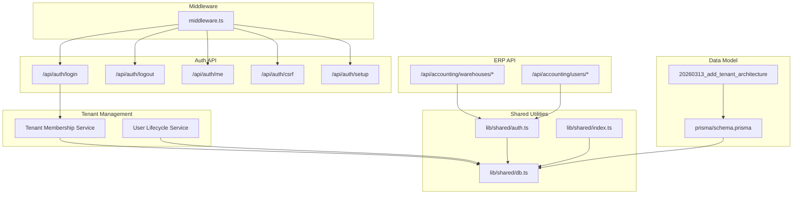
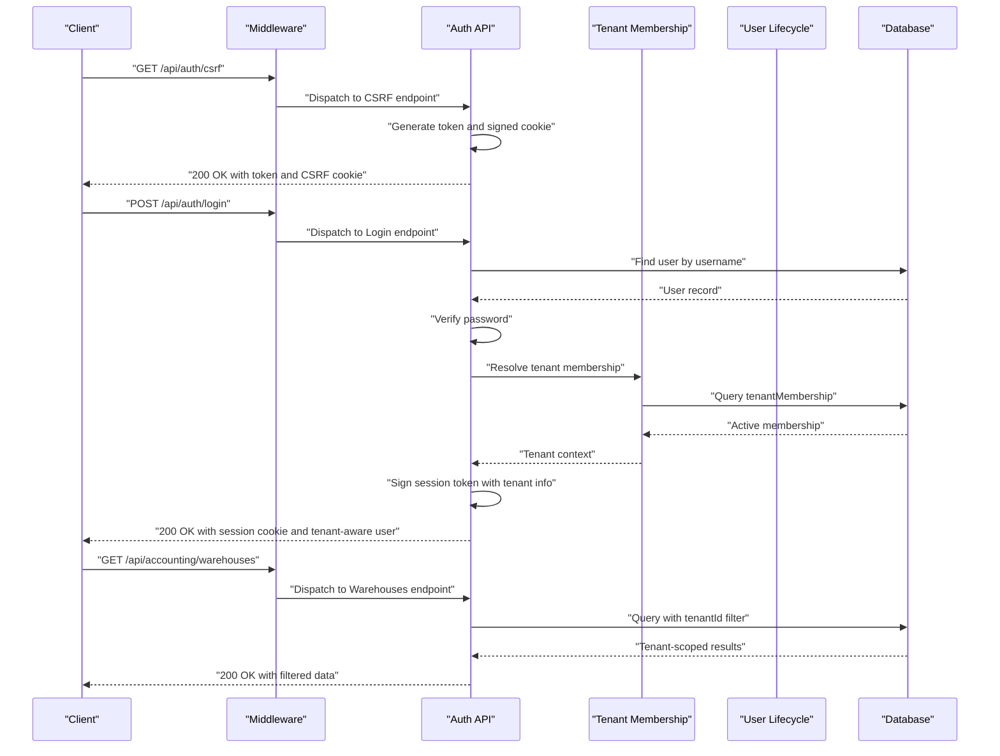
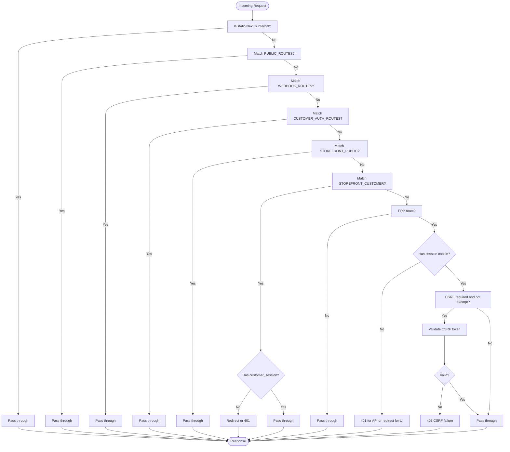
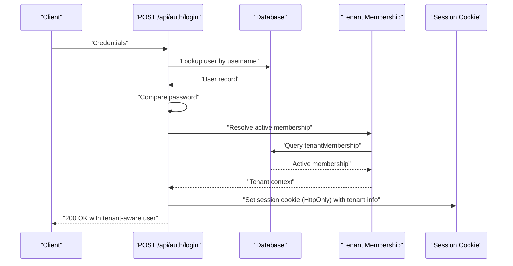
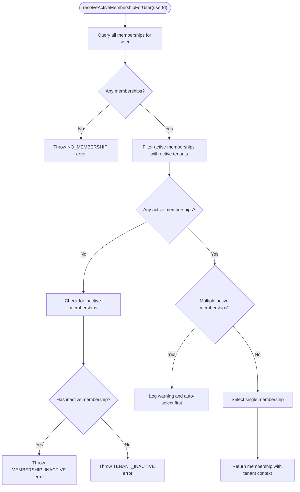
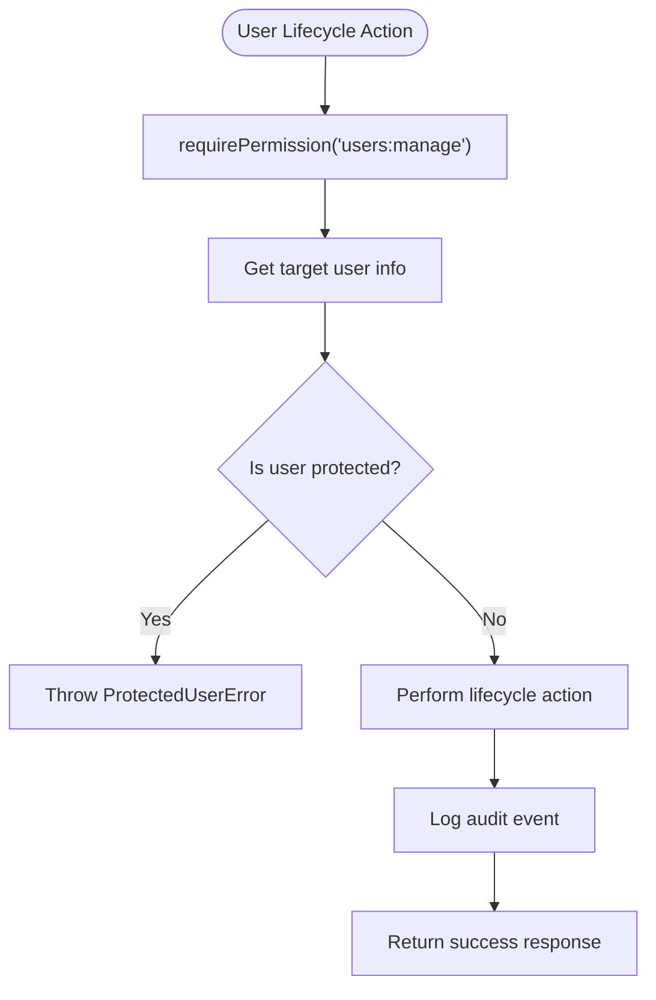
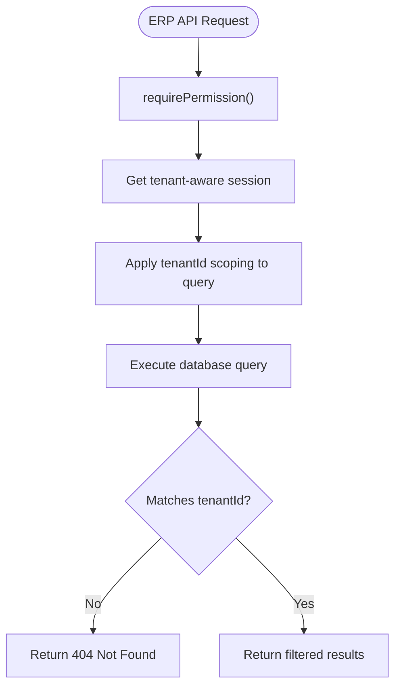
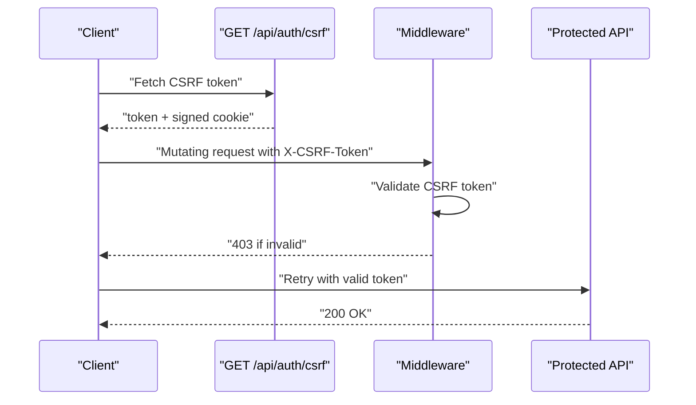
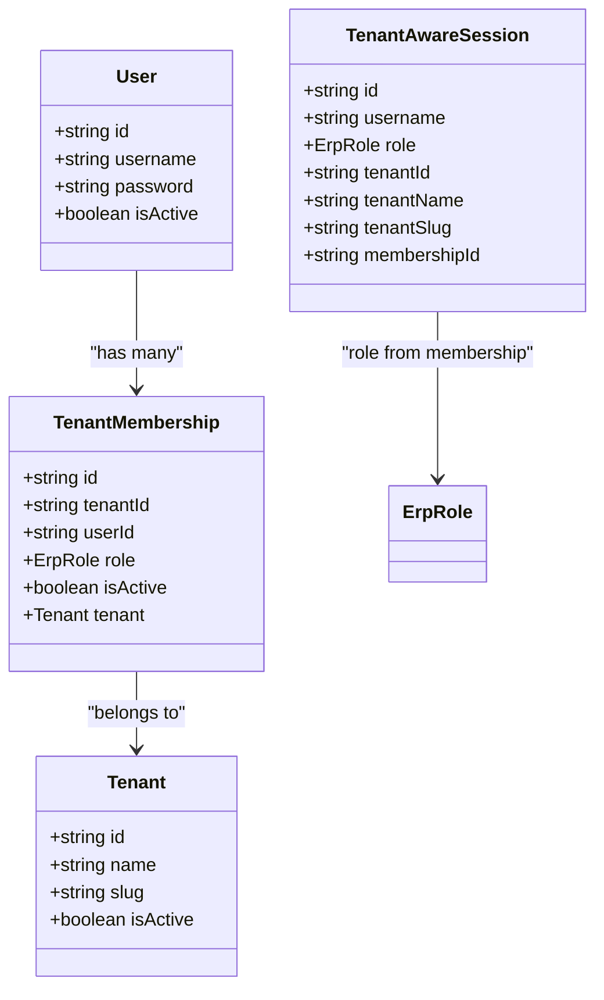
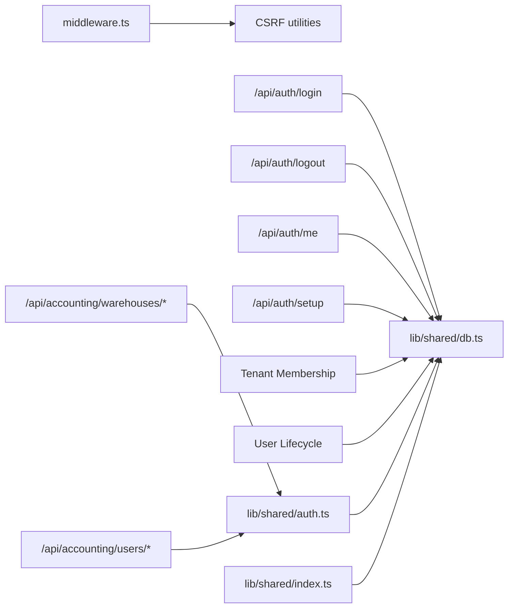

# Authentication & Authorization

<cite>
**Referenced Files in This Document**
- [middleware.ts](file://middleware.ts)
- [login route.ts](file://app/api/auth/login/route.ts)
- [logout route.ts](file://app/api/auth/logout/route.ts)
- [me route.ts](file://app/api/auth/me/route.ts)
- [csrf route.ts](file://app/api/auth/csrf/route.ts)
- [setup route.ts](file://app/api/auth/setup/route.ts)
- [resolve-membership.ts](file://lib/modules/auth/resolve-membership.ts)
- [auth.ts](file://lib/shared/auth.ts)
- [user-lifecycle.ts](file://lib/modules/accounting/services/user-lifecycle.ts)
- [activate route.ts](file://app/api/accounting/users/[id]/activate/route.ts)
- [deactivate route.ts](file://app/api/accounting/users/[id]/deactivate/route.ts)
- [warehouses route.ts](file://app/api/accounting/warehouses/route.ts)
- [warehouses [id] route.ts](file://app/api/accounting/warehouses/[id]/route.ts)
- [users [id] route.ts](file://app/api/accounting/users/[id]/route.ts)
- [db.ts](file://lib/shared/db.ts)
- [index.ts (lib/shared)](file://lib/shared/index.ts)
- [schema.prisma](file://prisma/schema.prisma)
- [migration.sql](file://prisma/migrations/20260313_add_tenant_architecture/migration.sql)
</cite>

## Update Summary
**Changes Made**
- Added comprehensive tenant membership resolution system with multi-tenant support
- Integrated user lifecycle management with protected user protection
- Implemented tenant-aware session management and access controls
- Added multi-tenant data scoping across all ERP API endpoints
- Enhanced authorization model with tenant-specific permissions

## Table of Contents
1. [Introduction](#introduction)
2. [Project Structure](#project-structure)
3. [Core Components](#core-components)
4. [Architecture Overview](#architecture-overview)
5. [Detailed Component Analysis](#detailed-component-analysis)
6. [Dependency Analysis](#dependency-analysis)
7. [Performance Considerations](#performance-considerations)
8. [Troubleshooting Guide](#troubleshooting-guide)
9. [Conclusion](#conclusion)
10. [Appendices](#appendices)

## Introduction
This document describes the authentication and authorization model for ListOpt ERP, which now includes comprehensive multi-tenant support. The system features tenant membership resolution, user lifecycle management with protected user protection, and tenant-aware access controls. It covers the security model including user roles, permissions, and access control mechanisms; the authentication flow from login to session management; CSRF protection and token handling; the enhanced authorization system with role-based access control (RBAC) and tenant-specific permissions; middleware implementation for request processing and session validation; API authentication methods and secure session management; best practices for passwords and account management; and integration points for external authentication providers and social login. It also includes troubleshooting guidance for common authentication issues and security configuration.

## Project Structure
Authentication and authorization are implemented primarily via:
- Middleware for request routing, session validation, CSRF protection, and rate limiting
- API endpoints for login, logout, session retrieval, CSRF token provisioning, and initial setup
- Tenant membership resolution service for multi-tenant authentication
- User lifecycle management with protected user protection
- Shared utilities for database access, logging, rate limiting, and validation
- Prisma schema defining the user model, tenant relationships, and multi-tenant data architecture

**Diagram sources**
- [middleware.ts:58-164](file://middleware.ts#L58-L164)
- [login route.ts:13-99](file://app/api/auth/login/route.ts#L13-L99)
- [logout route.ts:3-13](file://app/api/auth/logout/route.ts#L3-L13)
- [me route.ts:4-10](file://app/api/auth/me/route.ts#L4-L10)
- [csrf route.ts:14-41](file://app/api/auth/csrf/route.ts#L14-L41)
- [setup route.ts:7-37](file://app/api/auth/setup/route.ts#L7-L37)
- [resolve-membership.ts:73-141](file://lib/modules/auth/resolve-membership.ts#L73-L141)
- [user-lifecycle.ts:44-109](file://lib/modules/accounting/services/user-lifecycle.ts#L44-L109)
- [warehouses route.ts:14-43](file://app/api/accounting/warehouses/route.ts#L14-L43)
- [warehouses [id] route.ts:46-93](file://app/api/accounting/warehouses/[id]/route.ts#L46-L93)
- [users [id] route.ts:50-144](file://app/api/accounting/users/[id]/route.ts#L50-L144)
- [auth.ts:89-148](file://lib/shared/auth.ts#L89-L148)
- [db.ts:1-25](file://lib/shared/db.ts#L1-L25)
- [index.ts (lib/shared):1-9](file://lib/shared/index.ts#L1-L9)
- [schema.prisma:60-93](file://prisma/schema.prisma#L60-L93)
- [migration.sql:1-79](file://prisma/migrations/20260313_add_tenant_architecture/migration.sql#L1-L79)

**Section sources**
- [middleware.ts:13-37](file://middleware.ts#L13-L37)
- [login route.ts:1-60](file://app/api/auth/login/route.ts#L1-L60)
- [logout route.ts:1-14](file://app/api/auth/logout/route.ts#L1-L14)
- [me route.ts:1-11](file://app/api/auth/me/route.ts#L1-L11)
- [csrf route.ts:1-42](file://app/api/auth/csrf/route.ts#L1-L42)
- [setup route.ts:1-38](file://app/api/auth/setup/route.ts#L1-L38)
- [resolve-membership.ts:1-178](file://lib/modules/auth/resolve-membership.ts#L1-L178)
- [user-lifecycle.ts:1-110](file://lib/modules/accounting/services/user-lifecycle.ts#L1-L110)
- [auth.ts:1-154](file://lib/shared/auth.ts#L1-L154)
- [db.ts:1-25](file://lib/shared/db.ts#L1-L25)
- [index.ts (lib/shared):1-9](file://lib/shared/index.ts#L1-L9)
- [schema.prisma:60-93](file://prisma/schema.prisma#L60-L93)
- [migration.sql:1-79](file://prisma/migrations/20260313_add_tenant_architecture/migration.sql#L1-L79)

## Core Components
- Session-based authentication for ERP (accounting) routes using an HttpOnly session cookie with tenant awareness
- Multi-tenant membership resolution system with automatic tenant selection
- User lifecycle management with protected user protection and audit trails
- CSRF protection enforced for mutating API requests
- Rate limiting applied at the middleware level
- Enhanced role-based access control (RBAC) with tenant-specific permissions
- Initial system setup endpoint for creating the first admin user
- Tenant-aware data scoping across all ERP API endpoints
- Public storefront routes separated from ERP routes with distinct session handling

Key implementation highlights:
- ERP session cookie name: session with tenant-aware context
- CSRF cookie name: configured via CSRF_COOKIE_NAME constant
- Tenant membership resolution with automatic selection of active membership
- Protected user usernames: admin, test, developer with lifecycle protection
- Tenant scoping in all ERP API endpoints using session.tenantId
- Request ID propagation for observability
- Redirects for legacy ERP routes

**Section sources**
- [middleware.ts:13-37](file://middleware.ts#L13-L37)
- [middleware.ts:111-117](file://middleware.ts#L111-L117)
- [middleware.ts:119-143](file://middleware.ts#L119-L143)
- [csrf route.ts:32-38](file://app/api/auth/csrf/route.ts#L32-L38)
- [login route.ts:42-70](file://app/api/auth/login/route.ts#L42-L70)
- [logout route.ts:5-11](file://app/api/auth/logout/route.ts#L5-L11)
- [setup route.ts:9-16](file://app/api/auth/setup/route.ts#L9-L16)
- [resolve-membership.ts:73-141](file://lib/modules/auth/resolve-membership.ts#L73-L141)
- [user-lifecycle.ts:11,44-109](file://lib/modules/accounting/services/user-lifecycle.ts#L11,L44-L109)
- [auth.ts:69-77](file://lib/shared/auth.ts#L69-L77)

## Architecture Overview
The authentication and authorization architecture now includes comprehensive multi-tenant support with tenant membership resolution and user lifecycle management.

**Diagram sources**
- [middleware.ts:119-143](file://middleware.ts#L119-L143)
- [csrf route.ts:14-41](file://app/api/auth/csrf/route.ts#L14-L41)
- [login route.ts:13-99](file://app/api/auth/login/route.ts#L13-L99)
- [me route.ts:4-10](file://app/api/auth/me/route.ts#L4-L10)
- [resolve-membership.ts:73-141](file://lib/modules/auth/resolve-membership.ts#L73-L141)
- [warehouses route.ts:14-24](file://app/api/accounting/warehouses/route.ts#L14-L24)
- [db.ts:1-25](file://lib/shared/db.ts#L1-L25)

## Detailed Component Analysis

### Middleware and Access Control
The middleware enforces:
- Public routes (no authentication)
- Storefront public and customer-protected routes
- ERP session validation and CSRF protection for ERP API routes
- Old route redirects for authenticated ERP users
- Request ID header injection for tracing

**Diagram sources**
- [middleware.ts:45-151](file://middleware.ts#L45-L151)

**Section sources**
- [middleware.ts:13-37](file://middleware.ts#L13-L37)
- [middleware.ts:111-117](file://middleware.ts#L111-L117)
- [middleware.ts:119-143](file://middleware.ts#L119-L143)

### Authentication Flow: Login to Session Management with Tenant Awareness
- Login validates credentials against the database and creates a signed session token
- The session cookie is HttpOnly, secure when enabled, with a 7-day max age
- Tenant membership resolution occurs during login to determine active tenant context
- Logout clears the session cookie immediately
- Me endpoint retrieves the current user from the session with tenant context

**Diagram sources**
- [login route.ts:13-99](file://app/api/auth/login/route.ts#L13-L99)
- [resolve-membership.ts:73-141](file://lib/modules/auth/resolve-membership.ts#L73-L141)
- [db.ts:1-25](file://lib/shared/db.ts#L1-L25)

**Section sources**
- [login route.ts:15-35](file://app/api/auth/login/route.ts#L15-L35)
- [login route.ts:37-50](file://app/api/auth/login/route.ts#L37-L50)
- [login route.ts:42-70](file://app/api/auth/login/route.ts#L42-L70)
- [logout route.ts:3-13](file://app/api/auth/logout/route.ts#L3-L13)
- [me route.ts:4-10](file://app/api/auth/me/route.ts#L4-L10)

### Tenant Membership Resolution System
The tenant membership resolution system provides multi-tenant support with automatic membership selection and error handling.

**Diagram sources**
- [resolve-membership.ts:73-141](file://lib/modules/auth/resolve-membership.ts#L73-L141)

**Section sources**
- [resolve-membership.ts:16-22](file://lib/modules/auth/resolve-membership.ts#L16-L22)
- [resolve-membership.ts:24-53](file://lib/modules/auth/resolve-membership.ts#L24-L53)
- [resolve-membership.ts:73-141](file://lib/modules/auth/resolve-membership.ts#L73-L141)

### User Lifecycle Management with Protected Users
User lifecycle management includes protected user protection and audit trails for user state changes.

**Diagram sources**
- [user-lifecycle.ts:44-109](file://lib/modules/accounting/services/user-lifecycle.ts#L44-L109)
- [activate route.ts:17-54](file://app/api/accounting/users/[id]/activate/route.ts#L17-L54)
- [deactivate route.ts:21-77](file://app/api/accounting/users/[id]/deactivate/route.ts#L21-L77)

**Section sources**
- [user-lifecycle.ts:7-18](file://lib/modules/accounting/services/user-lifecycle.ts#L7-L18)
- [user-lifecycle.ts:20-38](file://lib/modules/accounting/services/user-lifecycle.ts#L20-L38)
- [user-lifecycle.ts:44-109](file://lib/modules/accounting/services/user-lifecycle.ts#L44-L109)
- [activate route.ts:17-54](file://app/api/accounting/users/[id]/activate/route.ts#L17-L54)
- [deactivate route.ts:21-77](file://app/api/accounting/users/[id]/deactivate/route.ts#L21-L77)

### Multi-Tenant Data Scoping
All ERP API endpoints now include tenant scoping to ensure data isolation between organizations.

**Diagram sources**
- [warehouses route.ts:14-24](file://app/api/accounting/warehouses/route.ts#L14-L24)
- [warehouses [id] route.ts:46-53](file://app/api/accounting/warehouses/[id]/route.ts#L46-L53)
- [users [id] route.ts:67-79](file://app/api/accounting/users/[id]/route.ts#L67-L79)

**Section sources**
- [warehouses route.ts:14-24](file://app/api/accounting/warehouses/route.ts#L14-L24)
- [warehouses [id] route.ts:46-53](file://app/api/accounting/warehouses/[id]/route.ts#L46-L53)
- [warehouses [id] route.ts:79-86](file://app/api/accounting/warehouses/[id]/route.ts#L79-L86)
- [users [id] route.ts:67-79](file://app/api/accounting/users/[id]/route.ts#L67-L79)

### CSRF Protection
- CSRF token is generated and signed server-side
- Token is returned in response body and stored in an HttpOnly cookie
- For mutating API requests, clients must send the token in the X-CSRF-Token header
- Middleware validates CSRF tokens for protected routes

**Diagram sources**
- [csrf route.ts:14-41](file://app/api/auth/csrf/route.ts#L14-L41)
- [middleware.ts:119-143](file://middleware.ts#L119-L143)

**Section sources**
- [csrf route.ts:14-41](file://app/api/auth/csrf/route.ts#L14-L41)
- [middleware.ts:119-143](file://middleware.ts#L119-L143)

### Enhanced Authorization Model: RBAC with Tenant Context
- Roles are defined in the data model and govern access to ERP features
- Tenant membership determines the user's role within a specific organization
- Permission checks are invoked via requirePermission in API handlers
- Unauthorized errors are handled centrally via handleAuthError
- Tenant-aware session context provides role from membership, not user

**Diagram sources**
- [schema.prisma:60-93](file://prisma/schema.prisma#L60-L93)
- [auth.ts:69-77](file://lib/shared/auth.ts#L69-L77)

**Section sources**
- [schema.prisma:60-93](file://prisma/schema.prisma#L60-L93)
- [login route.ts:37-42](file://app/api/auth/login/route.ts#L37-L42)
- [auth.ts:69-77](file://lib/shared/auth.ts#L69-L77)

### Setup Flow: First Admin Account
- The setup endpoint allows creating the first admin user only if no users exist
- Passwords are hashed before storage
- On success, returns the created user

**Diagram sources**
- [setup route.ts:7-37](file://app/api/auth/setup/route.ts#L7-L37)

**Section sources**
- [setup route.ts:9-16](file://app/api/auth/setup/route.ts#L9-L16)
- [setup route.ts:20-27](file://app/api/auth/setup/route.ts#L20-L27)

### External Authentication Providers and Social Login
- No external OAuth providers or social login endpoints are present in the codebase
- Telegram customer authentication exists under customer auth routes and storefront customer routes
- Integration points for third-party providers are not implemented

**Section sources**
- [middleware.ts:19-29](file://middleware.ts#L19-L29)

## Dependency Analysis
- Middleware depends on CSRF utilities for token validation and exemptions
- Auth endpoints depend on the database client for user lookup and creation
- Tenant membership resolution depends on database queries for membership and tenant data
- User lifecycle services depend on database operations and protected user validation
- ERP API endpoints depend on tenant-aware session context for data scoping
- Shared index re-exports database and logging utilities for consistent usage

**Diagram sources**
- [middleware.ts:1-8](file://middleware.ts#L1-L8)
- [login route.ts:1-7](file://app/api/auth/login/route.ts#L1-L7)
- [logout route.ts:1-1](file://app/api/auth/logout/route.ts#L1-L1)
- [me route.ts:1-2](file://app/api/auth/me/route.ts#L1-L2)
- [setup route.ts:1-5](file://app/api/auth/setup/route.ts#L1-L5)
- [resolve-membership.ts:11](file://lib/modules/auth/resolve-membership.ts#L11)
- [user-lifecycle.ts:5](file://lib/modules/accounting/services/user-lifecycle.ts#L5)
- [auth.ts:89-148](file://lib/shared/auth.ts#L89-L148)
- [index.ts (lib/shared):1-9](file://lib/shared/index.ts#L1-L9)

**Section sources**
- [middleware.ts:1-8](file://middleware.ts#L1-L8)
- [index.ts (lib/shared):1-9](file://lib/shared/index.ts#L1-L9)

## Performance Considerations
- Session cookies are HttpOnly and optionally secure, reducing XSS risks and enabling transport security
- CSRF cookies are HttpOnly and strict, minimizing exposure
- Middleware performs lightweight checks per request; ensure database connection pooling is configured appropriately
- Tenant membership resolution adds minimal overhead with efficient database queries
- User lifecycle operations include audit logging but maintain performance through optimized database operations
- Consider rotating session secrets periodically and reviewing cookie security flags in production

## Troubleshooting Guide
Common issues and resolutions:
- Login fails with invalid credentials
  - Verify username exists and is active
  - Confirm password matches the stored hash
  - Check server logs for warnings during login attempts
  - Section sources
    - [login route.ts:20-35](file://app/api/auth/login/route.ts#L20-L35)

- Tenant membership resolution failures
  - Check if user has active membership in any tenant
  - Verify tenant is active and not suspended
  - Review membership status and tenant status in database
  - Section sources
    - [resolve-membership.ts:86-115](file://lib/modules/auth/resolve-membership.ts#L86-L115)
    - [auth.ts:129-144](file://lib/shared/auth.ts#L129-L144)

- Protected user lifecycle violations
  - Attempting to deactivate protected users (admin, test, developer)
  - Use activation endpoints instead of deactivation for protected users
  - Check user protection status before performing lifecycle operations
  - Section sources
    - [user-lifecycle.ts:11](file://lib/modules/accounting/services/user-lifecycle.ts#L11)
    - [user-lifecycle.ts:56-58](file://lib/modules/accounting/services/user-lifecycle.ts#L56-L58)

- Unauthorized access to ERP routes
  - Ensure session cookie is present and valid
  - For API routes, missing or invalid session results in 401
  - For UI routes, user is redirected to the login page
  - Section sources
    - [middleware.ts:111-117](file://middleware.ts#L111-L117)

- Tenant data isolation issues
  - Verify tenantId filtering in API endpoints
  - Check that session contains correct tenant context
  - Ensure proper tenant scoping in database queries
  - Section sources
    - [warehouses route.ts:14-24](file://app/api/accounting/warehouses/route.ts#L14-L24)
    - [warehouses [id] route.ts:46-53](file://app/api/accounting/warehouses/[id]/route.ts#L46-L53)

- CSRF validation failures
  - Obtain a fresh CSRF token from the CSRF endpoint
  - Include the token in the X-CSRF-Token header for mutating requests
  - Ensure the CSRF cookie is set and not blocked by browser policies
  - Section sources
    - [csrf route.ts:14-41](file://app/api/auth/csrf/route.ts#L14-L41)
    - [middleware.ts:119-143](file://middleware.ts#L119-L143)

- Setup endpoint returns bad request
  - Setup is only allowed when no users exist
  - Delete existing users or reset the database before attempting setup again
  - Section sources
    - [setup route.ts:9-16](file://app/api/auth/setup/route.ts#L9-L16)

- Missing database configuration
  - DATABASE_URL must be set; otherwise, the database client throws an error
  - Section sources
    - [db.ts:6-9](file://lib/shared/db.ts#L6-L9)

- Rate limiting impacts
  - Middleware applies rate limiting; excessive requests may be throttled
  - Adjust rate limit settings as needed for development or production
  - Section sources
    - [middleware.ts:7-7](file://middleware.ts#L7-L7)

## Conclusion
ListOpt ERP now implements a comprehensive multi-tenant authentication and authorization model. The system includes tenant membership resolution with automatic tenant selection, user lifecycle management with protected user protection, and tenant-aware data scoping across all ERP API endpoints. The enhanced RBAC model uses tenant-specific roles determined by membership rather than user roles. The middleware continues to enforce CSRF protection and session validation, while the setup flow enables secure initialization of the first admin user. External authentication providers and social login remain not currently implemented. Proper configuration of environment variables, cookie security flags, rate limiting, and tenant data scoping ensures robust operation with strong multi-tenant isolation.

## Appendices
- Environment variables used:
  - DATABASE_URL: Postgres connection string for Prisma
  - SESSION_SECRET: Secret for signing CSRF and session tokens
  - SECURE_COOKIES: Enables secure flag on cookies when set to true
- Cookie configuration defaults:
  - session: HttpOnly, optional Secure, SameSite lax, 7-day max age (tenant-aware)
  - CSRF: HttpOnly, optional Secure, SameSite strict, 24-hour max age
- Protected user usernames: admin, test, developer (lifecycle protection)
- Tenant membership resolution error codes:
  - NO_MEMBERSHIP: User has no tenant memberships
  - MEMBERSHIP_INACTIVE: User has memberships but they're inactive
  - TENANT_INACTIVE: Tenant is inactive despite active membership
  - MULTIPLE_MEMBERSHIPS: Multiple active memberships (future v2 feature)