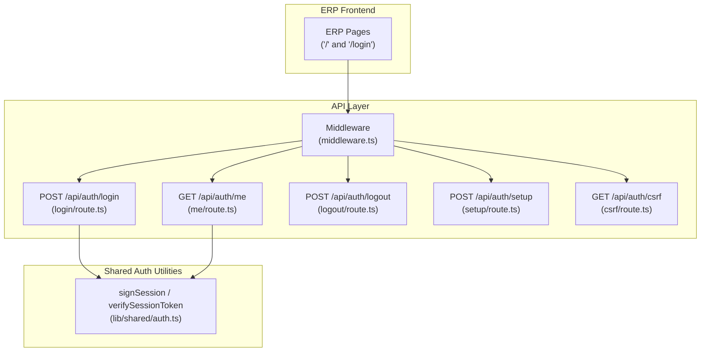
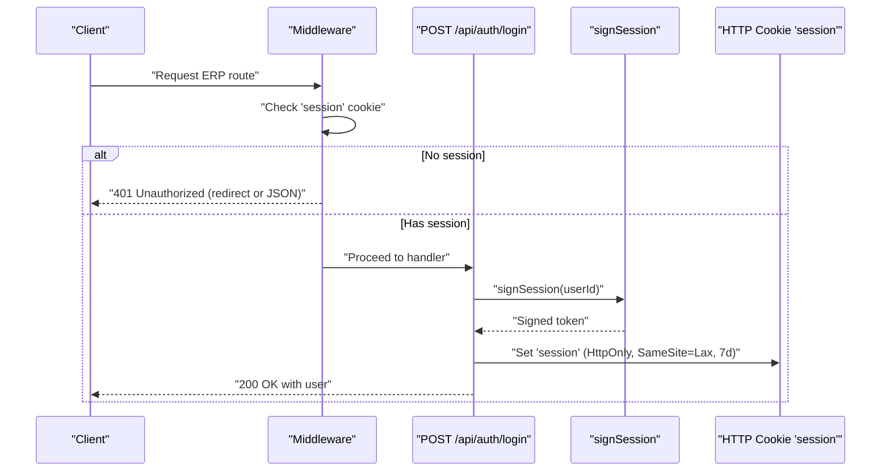
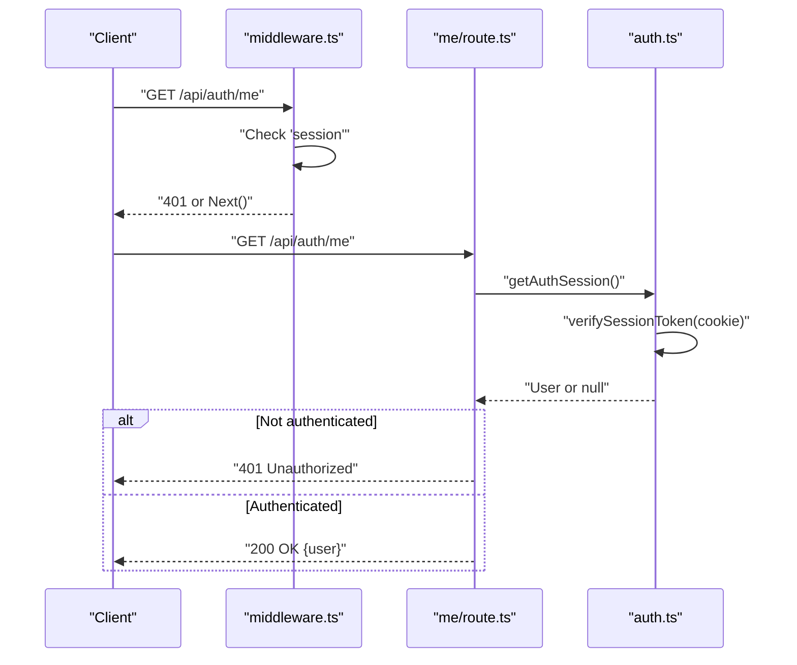
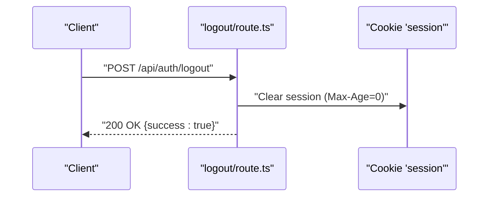
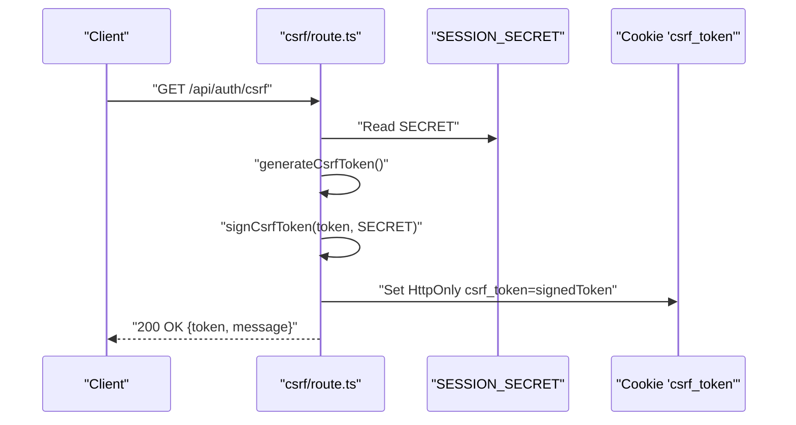
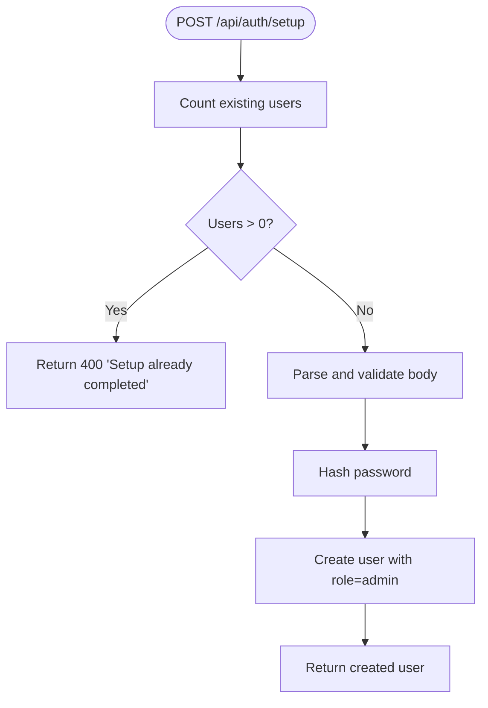
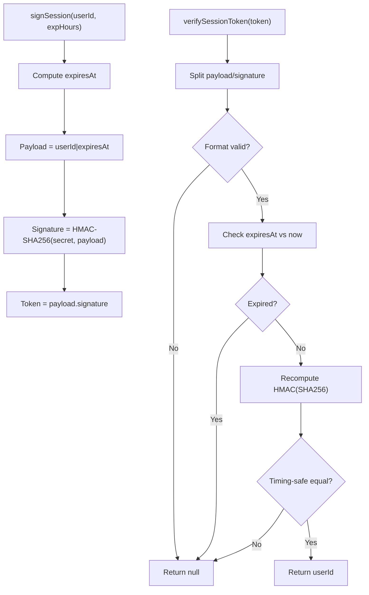
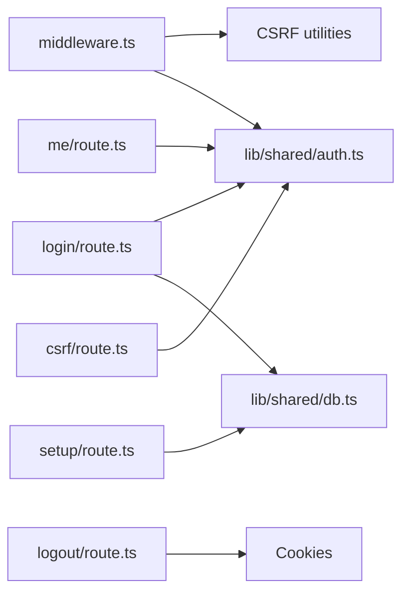

# Authentication Flow

<cite>
**Referenced Files in This Document**
- [login/route.ts](file://app/api/auth/login/route.ts)
- [logout/route.ts](file://app/api/auth/logout/route.ts)
- [me/route.ts](file://app/api/auth/me/route.ts)
- [setup/route.ts](file://app/api/auth/setup/route.ts)
- [csrf/route.ts](file://app/api/auth/csrf/route.ts)
- [middleware.ts](file://middleware.ts)
- [auth.ts](file://lib/shared/auth.ts)
- [ARCHITECTURE.md](file://ARCHITECTURE.md)
</cite>

## Table of Contents
1. [Introduction](#introduction)
2. [Project Structure](#project-structure)
3. [Core Components](#core-components)
4. [Architecture Overview](#architecture-overview)
5. [Detailed Component Analysis](#detailed-component-analysis)
6. [Dependency Analysis](#dependency-analysis)
7. [Performance Considerations](#performance-considerations)
8. [Security Considerations](#security-considerations)
9. [Troubleshooting Guide](#troubleshooting-guide)
10. [Conclusion](#conclusion)
11. [Appendices](#appendices)

## Introduction
This document explains the authentication flow in ListOpt ERP, covering user login, session establishment, token generation and validation, session management, logout and cleanup, user profile retrieval, and initial setup for new installations. It also outlines CSRF protection, session hijacking prevention, secure cookie handling, and provides troubleshooting guidance.

## Project Structure
Authentication endpoints and middleware are organized under the Next.js App Router. The ERP authentication relies on a signed session token stored in a cookie named session. CSRF protection is enforced for mutating API requests. Initial setup creates the first admin user.



**Diagram sources**
- [middleware.ts:58-164](file://middleware.ts#L58-L164)
- [login/route.ts:9-59](file://app/api/auth/login/route.ts#L9-L59)
- [me/route.ts:4-10](file://app/api/auth/me/route.ts#L4-L10)
- [logout/route.ts:3-13](file://app/api/auth/logout/route.ts#L3-L13)
- [setup/route.ts:7-37](file://app/api/auth/setup/route.ts#L7-L37)
- [csrf/route.ts:14-41](file://app/api/auth/csrf/route.ts#L14-L41)
- [auth.ts:18-83](file://lib/shared/auth.ts#L18-L83)

**Section sources**
- [ARCHITECTURE.md:23-28](file://ARCHITECTURE.md#L23-L28)
- [middleware.ts:26-164](file://middleware.ts#L26-L164)

## Core Components
- Session signing and verification utilities: signSession, verifySessionToken, getAuthSession, unauthorizedResponse.
- Middleware enforces authentication and CSRF protection for ERP routes.
- Authentication endpoints: login, logout, me, setup, CSRF token provisioning.

Key responsibilities:
- Token generation: signSession produces a signed token with expiration.
- Token validation: verifySessionToken checks signature and expiration.
- Session retrieval: getAuthSession reads cookie, validates token, loads user from DB.
- Middleware: blocks unauthenticated ERP routes, enforces CSRF for mutating requests.

**Section sources**
- [auth.ts:18-83](file://lib/shared/auth.ts#L18-L83)
- [middleware.ts:123-156](file://middleware.ts#L123-L156)

## Architecture Overview
The authentication system uses a signed JWT-like token stored in an HttpOnly session cookie. The middleware enforces authentication and CSRF protection. The CSRF token endpoint provides a signed CSRF cookie and a plaintext token for clients to include in mutating requests.



**Diagram sources**
- [middleware.ts:123-130](file://middleware.ts#L123-L130)
- [login/route.ts:37-52](file://app/api/auth/login/route.ts#L37-L52)
- [auth.ts:18-24](file://lib/shared/auth.ts#L18-L24)

## Detailed Component Analysis

### Login Flow
- Endpoint: POST /api/auth/login
- Steps:
  1. Parse and validate request body against login schema.
  2. Lookup user by username and verify active status.
  3. Compare password hash.
  4. On success, sign a session token and set it as an HttpOnly cookie with 7-day expiry.
  5. Return user info in JSON.

```mermaid
sequenceDiagram
participant C as "Client"
participant L as "login/route.ts"
participant DB as "Prisma DB"
participant AU as "auth.ts"
participant CK as "Cookie 'session'"
C->>L : "POST /api/auth/login {username,password}"
L->>DB : "Find user by username"
DB-->>L : "User record"
L->>L : "Verify password"
alt Invalid credentials
L-->>C : "401 Unauthorized"
else Valid
L->>AU : "signSession(userId)"
AU-->>L : "token"
L->>CK : "Set HttpOnly session=token; Max-Age=604800"
L-->>C : "200 OK {user}"
end
```

**Diagram sources**
- [login/route.ts:9-59](file://app/api/auth/login/route.ts#L9-L59)
- [auth.ts:18-24](file://lib/shared/auth.ts#L18-L24)

**Section sources**
- [login/route.ts:9-59](file://app/api/auth/login/route.ts#L9-L59)
- [auth.ts:18-24](file://lib/shared/auth.ts#L18-L24)

### Session Validation and User Profile Retrieval
- Endpoint: GET /api/auth/me
- Steps:
  1. Middleware ensures session exists.
  2. Handler calls getAuthSession to validate token and load user.
  3. Returns user object or 401.



**Diagram sources**
- [middleware.ts:123-130](file://middleware.ts#L123-L130)
- [me/route.ts:4-10](file://app/api/auth/me/route.ts#L4-L10)
- [auth.ts:61-83](file://lib/shared/auth.ts#L61-L83)

**Section sources**
- [me/route.ts:4-10](file://app/api/auth/me/route.ts#L4-L10)
- [auth.ts:61-83](file://lib/shared/auth.ts#L61-L83)

### Logout and Session Cleanup
- Endpoint: POST /api/auth/logout
- Steps:
  1. Clear the session cookie by setting Max-Age to 0.
  2. Return success.



**Diagram sources**
- [logout/route.ts:3-13](file://app/api/auth/logout/route.ts#L3-L13)

**Section sources**
- [logout/route.ts:3-13](file://app/api/auth/logout/route.ts#L3-L13)

### CSRF Protection
- Endpoint: GET /api/auth/csrf
- Steps:
  1. Generate a random CSRF token and sign it with SESSION_SECRET.
  2. Return token in response body and set a signed CSRF cookie (HttpOnly, SameSite=Strict, 24h).
  3. Clients must send the token in the X-CSRF-Token header for mutating requests.



**Diagram sources**
- [csrf/route.ts:14-41](file://app/api/auth/csrf/route.ts#L14-L41)

**Section sources**
- [csrf/route.ts:14-41](file://app/api/auth/csrf/route.ts#L14-L41)
- [middleware.ts:132-156](file://middleware.ts#L132-L156)

### Initial Setup (First Admin User)
- Endpoint: POST /api/auth/setup
- Steps:
  1. Enforce that no users currently exist.
  2. Parse and validate setup payload.
  3. Hash password and create admin user.
  4. Return created user.



**Diagram sources**
- [setup/route.ts:7-37](file://app/api/auth/setup/route.ts#L7-L37)

**Section sources**
- [setup/route.ts:7-37](file://app/api/auth/setup/route.ts#L7-L37)

### Token Generation and Validation Internals
- signSession(userId, expiresInHours):
  - Payload: userId|expiresAt
  - Signature: HMAC-SHA256(secret, payload)
  - Token: payload.signature
- verifySessionToken(token):
  - Split payload and signature
  - Validate format and expiration
  - Recompute HMAC and compare timing-safe
  - Return userId or null



**Diagram sources**
- [auth.ts:18-59](file://lib/shared/auth.ts#L18-L59)

**Section sources**
- [auth.ts:18-59](file://lib/shared/auth.ts#L18-L59)

## Dependency Analysis
- Middleware depends on:
  - CSRF utilities for token validation and exemptions.
  - Rate limiting and logging utilities.
  - Shared auth utilities for session retrieval.
- Authentication handlers depend on:
  - Shared auth utilities for token signing/verification.
  - Database client for user lookup and creation.
  - Validation utilities for request parsing and errors.



**Diagram sources**
- [middleware.ts:26-164](file://middleware.ts#L26-L164)
- [login/route.ts:2-5](file://app/api/auth/login/route.ts#L2-L5)
- [me/route.ts:2](file://app/api/auth/me/route.ts#L2)
- [logout/route.ts:1](file://app/api/auth/logout/route.ts#L1)
- [setup/route.ts:2-5](file://app/api/auth/setup/route.ts#L2-L5)
- [csrf/route.ts:2-6](file://app/api/auth/csrf/route.ts#L2-L6)
- [auth.ts:1-89](file://lib/shared/auth.ts#L1-L89)

**Section sources**
- [middleware.ts:26-164](file://middleware.ts#L26-L164)
- [auth.ts:1-89](file://lib/shared/auth.ts#L1-L89)

## Performance Considerations
- Token verification is O(1) with constant-time HMAC comparison.
- Session retrieval performs a single DB lookup per request; caching user data in memory is not implemented.
- Middleware runs on every request; keep route lists minimal and avoid heavy computations in middleware.
- Consider rotating SESSION_SECRET periodically and invalidating sessions by changing the secret.

[No sources needed since this section provides general guidance]

## Security Considerations
- CSRF protection:
  - Signed CSRF cookie is set with HttpOnly and SameSite=Strict.
  - Mutating API requests must include X-CSRF-Token header validated by middleware.
- Session security:
  - Session cookie is HttpOnly and optionally Secure based on environment flag.
  - Expiration is embedded in token payload and verified.
  - Logout clears the session cookie immediately.
- Secret management:
  - SESSION_SECRET must be set; otherwise signing/verification throws an error.
  - CSRF endpoints require SESSION_SECRET to sign tokens.
- Cookie handling:
  - session cookie: HttpOnly, SameSite=Lax, 7-day expiry.
  - csrf_token cookie: HttpOnly, SameSite=Strict, 24-hour expiry.
- Additional hardening (recommended):
  - Implement SameSite=Strict for session cookie in strict environments.
  - Add IP binding or user-agent binding to tokens.
  - Rotate secrets regularly and invalidate sessions after rotation.

**Section sources**
- [login/route.ts:44-50](file://app/api/auth/login/route.ts#L44-L50)
- [logout/route.ts:5-11](file://app/api/auth/logout/route.ts#L5-L11)
- [csrf/route.ts:32-38](file://app/api/auth/csrf/route.ts#L32-L38)
- [auth.ts:5-11](file://lib/shared/auth.ts#L5-L11)
- [middleware.ts:132-156](file://middleware.ts#L132-L156)

## Troubleshooting Guide
Common issues and resolutions:
- 401 Unauthorized on ERP routes:
  - Cause: Missing or invalid session cookie.
  - Resolution: Ensure client sends session cookie; re-login if expired.
- 403 CSRF validation failed:
  - Cause: Missing or invalid X-CSRF-Token header for mutating requests.
  - Resolution: Call GET /api/auth/csrf to obtain token and set header.
- 500 Server error during login:
  - Cause: Validation error or unexpected server error.
  - Resolution: Check request body against login schema; review server logs.
- Setup fails with “Setup already completed”:
  - Cause: Users already exist.
  - Resolution: Initialize database fresh or remove existing users before setup.
- Session cookie not set:
  - Cause: SECURE_COOKIES enabled without HTTPS or domain/path mismatch.
  - Resolution: Configure environment and ensure same-site domain.

Debugging techniques:
- Enable logging around authentication and middleware.
- Verify SESSION_SECRET is present in environment.
- Confirm cookie attributes (HttpOnly, Secure, SameSite) match deployment.
- Use network tab to inspect cookie headers and CSRF token exchange.

**Section sources**
- [login/route.ts:53-58](file://app/api/auth/login/route.ts#L53-L58)
- [middleware.ts:142-155](file://middleware.ts#L142-L155)
- [setup/route.ts:11-16](file://app/api/auth/setup/route.ts#L11-L16)
- [ARCHITECTURE.md:295-307](file://ARCHITECTURE.md#L295-L307)

## Conclusion
ListOpt ERP’s authentication system centers on a signed session token stored in an HttpOnly cookie, validated by middleware and utilities. CSRF protection is enforced for mutating requests via a signed CSRF cookie and header requirement. The system supports initial setup, login, logout, and user profile retrieval with clear error responses and environment-driven security flags.

[No sources needed since this section summarizes without analyzing specific files]

## Appendices

### API Definitions
- POST /api/auth/login
  - Request body: { username, password }
  - Response: { user: { id, username, role } }
  - Cookies: sets session (HttpOnly, SameSite=Lax, 7 days)
  - Status: 200 on success, 401 on invalid credentials, 500 on server error

- POST /api/auth/logout
  - Response: { success: true }
  - Cookies: clears session (Max-Age=0)
  - Status: 200

- GET /api/auth/me
  - Response: { user } or { error: "Unauthorized" }
  - Status: 200 if authenticated, 401 if not

- POST /api/auth/setup
  - Request body: { username, password }
  - Response: { user }
  - Status: 200 on success, 400 if setup already done, 500 on server error

- GET /api/auth/csrf
  - Response: { token, message }
  - Cookies: sets csrf_token (HttpOnly, SameSite=Strict, 24 hours)
  - Header: X-CSRF-Token must be sent for mutating requests

**Section sources**
- [login/route.ts:9-59](file://app/api/auth/login/route.ts#L9-L59)
- [logout/route.ts:3-13](file://app/api/auth/logout/route.ts#L3-L13)
- [me/route.ts:4-10](file://app/api/auth/me/route.ts#L4-L10)
- [setup/route.ts:7-37](file://app/api/auth/setup/route.ts#L7-L37)
- [csrf/route.ts:14-41](file://app/api/auth/csrf/route.ts#L14-L41)

### Environment Variables
- SESSION_SECRET: Required for signing tokens and CSRF tokens.
- SECURE_COOKIES: When "true", marks cookies as Secure.

**Section sources**
- [auth.ts:5-11](file://lib/shared/auth.ts#L5-L11)
- [login/route.ts:46](file://app/api/auth/login/route.ts#L46)
- [csrf/route.ts:34](file://app/api/auth/csrf/route.ts#L34)
- [ARCHITECTURE.md:295-307](file://ARCHITECTURE.md#L295-L307)