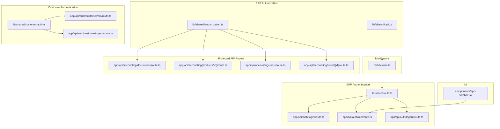
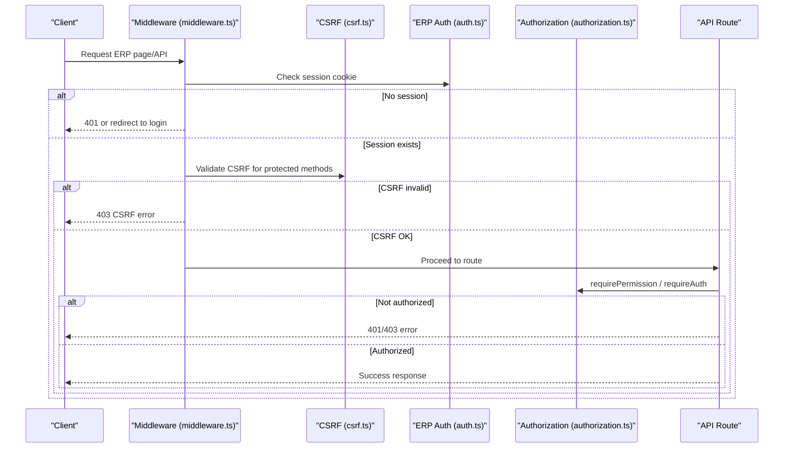
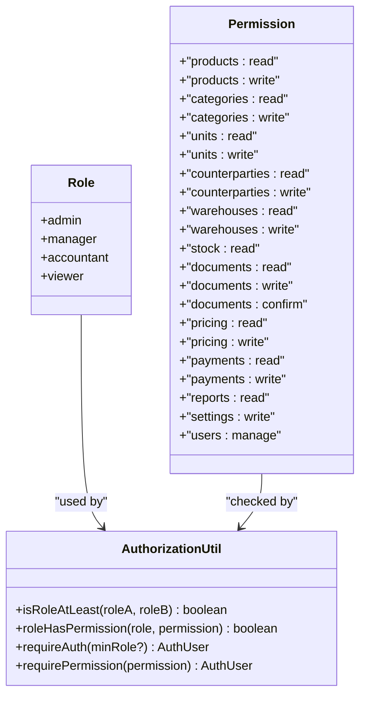
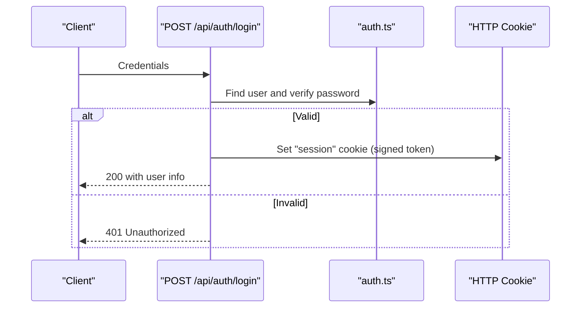
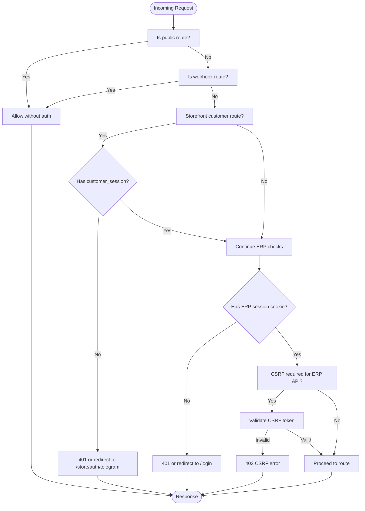
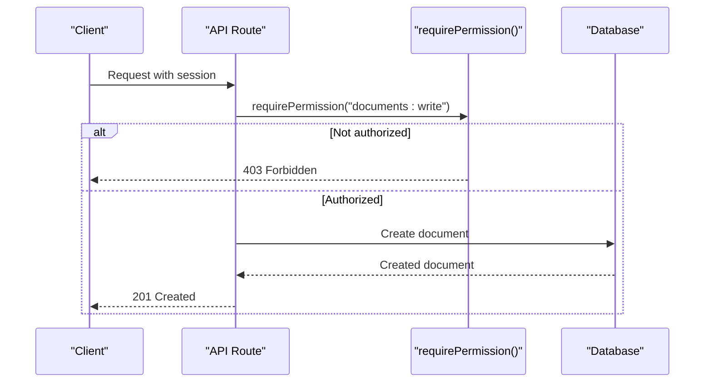
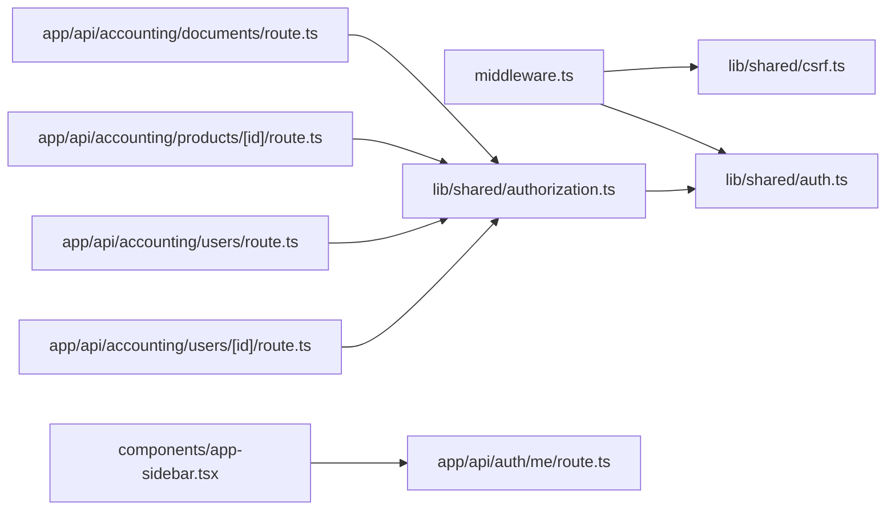

# Authorization Model

<cite>
**Referenced Files in This Document**
- [middleware.ts](file://middleware.ts)
- [authorization.ts](file://lib/shared/authorization.ts)
- [auth.ts](file://lib/shared/auth.ts)
- [csrf.ts](file://lib/shared/csrf.ts)
- [login route.ts](file://app/api/auth/login/route.ts)
- [me route.ts](file://app/api/auth/me/route.ts)
- [logout route.ts](file://app/api/auth/logout/route.ts)
- [customer-auth.ts](file://lib/shared/customer-auth.ts)
- [customer me route.ts](file://app/api/auth/customer/me/route.ts)
- [customer logout route.ts](file://app/api/auth/customer/logout/route.ts)
- [documents route.ts](file://app/api/accounting/documents/route.ts)
- [products route.ts](file://app/api/accounting/products/[id]/route.ts)
- [users route.ts](file://app/api/accounting/users/route.ts)
- [users [id] route.ts](file://app/api/accounting/users/[id]/route.ts)
- [app-sidebar.tsx](file://components/app-sidebar.tsx)
- [auth.test.ts](file://tests/integration/api/auth.test.ts)
- [auth.test.ts (unit)](file://tests/unit/lib/auth.test.ts)
- [auth.spec.ts (e2e)](file://tests/e2e/specs/auth.spec.ts)
- [ARCHITECTURE.md](file://ARCHITECTURE.md)
</cite>

## Table of Contents
1. [Introduction](#introduction)
2. [Project Structure](#project-structure)
3. [Core Components](#core-components)
4. [Architecture Overview](#architecture-overview)
5. [Detailed Component Analysis](#detailed-component-analysis)
6. [Dependency Analysis](#dependency-analysis)
7. [Performance Considerations](#performance-considerations)
8. [Troubleshooting Guide](#troubleshooting-guide)
9. [Conclusion](#conclusion)
10. [Appendices](#appendices)

## Introduction
This document describes the authorization and access control model in ListOpt ERP. It explains the role-based access control (RBAC) system, including user roles, permissions, and access hierarchies. It documents the authorization middleware, permission-checking mechanisms, resource protection, and access decisions. It also covers authorization rules across business modules, data access patterns, permission inheritance, and role combinations. Practical examples show how authorization checks are enforced in API routes and UI components. Finally, it outlines the relationship between authentication and authorization, including session-based access control, and provides best practices for adding new permissions and managing role assignments.

## Project Structure
The authorization model spans middleware, shared authorization utilities, authentication routes, customer authentication, and API routes that enforce permissions. UI components integrate with the backend via authenticated requests.

**Diagram sources**
- [middleware.ts:58-164](file://middleware.ts#L58-L164)
- [auth.ts:62-83](file://lib/shared/auth.ts#L62-L83)
- [authorization.ts:104-135](file://lib/shared/authorization.ts#L104-L135)
- [csrf.ts:119-137](file://lib/shared/csrf.ts#L119-L137)
- [login route.ts:1-60](file://app/api/auth/login/route.ts#L1-L60)
- [me route.ts:1-11](file://app/api/auth/me/route.ts#L1-L11)
- [logout route.ts:1-14](file://app/api/auth/logout/route.ts#L1-L14)
- [customer-auth.ts:48-82](file://lib/shared/customer-auth.ts#L48-L82)
- [customer me route.ts:1-42](file://app/api/auth/customer/me/route.ts#L1-L42)
- [customer logout route.ts:1-15](file://app/api/auth/customer/logout/route.ts#L1-L15)
- [documents route.ts:1-136](file://app/api/accounting/documents/route.ts#L1-L136)
- [products route.ts:1-119](file://app/api/accounting/products/[id]/route.ts#L1-L119)
- [users route.ts:1-74](file://app/api/accounting/users/route.ts#L1-L74)
- [users [id] route.ts:46-95](file://app/api/accounting/users/[id]/route.ts#L46-L95)
- [app-sidebar.tsx:89-94](file://components/app-sidebar.tsx#L89-L94)

**Section sources**
- [middleware.ts:26-164](file://middleware.ts#L26-L164)
- [authorization.ts:16-82](file://lib/shared/authorization.ts#L16-L82)
- [auth.ts:18-83](file://lib/shared/auth.ts#L18-L83)
- [customer-auth.ts:17-82](file://lib/shared/customer-auth.ts#L17-L82)

## Core Components
- Role hierarchy and permissions: Roles are ordered (admin > manager > accountant > viewer). Each role has a fixed set of permissions. Comparison functions determine if a role meets a minimum requirement.
- Session-based authentication: ERP uses a signed session cookie validated server-side. Customer authentication uses a separate signed session cookie.
- Middleware enforcement: Global middleware enforces public routes, CSRF protection for ERP API routes, and session checks for ERP pages/APIs.
- Permission enforcement in API routes: Routes call requirePermission or requireAuth to authorize actions.
- Error handling: Centralized AuthorizationError and handler for consistent HTTP responses.

**Section sources**
- [authorization.ts:8-15](file://lib/shared/authorization.ts#L8-L15)
- [authorization.ts:16-82](file://lib/shared/authorization.ts#L16-L82)
- [authorization.ts:104-135](file://lib/shared/authorization.ts#L104-L135)
- [auth.ts:18-83](file://lib/shared/auth.ts#L18-L83)
- [middleware.ts:123-156](file://middleware.ts#L123-L156)
- [authorization.ts:137-160](file://lib/shared/authorization.ts#L137-L160)

## Architecture Overview
The system separates concerns across middleware, authentication, and authorization utilities, and applies them consistently in API routes and UI components.

**Diagram sources**
- [middleware.ts:58-164](file://middleware.ts#L58-L164)
- [csrf.ts:77-114](file://lib/shared/csrf.ts#L77-L114)
- [auth.ts:62-83](file://lib/shared/auth.ts#L62-L83)
- [authorization.ts:104-135](file://lib/shared/authorization.ts#L104-L135)

## Detailed Component Analysis

### Role-Based Access Control (RBAC)
- Roles: admin, manager, accountant, viewer.
- Permissions: granular permissions grouped by domain (products, categories, units, counterparties, warehouses, stock, documents, pricing, payments, reports, settings, users).
- Hierarchical comparisons: roleHasPermission and isRoleAtLeast provide permission and role-level checks.
- Role display labels: localized role names for UI.

**Diagram sources**
- [authorization.ts:8-15](file://lib/shared/authorization.ts#L8-L15)
- [authorization.ts:16-82](file://lib/shared/authorization.ts#L16-L82)
- [authorization.ts:92-100](file://lib/shared/authorization.ts#L92-L100)
- [authorization.ts:104-135](file://lib/shared/authorization.ts#L104-L135)

**Section sources**
- [authorization.ts:8-15](file://lib/shared/authorization.ts#L8-L15)
- [authorization.ts:16-82](file://lib/shared/authorization.ts#L16-L82)
- [authorization.ts:92-100](file://lib/shared/authorization.ts#L92-L100)
- [authorization.ts:104-135](file://lib/shared/authorization.ts#L104-L135)

### Authentication and Session Management
- ERP session: Signed token stored in a cookie, validated server-side. getAuthSession resolves the current user from the session.
- Login: Validates credentials, sets a signed session cookie.
- Logout: Clears the session cookie.
- Customer session: Separate signed token for storefront customers.

**Diagram sources**
- [login route.ts:1-60](file://app/api/auth/login/route.ts#L1-L60)
- [auth.ts:62-83](file://lib/shared/auth.ts#L62-L83)

**Section sources**
- [auth.ts:18-83](file://lib/shared/auth.ts#L18-L83)
- [login route.ts:1-60](file://app/api/auth/login/route.ts#L1-L60)
- [logout route.ts:1-14](file://app/api/auth/logout/route.ts#L1-L14)
- [me route.ts:1-11](file://app/api/auth/me/route.ts#L1-L11)

### Middleware and CSRF Protection
- Public routes: Open to unauthenticated users (e.g., login, setup, webhooks).
- ERP session enforcement: Requires a valid session cookie for ERP pages/APIs.
- CSRF protection: For ERP API routes, validates CSRF token for unsafe methods unless exempt.
- Customer authentication: Storefront routes may require customer_session cookie.

**Diagram sources**
- [middleware.ts:58-164](file://middleware.ts#L58-L164)
- [csrf.ts:119-137](file://lib/shared/csrf.ts#L119-L137)

**Section sources**
- [middleware.ts:26-164](file://middleware.ts#L26-L164)
- [csrf.ts:77-114](file://lib/shared/csrf.ts#L77-L114)

### Permission Enforcement in API Routes
- Documents: requirePermission("documents:read"|"documents:write") for listing and creating documents; specific actions may require additional permissions.
- Products: requirePermission("products:read"|"products:write") for retrieval and updates.
- Users: requirePermission("users:manage") for listing and creating users; individual updates/deletes guarded accordingly.

**Diagram sources**
- [documents route.ts:63-135](file://app/api/accounting/documents/route.ts#L63-L135)
- [authorization.ts:122-135](file://lib/shared/authorization.ts#L122-L135)

**Section sources**
- [documents route.ts:8-61](file://app/api/accounting/documents/route.ts#L8-L61)
- [documents route.ts:63-135](file://app/api/accounting/documents/route.ts#L63-L135)
- [products route.ts:9-43](file://app/api/accounting/products/[id]/route.ts#L9-L43)
- [products route.ts:45-102](file://app/api/accounting/products/[id]/route.ts#L45-L102)
- [users route.ts:9-32](file://app/api/accounting/users/route.ts#L9-L32)
- [users route.ts:34-74](file://app/api/accounting/users/route.ts#L34-L74)
- [users [id] route.ts:78-95](file://app/api/accounting/users/[id]/route.ts#L78-L95)

### UI Integration and Session Usage
- Sidebar fetches current user via GET /api/auth/me to display username and role.
- Navigation items reflect module availability and current module selection.

**Section sources**
- [app-sidebar.tsx:89-94](file://components/app-sidebar.tsx#L89-L94)

### Customer Authentication (Storefront)
- Customer session cookie is used for storefront features (cart, checkout, account).
- Customer login via Telegram widget posts to a customer auth endpoint and receives a signed customer_session cookie.
- Customer logout clears the customer_session cookie.

**Section sources**
- [middleware.ts:29-42](file://middleware.ts#L29-L42)
- [customer-auth.ts:17-82](file://lib/shared/customer-auth.ts#L17-L82)
- [customer me route.ts:1-42](file://app/api/auth/customer/me/route.ts#L1-L42)
- [customer logout route.ts:1-15](file://app/api/auth/customer/logout/route.ts#L1-L15)

## Dependency Analysis
- Middleware depends on CSRF utilities and authentication utilities to enforce ERP access and CSRF protection.
- API routes depend on authorization utilities to enforce permissions and on authentication utilities to resolve the current user.
- UI components depend on authenticated API endpoints to display user info.

**Diagram sources**
- [middleware.ts:58-164](file://middleware.ts#L58-L164)
- [csrf.ts:119-137](file://lib/shared/csrf.ts#L119-L137)
- [auth.ts:62-83](file://lib/shared/auth.ts#L62-L83)
- [authorization.ts:104-135](file://lib/shared/authorization.ts#L104-L135)
- [documents route.ts:1-136](file://app/api/accounting/documents/route.ts#L1-L136)
- [products route.ts:1-119](file://app/api/accounting/products/[id]/route.ts#L1-L119)
- [users route.ts:1-74](file://app/api/accounting/users/route.ts#L1-L74)
- [users [id] route.ts:46-95](file://app/api/accounting/users/[id]/route.ts#L46-L95)
- [app-sidebar.tsx:89-94](file://components/app-sidebar.tsx#L89-L94)
- [me route.ts:1-11](file://app/api/auth/me/route.ts#L1-L11)

**Section sources**
- [middleware.ts:58-164](file://middleware.ts#L58-L164)
- [authorization.ts:104-135](file://lib/shared/authorization.ts#L104-L135)

## Performance Considerations
- Session verification is lightweight (HMAC signature and expiry check) and avoids repeated DB lookups until user resolution.
- Permission checks are O(1) lookups in memory maps.
- Middleware short-circuits early for static assets and public routes to minimize overhead.
- CSRF validation occurs only for protected methods and ERP API routes.

[No sources needed since this section provides general guidance]

## Troubleshooting Guide
Common authorization failures and their likely causes:
- 401 Unauthorized on ERP routes:
  - Missing or invalid session cookie.
  - User deactivated after login.
- 403 Forbidden on API routes:
  - Insufficient role or missing specific permission for the action.
- CSRF validation failed:
  - Missing or mismatched CSRF token for protected methods.
- 401 Unauthorized on customer routes:
  - Missing or invalid customer_session cookie.

Mitigation steps:
- Verify session cookie presence and validity.
- Confirm user.isActive is true.
- Ensure the user’s role has the required permission.
- Include CSRF token for unsafe methods when calling ERP APIs.
- For customer routes, ensure customer_session cookie is present and valid.

**Section sources**
- [auth.ts:62-83](file://lib/shared/auth.ts#L62-L83)
- [authorization.ts:122-135](file://lib/shared/authorization.ts#L122-L135)
- [authorization.ts:152-159](file://lib/shared/authorization.ts#L152-L159)
- [csrf.ts:77-114](file://lib/shared/csrf.ts#L77-L114)
- [middleware.ts:123-156](file://middleware.ts#L123-L156)

## Conclusion
ListOpt ERP implements a clear RBAC model with explicit roles, hierarchical comparisons, and granular permissions. Middleware enforces session-based access and CSRF protection for ERP APIs, while API routes consistently apply requirePermission and requireAuth to protect resources. Customer authentication is separated for storefront features. The model supports straightforward extension with new permissions and roles, and UI components integrate seamlessly via authenticated endpoints.

[No sources needed since this section summarizes without analyzing specific files]

## Appendices

### Best Practices for Permissions and Roles
- Define new permissions as scoped strings (e.g., module:action) and assign them to roles thoughtfully.
- Keep role hierarchies strict; avoid granting elevated permissions unless necessary.
- Prefer requirePermission for fine-grained controls; use requireAuth(minRole) for administrative boundaries.
- Add new permissions to the shared authorization module and update tests.
- When introducing new modules, follow the established API route patterns and include appropriate authorization checks.

**Section sources**
- [authorization.ts:16-82](file://lib/shared/authorization.ts#L16-L82)
- [ARCHITECTURE.md:206-220](file://ARCHITECTURE.md#L206-L220)

### Example Authorization Checks in API Routes
- Documents listing and creation: requirePermission("documents:read"|"documents:write").
- Product retrieval and updates: requirePermission("products:read"|"products:write").
- User management: requirePermission("users:manage").

**Section sources**
- [documents route.ts:8-61](file://app/api/accounting/documents/route.ts#L8-L61)
- [documents route.ts:63-135](file://app/api/accounting/documents/route.ts#L63-L135)
- [products route.ts:9-43](file://app/api/accounting/products/[id]/route.ts#L9-L43)
- [products route.ts:45-102](file://app/api/accounting/products/[id]/route.ts#L45-L102)
- [users route.ts:9-32](file://app/api/accounting/users/route.ts#L9-L32)
- [users route.ts:34-74](file://app/api/accounting/users/route.ts#L34-L74)

### Example Authorization Checks in UI Components
- Sidebar fetches current user via GET /api/auth/me to display username and role.

**Section sources**
- [app-sidebar.tsx:89-94](file://components/app-sidebar.tsx#L89-L94)

### Tests Demonstrating Authorization Behavior
- Integration tests verify login, session cookie setting, and unauthorized access.
- Unit tests verify session token signing and verification behavior.
- E2E tests verify redirects for unauthenticated ERP access.

**Section sources**
- [auth.test.ts:92-196](file://tests/integration/api/auth.test.ts#L92-L196)
- [auth.test.ts (unit):1-81](file://tests/unit/lib/auth.test.ts#L1-L81)
- [auth.spec.ts (e2e):11-44](file://tests/e2e/specs/auth.spec.ts#L11-L44)