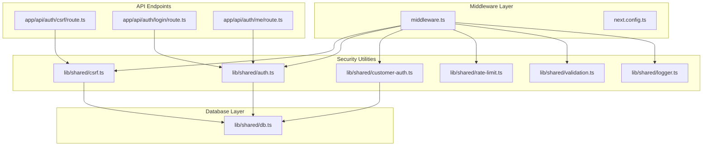
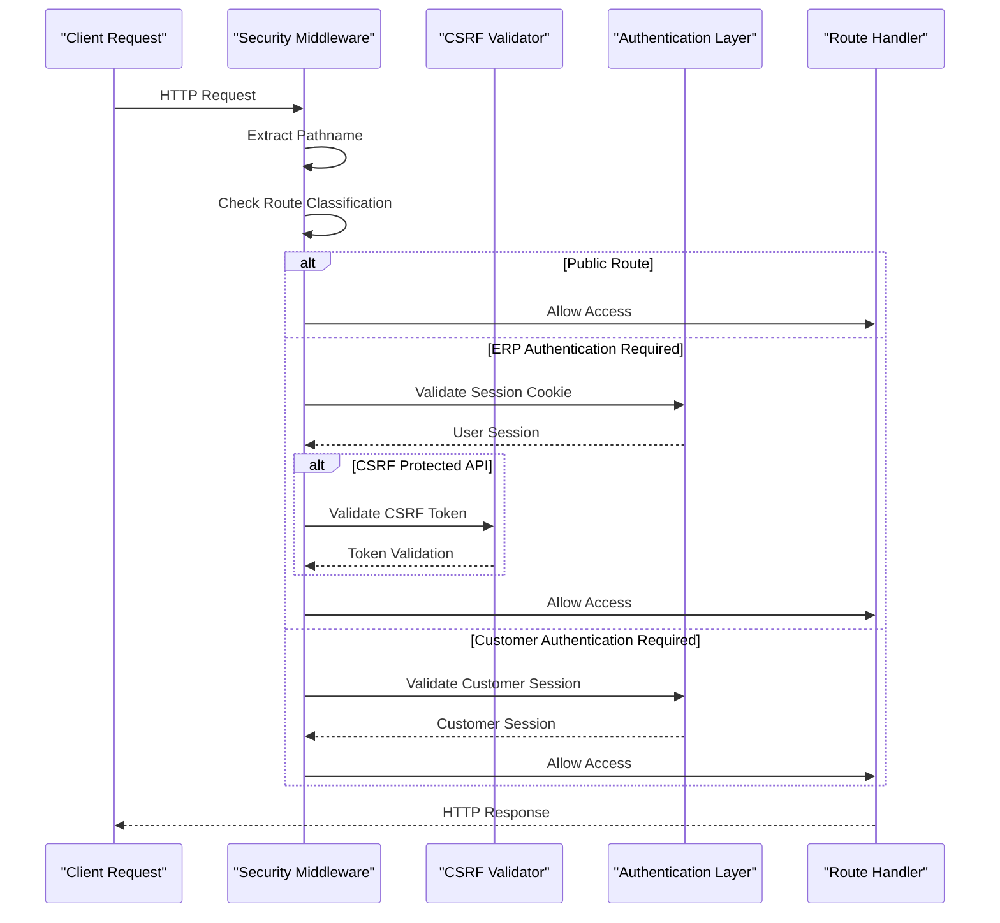
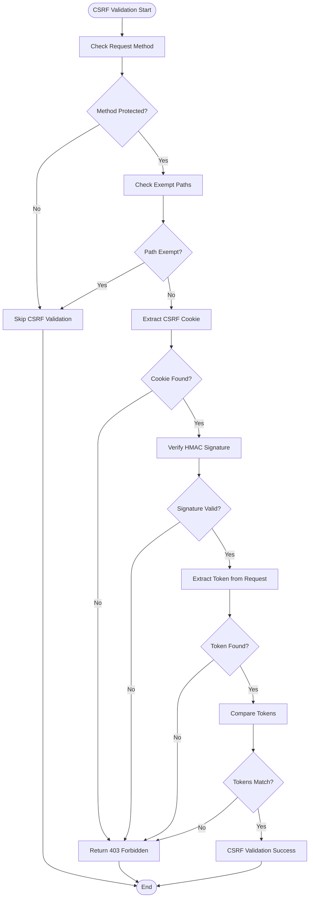
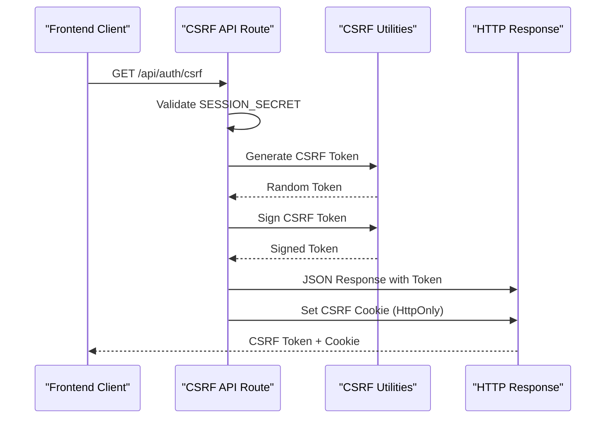
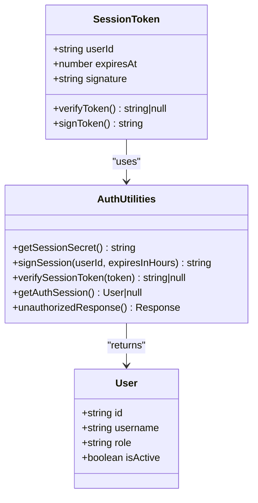
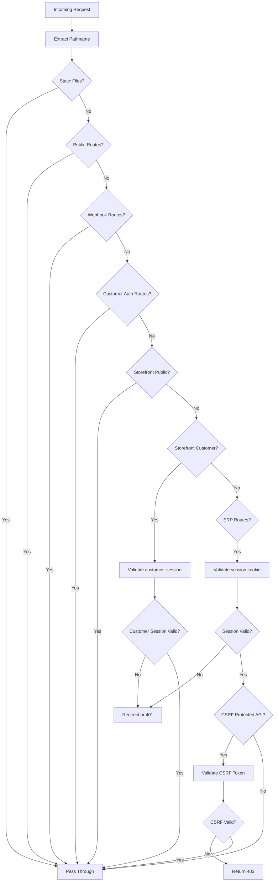
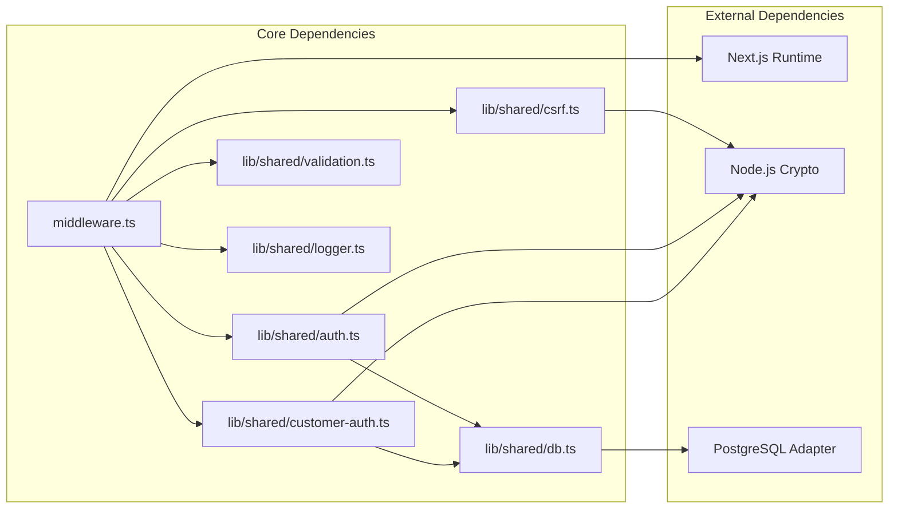

# Security Middleware

<cite>
**Referenced Files in This Document**
- [middleware.ts](file://middleware.ts)
- [next.config.ts](file://next.config.ts)
- [csrf.ts](file://lib/shared/csrf.ts)
- [rate-limit.ts](file://lib/shared/rate-limit.ts)
- [logger.ts](file://lib/shared/logger.ts)
- [auth.ts](file://lib/shared/auth.ts)
- [customer-auth.ts](file://lib/shared/customer-auth.ts)
- [validation.ts](file://lib/shared/validation.ts)
- [csrf/route.ts](file://app/api/auth/csrf/route.ts)
- [login/route.ts](file://app/api/auth/login/route.ts)
- [me/route.ts](file://app/api/auth/me/route.ts)
- [db.ts](file://lib/shared/db.ts)
- [rate-limit.test.ts](file://tests/unit/lib/rate-limit.test.ts)
- [auth.test.ts](file://tests/unit/lib/auth.test.ts)
</cite>

## Table of Contents
1. [Introduction](#introduction)
2. [Project Structure](#project-structure)
3. [Core Components](#core-components)
4. [Architecture Overview](#architecture-overview)
5. [Detailed Component Analysis](#detailed-component-analysis)
6. [Dependency Analysis](#dependency-analysis)
7. [Performance Considerations](#performance-considerations)
8. [Troubleshooting Guide](#troubleshooting-guide)
9. [Conclusion](#conclusion)

## Introduction

The ListOpt ERP security middleware implements a comprehensive security framework built on Next.js App Router middleware. This system provides layered security through authentication validation, authorization checks, CSRF protection, rate limiting, and security headers injection. The middleware enforces strict security policies across different application domains including ERP (accounting), e-commerce, and public routes.

The security implementation follows modern security best practices including cookie-based authentication with cryptographic signatures, CSRF protection through signed tokens, and comprehensive request validation. The middleware is designed to handle multiple authentication contexts simultaneously while maintaining performance and security standards.

## Project Structure

The security middleware is organized across several key areas:

**Diagram sources**
- [middleware.ts:1-169](file://middleware.ts#L1-L169)
- [csrf.ts:1-139](file://lib/shared/csrf.ts#L1-L139)
- [auth.ts:1-89](file://lib/shared/auth.ts#L1-L89)

**Section sources**
- [middleware.ts:1-169](file://middleware.ts#L1-L169)
- [next.config.ts:1-29](file://next.config.ts#L1-L29)

## Core Components

### Authentication System

The authentication system implements cookie-based session management with cryptographic signing:

- **ERP Session Authentication**: Uses `session` cookie with HMAC-SHA256 signatures
- **Customer Authentication**: Uses `customer_session` cookie for e-commerce functionality
- **CSRF Protection**: Implements signed CSRF tokens with HttpOnly cookies

### Route Classification System

The middleware organizes routes into distinct security zones:

- **Public Routes**: No authentication required (`/login`, `/setup`)
- **ERP Routes**: Full authentication required for accounting functionality
- **E-commerce Routes**: Customer authentication for storefront features
- **Webhook Routes**: Public endpoints for third-party integrations

### Security Headers Implementation

The system injects comprehensive security headers at the Next.js configuration level:

- **X-Content-Type-Options**: Prevents MIME type sniffing
- **X-Frame-Options**: Prevents clickjacking attacks
- **Referrer-Policy**: Controls referrer information leakage
- **X-XSS-Protection**: Enables browser XSS filters
- **Permissions-Policy**: Restricts sensitive browser features

**Section sources**
- [middleware.ts:26-50](file://middleware.ts#L26-L50)
- [next.config.ts:14-26](file://next.config.ts#L14-L26)

## Architecture Overview

The security middleware follows a hierarchical processing model:

**Diagram sources**
- [middleware.ts:58-164](file://middleware.ts#L58-L164)
- [csrf.ts:77-114](file://lib/shared/csrf.ts#L77-L114)
- [auth.ts:62-83](file://lib/shared/auth.ts#L62-L83)

## Detailed Component Analysis

### CSRF Protection Mechanism

The CSRF protection system implements a robust token-based validation mechanism:

**Diagram sources**
- [middleware.ts:132-156](file://middleware.ts#L132-L156)
- [csrf.ts:77-114](file://lib/shared/csrf.ts#L77-L114)

#### CSRF Token Generation and Management

The CSRF system generates cryptographically secure tokens with the following characteristics:

- **Token Generation**: 32-byte random tokens using `crypto.randomBytes()`
- **Token Signing**: HMAC-SHA256 signature using `SESSION_SECRET`
- **Cookie Storage**: HttpOnly, SameSite=strict, 24-hour expiration
- **Header Validation**: Case-insensitive header extraction

#### CSRF Endpoint Implementation

The `/api/auth/csrf` endpoint provides token distribution:

**Diagram sources**
- [csrf/route.ts:14-41](file://app/api/auth/csrf/route.ts#L14-L41)
- [csrf.ts:15-29](file://lib/shared/csrf.ts#L15-L29)

**Section sources**
- [csrf.ts:1-139](file://lib/shared/csrf.ts#L1-L139)
- [csrf/route.ts:1-41](file://app/api/auth/csrf/route.ts#L1-L41)

### Authentication and Authorization System

The authentication system implements multi-layered security:

#### ERP User Authentication

**Diagram sources**
- [auth.ts:18-83](file://lib/shared/auth.ts#L18-L83)

#### Customer Authentication

The customer authentication system provides separate session management for e-commerce functionality:

- **Customer Session Cookie**: `customer_session` with HMAC-SHA256 signatures
- **30-day Expiration**: Extended session for customer convenience
- **Telegram Integration**: Customer identification through Telegram authentication

**Section sources**
- [auth.ts:1-89](file://lib/shared/auth.ts#L1-L89)
- [customer-auth.ts:1-100](file://lib/shared/customer-auth.ts#L1-L100)

### Route Classification and Enforcement

The middleware implements a sophisticated route classification system:

**Diagram sources**
- [middleware.ts:58-164](file://middleware.ts#L58-L164)

**Section sources**
- [middleware.ts:26-164](file://middleware.ts#L26-L164)

### Security Headers Injection

The Next.js configuration injects comprehensive security headers:

| Header | Value | Purpose |
|--------|-------|---------|
| X-Content-Type-Options | nosniff | Prevents MIME type sniffing |
| X-Frame-Options | DENY | Prevents clickjacking attacks |
| Referrer-Policy | strict-origin-when-cross-origin | Controls referrer information |
| X-XSS-Protection | 1; mode=block | Enables browser XSS filters |
| Permissions-Policy | camera=(), microphone=(), geolocation=() | Restricts sensitive features |

**Section sources**
- [next.config.ts:14-26](file://next.config.ts#L14-L26)

## Dependency Analysis

The security middleware has well-defined dependencies and minimal coupling:

**Diagram sources**
- [middleware.ts:1-10](file://middleware.ts#L1-L10)
- [auth.ts:1-3](file://lib/shared/auth.ts#L1-L3)
- [customer-auth.ts:1-3](file://lib/shared/customer-auth.ts#L1-L3)

### Security Policy Enforcement Points

The middleware enforces security policies at multiple levels:

1. **Route Level**: Path-based access control
2. **Authentication Level**: Session validation
3. **CSRF Level**: Token validation for protected methods
4. **Authorization Level**: Role-based access control
5. **Request Level**: Input validation and sanitization

**Section sources**
- [middleware.ts:166-168](file://middleware.ts#L166-L168)
- [validation.ts:14-62](file://lib/shared/validation.ts#L14-L62)

## Performance Considerations

### In-Memory Rate Limiting

The current implementation uses in-memory rate limiting with the following characteristics:

- **Storage**: `Map<string, RateLimitEntry>` in memory
- **Cleanup**: Lazy cleanup when map size exceeds 100 entries
- **Limitations**: Not suitable for multi-instance deployments
- **Production Recommendation**: Use Redis-based solutions like `@upstash/ratelimit`

### Timing-Safe Operations

The security utilities implement timing-safe comparisons to prevent timing attacks:

- **Session Verification**: `crypto.timingSafeEqual()` for token comparison
- **CSRF Verification**: HMAC signature verification with constant-time comparison
- **Customer Session**: Secure token validation for e-commerce authentication

### Request Tracing

The middleware implements request ID generation for debugging:

- **UUID Generation**: Cryptographically secure UUIDs for edge runtime
- **Header Propagation**: X-Request-Id header for request correlation
- **Logging Integration**: Structured logging with request context

**Section sources**
- [rate-limit.ts:1-115](file://lib/shared/rate-limit.ts#L1-L115)
- [auth.ts:45-58](file://lib/shared/auth.ts#L45-L58)
- [csrf.ts:44-51](file://lib/shared/csrf.ts#L44-L51)
- [middleware.ts:12-24](file://middleware.ts#L12-L24)

## Troubleshooting Guide

### Common CSRF Issues

**Issue**: CSRF validation fails with "CSRF cookie not found"
**Solution**: Ensure client calls `/api/auth/csrf` endpoint before making protected requests

**Issue**: CSRF token mismatch errors
**Solution**: Verify that the same CSRF token is used for both cookie and header validation

**Issue**: JSON request CSRF validation not working
**Solution**: For JSON requests, implement body parsing before CSRF validation or use form-encoded requests

### Authentication Problems

**Issue**: Session cookie not being set
**Solution**: Check `SESSION_SECRET` environment variable and ensure HTTPS cookies for production

**Issue**: Customer session validation failing
**Solution**: Verify `SESSION_SECRET` and check customer record existence in database

**Issue**: Mixed authentication contexts
**Solution**: Ensure separate cookies for ERP (`session`) and customer (`customer_session`) sessions

### Middleware Configuration Issues

**Issue**: Routes not being processed by middleware
**Solution**: Check matcher configuration in middleware export

**Issue**: Security headers not being applied
**Solution**: Verify Next.js configuration and ensure proper deployment settings

### Performance Optimization

**Issue**: Rate limiting not working in production
**Solution**: Implement Redis-based rate limiting for multi-instance deployments

**Issue**: Memory usage growing over time
**Solution**: Monitor rate limiter cleanup and consider implementing periodic cleanup

**Section sources**
- [middleware.ts:141-155](file://middleware.ts#L141-L155)
- [csrf/route.ts:14-41](file://app/api/auth/csrf/route.ts#L14-L41)
- [rate-limit.ts:1-21](file://lib/shared/rate-limit.ts#L1-L21)

## Conclusion

The ListOpt ERP security middleware provides a comprehensive and well-structured security framework that effectively protects the application across multiple domains. The implementation demonstrates strong security practices including:

- **Layered Security**: Multiple authentication contexts with clear separation
- **CSRF Protection**: Robust token-based validation with proper cookie management
- **Request Validation**: Comprehensive input validation and sanitization
- **Performance Considerations**: Timing-safe operations and efficient request processing
- **Extensibility**: Well-defined interfaces for adding new security policies

The middleware architecture supports future enhancements including Redis-based rate limiting, additional authentication providers, and expanded authorization policies. The modular design ensures maintainability while providing strong security guarantees for both ERP and e-commerce functionality.

Key strengths of the implementation include the separation of concerns between authentication contexts, comprehensive error handling, and detailed logging capabilities. The system provides clear extension points for organizations that need to customize security policies while maintaining the core security guarantees.