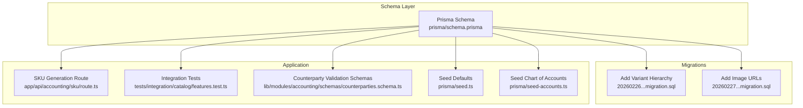
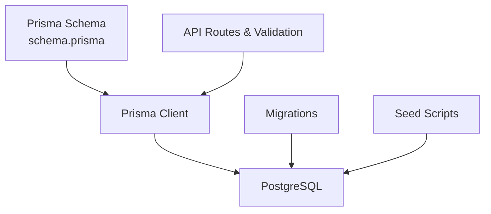

# Data Integrity Rules

<cite>
**Referenced Files in This Document**
- [schema.prisma](file://prisma/schema.prisma)
- [20260226_add_variant_hierarchy.migration.sql](file://prisma/migrations/20260226_add_variant_hierarchy/migration.sql)
- [20260227_add_product_image_urls.migration.sql](file://prisma/migrations/20260227_add_product_image_urls/migration.sql)
- [seed.ts](file://prisma/seed.ts)
- [seed-accounts.ts](file://prisma/seed-accounts.ts)
- [sku.route.ts](file://app/api/accounting/sku/route.ts)
- [features.test.ts](file://tests/integration/catalog/features.test.ts)
- [counterparties.schema.ts](file://lib/modules/accounting/schemas/counterparties.schema.ts)
</cite>

## Table of Contents
1. [Introduction](#introduction)
2. [Project Structure](#project-structure)
3. [Core Components](#core-components)
4. [Architecture Overview](#architecture-overview)
5. [Detailed Component Analysis](#detailed-component-analysis)
6. [Dependency Analysis](#dependency-analysis)
7. [Performance Considerations](#performance-considerations)
8. [Troubleshooting Guide](#troubleshooting-guide)
9. [Conclusion](#conclusion)

## Introduction
This document describes the data integrity rules implemented in the ListOpt ERP database schema. It focuses on unique constraints, composite unique keys, indexes, validation rules, defaults, and referential integrity enforced by the schema and supporting migrations. It also highlights business rules embedded in the schema such as product variant uniqueness, SKU/barcode uniqueness, and counterparty INN uniqueness, along with cascade delete/update behaviors and performance-critical indexes on frequently queried columns.

## Project Structure
The data integrity rules are primarily defined in the Prisma schema and reinforced by migration scripts and seed logic. The API routes and validation schemas complement database-level constraints with application-level checks.

**Diagram sources**
- [schema.prisma](file://prisma/schema.prisma)
- [20260226_add_variant_hierarchy.migration.sql](file://prisma/migrations/20260226_add_variant_hierarchy/migration.sql)
- [20260227_add_product_image_urls.migration.sql](file://prisma/migrations/20260227_add_product_image_urls/migration.sql)
- [sku.route.ts](file://app/api/accounting/sku/route.ts)
- [features.test.ts](file://tests/integration/catalog/features.test.ts)
- [counterparties.schema.ts](file://lib/modules/accounting/schemas/counterparties.schema.ts)
- [seed.ts](file://prisma/seed.ts)
- [seed-accounts.ts](file://prisma/seed-accounts.ts)

**Section sources**
- [schema.prisma](file://prisma/schema.prisma)
- [20260226_add_variant_hierarchy.migration.sql](file://prisma/migrations/20260226_add_variant_hierarchy/migration.sql)
- [20260227_add_product_image_urls.migration.sql](file://prisma/migrations/20260227_add_product_image_urls/migration.sql)
- [sku.route.ts](file://app/api/accounting/sku/route.ts)
- [features.test.ts](file://tests/integration/catalog/features.test.ts)
- [counterparties.schema.ts](file://lib/modules/accounting/schemas/counterparties.schema.ts)
- [seed.ts](file://prisma/seed.ts)
- [seed-accounts.ts](file://prisma/seed-accounts.ts)

## Core Components
- Unique constraints and defaults are declared in the Prisma schema via field attributes and model-level directives.
- Composite unique keys are defined using @@unique directives.
- Indexes are defined via @@index directives and explicit CREATE INDEX statements in migrations.
- Referential integrity is defined via relation fields and onDelete behaviors.
- Business rules such as SKU generation and variant uniqueness are enforced by schema, migrations, and application logic.

Key areas covered:
- Users, Units, Categories, Products, Variants, Discounts, Variant Links, Counterparties, Warehouses, Stock, Documents, Payments, Accounting (Chart of Accounts), and E-commerce entities.

**Section sources**
- [schema.prisma](file://prisma/schema.prisma)

## Architecture Overview
The data integrity architecture combines:
- Database-level constraints (unique, composite unique, defaults, indexes, foreign keys).
- Application-level validation and business logic (e.g., SKU generation, variant creation).
- Operational seeds and migrations to initialize system defaults and evolve schema safely.

**Diagram sources**
- [schema.prisma](file://prisma/schema.prisma)
- [20260226_add_variant_hierarchy.migration.sql](file://prisma/migrations/20260226_add_variant_hierarchy/migration.sql)
- [20260227_add_product_image_urls.migration.sql](file://prisma/migrations/20260227_add_product_image_urls/migration.sql)
- [sku.route.ts](file://app/api/accounting/sku/route.ts)
- [seed.ts](file://prisma/seed.ts)
- [seed-accounts.ts](file://prisma/seed-accounts.ts)

## Detailed Component Analysis

### Unique Constraints and Composite Keys
- Username and email uniqueness for Users.
- Short unit name uniqueness.
- Product SKU, barcode, and slug uniqueness.
- ProductVariant-level composite unique(productId, optionId).
- ProductCustomField-level composite unique(productId, definitionId).
- ProductVariantLink-level composite unique(productId, linkedProductId).
- Counterparty INN uniqueness.
- Document number uniqueness.
- Payment number uniqueness.
- Account code uniqueness.
- Store page slug uniqueness.
- Integration type uniqueness.
- Order number uniqueness.
- Cart item composite unique(customerId, productId, variantId).
- Favorite composite unique(customerId, productId).
- Processed webhook composite unique(source, externalId).
- SKU counter prefix uniqueness.
- Document counter prefix uniqueness.
- Payment counter prefix uniqueness.
- Journal entry number uniqueness.
- Journal counter prefix uniqueness.
- Order counter prefix uniqueness.

These constraints ensure entity integrity and prevent duplicates across business-critical identifiers.

**Section sources**
- [schema.prisma](file://prisma/schema.prisma)

### Index Definitions and Performance-Critical Indexes
Indexes are defined to optimize frequent queries:
- Product: category, isActive, name, slug, masterProductId, variantGroupName.
- ProductCategory: parentId, order.
- ProductVariant: productId.
- ProductCustomField: definitionId.
- ProductVariantLink: productId.
- Counterparty: type, isActive, name.
- StockRecord: productId.
- StockMovement: documentId, productId, warehouseId, createdAt, isReversing.
- Document: type, status, date, warehouseId, counterpartyId, number, customerId, paymentStatus.
- DocumentItem: documentId, productId, variantId.
- PurchasePrice: productId, supplierId, isActive, validFrom.
- SalePrice: productId, priceListId, isActive, validFrom.
- PriceList: isActive.
- Customer: isActive.
- CustomerAddress: customerId.
- CartItem: customerId.
- Order: customerId, status, orderNumber.
- OrderItem: orderId, productId.
- Review: productId, isPublished, customerId, documentId.
- Favorite: customerId, productId.
- StorePage: isPublished, sortOrder, slug.
- Integration: type, isEnabled.
- FinanceCategory: type, isActive.
- Payment: type, date, counterpartyId, documentId.
- Account: code, category, isActive.
- LedgerLine: entryId, accountId, counterpartyId.
- JournalEntry: date, sourceType, sourceId.
- ProcessedWebhook: source, processedAt.

Migrations add indexes for variant hierarchy and image arrays:
- Product: masterProductId, variantGroupName.
- Product: imageUrls JSONB array.

These indexes support performance on frequently filtered/sorted columns and joins.

**Section sources**
- [schema.prisma](file://prisma/schema.prisma)
- [20260226_add_variant_hierarchy.migration.sql](file://prisma/migrations/20260226_add_variant_hierarchy/migration.sql)
- [20260227_add_product_image_urls.migration.sql](file://prisma/migrations/20260227_add_product_image_urls/migration.sql)

### Validation Rules Enforced at Database Level
- Field constraints: Non-empty strings for usernames, emails, unit short names, product names, counterparty names, document numbers, payment numbers, account codes, store page slugs, integration types, order numbers, and journal entry numbers.
- Defaults: isActive defaults to true; role defaults to viewer; currency defaults to RUB; payment type defaults to null; payment status defaults to pending; VAT rates and tax regimes configured via company settings; imageUrls defaults to empty JSON array.
- Data types: Numeric fields for quantities, costs, amounts, and rates; timestamps for audit fields; enums for statuses, types, and categories.

These rules ensure consistent data shape and reduce invalid states.

**Section sources**
- [schema.prisma](file://prisma/schema.prisma)
- [20260227_add_product_image_urls.migration.sql](file://prisma/migrations/20260227_add_product_image_urls/migration.sql)

### Business Rules Embedded in the Schema
- Product variant uniqueness: Each product-option combination is unique; same option can be reused across different products.
- SKU/barcode uniqueness: Product and variant-level SKUs and barcodes must be unique; variants may override with specific values.
- Counterparty INN uniqueness: INN is unique per counterparty.
- Document numbering: Document numbers are unique; counters maintain numeric sequences per prefix.
- SKU auto-generation: SKU prefix and last number are managed via a counter; generation endpoint atomically increments and formats the next SKU.
- Variant grouping: Product variant links and master-product relationships enable e-commerce catalog grouping; migrations add indexes and optional self-referential foreign keys.

These rules embed domain logic directly into the schema and migrations.

**Section sources**
- [schema.prisma](file://prisma/schema.prisma)
- [20260226_add_variant_hierarchy.migration.sql](file://prisma/migrations/20260226_add_variant_hierarchy/migration.sql)
- [sku.route.ts](file://app/api/accounting/sku/route.ts)
- [features.test.ts](file://tests/integration/catalog/features.test.ts)

### Cascade Delete Rules, Update Behaviors, and Referential Integrity
- Product variants, custom fields, variant links, and interactions cascade-delete when their parent product is removed.
- Variant options cascade-delete when their parent variant type is removed.
- Stock records and movements cascade-delete when product or warehouse is removed.
- Document items and stock movements cascade-delete when document is removed.
- Counterparty balance cascades-delete when counterparty is removed.
- ProductVariantLink supports cascade-delete on both ends of the relationship.
- Self-reference on Product for variant hierarchy uses foreign key with SET NULL on delete and CASCADE on update.
- Many-to-one relations define onDelete behaviors to preserve referential integrity.

These rules ensure data consistency during deletions and updates.

**Section sources**
- [schema.prisma](file://prisma/schema.prisma)
- [20260226_add_variant_hierarchy.migration.sql](file://prisma/migrations/20260226_add_variant_hierarchy/migration.sql)

### Data Validation Patterns and Business Logic Constraints
- Counterparty creation/update enforces presence of name and allows optional INN; search queries support filtering by name, legalName, INN, and phone.
- SKU generation validates prefix and atomically increments counter; tests verify auto-increment and zero-padded formatting.
- Variant creation enforces unique product-option combinations; tests verify duplication prevention and cross-product reuse.
- Application-level validation schemas ensure minimal required fields and safe parsing.

These patterns combine database constraints with runtime validation to prevent inconsistent states.

**Section sources**
- [counterparties.schema.ts](file://lib/modules/accounting/schemas/counterparties.schema.ts)
- [sku.route.ts](file://app/api/accounting/sku/route.ts)
- [features.test.ts](file://tests/integration/catalog/features.test.ts)

## Dependency Analysis
The following diagram shows key dependencies among entities and how constraints and indexes influence relationships.

```mermaid
erDiagram
USER {
string id PK
string username UK
string email UK
enum role
boolean isActive
datetime createdAt
datetime updatedAt
}
UNIT {
string id PK
string name
string shortName UK
boolean isActive
datetime createdAt
datetime updatedAt
}
PRODUCT_CATEGORY {
string id PK
string name
string parentId
int order
boolean isActive
datetime createdAt
datetime updatedAt
}
PRODUCT {
string id PK
string name
string sku UK
string barcode UK
string slug UK
string unitId FK
string categoryId FK
boolean isActive
datetime createdAt
datetime updatedAt
string masterProductId
boolean isMainInGroup
string variantGroupName
}
VARIANT_TYPE {
string id PK
string name
boolean isActive
int order
datetime createdAt
datetime updatedAt
}
VARIANT_OPTION {
string id PK
string variantTypeId FK
string value
int order
}
PRODUCT_VARIANT {
string id PK
string productId FK
string optionId FK
string sku UK
string barcode UK
float priceAdjustment
boolean isActive
datetime createdAt
}
PRODUCT_CUSTOM_FIELD {
string id PK
string productId FK
string definitionId FK
string value
}
CUSTOM_FIELD_DEFINITION {
string id PK
string name
string fieldType
string options
boolean isActive
int order
datetime createdAt
datetime updatedAt
}
PRODUCT_VARIANT_LINK {
string id PK
string productId FK
string linkedProductId FK
string groupName
int sortOrder
boolean isActive
datetime createdAt
}
COUNTERPARTY {
string id PK
enum type
string name
string legalName
string inn UK
string kpp
string bankAccount
string bankName
string bik
string address
string phone
string email
string contactPerson
string notes
boolean isActive
datetime createdAt
datetime updatedAt
}
WAREHOUSE {
string id PK
string name
string address
string responsibleName
boolean isActive
datetime createdAt
datetime updatedAt
}
STOCK_RECORD {
string id PK
string warehouseId FK
string productId FK
float quantity
float averageCost
float totalCostValue
datetime updatedAt
}
STOCK_MOVEMENT {
string id PK
string documentId FK
string productId FK
string warehouseId FK
string variantId FK
float quantity
float cost
float totalCost
enum type
boolean isReversing
string reversesDocumentId
datetime createdAt
}
DOCUMENT_COUNTER {
string id PK
string prefix UK
int lastNumber
}
DOCUMENT {
string id PK
string number UK
enum type
enum status
datetime date
string warehouseId FK
string targetWarehouseId FK
string counterpartyId FK
float totalAmount
string currency
enum paymentType
string linkedDocumentId FK
string description
string notes
string createdBy
datetime confirmedAt
datetime cancelledAt
boolean adjustmentsCreated
datetime createdAt
datetime updatedAt
string customerId
string deliveryType
string deliveryAddressId
float deliveryCost
string paymentMethod
string paymentStatus
string paymentExternalId
datetime paidAt
datetime shippedAt
datetime deliveredAt
}
DOCUMENT_ITEM {
string id PK
string documentId FK
string productId FK
string variantId FK
float quantity
float price
float total
float expectedQty
float actualQty
float difference
datetime createdAt
}
PURCHASE_PRICE {
string id PK
string productId FK
string supplierId FK
float price
string currency
datetime validFrom
datetime validTo
boolean isActive
datetime createdAt
}
SALE_PRICE {
string id PK
string productId FK
string priceListId FK
float price
string currency
datetime validFrom
datetime validTo
boolean isActive
datetime createdAt
}
PRICE_LIST {
string id PK
string name
string description
boolean isActive
datetime createdAt
datetime updatedAt
}
CUSTOMER {
string id PK
string telegramId UK
string telegramUsername
string name
string phone
string email
boolean isActive
datetime createdAt
datetime updatedAt
string counterpartyId UK
}
CUSTOMER_ADDRESS {
string id PK
string customerId FK
string label
string recipientName
string phone
string city
string street
string building
string apartment
string postalCode
boolean isDefault
datetime createdAt
}
CART_ITEM {
string id PK
string customerId FK
string productId FK
string variantId FK
int quantity
float priceSnapshot
datetime addedAt
}
ORDER_COUNTER {
string id PK
string prefix UK
int lastNumber
}
ORDER {
string id PK
string orderNumber UK
string customerId FK
enum status
string documentId UK
enum deliveryType
string deliveryAddressId FK
float deliveryCost
float totalAmount
enum paymentMethod
enum paymentStatus
string paymentExternalId
string notes
datetime createdAt
datetime updatedAt
datetime paidAt
datetime shippedAt
datetime deliveredAt
}
ORDER_ITEM {
string id PK
string orderId FK
string productId FK
string variantId FK
int quantity
float price
float total
datetime createdAt
}
REVIEW {
string id PK
string productId FK
string customerId FK
string orderId FK
string documentId FK
int rating
string title
string comment
boolean isVerifiedPurchase
boolean isPublished
datetime createdAt
datetime updatedAt
}
FAVORITE {
string id PK
string customerId FK
string productId FK
datetime addedAt
}
STORE_PAGE {
string id PK
string title
string slug UK
text content
string seoTitle
string seoDescription
boolean isPublished
int sortOrder
boolean showInFooter
boolean showInHeader
datetime createdAt
datetime updatedAt
}
INTEGRATION {
string id PK
string type UK
string name
boolean isEnabled
json settings
datetime createdAt
datetime updatedAt
}
FINANCE_CATEGORY {
string id PK
string name
string type
boolean isSystem
boolean isActive
int order
string defaultAccountCode
datetime createdAt
datetime updatedAt
}
PAYMENT_COUNTER {
string id PK
string prefix UK
int lastNumber
}
PAYMENT {
string id PK
string number UK
string type
string categoryId FK
string counterpartyId FK
string documentId FK
float amount
enum paymentMethod
datetime date
string description
datetime createdAt
datetime updatedAt
}
ACCOUNT {
string id PK
string code UK
string name
enum type
enum category
string parentId FK
boolean isSystem
boolean isActive
int order
string analyticsType
datetime createdAt
datetime updatedAt
}
JOURNAL_ENTRY {
string id PK
string number UK
datetime date
string description
string sourceType
string sourceId
string sourceNumber
boolean isManual
boolean isReversed
string reversedBy FK
datetime createdAt
}
LEDGER_LINE {
string id PK
string entryId FK
string accountId FK
float debit
float credit
string counterpartyId FK
string warehouseId FK
string productId FK
string currency
float amountRub
datetime createdAt
}
PROCESSED_WEBHOOK {
string id PK
string source
string externalId
json payload
datetime processedAt
}
SKU_COUNTER {
string id PK
string prefix UK
int lastNumber
}
JOURNAL_COUNTER {
string id PK
string prefix UK
int lastNumber
}
USER ||--o{ DOCUMENT : "created"
UNIT ||--o{ PRODUCT : "units"
PRODUCT_CATEGORY ||--o{ PRODUCT : "category"
PRODUCT ||--o{ PRODUCT_VARIANT : "variants"
VARIANT_TYPE ||--o{ VARIANT_OPTION : "options"
VARIANT_OPTION ||--o{ PRODUCT_VARIANT : "variants"
PRODUCT ||--o{ PRODUCT_CUSTOM_FIELD : "custom fields"
CUSTOM_FIELD_DEFINITION ||--o{ PRODUCT_CUSTOM_FIELD : "values"
PRODUCT ||--o{ PRODUCT_VARIANT_LINK : "links from"
PRODUCT ||--o{ PRODUCT_VARIANT_LINK : "links to"
COUNTERPARTY ||--o{ DOCUMENT : "documents"
WAREHOUSE ||--o{ STOCK_RECORD : "records"
PRODUCT ||--o{ STOCK_RECORD : "records"
WAREHOUSE ||--o{ STOCK_MOVEMENT : "movements"
PRODUCT ||--o{ STOCK_MOVEMENT : "movements"
DOCUMENT ||--o{ DOCUMENT_ITEM : "items"
PRODUCT ||--o{ DOCUMENT_ITEM : "items"
PRODUCT ||--o{ PURCHASE_PRICE : "purchase prices"
PRODUCT ||--o{ SALE_PRICE : "sale prices"
CUSTOMER ||--o{ ORDER : "orders"
CUSTOMER_ADDRESS ||--o{ ORDER : "delivery address"
CUSTOMER ||--o{ CART_ITEM : "cart"
PRODUCT ||--o{ CART_ITEM : "cart items"
PRODUCT ||--o{ ORDER_ITEM : "order items"
ORDER ||--o{ ORDER_ITEM : "items"
PRODUCT ||--o{ REVIEW : "reviews"
CUSTOMER ||--o{ REVIEW : "reviews"
CUSTOMER ||--o{ FAVORITE : "favorites"
PRODUCT ||--o{ FAVORITE : "favorites"
CUSTOMER ||--o{ CUSTOMER_ADDRESS : "addresses"
ACCOUNT ||--o{ LEDGER_LINE : "lines"
JOURNAL_ENTRY ||--o{ LEDGER_LINE : "lines"
COUNTERPARTY ||--o{ PAYMENT : "payments"
FINANCE_CATEGORY ||--o{ PAYMENT : "payments"
DOCUMENT ||--o{ PAYMENT : "payments"
```

**Diagram sources**
- [schema.prisma](file://prisma/schema.prisma)

## Performance Considerations
- Frequently queried columns are indexed: product slug, document number, counterparty name, product category, product isActive, product masterProductId, product variantGroupName, stock movement productId/warehouseId/date, document type/status/date, customer ID, payment status, account code, and many others.
- Composite unique keys prevent duplicate entries while enabling fast lookups for uniqueness checks.
- JSONB fields (e.g., product imageUrls) support flexible storage; consider selective indexing if querying JSON content becomes frequent.
- Cascade deletes simplify cleanup but can be expensive on large datasets; monitor during bulk deletions.

[No sources needed since this section provides general guidance]

## Troubleshooting Guide
Common integrity violations and resolutions:
- Duplicate SKU/Barcode/Slug: Ensure uniqueness constraints are respected; use SKU generation endpoint for consistent formatting.
- Variant creation errors: Verify product-option combination is unique; same option can be used across different products.
- Counterparty INN conflicts: Confirm INN uniqueness; update or remove conflicting records.
- Deletion failures: Check referential integrity; cascade-delete policies apply to variants, custom fields, and related items.
- Missing indexes: If queries are slow, review @@index directives and migration-generated indexes for missing coverage.

Validation references:
- Counterparty schema enforces required fields and optional INN/legal details.
- SKU generation route validates prefix and atomically increments counter.

**Section sources**
- [counterparties.schema.ts](file://lib/modules/accounting/schemas/counterparties.schema.ts)
- [sku.route.ts](file://app/api/accounting/sku/route.ts)
- [features.test.ts](file://tests/integration/catalog/features.test.ts)

## Conclusion
The ListOpt ERP schema enforces robust data integrity through unique constraints, composite keys, indexes, defaults, and referential integrity. Business rules such as variant uniqueness, SKU/barcode uniqueness, and counterparty INN uniqueness are embedded in the schema and supported by migrations and application logic. Performance-critical indexes accelerate common queries, while cascade behaviors maintain consistency across related entities.