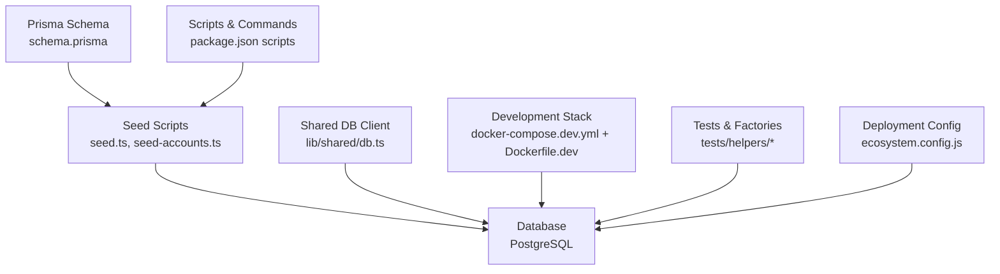
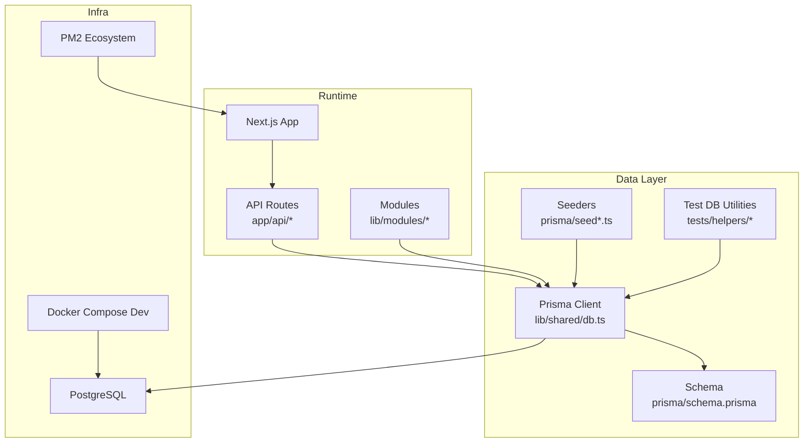
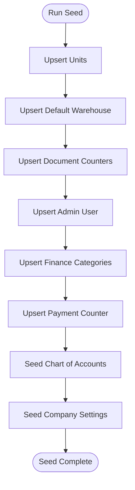
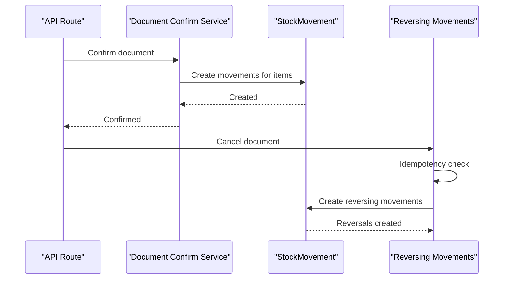
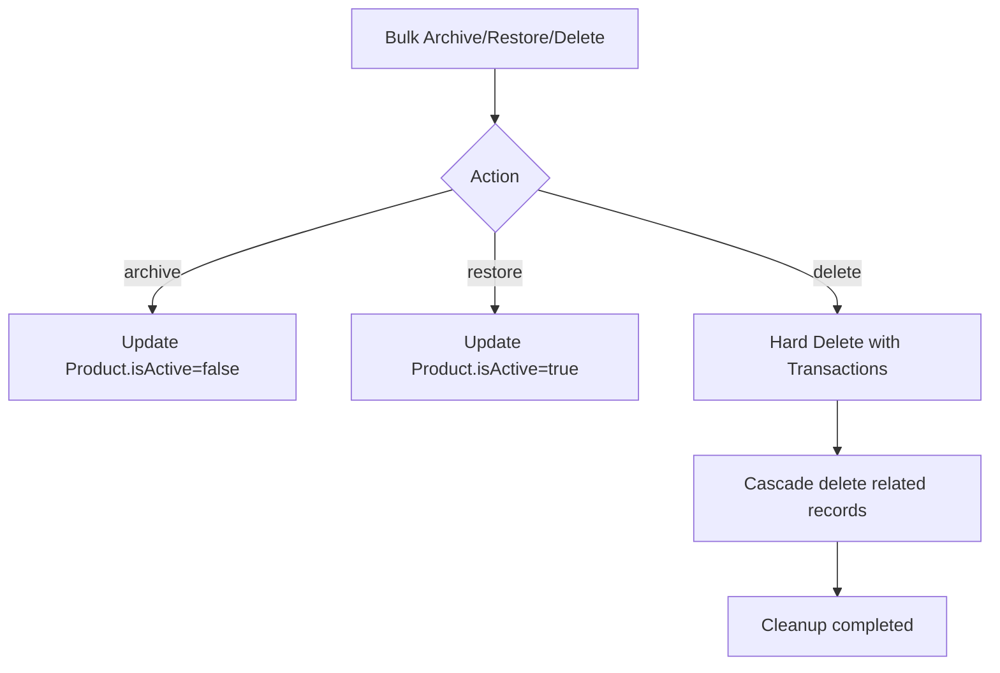
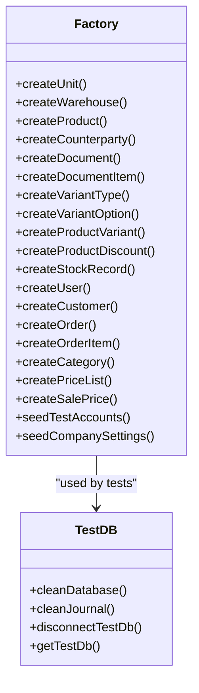
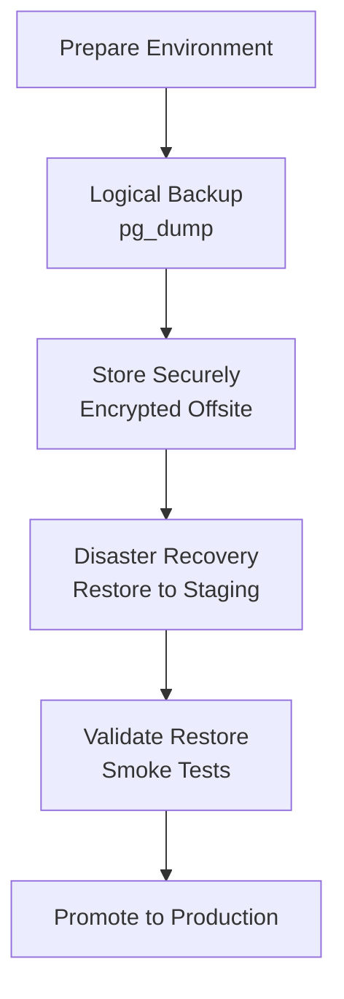
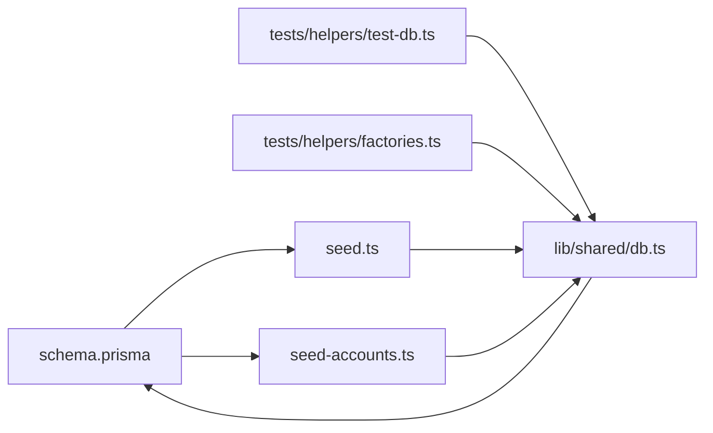

# Data Lifecycle

<cite>
**Referenced Files in This Document**
- [schema.prisma](file://prisma/schema.prisma)
- [seed.ts](file://prisma/seed.ts)
- [seed-accounts.ts](file://prisma/seed-accounts.ts)
- [package.json](file://package.json)
- [ARCHITECTURE.md](file://ARCHITECTURE.md)
- [db.ts](file://lib/shared/db.ts)
- [docker-compose.dev.yml](file://docker-compose.dev.yml)
- [Dockerfile.dev](file://Dockerfile.dev)
- [check_db.sh](file://check_db.sh)
- [ecosystem.config.js](file://ecosystem.config.js)
- [test-db.ts](file://tests/helpers/test-db.ts)
- [factories.ts](file://tests/helpers/factories.ts)
- [migration.sql (add variant hierarchy)](file://prisma/migrations/20260226_add_variant_hierarchy/migration.sql)
- [migration.sql (add product image URLs)](file://prisma/migrations/20260227_add_product_image_urls/migration.sql)
- [migration.sql (add reversing movements)](file://prisma/migrations/20260312_add_reversing_movements/migration.sql)
- [stock-movements.integration.test.ts](file://tests/integration/documents/stock-movements.integration.test.ts)
- [journal.test.ts](file://tests/integration/documents/journal.test.ts)
- [route.ts (bulk products)](file://app/api/accounting/products/bulk/route.ts)
- [route.ts (drill down reports)](file://app/api/finance/reports/drill-down/route.ts)
- [validation.ts](file://lib/shared/validation.ts)
</cite>

## Table of Contents
1. [Introduction](#introduction)
2. [Project Structure](#project-structure)
3. [Core Components](#core-components)
4. [Architecture Overview](#architecture-overview)
5. [Detailed Component Analysis](#detailed-component-analysis)
6. [Dependency Analysis](#dependency-analysis)
7. [Performance Considerations](#performance-considerations)
8. [Troubleshooting Guide](#troubleshooting-guide)
9. [Conclusion](#conclusion)
10. [Appendices](#appendices)

## Introduction
This document describes the data lifecycle for ListOpt ERP, focusing on seed data initialization, reference data, retention and archival strategies, cleanup procedures, testing data generation patterns, backup and recovery, disaster recovery, migration between environments, anonymization for development, audit trail requirements, compliance considerations, data governance, access logging, and data quality monitoring.

## Project Structure
The data lifecycle spans schema definition, seed scripts, database client configuration, Docker-based development, and test utilities. The schema defines core entities and enums; seeders initialize default users, units, categories, document counters, and chart of accounts; tests provide deterministic data creation and cleanup; and deployment configurations define runtime behavior.

**Diagram sources**
- [schema.prisma](file://prisma/schema.prisma)
- [seed.ts](file://prisma/seed.ts)
- [seed-accounts.ts](file://prisma/seed-accounts.ts)
- [db.ts](file://lib/shared/db.ts)
- [docker-compose.dev.yml](file://docker-compose.dev.yml)
- [Dockerfile.dev](file://Dockerfile.dev)
- [package.json](file://package.json)
- [ecosystem.config.js](file://ecosystem.config.js)

**Section sources**
- [ARCHITECTURE.md](file://ARCHITECTURE.md)
- [schema.prisma](file://prisma/schema.prisma)
- [package.json](file://package.json)

## Core Components
- Database schema: Defines entities (users, units, categories, products, counterparties, warehouses, documents, stock movements, chart of accounts, etc.) and enums for statuses, types, and categories.
- Seed scripts: Initialize default units, a default warehouse, document counters, admin user, finance categories, and chart of accounts with Russian accounting standards.
- Shared database client: Centralized Prisma client configured with environment variables and connection pooling.
- Test utilities: Factories for deterministic test data and database cleanup routines ordered by foreign key dependencies.
- Development and deployment: Docker Compose for local Postgres and Next.js; ecosystem config for production process management.

**Section sources**
- [schema.prisma](file://prisma/schema.prisma)
- [seed.ts](file://prisma/seed.ts)
- [seed-accounts.ts](file://prisma/seed-accounts.ts)
- [db.ts](file://lib/shared/db.ts)
- [factories.ts](file://tests/helpers/factories.ts)
- [test-db.ts](file://tests/helpers/test-db.ts)
- [docker-compose.dev.yml](file://docker-compose.dev.yml)
- [Dockerfile.dev](file://Dockerfile.dev)
- [ecosystem.config.js](file://ecosystem.config.js)

## Architecture Overview
The data lifecycle integrates schema-first design, deterministic seeding, and robust test scaffolding. The shared Prisma client ensures consistent access across API routes and tests. Development and production environments rely on environment variables and process managers.

**Diagram sources**
- [db.ts](file://lib/shared/db.ts)
- [schema.prisma](file://prisma/schema.prisma)
- [seed.ts](file://prisma/seed.ts)
- [seed-accounts.ts](file://prisma/seed-accounts.ts)
- [test-db.ts](file://tests/helpers/test-db.ts)
- [docker-compose.dev.yml](file://docker-compose.dev.yml)
- [ecosystem.config.js](file://ecosystem.config.js)

## Detailed Component Analysis

### Seed Data Initialization
- Default units: Upsert predefined units with unique short names.
- Default warehouse: Upsert a single default warehouse identified by a constant ID.
- Document counters: Upsert counters for all document types using prefixes.
- Admin user: Hashed password stored; upsert admin user with admin role.
- Finance categories: System categories upserted with ordering and flags.
- Payment counter: Ensures payment numbering consistency.
- Chart of accounts: Seeds Russian Plan of Accounts (based on official order), sets parent-child relationships, analytics types, and system flags; also seeds company settings mapping chart of accounts to operational accounts.

**Diagram sources**
- [seed.ts](file://prisma/seed.ts)
- [seed-accounts.ts](file://prisma/seed-accounts.ts)

**Section sources**
- [seed.ts](file://prisma/seed.ts)
- [seed-accounts.ts](file://prisma/seed-accounts.ts)

### Reference Data and Defaults
- Units: Short-name uniqueness enforced; used by products.
- Categories: Hierarchical tree with parent-child relations and indexes.
- Warehouses: Default warehouse present for initial operations.
- Document counters: Prefix-based numbering for all document types.
- Chart of accounts: Structured by type and category, with analytics support and parent relationships.

**Section sources**
- [schema.prisma](file://prisma/schema.prisma)
- [seed.ts](file://prisma/seed.ts)
- [seed-accounts.ts](file://prisma/seed-accounts.ts)

### Audit Trail and Immutability
- Stock movements: Immutable records with indexes by document, product, warehouse, and type; supports reversal entries without deleting originals.
- Journal entries: Reversal mechanics ensure audit trail integrity.
- Reversing movements: Unique constraints include isReversing to prevent duplicates; idempotent creation checks.

**Diagram sources**
- [stock-movements.integration.test.ts](file://tests/integration/documents/stock-movements.integration.test.ts)
- [migration.sql (add reversing movements)](file://prisma/migrations/20260312_add_reversing_movements/migration.sql)

**Section sources**
- [schema.prisma](file://prisma/schema.prisma)
- [stock-movements.integration.test.ts](file://tests/integration/documents/stock-movements.integration.test.ts)
- [journal.test.ts](file://tests/integration/documents/journal.test.ts)
- [migration.sql (add reversing movements)](file://prisma/migrations/20260312_add_reversing_movements/migration.sql)

### Data Retention, Archiving, and Cleanup
- Product lifecycle: Bulk archive/restore/delete endpoint updates isActive or hard deletes with cascading cleanup of related records.
- Test cleanup: Deterministic deletion order by foreign key dependencies to avoid constraint violations.
- Indexes and constraints: Unique indexes on movement types and document-item combinations enforce data integrity and aid cleanup determinism.

**Diagram sources**
- [route.ts (bulk products)](file://app/api/accounting/products/bulk/route.ts)
- [test-db.ts](file://tests/helpers/test-db.ts)

**Section sources**
- [route.ts (bulk products)](file://app/api/accounting/products/bulk/route.ts)
- [test-db.ts](file://tests/helpers/test-db.ts)

### Data Generation Patterns for Testing and Development
- Factories: Create units, warehouses, products, counterparties, documents, variants, discounts, stock records, users, customers, and orders with deterministic IDs and defaults.
- Minimal chart of accounts and company settings for journal tests.
- Test database utilities: Clean database in dependency order; clean journal subset; disconnect client.

**Diagram sources**
- [factories.ts](file://tests/helpers/factories.ts)
- [test-db.ts](file://tests/helpers/test-db.ts)

**Section sources**
- [factories.ts](file://tests/helpers/factories.ts)
- [test-db.ts](file://tests/helpers/test-db.ts)

### Backup and Recovery Procedures
- Local development: Docker Compose mounts a persistent volume for PostgreSQL data.
- Production: PM2 manages the Next.js process; environment variables define runtime behavior.
- Recommended approach: Use pg_dump/pg_restore for logical backups; schedule periodic dumps and validate restore procedures in staging.

[No sources needed since this diagram shows conceptual workflow, not actual code structure]

**Section sources**
- [docker-compose.dev.yml](file://docker-compose.dev.yml)
- [ecosystem.config.js](file://ecosystem.config.js)

### Disaster Recovery Planning
- Recovery objectives: Define RPO/RTO aligned with document and journal requirements.
- Multi-region replication: Use managed PostgreSQL with point-in-time recovery.
- Drills: Regular restore drills using anonymized datasets.

[No sources needed since this section provides general guidance]

### Data Migration Between Environments
- Migrations: Use Prisma migrations for schema changes; apply in CI/CD pipeline before deployments.
- Seeders: Run seed scripts after migrations to populate defaults.
- Version control: Keep migration SQL and seed scripts under version control.

**Section sources**
- [schema.prisma](file://prisma/schema.prisma)
- [migration.sql (add variant hierarchy)](file://prisma/migrations/20260226_add_variant_hierarchy/migration.sql)
- [migration.sql (add product image URLs)](file://prisma/migrations/20260227_add_product_image_urls/migration.sql)
- [seed.ts](file://prisma/seed.ts)
- [seed-accounts.ts](file://prisma/seed-accounts.ts)

### Data Anonymization Strategies
- Development data: Use factories to generate synthetic identities; avoid real personal data.
- Sensitive fields: Mask or randomize names, emails, phones; replace real identifiers with deterministic test IDs.
- Test isolation: Clean databases per test suite to prevent cross-test contamination.

**Section sources**
- [factories.ts](file://tests/helpers/factories.ts)
- [test-db.ts](file://tests/helpers/test-db.ts)

### Audit Trail Requirements and Compliance
- Immutable stock movements and journal entries preserve audit trails.
- Reversing movements maintain causality without altering originals.
- Reports: Drill-down routes categorize transactions for financial reporting and compliance.

**Section sources**
- [schema.prisma](file://prisma/schema.prisma)
- [stock-movements.integration.test.ts](file://tests/integration/documents/stock-movements.integration.test.ts)
- [journal.test.ts](file://tests/integration/documents/journal.test.ts)
- [route.ts (drill down reports)](file://app/api/finance/reports/drill-down/route.ts)

### Data Governance, Access Logging, and Data Quality Monitoring
- Access control: Require authentication and permissions for sensitive endpoints.
- Validation: Centralized validation utilities return structured errors.
- Data quality: Unique indexes and constraints reduce anomalies; tests assert idempotency and integrity.

**Section sources**
- [validation.ts](file://lib/shared/validation.ts)
- [schema.prisma](file://prisma/schema.prisma)
- [stock-movements.integration.test.ts](file://tests/integration/documents/stock-movements.integration.test.ts)

## Dependency Analysis
The following diagram highlights key dependencies among seeders, schema, and test utilities.

**Diagram sources**
- [schema.prisma](file://prisma/schema.prisma)
- [seed.ts](file://prisma/seed.ts)
- [seed-accounts.ts](file://prisma/seed-accounts.ts)
- [db.ts](file://lib/shared/db.ts)
- [test-db.ts](file://tests/helpers/test-db.ts)
- [factories.ts](file://tests/helpers/factories.ts)

**Section sources**
- [schema.prisma](file://prisma/schema.prisma)
- [seed.ts](file://prisma/seed.ts)
- [seed-accounts.ts](file://prisma/seed-accounts.ts)
- [db.ts](file://lib/shared/db.ts)
- [test-db.ts](file://tests/helpers/test-db.ts)
- [factories.ts](file://tests/helpers/factories.ts)

## Performance Considerations
- Indexes: Strategic indexes on frequently queried fields (e.g., document types, product/warehouse combinations) improve query performance.
- Unique constraints: Prevent duplicate movements and items while maintaining data integrity.
- Batch operations: Use bulk endpoints for mass updates to minimize round trips.

[No sources needed since this section provides general guidance]

## Troubleshooting Guide
- Database connectivity: Ensure DATABASE_URL is set; the shared client throws if missing.
- Seed failures: Seed scripts log errors and exit with non-zero status; inspect console output.
- Test cleanup: Use dependency-aware cleanDatabase to avoid foreign key constraint errors.
- Health checks: Use the provided shell script to verify login and PM2 logs.

**Section sources**
- [db.ts](file://lib/shared/db.ts)
- [seed.ts](file://prisma/seed.ts)
- [test-db.ts](file://tests/helpers/test-db.ts)
- [check_db.sh](file://check_db.sh)

## Conclusion
ListOpt ERP’s data lifecycle is schema-driven with deterministic seeding, robust audit trails, and comprehensive test scaffolding. By leveraging migrations, seeders, factories, and cleanup utilities, teams can reliably manage data across environments while meeting compliance and quality requirements.

## Appendices

### Environment Variables
- DATABASE_URL: Connection string for PostgreSQL.
- SESSION_SECRET: Secret for session cookies.
- SECURE_COOKIES: Enable secure cookies in production.
- NODE_ENV: Development vs production mode.

**Section sources**
- [ARCHITECTURE.md](file://ARCHITECTURE.md)
- [docker-compose.dev.yml](file://docker-compose.dev.yml)
- [ecosystem.config.js](file://ecosystem.config.js)