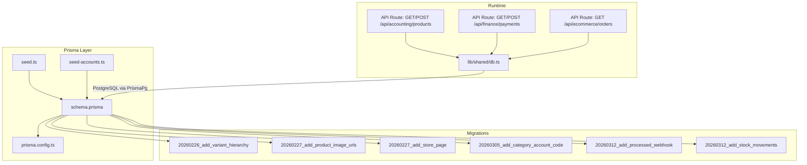
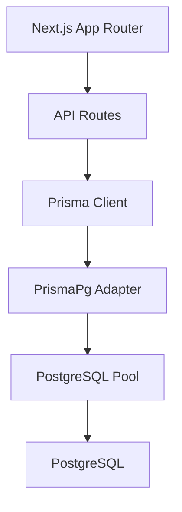
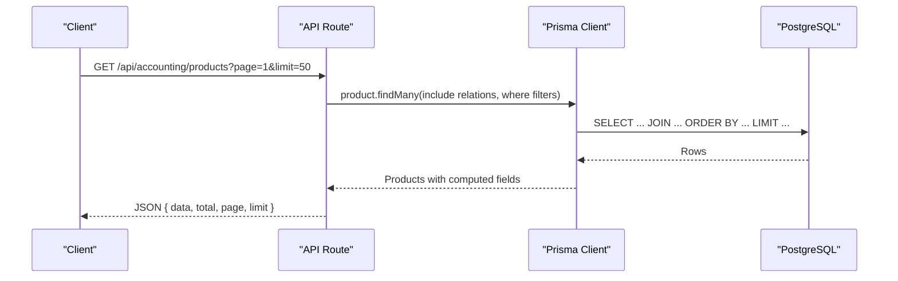
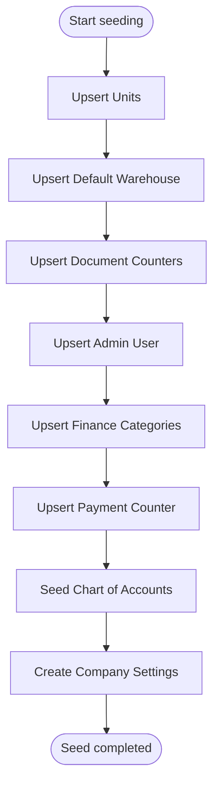
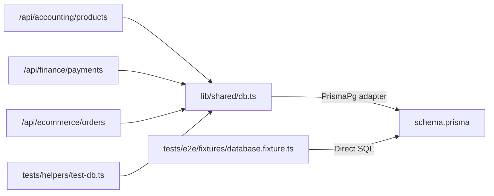

# Database Design

<cite>
**Referenced Files in This Document**
- [schema.prisma](file://prisma/schema.prisma)
- [seed.ts](file://prisma/seed.ts)
- [seed-accounts.ts](file://prisma/seed-accounts.ts)
- [prisma.config.ts](file://prisma.config.ts)
- [20260226_add_variant_hierarchy.migration.sql](file://prisma/migrations/20260226_add_variant_hierarchy/migration.sql)
- [20260227_add_product_image_urls.migration.sql](file://prisma/migrations/20260227_add_product_image_urls/migration.sql)
- [20260227_add_store_page.migration.sql](file://prisma/migrations/20260227_add_store_page/migration.sql)
- [20260305_add_category_account_code.migration.sql](file://prisma/migrations/20260305_add_category_account_code/migration.sql)
- [20260312_add_processed_webhook.migration.sql](file://prisma/migrations/20260312_add_processed_webhook/migration.sql)
- [20260312_add_stock_movements.migration.sql](file://prisma/migrations/20260312_add_stock_movements/migration.sql)
- [route.ts (products)](file://app/api/accounting/products/route.ts)
- [route.ts (payments)](file://app/api/finance/payments/route.ts)
- [route.ts (ecommerce orders)](file://app/api/ecommerce/orders/route.ts)
- [db.ts](file://lib/shared/db.ts)
- [test-db.ts](file://tests/helpers/test-db.ts)
- [database.fixture.ts](file://tests/e2e/fixtures/database.fixture.ts)
- [README.md](file://README.md)
</cite>

## Table of Contents
1. [Introduction](#introduction)
2. [Project Structure](#project-structure)
3. [Core Components](#core-components)
4. [Architecture Overview](#architecture-overview)
5. [Detailed Component Analysis](#detailed-component-analysis)
6. [Dependency Analysis](#dependency-analysis)
7. [Performance Considerations](#performance-considerations)
8. [Troubleshooting Guide](#troubleshooting-guide)
9. [Conclusion](#conclusion)
10. [Appendices](#appendices)

## Introduction
This document describes the ListOpt ERP database schema and design, focusing on the integrated domains of accounting, finance, and e-commerce. It covers entity relationships, field definitions, data types, primary/foreign keys, indexes, constraints, validation and business rules, schema diagrams, data access patterns, caching strategies, performance considerations, data lifecycle and retention, migration and versioning, security and privacy controls, and seed data initialization.

## Project Structure
The database design is defined declaratively with Prisma and applied to PostgreSQL. Migrations evolve the schema over time, while seed scripts initialize system defaults and reference data. API routes demonstrate typical read/write access patterns against the schema.

**Diagram sources**
- [prisma.config.ts:1-16](file://prisma.config.ts#L1-L16)
- [schema.prisma:1-1063](file://prisma/schema.prisma#L1-L1063)
- [seed.ts:1-120](file://prisma/seed.ts#L1-L120)
- [seed-accounts.ts:1-216](file://prisma/seed-accounts.ts#L1-L216)
- [20260226_add_variant_hierarchy.migration.sql:1-34](file://prisma/migrations/20260226_add_variant_hierarchy/migration.sql#L1-L34)
- [20260227_add_product_image_urls.migration.sql:1-13](file://prisma/migrations/20260227_add_product_image_urls/migration.sql#L1-L13)
- [20260227_add_store_page.migration.sql:1-30](file://prisma/migrations/20260227_add_store_page/migration.sql#L1-L30)
- [20260305_add_category_account_code.migration.sql:1-3](file://prisma/migrations/20260305_add_category_account_code/migration.sql#L1-L3)
- [20260312_add_processed_webhook.migration.sql:1-17](file://prisma/migrations/20260312_add_processed_webhook/migration.sql#L1-L17)
- [20260312_add_stock_movements.migration.sql:1-43](file://prisma/migrations/20260312_add_stock_movements/migration.sql#L1-L43)
- [route.ts (products):1-226](file://app/api/accounting/products/route.ts#L1-L226)
- [route.ts (payments):1-113](file://app/api/finance/payments/route.ts#L1-L113)
- [route.ts (ecommerce orders):1-64](file://app/api/ecommerce/orders/route.ts#L1-L64)
- [db.ts:1-24](file://lib/shared/db.ts#L1-L24)

**Section sources**
- [README.md:1-129](file://README.md#L1-L129)
- [prisma.config.ts:1-16](file://prisma.config.ts#L1-L16)

## Core Components
This section summarizes the major domain models and their roles.

- Authentication and Authorization
  - User: stores credentials, roles, and activity flags.
- Reference Data
  - Unit, ProductCategory, Product, VariantType, VariantOption, ProductVariant, ProductCustomField, ProductDiscount, SkuCounter, ProductVariantLink.
- Counterparties and Balances
  - Counterparty, CounterpartyInteraction, CounterpartyBalance.
- Warehousing and Stock
  - Warehouse, StockRecord, StockMovement.
- Documents and Items
  - DocumentCounter, Document, DocumentItem.
- Pricing
  - PriceList, PurchasePrice, SalePrice.
- E-commerce
  - Customer, CustomerAddress, CartItem, Order, OrderItem, Review, Favorite, PromoBlock, StorePage, OrderCounter.
- Finance
  - FinanceCategory, PaymentCounter, Payment.
- Accounting
  - Account, JournalEntry, LedgerLine, JournalCounter, CompanySettings.
- Integrations and System
  - Integration, ProcessedWebhook.

Key design characteristics:
- All identifiers are UUIDs using cuid() by default.
- Strong typing via enums for statuses, types, and categories.
- Extensive indexing to support filtering and reporting.
- Self-referencing relations for hierarchical product variants.
- Immutable audit trail via StockMovement.

**Section sources**
- [schema.prisma:21-1063](file://prisma/schema.prisma#L21-L1063)

## Architecture Overview
The database layer is implemented with Prisma ORM targeting PostgreSQL. The runtime connects via PrismaPg adapter using a connection pool. API routes encapsulate business logic and enforce permissions, while seeds initialize system defaults.

**Diagram sources**
- [db.ts:1-24](file://lib/shared/db.ts#L1-L24)
- [prisma.config.ts:1-16](file://prisma.config.ts#L1-L16)

**Section sources**
- [db.ts:1-24](file://lib/shared/db.ts#L1-L24)
- [prisma.config.ts:1-16](file://prisma.config.ts#L1-L16)

## Detailed Component Analysis

### ER Model and Entity Relationships
The following ER diagram captures core entities, attributes, primary keys, foreign keys, and relationships.

```mermaid
erDiagram
User {
string id PK
string username UK
string password
string email UK
enum role
boolean isActive
datetime createdAt
datetime updatedAt
}
Unit {
string id PK
string name
string shortName UK
boolean isActive
datetime createdAt
datetime updatedAt
}
ProductCategory {
string id PK
string name
string parentId
int order
boolean isActive
datetime createdAt
datetime updatedAt
}
Product {
string id PK
string name
string sku UK
string barcode UK
string description
string unitId FK
string categoryId FK
string imageUrl
json imageUrls
boolean isActive
datetime createdAt
datetime updatedAt
string masterProductId FK
boolean isMainInGroup
string variantGroupName
string slug UK
boolean publishedToStore
string seoTitle
string seoDescription
string seoKeywords
}
VariantType {
string id PK
string name
boolean isActive
int order
datetime createdAt
datetime updatedAt
}
VariantOption {
string id PK
string variantTypeId FK
string value
int order
}
ProductVariant {
string id PK
string productId FK
string optionId FK
string sku UK
string barcode UK
float priceAdjustment
boolean isActive
datetime createdAt
}
ProductCustomField {
string id PK
string productId FK
string definitionId FK
string value
}
CustomFieldDefinition {
string id PK
string name
string fieldType
string options
boolean isActive
int order
datetime createdAt
datetime updatedAt
}
ProductDiscount {
string id PK
string productId FK
string name
enum type
float value
datetime validFrom
datetime validTo
boolean isActive
datetime createdAt
datetime updatedAt
}
SkuCounter {
string id PK
string prefix UK
int lastNumber
}
ProductVariantLink {
string id PK
string productId FK
string linkedProductId FK
string groupName
int sortOrder
boolean isActive
datetime createdAt
}
Counterparty {
string id PK
enum type
string name
string legalName
string inn UK
string kpp
string bankAccount
string bankName
string bik
string address
string phone
string email
string contactPerson
string notes
boolean isActive
datetime createdAt
datetime updatedAt
string customer
}
CounterpartyInteraction {
string id PK
string counterpartyId FK
string type
string subject
string description
string createdBy
datetime createdAt
}
CounterpartyBalance {
string id PK
string counterpartyId UK
float balanceRub
datetime lastUpdatedAt
}
Warehouse {
string id PK
string name
string address
string responsibleName
boolean isActive
datetime createdAt
datetime updatedAt
}
StockRecord {
string id PK
string warehouseId FK
string productId FK
float quantity
float averageCost
float totalCostValue
datetime updatedAt
}
StockMovement {
string id PK
string documentId FK
string productId FK
string warehouseId FK
string variantId FK
float quantity
float cost
float totalCost
enum type
datetime createdAt
}
DocumentCounter {
string id PK
string prefix UK
int lastNumber
}
Document {
string id PK
string number UK
enum type
enum status
datetime date
string warehouseId FK
string targetWarehouseId FK
string counterpartyId FK
float totalAmount
string currency
enum paymentType
string linkedDocumentId FK
string description
string notes
string createdBy
datetime confirmedAt
datetime confirmedBy
datetime cancelledAt
datetime createdAt
datetime updatedAt
string customerId FK
string deliveryAddressId FK
float deliveryCost
string paymentMethod
string paymentStatus
string paymentExternalId
datetime paidAt
datetime shippedAt
datetime deliveredAt
}
DocumentItem {
string id PK
string documentId FK
string productId FK
string variantId FK
float quantity
float price
float total
float expectedQty
float actualQty
float difference
datetime createdAt
}
PriceList {
string id PK
string name
string description
boolean isActive
datetime createdAt
datetime updatedAt
}
PurchasePrice {
string id PK
string productId FK
string supplierId FK
float price
string currency
datetime validFrom
datetime validTo
boolean isActive
datetime createdAt
}
SalePrice {
string id PK
string productId FK
string priceListId FK
float price
string currency
datetime validFrom
datetime validTo
boolean isActive
datetime createdAt
}
Customer {
string id PK
string telegramId UK
string telegramUsername
string name
string phone
string email
boolean isActive
datetime createdAt
datetime updatedAt
string counterpartyId UK
}
CustomerAddress {
string id PK
string customerId FK
string label
string recipientName
string phone
string city
string street
string building
string apartment
string postalCode
boolean isDefault
datetime createdAt
}
CartItem {
string id PK
string customerId FK
string productId FK
string variantId FK
int quantity
float priceSnapshot
datetime addedAt
}
Order {
string id PK
string orderNumber UK
string customerId FK
enum status
string documentId UK
enum deliveryType
string deliveryAddressId FK
float deliveryCost
float totalAmount
enum paymentMethod
enum paymentStatus
string paymentExternalId
string notes
datetime createdAt
datetime updatedAt
datetime paidAt
datetime shippedAt
datetime deliveredAt
}
OrderItem {
string id PK
string orderId FK
string productId FK
string variantId FK
int quantity
float price
float total
datetime createdAt
}
Review {
string id PK
string productId FK
string customerId FK
string orderId FK
string documentId FK
int rating
string title
string comment
boolean isVerifiedPurchase
boolean isPublished
datetime createdAt
datetime updatedAt
}
Favorite {
string id PK
string customerId FK
string productId FK
datetime addedAt
}
PromoBlock {
string id PK
string title
string subtitle
string imageUrl
string linkUrl
int order
boolean isActive
datetime createdAt
datetime updatedAt
}
StorePage {
string id PK
string title
string slug UK
text content
string seoTitle
string seoDescription
boolean isPublished
int sortOrder
boolean showInFooter
boolean showInHeader
datetime createdAt
datetime updatedAt
}
OrderCounter {
string id PK
string prefix UK
int lastNumber
}
FinanceCategory {
string id PK
string name
string type
boolean isSystem
boolean isActive
int order
string defaultAccountCode
datetime createdAt
datetime updatedAt
}
PaymentCounter {
string id PK
string prefix UK
int lastNumber
}
Payment {
string id PK
string number UK
string type
string categoryId FK
string counterpartyId FK
string documentId FK
float amount
enum paymentMethod
datetime date
string description
datetime createdAt
datetime updatedAt
}
Account {
string id PK
string code UK
string name
enum type
enum category
string parentId FK
boolean isSystem
boolean isActive
int order
string analyticsType
datetime createdAt
datetime updatedAt
}
JournalEntry {
string id PK
string number UK
datetime date
string description
string sourceType
string sourceId
string sourceNumber
boolean isManual
boolean isReversed
string reversedBy FK
string reversedById FK
string createdBy
datetime createdAt
}
LedgerLine {
string id PK
string entryId FK
string accountId FK
float debit
float credit
string counterpartyId
string warehouseId
string productId
string currency
float amountRub
}
JournalCounter {
string id PK
string prefix UK
int lastNumber
}
CompanySettings {
string id PK
string name
string inn
string kpp
string ogrn
enum taxRegime
float vatRate
float usnRate
float initialCapital
datetime initialCapitalDate
string cashAccountId
string bankAccountId
string inventoryAccountId
string supplierAccountId
string customerAccountId
string vatAccountId
string vatPayableAccountId
string salesAccountId
string cogsAccountId
string profitAccountId
string retainedEarningsAccountId
int fiscalYearStartMonth
datetime createdAt
datetime updatedAt
}
Integration {
string id PK
string type UK
string name
boolean isEnabled
json settings
datetime createdAt
datetime updatedAt
}
ProcessedWebhook {
string id PK
string source
string externalId
json payload
datetime processedAt
}
ProductCategory ||--o{ Product : "child categories"
Product ||--o{ Product : "master variants"
Product ||--o{ ProductVariant : "variants"
Product ||--o{ ProductVariantLink : "variant links"
Product ||--o{ ProductCustomField : "custom fields"
Product ||--o{ ProductDiscount : "discounts"
Product ||--o{ DocumentItem : "items"
Product ||--o{ CartItem : "cart items"
Product ||--o{ OrderItem : "order items"
Product ||--o{ Review : "reviews"
Product ||--o{ Favorite : "favorites"
Unit ||--o{ Product : "units"
ProductCategory ||--o{ Product : "products"
VariantType ||--o{ VariantOption : "options"
VariantOption ||--o{ ProductVariant : "variants"
Product ||--o{ ProductVariant : "variant linkage"
Counterparty ||--o{ CounterpartyInteraction : "interactions"
Counterparty ||--o{ CounterpartyBalance : "balance"
Counterparty ||--o{ PurchasePrice : "purchase prices"
Counterparty ||--o{ Payment : "payments"
Warehouse ||--o{ StockRecord : "records"
Warehouse ||--o{ StockMovement : "movements"
Warehouse ||--o{ Document : "warehouses"
Document ||--o{ DocumentItem : "items"
Document ||--o{ StockMovement : "movements"
Document ||--o{ Payment : "payments"
Document ||--o{ Review : "reviews"
PriceList ||--o{ SalePrice : "prices"
Product ||--o{ PurchasePrice : "purchase prices"
Product ||--o{ SalePrice : "sale prices"
Customer ||--o{ CustomerAddress : "addresses"
Customer ||--o{ CartItem : "cart items"
Customer ||--o{ Order : "orders"
Customer ||--o{ Review : "reviews"
Customer ||--o{ Favorite : "favorites"
Account ||--o{ LedgerLine : "lines"
JournalEntry ||--o{ LedgerLine : "lines"
Integration ||--o{ Document : "integrations"
ProcessedWebhook ||--|| ProcessedWebhook : "idempotency"
```

**Diagram sources**
- [schema.prisma:21-1063](file://prisma/schema.prisma#L21-L1063)

**Section sources**
- [schema.prisma:21-1063](file://prisma/schema.prisma#L21-L1063)

### Indexes, Constraints, and Validation Rules
- Primary Keys
  - All models use a UUID primary key except where noted (e.g., counters).
- Unique Constraints
  - username, email, shortName (Unit), inn (Counterparty), telegramId (Customer), number (Document), number (Payment), prefix (DocumentCounter, PaymentCounter, OrderCounter), slug (StorePage), source + externalId (ProcessedWebhook).
- Foreign Keys
  - Defined via relation directives; cascading deletes where appropriate (e.g., ProductCustomField, ProductVariant, DocumentItem, StockMovement).
- Enumerations
  - Enforce domain-specific values for statuses, types, and categories.
- Business Rules
  - Payment numbering via PaymentCounter.
  - Document numbering via DocumentCounter.
  - SKU auto-generation via SkuCounter.
  - Variant hierarchy via Product.masterProductId and ProductVariantLink.
  - E-commerce order mapping to Document (sales_order) via Order.documentId.
  - Immutable stock movement audit trail via StockMovement.

**Section sources**
- [schema.prisma:21-1063](file://prisma/schema.prisma#L21-L1063)
- [20260226_add_variant_hierarchy.migration.sql:1-34](file://prisma/migrations/20260226_add_variant_hierarchy/migration.sql#L1-L34)
- [20260227_add_product_image_urls.migration.sql:1-13](file://prisma/migrations/20260227_add_product_image_urls/migration.sql#L1-L13)
- [20260227_add_store_page.migration.sql:1-30](file://prisma/migrations/20260227_add_store_page/migration.sql#L1-L30)
- [20260305_add_category_account_code.migration.sql:1-3](file://prisma/migrations/20260305_add_category_account_code/migration.sql#L1-L3)
- [20260312_add_processed_webhook.migration.sql:1-17](file://prisma/migrations/20260312_add_processed_webhook/migration.sql#L1-L17)
- [20260312_add_stock_movements.migration.sql:1-43](file://prisma/migrations/20260312_add_stock_movements/migration.sql#L1-L43)

### Data Access Patterns
- Product Catalog
  - Filtering by category, activity, publication, discount availability, and variant status.
  - Sorting by name, SKU, creation date; post-processing for price-based sorts.
  - Includes related pricing, discounts, and counts for variants.
- Payments
  - Pagination, aggregation totals, and counter-based numbering.
- E-commerce Orders
  - Customer-scoped retrieval mapped from Document records.

**Diagram sources**
- [route.ts (products):1-226](file://app/api/accounting/products/route.ts#L1-L226)

**Section sources**
- [route.ts (products):1-226](file://app/api/accounting/products/route.ts#L1-L226)
- [route.ts (payments):1-113](file://app/api/finance/payments/route.ts#L1-L113)
- [route.ts (ecommerce orders):1-64](file://app/api/ecommerce/orders/route.ts#L1-L64)

### Caching Strategies
- No explicit caching layer is defined in the schema or runtime code.
- Recommendations:
  - Application-level caching for frequently accessed reference data (Units, Categories, FinanceCategories).
  - Query result caching for paginated product listings with cache invalidation on writes.
  - Redis-backed session storage for authentication.

[No sources needed since this section provides general guidance]

### Performance Considerations
- Indexes
  - Composite and single-column indexes on frequently filtered and sorted fields (e.g., Document.type+status+date, Product.categoryId, Product.slug, StockMovement.productId+warehouseId).
- Queries
  - Denormalized computed fields (e.g., discounted price) are calculated in application logic after fetching related records.
- Cost Tracking
  - StockRecord maintains average cost and total value; StockMovement logs per-record cost and totals for auditability.
- Reporting
  - Aggregation queries for payments leverage database-side sums.

**Section sources**
- [schema.prisma:21-1063](file://prisma/schema.prisma#L21-L1063)
- [route.ts (payments):1-113](file://app/api/finance/payments/route.ts#L1-L113)

### Data Lifecycle, Retention, and Archival
- No explicit retention or archival policies are defined in the schema.
- Suggested approach:
  - Archive closed Documents and related items older than X years.
  - Purge ProcessedWebhook entries older than Y days.
  - Maintain audit trail (StockMovement) as immutable historical records.

[No sources needed since this section provides general guidance]

### Data Migration Paths and Version Management
- Prisma migrations manage schema evolution.
- Example migrations:
  - Variant hierarchy enhancement and self-reference.
  - Product image URLs as JSON array.
  - Store CMS pages.
  - Finance category default account code.
  - Processed webhook idempotency table.
  - Stock movement table creation with enums and indexes.
- Migration execution
  - Use Prisma CLI to apply migrations to PostgreSQL.

**Section sources**
- [20260226_add_variant_hierarchy.migration.sql:1-34](file://prisma/migrations/20260226_add_variant_hierarchy/migration.sql#L1-L34)
- [20260227_add_product_image_urls.migration.sql:1-13](file://prisma/migrations/20260227_add_product_image_urls/migration.sql#L1-L13)
- [20260227_add_store_page.migration.sql:1-30](file://prisma/migrations/20260227_add_store_page/migration.sql#L1-L30)
- [20260305_add_category_account_code.migration.sql:1-3](file://prisma/migrations/20260305_add_category_account_code/migration.sql#L1-L3)
- [20260312_add_processed_webhook.migration.sql:1-17](file://prisma/migrations/20260312_add_processed_webhook/migration.sql#L1-L17)
- [20260312_add_stock_movements.migration.sql:1-43](file://prisma/migrations/20260312_add_stock_movements/migration.sql#L1-L43)
- [README.md:38-42](file://README.md#L38-L42)

### Security, Privacy, and Access Control
- Authentication
  - Passwords are bcrypt-hashed; role-based access control via User.role.
- Authorization
  - API routes enforce permissions (e.g., products:read, products:write).
- Privacy
  - Personal data (Customer, Counterparty) present; ensure compliance with applicable regulations.
- Transport
  - DATABASE_URL must be configured securely; production deployments should use encrypted connections.

**Section sources**
- [schema.prisma:21-32](file://prisma/schema.prisma#L21-L32)
- [route.ts (products):1-226](file://app/api/accounting/products/route.ts#L1-L226)
- [route.ts (payments):1-113](file://app/api/finance/payments/route.ts#L1-L113)

### Seed Data Structure and Initialization
- Default Units, Warehouses, Document Counters, Admin User, Finance Categories, Payment Counter.
- Russian Chart of Accounts and default CompanySettings initialization.

**Diagram sources**
- [seed.ts:16-120](file://prisma/seed.ts#L16-L120)
- [seed-accounts.ts:101-216](file://prisma/seed-accounts.ts#L101-L216)

**Section sources**
- [seed.ts:16-120](file://prisma/seed.ts#L16-L120)
- [seed-accounts.ts:101-216](file://prisma/seed-accounts.ts#L101-L216)

## Dependency Analysis
- Runtime database client depends on DATABASE_URL and uses PrismaPg adapter.
- API routes depend on shared database client and enforce permissions.
- Tests clean data in dependency order to avoid FK violations.

**Diagram sources**
- [db.ts:1-24](file://lib/shared/db.ts#L1-L24)
- [route.ts (products):1-226](file://app/api/accounting/products/route.ts#L1-L226)
- [route.ts (payments):1-113](file://app/api/finance/payments/route.ts#L1-L113)
- [route.ts (ecommerce orders):1-64](file://app/api/ecommerce/orders/route.ts#L1-L64)
- [test-db.ts:1-56](file://tests/helpers/test-db.ts#L1-L56)
- [database.fixture.ts:1-147](file://tests/e2e/fixtures/database.fixture.ts#L1-L147)

**Section sources**
- [db.ts:1-24](file://lib/shared/db.ts#L1-L24)
- [test-db.ts:1-56](file://tests/helpers/test-db.ts#L1-L56)
- [database.fixture.ts:1-147](file://tests/e2e/fixtures/database.fixture.ts#L1-L147)

## Performance Considerations
- Use indexes on high-cardinality fields and frequent filters.
- Prefer pre-aggregations for dashboards; compute deltas incrementally.
- Batch operations for bulk imports (e.g., CSV) to reduce round trips.
- Monitor long-running queries and consider materialized views for complex reports.

[No sources needed since this section provides general guidance]

## Troubleshooting Guide
- Permission errors
  - Ensure the caller has the required permission (e.g., products:read).
- Validation failures
  - API routes return structured validation errors; inspect request payloads.
- Test database cleanup
  - Integration tests truncate tables in dependency order to avoid FK conflicts.
- E2E test database
  - Uses a dedicated pool; ensure DATABASE_URL is set for test environment.

**Section sources**
- [route.ts (products):140-145](file://app/api/accounting/products/route.ts#L140-L145)
- [route.ts (payments):107-111](file://app/api/finance/payments/route.ts#L107-L111)
- [test-db.ts:8-42](file://tests/helpers/test-db.ts#L8-L42)
- [database.fixture.ts:17-45](file://tests/e2e/fixtures/database.fixture.ts#L17-L45)

## Conclusion
The ListOpt ERP schema integrates accounting, finance, and e-commerce into a cohesive relational model with strong typing, extensive indexing, and clear audit trails. Prisma-driven migrations and seed scripts enable controlled evolution and initialization. The API routes demonstrate practical access patterns, while the absence of explicit caching and retention policies indicates room for operational enhancements tailored to deployment needs.

## Appendices

### Appendix A: Field Definitions and Data Types
- UUID primary keys: String with cuid() default.
- Enumerations: DocumentStatus, DocumentType, PaymentType, CounterpartyType, MovementType, OrderStatus, DeliveryType, EcomPaymentMethod, EcomPaymentStatus, AccountType, AccountCategory, TaxRegime.
- JSON fields: imageUrls (Product), settings (Integration), payload (ProcessedWebhook).
- Monetary amounts: Float with precision considerations; consider decimal for financial calculations.
- Timestamps: DateTime with defaults and updatedAt triggers.

**Section sources**
- [schema.prisma:21-1063](file://prisma/schema.prisma#L21-L1063)