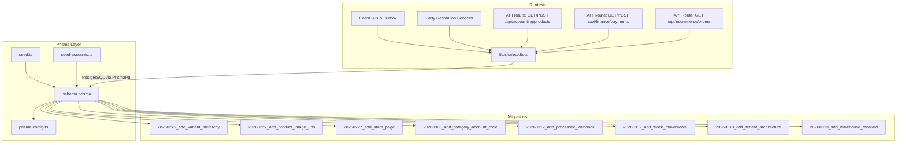
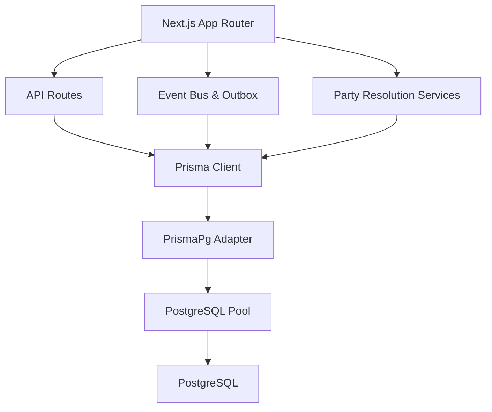
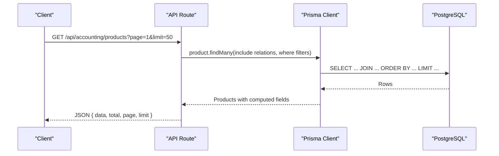
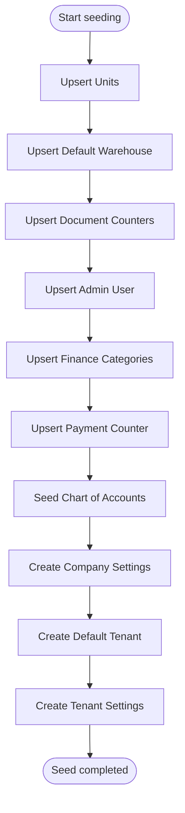
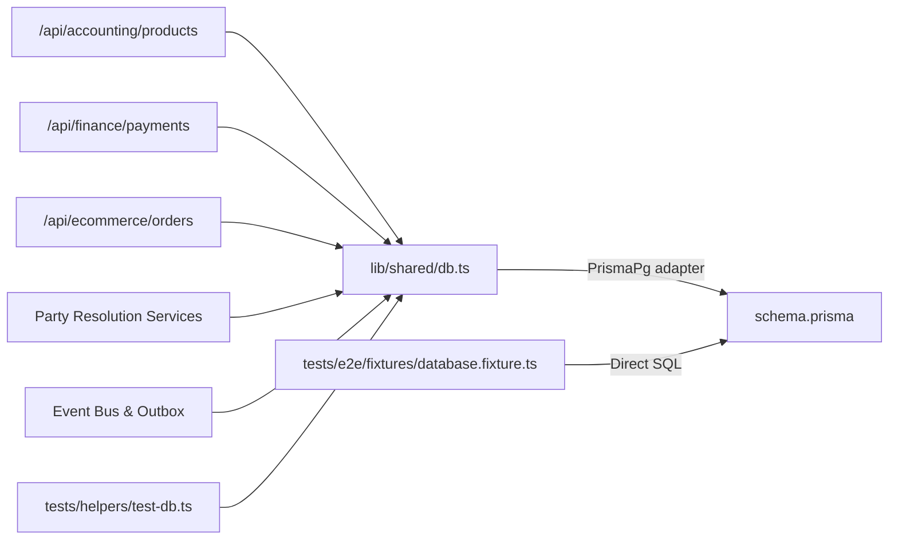

# Database Design

<cite>
**Referenced Files in This Document**
- [schema.prisma](file://prisma/schema.prisma)
- [seed.ts](file://prisma/seed.ts)
- [seed-accounts.ts](file://prisma/seed-accounts.ts)
- [prisma.config.ts](file://prisma.config.ts)
- [20260226_add_variant_hierarchy.migration.sql](file://prisma/migrations/20260226_add_variant_hierarchy/migration.sql)
- [20260227_add_product_image_urls.migration.sql](file://prisma/migrations/20260227_add_product_image_urls/migration.sql)
- [20260227_add_store_page.migration.sql](file://prisma/migrations/20260227_add_store_page/migration.sql)
- [20260305_add_category_account_code.migration.sql](file://prisma/migrations/20260305_add_category_account_code/migration.sql)
- [20260312_add_processed_webhook.migration.sql](file://prisma/migrations/20260312_add_processed_webhook/migration.sql)
- [20260312_add_stock_movements.migration.sql](file://prisma/migrations/20260312_add_stock_movements/migration.sql)
- [20260313_add_tenant_architecture.migration.sql](file://prisma/migrations/20260313_add_tenant_architecture/migration.sql)
- [20260313_add_warehouse_tenantId.migration.sql](file://prisma/migrations/20260313_add_warehouse_tenantId/migration.sql)
- [route.ts (products)](file://app/api/accounting/products/route.ts)
- [route.ts (payments)](file://app/api/finance/payments/route.ts)
- [route.ts (ecommerce orders)](file://app/api/ecommerce/orders/route.ts)
- [db.ts](file://lib/shared/db.ts)
- [test-db.ts](file://tests/helpers/test-db.ts)
- [database.fixture.ts](file://tests/e2e/fixtures/database.fixture.ts)
- [README.md](file://README.md)
- [event-bus.ts](file://lib/events/event-bus.ts)
- [outbox.ts](file://lib/events/outbox.ts)
- [types.ts](file://lib/events/types.ts)
- [domain-events.ts](file://lib/bootstrap/domain-events.ts)
- [party-resolver.ts](file://lib/party/services/party-resolver.ts)
- [party-owner.ts](file://lib/party/services/party-owner.ts)
- [party-merge.ts](file://lib/party/services/party-merge.ts)
- [party-types.ts](file://lib/party/types.ts)
</cite>

## Update Summary
**Changes Made**
- Added comprehensive multi-tenant architecture with Tenant, TenantMembership, and TenantSettings models
- Introduced Party Management system with Party, PartyLink, PartyActivity, PartyOwner, and MergeRequest tables
- Implemented Event Storage System using OutboxEvent table for durable event delivery
- Updated entity relationships to reflect new tenant scoping for warehouses
- Enhanced CRM capabilities with customer 360-degree view functionality

## Table of Contents
1. [Introduction](#introduction)
2. [Project Structure](#project-structure)
3. [Core Components](#core-components)
4. [Architecture Overview](#architecture-overview)
5. [Detailed Component Analysis](#detailed-component-analysis)
6. [Dependency Analysis](#dependency-analysis)
7. [Performance Considerations](#performance-considerations)
8. [Troubleshooting Guide](#troubleshooting-guide)
9. [Conclusion](#conclusion)
10. [Appendices](#appendices)

## Introduction
This document describes the ListOpt ERP database schema and design, focusing on the integrated domains of accounting, finance, e-commerce, and customer relationship management. It covers entity relationships, field definitions, data types, primary/foreign keys, indexes, constraints, validation and business rules, schema diagrams, data access patterns, caching strategies, performance considerations, data lifecycle and retention, migration and versioning, security and privacy controls, and seed data initialization.

**Updated** Added comprehensive multi-tenant architecture, party management system, and event storage infrastructure for scalable enterprise deployment.

## Project Structure
The database design is defined declaratively with Prisma and applied to PostgreSQL. Migrations evolve the schema over time, while seed scripts initialize system defaults and reference data. API routes demonstrate typical read/write access patterns against the schema. The new architecture supports multi-tenancy with tenant-scoped resources and includes robust event handling for distributed systems.

**Diagram sources**
- [prisma.config.ts:1-16](file://prisma.config.ts#L1-L16)
- [schema.prisma:1-1338](file://prisma/schema.prisma#L1-L1338)
- [seed.ts:1-120](file://prisma/seed.ts#L1-L120)
- [seed-accounts.ts:1-216](file://prisma/seed-accounts.ts#L1-L216)
- [20260226_add_variant_hierarchy.migration.sql:1-34](file://prisma/migrations/20260226_add_variant_hierarchy/migration.sql#L1-L34)
- [20260227_add_product_image_urls.migration.sql:1-13](file://prisma/migrations/20260227_add_product_image_urls/migration.sql#L1-L13)
- [20260227_add_store_page.migration.sql:1-30](file://prisma/migrations/20260227_add_store_page/migration.sql#L1-L30)
- [20260305_add_category_account_code.migration.sql:1-3](file://prisma/migrations/20260305_add_category_account_code/migration.sql#L1-L3)
- [20260312_add_processed_webhook.migration.sql:1-17](file://prisma/migrations/20260312_add_processed_webhook/migration.sql#L1-L17)
- [20260312_add_stock_movements.migration.sql:1-43](file://prisma/migrations/20260312_add_stock_movements/migration.sql#L1-L43)
- [20260313_add_tenant_architecture.migration.sql:1-79](file://prisma/migrations/20260313_add_tenant_architecture/migration.sql#L1-L79)
- [20260313_add_warehouse_tenantId.migration.sql:1-15](file://prisma/migrations/20260313_add_warehouse_tenantId/migration.sql#L1-L15)
- [route.ts (products):1-226](file://app/api/accounting/products/route.ts#L1-L226)
- [route.ts (payments):1-113](file://app/api/finance/payments/route.ts#L1-L113)
- [route.ts (ecommerce orders):1-64](file://app/api/ecommerce/orders/route.ts#L1-L64)
- [db.ts:1-24](file://lib/shared/db.ts#L1-L24)

**Section sources**
- [README.md:1-129](file://README.md#L1-L129)
- [prisma.config.ts:1-16](file://prisma.config.ts#L1-L16)

## Core Components
This section summarizes the major domain models and their roles, including the new tenant and party management components.

- **Authentication and Authorization**
  - User: stores credentials, roles, and activity flags.
  - Tenant: manages multi-tenant isolation with unique slugs and activation states.
  - TenantMembership: links users to tenants with role-based access control.
  - TenantSettings: per-tenant configuration including company info and chart of accounts.

- **Party Management (CRM Foundation)**
  - Party: customer 360-degree identity with type (person/organization), ownership tracking, and merge capabilities.
  - PartyLink: bidirectional links between parties and external entities (Customer, Counterparty).
  - PartyActivity: timeline of customer interactions, orders, and payments.
  - PartyOwner: ownership assignments with primary and backup roles.
  - MergeRequest: systematic merging of duplicate customer identities.

- **Reference Data**
  - Unit, ProductCategory, Product, VariantType, VariantOption, ProductVariant, ProductCustomField, ProductDiscount, SkuCounter, ProductVariantLink.

- **Counterparties and Balances**
  - Counterparty, CounterpartyInteraction, CounterpartyBalance.

- **Warehousing and Stock**
  - Warehouse (tenant-scoped), StockRecord, StockMovement.

- **Documents and Items**
  - DocumentCounter, Document, DocumentItem.

- **Pricing**
  - PriceList, PurchasePrice, SalePrice.

- **E-commerce**
  - Customer, CustomerAddress, CartItem, Order, OrderItem, Review, Favorite, PromoBlock, StorePage, OrderCounter.

- **Finance**
  - FinanceCategory, PaymentCounter, Payment.

- **Accounting**
  - Account, JournalEntry, LedgerLine, JournalCounter, CompanySettings.

- **Integrations and System**
  - Integration, ProcessedWebhook, OutboxEvent (durable event delivery).

**Updated** Added comprehensive tenant management, party management, and event storage infrastructure for enterprise-scale deployment.

**Section sources**
- [schema.prisma:21-1338](file://prisma/schema.prisma#L21-L1338)

## Architecture Overview
The database layer is implemented with Prisma ORM targeting PostgreSQL. The runtime connects via PrismaPg adapter using a connection pool. API routes encapsulate business logic and enforce permissions, while seeds initialize system defaults. The new architecture supports multi-tenancy with tenant-scoped resources and includes robust event handling for distributed systems.

**Diagram sources**
- [db.ts:1-24](file://lib/shared/db.ts#L1-L24)
- [prisma.config.ts:1-16](file://prisma.config.ts#L1-L16)
- [event-bus.ts:1-93](file://lib/events/event-bus.ts#L1-L93)
- [outbox.ts:1-269](file://lib/events/outbox.ts#L1-L269)

**Section sources**
- [db.ts:1-24](file://lib/shared/db.ts#L1-L24)
- [prisma.config.ts:1-16](file://prisma.config.ts#L1-L16)

## Detailed Component Analysis

### ER Model and Entity Relationships
The following ER diagram captures core entities, attributes, primary keys, foreign keys, and relationships, including the new tenant and party management components.

```mermaid
erDiagram
User {
string id PK
string username UK
string password
string email UK
enum role
boolean isActive
datetime createdAt
datetime updatedAt
}
Tenant {
string id PK
string name
string slug UK
boolean isActive
datetime createdAt
datetime updatedAt
}
TenantMembership {
string id PK
string tenantId FK
string userId FK
enum role
boolean isActive
datetime createdAt
}
TenantSettings {
string id PK
string tenantId UK
string name
string inn
string kpp
string ogrn
enum taxRegime
float vatRate
float usnRate
float initialCapital
datetime initialCapitalDate
string cashAccountId
string bankAccountId
string inventoryAccountId
string supplierAccountId
string customerAccountId
string vatAccountId
string vatPayableAccountId
string salesAccountId
string cogsAccountId
string profitAccountId
string retainedEarningsAccountId
int fiscalYearStartMonth
datetime createdAt
datetime updatedAt
}
Party {
string id PK
string displayName
boolean displayNameManual
enum type
string primaryOwnerUserId
string primaryCustomerId UK
string primaryCounterpartyId UK
datetime lastActivityAt
enum status
string mergedIntoId
datetime mergedAt
boolean isActive
string notes
datetime createdAt
datetime updatedAt
}
PartyLink {
string id PK
string partyId FK
enum entityType
string entityId
boolean isPrimary
datetime linkedAt
}
PartyActivity {
string id PK
string partyId FK
string type
datetime occurredAt
string sourceType
string sourceId
json summary
}
PartyOwner {
string id PK
string partyId FK
string userId FK
enum role
datetime assignedAt
string assignedBy
boolean isActive
datetime endedAt
}
MergeRequest {
string id PK
string survivorId FK
string victimId FK
string detectionSource
float confidence
string matchReason
enum status
string reviewedBy
datetime reviewedAt
datetime executedAt
string createdBy
datetime createdAt
}
Unit {
string id PK
string name
string shortName UK
boolean isActive
datetime createdAt
datetime updatedAt
}
ProductCategory {
string id PK
string name
string parentId
int order
boolean isActive
datetime createdAt
datetime updatedAt
}
Product {
string id PK
string name
string sku UK
string barcode UK
string description
string unitId FK
string categoryId FK
string imageUrl
json imageUrls
boolean isActive
datetime createdAt
datetime updatedAt
string masterProductId FK
boolean isMainInGroup
string variantGroupName
string slug UK
boolean publishedToStore
string seoTitle
string seoDescription
string seoKeywords
}
VariantType {
string id PK
string name
boolean isActive
int order
datetime createdAt
datetime updatedAt
}
VariantOption {
string id PK
string variantTypeId FK
string value
int order
}
ProductVariant {
string id PK
string productId FK
string optionId FK
string sku UK
string barcode UK
float priceAdjustment
boolean isActive
datetime createdAt
}
ProductCustomField {
string id PK
string productId FK
string definitionId FK
string value
}
CustomFieldDefinition {
string id PK
string name
string fieldType
string options
boolean isActive
int order
datetime createdAt
datetime updatedAt
}
ProductDiscount {
string id PK
string productId FK
string name
enum type
float value
datetime validFrom
datetime validTo
boolean isActive
datetime createdAt
datetime updatedAt
}
SkuCounter {
string id PK
string prefix UK
int lastNumber
}
ProductVariantLink {
string id PK
string productId FK
string linkedProductId FK
string groupName
int sortOrder
boolean isActive
datetime createdAt
}
Counterparty {
string id PK
enum type
string name
string legalName
string inn UK
string kpp
string bankAccount
string bankName
string bik
string address
string phone
string email
string contactPerson
string notes
boolean isActive
datetime createdAt
datetime updatedAt
string customer
}
CounterpartyInteraction {
string id PK
string counterpartyId FK
string type
string subject
string description
string createdBy
datetime createdAt
}
CounterpartyBalance {
string id PK
string counterpartyId UK
float balanceRub
datetime lastUpdatedAt
}
Warehouse {
string id PK
string tenantId FK
string name
string address
string responsibleName
boolean isActive
datetime createdAt
datetime updatedAt
}
StockRecord {
string id PK
string warehouseId FK
string productId FK
float quantity
float averageCost
float totalCostValue
datetime updatedAt
}
StockMovement {
string id PK
string documentId FK
string productId FK
string warehouseId FK
string variantId FK
float quantity
float cost
float totalCost
enum type
boolean isReversing
string reversesDocumentId
datetime createdAt
}
DocumentCounter {
string id PK
string prefix UK
int lastNumber
}
Document {
string id PK
string number UK
enum type
enum status
datetime date
string warehouseId FK
string targetWarehouseId FK
string counterpartyId FK
float totalAmount
string currency
enum paymentType
string linkedDocumentId FK
string description
string notes
string createdBy
datetime confirmedAt
datetime confirmedBy
datetime cancelledAt
datetime createdAt
datetime updatedAt
string customerId FK
string deliveryAddressId FK
float deliveryCost
string paymentMethod
string paymentStatus
string paymentExternalId
datetime paidAt
datetime shippedAt
datetime deliveredAt
}
DocumentItem {
string id PK
string documentId FK
string productId FK
string variantId FK
float quantity
float price
float total
float expectedQty
float actualQty
float difference
datetime createdAt
}
PriceList {
string id PK
string name
string description
boolean isActive
datetime createdAt
datetime updatedAt
}
PurchasePrice {
string id PK
string productId FK
string supplierId FK
float price
string currency
datetime validFrom
datetime validTo
boolean isActive
datetime createdAt
}
SalePrice {
string id PK
string productId FK
string priceListId FK
float price
string currency
datetime validFrom
datetime validTo
boolean isActive
datetime createdAt
}
Customer {
string id PK
string telegramId UK
string telegramUsername
string name
string phone
string email
boolean isActive
datetime createdAt
datetime updatedAt
string counterpartyId UK
}
CustomerAddress {
string id PK
string customerId FK
string label
string recipientName
string phone
string city
string street
string building
string apartment
string postalCode
boolean isDefault
datetime createdAt
}
CartItem {
string id PK
string customerId FK
string productId FK
string variantId FK
int quantity
float priceSnapshot
datetime addedAt
}
Order {
string id PK
string orderNumber UK
string customerId FK
enum status
string documentId UK
enum deliveryType
string deliveryAddressId FK
float deliveryCost
float totalAmount
enum paymentMethod
enum paymentStatus
string paymentExternalId
string notes
datetime createdAt
datetime updatedAt
datetime paidAt
datetime shippedAt
datetime deliveredAt
}
OrderItem {
string id PK
string orderId FK
string productId FK
string variantId FK
int quantity
float price
float total
datetime createdAt
}
Review {
string id PK
string productId FK
string customerId FK
string orderId FK
string documentId FK
int rating
string title
string comment
boolean isVerifiedPurchase
boolean isPublished
datetime createdAt
datetime updatedAt
}
Favorite {
string id PK
string customerId FK
string productId FK
datetime addedAt
}
PromoBlock {
string id PK
string title
string subtitle
string imageUrl
string linkUrl
int order
boolean isActive
datetime createdAt
datetime updatedAt
}
StorePage {
string id PK
string title
string slug UK
text content
string seoTitle
string seoDescription
boolean isPublished
int sortOrder
boolean showInFooter
boolean showInHeader
datetime createdAt
datetime updatedAt
}
OrderCounter {
string id PK
string prefix UK
int lastNumber
}
FinanceCategory {
string id PK
string name
string type
boolean isSystem
boolean isActive
int order
string defaultAccountCode
datetime createdAt
datetime updatedAt
}
PaymentCounter {
string id PK
string prefix UK
int lastNumber
}
Payment {
string id PK
string number UK
string type
string categoryId FK
string counterpartyId FK
string documentId FK
float amount
enum paymentMethod
datetime date
string description
datetime createdAt
datetime updatedAt
}
Account {
string id PK
string code UK
string name
enum type
enum category
string parentId FK
boolean isSystem
boolean isActive
int order
string analyticsType
datetime createdAt
datetime updatedAt
}
JournalEntry {
string id PK
string number UK
datetime date
string description
string sourceType
string sourceId
string sourceNumber
boolean isManual
boolean isReversed
string reversedBy FK
string reversedById FK
string createdBy
datetime createdAt
}
LedgerLine {
string id PK
string entryId FK
string accountId FK
float debit
float credit
string counterpartyId
string warehouseId
string productId
string currency
float amountRub
}
JournalCounter {
string id PK
string prefix UK
int lastNumber
}
CompanySettings {
string id PK
string name
string inn
string kpp
string ogrn
enum taxRegime
float vatRate
float usnRate
float initialCapital
datetime initialCapitalDate
string cashAccountId
string bankAccountId
string inventoryAccountId
string supplierAccountId
string customerAccountId
string vatAccountId
string vatPayableAccountId
string salesAccountId
string cogsAccountId
string profitAccountId
string retainedEarningsAccountId
int fiscalYearStartMonth
datetime createdAt
datetime updatedAt
}
Integration {
string id PK
string type UK
string name
boolean isEnabled
json settings
datetime createdAt
datetime updatedAt
}
ProcessedWebhook {
string id PK
string source
string externalId
json payload
datetime processedAt
}
OutboxEvent {
string id PK
string eventType
string aggregateType
string aggregateId
json payload
enum status
int attempts
datetime availableAt
datetime createdAt
datetime processedAt
string lastError
}
User ||--o{ TenantMembership : "memberships"
Tenant ||--o{ TenantMembership : "members"
Tenant ||--o{ TenantSettings : "settings"
TenantMembership ||--|| User : "user"
TenantMembership ||--|| Tenant : "tenant"
Party ||--o{ PartyLink : "links"
Party ||--o{ PartyActivity : "activities"
Party ||--o{ PartyOwner : "owners"
Party ||--o{ MergeRequest : "merge requests"
Party ||--o{ Party : "merge chain"
PartyLink ||--|| Party : "party"
Warehouse ||--o{ StockRecord : "records"
Warehouse ||--o{ StockMovement : "movements"
Warehouse ||--|| Tenant : "tenant"
Document ||--o{ DocumentItem : "items"
Document ||--o{ StockMovement : "movements"
Document ||--o{ Payment : "payments"
Document ||--o{ Review : "reviews"
PriceList ||--o{ SalePrice : "prices"
Product ||--o{ PurchasePrice : "purchase prices"
Product ||--o{ SalePrice : "sale prices"
Customer ||--o{ CustomerAddress : "addresses"
Customer ||--o{ CartItem : "cart items"
Customer ||--o{ Order : "orders"
Customer ||--o{ Review : "reviews"
Customer ||--o{ Favorite : "favorites"
Counterparty ||--o{ CounterpartyInteraction : "interactions"
Counterparty ||--o{ CounterpartyBalance : "balance"
Counterparty ||--o{ PurchasePrice : "purchase prices"
Counterparty ||--o{ Payment : "payments"
Account ||--o{ LedgerLine : "lines"
JournalEntry ||--o{ LedgerLine : "lines"
Integration ||--o{ Document : "integrations"
ProcessedWebhook ||--|| ProcessedWebhook : "idempotency"
OutboxEvent ||--|| OutboxEvent : "processing"
```

**Diagram sources**
- [schema.prisma:21-1338](file://prisma/schema.prisma#L21-L1338)

**Section sources**
- [schema.prisma:21-1338](file://prisma/schema.prisma#L21-L1338)

### Indexes, Constraints, and Validation Rules
- **Primary Keys**
  - All models use a UUID primary key except where noted (e.g., counters).
- **Unique Constraints**
  - username, email, shortName (Unit), inn (Counterparty), telegramId (Customer), number (Document), number (Payment), prefix (DocumentCounter, PaymentCounter, OrderCounter), slug (StorePage), source + externalId (ProcessedWebhook), slug (Tenant), userId + tenantId (TenantMembership), tenantId (TenantSettings), entityType + entityId (PartyLink), telegramId (Customer), externalId + source (ProcessedWebhook).
- **Foreign Keys**
  - Defined via relation directives; cascading deletes where appropriate (e.g., ProductCustomField, ProductVariant, DocumentItem, StockMovement, PartyLink, PartyActivity, PartyOwner, MergeRequest).
- **Enumerations**
  - Enforce domain-specific values for statuses, types, and categories.
- **Business Rules**
  - Payment numbering via PaymentCounter.
  - Document numbering via DocumentCounter.
  - SKU auto-generation via SkuCounter.
  - Variant hierarchy via Product.masterProductId and ProductVariantLink.
  - E-commerce order mapping to Document (sales_order) via Order.documentId.
  - Immutable stock movement audit trail via StockMovement.
  - **Tenant Scoping**: All warehouses are scoped to a tenant via tenantId.
  - **Party Resolution**: Multiple external IDs resolve to unified Party identities.
  - **Event Delivery**: Transactional outbox ensures reliable event processing.

**Updated** Added tenant scoping for warehouses, party management with merge capabilities, and event storage for reliable distributed processing.

**Section sources**
- [schema.prisma:21-1338](file://prisma/schema.prisma#L21-L1338)
- [20260226_add_variant_hierarchy.migration.sql:1-34](file://prisma/migrations/20260226_add_variant_hierarchy/migration.sql#L1-L34)
- [20260227_add_product_image_urls.migration.sql:1-13](file://prisma/migrations/20260227_add_product_image_urls/migration.sql#L1-L13)
- [20260227_add_store_page.migration.sql:1-30](file://prisma/migrations/20260227_add_store_page/migration.sql#L1-L30)
- [20260305_add_category_account_code.migration.sql:1-3](file://prisma/migrations/20260305_add_category_account_code/migration.sql#L1-L3)
- [20260312_add_processed_webhook.migration.sql:1-17](file://prisma/migrations/20260312_add_processed_webhook/migration.sql#L1-L17)
- [20260312_add_stock_movements.migration.sql:1-43](file://prisma/migrations/20260312_add_stock_movements/migration.sql#L1-L43)
- [20260313_add_tenant_architecture.migration.sql:1-79](file://prisma/migrations/20260313_add_tenant_architecture/migration.sql#L1-L79)
- [20260313_add_warehouse_tenantId.migration.sql:1-15](file://prisma/migrations/20260313_add_warehouse_tenantId/migration.sql#L1-L15)

### Data Access Patterns
- **Product Catalog**
  - Filtering by category, activity, publication, discount availability, and variant status.
  - Sorting by name, SKU, creation date; post-processing for price-based sorts.
  - Includes related pricing, discounts, and counts for variants.
- **Payments**
  - Pagination, aggregation totals, and counter-based numbering.
- **E-commerce Orders**
  - Customer-scoped retrieval mapped from Document records.
- **Party Management**
  - Resolution by multiple identifiers (partyId, customerId, counterpartyId, telegramId).
  - Ownership assignment with role-based access control.
  - Merge request handling with approval workflows.
- **Event Processing**
  - Atomic claim and processing of outbox events with retry logic.
  - Handler registration and execution for domain events.

**Updated** Added party resolution services, ownership management, merge workflows, and event processing capabilities.

**Diagram sources**
- [route.ts (products):1-226](file://app/api/accounting/products/route.ts#L1-L226)

**Section sources**
- [route.ts (products):1-226](file://app/api/accounting/products/route.ts#L1-L226)
- [route.ts (payments):1-113](file://app/api/finance/payments/route.ts#L1-L113)
- [route.ts (ecommerce orders):1-64](file://app/api/ecommerce/orders/route.ts#L1-L64)
- [party-resolver.ts:26-103](file://lib/party/services/party-resolver.ts#L26-L103)
- [outbox.ts:85-101](file://lib/events/outbox.ts#L85-L101)

### Caching Strategies
- No explicit caching layer is defined in the schema or runtime code.
- Recommendations:
  - Application-level caching for frequently accessed reference data (Units, Categories, FinanceCategories).
  - Query result caching for paginated product listings with cache invalidation on writes.
  - Redis-backed session storage for authentication.
  - **Party Resolution Cache**: Cache resolved party identities to avoid repeated database lookups.
  - **Event Statistics Cache**: Cache outbox event counts and processing statistics.

**Updated** Added recommendations for party resolution and event processing caching.

### Performance Considerations
- **Indexes**
  - Composite and single-column indexes on frequently filtered and sorted fields (e.g., Document.type+status+date, Product.categoryId, Product.slug, StockMovement.productId+warehouseId).
  - **Tenant Scoping**: Indexes on tenantId for warehouse queries and party resolution.
  - **Party Management**: Indexes on partyId, entityType+entityId for PartyLink lookups.
  - **Event Processing**: Indexes on status, availableAt, and aggregateType+aggregateId for outbox operations.
- **Queries**
  - Denormalized computed fields (e.g., discounted price) are calculated in application logic after fetching related records.
  - **Party Resolution**: Optimized with unique constraints and efficient transaction patterns.
- **Cost Tracking**
  - StockRecord maintains average cost and total value; StockMovement logs per-record cost and totals for auditability.
- **Reporting**
  - Aggregation queries for payments leverage database-side sums.
- **Event Processing**
  - Atomic claim operations prevent race conditions between parallel workers.
  - Exponential backoff reduces load during retry cycles.

**Updated** Added performance considerations for tenant scoping, party management, and event processing.

**Section sources**
- [schema.prisma:21-1338](file://prisma/schema.prisma#L21-L1338)
- [route.ts (payments):1-113](file://app/api/finance/payments/route.ts#L1-L113)
- [outbox.ts:27-30](file://lib/events/outbox.ts#L27-L30)

### Data Lifecycle, Retention, and Archival
- No explicit retention or archival policies are defined in the schema.
- Suggested approach:
  - Archive closed Documents and related items older than X years.
  - Purge ProcessedWebhook entries older than Y days.
  - Maintain audit trail (StockMovement) as immutable historical records.
  - **Event Retention**: Configure outbox event retention policies based on compliance requirements.
  - **Party History**: Maintain merge history and ownership changes for audit purposes.
  - **Tenant Data**: Implement tenant-specific retention policies for compliance.

**Updated** Added retention policies for new event storage and party management components.

### Data Migration Paths and Version Management
- Prisma migrations manage schema evolution.
- Example migrations:
  - Variant hierarchy enhancement and self-reference.
  - Product image URLs as JSON array.
  - Store CMS pages.
  - Finance category default account code.
  - Processed webhook idempotency table.
  - Stock movement table creation with enums and indexes.
  - **Tenant Architecture**: New tenant models and membership management.
  - **Warehouse Tenant Scoping**: Adding tenantId to existing warehouse table.
- Migration execution
  - Use Prisma CLI to apply migrations to PostgreSQL.

**Updated** Added new tenant architecture and warehouse scoping migrations.

**Section sources**
- [20260226_add_variant_hierarchy.migration.sql:1-34](file://prisma/migrations/20260226_add_variant_hierarchy/migration.sql#L1-L34)
- [20260227_add_product_image_urls.migration.sql:1-13](file://prisma/migrations/20260227_add_product_image_urls/migration.sql#L1-L13)
- [20260227_add_store_page.migration.sql:1-30](file://prisma/migrations/20260227_add_store_page/migration.sql#L1-L30)
- [20260305_add_category_account_code.migration.sql:1-3](file://prisma/migrations/20260305_add_category_account_code/migration.sql#L1-L3)
- [20260312_add_processed_webhook.migration.sql:1-17](file://prisma/migrations/20260312_add_processed_webhook/migration.sql#L1-L17)
- [20260312_add_stock_movements.migration.sql:1-43](file://prisma/migrations/20260312_add_stock_movements/migration.sql#L1-L43)
- [20260313_add_tenant_architecture.migration.sql:1-79](file://prisma/migrations/20260313_add_tenant_architecture/migration.sql#L1-L79)
- [20260313_add_warehouse_tenantId.migration.sql:1-15](file://prisma/migrations/20260313_add_warehouse_tenantId/migration.sql#L1-L15)
- [README.md:38-42](file://README.md#L38-L42)

### Security, Privacy, and Access Control
- **Authentication**
  - Passwords are bcrypt-hashed; role-based access control via User.role.
- **Authorization**
  - API routes enforce permissions (e.g., products:read, products:write).
  - **Tenant Isolation**: TenantMembership ensures users only access their tenant's data.
  - **Party Ownership**: PartyOwner enforces ownership-based access control.
- **Privacy**
  - Personal data (Customer, Counterparty) present; ensure compliance with applicable regulations.
  - **Multi-Tenant Privacy**: TenantSettings isolate sensitive company data.
- **Transport**
  - DATABASE_URL must be configured securely; production deployments should use encrypted connections.
- **Event Security**
  - OutboxEvent provides reliable delivery with retry logic and error tracking.

**Updated** Added tenant isolation, party ownership, and event security considerations.

**Section sources**
- [schema.prisma:21-32](file://prisma/schema.prisma#L21-L32)
- [route.ts (products):1-226](file://app/api/accounting/products/route.ts#L1-L226)
- [route.ts (payments):1-113](file://app/api/finance/payments/route.ts#L1-L113)
- [party-owner.ts:67-149](file://lib/party/services/party-owner.ts#L67-L149)
- [outbox.ts:120-155](file://lib/events/outbox.ts#L120-L155)

### Seed Data Structure and Initialization
- Default Units, Warehouses, Document Counters, Admin User, Finance Categories, Payment Counter.
- Russian Chart of Accounts and default CompanySettings initialization.
- **Tenant Setup**: Default tenant creation and initial tenant settings.
- **Party Management**: Sample party data for demonstration and testing.

**Updated** Added tenant and party management initialization.

**Diagram sources**
- [seed.ts:16-120](file://prisma/seed.ts#L16-L120)
- [seed-accounts.ts:101-216](file://prisma/seed-accounts.ts#L101-L216)

**Section sources**
- [seed.ts:16-120](file://prisma/seed.ts#L16-L120)
- [seed-accounts.ts:101-216](file://prisma/seed-accounts.ts#L101-L216)

## Dependency Analysis
- Runtime database client depends on DATABASE_URL and uses PrismaPg adapter.
- API routes depend on shared database client and enforce permissions.
- Tests clean data in dependency order to avoid FK violations.
- **Party Resolution Services**: Independent services for party identity management.
- **Event Bus**: Centralized event handling with outbox pattern for reliable delivery.

**Updated** Added party resolution and event bus dependencies.

**Diagram sources**
- [db.ts:1-24](file://lib/shared/db.ts#L1-L24)
- [route.ts (products):1-226](file://app/api/accounting/products/route.ts#L1-L226)
- [route.ts (payments):1-113](file://app/api/finance/payments/route.ts#L1-L113)
- [route.ts (ecommerce orders):1-64](file://app/api/ecommerce/orders/route.ts#L1-L64)
- [party-resolver.ts:26-103](file://lib/party/services/party-resolver.ts#L26-L103)
- [outbox.ts:85-101](file://lib/events/outbox.ts#L85-L101)
- [test-db.ts:1-56](file://tests/helpers/test-db.ts#L1-L56)
- [database.fixture.ts:1-147](file://tests/e2e/fixtures/database.fixture.ts#L1-L147)

**Section sources**
- [db.ts:1-24](file://lib/shared/db.ts#L1-L24)
- [test-db.ts:1-56](file://tests/helpers/test-db.ts#L1-L56)
- [database.fixture.ts:1-147](file://tests/e2e/fixtures/database.fixture.ts#L1-L147)

## Performance Considerations
- Use indexes on high-cardinality fields and frequent filters.
- Prefer pre-aggregations for dashboards; compute deltas incrementally.
- Batch operations for bulk imports (e.g., CSV) to reduce round trips.
- Monitor long-running queries and consider materialized views for complex reports.
- **Tenant Performance**: Optimize queries with tenantId filters and consider partitioning for large tenants.
- **Party Resolution**: Cache frequently accessed party resolutions to reduce database load.
- **Event Processing**: Scale workers based on outbox queue depth and processing rates.

**Updated** Added performance considerations for tenant scoping, party resolution, and event processing.

## Troubleshooting Guide
- Permission errors
  - Ensure the caller has the required permission (e.g., products:read).
  - **Tenant Access**: Verify TenantMembership.isActive and user role for tenant access.
- Validation failures
  - API routes return structured validation errors; inspect request payloads.
- Test database cleanup
  - Integration tests truncate tables in dependency order to avoid FK conflicts.
- E2E test database
  - Uses a dedicated pool; ensure DATABASE_URL is set for test environment.
- **Party Resolution Issues**
  - Check PartyLink uniqueness constraints for entityType + entityId combinations.
  - Verify merge chains resolve correctly using resolveFinalPartyId().
- **Event Processing Problems**
  - Monitor OutboxEvent status and retry attempts.
  - Check handler registration and error messages in lastError field.

**Updated** Added troubleshooting guidance for party resolution and event processing.

**Section sources**
- [route.ts (products):140-145](file://app/api/accounting/products/route.ts#L140-L145)
- [route.ts (payments):107-111](file://app/api/finance/payments/route.ts#L107-L111)
- [test-db.ts:8-42](file://tests/helpers/test-db.ts#L8-L42)
- [database.fixture.ts:17-45](file://tests/e2e/fixtures/database.fixture.ts#L17-L45)
- [party-resolver.ts:115-150](file://lib/party/services/party-resolver.ts#L115-L150)
- [outbox.ts:120-155](file://lib/events/outbox.ts#L120-L155)

## Conclusion
The ListOpt ERP schema integrates accounting, finance, e-commerce, and customer relationship management into a cohesive relational model with strong typing, extensive indexing, and clear audit trails. The new multi-tenant architecture enables scalable enterprise deployment, while the party management system provides comprehensive customer 360-degree views. The event storage system ensures reliable distributed processing through transactional outbox patterns. Prisma-driven migrations and seed scripts enable controlled evolution and initialization. The API routes demonstrate practical access patterns, while the absence of explicit caching and retention policies indicates room for operational enhancements tailored to deployment needs.

**Updated** Enhanced conclusion to reflect the addition of multi-tenant architecture, party management, and event storage capabilities.

## Appendices

### Appendix A: Field Definitions and Data Types
- **UUID primary keys**: String with cuid() default.
- **Enumerations**: DocumentStatus, DocumentType, PaymentType, CounterpartyType, MovementType, OrderStatus, DeliveryType, EcomPaymentMethod, EcomPaymentStatus, AccountType, AccountCategory, TaxRegime, PartyType, PartySystemStatus, PartyEntityType, OwnerRole, MergeStatus, OutboxStatus.
- **JSON fields**: imageUrls (Product), settings (Integration), payload (ProcessedWebhook, OutboxEvent), summary (PartyActivity).
- **Monetary amounts**: Float with precision considerations; consider decimal for financial calculations.
- **Timestamps**: DateTime with defaults and updatedAt triggers.
- **Tenant Scoping**: All warehouses now include tenantId for multi-tenant isolation.

**Updated** Added new enumerations and field types for tenant management and event storage.

**Section sources**
- [schema.prisma:21-1338](file://prisma/schema.prisma#L21-L1338)

### Appendix B: Party Management Features
- **Identity Resolution**: Multiple external identifiers (partyId, customerId, counterpartyId, telegramId) resolve to unified Party identities.
- **Ownership Management**: Primary and backup ownership assignments with automatic denormalization.
- **Merge System**: Structured merging of duplicate customer identities with audit trails.
- **Activity Timeline**: Comprehensive activity tracking across orders, payments, and interactions.
- **Link Management**: Bidirectional linking between parties and external entities.

**New Section** Added comprehensive party management feature documentation.

**Section sources**
- [party-resolver.ts:26-103](file://lib/party/services/party-resolver.ts#L26-L103)
- [party-owner.ts:67-149](file://lib/party/services/party-owner.ts#L67-L149)
- [party-merge.ts:70-87](file://lib/party/services/party-merge.ts#L70-L87)
- [party-types.ts:83-99](file://lib/party/types.ts#L83-L99)

### Appendix C: Event Storage and Processing
- **Transactional Outbox**: Events written atomically with domain changes, then processed asynchronously.
- **Reliability**: Atomic claim operations prevent race conditions; exponential backoff handles retries.
- **Monitoring**: Status tracking, attempt counting, and error logging for observability.
- **Handler Registration**: Dynamic registration of event handlers for different domain events.

**New Section** Added comprehensive event storage and processing documentation.

**Section sources**
- [outbox.ts:27-30](file://lib/events/outbox.ts#L27-L30)
- [outbox.ts:85-101](file://lib/events/outbox.ts#L85-L101)
- [outbox.ts:160-186](file://lib/events/outbox.ts#L160-L186)
- [types.ts:15-36](file://lib/events/types.ts#L15-L36)