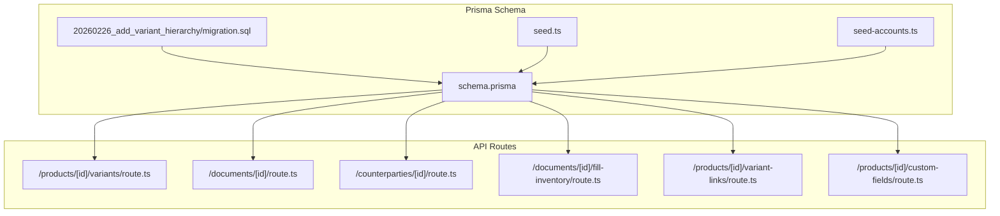
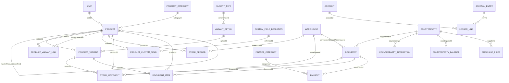
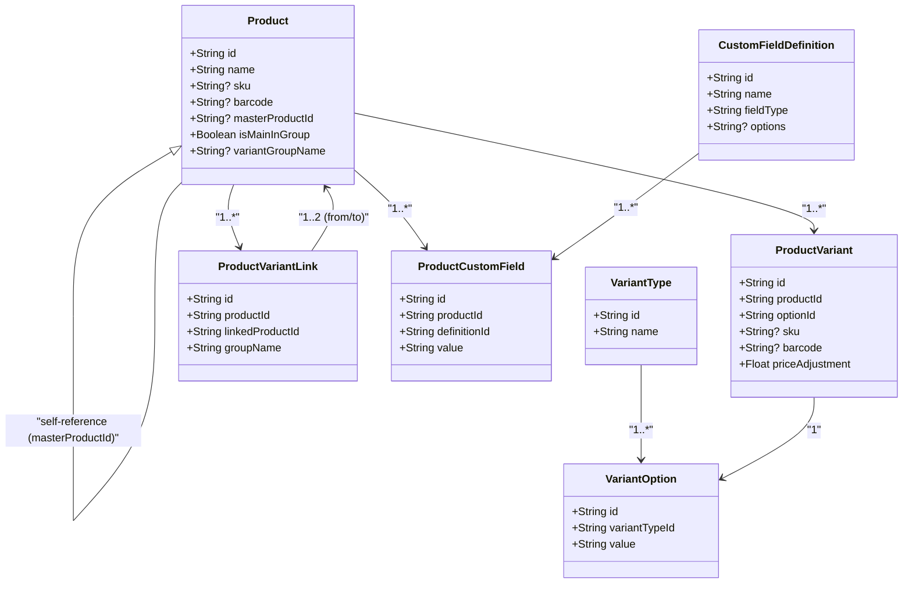
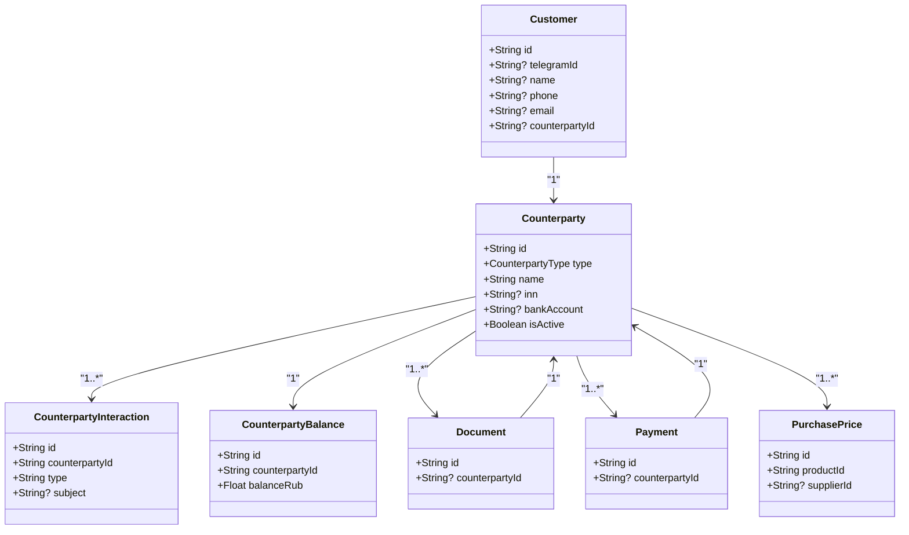
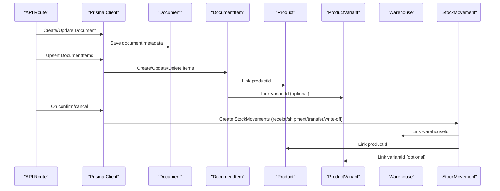
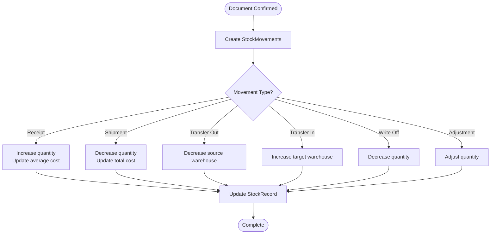
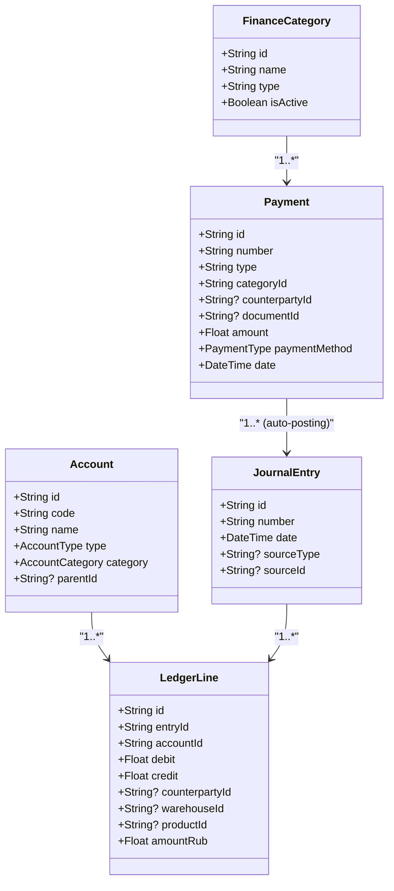
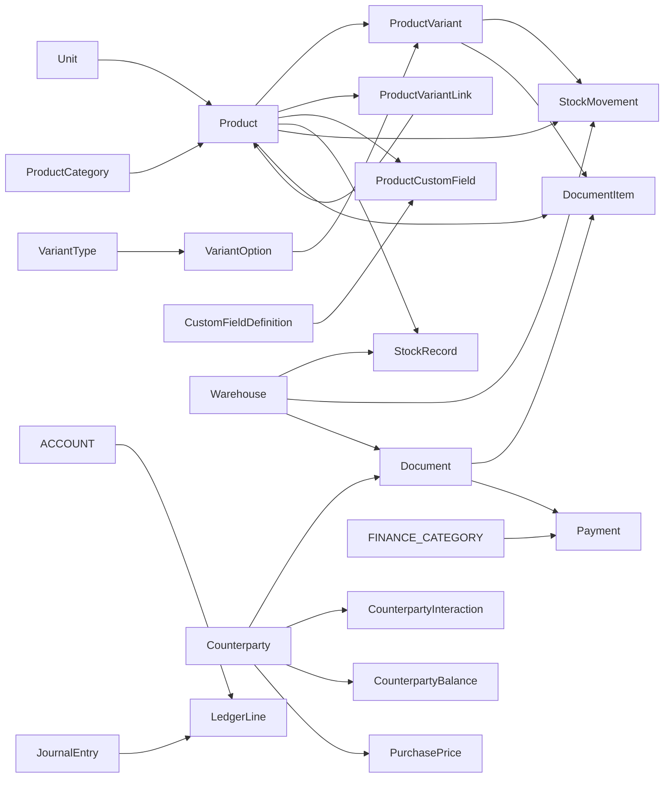

# Entity Relationships

<cite>
**Referenced Files in This Document**
- [schema.prisma](file://prisma/schema.prisma)
- [migration.sql](file://prisma/migrations/20260226_add_variant_hierarchy/migration.sql)
- [seed.ts](file://prisma/seed.ts)
- [seed-accounts.ts](file://prisma/seed-accounts.ts)
- [route.ts](file://app/api/accounting/products/[id]/variants/route.ts)
- [route.ts](file://app/api/accounting/documents/[id]/route.ts)
- [route.ts](file://app/api/accounting/counterparties/[id]/route.ts)
- [route.ts](file://app/api/accounting/documents/[id]/fill-inventory/route.ts)
- [route.ts](file://app/api/accounting/products/[id]/variant-links/route.ts)
- [route.ts](file://app/api/accounting/products/[id]/custom-fields/route.ts)
</cite>

## Table of Contents
1. [Introduction](#introduction)
2. [Project Structure](#project-structure)
3. [Core Components](#core-components)
4. [Architecture Overview](#architecture-overview)
5. [Detailed Component Analysis](#detailed-component-analysis)
6. [Dependency Analysis](#dependency-analysis)
7. [Performance Considerations](#performance-considerations)
8. [Troubleshooting Guide](#troubleshooting-guide)
9. [Conclusion](#conclusion)
10. [Appendices](#appendices)

## Introduction
This document describes the complete entity relationship model for ListOpt ERP, focusing on how data entities connect across products, counterparties, documents, stock, and variants. It covers primary/foreign keys, one-to-many and many-to-many relationships, cascade behaviors, referential integrity rules, and the complete data model structure. It also explains the product variant hierarchy, customer/supplier relationships, and the document system including DocumentItems and StockMovements.

## Project Structure
The data model is defined in the Prisma schema and enforced by PostgreSQL constraints. The application’s API routes demonstrate how entities are accessed and manipulated, providing practical context for relationships.

**Diagram sources**
- [schema.prisma](file://prisma/schema.prisma)
- [migration.sql](file://prisma/migrations/20260226_add_variant_hierarchy/migration.sql)
- [seed.ts](file://prisma/seed.ts)
- [seed-accounts.ts](file://prisma/seed-accounts.ts)
- [route.ts](file://app/api/accounting/products/[id]/variants/route.ts)
- [route.ts](file://app/api/accounting/documents/[id]/route.ts)
- [route.ts](file://app/api/accounting/counterparties/[id]/route.ts)
- [route.ts](file://app/api/accounting/documents/[id]/fill-inventory/route.ts)
- [route.ts](file://app/api/accounting/products/[id]/variant-links/route.ts)
- [route.ts](file://app/api/accounting/products/[id]/custom-fields/route.ts)

**Section sources**
- [schema.prisma](file://prisma/schema.prisma)
- [migration.sql](file://prisma/migrations/20260226_add_variant_hierarchy/migration.sql)
- [seed.ts](file://prisma/seed.ts)
- [seed-accounts.ts](file://prisma/seed-accounts.ts)

## Core Components
This section outlines the principal entities and their roles in the ERP system.

- Users: Authentication and permissions
- Units: Measurement units for products
- ProductCategory: Hierarchical product categories
- Product: Core product entity with variant support
- ProductVariant: Product modifications (size, color, etc.)
- VariantType and VariantOption: Variant taxonomy
- ProductVariantLink: Grouping of related products for e-commerce
- ProductCustomField and CustomFieldDefinition: Product characteristics
- Counterparty: Customers and suppliers
- CounterpartyInteraction and CounterpartyBalance: Interaction history and balances
- Warehouse: Storage locations
- StockRecord and StockMovement: Inventory tracking and immutable logs
- Document and DocumentItem: Business documents (orders, receipts, transfers)
- Payment and FinanceCategory: Financial transactions
- Account, JournalEntry, LedgerLine: Accounting backbone
- CompanySettings: Tax regime and account mappings
- ProcessedWebhook: Idempotent webhook handling

**Section sources**
- [schema.prisma](file://prisma/schema.prisma)

## Architecture Overview
The data model centers around Products, Counterparties, and Documents. Products are organized by Category and Units, with variant hierarchies for e-commerce. Documents drive StockMovements and connect to Products and Warehouses. Counterparties interact with Documents and Payments, tracked via Interactions and Balances.

**Diagram sources**
- [schema.prisma](file://prisma/schema.prisma)

## Detailed Component Analysis

### Product Hierarchy and Variants
Products form a hierarchical variant model:
- Master variants: A Product marked as master (via masterProductId) groups related variants.
- Child variants: Products linked to a master via masterProductId.
- Variant taxonomy: VariantType defines attributes (e.g., Size, Color), VariantOption defines values (e.g., S, M, L).
- ProductVariant: Links a Product to a VariantOption, with optional SKU/barcode overrides and price adjustments.
- ProductVariantLink: E-commerce grouping of related products under a group name; migration sets masterProductId accordingly.

**Diagram sources**
- [schema.prisma](file://prisma/schema.prisma)

Relationship cardinalities and cascade behaviors:
- Product.masterProductId -> Product: One-to-many (master to children); self-reference with cascade on update, set null on delete.
- Product -> ProductVariant: One-to-many; cascade delete on product deletion.
- VariantType -> VariantOption: One-to-many; cascade delete on type deletion.
- ProductVariant -> VariantOption: Many-to-one; cascade delete on option deletion.
- ProductVariantLink: Many-to-many via two sides (from/to); cascade delete on product deletion.
- Product -> ProductCustomField: One-to-many; cascade delete on product deletion.
- CustomFieldDefinition -> ProductCustomField: One-to-many; cascade delete on definition deletion.

**Section sources**
- [schema.prisma](file://prisma/schema.prisma)
- [migration.sql](file://prisma/migrations/20260226_add_variant_hierarchy/migration.sql)
- [route.ts](file://app/api/accounting/products/[id]/variants/route.ts)
- [route.ts](file://app/api/accounting/products/[id]/variant-links/route.ts)
- [route.ts](file://app/api/accounting/products/[id]/custom-fields/route.ts)

### Counterparty Relationships (Customers, Suppliers)
Counterparties represent both customers and suppliers. They can be linked to e-commerce customers and interacted with via interactions. Balances track financial positions.

**Diagram sources**
- [schema.prisma](file://prisma/schema.prisma)

Cardinalities and cascade behaviors:
- Counterparty -> CounterpartyInteraction: One-to-many; cascade delete on counterparty deletion.
- Counterparty -> CounterpartyBalance: One-to-one; cascade delete on counterparty deletion.
- Counterparty -> Document: One-to-many; cascade delete on counterparty deletion.
- Counterparty -> Payment: One-to-many; cascade delete on counterparty deletion.
- Counterparty -> PurchasePrice: One-to-many; cascade delete on counterparty deletion.
- Customer -> Counterparty: Many-to-one; cascade delete on counterparty deletion.

**Section sources**
- [schema.prisma](file://prisma/schema.prisma)
- [route.ts](file://app/api/accounting/counterparties/[id]/route.ts)

### Document System: Documents, Items, and Stock Movements
Documents are the core business events (receipts, shipments, transfers, payments). DocumentItems link products to documents, and StockMovements record immutable inventory changes.

**Diagram sources**
- [schema.prisma](file://prisma/schema.prisma)
- [route.ts](file://app/api/accounting/documents/[id]/route.ts)
- [route.ts](file://app/api/accounting/documents/[id]/fill-inventory/route.ts)

Cardinalities and cascade behaviors:
- Document -> DocumentItem: One-to-many; cascade delete on document deletion.
- Document -> StockMovement: One-to-many; cascade delete on document deletion.
- Document -> Warehouse (source/target): Many-to-one; restrict delete if referenced.
- Document -> Counterparty: Many-to-one; restrict delete if referenced.
- DocumentItem -> Product: Many-to-one; restrict delete if referenced.
- DocumentItem -> ProductVariant: Many-to-one; restrict delete if referenced.
- StockMovement -> Product: Many-to-one; restrict delete if referenced.
- StockMovement -> Warehouse: Many-to-one; restrict delete if referenced.
- StockMovement -> ProductVariant: Many-to-one; restrict delete if referenced.

**Section sources**
- [schema.prisma](file://prisma/schema.prisma)
- [route.ts](file://app/api/accounting/documents/[id]/route.ts)
- [route.ts](file://app/api/accounting/documents/[id]/fill-inventory/route.ts)

### Stock Records and Movements
StockRecord tracks current quantities and average costs per product per warehouse. StockMovement captures immutable inventory changes triggered by documents.

**Diagram sources**
- [schema.prisma](file://prisma/schema.prisma)

**Section sources**
- [schema.prisma](file://prisma/schema.prisma)

### Accounting and Finance Entities
FinanceCategory and Payment connect documents to accounting entries. Account, JournalEntry, and LedgerLine implement the chart of accounts and ledger posting.

**Diagram sources**
- [schema.prisma](file://prisma/schema.prisma)
- [seed-accounts.ts](file://prisma/seed-accounts.ts)

**Section sources**
- [schema.prisma](file://prisma/schema.prisma)
- [seed-accounts.ts](file://prisma/seed-accounts.ts)

## Dependency Analysis
This section maps dependencies among major entities and highlights referential integrity and cascade rules.

**Diagram sources**
- [schema.prisma](file://prisma/schema.prisma)

Key referential integrity and cascade behaviors:
- Product -> ProductVariant: onDelete Cascade
- VariantOption -> ProductVariant: onDelete Cascade
- ProductVariantLink: onDelete Cascade on either side
- ProductCustomField: onDelete Cascade
- Counterparty -> CounterpartyInteraction: onDelete Cascade
- Counterparty -> CounterpartyBalance: onDelete Cascade
- Counterparty -> PurchasePrice: onDelete Cascade
- Document -> DocumentItem: onDelete Cascade
- Document -> StockMovement: onDelete Cascade
- Document -> Payment: onDelete Restrict (payments may reference documents)
- Document -> Warehouse: onDelete Restrict
- Document -> Counterparty: onDelete Restrict
- StockMovement -> Product/Warehouse/ProductVariant: onDelete Restrict
- FinanceCategory -> Payment: onDelete Restrict
- Account -> LedgerLine: onDelete Restrict
- JournalEntry -> LedgerLine: onDelete Cascade

**Section sources**
- [schema.prisma](file://prisma/schema.prisma)

## Performance Considerations
- Indexes: The schema includes numerous indexes on frequently queried columns (e.g., Product.categoryId, Product.masterProductId, Document.number, StockMovement.productId/warehouseId). These improve query performance for filtering and joins.
- Unique constraints: Unique indexes on Unit.shortName, Product.sku/barcode, ProductVariantLink(productId, linkedProductId), and others prevent duplicates and speed up lookups.
- Cascade deletes: While convenient, cascading deletes on large datasets can be expensive. Consider batching or background jobs for mass deletions.
- Denormalization: StockRecord stores averageCost and totalCostValue to avoid recalculating on reads, trading storage for performance.

[No sources needed since this section provides general guidance]

## Troubleshooting Guide
Common issues and resolutions:
- Deleting a Product fails due to foreign keys: Ensure no active StockMovements, DocumentItems, or ProductVariants remain. Use cascade-safe deletion paths or soft-delete patterns.
- Variant creation errors: Verify the VariantOption belongs to the correct VariantType and that the Product exists.
- Document updates blocked: Only draft documents can be edited; confirm the document status before attempting edits.
- Inventory fill errors: Inventory_count documents must be drafts and must specify a warehouse; ensure stock records exist for the warehouse.
- Counterparty deletion: If deletion fails, deactivate the counterparty instead of deleting to preserve historical documents.

**Section sources**
- [route.ts](file://app/api/accounting/products/[id]/variants/route.ts)
- [route.ts](file://app/api/accounting/documents/[id]/route.ts)
- [route.ts](file://app/api/accounting/documents/[id]/fill-inventory/route.ts)
- [route.ts](file://app/api/accounting/counterparties/[id]/route.ts)

## Conclusion
ListOpt ERP’s entity model emphasizes flexible product variants, robust document-driven inventory tracking, and integrated counterparty management. The schema enforces referential integrity with carefully chosen cascade behaviors, while indexes and unique constraints optimize common queries. The accounting module integrates seamlessly with documents and payments, enabling accurate financial reporting.

[No sources needed since this section summarizes without analyzing specific files]

## Appendices

### Appendix A: Product Variant Hierarchy Evolution
The variant hierarchy was introduced via a migration that:
- Added masterProductId, isMainInGroup, and variantGroupName to Product.
- Created a self-referencing foreign key with set null on delete and cascade on update.
- Indexed the new columns for efficient queries.
- Migrated existing ProductVariantLink entries to set masterProductId and mark isMainInGroup.

**Section sources**
- [migration.sql](file://prisma/migrations/20260226_add_variant_hierarchy/migration.sql)

### Appendix B: Initial Data Seeding
The seed scripts initialize:
- Default measurement units
- A default warehouse
- Document counters for all document types
- An admin user
- System finance categories
- Payment counter
- Chart of accounts with parent-child relationships and analytics types
- Default company settings with mapped accounts

**Section sources**
- [seed.ts](file://prisma/seed.ts)
- [seed-accounts.ts](file://prisma/seed-accounts.ts)