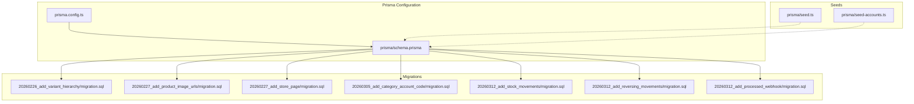
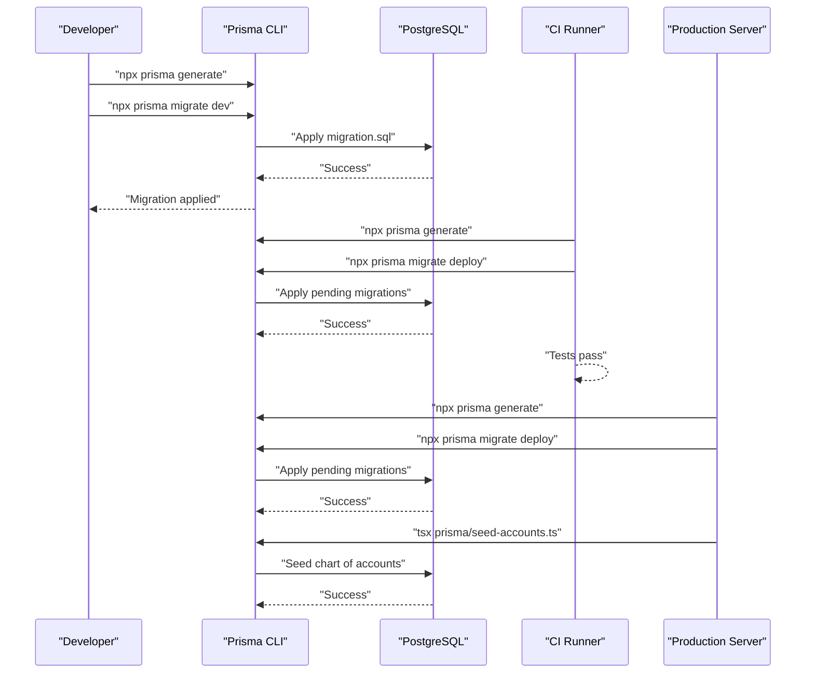
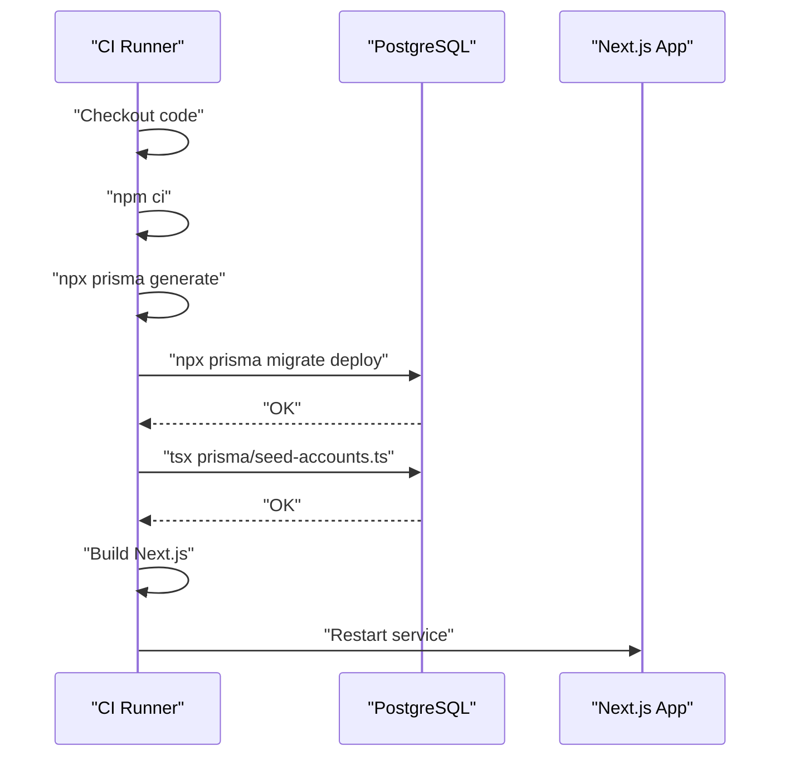
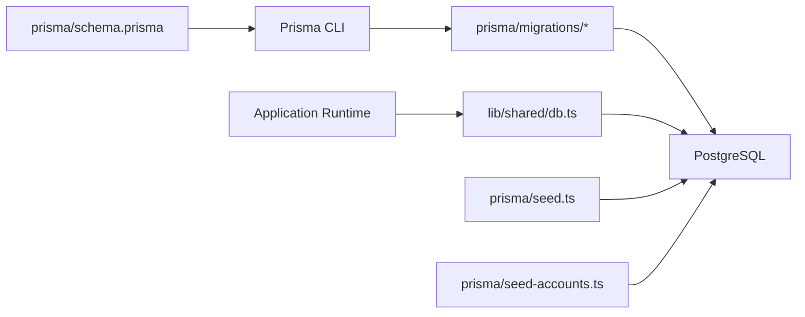
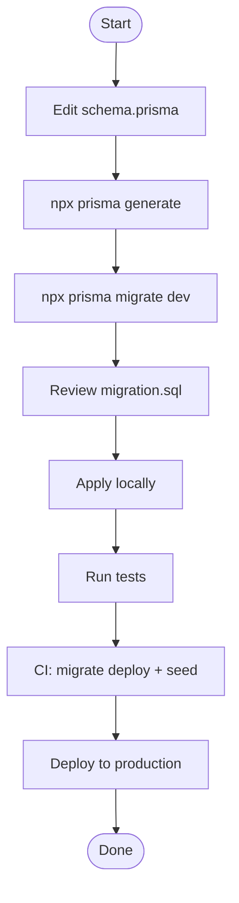

# Migration Management

<cite>
**Referenced Files in This Document**
- [schema.prisma](file://prisma/schema.prisma)
- [prisma.config.ts](file://prisma.config.ts)
- [package.json](file://package.json)
- [ci.yml](file://.github/workflows/ci.yml)
- [README.md](file://README.md)
- [20260226_add_variant_hierarchy/migration.sql](file://prisma/migrations/20260226_add_variant_hierarchy/migration.sql)
- [20260227_add_product_image_urls/migration.sql](file://prisma/migrations/20260227_add_product_image_urls/migration.sql)
- [20260227_add_store_page/migration.sql](file://prisma/migrations/20260227_add_store_page/migration.sql)
- [20260305_add_category_account_code/migration.sql](file://prisma/migrations/20260305_add_category_account_code/migration.sql)
- [20260312_add_processed_webhook/migration.sql](file://prisma/migrations/20260312_add_processed_webhook/migration.sql)
- [20260312_add_stock_movements/migration.sql](file://prisma/migrations/20260312_add_stock_movements/migration.sql)
- [20260312_add_reversing_movements/migration.sql](file://prisma/migrations/20260312_add_reversing_movements/migration.sql)
- [seed.ts](file://prisma/seed.ts)
- [seed-accounts.ts](file://prisma/seed-accounts.ts)
- [db.ts](file://lib/shared/db.ts)
- [webhook-idempotency.ts](file://lib/shared/webhook-idempotency.ts)
- [stock-movements.ts](file://lib/modules/accounting/stock-movements.ts)
- [stock-movements.integration.test.ts](file://tests/integration/documents/stock-movements.integration.test.ts)
- [database.fixture.ts](file://tests/e2e/fixtures/database.fixture.ts)
</cite>

## Table of Contents
1. [Introduction](#introduction)
2. [Project Structure](#project-structure)
3. [Core Components](#core-components)
4. [Architecture Overview](#architecture-overview)
5. [Detailed Component Analysis](#detailed-component-analysis)
6. [Dependency Analysis](#dependency-analysis)
7. [Performance Considerations](#performance-considerations)
8. [Troubleshooting Guide](#troubleshooting-guide)
9. [Conclusion](#conclusion)
10. [Appendices](#appendices)

## Introduction
This document explains how ListOpt ERP manages database evolution using Prisma. It covers migration file structure, naming conventions, execution order, and the complete migration history from initial setup to the current state. It also provides practical guidance for creating new migrations, handling schema changes, managing conflicts, rolling back safely, backing up data, and deploying to production. Best practices for testing, preserving data during schema changes, handling breaking changes, versioning, team collaboration, and automating migrations in CI/CD are included.

## Project Structure
Prisma migrations live under prisma/migrations with one folder per migration. Each migration folder contains a migration.sql script that applies the change. The Prisma configuration defines the schema location, migration directory, and seeding command. The repository also includes seed scripts for initial data and Russian Chart of Accounts.

**Diagram sources**
- [prisma.config.ts:1-16](file://prisma.config.ts#L1-L16)
- [schema.prisma:1-1067](file://prisma/schema.prisma#L1-L1067)
- [20260226_add_variant_hierarchy/migration.sql:1-34](file://prisma/migrations/20260226_add_variant_hierarchy/migration.sql#L1-L34)
- [20260227_add_product_image_urls/migration.sql:1-13](file://prisma/migrations/20260227_add_product_image_urls/migration.sql#L1-L13)
- [20260227_add_store_page/migration.sql:1-30](file://prisma/migrations/20260227_add_store_page/migration.sql#L1-L30)
- [20260305_add_category_account_code/migration.sql:1-3](file://prisma/migrations/20260305_add_category_account_code/migration.sql#L1-L3)
- [20260312_add_stock_movements/migration.sql:1-62](file://prisma/migrations/20260312_add_stock_movements/migration.sql#L1-L62)
- [20260312_add_reversing_movements/migration.sql:1-22](file://prisma/migrations/20260312_add_reversing_movements/migration.sql#L1-L22)
- [20260312_add_processed_webhook/migration.sql:1-17](file://prisma/migrations/20260312_add_processed_webhook/migration.sql#L1-L17)
- [seed.ts:1-120](file://prisma/seed.ts#L1-L120)
- [seed-accounts.ts:1-216](file://prisma/seed-accounts.ts#L1-L216)

**Section sources**
- [prisma.config.ts:1-16](file://prisma.config.ts#L1-L16)
- [schema.prisma:1-1067](file://prisma/schema.prisma#L1-L1067)

## Core Components
- Prisma schema: Defines models, enums, relations, indexes, and directives. It is the single source of truth for the database structure.
- Migration files: SQL scripts inside prisma/migrations/<timestamp>_<description>/migration.sql that apply incremental changes.
- Prisma configuration: Points to schema.prisma, sets migration directory, and seeds via a script.
- Seed scripts: Initialize default units, warehouses, document counters, admin user, finance categories, and Chart of Accounts.
- Runtime database client: Uses PrismaPg adapter with a connection pool for production.

Key responsibilities:
- schema.prisma: Model definitions and constraints.
- migration.sql: DDL changes, indexes, and data conversions.
- prisma.config.ts: Centralizes Prisma configuration and datasource URL resolution.
- seed.ts and seed-accounts.ts: Non-business data initialization for development and production bootstrap.
- lib/shared/db.ts: Creates a singleton Prisma client with PrismaPg adapter.

**Section sources**
- [schema.prisma:1-1067](file://prisma/schema.prisma#L1-L1067)
- [prisma.config.ts:1-16](file://prisma.config.ts#L1-L16)
- [seed.ts:1-120](file://prisma/seed.ts#L1-L120)
- [seed-accounts.ts:1-216](file://prisma/seed-accounts.ts#L1-L216)
- [db.ts:1-24](file://lib/shared/db.ts#L1-L24)

## Architecture Overview
The migration lifecycle integrates Prisma’s CLI commands, CI/CD automation, and runtime database access.

**Diagram sources**
- [ci.yml:62-67](file://.github/workflows/ci.yml#L62-L67)
- [ci.yml:134-137](file://.github/workflows/ci.yml#L134-L137)
- [package.json:22-26](file://package.json#L22-L26)
- [prisma.config.ts:1-16](file://prisma.config.ts#L1-L16)

## Detailed Component Analysis

### Migration File Structure and Naming Conventions
- Location: prisma/migrations/<timestamp>_<description>/
- File: migration.sql inside each folder
- Timestamp convention: YYYYMMDD_<sequential_number> to guarantee deterministic order
- Description: concise, hyphenated summary of the change (e.g., add_variant_hierarchy)
- Execution order: lexicographic by folder name; Prisma applies them in sequence

Examples:
- 20260226_add_variant_hierarchy
- 20260227_add_product_image_urls
- 20260227_add_store_page
- 20260305_add_category_account_code
- 20260312_add_stock_movements
- 20260312_add_reversing_movements
- 20260312_add_processed_webhook

**Section sources**
- [20260226_add_variant_hierarchy/migration.sql:1-34](file://prisma/migrations/20260226_add_variant_hierarchy/migration.sql#L1-L34)
- [20260227_add_product_image_urls/migration.sql:1-13](file://prisma/migrations/20260227_add_product_image_urls/migration.sql#L1-L13)
- [20260227_add_store_page/migration.sql:1-30](file://prisma/migrations/20260227_add_store_page/migration.sql#L1-L30)
- [20260305_add_category_account_code/migration.sql:1-3](file://prisma/migrations/20260305_add_category_account_code/migration.sql#L1-L3)
- [20260312_add_stock_movements/migration.sql:1-62](file://prisma/migrations/20260312_add_stock_movements/migration.sql#L1-L62)
- [20260312_add_reversing_movements/migration.sql:1-22](file://prisma/migrations/20260312_add_reversing_movements/migration.sql#L1-L22)
- [20260312_add_processed_webhook/migration.sql:1-17](file://prisma/migrations/20260312_add_processed_webhook/migration.sql#L1-L17)

### Migration History and Purpose
Below is the migration history from initial setup through the current state, with purpose and changes summarized.

- 20260226_add_variant_hierarchy
  - Purpose: Enable e-commerce variant grouping and master-product relationships.
  - Changes: Added masterProductId, isMainInGroup, variantGroupName to Product; self-referencing foreign key; indexes; data conversion from ProductVariantLink to masterProductId; set isMainInGroup for masters.

- 20260227_add_product_image_urls
  - Purpose: Support multiple product images.
  - Changes: Added imageUrls JSONB array; populated from existing imageUrl.

- 20260227_add_store_page
  - Purpose: Add CMS pages for the store.
  - Changes: Created StorePage table with indexes on slug and publication/order.

- 20260305_add_category_account_code
  - Purpose: Link finance categories to default account codes.
  - Changes: Added defaultAccountCode to FinanceCategory.

- 20260312_add_stock_movements
  - Purpose: Introduce immutable stock movement audit log with idempotency guarantees.
  - Changes: Created MovementType enum; added adjustmentsCreated to Document; created StockMovement table with indexes and foreign keys; added unique indexes per document/product/warehouse/type (with/without variant); added foreign keys to Document/Product/Warehouse/ProductVariant.

- 20260312_add_reversing_movements
  - Purpose: Support idempotent cancellation by creating reversing movements.
  - Changes: Added isReversing and reversesDocumentId to StockMovement; dropped old unique indexes; recreated unique indexes including isReversing; ensured idempotency for inventory adjustments.

- 20260312_add_processed_webhook
  - Purpose: Prevent duplicate webhook processing.
  - Changes: Created ProcessedWebhook table with unique index on (source, externalId) and index on (source, processedAt).

**Section sources**
- [20260226_add_variant_hierarchy/migration.sql:1-34](file://prisma/migrations/20260226_add_variant_hierarchy/migration.sql#L1-L34)
- [20260227_add_product_image_urls/migration.sql:1-13](file://prisma/migrations/20260227_add_product_image_urls/migration.sql#L1-L13)
- [20260227_add_store_page/migration.sql:1-30](file://prisma/migrations/20260227_add_store_page/migration.sql#L1-L30)
- [20260305_add_category_account_code/migration.sql:1-3](file://prisma/migrations/20260305_add_category_account_code/migration.sql#L1-L3)
- [20260312_add_stock_movements/migration.sql:1-62](file://prisma/migrations/20260312_add_stock_movements/migration.sql#L1-L62)
- [20260312_add_reversing_movements/migration.sql:1-22](file://prisma/migrations/20260312_add_reversing_movements/migration.sql#L1-L22)
- [20260312_add_processed_webhook/migration.sql:1-17](file://prisma/migrations/20260312_add_processed_webhook/migration.sql#L1-L17)

### Creating New Migrations
Recommended workflow:
- Edit prisma/schema.prisma to define or modify models, enums, relations, and indexes.
- Run the Prisma CLI to generate client and create a migration:
  - Generate client: npx prisma generate
  - Create migration: npx prisma migrate dev
- Prisma generates a new folder under prisma/migrations with a timestamped name and a migration.sql script.
- Review and refine migration.sql for correctness, idempotency, and performance.
- Commit both schema.prisma and the new migration folder.

Best practices:
- Keep migrations small and focused.
- Add indexes alongside schema changes.
- Use data migration steps when transforming existing data.
- Avoid destructive operations; prefer adding columns and updating defaults.

**Section sources**
- [prisma.config.ts:1-16](file://prisma.config.ts#L1-L16)
- [package.json:22-26](file://package.json#L22-L26)

### Handling Schema Changes and Breaking Changes
- Use additive-only changes when possible (add columns, indexes, enums).
- For nullable-to-not-null changes, provide defaults or migrate data first.
- For renaming or dropping columns/tables, split into multiple migrations: deprecate old fields, update application logic, then drop.
- Use enums carefully; prefer explicit values and defaults to avoid breaking downstream code.

**Section sources**
- [schema.prisma:1-1067](file://prisma/schema.prisma#L1-L1067)

### Managing Migration Conflicts
- Team workflow:
  - Always run npx prisma generate and npx prisma migrate dev locally before pushing.
  - Merge conflicts in schema.prisma by reconciling model definitions; resolve migration order by adjusting timestamps if necessary.
  - Keep migration.sql immutable once applied; do not edit past migrations.
- If conflicts arise in CI:
  - Rebase onto main and regenerate migrations.
  - Ensure DATABASE_URL points to the test database in CI.

**Section sources**
- [ci.yml:62-67](file://.github/workflows/ci.yml#L62-L67)
- [README.md:145-155](file://README.md#L145-L155)

### Rollback Procedures
- Development: Use prisma migrate resolve with --rejected to mark failed migrations as rejected; re-apply corrected migrations.
- Staging/Production: Prefer forward-compatible migrations. If absolutely necessary, create a corrective migration that undoes or compensates for prior changes.
- Never manually edit the _prisma_migrations table; rely on Prisma CLI.

**Section sources**
- [package.json:22-26](file://package.json#L22-L26)

### Backup Strategies
- Pre-deploy backups: Back up the production database immediately before applying migrations.
- Post-deploy verification: Run targeted queries to validate data integrity and indexes.
- Seed safety: Seed scripts are idempotent via upserts; still verify against a backup.

**Section sources**
- [seed.ts:1-120](file://prisma/seed.ts#L1-L120)
- [seed-accounts.ts:1-216](file://prisma/seed-accounts.ts#L1-L216)

### Production Deployment Considerations
- CI/CD pipeline:
  - Generate Prisma client and apply migrations using migrate deploy.
  - Seed Chart of Accounts after migrations.
- Environment variables:
  - DATABASE_URL must be set in production.
- Process manager:
  - Restart the application after migrations succeed.

**Diagram sources**
- [ci.yml:134-137](file://.github/workflows/ci.yml#L134-L137)

**Section sources**
- [ci.yml:134-137](file://.github/workflows/ci.yml#L134-L137)
- [db.ts:1-24](file://lib/shared/db.ts#L1-L24)

### Migration Testing and Data Preservation
- Unit and integration tests validate idempotency and invariants:
  - Stock movement idempotency and reversal logic.
  - Consistency between movements and StockRecord quantities.
- E2E fixtures demonstrate raw SQL inserts for controlled test scenarios.
- Best practices:
  - Test migrations on a staging copy of production data.
  - Verify indexes and unique constraints after migration.
  - Preserve data by avoiding destructive operations; use defaults and data transforms.

**Section sources**
- [stock-movements.integration.test.ts:213-241](file://tests/integration/documents/stock-movements.integration.test.ts#L213-L241)
- [database.fixture.ts:54-100](file://tests/e2e/fixtures/database.fixture.ts#L54-L100)

### Versioning and Team Collaboration
- Versioning:
  - Use timestamped folders to enforce order.
  - Keep schema.prisma as the source of truth; migrations derive from it.
- Collaboration:
  - One developer per feature branch; merge frequently.
  - Run prisma generate and migrate dev before opening PRs.
  - Review migration.sql for correctness and performance.

**Section sources**
- [prisma.config.ts:1-16](file://prisma.config.ts#L1-L16)
- [package.json:22-26](file://package.json#L22-L26)

### Automated Migration Execution in CI/CD
- CI jobs:
  - Generate Prisma client.
  - Push schema to test database.
  - Run linters, unit, integration, and E2E tests.
- Production:
  - Deploy archive, install dependencies, generate client, apply migrations, seed accounts, build, and restart.

**Section sources**
- [ci.yml:62-67](file://.github/workflows/ci.yml#L62-L67)
- [ci.yml:134-137](file://.github/workflows/ci.yml#L134-L137)

## Dependency Analysis
The migration system depends on Prisma’s CLI, PostgreSQL, and the application’s runtime client. The runtime uses PrismaPg adapter for production.

**Diagram sources**
- [schema.prisma:1-1067](file://prisma/schema.prisma#L1-L1067)
- [prisma.config.ts:1-16](file://prisma.config.ts#L1-L16)
- [db.ts:1-24](file://lib/shared/db.ts#L1-L24)
- [seed.ts:1-120](file://prisma/seed.ts#L1-L120)
- [seed-accounts.ts:1-216](file://prisma/seed-accounts.ts#L1-L216)

**Section sources**
- [schema.prisma:1-1067](file://prisma/schema.prisma#L1-L1067)
- [prisma.config.ts:1-16](file://prisma.config.ts#L1-L16)
- [db.ts:1-24](file://lib/shared/db.ts#L1-L24)

## Performance Considerations
- Indexes: Add indexes alongside schema changes to maintain query performance.
- Idempotency: Unique indexes on (document, product, warehouse, type, isReversing) prevent duplicate stock movements.
- Data volume: For large datasets, consider batched data migrations and background jobs.
- CI database: Use a dedicated test database with health checks to avoid flaky runs.

[No sources needed since this section provides general guidance]

## Troubleshooting Guide
Common issues and resolutions:
- Migration fails due to existing data:
  - Add defaults or pre-populate values in migration.sql.
  - Split into multiple migrations: add column, transform data, then enforce constraints.
- CI “db push” vs migrations:
  - Replace prisma db push with prisma migrate deploy in CI to preserve data.
- Webhook duplicates:
  - Use ProcessedWebhook model and idempotency helpers to guard handlers.

**Section sources**
- [20260312_add_processed_webhook/migration.sql:1-17](file://prisma/migrations/20260312_add_processed_webhook/migration.sql#L1-L17)
- [webhook-idempotency.ts:1-59](file://lib/shared/webhook-idempotency.ts#L1-L59)
- [ci.yml:62-67](file://.github/workflows/ci.yml#L62-L67)

## Conclusion
ListOpt ERP’s migration management relies on Prisma’s declarative schema and deterministic SQL migrations. By following the naming conventions, keeping migrations additive, testing rigorously, and automating deployment, teams can evolve the database safely and collaboratively. Use the provided scripts and CI steps to maintain reliability across environments.

[No sources needed since this section summarizes without analyzing specific files]

## Appendices

### Appendix A: Migration Execution Commands
- Generate Prisma client: npx prisma generate
- Create and apply migrations: npx prisma migrate dev
- Apply migrations in CI/production: npx prisma migrate deploy
- Seed data: npx tsx prisma/seed.ts or prisma/seed-accounts.ts

**Section sources**
- [package.json:22-26](file://package.json#L22-L26)
- [ci.yml:134-137](file://.github/workflows/ci.yml#L134-L137)

### Appendix B: Example Migration Flow

**Diagram sources**
- [package.json:22-26](file://package.json#L22-L26)
- [ci.yml:134-137](file://.github/workflows/ci.yml#L134-L137)