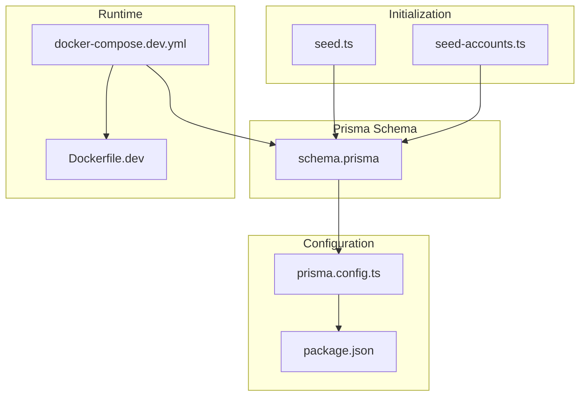
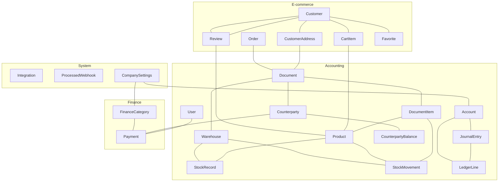
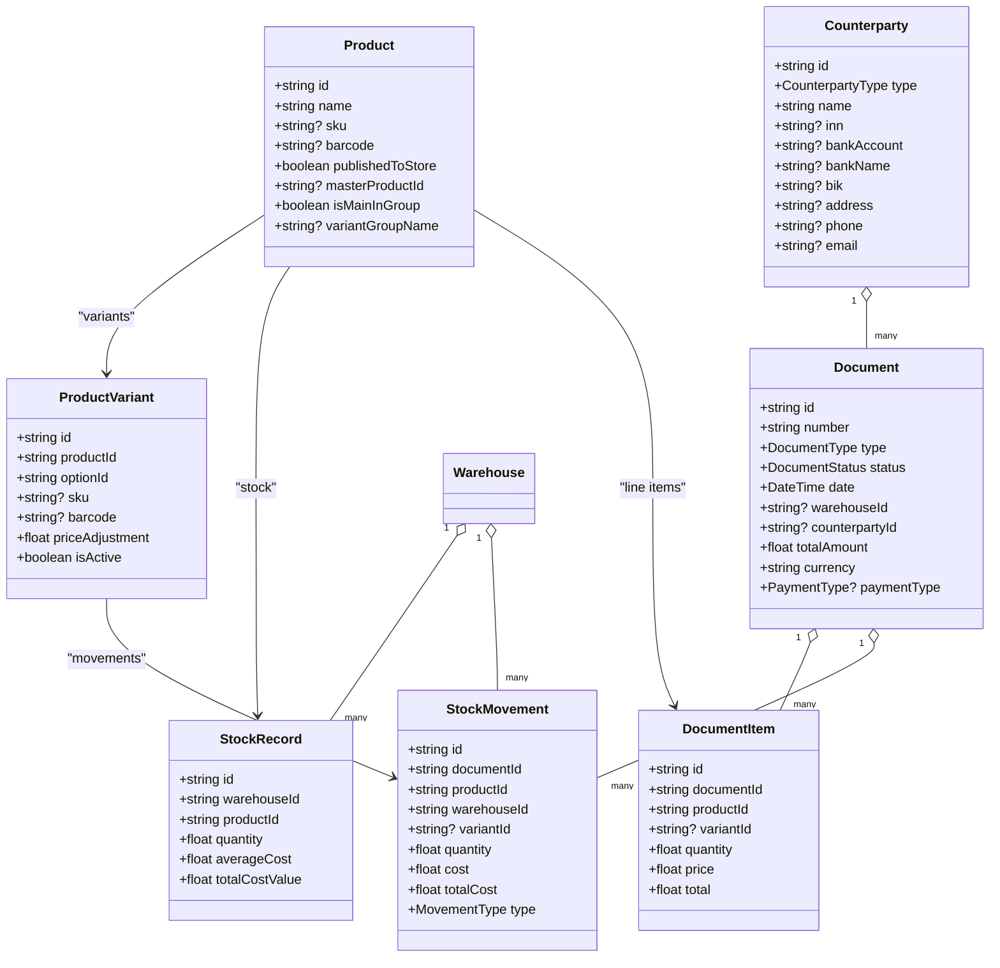
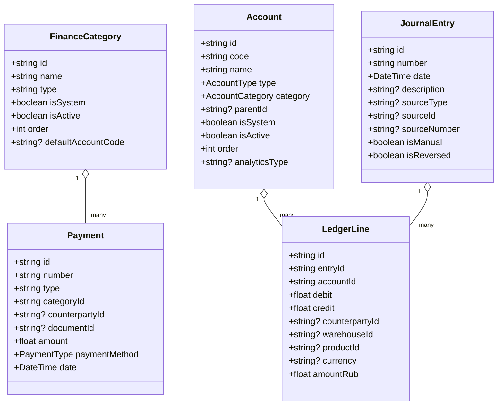
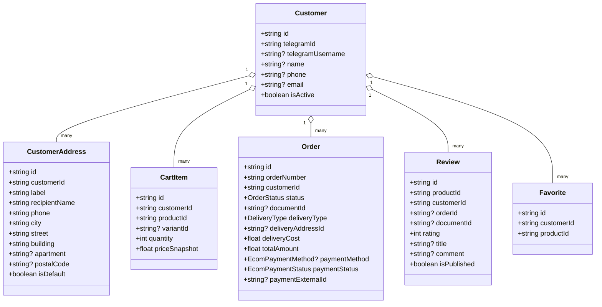
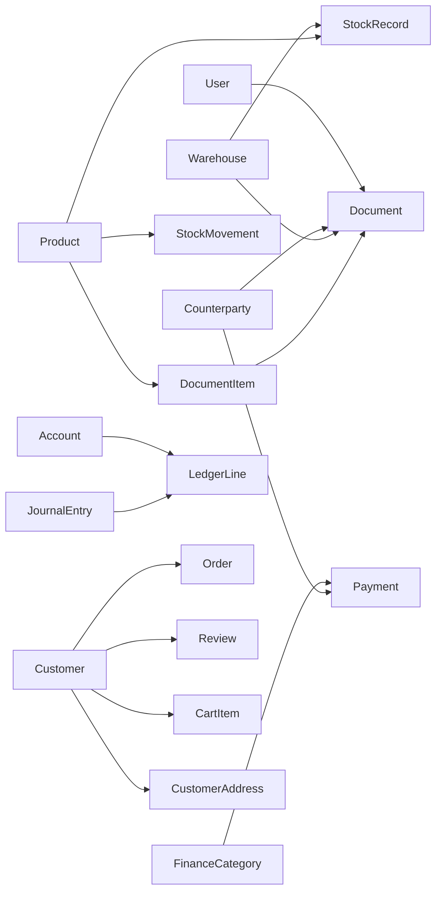

# Schema Overview

<cite>
**Referenced Files in This Document**
- [schema.prisma](file://prisma/schema.prisma)
- [prisma.config.ts](file://prisma.config.ts)
- [package.json](file://package.json)
- [seed.ts](file://prisma/seed.ts)
- [seed-accounts.ts](file://prisma/seed-accounts.ts)
- [docker-compose.dev.yml](file://docker-compose.dev.yml)
- [Dockerfile.dev](file://Dockerfile.dev)
- [README.md](file://README.md)
- [ARCHITECTURE.md](file://ARCHITECTURE.md)
</cite>

## Table of Contents
1. [Introduction](#introduction)
2. [Project Structure](#project-structure)
3. [Core Components](#core-components)
4. [Architecture Overview](#architecture-overview)
5. [Detailed Component Analysis](#detailed-component-analysis)
6. [Dependency Analysis](#dependency-analysis)
7. [Performance Considerations](#performance-considerations)
8. [Troubleshooting Guide](#troubleshooting-guide)
9. [Conclusion](#conclusion)

## Introduction
This document provides a comprehensive schema overview for the ListOpt ERP database design. It explains the overall database architecture, including the separation between accounting, finance, and e-commerce domains. It documents the Prisma schema structure, generator configuration, and datasource setup. It details the enum definitions for DocumentType, DocumentStatus, CounterpartyType, and other core business enums. It explains the role-based access control through the ErpRole enum and how it integrates with the User model. It includes high-level entity relationship diagrams showing the main domain boundaries and their interactions. Finally, it documents the database provider configuration and connection setup.

## Project Structure
The database schema is defined centrally in the Prisma schema file and complemented by configuration and seeding scripts. The project follows a modular architecture with distinct domains:
- Accounting: Catalog, stock, documents, counterparties, pricing, and chart of accounts
- Finance: Payments, categories, and ledger entries
- E-commerce: Customers, orders, cart, reviews, favorites, and CMS pages
- Integrations: External API connections
- Company settings: Tax regime, account mappings, and fiscal year configuration

**Diagram sources**
- [schema.prisma](file://prisma/schema.prisma)
- [prisma.config.ts](file://prisma.config.ts)
- [package.json](file://package.json)
- [seed.ts](file://prisma/seed.ts)
- [seed-accounts.ts](file://prisma/seed-accounts.ts)
- [docker-compose.dev.yml](file://docker-compose.dev.yml)
- [Dockerfile.dev](file://Dockerfile.dev)

**Section sources**
- [ARCHITECTURE.md](file://ARCHITECTURE.md)
- [README.md](file://README.md)

## Core Components
This section outlines the primary database components and their responsibilities across the three main domains.

- Authentication and Authorization
  - ErpRole enum defines administrative roles with granular permissions
  - User model stores credentials, role assignment, and activity status

- Business Enums
  - DocumentStatus: lifecycle states for documents
  - DocumentType: categorization of stock, purchase, sales, and finance operations
  - PaymentType: payment methods
  - CounterpartyType: customer/supplier classification
  - Additional enums for e-commerce and finance domains

- Reference Data
  - Unit: measurement units for products
  - ProductCategory: hierarchical categories for product organization
  - Product: product master records with SEO and e-commerce publishing fields
  - CustomFieldDefinition and ProductCustomField: flexible product characteristics
  - VariantType and VariantOption: variant groups and options
  - ProductVariant: variant records with SKU/barcode overrides and pricing adjustments
  - ProductDiscount: discount rules for products
  - SkuCounter: auto-generated SKU numbering
  - ProductVariantLink: grouping variants for website presentation

- Counterparties and Balances
  - Counterparty: customers and suppliers with legal and banking details
  - CounterpartyInteraction: interaction history
  - CounterpartyBalance: aggregated financial position

- Warehouses and Stock
  - Warehouse: storage locations
  - StockRecord: current quantities and average costs per product/warehouse
  - StockMovement: immutable audit trail of stock changes

- Documents and Items
  - DocumentCounter: numbering prefixes for document types
  - Document: header-level record linking to counterparties, warehouses, and e-commerce orders
  - DocumentItem: line items with quantities, prices, and inventory tracking

- Pricing
  - PriceList: named pricing catalogs
  - PurchasePrice and SalePrice: price records with validity periods

- E-commerce Domain
  - Customer: e-commerce user with Telegram identity
  - CustomerAddress: delivery addresses
  - CartItem: shopping cart entries
  - Order and OrderItem: legacy order model
  - Review and Favorite: customer feedback and preferences
  - PromoBlock: promotional content blocks
  - OrderCounter: order numbering
  - StorePage: CMS-style pages

- Finance Domain
  - FinanceCategory: income/expense categories with system defaults
  - PaymentCounter: payment numbering
  - Payment: financial transactions linked to categories and counterparties
  - Account: chart of accounts with hierarchical structure and analytics support
  - JournalEntry and LedgerLine: double-entry bookkeeping with reversal support
  - JournalCounter: journal numbering

- Company Settings
  - CompanySettings: tax regime, VAT rates, account mappings, and fiscal year configuration

- Integrations and System
  - Integration: external service configurations
  - ProcessedWebhook: idempotent webhook handling

**Section sources**
- [schema.prisma](file://prisma/schema.prisma)

## Architecture Overview
The database architecture separates concerns into three primary domains while enabling cross-domain relationships:
- Accounting domain: product catalog, stock, documents, counterparties, and chart of accounts
- Finance domain: payments, categories, and ledger entries
- E-commerce domain: customers, orders, cart, reviews, and CMS pages

**Diagram sources**
- [schema.prisma](file://prisma/schema.prisma)

## Detailed Component Analysis

### Prisma Schema Structure and Generator Configuration
- Generator client
  - Provider: prisma-client
  - Output: ../lib/generated/prisma
- Datasource db
  - Provider: postgresql

These settings define the ORM client generation and the database provider used by the application.

**Section sources**
- [schema.prisma](file://prisma/schema.prisma)

### Datasource Setup and Connection
- Prisma configuration
  - Schema path: prisma/schema.prisma
  - Migrations path: prisma/migrations
  - Seed command: npx tsx prisma/seed.ts
  - Datasource URL resolution:
    - Production: DATABASE_URL environment variable
    - Development: SQLite file at prisma/dev.db if DATABASE_URL is not set
- Docker Compose
  - PostgreSQL service configured with environment variables
  - Application service sets DATABASE_URL to PostgreSQL connection string
- Package scripts
  - db:generate, db:push, db:migrate, db:seed, db:studio

This setup enables seamless development with local SQLite and production deployment with PostgreSQL.

**Section sources**
- [prisma.config.ts](file://prisma.config.ts)
- [docker-compose.dev.yml](file://docker-compose.dev.yml)
- [package.json](file://package.json)

### Role-Based Access Control (RBAC) via ErpRole
- ErpRole enum values:
  - admin: Full ERP access, user management
  - manager: CRUD for products, counterparties, warehouses, pricing
  - accountant: Pricing and documents write; rest read
  - viewer: Read-only
- User model
  - Fields: id, username, password (hashed), email, role, isActive, timestamps
  - Index on isActive for efficient filtering

RBAC integrates with API routes and authorization utilities to enforce permissions across modules.

**Section sources**
- [schema.prisma](file://prisma/schema.prisma)

### Core Business Enums
- DocumentStatus
  - draft, confirmed, shipped, delivered, cancelled
- DocumentType
  - Stock operations: stock_receipt, write_off, stock_transfer, inventory_count
  - Purchases: purchase_order, incoming_shipment, supplier_return
  - Sales: sales_order, outgoing_shipment, customer_return
  - Finance: incoming_payment, outgoing_payment
- PaymentType
  - cash, bank_transfer, card
- CounterpartyType
  - customer, supplier, both
- Additional enums
  - DiscountType: percentage, fixed
  - MovementType: receipt, write_off, shipment, return, transfer_out, transfer_in, adjustment
  - OrderStatus, DeliveryType, EcomPaymentMethod, EcomPaymentStatus
  - AccountType, AccountCategory
  - TaxRegime: osno, usn_income, usn_income_expense, patent

These enums standardize business semantics and enable consistent validation and reporting.

**Section sources**
- [schema.prisma](file://prisma/schema.prisma)

### Accounting Domain Entities
- Product hierarchy and variants
  - Product with SEO fields, e-commerce publishing flag, variant grouping
  - ProductVariant with SKU/barcode overrides and price adjustments
  - ProductVariantLink for grouping variants on the website
- Stock and movements
  - StockRecord tracks quantities and average costs per product/warehouse
  - StockMovement logs immutable stock changes with movement types
- Documents and counterparties
  - Document links to counterparties, warehouses, and e-commerce orders
  - DocumentItem captures line items with inventory tracking
  - Counterparty with legal details and balances

**Diagram sources**
- [schema.prisma](file://prisma/schema.prisma)

**Section sources**
- [schema.prisma](file://prisma/schema.prisma)

### Finance Domain Entities
- FinanceCategory
  - Income/expense categories with system defaults and ordering
- Payment
  - Financial transactions linked to categories, counterparties, and documents
- Chart of Accounts
  - Hierarchical accounts with analytics support and system defaults
- Ledger and Journal Entries
  - Double-entry bookkeeping with reversal support

**Diagram sources**
- [schema.prisma](file://prisma/schema.prisma)

**Section sources**
- [schema.prisma](file://prisma/schema.prisma)

### E-commerce Domain Entities
- Customer and Addresses
  - Telegram identity, contact details, and delivery addresses
- Cart and Orders
  - CartItem entries and legacy Order model with e-commerce attributes
- Reviews and Favorites
  - Customer feedback and preferences
- Promotional Content and CMS Pages
  - PromoBlock and StorePage for marketing and content management

**Diagram sources**
- [schema.prisma](file://prisma/schema.prisma)

**Section sources**
- [schema.prisma](file://prisma/schema.prisma)

### Initialization and Seeding
- Default units and warehouse
- Document counters for all document types
- Admin user creation with hashed password
- Finance categories with system defaults
- Payment counter initialization
- Chart of accounts seeding based on Russian accounting standards
- Company settings creation with default account mappings

These seeds establish baseline data for development and testing environments.

**Section sources**
- [seed.ts](file://prisma/seed.ts)
- [seed-accounts.ts](file://prisma/seed-accounts.ts)

### Database Provider Configuration and Connection
- Provider: PostgreSQL
- Connection URL resolution:
  - Production: DATABASE_URL environment variable
  - Development: fallback to SQLite file
- Docker Compose sets DATABASE_URL to PostgreSQL service
- Prisma CLI scripts for generation, migration, and seeding

This configuration ensures consistent behavior across environments and supports both local development and production deployments.

**Section sources**
- [schema.prisma](file://prisma/schema.prisma)
- [prisma.config.ts](file://prisma.config.ts)
- [docker-compose.dev.yml](file://docker-compose.dev.yml)
- [package.json](file://package.json)

## Dependency Analysis
The schema exhibits intentional coupling between domains:
- Documents link to counterparties, warehouses, and e-commerce orders
- Stock records and movements depend on products and warehouses
- Payments link to categories and counterparties
- E-commerce customers link to counterparties and documents
- Company settings map chart of accounts for automated posting

**Diagram sources**
- [schema.prisma](file://prisma/schema.prisma)

**Section sources**
- [schema.prisma](file://prisma/schema.prisma)

## Performance Considerations
- Indexes are strategically placed on frequently queried fields (e.g., isActive, name, slug, category, counterparty, document number, payment status)
- Composite indexes optimize common filter combinations (e.g., type/status/date, productId/warehouseId)
- Denormalized fields (e.g., totalAmount in Document) reduce join overhead for reporting
- Immutable audit trail via StockMovement preserves historical state without expensive joins
- Efficient counters (DocumentCounter, PaymentCounter, JournalCounter) prevent collisions and simplify numbering

[No sources needed since this section provides general guidance]

## Troubleshooting Guide
- Database URL issues
  - Ensure DATABASE_URL is set in the environment
  - Verify PostgreSQL connectivity and credentials
- Migration conflicts
  - Use Prisma CLI scripts to apply migrations and seed data
  - Check migration SQL for errors
- Development vs. production differences
  - Confirm datasource URL resolution in prisma.config.ts
  - Validate Docker Compose configuration for PostgreSQL service
- Seeding failures
  - Confirm Prisma client generation and seed script execution
  - Check for missing environment variables (e.g., DATABASE_URL)

**Section sources**
- [prisma.config.ts](file://prisma.config.ts)
- [docker-compose.dev.yml](file://docker-compose.dev.yml)
- [package.json](file://package.json)
- [seed.ts](file://prisma/seed.ts)

## Conclusion
The ListOpt ERP database schema is designed around three primary domains—accounting, finance, and e-commerce—while enabling cross-domain relationships essential for integrated business operations. The schema leverages Prisma’s strong typing and enums to enforce business rules, employs strategic indexing for performance, and supports both development and production environments through flexible datasource configuration. The RBAC model through ErpRole and User provides granular access control aligned with organizational roles. Together, these design choices deliver a robust foundation for managing products, stock, documents, finances, and e-commerce operations.