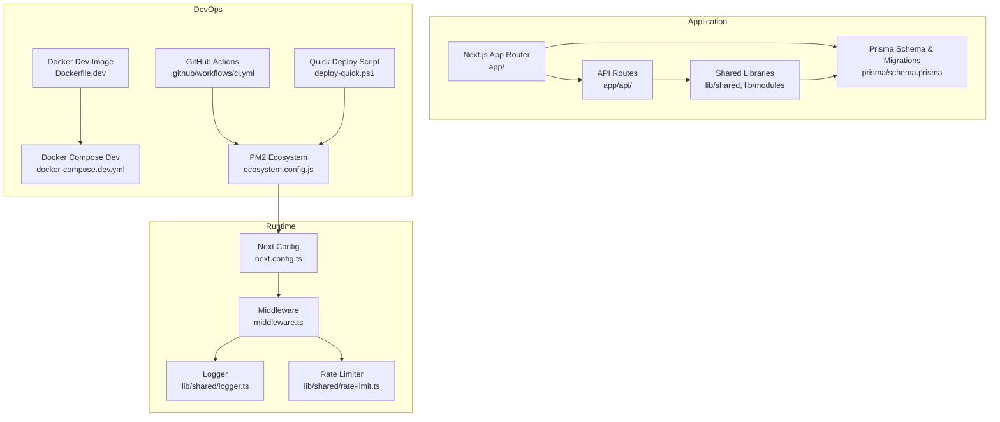
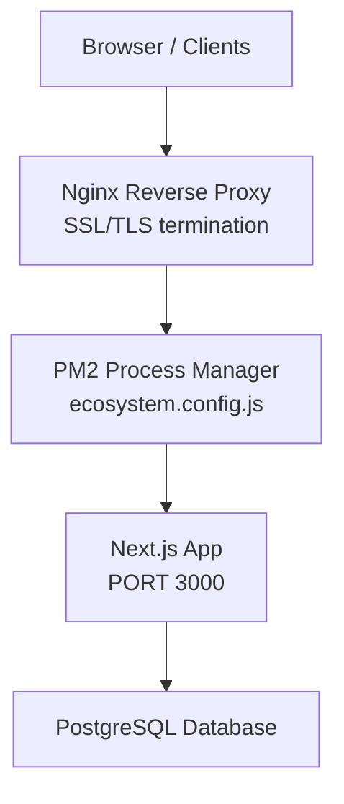
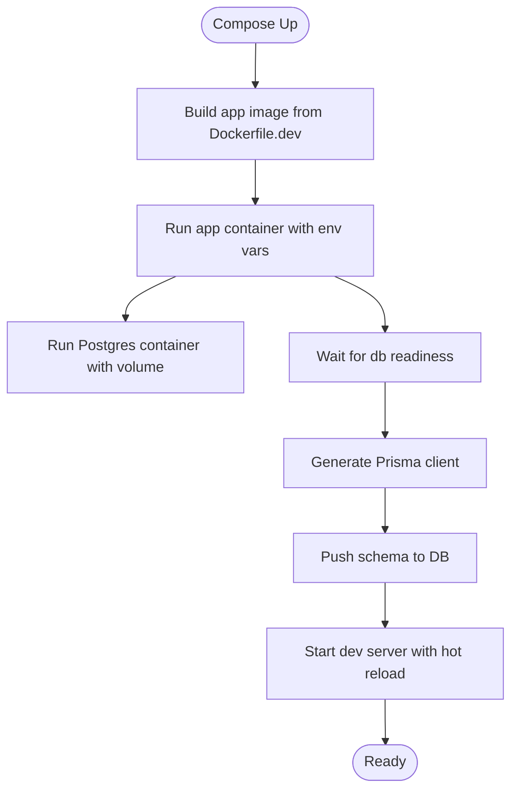
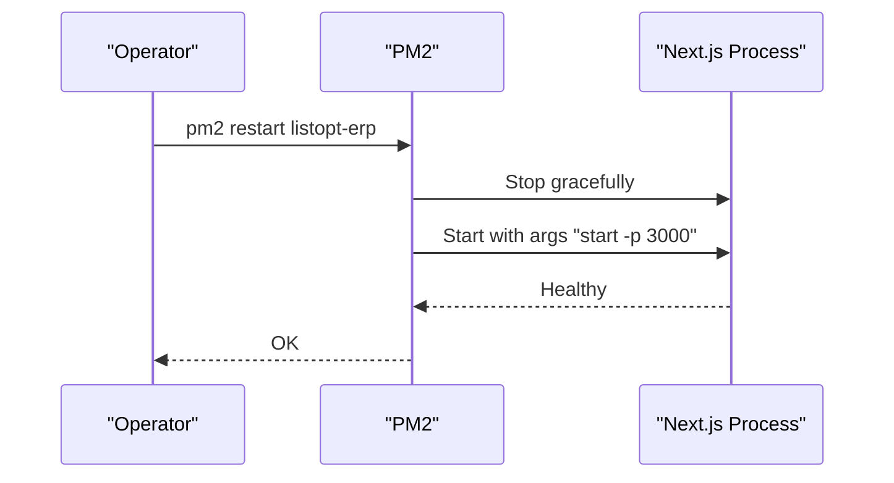
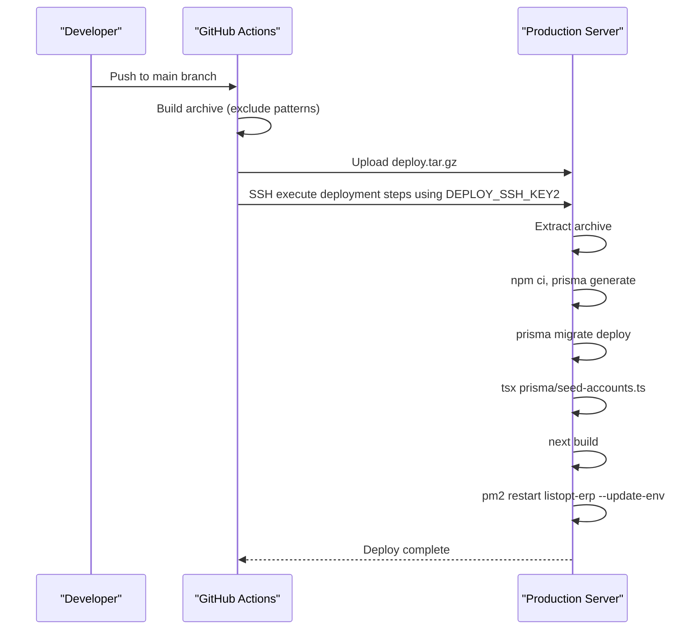
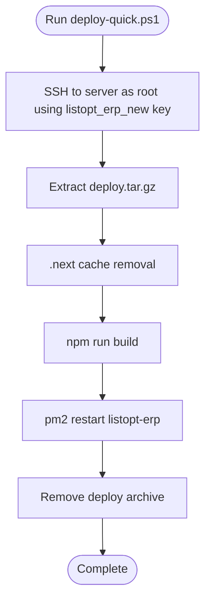
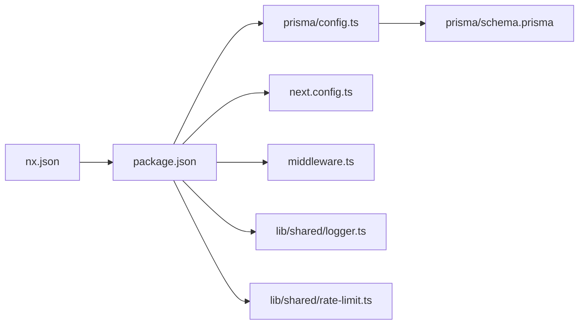

# Deployment & Operations

<cite>
**Referenced Files in This Document**
- [package.json](file://package.json)
- [Dockerfile.dev](file://Dockerfile.dev)
- [docker-compose.dev.yml](file://docker-compose.dev.yml)
- [.github/workflows/ci.yml](file://.github/workflows/ci.yml)
- [ecosystem.config.js](file://ecosystem.config.js)
- [deploy-quick.ps1](file://deploy-quick.ps1)
- [check_db.sh](file://check_db.sh)
- [next.config.ts](file://next.config.ts)
- [middleware.ts](file://middleware.ts)
- [prisma/config.ts](file://prisma/config.ts)
- [prisma/schema.prisma](file://prisma/schema.prisma)
- [prisma/seed.ts](file://prisma/seed.ts)
- [prisma/seed-accounts.ts](file://prisma/seed-accounts.ts)
- [lib/shared/logger.ts](file://lib/shared/logger.ts)
- [lib/shared/rate-limit.ts](file://lib/shared/rate-limit.ts)
- [ARCHITECTURE.md](file://ARCHITECTURE.md)
- [nx.json](file://nx.json)
- [.gitignore](file://.gitignore)
</cite>

## Update Summary
**Changes Made**
- Updated PM2 process management configuration to use port 3000 instead of 3001
- Updated CI/CD workflow to use DEPLOY_SSH_KEY2 for enhanced security
- Updated architecture diagrams and deployment procedures to reflect the new port configuration
- Updated quick deployment script references to match current SSH key configuration

## Table of Contents
1. [Introduction](#introduction)
2. [Project Structure](#project-structure)
3. [Core Components](#core-components)
4. [Architecture Overview](#architecture-overview)
5. [Detailed Component Analysis](#detailed-component-analysis)
6. [Dependency Analysis](#dependency-analysis)
7. [Performance Considerations](#performance-considerations)
8. [Troubleshooting Guide](#troubleshooting-guide)
9. [Conclusion](#conclusion)
10. [Appendices](#appendices)

## Introduction
This document provides comprehensive deployment and operations guidance for ListOpt ERP. It covers production deployment via Docker and PM2, CI/CD automation with GitHub Actions, environment configuration, infrastructure prerequisites, monitoring and logging, performance tuning, backups and disaster recovery, scaling and high availability, security hardening, and both quick and manual deployment procedures.

## Project Structure
ListOpt ERP is a Next.js application with a modular architecture under the app/ directory, API routes under app/api/, shared libraries under lib/, and a Prisma schema for PostgreSQL-backed persistence. The repository includes:
- Scripts for development and production builds
- Dockerfiles and docker-compose for local development
- PM2 ecosystem configuration for production
- GitHub Actions workflow for CI/CD
- Middleware and security headers for runtime protection
- Prisma schema, migrations, and seeders for database initialization

**Diagram sources**
- [Dockerfile.dev:1-27](file://Dockerfile.dev#L1-L27)
- [docker-compose.dev.yml:1-39](file://docker-compose.dev.yml#L1-L39)
- [ecosystem.config.js:1-22](file://ecosystem.config.js#L1-L22)
- [.github/workflows/ci.yml:1-143](file://.github/workflows/ci.yml#L1-L143)
- [deploy-quick.ps1:1-20](file://deploy-quick.ps1#L1-L20)
- [next.config.ts:1-29](file://next.config.ts#L1-L29)
- [middleware.ts:1-156](file://middleware.ts#L1-L156)
- [lib/shared/logger.ts:1-31](file://lib/shared/logger.ts#L1-L31)
- [lib/shared/rate-limit.ts:1-115](file://lib/shared/rate-limit.ts#L1-L115)

**Section sources**
- [ARCHITECTURE.md:1-308](file://ARCHITECTURE.md#L1-L308)
- [nx.json:1-34](file://nx.json#L1-L34)

## Core Components
- Application runtime: Next.js with App Router and API routes
- Database: PostgreSQL via Prisma (development SQLite in dev)
- Process manager: PM2 for production
- Reverse proxy and SSL: Not configured in the repository; see Infrastructure Requirements and Nginx/SSL sections
- CI/CD: GitHub Actions workflow for linting, testing, E2E, building, and deploying to production
- Logging and observability: Structured logging to stdout/stderr for PM2 capture
- Security: Middleware enforcing session checks, CSRF protection, rate limiting, and security headers

**Section sources**
- [package.json:1-79](file://package.json#L1-L79)
- [prisma/config.ts:1-16](file://prisma/config.ts#L1-L16)
- [prisma/schema.prisma:1-800](file://prisma/schema.prisma#L1-L800)
- [ecosystem.config.js:1-22](file://ecosystem.config.js#L1-L22)
- [.github/workflows/ci.yml:1-143](file://.github/workflows/ci.yml#L1-L143)
- [lib/shared/logger.ts:1-31](file://lib/shared/logger.ts#L1-L31)
- [middleware.ts:1-156](file://middleware.ts#L1-L156)
- [lib/shared/rate-limit.ts:1-115](file://lib/shared/rate-limit.ts#L1-L115)

## Architecture Overview
Production runtime uses PM2 to manage a Next.js process listening on port 3000. The application relies on environment variables for database connectivity and session security. CI/CD automates packaging, deployment, database migrations, seeding, and process restarts.

**Diagram sources**
- [ecosystem.config.js:1-22](file://ecosystem.config.js#L1-L22)
- [next.config.ts:1-29](file://next.config.ts#L1-L29)
- [prisma/config.ts:1-16](file://prisma/config.ts#L1-L16)

## Detailed Component Analysis

### Docker Containerization (Development)
- Base image: Node.js Alpine
- Installs Prisma dependencies, generates client, exposes port 3000, sets hot reload environment variables, starts dev server
- docker-compose.dev.yml defines:
  - App service built from Dockerfile.dev, mapping port 3000, mounting source with exclusions, setting NODE_ENV, DATABASE_URL, SESSION_SECRET, SECURE_COOKIES
  - Postgres service with persistent volume and exposed port 5432 for local Prisma commands

**Diagram sources**
- [Dockerfile.dev:1-27](file://Dockerfile.dev#L1-L27)
- [docker-compose.dev.yml:1-39](file://docker-compose.dev.yml#L1-L39)

**Section sources**
- [Dockerfile.dev:1-27](file://Dockerfile.dev#L1-L27)
- [docker-compose.dev.yml:1-39](file://docker-compose.dev.yml#L1-L39)

### PM2 Process Management
- Configuration:
  - Name: listopt-erp
  - Script: next binary
  - Args: start -p 3000
  - Working directory: /var/www/listopt-erp
  - Instances: 1
  - Autorestart enabled
  - Memory threshold triggers restart
  - Environment: NODE_ENV=production, PORT=3000, DATABASE_URL, SESSION_SECRET (commented placeholders)

**Updated** Changed from port 3001 to 3000 for consistency across development and production environments

**Diagram sources**
- [ecosystem.config.js:1-22](file://ecosystem.config.js#L1-L22)

**Section sources**
- [ecosystem.config.js:1-22](file://ecosystem.config.js#L1-L22)

### Nginx Reverse Proxy and SSL
- The repository does not include Nginx configuration or SSL certificates.
- Recommended approach:
  - Place Nginx in front of PM2-managed Next.js
  - Terminate TLS at Nginx with valid certificates
  - Proxy to http://localhost:3000
  - Configure upstream health checks and timeouts
  - Enable gzip and static asset caching for performance

### CI/CD Pipeline and Automated Deployment
- Workflow stages:
  - Lint, Test (affected), E2E, Build
  - Deploy to Production:
    - Archive repository excluding .next, node_modules, .env*, dev.db, .git, test artifacts
    - Setup SSH key and known_hosts using DEPLOY_SSH_KEY2 for enhanced security
    - Upload archive to remote server
    - On server: extract, install deps, source environment, generate Prisma client, apply migrations, seed data, build Next, restart PM2 with updated env

**Updated** Enhanced security by switching from DEPLOY_SSH_KEY to DEPLOY_SSH_KEY2 for deployment SSH keys

**Diagram sources**
- [.github/workflows/ci.yml:100-142](file://.github/workflows/ci.yml#L100-L142)

**Section sources**
- [.github/workflows/ci.yml:1-143](file://.github/workflows/ci.yml#L1-L143)

### Rollback Strategy
- Current workflow restarts the existing PM2 app without explicit rollback steps.
- Recommended rollback procedure:
  - Keep previous artifact/version on the server for 1–2 releases
  - On rollback: extract prior archive, run migrations if needed, pm2 restart listopt-erp
  - Optionally maintain a secondary standby instance behind a load balancer for zero-downtime rollback

### Monitoring, Log Management, and Performance Optimization
- Logging:
  - Structured logging to stdout/stderr via a simple logger utility
  - PM2 captures logs; configure PM2 log rotation and aggregation
- Performance:
  - Next.js build caching via Nx targetDefaults
  - Security headers configured in Next config
  - Rate limiter is in-memory; consider Redis-based solution for multi-instance setups
- Observability:
  - Add metrics exporter or APM agent
  - Centralized logging with ELK/Fluent Bit/Loki
  - Health checks at /api/health or similar

**Section sources**
- [lib/shared/logger.ts:1-31](file://lib/shared/logger.ts#L1-L31)
- [nx.json:1-34](file://nx.json#L1-L34)
- [next.config.ts:1-29](file://next.config.ts#L1-L29)
- [lib/shared/rate-limit.ts:1-115](file://lib/shared/rate-limit.ts#L1-L115)

### Backup Procedures and Disaster Recovery
- Database:
  - Schedule regular logical backups of PostgreSQL
  - Validate restore procedures periodically
  - Store backups offsite or in secure cloud storage
- Application:
  - Back up application source and environment files
  - Maintain a documented DR playbook with steps to rebuild environment and redeploy

### Maintenance Schedules
- Weekly:
  - Review logs and alerts
  - Update dependencies and run tests
- Monthly:
  - Validate backups and restore drills
  - Review and rotate secrets
- Quarterly:
  - Audit security headers and middleware
  - Review rate limiting and scaling thresholds

### Scaling, Load Balancing, and High Availability
- Current setup runs a single Next.js instance managed by PM2.
- To scale horizontally:
  - Run multiple PM2 instances behind a load balancer
  - Use Redis for session storage and rate limiting
  - Ensure shared, stateless sessions and persistent database
  - Consider container orchestration (Kubernetes/Docker Swarm) for HA

### Security Hardening, Firewall, and Access Control
- Middleware enforces:
  - Session-based authentication for ERP routes
  - CSRF protection for protected API methods
  - Public storefront routes separated from ERP routes
- Security headers are set globally in Next config
- Recommendations:
  - Enforce SECURE_COOKIES=true in production
  - Restrict inbound traffic to Nginx/PM2 ports only
  - Use WAF and rate limiting at the edge
  - Rotate SESSION_SECRET regularly

**Section sources**
- [middleware.ts:1-156](file://middleware.ts#L1-L156)
- [next.config.ts:1-29](file://next.config.ts#L1-L29)
- [ARCHITECTURE.md:295-308](file://ARCHITECTURE.md#L295-L308)

### Quick Deployment Script and Manual Procedures
- Quick script (PowerShell):
  - Extracts deploy.tar.gz on the server
  - Removes .next cache
  - Builds the app
  - Restarts PM2
  - Cleans up temporary archive
- Manual steps mirror the CI/CD server block:
  - Extract archive to /var/www/listopt-erp
  - Install dependencies
  - Source environment variables
  - Generate Prisma client and apply migrations
  - Seed data
  - Build Next app
  - Restart PM2 with updated environment

**Updated** The quick deployment script now uses the enhanced SSH key configuration (listopt_erp_new) for secure connections

**Diagram sources**
- [deploy-quick.ps1:1-20](file://deploy-quick.ps1#L1-L20)

**Section sources**
- [deploy-quick.ps1:1-20](file://deploy-quick.ps1#L1-L20)
- [.github/workflows/ci.yml:123-142](file://.github/workflows/ci.yml#L123-L142)
- [ARCHITECTURE.md:280-294](file://ARCHITECTURE.md#L280-L294)

## Dependency Analysis
- Application dependencies:
  - Next.js, React, Prisma client, PostgreSQL adapter
- Build and test:
  - Nx for task orchestration and caching
  - Vitest and Playwright for unit and E2E tests
- Database:
  - Prisma schema defines models and enums
  - Development uses SQLite; production uses PostgreSQL via DATABASE_URL
- Environment:
  - DATABASE_URL, SESSION_SECRET, SECURE_COOKIES, NODE_ENV

**Diagram sources**
- [package.json:1-79](file://package.json#L1-L79)
- [nx.json:1-34](file://nx.json#L1-L34)
- [prisma/config.ts:1-16](file://prisma/config.ts#L1-L16)
- [prisma/schema.prisma:1-800](file://prisma/schema.prisma#L1-L800)
- [next.config.ts:1-29](file://next.config.ts#L1-L29)
- [middleware.ts:1-156](file://middleware.ts#L1-L156)
- [lib/shared/logger.ts:1-31](file://lib/shared/logger.ts#L1-L31)
- [lib/shared/rate-limit.ts:1-115](file://lib/shared/rate-limit.ts#L1-L115)

**Section sources**
- [package.json:1-79](file://package.json#L1-L79)
- [nx.json:1-34](file://nx.json#L1-L34)
- [prisma/config.ts:1-16](file://prisma/config.ts#L1-L16)
- [prisma/schema.prisma:1-800](file://prisma/schema.prisma#L1-L800)

## Performance Considerations
- Build caching: Nx targetDefaults enable caching for build, test, lint, and prisma-generate tasks
- Static headers: Security headers reduce browser risks
- Rate limiting: In-memory implementation is simple but unsuitable for multi-instance; consider Redis-backed alternatives for production
- Database: Use migrations instead of db push in CI/CD to avoid data loss

**Section sources**
- [nx.json:12-26](file://nx.json#L12-L26)
- [next.config.ts:14-25](file://next.config.ts#L14-L25)
- [lib/shared/rate-limit.ts:1-21](file://lib/shared/rate-limit.ts#L1-L21)
- [.github/workflows/ci.yml:65-66](file://.github/workflows/ci.yml#L65-L66)

## Troubleshooting Guide
- Application fails to start:
  - Verify DATABASE_URL and SESSION_SECRET are present in environment
  - Confirm Prisma client generation and migrations applied
- Database connectivity:
  - Use check_db.sh to test login endpoint and review PM2 logs
- Logs:
  - PM2 captures structured logs from logger utility
- Health checks:
  - Implement /api/health endpoint returning 200 when ready

**Section sources**
- [check_db.sh:1-11](file://check_db.sh#L1-L11)
- [lib/shared/logger.ts:14-30](file://lib/shared/logger.ts#L14-L30)
- [.github/workflows/ci.yml:134-138](file://.github/workflows/ci.yml#L134-L138)

## Conclusion
ListOpt ERP's deployment model centers on a single PM2-managed Next.js process with PostgreSQL via Prisma. The GitHub Actions workflow automates packaging, migrations, seeding, and restarts. The recent enhancements include switching to port 3000 for consistency and using DEPLOY_SSH_KEY2 for improved security. For production hardening, add Nginx/TLS, Redis-backed rate limiting, centralized logging, and multi-instance scaling. Regular backups, audits, and documented DR procedures ensure reliability.

## Appendices

### Environment Variables
- DATABASE_URL: PostgreSQL connection string
- SESSION_SECRET: Cryptographically secure 64-character hex string
- SECURE_COOKIES: Set to true for HTTPS
- NODE_ENV: production

**Section sources**
- [ARCHITECTURE.md:295-308](file://ARCHITECTURE.md#L295-L308)

### Database Initialization and Seeding
- Development: SQLite via Prisma config
- Production: PostgreSQL with migrations and seeders
- Seeders:
  - Basic units, default warehouse, document counters, admin user
  - Russian Chart of Accounts and default company settings

**Section sources**
- [prisma/config.ts:1-16](file://prisma/config.ts#L1-L16)
- [prisma/seed.ts:1-120](file://prisma/seed.ts#L1-L120)
- [prisma/seed-accounts.ts:1-216](file://prisma/seed-accounts.ts#L1-L216)

### Ignored Files and Artifacts
- .gitignore excludes node_modules, .next, coverage, env files, SQLite journal, nx cache, and test reports

**Section sources**
- [.gitignore:1-56](file://.gitignore#L1-L56)