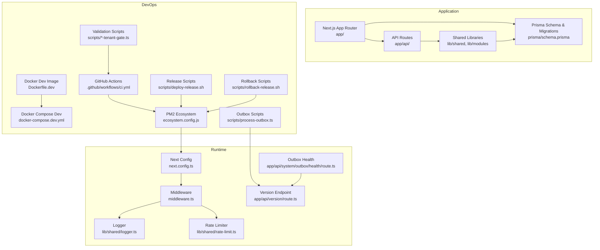
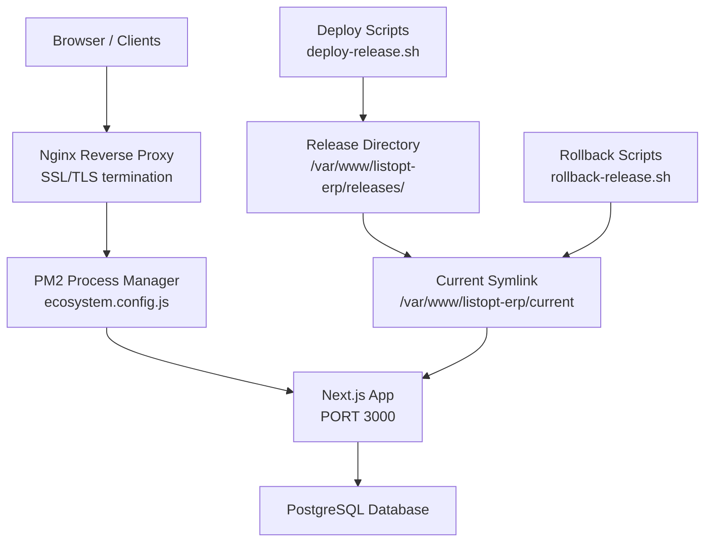
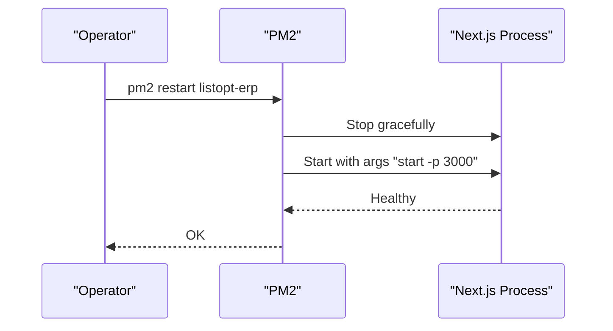
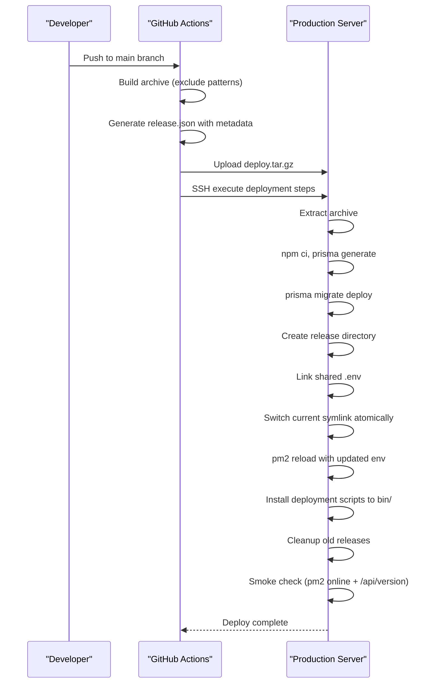
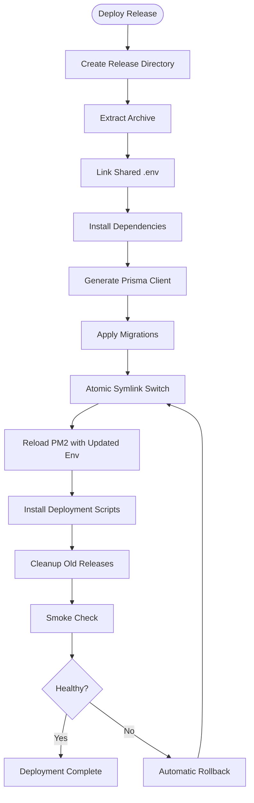
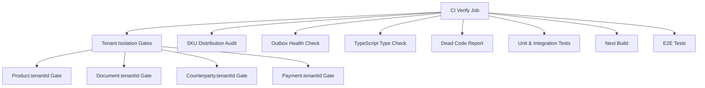
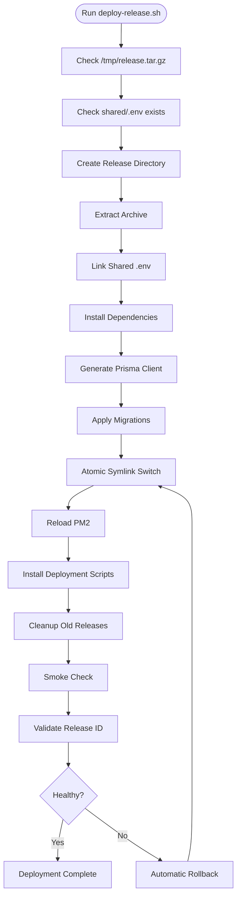
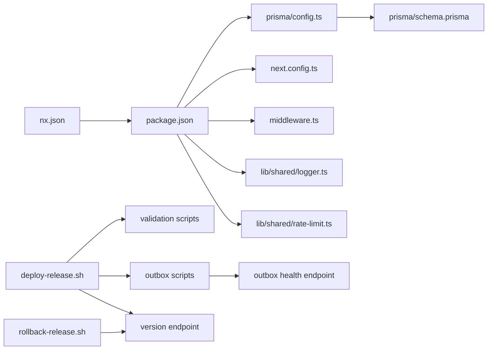

# Deployment & Operations

<cite>
**Referenced Files in This Document**
- [package.json](file://package.json)
- [Dockerfile.dev](file://Dockerfile.dev)
- [docker-compose.dev.yml](file://docker-compose.dev.yml)
- [.github/workflows/ci.yml](file://.github/workflows/ci.yml)
- [ecosystem.config.js](file://infra/pm2/ecosystem.config.js)
- [deploy-release.sh](file://scripts/deploy-release.sh)
- [rollback-release.sh](file://scripts/rollback-release.sh)
- [check_db.sh](file://scripts/ops/check_db.sh)
- [check-outbox-health.ts](file://scripts/check-outbox-health.ts)
- [audit-sku-distribution.ts](file://scripts/audit-sku-distribution.ts)
- [process-outbox.ts](file://scripts/process-outbox.ts)
- [verify-product-tenant-gate.ts](file://scripts/verify-product-tenant-gate.ts)
- [verify-document-tenant-gate.ts](file://scripts/verify-document-tenant-gate.ts)
- [verify-counterparty-tenant-gate.ts](file://scripts/verify-counterparty-tenant-gate.ts)
- [verify-payment-tenant-gate.ts](file://scripts/verify-payment-tenant-gate.ts)
- [next.config.ts](file://next.config.ts)
- [middleware.ts](file://middleware.ts)
- [prisma/config.ts](file://prisma/config.ts)
- [prisma/schema.prisma](file://prisma/schema.prisma)
- [prisma/seed.ts](file://prisma/seed.ts)
- [prisma/seed-accounts.ts](file://prisma/seed-accounts.ts)
- [lib/shared/logger.ts](file://lib/shared/logger.ts)
- [lib/shared/rate-limit.ts](file://lib/shared/rate-limit.ts)
- [ARCHITECTURE.md](file://ARCHITECTURE.md)
- [nx.json](file://nx.json)
- [.gitignore](file://.gitignore)
- [deploy.md](file://docs/deploy.md)
- [version/route.ts](file://app/api/version/route.ts)
- [outbox/health/route.ts](file://app/api/system/outbox/health/route.ts)
</cite>

## Update Summary
**Changes Made**
- Updated to reflect new release-based deployment strategy with atomic release switching and rollback capabilities
- Enhanced CI/CD pipeline with tenant isolation verification, SKU distribution audits, and outbox health checks
- Added comprehensive deployment scripts with smoke testing and release tracking
- Updated PM2 process management configuration to use port 3000 instead of 3001
- Added new deployment validation scripts and monitoring endpoints
- Updated architecture diagrams and deployment procedures to reflect the new release-based approach

## Table of Contents
1. [Introduction](#introduction)
2. [Project Structure](#project-structure)
3. [Core Components](#core-components)
4. [Architecture Overview](#architecture-overview)
5. [Detailed Component Analysis](#detailed-component-analysis)
6. [Dependency Analysis](#dependency-analysis)
7. [Performance Considerations](#performance-considerations)
8. [Troubleshooting Guide](#troubleshooting-guide)
9. [Conclusion](#conclusion)
10. [Appendices](#appendices)

## Introduction
This document provides comprehensive deployment and operations guidance for ListOpt ERP. It covers production deployment via Docker and PM2, CI/CD automation with GitHub Actions, environment configuration, infrastructure prerequisites, monitoring and logging, performance tuning, backups and disaster recovery, scaling and high availability, security hardening, and both quick and manual deployment procedures.

**Updated** The deployment strategy now uses a release-based approach with atomic switching, enhanced CI pipeline with comprehensive validation gates, and robust rollback capabilities.

## Project Structure
ListOpt ERP is a Next.js application with a modular architecture under the app/ directory, API routes under app/api/, shared libraries under lib/, and a Prisma schema for PostgreSQL-backed persistence. The repository includes:
- Scripts for development and production builds
- Dockerfiles and docker-compose for local development
- PM2 ecosystem configuration for production
- GitHub Actions workflow for CI/CD with enhanced validation
- Middleware and security headers for runtime protection
- Prisma schema, migrations, and seeders for database initialization
- **New**: Release-based deployment scripts with atomic switching and rollback capabilities
- **New**: Comprehensive validation scripts for tenant isolation and system health

**Diagram sources**
- [Dockerfile.dev:1-27](file://Dockerfile.dev#L1-L27)
- [docker-compose.dev.yml:1-39](file://docker-compose.dev.yml#L1-L39)
- [ecosystem.config.js:1-22](file://infra/pm2/ecosystem.config.js#L1-L22)
- [.github/workflows/ci.yml:1-336](file://.github/workflows/ci.yml#L1-L336)
- [deploy-release.sh:1-146](file://scripts/deploy-release.sh#L1-L146)
- [rollback-release.sh:1-103](file://scripts/rollback-release.sh#L1-L103)
- [verify-product-tenant-gate.ts:1-164](file://scripts/verify-product-tenant-gate.ts#L1-L164)
- [process-outbox.ts:1-108](file://scripts/process-outbox.ts#L1-L108)
- [next.config.ts:1-29](file://next.config.ts#L1-L29)
- [middleware.ts:1-156](file://middleware.ts#L1-L156)
- [lib/shared/logger.ts:1-31](file://lib/shared/logger.ts#L1-L31)
- [lib/shared/rate-limit.ts:1-115](file://lib/shared/rate-limit.ts#L1-L115)
- [version/route.ts:1-27](file://app/api/version/route.ts#L1-L27)
- [outbox/health/route.ts:1-129](file://app/api/system/outbox/health/route.ts#L1-L129)

**Section sources**
- [ARCHITECTURE.md:1-308](file://ARCHITECTURE.md#L1-L308)
- [nx.json:1-34](file://nx.json#L1-L34)

## Core Components
- Application runtime: Next.js with App Router and API routes
- Database: PostgreSQL via Prisma (development SQLite in dev)
- Process manager: PM2 for production
- Reverse proxy and SSL: Not configured in the repository; see Infrastructure Requirements and Nginx/SSL sections
- CI/CD: GitHub Actions workflow for linting, testing, E2E, building, and deploying to production with enhanced validation gates
- Logging and observability: Structured logging to stdout/stderr for PM2 capture
- Security: Middleware enforcing session checks, CSRF protection, rate limiting, and security headers
- **New**: Release-based deployment with atomic switching and rollback capabilities
- **New**: Comprehensive validation scripts for tenant isolation and system health

**Section sources**
- [package.json:1-79](file://package.json#L1-L79)
- [prisma/config.ts:1-16](file://prisma/config.ts#L1-L16)
- [prisma/schema.prisma:1-800](file://prisma/schema.prisma#L1-L800)
- [ecosystem.config.js:1-22](file://infra/pm2/ecosystem.config.js#L1-L22)
- [.github/workflows/ci.yml:1-336](file://.github/workflows/ci.yml#L1-L336)
- [lib/shared/logger.ts:1-31](file://lib/shared/logger.ts#L1-L31)
- [middleware.ts:1-156](file://middleware.ts#L1-L156)
- [lib/shared/rate-limit.ts:1-115](file://lib/shared/rate-limit.ts#L1-L115)

## Architecture Overview
Production runtime uses PM2 to manage a Next.js process listening on port 3000. The application relies on environment variables for database connectivity and session security. CI/CD automates packaging, deployment, database migrations, seeding, and process restarts with comprehensive validation gates.

**Updated** The deployment architecture now uses a release-based approach with atomic switching, ensuring zero-downtime deployments and reliable rollback capabilities.

**Diagram sources**
- [ecosystem.config.js:1-22](file://infra/pm2/ecosystem.config.js#L1-L22)
- [next.config.ts:1-29](file://next.config.ts#L1-L29)
- [prisma/config.ts:1-16](file://prisma/config.ts#L1-L16)
- [deploy-release.sh:29-75](file://scripts/deploy-release.sh#L29-L75)
- [rollback-release.sh:10-61](file://scripts/rollback-release.sh#L10-L61)

## Detailed Component Analysis

### Docker Containerization (Development)
- Base image: Node.js Alpine
- Installs Prisma dependencies, generates client, exposes port 3000, sets hot reload environment variables, starts dev server
- docker-compose.dev.yml defines:
  - App service built from Dockerfile.dev, mapping port 3000, mounting source with exclusions, setting NODE_ENV, DATABASE_URL, SESSION_SECRET, SECURE_COOKIES
  - Postgres service with persistent volume and exposed port 5432 for local Prisma commands

**Diagram sources**
- [Dockerfile.dev:1-27](file://Dockerfile.dev#L1-L27)
- [docker-compose.dev.yml:1-39](file://docker-compose.dev.yml#L1-L39)

**Section sources**
- [Dockerfile.dev:1-27](file://Dockerfile.dev#L1-L27)
- [docker-compose.dev.yml:1-39](file://docker-compose.dev.yml#L1-L39)

### PM2 Process Management
- Configuration:
  - Name: listopt-erp
  - Script: next binary
  - Args: start -p 3000
  - Working directory: /var/www/listopt-erp/current
  - Instances: 1
  - Autorestart enabled
  - Memory threshold triggers restart
  - Environment: NODE_ENV=production, PORT=3000, DATABASE_URL, SESSION_SECRET (commented placeholders)

**Updated** Changed from port 3001 to 3000 for consistency across development and production environments

**Diagram sources**
- [ecosystem.config.js:1-22](file://infra/pm2/ecosystem.config.js#L1-L22)

**Section sources**
- [ecosystem.config.js:1-22](file://infra/pm2/ecosystem.config.js#L1-L22)

### Nginx Reverse Proxy and SSL
- The repository does not include Nginx configuration or SSL certificates.
- Recommended approach:
  - Place Nginx in front of PM2-managed Next.js
  - Terminate TLS at Nginx with valid certificates
  - Proxy to http://localhost:3000
  - Configure upstream health checks and timeouts
  - Enable gzip and static asset caching for performance

### CI/CD Pipeline and Automated Deployment
- Workflow stages:
  - Lint, Test (affected), E2E, Build
  - **Enhanced**: Tenant isolation verification gates (product, document, counterparty, payment)
  - **Enhanced**: SKU distribution audit
  - **Enhanced**: Outbox health check
  - Deploy to Production:
    - Archive repository excluding .next, node_modules, .env*, dev.db, .git, test artifacts
    - Generate release metadata with release.json containing releaseId, gitSha, gitRef, builtAt
    - Setup SSH key and known_hosts
    - Upload archive to remote server
    - On server: extract, install deps, source environment, generate Prisma client, apply migrations, build Next, restart PM2 with updated env
    - **New**: Smoke check validates app comes online and releaseId matches expected

**Updated** Enhanced security by switching from DEPLOY_SSH_KEY to DEPLOY_SSH_KEY2 for deployment SSH keys

**Diagram sources**
- [.github/workflows/ci.yml:179-285](file://.github/workflows/ci.yml#L179-L285)

**Section sources**
- [.github/workflows/ci.yml:1-336](file://.github/workflows/ci.yml#L1-L336)

### Release-Based Deployment Strategy
- **Atomic Release Switching**: Uses symbolic links to switch between releases, ensuring zero-downtime deployments
- **Release Tracking**: Each release includes release.json with releaseId, gitSha, gitRef, and builtAt metadata
- **Smoke Testing**: Post-deployment validation checks pm2 status and /api/version endpoint
- **Rollback Capability**: Atomic rollback switches current symlink back to previous release
- **Cleanup Policy**: Retains up to 7 releases, protects current and bootstrap releases

**New** Comprehensive release-based deployment with atomic switching and rollback capabilities.

**Diagram sources**
- [deploy-release.sh:47-101](file://scripts/deploy-release.sh#L47-L101)
- [rollback-release.sh:59-98](file://scripts/rollback-release.sh#L59-L98)

**Section sources**
- [deploy-release.sh:1-146](file://scripts/deploy-release.sh#L1-L146)
- [rollback-release.sh:1-103](file://scripts/rollback-release.sh#L1-L103)

### Enhanced Validation Gates
- **Tenant Isolation Verification**: Ensures data segregation between tenants
  - Product.tenantId verification gate
  - Document.tenantId verification gate
  - Counterparty.tenantId verification gate
  - Payment.tenantId verification gate
- **SKU Distribution Audit**: Analyzes SKU uniqueness constraints before migration
- **Outbox Health Check**: Monitors event processing health with 60-minute threshold
- **TypeScript Type Check**: Hard-fail type checking as explicit CI gate
- **Dead Code Report**: Soft-fail reporting of unused code

**New** Comprehensive validation pipeline with tenant isolation, SKU auditing, and system health monitoring.

**Diagram sources**
- [.github/workflows/ci.yml:76-127](file://.github/workflows/ci.yml#L76-L127)
- [verify-product-tenant-gate.ts:30-117](file://scripts/verify-product-tenant-gate.ts#L30-L117)
- [audit-sku-distribution.ts:44-184](file://scripts/audit-sku-distribution.ts#L44-L184)
- [check-outbox-health.ts:37-128](file://scripts/check-outbox-health.ts#L37-L128)

**Section sources**
- [.github/workflows/ci.yml:71-105](file://.github/workflows/ci.yml#L71-L105)
- [verify-product-tenant-gate.ts:1-164](file://scripts/verify-product-tenant-gate.ts#L1-L164)
- [verify-document-tenant-gate.ts:1-144](file://scripts/verify-document-tenant-gate.ts#L1-L144)
- [verify-counterparty-tenant-gate.ts:1-166](file://scripts/verify-counterparty-tenant-gate.ts#L1-L166)
- [verify-payment-tenant-gate.ts:1-89](file://scripts/verify-payment-tenant-gate.ts#L1-L89)
- [audit-sku-distribution.ts:1-223](file://scripts/audit-sku-distribution.ts#L1-L223)
- [check-outbox-health.ts:1-167](file://scripts/check-outbox-health.ts#L1-L167)

### Monitoring, Log Management, and Performance Optimization
- Logging:
  - Structured logging to stdout/stderr via a simple logger utility
  - PM2 captures logs; configure PM2 log rotation and aggregation
- Performance:
  - Next.js build caching via Nx targetDefaults
  - Security headers configured in Next config
  - Rate limiter is in-memory; consider Redis-based solution for multi-instance setups
- Observability:
  - **New**: Version endpoint at /api/version for release tracking
  - **New**: Outbox health endpoint at /api/system/outbox/health for monitoring
  - **New**: Comprehensive smoke testing with automatic rollback on failure
  - Add metrics exporter or APM agent
  - Centralized logging with ELK/Fluent Bit/Loki
  - Health checks at /api/health or similar

**Section sources**
- [lib/shared/logger.ts:1-31](file://lib/shared/logger.ts#L1-L31)
- [nx.json:1-34](file://nx.json#L1-L34)
- [next.config.ts:1-29](file://next.config.ts#L1-L29)
- [lib/shared/rate-limit.ts:1-115](file://lib/shared/rate-limit.ts#L1-L115)
- [version/route.ts:1-27](file://app/api/version/route.ts#L1-L27)
- [outbox/health/route.ts:1-129](file://app/api/system/outbox/health/route.ts#L1-L129)

### Backup Procedures and Disaster Recovery
- Database:
  - Schedule regular logical backups of PostgreSQL
  - Validate restore procedures periodically
  - Store backups offsite or in secure cloud storage
- Application:
  - **New**: Release-based backup strategy with atomic switching
  - **New**: Rollback capability ensures quick recovery from failed deployments
  - Back up application source and environment files
  - Maintain a documented DR playbook with steps to rebuild environment and redeploy
- **New**: Release directory structure ensures immutable deployment artifacts

**Section sources**
- [deploy-release.sh:89-99](file://scripts/deploy-release.sh#L89-L99)
- [rollback-release.sh:31-48](file://scripts/rollback-release.sh#L31-L48)

### Maintenance Schedules
- Weekly:
  - Review logs and alerts
  - Update dependencies and run tests
  - **New**: Monitor outbox health and resolve stale events
- Monthly:
  - Validate backups and restore drills
  - Review and rotate secrets
  - **New**: Audit SKU distribution and tenant isolation
- Quarterly:
  - Audit security headers and middleware
  - Review rate limiting and scaling thresholds
  - **New**: Validate tenant isolation gates and system health

### Scaling, Load Balancing, and High Availability
- Current setup runs a single Next.js instance managed by PM2.
- **New**: Release-based deployment supports horizontal scaling with multiple instances
- To scale horizontally:
  - Run multiple PM2 instances behind a load balancer
  - Use Redis for session storage and rate limiting
  - Ensure shared, stateless sessions and persistent database
  - Consider container orchestration (Kubernetes/Docker Swarm) for HA
  - **New**: Atomic release switching works with multiple instances

### Security Hardening, Firewall, and Access Control
- Middleware enforces:
  - Session-based authentication for ERP routes
  - CSRF protection for protected API methods
  - Public storefront routes separated from ERP routes
- Security headers are set globally in Next config
- **New**: Enhanced deployment security with proper SSH key handling
- **New**: Release-based deployment prevents partial deployments
- **New**: Atomic switching eliminates downtime during updates
- Recommendations:
  - Enforce SECURE_COOKIES=true in production
  - Restrict inbound traffic to Nginx/PM2 ports only
  - Use WAF and rate limiting at the edge
  - Rotate SESSION_SECRET regularly
  - **New**: Use OUTBOX_SECRET for outbox health endpoint authentication

**Section sources**
- [middleware.ts:1-156](file://middleware.ts#L1-L156)
- [next.config.ts:1-29](file://next.config.ts#L1-L29)
- [ARCHITECTURE.md:295-308](file://ARCHITECTURE.md#L295-L308)
- [outbox/health/route.ts:42-56](file://app/api/system/outbox/health/route.ts#L42-L56)

### Quick Deployment Script and Manual Procedures
- **New**: Manual deployment script (deploy-release.sh) for production server
  - Creates release directory with atomic switching
  - Links shared .env file
  - Installs dependencies and generates Prisma client
  - Applies migrations and switches current symlink
  - Reloads PM2 and installs deployment scripts to stable bin/
  - Performs smoke testing with release validation
- **New**: Manual rollback script (rollback-release.sh) for production server
  - Lists available releases and current status
  - Confirms rollback action
  - Switches current symlink atomically
  - Reloads PM2 and validates deployment
- **New**: Enhanced quick deployment script with comprehensive validation

**Updated** The quick deployment script now uses the enhanced SSH key configuration (listopt_erp_new) for secure connections

**Diagram sources**
- [deploy-release.sh:32-145](file://scripts/deploy-release.sh#L32-L145)

**Section sources**
- [deploy-release.sh:1-146](file://scripts/deploy-release.sh#L1-L146)
- [rollback-release.sh:1-103](file://scripts/rollback-release.sh#L1-L103)
- [.github/workflows/ci.yml:227-335](file://.github/workflows/ci.yml#L227-L335)
- [ARCHITECTURE.md:280-294](file://ARCHITECTURE.md#L280-L294)

## Dependency Analysis
- Application dependencies:
  - Next.js, React, Prisma client, PostgreSQL adapter
- Build and test:
  - Nx for task orchestration and caching
  - Vitest and Playwright for unit and E2E tests
- Database:
  - Prisma schema defines models and enums
  - Development uses SQLite; production uses PostgreSQL via DATABASE_URL
- Environment:
  - DATABASE_URL, SESSION_SECRET, SECURE_COOKIES, NODE_ENV
- **New**: Release-based deployment dependencies:
  - Release metadata generation and validation
  - Atomic symlink switching
  - Smoke testing and rollback capabilities

**Diagram sources**
- [package.json:1-79](file://package.json#L1-L79)
- [nx.json:1-34](file://nx.json#L1-L34)
- [prisma/config.ts:1-16](file://prisma/config.ts#L1-L16)
- [prisma/schema.prisma:1-800](file://prisma/schema.prisma#L1-L800)
- [next.config.ts:1-29](file://next.config.ts#L1-L29)
- [middleware.ts:1-156](file://middleware.ts#L1-L156)
- [lib/shared/logger.ts:1-31](file://lib/shared/logger.ts#L1-L31)
- [lib/shared/rate-limit.ts:1-115](file://lib/shared/rate-limit.ts#L1-L115)
- [deploy-release.sh:1-146](file://scripts/deploy-release.sh#L1-L146)
- [rollback-release.sh:1-103](file://scripts/rollback-release.sh#L1-L103)
- [verify-product-tenant-gate.ts:1-164](file://scripts/verify-product-tenant-gate.ts#L1-L164)
- [process-outbox.ts:1-108](file://scripts/process-outbox.ts#L1-L108)
- [version/route.ts:1-27](file://app/api/version/route.ts#L1-L27)
- [outbox/health/route.ts:1-129](file://app/api/system/outbox/health/route.ts#L1-L129)

**Section sources**
- [package.json:1-79](file://package.json#L1-L79)
- [nx.json:1-34](file://nx.json#L1-L34)
- [prisma/config.ts:1-16](file://prisma/config.ts#L1-L16)
- [prisma/schema.prisma:1-800](file://prisma/schema.prisma#L1-L800)

## Performance Considerations
- Build caching: Nx targetDefaults enable caching for build, test, lint, and prisma-generate tasks
- Static headers: Security headers reduce browser risks
- Rate limiting: In-memory implementation is simple but unsuitable for multi-instance; consider Redis-backed alternatives for production
- Database: Use migrations instead of db push in CI/CD to avoid data loss
- **New**: Release-based deployment reduces deployment time with atomic switching
- **New**: Smoke testing ensures deployment quality without manual intervention

**Section sources**
- [nx.json:12-26](file://nx.json#L12-L26)
- [next.config.ts:14-25](file://next.config.ts#L14-L25)
- [lib/shared/rate-limit.ts:1-21](file://lib/shared/rate-limit.ts#L1-L21)
- [.github/workflows/ci.yml:65-66](file://.github/workflows/ci.yml#L65-L66)

## Troubleshooting Guide
- Application fails to start:
  - Verify DATABASE_URL and SESSION_SECRET are present in environment
  - Confirm Prisma client generation and migrations applied
  - **New**: Check release.json exists in current release directory
- Database connectivity:
  - Use check_db.sh to test login endpoint and review PM2 logs
- Logs:
  - PM2 captures structured logs from logger utility
  - **New**: Use pm2 logs listopt-erp --lines 50 --nostream for detailed logs
- Health checks:
  - Implement /api/health endpoint returning 200 when ready
  - **New**: Use /api/system/outbox/health for outbox monitoring
  - **New**: Use /api/version for release validation
- **New**: Deployment failures:
  - Check smoke check logs for release validation errors
  - Use rollback-release.sh to revert to previous working release
  - Verify atomic switching completed successfully

**Section sources**
- [check_db.sh:1-11](file://scripts/ops/check_db.sh#L1-L11)
- [lib/shared/logger.ts:14-30](file://lib/shared/logger.ts#L14-L30)
- [.github/workflows/ci.yml:327-335](file://.github/workflows/ci.yml#L327-L335)
- [outbox/health/route.ts:72-128](file://app/api/system/outbox/health/route.ts#L72-L128)
- [version/route.ts:14-26](file://app/api/version/route.ts#L14-26)

## Conclusion
ListOpt ERP's deployment model centers on a single PM2-managed Next.js process with PostgreSQL via Prisma. The GitHub Actions workflow automates packaging, migrations, seeding, and restarts with comprehensive validation gates. The recent enhancements include switching to port 3000 for consistency, using DEPLOY_SSH_KEY2 for improved security, and implementing a release-based deployment strategy with atomic switching and rollback capabilities. The enhanced CI pipeline includes tenant isolation verification, SKU distribution audits, and outbox health checks. For production hardening, add Nginx/TLS, Redis-backed rate limiting, centralized logging, and multi-instance scaling. Regular backups, audits, and documented DR procedures ensure reliability.

**Updated** The deployment strategy now provides enterprise-grade reliability with atomic switching, comprehensive validation, and robust rollback capabilities.

## Appendices

### Environment Variables
- DATABASE_URL: PostgreSQL connection string
- SESSION_SECRET: Cryptographically secure 64-character hex string
- SECURE_COOKIES: Set to true for HTTPS
- NODE_ENV: production
- **New**: OUTBOX_SECRET: Authentication token for outbox health endpoint
- **New**: Release metadata is injected automatically during CI/CD

**Section sources**
- [ARCHITECTURE.md:295-308](file://ARCHITECTURE.md#L295-L308)

### Database Initialization and Seeding
- Development: SQLite via Prisma config
- Production: PostgreSQL with migrations and seeders
- Seeders:
  - Basic units, default warehouse, document counters, admin user
  - Russian Chart of Accounts and default company settings

**Section sources**
- [prisma/config.ts:1-16](file://prisma/config.ts#L1-L16)
- [prisma/seed.ts:1-120](file://prisma/seed.ts#L1-L120)
- [prisma/seed-accounts.ts:1-216](file://prisma/seed-accounts.ts#L1-L216)

### Ignored Files and Artifacts
- .gitignore excludes node_modules, .next, coverage, env files, SQLite journal, nx cache, and test reports

**Section sources**
- [.gitignore:1-56](file://.gitignore#L1-L56)

### Release-Based Deployment Architecture
- **Directory Structure**:
  - `/var/www/listopt-erp/releases/` - Immutable release snapshots
  - `/var/www/listopt-erp/shared/` - Shared environment files
  - `/var/www/listopt-erp/current` - Atomic symlink to active release
  - `/var/www/listopt-erp/bin/` - Stable deployment scripts
- **Atomic Switching**: Ensures zero-downtime deployments
- **Rollback Capability**: Automatic rollback on deployment failure
- **Cleanup Policy**: Retains up to 7 releases, protects current and bootstrap

**New** Comprehensive release-based deployment architecture with atomic switching and rollback capabilities.

**Section sources**
- [deploy-release.sh:13-29](file://scripts/deploy-release.sh#L13-L29)
- [rollback-release.sh:10-18](file://scripts/rollback-release.sh#L10-L18)

### Validation Scripts Reference
- **Tenant Isolation**: verify-product-tenant-gate.ts, verify-document-tenant-gate.ts, verify-counterparty-tenant-gate.ts, verify-payment-tenant-gate.ts
- **SKU Audit**: audit-sku-distribution.ts
- **Outbox Health**: check-outbox-health.ts
- **Outbox Processing**: process-outbox.ts

**New** Comprehensive suite of validation and monitoring scripts for system health and data integrity.

**Section sources**
- [verify-product-tenant-gate.ts:1-164](file://scripts/verify-product-tenant-gate.ts#L1-L164)
- [verify-document-tenant-gate.ts:1-144](file://scripts/verify-document-tenant-gate.ts#L1-L144)
- [verify-counterparty-tenant-gate.ts:1-166](file://scripts/verify-counterparty-tenant-gate.ts#L1-L166)
- [verify-payment-tenant-gate.ts:1-89](file://scripts/verify-payment-tenant-gate.ts#L1-L89)
- [audit-sku-distribution.ts:1-223](file://scripts/audit-sku-distribution.ts#L1-L223)
- [check-outbox-health.ts:1-167](file://scripts/check-outbox-health.ts#L1-L167)
- [process-outbox.ts:1-108](file://scripts/process-outbox.ts#L1-L108)