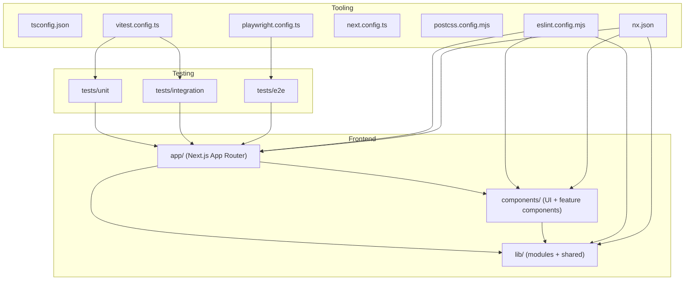
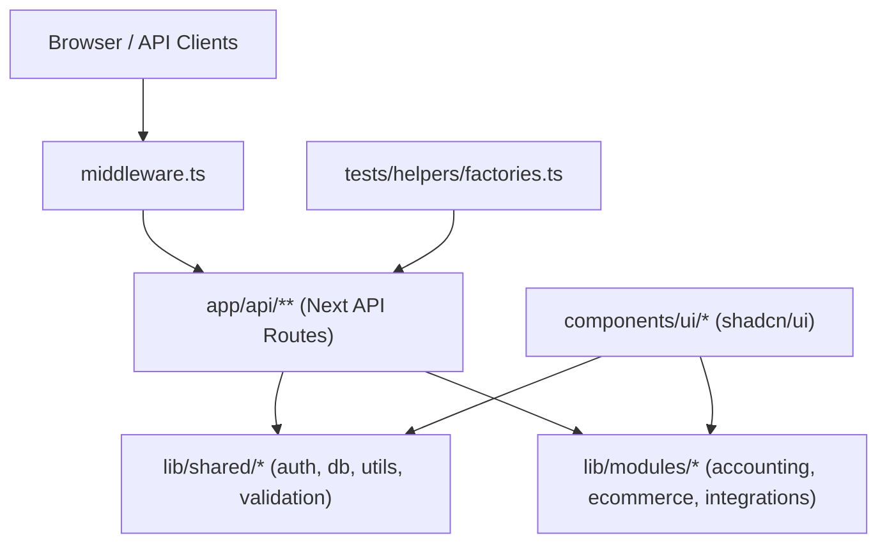
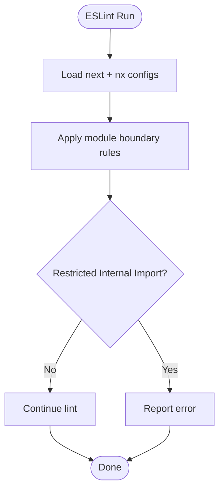
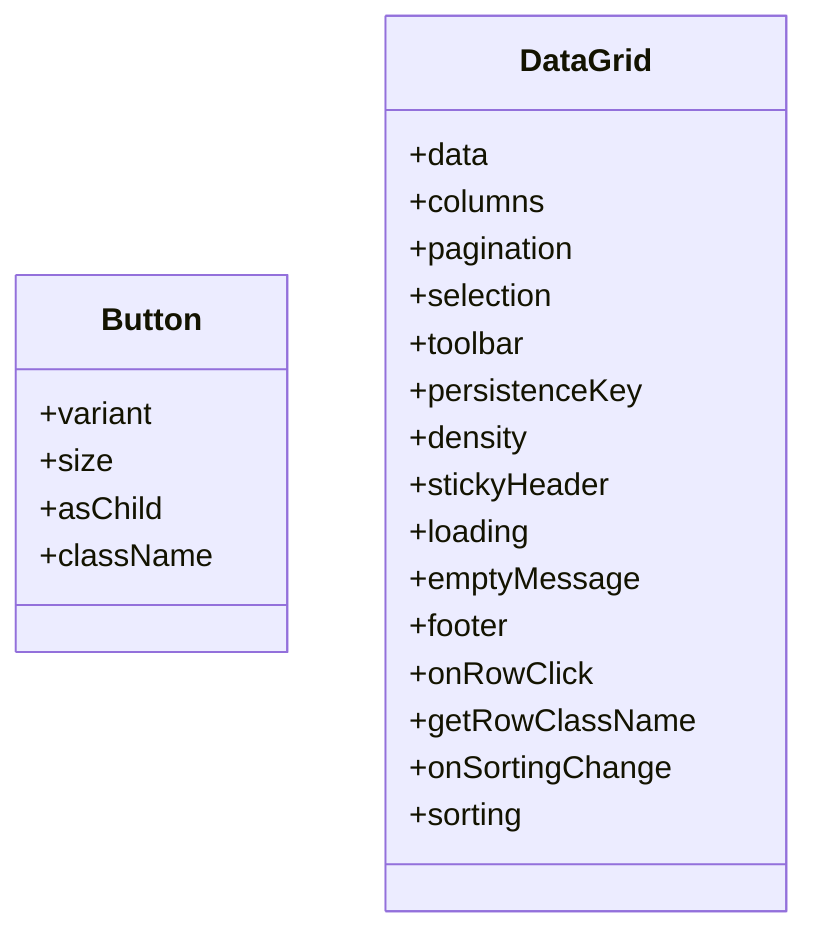
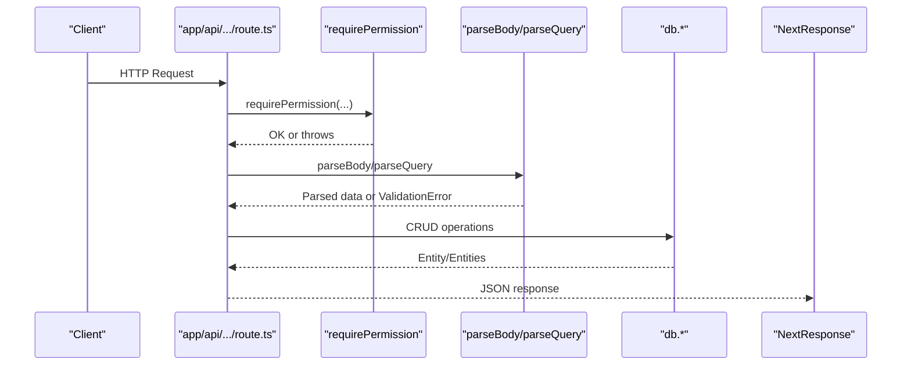
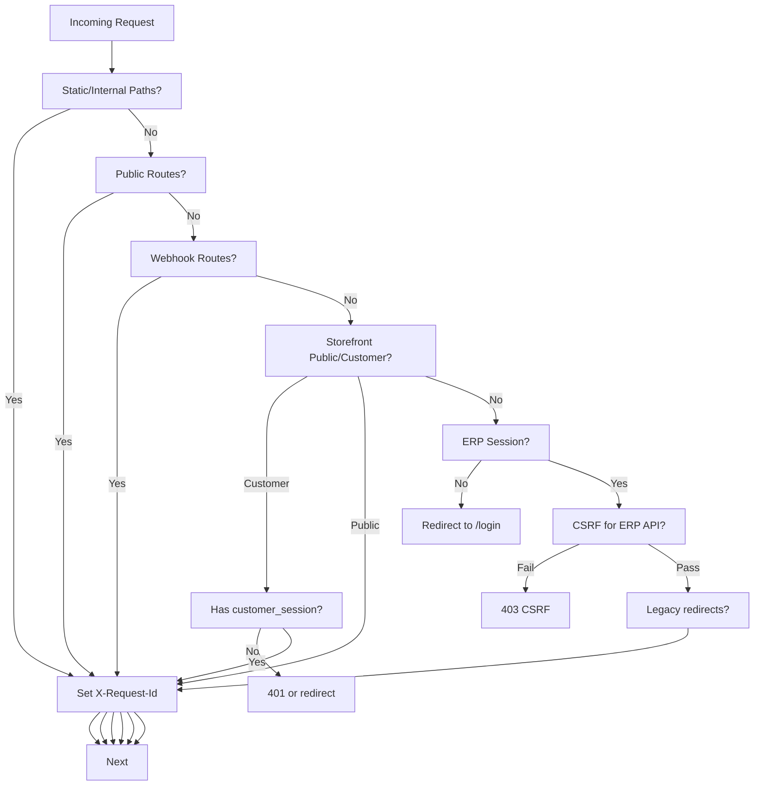
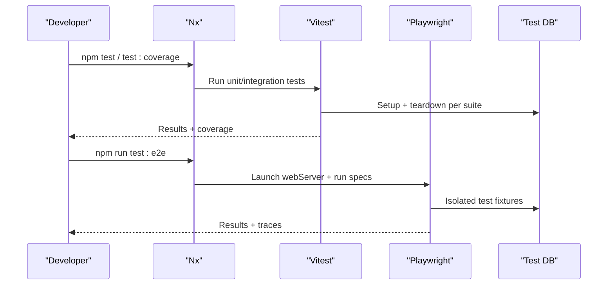
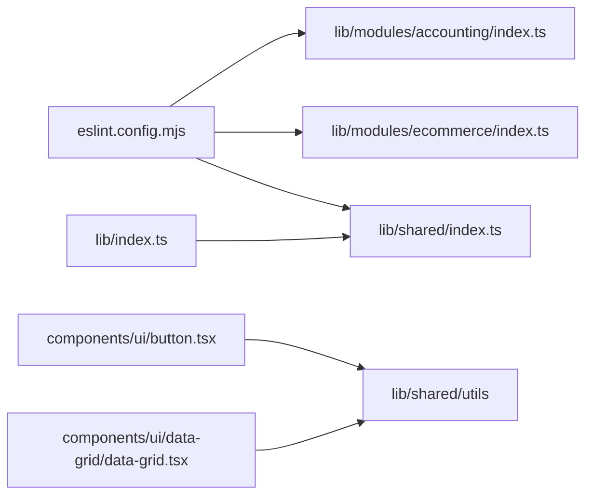

# Development Guidelines

<cite>
**Referenced Files in This Document**
- [README.md](file://README.md)
- [package.json](file://package.json)
- [eslint.config.mjs](file://eslint.config.mjs)
- [tsconfig.json](file://tsconfig.json)
- [next.config.ts](file://next.config.ts)
- [components.json](file://components.json)
- [postcss.config.mjs](file://postcss.config.mjs)
- [vitest.config.ts](file://vitest.config.ts)
- [playwright.config.ts](file://playwright.config.ts)
- [nx.json](file://nx.json)
- [middleware.ts](file://middleware.ts)
- [lib/index.ts](file://lib/index.ts)
- [lib/shared/index.ts](file://lib/shared/index.ts)
- [lib/shared/validation.ts](file://lib/shared/validation.ts)
- [lib/modules/accounting/index.ts](file://lib/modules/accounting/index.ts)
- [components/ui/button.tsx](file://components/ui/button.tsx)
- [components/ui/data-grid/data-grid.tsx](file://components/ui/data-grid/data-grid.tsx)
- [components/accounting/index.ts](file://components/accounting/index.ts)
- [app/api/accounting/documents/[id]/route.ts](file://app/api/accounting/documents/[id]/route.ts)
- [.github/workflows/ci.yml](file://.github/workflows/ci.yml)
- [tests/helpers/factories.ts](file://tests/helpers/factories.ts)
</cite>

## Table of Contents
1. [Introduction](#introduction)
2. [Project Structure](#project-structure)
3. [Core Components](#core-components)
4. [Architecture Overview](#architecture-overview)
5. [Detailed Component Analysis](#detailed-component-analysis)
6. [Dependency Analysis](#dependency-analysis)
7. [Performance Considerations](#performance-considerations)
8. [Troubleshooting Guide](#troubleshooting-guide)
9. [Conclusion](#conclusion)
10. [Appendices](#appendices)

## Introduction
This document provides comprehensive development guidelines for ListOpt ERP contributors. It consolidates coding standards, TypeScript configuration, ESLint rules, project structure conventions, component and UI patterns, API development standards, route handler patterns, data validation approaches, Git workflow, PR guidelines, testing requirements, documentation standards, build and deployment procedures, environment management, troubleshooting, and contribution processes. The goal is to ensure consistent, maintainable, and secure development across the Next.js-based monorepo managed by Nx.

## Project Structure
ListOpt ERP follows a modular, feature-driven structure under the Next.js App Router. Key conventions:
- Feature-based routing under app/ with grouped modules such as (accounting), (finance), store/, and api/.
- UI components organized under components/ with module-specific subfolders and a shared ui library.
- Business logic centralized under lib/ with modules for accounting, ecommerce, integrations, and shared utilities.
- Tests under tests/ split into unit, integration, and e2e suites.
- Configuration files for TypeScript, ESLint, PostCSS, Vitest, Playwright, and Nx orchestration.

**Diagram sources**
- [README.md:93-110](file://README.md#L93-L110)
- [nx.json:1-34](file://nx.json#L1-L34)
- [eslint.config.mjs:1-148](file://eslint.config.mjs#L1-L148)
- [tsconfig.json:1-44](file://tsconfig.json#L1-L44)
- [next.config.ts:1-29](file://next.config.ts#L1-L29)
- [postcss.config.mjs:1-8](file://postcss.config.mjs#L1-L8)
- [vitest.config.ts:1-30](file://vitest.config.ts#L1-L30)
- [playwright.config.ts:1-40](file://playwright.config.ts#L1-L40)

**Section sources**
- [README.md:93-110](file://README.md#L93-L110)
- [nx.json:1-34](file://nx.json#L1-L34)

## Core Components
- TypeScript configuration enforces strictness, bundler resolution, and path aliases via tsconfig.json.
- ESLint configuration extends Next.js recommended rules, enforces module boundaries, and restricts internal module imports to public barreled exports.
- Nx orchestrates builds, tests, and caching with named inputs and target defaults.
- Middleware.ts centralizes authentication, CSRF protection, rate limiting, logging, and redirects.
- UI components follow shadcn/ui conventions with Tailwind CSS and class variance authority (CVA).
- Validation utilities standardize Zod-based request parsing and error responses.

**Section sources**
- [tsconfig.json:1-44](file://tsconfig.json#L1-L44)
- [eslint.config.mjs:1-148](file://eslint.config.mjs#L1-L148)
- [nx.json:1-34](file://nx.json#L1-L34)
- [middleware.ts:1-156](file://middleware.ts#L1-L156)
- [components.json:1-24](file://components.json#L1-L24)
- [lib/shared/validation.ts:1-63](file://lib/shared/validation.ts#L1-L63)

## Architecture Overview
The system integrates frontend (Next.js App Router), backend API routes, shared libraries, and UI components. Middleware governs authentication and CSRF. Testing spans unit, integration, and e2e layers. Tooling ensures code quality and performance.

**Diagram sources**
- [middleware.ts:1-156](file://middleware.ts#L1-L156)
- [lib/shared/index.ts:1-9](file://lib/shared/index.ts#L1-L9)
- [lib/modules/accounting/index.ts:1-8](file://lib/modules/accounting/index.ts#L1-L8)
- [components/ui/button.tsx:1-65](file://components/ui/button.tsx#L1-L65)
- [tests/helpers/factories.ts:1-636](file://tests/helpers/factories.ts#L1-L636)

## Detailed Component Analysis

### Coding Standards and TypeScript Configuration
- Strict TypeScript compiler options, ESNext modules, bundler resolution, and path alias @/ for root.
- NoEmit enabled with Next plugin; isolatedModules and incremental builds for fast type-checking.
- Path mapping ensures predictable imports across app, components, and lib.

**Section sources**
- [tsconfig.json:1-44](file://tsconfig.json#L1-L44)

### ESLint Rules and Module Boundaries
- Extends Next.js core-web-vitals and TypeScript configs.
- Enforces Nx module boundary rules tagging modules as shared, accounting, ecommerce, and erp.
- Restricts internal module imports to public barrel exports for accounting and ecommerce.
- Overrides default ignores to include Nx cache and generated files.

**Diagram sources**
- [eslint.config.mjs:1-148](file://eslint.config.mjs#L1-L148)

**Section sources**
- [eslint.config.mjs:1-148](file://eslint.config.mjs#L1-L148)

### UI Component Patterns and Styling Conventions
- UI components use CVA for variant and size tokens, radix-ui Slot for composition, and cn for conditional class merging.
- Tailwind utilities applied consistently; data-* attributes for styling hooks.
- DataGrid supports selection, sorting, resizing, visibility persistence, toolbar, bulk actions, and pagination.

**Diagram sources**
- [components/ui/button.tsx:1-65](file://components/ui/button.tsx#L1-L65)
- [components/ui/data-grid/data-grid.tsx:1-370](file://components/ui/data-grid/data-grid.tsx#L1-L370)

**Section sources**
- [components/ui/button.tsx:1-65](file://components/ui/button.tsx#L1-L65)
- [components/ui/data-grid/data-grid.tsx:1-370](file://components/ui/data-grid/data-grid.tsx#L1-L370)
- [components.json:1-24](file://components.json#L1-L24)
- [postcss.config.mjs:1-8](file://postcss.config.mjs#L1-L8)

### Component Development Guidelines
- Prefer barrel exports from module index files to expose public APIs.
- Keep components self-contained; pass props explicitly; avoid deep internal imports.
- Use CVA variants for consistent styling; leverage data attributes for theme-awareness.
- For grids and tables, encapsulate persistence keys and event handlers to keep components reusable.

**Section sources**
- [components/accounting/index.ts:1-12](file://components/accounting/index.ts#L1-L12)
- [lib/index.ts:1-6](file://lib/index.ts#L1-L6)
- [lib/shared/index.ts:1-9](file://lib/shared/index.ts#L1-L9)

### API Development Standards and Route Handler Patterns
- Route handlers follow GET/PUT/DELETE patterns with permission checks and Zod-based validation.
- Use parseBody for request bodies and parseQuery for query parameters; validationError returns structured 400 responses.
- Authorization helpers enforce permissions; handleAuthError centralizes auth-related errors.
- Include computed fields in responses (e.g., localized names) for UI convenience.

**Diagram sources**
- [app/api/accounting/documents/[id]/route.ts:1-166](file://app/api/accounting/documents/[id]/route.ts#L1-L166)
- [lib/shared/validation.ts:1-63](file://lib/shared/validation.ts#L1-L63)

**Section sources**
- [app/api/accounting/documents/[id]/route.ts:1-166](file://app/api/accounting/documents/[id]/route.ts#L1-L166)
- [lib/shared/validation.ts:1-63](file://lib/shared/validation.ts#L1-L63)

### Data Validation Approaches
- Zod schemas define request contracts; safeParse produces typed data or ValidationError.
- validationError converts validation failures into structured JSON with field-level errors.
- parseQuery extracts and validates URL searchParams for list endpoints.

**Section sources**
- [lib/shared/validation.ts:1-63](file://lib/shared/validation.ts#L1-L63)

### Authentication, CSRF, Rate Limiting, and Middleware
- Middleware enforces session cookies for ERP and customer sessions for store APIs.
- CSRF protection applies to ERP API routes except exempt paths; validated against SESSION_SECRET.
- Rate limiting and client IP detection are integrated via shared utilities.
- Redirects handle legacy routes for authenticated ERP users.

**Diagram sources**
- [middleware.ts:1-156](file://middleware.ts#L1-L156)

**Section sources**
- [middleware.ts:1-156](file://middleware.ts#L1-L156)

### Testing Requirements and Coverage
- Unit and integration tests via Vitest; e2e tests via Playwright.
- Vitest runs sequentially to avoid DB race conditions; loads .env.test for test environment.
- Playwright launches a local Next dev server on a dedicated port with CI-friendly settings.
- Factories streamline test data creation across modules.

**Diagram sources**
- [package.json:5-27](file://package.json#L5-L27)
- [vitest.config.ts:1-30](file://vitest.config.ts#L1-L30)
- [playwright.config.ts:1-40](file://playwright.config.ts#L1-L40)
- [tests/helpers/factories.ts:1-636](file://tests/helpers/factories.ts#L1-L636)

**Section sources**
- [package.json:5-27](file://package.json#L5-L27)
- [vitest.config.ts:1-30](file://vitest.config.ts#L1-L30)
- [playwright.config.ts:1-40](file://playwright.config.ts#L1-L40)
- [tests/helpers/factories.ts:1-636](file://tests/helpers/factories.ts#L1-L636)

### Build Process and Environment Management
- Nx orchestrates builds with caching and dependsOn chain including prisma-generate.
- Next.js config sets redirects, headers, and removes powered-by header.
- Environment variables loaded via dotenv for test scripts; DATABASE_URL and SESSION_SECRET propagated to Playwright webServer.

**Section sources**
- [nx.json:12-27](file://nx.json#L12-L27)
- [next.config.ts:1-29](file://next.config.ts#L1-L29)
- [playwright.config.ts:28-38](file://playwright.config.ts#L28-L38)

### Git Workflow, Branch Naming, and Pull Requests
- Fork → feature branch → commit → push → open Pull Request.
- Branch naming convention: feature/<descriptive-name>.
- CI pipeline defined in GitHub Actions workflow.

**Section sources**
- [README.md:112-119](file://README.md#L112-L119)
- [.github/workflows/ci.yml](file://.github/workflows/ci.yml)

### Code Review Processes and Documentation Standards
- Adhere to ESLint module boundary rules and barrel export policies.
- Keep PRs focused; include test coverage for new features and bug fixes.
- Update documentation in ARCHITECTURE.md and Wiki as needed.

[No sources needed since this section provides general guidance]

## Dependency Analysis
- Module boundaries enforced by ESLint; accounting and ecommerce must use public barreled exports.
- Shared utilities re-exported via lib/index.ts for ergonomic imports.
- UI components depend on shared utilities and CVA; data-grid composes smaller UI parts.

**Diagram sources**
- [eslint.config.mjs:14-47](file://eslint.config.mjs#L14-L47)
- [lib/modules/accounting/index.ts:1-8](file://lib/modules/accounting/index.ts#L1-L8)
- [lib/shared/index.ts:1-9](file://lib/shared/index.ts#L1-L9)
- [lib/index.ts:1-6](file://lib/index.ts#L1-L6)
- [components/ui/button.tsx:5](file://components/ui/button.tsx#L5)
- [components/ui/data-grid/data-grid.tsx:12](file://components/ui/data-grid/data-grid.tsx#L12)

**Section sources**
- [eslint.config.mjs:14-47](file://eslint.config.mjs#L14-L47)
- [lib/index.ts:1-6](file://lib/index.ts#L1-L6)

## Performance Considerations
- Use Nx caching for build, test, and lint targets to reduce CI and local iteration times.
- Prefer selective DB queries with includes and projections; compute derived fields in API responses to minimize client-side work.
- Defer heavy computations to background jobs where appropriate; leverage Next.js static generation for read-heavy pages.

[No sources needed since this section provides general guidance]

## Troubleshooting Guide
Common development issues and debugging techniques:
- Lint failures due to internal module imports: Replace direct internal imports with barrel exports from module index files.
- Validation errors: Inspect ValidationError responses for field-level messages; adjust request payload according to Zod schemas.
- Test flakiness: Ensure sequential test execution and proper fixture cleanup; verify DATABASE_URL and SESSION_SECRET in .env.test.
- Middleware auth errors: Confirm session cookies and CSRF tokens for ERP routes; verify customer_session for storefront APIs.
- E2E timeouts: Increase timeouts in playwright.config.ts if necessary; run headed mode for interactive debugging.

**Section sources**
- [eslint.config.mjs:50-132](file://eslint.config.mjs#L50-L132)
- [lib/shared/validation.ts:54-62](file://lib/shared/validation.ts#L54-L62)
- [vitest.config.ts:17-23](file://vitest.config.ts#L17-L23)
- [playwright.config.ts:12-21](file://playwright.config.ts#L12-L21)
- [middleware.ts:119-143](file://middleware.ts#L119-L143)

## Conclusion
These guidelines establish a consistent foundation for building, testing, and maintaining ListOpt ERP. By adhering to module boundaries, barrel exports, standardized validation, and robust middleware controls, contributors can deliver reliable features across the accounting, ecommerce, and ERP domains while ensuring a smooth developer experience through Nx, ESLint, and comprehensive testing.

[No sources needed since this section summarizes without analyzing specific files]

## Appendices

### Appendix A: Contribution Guidelines
- Fork the repository and create feature branches using the naming convention feature/<descriptive-name>.
- Write unit and integration tests; ensure e2e coverage for major flows.
- Open Pull Requests with clear descriptions and links to related issues.
- Keep commits small and focused; rebase onto master before merging.

**Section sources**
- [README.md:112-119](file://README.md#L112-L119)

### Appendix B: Issue Reporting and Feature Requests
- Use GitHub Issues to report bugs and request features.
- Include reproduction steps, environment details, and proposed solutions where possible.

**Section sources**
- [README.md:124-129](file://README.md#L124-L129)

### Appendix C: Deployment Procedures
- Archive and transfer artifacts to the target server; install dependencies, build, and restart services with PM2.
- Refer to the deployment section in README for detailed steps.

**Section sources**
- [README.md:60-79](file://README.md#L60-L79)