# Customer Accounts

<cite>
**Referenced Files in This Document**
- [app/store/account/page.tsx](file://app/store/account/page.tsx)
- [app/store/account/orders/page.tsx](file://app/store/account/orders/page.tsx)
- [app/store/account/favorites/page.tsx](file://app/store/account/favorites/page.tsx)
- [app/store/account/addresses/page.tsx](file://app/store/account/addresses/page.tsx)
- [app/store/auth/telegram/page.tsx](file://app/store/auth/telegram/page.tsx)
- [components/ecommerce/ProfileEditForm.tsx](file://components/ecommerce/ProfileEditForm.tsx)
- [components/ecommerce/CartContext.tsx](file://components/ecommerce/CartContext.tsx)
- [app/api/auth/customer/me/route.ts](file://app/api/auth/customer/me/route.ts)
- [app/api/auth/customer/logout/route.ts](file://app/api/auth/customer/logout/route.ts)
- [app/api/auth/customer/telegram/route.ts](file://app/api/auth/customer/telegram/route.ts)
- [app/api/ecommerce/favorites/route.ts](file://app/api/ecommerce/favorites/route.ts)
- [app/api/ecommerce/addresses/route.ts](file://app/api/ecommerce/addresses/route.ts)
- [app/api/ecommerce/orders/route.ts](file://app/api/ecommerce/orders/route.ts)
- [app/api/ecommerce/cart/route.ts](file://app/api/ecommerce/cart/route.ts)
- [lib/shared/customer-auth.ts](file://lib/shared/customer-auth.ts)
- [lib/modules/ecommerce/schemas/favorites.schema.ts](file://lib/modules/ecommerce/schemas/favorites.schema.ts)
- [lib/modules/ecommerce/schemas/addresses.schema.ts](file://lib/modules/ecommerce/schemas/addresses.schema.ts)
- [lib/modules/accounting/index.ts](file://lib/modules/accounting/index.ts)
- [prisma/schema.prisma](file://prisma/schema.prisma)
</cite>

## Table of Contents
1. [Introduction](#introduction)
2. [Project Structure](#project-structure)
3. [Core Components](#core-components)
4. [Architecture Overview](#architecture-overview)
5. [Detailed Component Analysis](#detailed-component-analysis)
6. [Dependency Analysis](#dependency-analysis)
7. [Performance Considerations](#performance-considerations)
8. [Troubleshooting Guide](#troubleshooting-guide)
9. [Conclusion](#conclusion)
10. [Appendices](#appendices)

## Introduction
This document describes the customer account management system, covering registration and authentication via Telegram, profile management, address book, favorites/wishlist, order history, and cart persistence. It also outlines privacy and data protection considerations and how the system integrates with order management.

## Project Structure
The customer account feature spans UI pages under the store application, API routes for backend operations, shared authentication utilities, Prisma models for persistence, and reusable UI components.

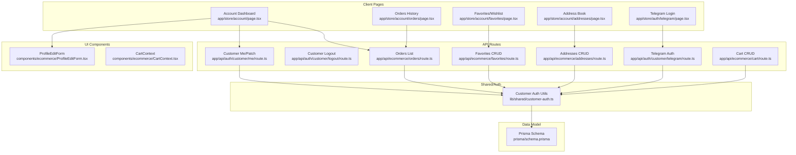

**Diagram sources**
- [app/store/account/page.tsx:1-225](file://app/store/account/page.tsx#L1-L225)
- [app/store/account/orders/page.tsx:1-330](file://app/store/account/orders/page.tsx#L1-L330)
- [app/store/account/favorites/page.tsx:1-208](file://app/store/account/favorites/page.tsx#L1-L208)
- [app/store/account/addresses/page.tsx:1-368](file://app/store/account/addresses/page.tsx#L1-L368)
- [app/store/auth/telegram/page.tsx:1-147](file://app/store/auth/telegram/page.tsx#L1-L147)
- [components/ecommerce/ProfileEditForm.tsx:1-155](file://components/ecommerce/ProfileEditForm.tsx#L1-L155)
- [components/ecommerce/CartContext.tsx:1-195](file://components/ecommerce/CartContext.tsx#L1-L195)
- [app/api/auth/customer/me/route.ts:1-42](file://app/api/auth/customer/me/route.ts#L1-L42)
- [app/api/auth/customer/logout/route.ts:1-16](file://app/api/auth/customer/logout/route.ts#L1-L16)
- [app/api/auth/customer/telegram/route.ts:1-119](file://app/api/auth/customer/telegram/route.ts#L1-L119)
- [app/api/ecommerce/favorites/route.ts:1-172](file://app/api/ecommerce/favorites/route.ts#L1-L172)
- [app/api/ecommerce/addresses/route.ts:1-160](file://app/api/ecommerce/addresses/route.ts#L1-L160)
- [app/api/ecommerce/orders/route.ts:1-64](file://app/api/ecommerce/orders/route.ts#L1-L64)
- [app/api/ecommerce/cart/route.ts:1-189](file://app/api/ecommerce/cart/route.ts#L1-L189)
- [lib/shared/customer-auth.ts:1-100](file://lib/shared/customer-auth.ts#L1-L100)
- [prisma/schema.prisma:629-702](file://prisma/schema.prisma#L629-L702)

**Section sources**
- [app/store/account/page.tsx:1-225](file://app/store/account/page.tsx#L1-L225)
- [app/store/account/orders/page.tsx:1-330](file://app/store/account/orders/page.tsx#L1-L330)
- [app/store/account/favorites/page.tsx:1-208](file://app/store/account/favorites/page.tsx#L1-L208)
- [app/store/account/addresses/page.tsx:1-368](file://app/store/account/addresses/page.tsx#L1-L368)
- [app/store/auth/telegram/page.tsx:1-147](file://app/store/auth/telegram/page.tsx#L1-L147)
- [components/ecommerce/ProfileEditForm.tsx:1-155](file://components/ecommerce/ProfileEditForm.tsx#L1-L155)
- [components/ecommerce/CartContext.tsx:1-195](file://components/ecommerce/CartContext.tsx#L1-L195)
- [app/api/auth/customer/me/route.ts:1-42](file://app/api/auth/customer/me/route.ts#L1-L42)
- [app/api/auth/customer/logout/route.ts:1-16](file://app/api/auth/customer/logout/route.ts#L1-L16)
- [app/api/auth/customer/telegram/route.ts:1-119](file://app/api/auth/customer/telegram/route.ts#L1-L119)
- [app/api/ecommerce/favorites/route.ts:1-172](file://app/api/ecommerce/favorites/route.ts#L1-L172)
- [app/api/ecommerce/addresses/route.ts:1-160](file://app/api/ecommerce/addresses/route.ts#L1-L160)
- [app/api/ecommerce/orders/route.ts:1-64](file://app/api/ecommerce/orders/route.ts#L1-L64)
- [app/api/ecommerce/cart/route.ts:1-189](file://app/api/ecommerce/cart/route.ts#L1-L189)
- [lib/shared/customer-auth.ts:1-100](file://lib/shared/customer-auth.ts#L1-L100)
- [prisma/schema.prisma:629-702](file://prisma/schema.prisma#L629-L702)

## Core Components
- Authentication and Session Management
  - Session signing and verification utilities for customer identity.
  - Telegram Login Widget integration with HMAC verification and cookie-based session creation.
  - Protected API routes enforcing customer authentication.
- Account Dashboard
  - Personal profile editing, recent orders summary, and quick links to orders, favorites, and addresses.
- Orders Management
  - Fetch and paginate customer orders, expandable order details, timeline, and review submission.
- Favorites/Wishlist
  - CRUD operations for saved products with optimistic UI updates and price/discount computation.
- Address Book
  - CRUD operations for multiple delivery addresses with default address selection.
- Cart Persistence
  - Cart context and API routes persist items per authenticated customer across sessions.

**Section sources**
- [lib/shared/customer-auth.ts:1-100](file://lib/shared/customer-auth.ts#L1-L100)
- [app/api/auth/customer/telegram/route.ts:1-119](file://app/api/auth/customer/telegram/route.ts#L1-L119)
- [app/api/auth/customer/me/route.ts:1-42](file://app/api/auth/customer/me/route.ts#L1-L42)
- [app/store/account/page.tsx:1-225](file://app/store/account/page.tsx#L1-L225)
- [app/store/account/orders/page.tsx:1-330](file://app/store/account/orders/page.tsx#L1-L330)
- [app/api/ecommerce/orders/route.ts:1-64](file://app/api/ecommerce/orders/route.ts#L1-L64)
- [app/store/account/favorites/page.tsx:1-208](file://app/store/account/favorites/page.tsx#L1-L208)
- [app/api/ecommerce/favorites/route.ts:1-172](file://app/api/ecommerce/favorites/route.ts#L1-L172)
- [app/store/account/addresses/page.tsx:1-368](file://app/store/account/addresses/page.tsx#L1-L368)
- [app/api/ecommerce/addresses/route.ts:1-160](file://app/api/ecommerce/addresses/route.ts#L1-L160)
- [components/ecommerce/CartContext.tsx:1-195](file://components/ecommerce/CartContext.tsx#L1-L195)
- [app/api/ecommerce/cart/route.ts:1-189](file://app/api/ecommerce/cart/route.ts#L1-L189)

## Architecture Overview
The system uses a cookie-based session for customer identity, validated by signed tokens. Frontend pages call protected APIs to manage profile, orders, favorites, addresses, and cart. Orders are represented as Documents in the accounting module and mapped to the e-commerce customer domain.

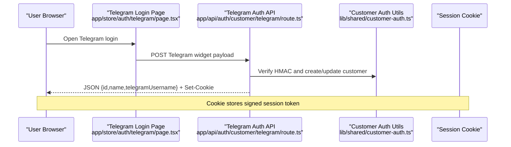

**Diagram sources**
- [app/store/auth/telegram/page.tsx:1-147](file://app/store/auth/telegram/page.tsx#L1-L147)
- [app/api/auth/customer/telegram/route.ts:1-119](file://app/api/auth/customer/telegram/route.ts#L1-L119)
- [lib/shared/customer-auth.ts:1-100](file://lib/shared/customer-auth.ts#L1-L100)

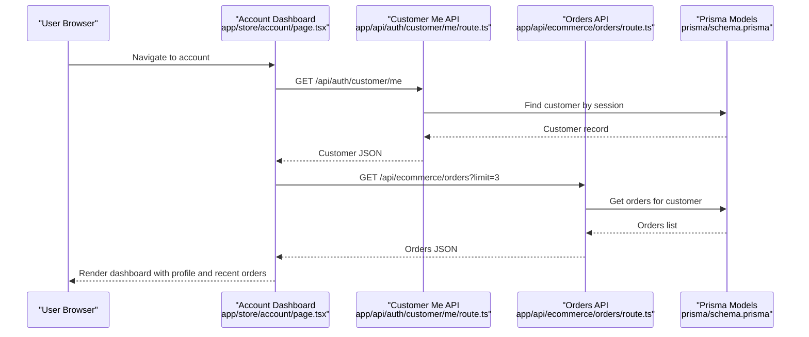

**Diagram sources**
- [app/store/account/page.tsx:1-225](file://app/store/account/page.tsx#L1-L225)
- [app/api/auth/customer/me/route.ts:1-42](file://app/api/auth/customer/me/route.ts#L1-L42)
- [app/api/ecommerce/orders/route.ts:1-64](file://app/api/ecommerce/orders/route.ts#L1-L64)
- [prisma/schema.prisma:629-702](file://prisma/schema.prisma#L629-L702)

## Detailed Component Analysis

### Authentication and Session Management
- Session Signing and Verification
  - Signed tokens combine customer ID and HMAC signature; verified on each request.
  - Session cookie configured with secure, httpOnly, and sameSite attributes.
- Telegram Login
  - Validates Telegram Login Widget payload using HMAC-SHA256 against bot token.
  - Creates or updates customer record and sets session cookie.
- Protected Routes
  - API endpoints enforce customer authentication and return structured errors.

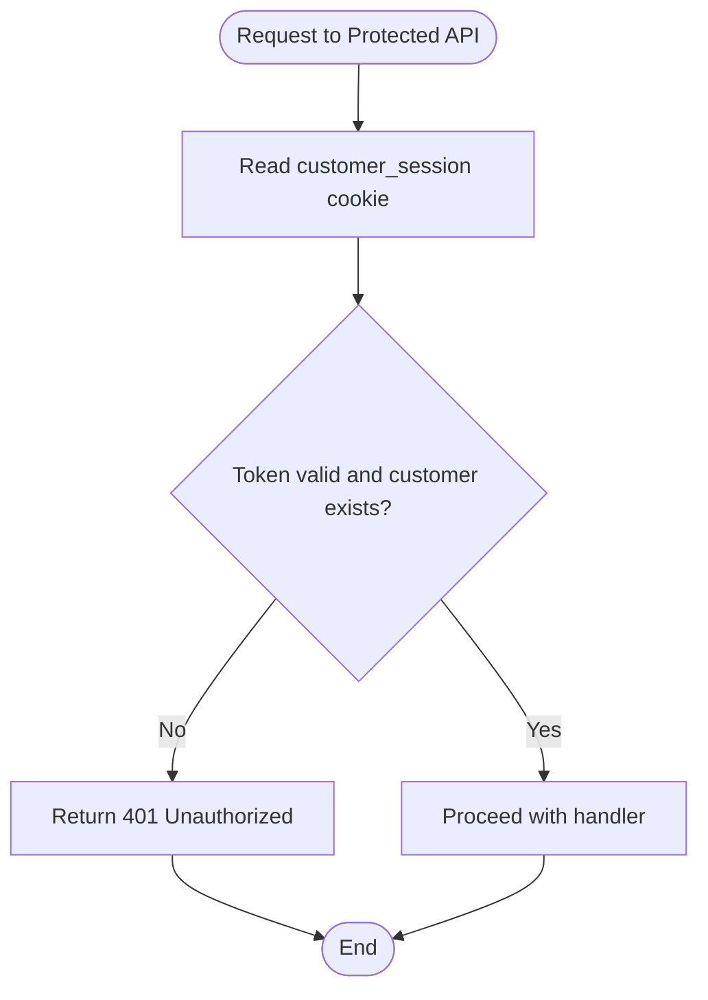

**Diagram sources**
- [lib/shared/customer-auth.ts:1-100](file://lib/shared/customer-auth.ts#L1-L100)
- [app/api/auth/customer/me/route.ts:1-42](file://app/api/auth/customer/me/route.ts#L1-L42)
- [app/api/auth/customer/logout/route.ts:1-16](file://app/api/auth/customer/logout/route.ts#L1-L16)
- [app/api/auth/customer/telegram/route.ts:1-119](file://app/api/auth/customer/telegram/route.ts#L1-L119)

**Section sources**
- [lib/shared/customer-auth.ts:1-100](file://lib/shared/customer-auth.ts#L1-L100)
- [app/api/auth/customer/telegram/route.ts:1-119](file://app/api/auth/customer/telegram/route.ts#L1-L119)
- [app/api/auth/customer/me/route.ts:1-42](file://app/api/auth/customer/me/route.ts#L1-L42)
- [app/api/auth/customer/logout/route.ts:1-16](file://app/api/auth/customer/logout/route.ts#L1-L16)

### Customer Registration and Social Login (Telegram)
- Telegram Login Page
  - Loads Telegram bot configuration and renders the official login widget.
  - Calls the Telegram auth API on successful widget callback.
- Telegram Auth API
  - Verifies widget payload using HMAC with bot token.
  - Creates or updates customer and sets session cookie.

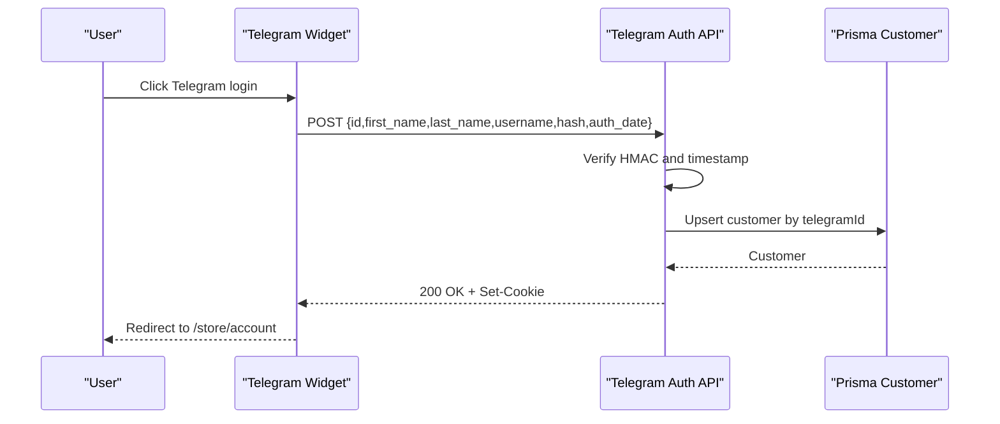

**Diagram sources**
- [app/store/auth/telegram/page.tsx:1-147](file://app/store/auth/telegram/page.tsx#L1-L147)
- [app/api/auth/customer/telegram/route.ts:1-119](file://app/api/auth/customer/telegram/route.ts#L1-L119)
- [prisma/schema.prisma:629-656](file://prisma/schema.prisma#L629-L656)

**Section sources**
- [app/store/auth/telegram/page.tsx:1-147](file://app/store/auth/telegram/page.tsx#L1-L147)
- [app/api/auth/customer/telegram/route.ts:1-119](file://app/api/auth/customer/telegram/route.ts#L1-L119)
- [prisma/schema.prisma:629-656](file://prisma/schema.prisma#L629-L656)

### Customer Profile Management
- ProfileEditForm
  - Displays current profile and allows editing name, phone, and email.
  - Sends PATCH to update customer profile via API.
- Customer Me API
  - GET returns current customer.
  - PATCH validates and updates customer fields.

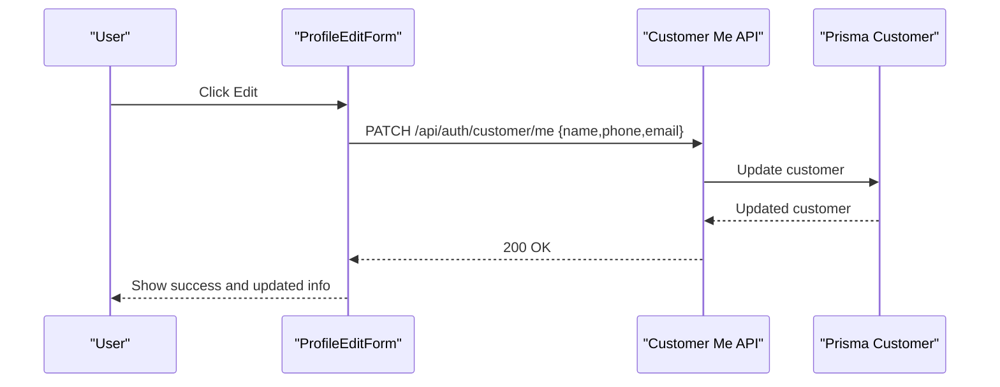

**Diagram sources**
- [components/ecommerce/ProfileEditForm.tsx:1-155](file://components/ecommerce/ProfileEditForm.tsx#L1-L155)
- [app/api/auth/customer/me/route.ts:1-42](file://app/api/auth/customer/me/route.ts#L1-L42)
- [prisma/schema.prisma:629-656](file://prisma/schema.prisma#L629-L656)

**Section sources**
- [components/ecommerce/ProfileEditForm.tsx:1-155](file://components/ecommerce/ProfileEditForm.tsx#L1-L155)
- [app/api/auth/customer/me/route.ts:1-42](file://app/api/auth/customer/me/route.ts#L1-L42)
- [prisma/schema.prisma:629-656](file://prisma/schema.prisma#L629-L656)

### Address Book Management
- Addresses Page
  - Lists addresses with default indicator and actions to edit/delete.
  - Dialog supports create/edit with validation.
- Addresses API
  - GET lists addresses ordered by default-first and recency.
  - POST/PUT create/update with default address handling.
  - DELETE removes owned address.

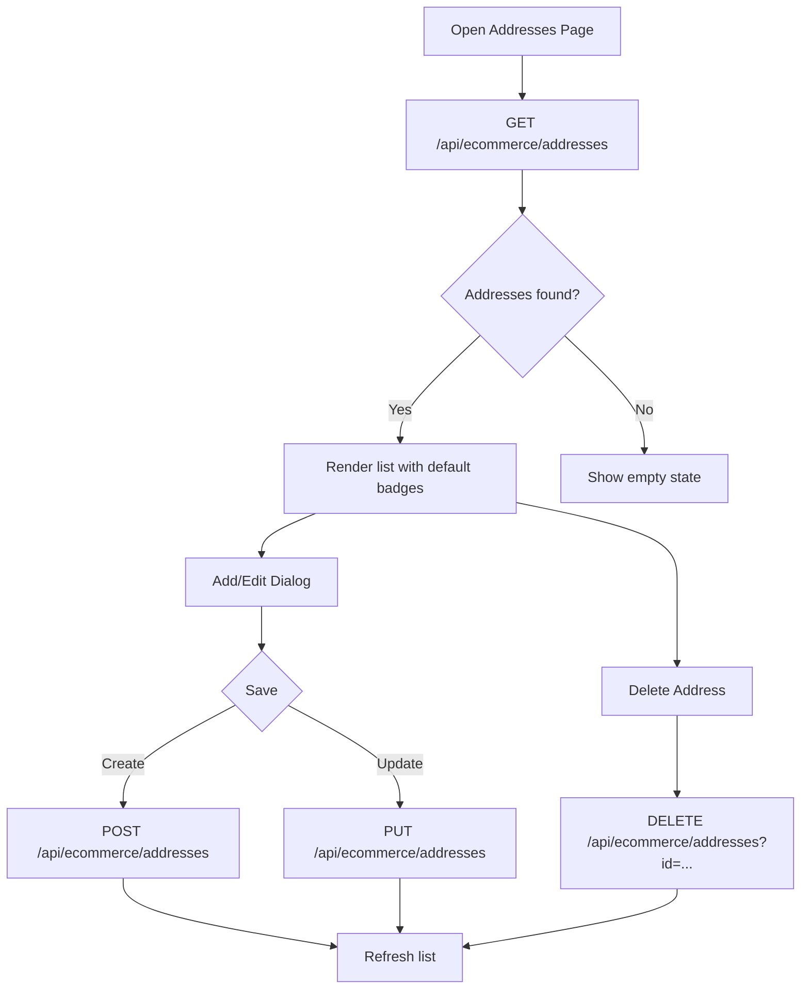

**Diagram sources**
- [app/store/account/addresses/page.tsx:1-368](file://app/store/account/addresses/page.tsx#L1-L368)
- [app/api/ecommerce/addresses/route.ts:1-160](file://app/api/ecommerce/addresses/route.ts#L1-L160)
- [lib/modules/ecommerce/schemas/addresses.schema.ts:1-29](file://lib/modules/ecommerce/schemas/addresses.schema.ts#L1-L29)
- [prisma/schema.prisma:658-681](file://prisma/schema.prisma#L658-L681)

**Section sources**
- [app/store/account/addresses/page.tsx:1-368](file://app/store/account/addresses/page.tsx#L1-L368)
- [app/api/ecommerce/addresses/route.ts:1-160](file://app/api/ecommerce/addresses/route.ts#L1-L160)
- [lib/modules/ecommerce/schemas/addresses.schema.ts:1-29](file://lib/modules/ecommerce/schemas/addresses.schema.ts#L1-L29)
- [prisma/schema.prisma:658-681](file://prisma/schema.prisma#L658-L681)

### Favorites/Wishlist System
- Favorites Page
  - Renders product cards with discount badges and rating.
  - Supports removing favorites with optimistic UI and rollback on error.
- Favorites API
  - GET returns items with computed price, discount, and rating.
  - POST adds product to favorites if not already present.
  - DELETE removes favorite by productId.

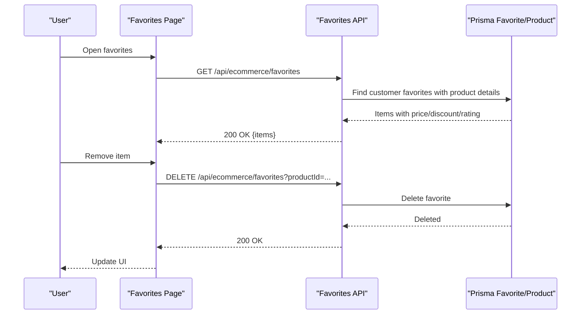

**Diagram sources**
- [app/store/account/favorites/page.tsx:1-208](file://app/store/account/favorites/page.tsx#L1-L208)
- [app/api/ecommerce/favorites/route.ts:1-172](file://app/api/ecommerce/favorites/route.ts#L1-L172)
- [lib/modules/ecommerce/schemas/favorites.schema.ts:1-7](file://lib/modules/ecommerce/schemas/favorites.schema.ts#L1-L7)
- [prisma/schema.prisma:788-798](file://prisma/schema.prisma#L788-L798)

**Section sources**
- [app/store/account/favorites/page.tsx:1-208](file://app/store/account/favorites/page.tsx#L1-L208)
- [app/api/ecommerce/favorites/route.ts:1-172](file://app/api/ecommerce/favorites/route.ts#L1-L172)
- [lib/modules/ecommerce/schemas/favorites.schema.ts:1-7](file://lib/modules/ecommerce/schemas/favorites.schema.ts#L1-L7)
- [prisma/schema.prisma:788-798](file://prisma/schema.prisma#L788-L798)

### Order History Access and Reordering
- Orders Page
  - Lists orders with status badges and totals; expands to show items, delivery address, and timeline.
  - Allows submitting reviews for delivered/paid/shipped items.
- Orders API
  - GET retrieves customer orders from the Document model and formats them for the UI.
- Integration with Accounting
  - Orders are derived from Document records managed by the accounting module.

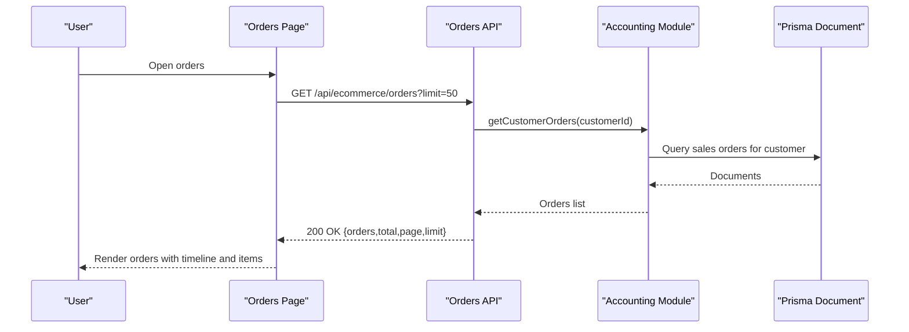

**Diagram sources**
- [app/store/account/orders/page.tsx:1-330](file://app/store/account/orders/page.tsx#L1-L330)
- [app/api/ecommerce/orders/route.ts:1-64](file://app/api/ecommerce/orders/route.ts#L1-L64)
- [lib/modules/accounting/index.ts:1-8](file://lib/modules/accounting/index.ts#L1-L8)
- [prisma/schema.prisma:452-517](file://prisma/schema.prisma#L452-L517)

**Section sources**
- [app/store/account/orders/page.tsx:1-330](file://app/store/account/orders/page.tsx#L1-L330)
- [app/api/ecommerce/orders/route.ts:1-64](file://app/api/ecommerce/orders/route.ts#L1-L64)
- [lib/modules/accounting/index.ts:1-8](file://lib/modules/accounting/index.ts#L1-L8)
- [prisma/schema.prisma:452-517](file://prisma/schema.prisma#L452-L517)

### Cart Persistence Across Sessions
- CartContext
  - Provides cart state and actions; refreshes on authentication change.
  - Optimistically updates UI on add/remove/update.
- Cart API
  - GET returns customer cart items with product and variant details.
  - POST upserts item with current price snapshot.
  - DELETE removes item by ID.

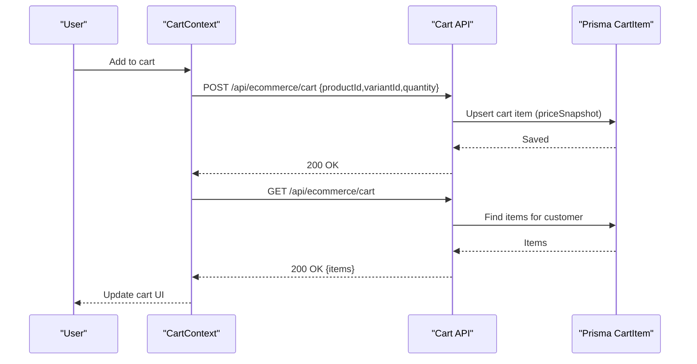

**Diagram sources**
- [components/ecommerce/CartContext.tsx:1-195](file://components/ecommerce/CartContext.tsx#L1-L195)
- [app/api/ecommerce/cart/route.ts:1-189](file://app/api/ecommerce/cart/route.ts#L1-L189)
- [prisma/schema.prisma:687-702](file://prisma/schema.prisma#L687-L702)

**Section sources**
- [components/ecommerce/CartContext.tsx:1-195](file://components/ecommerce/CartContext.tsx#L1-L195)
- [app/api/ecommerce/cart/route.ts:1-189](file://app/api/ecommerce/cart/route.ts#L1-L189)
- [prisma/schema.prisma:687-702](file://prisma/schema.prisma#L687-L702)

### Account Navigation Examples
- Account Dashboard
  - Quick links to Orders, Favorites, and Addresses.
  - Profile editing card.
- Orders Page
  - Back link to account dashboard.
  - Expandable order rows with timeline and item details.
- Favorites Page
  - Back link to account dashboard.
  - Grid of product cards with remove action.
- Addresses Page
  - Back link to account dashboard.
  - Add/Edit/Delete address actions.

**Section sources**
- [app/store/account/page.tsx:135-177](file://app/store/account/page.tsx#L135-L177)
- [app/store/account/orders/page.tsx:138-147](file://app/store/account/orders/page.tsx#L138-L147)
- [app/store/account/favorites/page.tsx:103-112](file://app/store/account/favorites/page.tsx#L103-L112)
- [app/store/account/addresses/page.tsx:178-196](file://app/store/account/addresses/page.tsx#L178-L196)

## Dependency Analysis
- Authentication
  - Pages depend on shared auth utilities for session validation and cookie handling.
- Data Access
  - API routes depend on Prisma models for customer, addresses, favorites, cart, and orders.
- UI Components
  - Pages compose reusable components for forms and cart context.
- Accounting Integration
  - Orders are retrieved from the accounting module’s Document model.

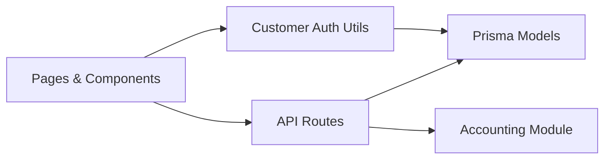

**Diagram sources**
- [lib/shared/customer-auth.ts:1-100](file://lib/shared/customer-auth.ts#L1-L100)
- [app/api/ecommerce/orders/route.ts:1-64](file://app/api/ecommerce/orders/route.ts#L1-L64)
- [lib/modules/accounting/index.ts:1-8](file://lib/modules/accounting/index.ts#L1-L8)
- [prisma/schema.prisma:629-702](file://prisma/schema.prisma#L629-L702)

**Section sources**
- [lib/shared/customer-auth.ts:1-100](file://lib/shared/customer-auth.ts#L1-L100)
- [app/api/ecommerce/orders/route.ts:1-64](file://app/api/ecommerce/orders/route.ts#L1-L64)
- [lib/modules/accounting/index.ts:1-8](file://lib/modules/accounting/index.ts#L1-L8)
- [prisma/schema.prisma:629-702](file://prisma/schema.prisma#L629-L702)

## Performance Considerations
- API Pagination
  - Orders endpoint supports pagination; use limit and page parameters to avoid large payloads.
- Efficient Queries
  - Favorites API precomputes price, discount, and rating to reduce client-side work.
- Cart Snapshotting
  - Cart items store a price snapshot to prevent stale pricing during long sessions.
- UI Responsiveness
  - Optimistic UI updates for favorites and cart reduce perceived latency; rollback on error.

[No sources needed since this section provides general guidance]

## Troubleshooting Guide
- Authentication Failures
  - Telegram auth requires a valid bot token and unexpired auth_date; verify HMAC verification and session cookie settings.
  - If session is invalid or customer inactive, protected routes return 401/403.
- API Validation Errors
  - Favoriting requires productId; addresses require mandatory fields; cart removal requires itemId.
- UI Issues
  - If favorites or addresses fail to update, check network requests and toast messages; the UI attempts rollback on error.

**Section sources**
- [app/api/auth/customer/telegram/route.ts:1-119](file://app/api/auth/customer/telegram/route.ts#L1-L119)
- [app/api/ecommerce/favorites/route.ts:1-172](file://app/api/ecommerce/favorites/route.ts#L1-L172)
- [app/api/ecommerce/addresses/route.ts:1-160](file://app/api/ecommerce/addresses/route.ts#L1-L160)
- [app/api/ecommerce/cart/route.ts:1-189](file://app/api/ecommerce/cart/route.ts#L1-L189)
- [components/ecommerce/ProfileEditForm.tsx:1-155](file://components/ecommerce/ProfileEditForm.tsx#L1-L155)

## Conclusion
The customer account system provides a cohesive, secure, and user-friendly experience for authenticated users. It leverages Telegram for frictionless login, persists data using Prisma, and integrates tightly with the accounting module for order management. Privacy and data protection are addressed through secure cookie handling and strict validation.

[No sources needed since this section summarizes without analyzing specific files]

## Appendices

### Data Model Overview (Selected)
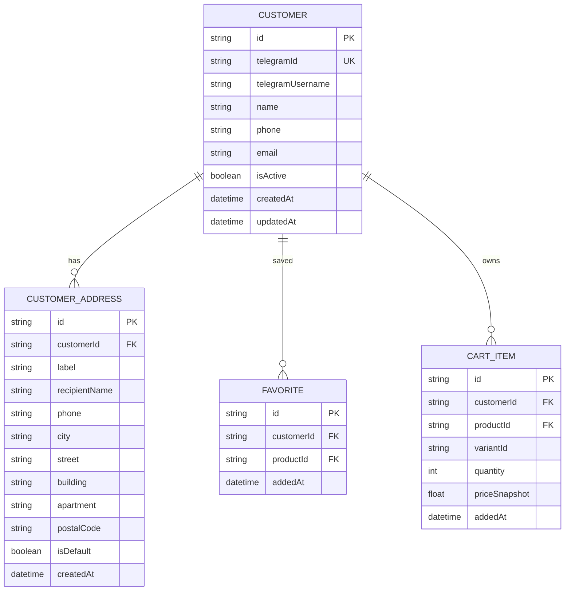

**Diagram sources**
- [prisma/schema.prisma:629-702](file://prisma/schema.prisma#L629-L702)