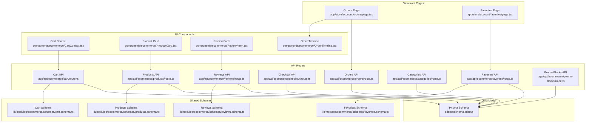
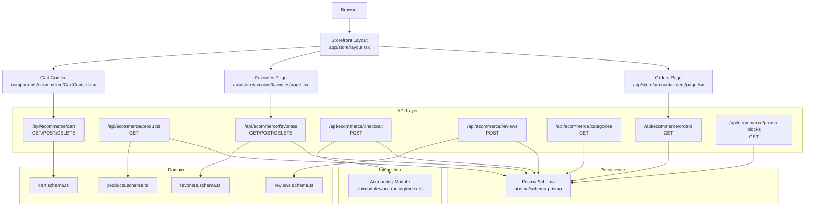
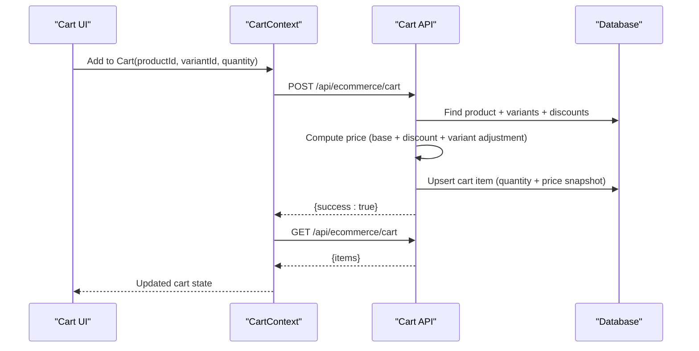
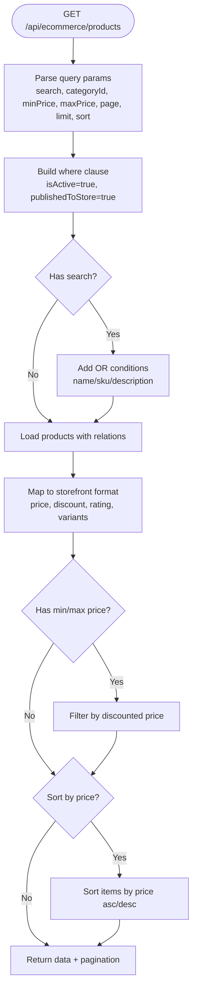
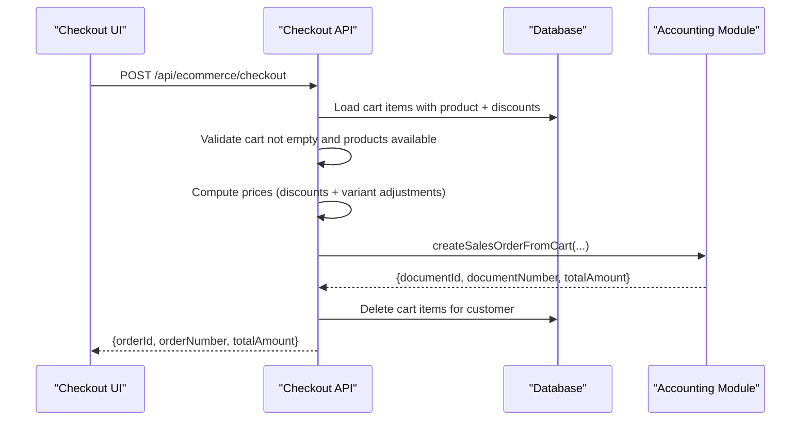
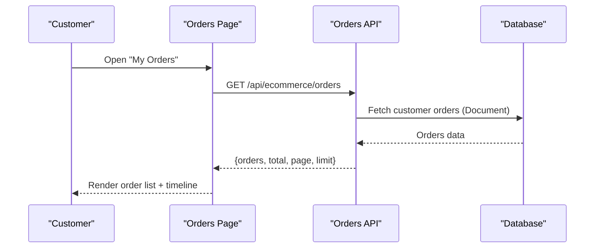
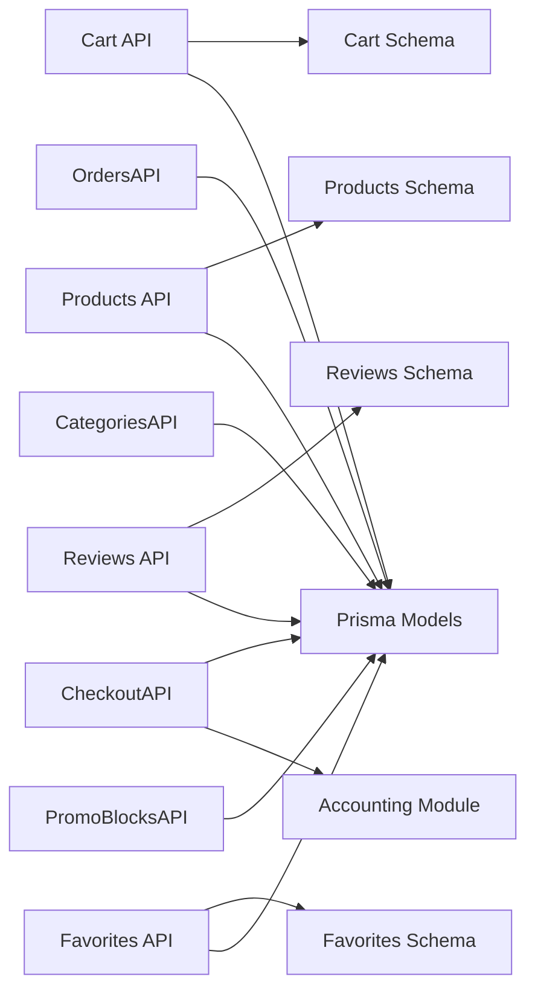

# E-commerce Module

<cite>
**Referenced Files in This Document**
- [storefront layout](file://app/store/layout.tsx)
- [cart API](file://app/api/ecommerce/cart/route.ts)
- [cart context](file://components/ecommerce/CartContext.tsx)
- [products API](file://app/api/ecommerce/products/route.ts)
- [orders API](file://app/api/ecommerce/orders/route.ts)
- [checkout API](file://app/api/ecommerce/checkout/route.ts)
- [reviews API](file://app/api/ecommerce/reviews/route.ts)
- [promo blocks API](file://app/api/ecommerce/promo-blocks/route.ts)
- [categories API](file://app/api/ecommerce/categories/route.ts)
- [favorites API](file://app/api/ecommerce/favorites/route.ts)
- [orders page](file://app/store/account/orders/page.tsx)
- [favorites page](file://app/store/account/favorites/page.tsx)
- [product card](file://components/ecommerce/ProductCard.tsx)
- [review form](file://components/ecommerce/ReviewForm.tsx)
- [order timeline](file://components/ecommerce/OrderTimeline.tsx)
- [cart schema](file://lib/modules/ecommerce/schemas/cart.schema.ts)
- [products schema](file://lib/modules/ecommerce/schemas/products.schema.ts)
- [reviews schema](file://lib/modules/ecommerce/schemas/reviews.schema.ts)
- [favorites schema](file://lib/modules/ecommerce/schemas/favorites.schema.ts)
- [accounting module index](file://lib/modules/accounting/index.ts)
- [prisma schema](file://prisma/schema.prisma)
</cite>

## Table of Contents
1. [Introduction](#introduction)
2. [Project Structure](#project-structure)
3. [Core Components](#core-components)
4. [Architecture Overview](#architecture-overview)
5. [Detailed Component Analysis](#detailed-component-analysis)
6. [Dependency Analysis](#dependency-analysis)
7. [Performance Considerations](#performance-considerations)
8. [Troubleshooting Guide](#troubleshooting-guide)
9. [Conclusion](#conclusion)

## Introduction
The ListOpt ERP e-commerce module provides a complete online store integrated with the accounting system. It enables customers to browse products, manage wish lists, maintain a persistent shopping cart, place orders, track order status, and leave product reviews. The module leverages the shared Prisma schema to maintain synchronized data between the storefront and the ERP’s document-centric accounting model, ensuring inventory updates and financial transactions are handled consistently.

## Project Structure
The e-commerce module spans three primary areas:
- Frontend store interface: pages under app/store/* and reusable UI components under components/ecommerce/*
- API routes: app/api/ecommerce/* for storefront operations
- Shared schemas and typing: lib/modules/ecommerce/schemas/*
- Data modeling: prisma/schema.prisma defines the domain entities and relationships

**Diagram sources**
- [storefront layout:1-255](file://app/store/layout.tsx#L1-L255)
- [cart API:1-189](file://app/api/ecommerce/cart/route.ts#L1-L189)
- [cart context:1-195](file://components/ecommerce/CartContext.tsx#L1-L195)
- [products API:1-163](file://app/api/ecommerce/products/route.ts#L1-L163)
- [orders API:1-64](file://app/api/ecommerce/orders/route.ts#L1-L64)
- [checkout API:1-100](file://app/api/ecommerce/checkout/route.ts#L1-L100)
- [reviews API:1-87](file://app/api/ecommerce/reviews/route.ts#L1-L87)
- [promo blocks API:1-21](file://app/api/ecommerce/promo-blocks/route.ts#L1-L21)
- [categories API:1-49](file://app/api/ecommerce/categories/route.ts#L1-L49)
- [favorites API:1-172](file://app/api/ecommerce/favorites/route.ts#L1-L172)
- [orders page:1-330](file://app/store/account/orders/page.tsx#L1-L330)
- [favorites page:1-208](file://app/store/account/favorites/page.tsx#L1-L208)
- [product card:1-89](file://components/ecommerce/ProductCard.tsx#L1-L89)
- [review form:1-200](file://components/ecommerce/ReviewForm.tsx#L1-L200)
- [order timeline:1-107](file://components/ecommerce/OrderTimeline.tsx#L1-L107)
- [cart schema:1-9](file://lib/modules/ecommerce/schemas/cart.schema.ts#L1-L9)
- [products schema:1-19](file://lib/modules/ecommerce/schemas/products.schema.ts#L1-L19)
- [reviews schema:1-11](file://lib/modules/ecommerce/schemas/reviews.schema.ts#L1-L11)
- [favorites schema:1-7](file://lib/modules/ecommerce/schemas/favorites.schema.ts#L1-L7)
- [prisma schema:1-1064](file://prisma/schema.prisma#L1-L1064)

**Section sources**
- [storefront layout:1-255](file://app/store/layout.tsx#L1-L255)
- [cart API:1-189](file://app/api/ecommerce/cart/route.ts#L1-L189)
- [cart context:1-195](file://components/ecommerce/CartContext.tsx#L1-L195)
- [products API:1-163](file://app/api/ecommerce/products/route.ts#L1-L163)
- [orders API:1-64](file://app/api/ecommerce/orders/route.ts#L1-L64)
- [checkout API:1-100](file://app/api/ecommerce/checkout/route.ts#L1-L100)
- [reviews API:1-87](file://app/api/ecommerce/reviews/route.ts#L1-L87)
- [promo blocks API:1-21](file://app/api/ecommerce/promo-blocks/route.ts#L1-L21)
- [categories API:1-49](file://app/api/ecommerce/categories/route.ts#L1-L49)
- [favorites API:1-172](file://app/api/ecommerce/favorites/route.ts#L1-L172)
- [orders page:1-330](file://app/store/account/orders/page.tsx#L1-L330)
- [favorites page:1-208](file://app/store/account/favorites/page.tsx#L1-L208)
- [product card:1-89](file://components/ecommerce/ProductCard.tsx#L1-L89)
- [review form:1-200](file://components/ecommerce/ReviewForm.tsx#L1-L200)
- [order timeline:1-107](file://components/ecommerce/OrderTimeline.tsx#L1-L107)
- [cart schema:1-9](file://lib/modules/ecommerce/schemas/cart.schema.ts#L1-L9)
- [products schema:1-19](file://lib/modules/ecommerce/schemas/products.schema.ts#L1-L19)
- [reviews schema:1-11](file://lib/modules/ecommerce/schemas/reviews.schema.ts#L1-L11)
- [favorites schema:1-7](file://lib/modules/ecommerce/schemas/favorites.schema.ts#L1-L7)
- [prisma schema:1-1064](file://prisma/schema.prisma#L1-L1064)

## Core Components
- Storefront layout and navigation: Provides header, footer, mobile menu, and cart badge integration with the CartProvider.
- Cart context: Centralized state for cart items, totals, and operations (add, remove, update quantity) with optimistic UI and server synchronization.
- Product catalog API: Fetches master products, applies filters and sorting, computes dynamic pricing with discounts and variant adjustments, aggregates ratings, and exposes variant hierarchies.
- Shopping cart API: Manages cart persistence per customer, validates product availability, calculates price snapshots, and upserts items.
- Checkout API: Converts cart items into a sales order document, verifies product availability, computes prices with discounts, clears the cart, and returns order identifiers.
- Orders page: Displays customer orders, status timeline, items, delivery details, and enables review creation after delivery.
- Favorites API: Allows customers to manage favorites with price computation and rating aggregation.
- Reviews API: Enables verified purchase reviews linked to sales orders, with moderation-ready submissions.
- Categories API: Returns hierarchical categories with product counts for storefront navigation.
- Promo blocks API: Exposes active promotional content blocks for homepage/carousel.
- UI components: ProductCard, ReviewForm, OrderTimeline, and CartContext encapsulate presentation and interactions.

**Section sources**
- [storefront layout:1-255](file://app/store/layout.tsx#L1-L255)
- [cart context:1-195](file://components/ecommerce/CartContext.tsx#L1-L195)
- [cart API:1-189](file://app/api/ecommerce/cart/route.ts#L1-L189)
- [products API:1-163](file://app/api/ecommerce/products/route.ts#L1-L163)
- [checkout API:1-100](file://app/api/ecommerce/checkout/route.ts#L1-L100)
- [orders page:1-330](file://app/store/account/orders/page.tsx#L1-L330)
- [favorites API:1-172](file://app/api/ecommerce/favorites/route.ts#L1-L172)
- [reviews API:1-87](file://app/api/ecommerce/reviews/route.ts#L1-L87)
- [categories API:1-49](file://app/api/ecommerce/categories/route.ts#L1-L49)
- [promo blocks API:1-21](file://app/api/ecommerce/promo-blocks/route.ts#L1-L21)
- [product card:1-89](file://components/ecommerce/ProductCard.tsx#L1-L89)
- [review form:1-200](file://components/ecommerce/ReviewForm.tsx#L1-L200)
- [order timeline:1-107](file://components/ecommerce/OrderTimeline.tsx#L1-L107)

## Architecture Overview
The e-commerce module follows a layered architecture:
- Presentation layer: Next.js app pages and components
- API layer: Route handlers under app/api/ecommerce/*
- Domain layer: Shared schemas for validation and typed requests/responses
- Persistence layer: Prisma ORM models in prisma/schema.prisma
- Integration layer: Accounting module functions invoked by checkout to create sales orders

**Diagram sources**
- [storefront layout:1-255](file://app/store/layout.tsx#L1-L255)
- [orders page:1-330](file://app/store/account/orders/page.tsx#L1-L330)
- [favorites page:1-208](file://app/store/account/favorites/page.tsx#L1-L208)
- [cart context:1-195](file://components/ecommerce/CartContext.tsx#L1-L195)
- [cart API:1-189](file://app/api/ecommerce/cart/route.ts#L1-L189)
- [products API:1-163](file://app/api/ecommerce/products/route.ts#L1-L163)
- [orders API:1-64](file://app/api/ecommerce/orders/route.ts#L1-L64)
- [checkout API:1-100](file://app/api/ecommerce/checkout/route.ts#L1-L100)
- [reviews API:1-87](file://app/api/ecommerce/reviews/route.ts#L1-L87)
- [categories API:1-49](file://app/api/ecommerce/categories/route.ts#L1-L49)
- [favorites API:1-172](file://app/api/ecommerce/favorites/route.ts#L1-L172)
- [promo blocks API:1-21](file://app/api/ecommerce/promo-blocks/route.ts#L1-L21)
- [cart schema:1-9](file://lib/modules/ecommerce/schemas/cart.schema.ts#L1-L9)
- [products schema:1-19](file://lib/modules/ecommerce/schemas/products.schema.ts#L1-L19)
- [reviews schema:1-11](file://lib/modules/ecommerce/schemas/reviews.schema.ts#L1-L11)
- [favorites schema:1-7](file://lib/modules/ecommerce/schemas/favorites.schema.ts#L1-L7)
- [accounting module index:1-8](file://lib/modules/accounting/index.ts#L1-L8)
- [prisma schema:1-1064](file://prisma/schema.prisma#L1-L1064)

## Detailed Component Analysis

### Shopping Cart Functionality
The cart is customer-scoped and persisted in the database. The frontend uses a React context provider to manage local state and synchronize with the backend.

Key behaviors:
- Cart retrieval: GET /api/ecommerce/cart returns items with product and variant metadata.
- Add/update item: POST /api/ecommerce/cart validates product availability, computes price with discounts and variant adjustments, and upserts the item.
- Remove item: DELETE /api/ecommerce/cart(itemId) verifies ownership and deletes.
- Frontend operations: add, remove, and adjust quantities are performed via the CartContext, which optimistically updates UI and syncs with the backend.

**Diagram sources**
- [cart context:83-107](file://components/ecommerce/CartContext.tsx#L83-L107)
- [cart API:56-157](file://app/api/ecommerce/cart/route.ts#L56-L157)
- [cart schema:1-9](file://lib/modules/ecommerce/schemas/cart.schema.ts#L1-L9)

**Section sources**
- [cart API:1-189](file://app/api/ecommerce/cart/route.ts#L1-L189)
- [cart context:1-195](file://components/ecommerce/CartContext.tsx#L1-L195)
- [cart schema:1-9](file://lib/modules/ecommerce/schemas/cart.schema.ts#L1-L9)

### Product Catalog System
The catalog presents master products with pricing, variants, ratings, and SEO fields. It supports filtering, pagination, and sorting.

Highlights:
- Filtering: search term, category ID, price range, pagination, and sort options.
- Pricing: base price from sale prices, optional percentage/fixed discount applied, variant price adjustments, and computed price range for variants.
- Ratings: average rating and review count aggregated from published reviews.
- Variants: variant groups and child variants included for master products.

**Diagram sources**
- [products API:8-155](file://app/api/ecommerce/products/route.ts#L8-L155)
- [products schema:1-12](file://lib/modules/ecommerce/schemas/products.schema.ts#L1-L12)

**Section sources**
- [products API:1-163](file://app/api/ecommerce/products/route.ts#L1-L163)
- [products schema:1-19](file://lib/modules/ecommerce/schemas/products.schema.ts#L1-L19)
- [product card:1-89](file://components/ecommerce/ProductCard.tsx#L1-L89)
- [prisma schema:108-166](file://prisma/schema.prisma#L108-L166)

### Checkout and Order Management
Checkout converts the cart into a sales order document via the accounting module, clears the cart, and returns order identifiers. Orders are displayed with a timeline and delivery details.

Key flows:
- Validation: ensures cart is not empty and products are still available.
- Pricing: computes item prices with discounts and variant adjustments.
- Document creation: delegates to accounting module to create a sales order document.
- Post-checkout: cart is cleared; order appears in customer’s order history.

**Diagram sources**
- [checkout API:8-99](file://app/api/ecommerce/checkout/route.ts#L8-L99)
- [orders API:7-63](file://app/api/ecommerce/orders/route.ts#L7-L63)
- [orders page:73-106](file://app/store/account/orders/page.tsx#L73-L106)
- [order timeline:23-106](file://components/ecommerce/OrderTimeline.tsx#L23-L106)

**Section sources**
- [checkout API:1-100](file://app/api/ecommerce/checkout/route.ts#L1-L100)
- [orders API:1-64](file://app/api/ecommerce/orders/route.ts#L1-L64)
- [orders page:1-330](file://app/store/account/orders/page.tsx#L1-L330)
- [order timeline:1-107](file://components/ecommerce/OrderTimeline.tsx#L1-L107)
- [accounting module index:1-8](file://lib/modules/accounting/index.ts#L1-L8)

### Customer Account Management
Customers can view order history, manage favorites, and submit reviews. Authentication is handled via Telegram OAuth, with customer context injected into API routes.

- Orders page: lists orders with status badges, timeline, items, delivery address, and allows review creation.
- Favorites page: displays saved items with pricing and ratings, supports removal.
- Reviews: submitted against sales orders, marked as verified purchase when linked to a confirmed order.

**Diagram sources**
- [orders page:84-106](file://app/store/account/orders/page.tsx#L84-L106)
- [orders API:7-63](file://app/api/ecommerce/orders/route.ts#L7-L63)
- [prisma schema:449-514](file://prisma/schema.prisma#L449-L514)

**Section sources**
- [orders page:1-330](file://app/store/account/orders/page.tsx#L1-L330)
- [favorites page:1-208](file://app/store/account/favorites/page.tsx#L1-L208)
- [orders API:1-64](file://app/api/ecommerce/orders/route.ts#L1-L64)
- [favorites API:1-172](file://app/api/ecommerce/favorites/route.ts#L1-L172)
- [reviews API:1-87](file://app/api/ecommerce/reviews/route.ts#L1-L87)
- [storefront layout:207-254](file://app/store/layout.tsx#L207-L254)

### Promotional Content and Categories
- Promo blocks: GET /api/ecommerce/promo-blocks returns active promotional content blocks.
- Categories: GET /api/ecommerce/categories returns root categories with child categories and product counts.

**Section sources**
- [promo blocks API:1-21](file://app/api/ecommerce/promo-blocks/route.ts#L1-L21)
- [categories API:1-49](file://app/api/ecommerce/categories/route.ts#L1-L49)

### Payment Integration Patterns
- Payment fields in the Document model support payment method and status tracking for sales orders.
- The checkout process sets initial payment status and links external payment identifiers when applicable.
- Payment status synchronization is managed through the Document model and can be extended via webhooks.

Note: The current checkout endpoint initializes payment status and does not implement external payment processing. Payment integration can be extended by invoking payment providers and updating Document.paymentStatus accordingly.

**Section sources**
- [checkout API:74-92](file://app/api/ecommerce/checkout/route.ts#L74-L92)
- [prisma schema:487-498](file://prisma/schema.prisma#L487-L498)

## Dependency Analysis
The e-commerce module depends on:
- Shared validation schemas for request parsing and error handling
- Prisma models for data access and relationships
- Accounting module for document-based order creation
- UI components for presentation and user interactions

**Diagram sources**
- [cart API:1-189](file://app/api/ecommerce/cart/route.ts#L1-L189)
- [products API:1-163](file://app/api/ecommerce/products/route.ts#L1-L163)
- [orders API:1-64](file://app/api/ecommerce/orders/route.ts#L1-L64)
- [checkout API:1-100](file://app/api/ecommerce/checkout/route.ts#L1-L100)
- [reviews API:1-87](file://app/api/ecommerce/reviews/route.ts#L1-L87)
- [categories API:1-49](file://app/api/ecommerce/categories/route.ts#L1-L49)
- [favorites API:1-172](file://app/api/ecommerce/favorites/route.ts#L1-L172)
- [promo blocks API:1-21](file://app/api/ecommerce/promo-blocks/route.ts#L1-L21)
- [cart schema:1-9](file://lib/modules/ecommerce/schemas/cart.schema.ts#L1-L9)
- [products schema:1-19](file://lib/modules/ecommerce/schemas/products.schema.ts#L1-L19)
- [reviews schema:1-11](file://lib/modules/ecommerce/schemas/reviews.schema.ts#L1-L11)
- [favorites schema:1-7](file://lib/modules/ecommerce/schemas/favorites.schema.ts#L1-L7)
- [accounting module index:1-8](file://lib/modules/accounting/index.ts#L1-L8)
- [prisma schema:1-1064](file://prisma/schema.prisma#L1-L1064)

**Section sources**
- [cart API:1-189](file://app/api/ecommerce/cart/route.ts#L1-L189)
- [products API:1-163](file://app/api/ecommerce/products/route.ts#L1-L163)
- [orders API:1-64](file://app/api/ecommerce/orders/route.ts#L1-L64)
- [checkout API:1-100](file://app/api/ecommerce/checkout/route.ts#L1-L100)
- [reviews API:1-87](file://app/api/ecommerce/reviews/route.ts#L1-L87)
- [categories API:1-49](file://app/api/ecommerce/categories/route.ts#L1-L49)
- [favorites API:1-172](file://app/api/ecommerce/favorites/route.ts#L1-L172)
- [promo blocks API:1-21](file://app/api/ecommerce/promo-blocks/route.ts#L1-L21)
- [cart schema:1-9](file://lib/modules/ecommerce/schemas/cart.schema.ts#L1-L9)
- [products schema:1-19](file://lib/modules/ecommerce/schemas/products.schema.ts#L1-L19)
- [reviews schema:1-11](file://lib/modules/ecommerce/schemas/reviews.schema.ts#L1-L11)
- [favorites schema:1-7](file://lib/modules/ecommerce/schemas/favorites.schema.ts#L1-L7)
- [accounting module index:1-8](file://lib/modules/accounting/index.ts#L1-L8)
- [prisma schema:1-1064](file://prisma/schema.prisma#L1-L1064)

## Performance Considerations
- Database queries: Use selective includes and take limits to avoid heavy joins on product listings and cart retrieval.
- Computed fields: Price calculations and rating aggregations are computed in-memory after fetching related records; keep related record counts reasonable.
- Pagination: Enforce strict limits and page bounds to prevent large result sets.
- Caching: Consider caching product listings and categories for frequently accessed data.
- Network efficiency: Batch UI updates with optimistic changes in CartContext to reduce redundant fetches.

## Troubleshooting Guide
Common issues and resolutions:
- Authentication errors: Ensure customer is logged in via Telegram OAuth; API routes enforce customer context and return appropriate errors.
- Cart operations fail: Validate product availability and ensure variant IDs match active variants; check quantity constraints.
- Empty cart during checkout: Verify cart items exist and are still published to store.
- Review submission errors: Confirm product exists and customer has not already reviewed; optionally verify purchase by linking to a confirmed sales order.
- Order history missing: Confirm orders are stored as Document with type sales_order and status suitable for display.

**Section sources**
- [cart API:48-52](file://app/api/ecommerce/cart/route.ts#L48-L52)
- [checkout API:39-52](file://app/api/ecommerce/checkout/route.ts#L39-L52)
- [reviews API:22-39](file://app/api/ecommerce/reviews/route.ts#L22-L39)
- [orders API:7-63](file://app/api/ecommerce/orders/route.ts#L7-L63)
- [storefront layout:215-245](file://app/store/layout.tsx#L215-L245)

## Conclusion
The ListOpt ERP e-commerce module integrates seamlessly with the accounting system by modeling orders as Documents, enabling robust order processing, fulfillment tracking, and financial alignment. The module provides a scalable foundation for product catalogs, cart management, checkout workflows, customer account features, and promotional content, while leveraging shared schemas and Prisma models for consistency and maintainability. Future enhancements can focus on delivery cost calculation, payment provider integration, and webhook-driven payment status synchronization.