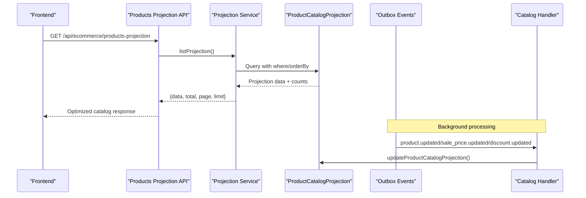
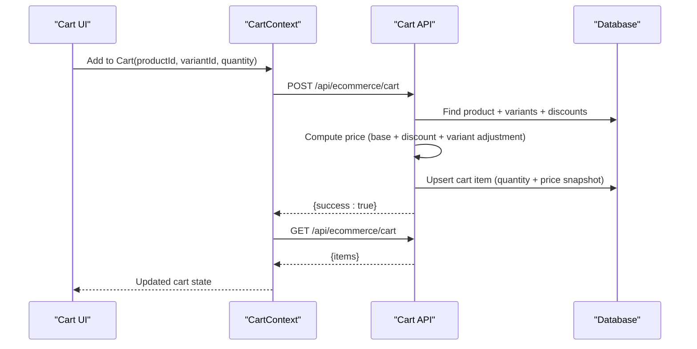
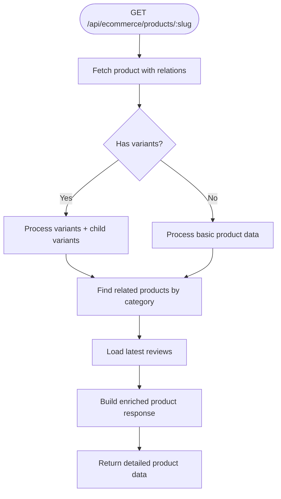
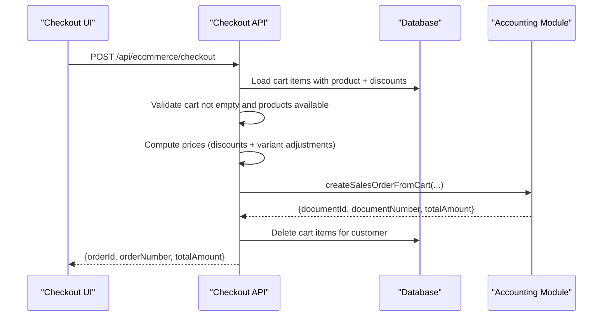
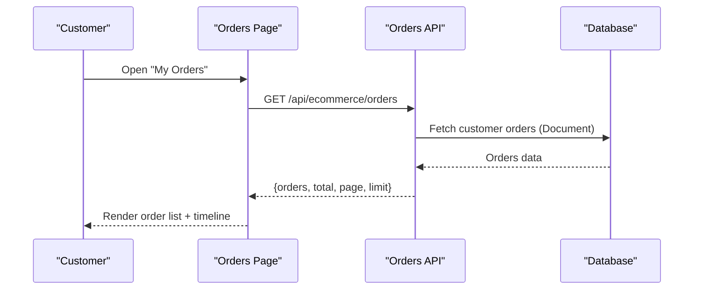
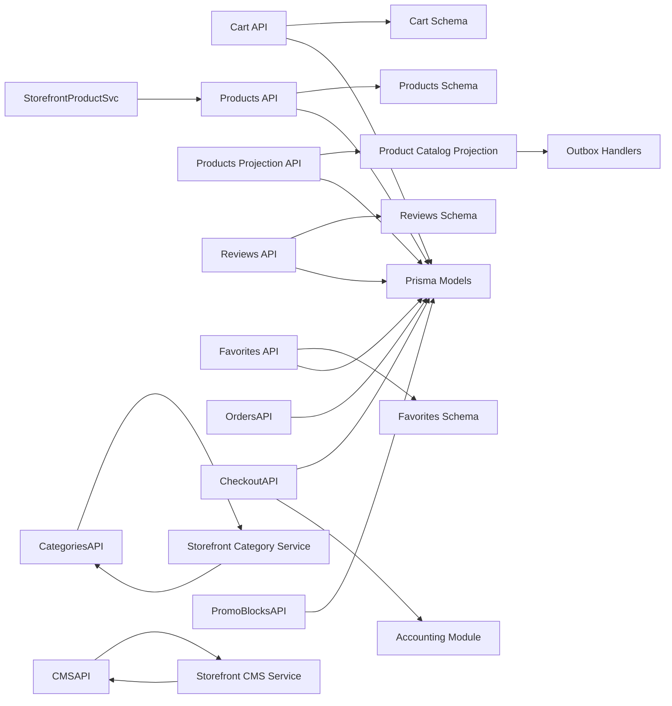

# E-commerce Module

<cite>
**Referenced Files in This Document**
- [storefront layout](file://app/store/layout.tsx)
- [cart API](file://app/api/ecommerce/cart/route.ts)
- [cart context](file://components/ecommerce/CartContext.tsx)
- [products API](file://app/api/ecommerce/products/route.ts)
- [products projection API](file://app/api/ecommerce/products-projection/route.ts)
- [orders API](file://app/api/ecommerce/orders/route.ts)
- [checkout API](file://app/api/ecommerce/checkout/route.ts)
- [reviews API](file://app/api/ecommerce/reviews/route.ts)
- [promo blocks API](file://app/api/ecommerce/promo-blocks/route.ts)
- [categories API](file://app/api/ecommerce/categories/route.ts)
- [favorites API](file://app/api/ecommerce/favorites/route.ts)
- [cms pages API](file://app/api/ecommerce/cms-pages/route.ts)
- [orders page](file://app/store/account/orders/page.tsx)
- [favorites page](file://app/store/account/favorites/page.tsx)
- [product detail page](file://app/store/catalog/[slug]/page.tsx)
- [store page view](file://app/store/pages/[slug]/page.tsx)
- [product card](file://components/ecommerce/ProductCard.tsx)
- [review form](file://components/ecommerce/ReviewForm.tsx)
- [order timeline](file://components/ecommerce/OrderTimeline.tsx)
- [cart schema](file://lib/modules/ecommerce/schemas/cart.schema.ts)
- [products schema](file://lib/modules/ecommerce/schemas/products.schema.ts)
- [reviews schema](file://lib/modules/ecommerce/schemas/reviews.schema.ts)
- [favorites schema](file://lib/modules/ecommerce/schemas/favorites.schema.ts)
- [accounting module index](file://lib/modules/accounting/index.ts)
- [storefront product service](file://lib/modules/ecommerce/services/storefront-product.service.ts)
- [storefront category service](file://lib/modules/ecommerce/services/storefront-category.service.ts)
- [storefront CMS service](file://lib/modules/ecommerce/services/storefront-cms.service.ts)
- [product catalog projection](file://lib/modules/ecommerce/projections/product-catalog.projection.ts)
- [product catalog builder](file://lib/modules/ecommerce/projections/product-catalog.builder.ts)
- [catalog projection types](file://lib/modules/ecommerce/projections/product-catalog.types.ts)
- [catalog handler](file://lib/modules/ecommerce/handlers/catalog-handler.ts)
- [outbox handlers registration](file://lib/events/handlers/register-outbox-handlers.ts)
- [rebuild projection script](file://scripts/rebuild-product-catalog-projection.ts)
- [verify projection script](file://scripts/verify-product-catalog-projection.ts)
- [prisma schema](file://prisma/schema.prisma)
</cite>

## Update Summary
**Changes Made**
- Added new ProductCatalogProjection system for optimized storefront catalog reads
- Enhanced product catalog with dual-read comparison capabilities
- Integrated storefront category and CMS services
- Updated product detail pages with improved variant handling
- Added storefront CMS page routing and navigation
- Enhanced order management with improved status tracking
- Improved cart functionality with better persistence and validation

## Table of Contents
1. [Introduction](#introduction)
2. [Project Structure](#project-structure)
3. [Core Components](#core-components)
4. [Architecture Overview](#architecture-overview)
5. [Detailed Component Analysis](#detailed-component-analysis)
6. [Dependency Analysis](#dependency-analysis)
7. [Performance Considerations](#performance-considerations)
8. [Troubleshooting Guide](#troubleshooting-guide)
9. [Conclusion](#conclusion)

## Introduction
The ListOpt ERP e-commerce module provides a complete online store integrated with the accounting system. It enables customers to browse products, manage wish lists, maintain a persistent shopping cart, place orders, track order status, and leave product reviews. The module leverages the shared Prisma schema to maintain synchronized data between the storefront and the ERP's document-centric accounting model, ensuring inventory updates and financial transactions are handled consistently.

**Updated** The module now features a sophisticated ProductCatalogProjection system that provides optimized read paths for storefront catalog operations, dual-read comparison capabilities for data validation, enhanced storefront integration with category and CMS services, and improved product detail experiences with better variant management.

## Project Structure
The e-commerce module spans three primary areas:
- Frontend store interface: pages under app/store/* and reusable UI components under components/ecommerce/*
- API routes: app/api/ecommerce/* for storefront operations
- Shared services and projections: lib/modules/ecommerce/* for business logic and data optimization
- Data modeling: prisma/schema.prisma defines the domain entities and relationships

```mermaid
graph TB
subgraph "Storefront Pages"
OrdersPage["Orders Page<br/>app/store/account/orders/page.tsx"]
FavoritesPage["Favorites Page<br/>app/store/account/favorites/page.tsx"]
ProductDetail["Product Detail<br/>app/store/catalog/[slug]/page.tsx"]
StorePage["CMS Page<br/>app/store/pages/[slug]/page.tsx"]
end
subgraph "UI Components"
CartCtx["Cart Context<br/>components/ecommerce/CartContext.tsx"]
ProductCard["Product Card<br/>components/ecommerce/ProductCard.tsx"]
ReviewForm["Review Form<br/>components/ecommerce/ReviewForm.tsx"]
OrderTimeline["Order Timeline<br/>components/ecommerce/OrderTimeline.tsx"]
end
subgraph "API Routes"
CartAPI["Cart API<br/>app/api/ecommerce/cart/route.ts"]
ProductsAPI["Products API<br/>app/api/ecommerce/products/route.ts"]
ProductsProjAPI["Products Projection API<br/>app/api/ecommerce/products-projection/route.ts"]
OrdersAPI["Orders API<br/>app/api/ecommerce/orders/route.ts"]
CheckoutAPI["Checkout API<br/>app/api/ecommerce/checkout/route.ts"]
ReviewsAPI["Reviews API<br/>app/api/ecommerce/reviews/route.ts"]
CategoriesAPI["Categories API<br/>app/api/ecommerce/categories/route.ts"]
FavoritesAPI["Favorites API<br/>app/api/ecommerce/favorites/route.ts"]
PromoBlocksAPI["Promo Blocks API<br/>app/api/ecommerce/promo-blocks/route.ts"]
CMSAPI["CMS Pages API<br/>app/api/ecommerce/cms-pages/route.ts"]
end
subgraph "Business Services"
StorefrontProductSvc["Storefront Product Service<br/>lib/modules/ecommerce/services/storefront-product.service.ts"]
StorefrontCategorySvc["Storefront Category Service<br/>lib/modules/ecommerce/services/storefront-category.service.ts"]
StorefrontCMSSvc["Storefront CMS Service<br/>lib/modules/ecommerce/services/storefront-cms.service.ts"]
end
subgraph "Data Optimization"
Projection["Product Catalog Projection<br/>lib/modules/ecommerce/projections/product-catalog.projection.ts"]
Builder["Projection Builder<br/>lib/modules/ecommerce/projections/product-catalog.builder.ts"]
Types["Projection Types<br/>lib/modules/ecommerce/projections/product-catalog.types.ts"]
end
subgraph "Shared Schemas"
CartSchema["Cart Schema<br/>lib/modules/ecommerce/schemas/cart.schema.ts"]
ProductsSchema["Products Schema<br/>lib/modules/ecommerce/schemas/products.schema.ts"]
ReviewsSchema["Reviews Schema<br/>lib/modules/ecommerce/schemas/reviews.schema.ts"]
FavoritesSchema["Favorites Schema<br/>lib/modules/ecommerce/schemas/favorites.schema.ts"]
end
subgraph "Data Model"
PrismaSchema["Prisma Schema<br/>prisma/schema.prisma"]
OutboxHandlers["Outbox Handlers<br/>lib/events/handlers/register-outbox-handlers.ts"]
RebuildScript["Rebuild Script<br/>scripts/rebuild-product-catalog-projection.ts"]
VerifyScript["Verify Script<br/>scripts/verify-product-catalog-projection.ts"]
end
OrdersPage --> OrdersAPI
FavoritesPage --> FavoritesAPI
ProductDetail --> ProductsAPI
StorePage --> CMSAPI
CartCtx --> CartAPI
ProductCard --> ProductsAPI
ReviewForm --> ReviewsAPI
OrdersPage --> OrderTimeline
CartAPI --> PrismaSchema
ProductsAPI --> PrismaSchema
ProductsProjAPI --> Projection
OrdersAPI --> PrismaSchema
CheckoutAPI --> PrismaSchema
ReviewsAPI --> PrismaSchema
CategoriesAPI --> StorefrontCategorySvc
FavoritesAPI --> PrismaSchema
PromoBlocksAPI --> PrismaSchema
CMSAPI --> StorefrontCMSSvc
CartAPI --> CartSchema
ProductsAPI --> ProductsSchema
ProductsProjAPI --> ProductsSchema
ReviewsAPI --> ReviewsSchema
FavoritesAPI --> FavoritesSchema
Projection --> OutboxHandlers
Builder --> Projection
StorefrontProductSvc --> ProductsAPI
StorefrontCategorySvc --> CategoriesAPI
StorefrontCMSSvc --> CMSAPI
```



**Diagram sources**
- [storefront layout:1-116](file://app/store/layout.tsx#L1-L116)
- [orders page:1-330](file://app/store/account/orders/page.tsx#L1-L330)
- [favorites page:1-208](file://app/store/account/favorites/page.tsx#L1-L208)
- [product detail page:1-358](file://app/store/catalog/[slug]/page.tsx#L1-L358)
- [store page view:1-97](file://app/store/pages/[slug]/page.tsx#L1-L97)
- [cart context:1-195](file://components/ecommerce/CartContext.tsx#L1-L195)
- [product card:1-43](file://components/ecommerce/ProductCard.tsx#L1-L43)
- [review form:1-200](file://components/ecommerce/ReviewForm.tsx#L1-L200)
- [order timeline:1-107](file://components/ecommerce/OrderTimeline.tsx#L1-L107)
- [cart API:1-189](file://app/api/ecommerce/cart/route.ts#L1-L189)
- [products API:1-117](file://app/api/ecommerce/products/route.ts#L1-L117)
- [products projection API:1-172](file://app/api/ecommerce/products-projection/route.ts#L1-L172)
- [orders API:1-64](file://app/api/ecommerce/orders/route.ts#L1-L64)
- [checkout API:1-100](file://app/api/ecommerce/checkout/route.ts#L1-L100)
- [reviews API:1-87](file://app/api/ecommerce/reviews/route.ts#L1-L87)
- [categories API:1-31](file://app/api/ecommerce/categories/route.ts#L1-L31)
- [favorites API:1-172](file://app/api/ecommerce/favorites/route.ts#L1-L172)
- [promo blocks API:1-21](file://app/api/ecommerce/promo-blocks/route.ts#L1-L21)
- [cms pages API:1-25](file://app/api/ecommerce/cms-pages/route.ts#L1-L25)
- [cart schema:1-9](file://lib/modules/ecommerce/schemas/cart.schema.ts#L1-L9)
- [products schema:1-19](file://lib/modules/ecommerce/schemas/products.schema.ts#L1-L19)
- [reviews schema:1-11](file://lib/modules/ecommerce/schemas/reviews.schema.ts#L1-L11)
- [favorites schema:1-7](file://lib/modules/ecommerce/schemas/favorites.schema.ts#L1-L7)
- [storefront product service:1-248](file://lib/modules/ecommerce/services/storefront-product.service.ts#L1-L248)
- [storefront category service:1-23](file://lib/modules/ecommerce/services/storefront-category.service.ts#L1-L23)
- [storefront cms service:1-26](file://lib/modules/ecommerce/services/storefront-cms.service.ts#L1-L26)
- [product catalog projection:1-64](file://lib/modules/ecommerce/projections/product-catalog.projection.ts#L1-L64)
- [product catalog builder:1-185](file://lib/modules/ecommerce/projections/product-catalog.builder.ts#L1-L185)
- [catalog projection types:1-57](file://lib/modules/ecommerce/projections/product-catalog.types.ts#L1-L57)
- [outbox handlers registration:59-86](file://lib/events/handlers/register-outbox-handlers.ts#L59-L86)
- [rebuild projection script:1-94](file://scripts/rebuild-product-catalog-projection.ts#L1-L94)
- [verify projection script:1-42](file://scripts/verify-product-catalog-projection.ts#L1-L42)
- [prisma schema:1-1064](file://prisma/schema.prisma#L1-L1064)

**Section sources**
- [storefront layout:1-116](file://app/store/layout.tsx#L1-L116)
- [orders page:1-330](file://app/store/account/orders/page.tsx#L1-L330)
- [favorites page:1-208](file://app/store/account/favorites/page.tsx#L1-L208)
- [product detail page:1-358](file://app/store/catalog/[slug]/page.tsx#L1-L358)
- [store page view:1-97](file://app/store/pages/[slug]/page.tsx#L1-L97)
- [cart context:1-195](file://components/ecommerce/CartContext.tsx#L1-L195)
- [product card:1-43](file://components/ecommerce/ProductCard.tsx#L1-L43)
- [review form:1-200](file://components/ecommerce/ReviewForm.tsx#L1-L200)
- [order timeline:1-107](file://components/ecommerce/OrderTimeline.tsx#L1-L107)
- [cart API:1-189](file://app/api/ecommerce/cart/route.ts#L1-L189)
- [products API:1-117](file://app/api/ecommerce/products/route.ts#L1-L117)
- [products projection API:1-172](file://app/api/ecommerce/products-projection/route.ts#L1-L172)
- [orders API:1-64](file://app/api/ecommerce/orders/route.ts#L1-L64)
- [checkout API:1-100](file://app/api/ecommerce/checkout/route.ts#L1-L100)
- [reviews API:1-87](file://app/api/ecommerce/reviews/route.ts#L1-L87)
- [categories API:1-31](file://app/api/ecommerce/categories/route.ts#L1-L31)
- [favorites API:1-172](file://app/api/ecommerce/favorites/route.ts#L1-L172)
- [promo blocks API:1-21](file://app/api/ecommerce/promo-blocks/route.ts#L1-L21)
- [cms pages API:1-25](file://app/api/ecommerce/cms-pages/route.ts#L1-L25)
- [cart schema:1-9](file://lib/modules/ecommerce/schemas/cart.schema.ts#L1-L9)
- [products schema:1-19](file://lib/modules/ecommerce/schemas/products.schema.ts#L1-L19)
- [reviews schema:1-11](file://lib/modules/ecommerce/schemas/reviews.schema.ts#L1-L11)
- [favorites schema:1-7](file://lib/modules/ecommerce/schemas/favorites.schema.ts#L1-L7)
- [storefront product service:1-248](file://lib/modules/ecommerce/services/storefront-product.service.ts#L1-L248)
- [storefront category service:1-23](file://lib/modules/ecommerce/services/storefront-category.service.ts#L1-L23)
- [storefront cms service:1-26](file://lib/modules/ecommerce/services/storefront-cms.service.ts#L1-L26)
- [product catalog projection:1-64](file://lib/modules/ecommerce/projections/product-catalog.projection.ts#L1-L64)
- [product catalog builder:1-185](file://lib/modules/ecommerce/projections/product-catalog.builder.ts#L1-L185)
- [catalog projection types:1-57](file://lib/modules/ecommerce/projections/product-catalog.types.ts#L1-L57)
- [outbox handlers registration:59-86](file://lib/events/handlers/register-outbox-handlers.ts#L59-L86)
- [rebuild projection script:1-94](file://scripts/rebuild-product-catalog-projection.ts#L1-L94)
- [verify projection script:1-42](file://scripts/verify-product-catalog-projection.ts#L1-L42)
- [prisma schema:1-1064](file://prisma/schema.prisma#L1-L1064)

## Core Components
- Storefront layout and navigation: Provides header, footer, mobile menu, and cart badge integration with the CartProvider. Enhanced with CMS page navigation and improved responsive design.
- Cart context: Centralized state for cart items, totals, and operations (add, remove, update quantity) with optimistic UI and server synchronization.
- Product catalog system: Features dual-read approach with optimized ProductCatalogProjection for storefront catalog listing, supporting filtering, pagination, and sorting with enhanced performance.
- Shopping cart API: Manages cart persistence per customer, validates product availability, calculates price snapshots, and upserts items.
- Checkout API: Converts cart items into a sales order document, verifies product availability, computes prices with discounts, clears the cart, and returns order identifiers.
- Orders page: Displays customer orders, status timeline, items, delivery details, and enables review creation after delivery.
- Favorites API: Allows customers to manage favorites with price computation and rating aggregation.
- Reviews API: Enables verified purchase reviews linked to sales orders, with moderation-ready submissions.
- Categories API: Returns hierarchical categories with product counts for storefront navigation.
- Promo blocks API: Exposes active promotional content blocks for homepage/carousel.
- CMS pages API: Provides content management system integration with configurable header/footer placement.
- UI components: ProductCard, ReviewForm, OrderTimeline, and CartContext encapsulate presentation and interactions.
- **New** Product catalog projection: Optimized read model for storefront catalog operations with automatic synchronization via outbox events.
- **New** Storefront services: Dedicated services for product, category, and CMS operations with optimized data access patterns.
- **New** Enhanced product detail pages: Improved product detail experience with better variant handling, related products, and variant links.

**Section sources**
- [storefront layout:1-116](file://app/store/layout.tsx#L1-L116)
- [cart context:1-195](file://components/ecommerce/CartContext.tsx#L1-L195)
- [cart API:1-189](file://app/api/ecommerce/cart/route.ts#L1-L189)
- [products API:1-117](file://app/api/ecommerce/products/route.ts#L1-L117)
- [products projection API:1-172](file://app/api/ecommerce/products-projection/route.ts#L1-L172)
- [checkout API:1-100](file://app/api/ecommerce/checkout/route.ts#L1-L100)
- [orders page:1-330](file://app/store/account/orders/page.tsx#L1-L330)
- [favorites API:1-172](file://app/api/ecommerce/favorites/route.ts#L1-L172)
- [reviews API:1-87](file://app/api/ecommerce/reviews/route.ts#L1-L87)
- [categories API:1-31](file://app/api/ecommerce/categories/route.ts#L1-L31)
- [promo blocks API:1-21](file://app/api/ecommerce/promo-blocks/route.ts#L1-L21)
- [cms pages API:1-25](file://app/api/ecommerce/cms-pages/route.ts#L1-L25)
- [product card:1-43](file://components/ecommerce/ProductCard.tsx#L1-L43)
- [review form:1-200](file://components/ecommerce/ReviewForm.tsx#L1-L200)
- [order timeline:1-107](file://components/ecommerce/OrderTimeline.tsx#L1-L107)
- [storefront product service:1-248](file://lib/modules/ecommerce/services/storefront-product.service.ts#L1-L248)
- [storefront category service:1-23](file://lib/modules/ecommerce/services/storefront-category.service.ts#L1-L23)
- [storefront cms service:1-26](file://lib/modules/ecommerce/services/storefront-cms.service.ts#L1-L26)
- [product catalog projection:1-64](file://lib/modules/ecommerce/projections/product-catalog.projection.ts#L1-L64)
- [product catalog builder:1-185](file://lib/modules/ecommerce/projections/product-catalog.builder.ts#L1-L185)

## Architecture Overview
The e-commerce module follows a layered architecture with enhanced data optimization:
- Presentation layer: Next.js app pages and components with improved storefront experiences
- API layer: Route handlers under app/api/ecommerce/* with dual-read catalog support
- Domain layer: Shared schemas for validation and typed requests/responses
- Business services: Optimized services for product, category, and CMS operations
- Data optimization: ProductCatalogProjection for storefront catalog reads
- Persistence layer: Prisma ORM models in prisma/schema.prisma
- Integration layer: Accounting module functions invoked by checkout to create sales orders
- Event processing: Outbox handlers for automatic projection updates

```mermaid
graph TB
Client["Browser"]
Layout["Storefront Layout<br/>app/store/layout.tsx"]
OrdersPage["Orders Page<br/>app/store/account/orders/page.tsx"]
FavoritesPage["Favorites Page<br/>app/store/account/favorites/page.tsx"]
ProductDetail["Product Detail<br/>app/store/catalog/[slug]/page.tsx"]
StorePage["CMS Page<br/>app/store/pages/[slug]/page.tsx"]
CartCtx["Cart Context<br/>components/ecommerce/CartContext.tsx"]
subgraph "API Layer"
CartAPI["/api/ecommerce/cart<br/>GET/POST/DELETE"]
ProductsAPI["/api/ecommerce/products<br/>GET (Original)"]
ProductsProjAPI["/api/ecommerce/products-projection<br/>GET (Optimized)"]
OrdersAPI["/api/ecommerce/orders<br/>GET"]
CheckoutAPI["/api/ecommerce/checkout<br/>POST"]
ReviewsAPI["/api/ecommerce/reviews<br/>POST"]
CategoriesAPI["/api/ecommerce/categories<br/>GET"]
FavoritesAPI["/api/ecommerce/favorites<br/>GET/POST/DELETE"]
PromoBlocksAPI["/api/ecommerce/promo-blocks<br/>GET"]
CMSAPI["/api/ecommerce/cms-pages<br/>GET"]
end
subgraph "Business Services"
StorefrontProductSvc["StorefrontProductService"]
StorefrontCategorySvc["StorefrontCategoryService"]
StorefrontCMSSvc["StorefrontCMSService"]
end
subgraph "Data Optimization"
Projection["ProductCatalogProjection"]
Builder["ProjectionBuilder"]
Types["ProjectionTypes"]
end
subgraph "Domain"
CartSchema["cart.schema.ts"]
ProductsSchema["products.schema.ts"]
ReviewsSchema["reviews.schema.ts"]
FavoritesSchema["favorites.schema.ts"]
end
subgraph "Persistence"
Prisma["Prisma Schema<br/>prisma/schema.prisma"]
Outbox["Outbox Events"]
end
subgraph "Integration"
AccountingModule["Accounting Module<br/>lib/modules/accounting/index.ts"]
End
Client --> Layout
Layout --> OrdersPage
Layout --> FavoritesPage
Layout --> ProductDetail
Layout --> StorePage
Layout --> CartCtx
OrdersPage --> OrdersAPI
FavoritesPage --> FavoritesAPI
ProductDetail --> ProductsAPI
StorePage --> CMSAPI
CartCtx --> CartAPI
ProductsAPI --> StorefrontProductSvc
ProductsProjAPI --> Projection
CategoriesAPI --> StorefrontCategorySvc
CMSAPI --> StorefrontCMSSvc
StorefrontProductSvc --> Prisma
StorefrontCategorySvc --> Prisma
StorefrontCMSSvc --> Prisma
Projection --> Builder
Projection --> Outbox
ProductsAPI --> CartSchema
ProductsProjAPI --> ProductsSchema
ReviewsAPI --> ReviewsSchema
FavoritesAPI --> FavoritesSchema
CheckoutAPI --> AccountingModule
```

**Diagram sources**
- [storefront layout:1-116](file://app/store/layout.tsx#L1-L116)
- [orders page:1-330](file://app/store/account/orders/page.tsx#L1-L330)
- [favorites page:1-208](file://app/store/account/favorites/page.tsx#L1-L208)
- [product detail page:1-358](file://app/store/catalog/[slug]/page.tsx#L1-L358)
- [store page view:1-97](file://app/store/pages/[slug]/page.tsx#L1-L97)
- [cart context:1-195](file://components/ecommerce/CartContext.tsx#L1-L195)
- [cart API:1-189](file://app/api/ecommerce/cart/route.ts#L1-L189)
- [products API:1-117](file://app/api/ecommerce/products/route.ts#L1-L117)
- [products projection API:1-172](file://app/api/ecommerce/products-projection/route.ts#L1-L172)
- [orders API:1-64](file://app/api/ecommerce/orders/route.ts#L1-L64)
- [checkout API:1-100](file://app/api/ecommerce/checkout/route.ts#L1-L100)
- [reviews API:1-87](file://app/api/ecommerce/reviews/route.ts#L1-L87)
- [categories API:1-31](file://app/api/ecommerce/categories/route.ts#L1-L31)
- [favorites API:1-172](file://app/api/ecommerce/favorites/route.ts#L1-L172)
- [promo blocks API:1-21](file://app/api/ecommerce/promo-blocks/route.ts#L1-L21)
- [cms pages API:1-25](file://app/api/ecommerce/cms-pages/route.ts#L1-L25)
- [cart schema:1-9](file://lib/modules/ecommerce/schemas/cart.schema.ts#L1-L9)
- [products schema:1-19](file://lib/modules/ecommerce/schemas/products.schema.ts#L1-L19)
- [reviews schema:1-11](file://lib/modules/ecommerce/schemas/reviews.schema.ts#L1-L11)
- [favorites schema:1-7](file://lib/modules/ecommerce/schemas/favorites.schema.ts#L1-L7)
- [storefront product service:1-248](file://lib/modules/ecommerce/services/storefront-product.service.ts#L1-L248)
- [storefront category service:1-23](file://lib/modules/ecommerce/services/storefront-category.service.ts#L1-L23)
- [storefront cms service:1-26](file://lib/modules/ecommerce/services/storefront-cms.service.ts#L1-L26)
- [product catalog projection:1-64](file://lib/modules/ecommerce/projections/product-catalog.projection.ts#L1-L64)
- [product catalog builder:1-185](file://lib/modules/ecommerce/projections/product-catalog.builder.ts#L1-L185)
- [accounting module index:1-8](file://lib/modules/accounting/index.ts#L1-L8)
- [prisma schema:1-1064](file://prisma/schema.prisma#L1-L1064)

## Detailed Component Analysis

### Enhanced Product Catalog System
**Updated** The product catalog system now features a sophisticated ProductCatalogProjection system that provides optimized read paths for storefront operations.

Key features:
- **Dual-read approach**: Two APIs serve the same contract - `/api/ecommerce/products` (original) and `/api/ecommerce/products-projection` (optimized)
- **Automatic synchronization**: Outbox handlers automatically update the projection when product, price, or discount changes occur
- **Performance optimization**: Projection table contains pre-computed data (prices, ratings, variant counts) for faster catalog loading
- **Comparison validation**: Optional dual-read comparison mode (`compare=true`) validates projection accuracy against original data
- **Index optimization**: Projection table includes strategic indexes for tenant, category, and search performance



**Diagram sources**
- [products projection API:32-144](file://app/api/ecommerce/products-projection/route.ts#L32-L144)
- [storefront product service:168-184](file://lib/modules/ecommerce/services/storefront-product.service.ts#L168-L184)
- [product catalog projection:23-49](file://lib/modules/ecommerce/projections/product-catalog.projection.ts#L23-L49)
- [catalog handler:19-24](file://lib/modules/ecommerce/handlers/catalog-handler.ts#L19-L24)
- [outbox handlers registration:62-73](file://lib/events/handlers/register-outbox-handlers.ts#L62-L73)

**Section sources**
- [products projection API:1-172](file://app/api/ecommerce/products-projection/route.ts#L1-L172)
- [storefront product service:168-248](file://lib/modules/ecommerce/services/storefront-product.service.ts#L168-L248)
- [product catalog projection:1-64](file://lib/modules/ecommerce/projections/product-catalog.projection.ts#L1-L64)
- [product catalog builder:1-185](file://lib/modules/ecommerce/projections/product-catalog.builder.ts#L1-L185)
- [catalog projection types:1-57](file://lib/modules/ecommerce/projections/product-catalog.types.ts#L1-L57)
- [catalog handler:1-24](file://lib/modules/ecommerce/handlers/catalog-handler.ts#L1-L24)
- [outbox handlers registration:59-86](file://lib/events/handlers/register-outbox-handlers.ts#L59-L86)

### Shopping Cart Functionality
The cart is customer-scoped and persisted in the database. The frontend uses a React context provider to manage local state and synchronize with the backend.

Key behaviors:
- Cart retrieval: GET /api/ecommerce/cart returns items with product and variant metadata.
- Add/update item: POST /api/ecommerce/cart validates product availability, computes price with discounts and variant adjustments, and upserts the item.
- Remove item: DELETE /api/ecommerce/cart(itemId) verifies ownership and deletes.
- Frontend operations: add, remove, and adjust quantities are performed via the CartContext, which optimistically updates UI and syncs with the backend.



**Diagram sources**
- [cart context:83-107](file://components/ecommerce/CartContext.tsx#L83-L107)
- [cart API:56-157](file://app/api/ecommerce/cart/route.ts#L56-L157)
- [cart schema:1-9](file://lib/modules/ecommerce/schemas/cart.schema.ts#L1-L9)

**Section sources**
- [cart API:1-189](file://app/api/ecommerce/cart/route.ts#L1-L189)
- [cart context:1-195](file://components/ecommerce/CartContext.tsx#L1-L195)
- [cart schema:1-9](file://lib/modules/ecommerce/schemas/cart.schema.ts#L1-L9)

### Enhanced Product Detail Experience
**Updated** Product detail pages now feature improved variant handling, related products, and variant links for better customer experience.

Key enhancements:
- **Improved variant selection**: Better variant chip components with real-time price updates
- **Related products**: Dynamic related product recommendations based on category
- **Variant links**: Visual representation of product variants with images and pricing
- **Enhanced reviews**: Expanded review system with customer information and verification
- **Better stock indicators**: Improved stock status display with quantity information



**Diagram sources**
- [product detail page:72-95](file://app/store/catalog/[slug]/page.tsx#L72-L95)
- [storefront product service:57-128](file://lib/modules/ecommerce/services/storefront-product.service.ts#L57-L128)

**Section sources**
- [product detail page:1-358](file://app/store/catalog/[slug]/page.tsx#L1-L358)
- [storefront product service:1-248](file://lib/modules/ecommerce/services/storefront-product.service.ts#L1-L248)

### Checkout and Order Management
Checkout converts the cart into a sales order document via the accounting module, clears the cart, and returns order identifiers. Orders are displayed with a timeline and delivery details.

Key flows:
- Validation: ensures cart is not empty and products are still available.
- Pricing: computes item prices with discounts and variant adjustments.
- Document creation: delegates to accounting module to create a sales order document.
- Post-checkout: cart is cleared; order appears in customer's order history.



**Diagram sources**
- [checkout API:8-99](file://app/api/ecommerce/checkout/route.ts#L8-L99)
- [orders API:7-63](file://app/api/ecommerce/orders/route.ts#L7-L63)
- [orders page:73-106](file://app/store/account/orders/page.tsx#L73-L106)
- [order timeline:23-106](file://components/ecommerce/OrderTimeline.tsx#L23-L106)

**Section sources**
- [checkout API:1-100](file://app/api/ecommerce/checkout/route.ts#L1-L100)
- [orders API:1-64](file://app/api/ecommerce/orders/route.ts#L1-L64)
- [orders page:1-330](file://app/store/account/orders/page.tsx#L1-L330)
- [order timeline:1-107](file://components/ecommerce/OrderTimeline.tsx#L1-L107)
- [accounting module index:1-8](file://lib/modules/accounting/index.ts#L1-L8)

### Customer Account Management
Customers can view order history, manage favorites, and submit reviews. Authentication is handled via Telegram OAuth, with customer context injected into API routes.

- Orders page: lists orders with status badges, timeline, items, delivery address, and allows review creation.
- Favorites page: displays saved items with pricing and ratings, supports removal.
- Reviews: submitted against sales orders, marked as verified purchase when linked to a confirmed order.



**Diagram sources**
- [orders page:84-106](file://app/store/account/orders/page.tsx#L84-L106)
- [orders API:7-63](file://app/api/ecommerce/orders/route.ts#L7-L63)
- [prisma schema:449-514](file://prisma/schema.prisma#L449-L514)

**Section sources**
- [orders page:1-330](file://app/store/account/orders/page.tsx#L1-L330)
- [favorites page:1-208](file://app/store/account/favorites/page.tsx#L1-L208)
- [orders API:1-64](file://app/api/ecommerce/orders/route.ts#L1-L64)
- [favorites API:1-172](file://app/api/ecommerce/favorites/route.ts#L1-L172)
- [reviews API:1-87](file://app/api/ecommerce/reviews/route.ts#L1-L87)
- [storefront layout:207-254](file://app/store/layout.tsx#L207-L254)

### Enhanced Promotional Content and Categories
**Updated** Promotional content and categories now feature improved integration with storefront services.

- Promo blocks: GET /api/ecommerce/promo-blocks returns active promotional content blocks.
- Categories: GET /api/ecommerce/categories returns root categories with child categories and product counts using optimized storefront category service.
- **New** CMS pages: GET /api/ecommerce/cms-pages returns configurable content pages for header/footer navigation.

**Section sources**
- [promo blocks API:1-21](file://app/api/ecommerce/promo-blocks/route.ts#L1-L21)
- [categories API:1-31](file://app/api/ecommerce/categories/route.ts#L1-L31)
- [storefront category service:1-23](file://lib/modules/ecommerce/services/storefront-category.service.ts#L1-L23)
- [cms pages API:1-25](file://app/api/ecommerce/cms-pages/route.ts#L1-L25)
- [storefront cms service:1-26](file://lib/modules/ecommerce/services/storefront-cms.service.ts#L1-L26)

### Payment Integration Patterns
- Payment fields in the Document model support payment method and status tracking for sales orders.
- The checkout process sets initial payment status and links external payment identifiers when applicable.
- Payment status synchronization is managed through the Document model and can be extended via webhooks.

Note: The current checkout endpoint initializes payment status and does not implement external payment processing. Payment integration can be extended by invoking payment providers and updating Document.paymentStatus accordingly.

**Section sources**
- [checkout API:74-92](file://app/api/ecommerce/checkout/route.ts#L74-L92)
- [prisma schema:487-498](file://prisma/schema.prisma#L487-L498)

### Storefront CMS Integration
**New** The module now includes comprehensive CMS integration for managing static content pages.

Key features:
- **Content management**: Storefront CMS service manages configurable content pages
- **Navigation integration**: CMS pages can be configured for header/footer placement
- **SEO optimization**: Each CMS page supports SEO title and description fields
- **Rich content**: Supports rich text content rendering for flexible page layouts

**Section sources**
- [storefront cms service:1-26](file://lib/modules/ecommerce/services/storefront-cms.service.ts#L1-L26)
- [cms pages API:1-25](file://app/api/ecommerce/cms-pages/route.ts#L1-L25)
- [store page view:1-97](file://app/store/pages/[slug]/page.tsx#L1-L97)

## Dependency Analysis
The e-commerce module depends on:
- Shared validation schemas for request parsing and error handling
- Prisma models for data access and relationships
- Accounting module for document-based order creation
- UI components for presentation and user interactions
- **New** Product catalog projection system for optimized storefront reads
- **New** Storefront services for business logic isolation
- **New** Outbox handlers for automatic data synchronization



**Diagram sources**
- [cart API:1-189](file://app/api/ecommerce/cart/route.ts#L1-L189)
- [products API:1-117](file://app/api/ecommerce/products/route.ts#L1-L117)
- [products projection API:1-172](file://app/api/ecommerce/products-projection/route.ts#L1-L172)
- [orders API:1-64](file://app/api/ecommerce/orders/route.ts#L1-L64)
- [checkout API:1-100](file://app/api/ecommerce/checkout/route.ts#L1-L100)
- [reviews API:1-87](file://app/api/ecommerce/reviews/route.ts#L1-L87)
- [categories API:1-31](file://app/api/ecommerce/categories/route.ts#L1-L31)
- [favorites API:1-172](file://app/api/ecommerce/favorites/route.ts#L1-L172)
- [promo blocks API:1-21](file://app/api/ecommerce/promo-blocks/route.ts#L1-L21)
- [cms pages API:1-25](file://app/api/ecommerce/cms-pages/route.ts#L1-L25)
- [cart schema:1-9](file://lib/modules/ecommerce/schemas/cart.schema.ts#L1-L9)
- [products schema:1-19](file://lib/modules/ecommerce/schemas/products.schema.ts#L1-L19)
- [reviews schema:1-11](file://lib/modules/ecommerce/schemas/reviews.schema.ts#L1-L11)
- [favorites schema:1-7](file://lib/modules/ecommerce/schemas/favorites.schema.ts#L1-L7)
- [storefront product service:1-248](file://lib/modules/ecommerce/services/storefront-product.service.ts#L1-L248)
- [storefront category service:1-23](file://lib/modules/ecommerce/services/storefront-category.service.ts#L1-L23)
- [storefront cms service:1-26](file://lib/modules/ecommerce/services/storefront-cms.service.ts#L1-L26)
- [product catalog projection:1-64](file://lib/modules/ecommerce/projections/product-catalog.projection.ts#L1-L64)
- [outbox handlers registration:59-86](file://lib/events/handlers/register-outbox-handlers.ts#L59-L86)
- [accounting module index:1-8](file://lib/modules/accounting/index.ts#L1-L8)
- [prisma schema:1-1064](file://prisma/schema.prisma#L1-L1064)

**Section sources**
- [cart API:1-189](file://app/api/ecommerce/cart/route.ts#L1-L189)
- [products API:1-117](file://app/api/ecommerce/products/route.ts#L1-L117)
- [products projection API:1-172](file://app/api/ecommerce/products-projection/route.ts#L1-L172)
- [orders API:1-64](file://app/api/ecommerce/orders/route.ts#L1-L64)
- [checkout API:1-100](file://app/api/ecommerce/checkout/route.ts#L1-L100)
- [reviews API:1-87](file://app/api/ecommerce/reviews/route.ts#L1-L87)
- [categories API:1-31](file://app/api/ecommerce/categories/route.ts#L1-L31)
- [favorites API:1-172](file://app/api/ecommerce/favorites/route.ts#L1-L172)
- [promo blocks API:1-21](file://app/api/ecommerce/promo-blocks/route.ts#L1-L21)
- [cms pages API:1-25](file://app/api/ecommerce/cms-pages/route.ts#L1-L25)
- [cart schema:1-9](file://lib/modules/ecommerce/schemas/cart.schema.ts#L1-L9)
- [products schema:1-19](file://lib/modules/ecommerce/schemas/products.schema.ts#L1-L19)
- [reviews schema:1-11](file://lib/modules/ecommerce/schemas/reviews.schema.ts#L1-L11)
- [favorites schema:1-7](file://lib/modules/ecommerce/schemas/favorites.schema.ts#L1-L7)
- [storefront product service:1-248](file://lib/modules/ecommerce/services/storefront-product.service.ts#L1-L248)
- [storefront category service:1-23](file://lib/modules/ecommerce/services/storefront-category.service.ts#L1-L23)
- [storefront cms service:1-26](file://lib/modules/ecommerce/services/storefront-cms.service.ts#L1-L26)
- [product catalog projection:1-64](file://lib/modules/ecommerce/projections/product-catalog.projection.ts#L1-L64)
- [outbox handlers registration:59-86](file://lib/events/handlers/register-outbox-handlers.ts#L59-L86)
- [accounting module index:1-8](file://lib/modules/accounting/index.ts#L1-L8)
- [prisma schema:1-1064](file://prisma/schema.prisma#L1-L1064)

## Performance Considerations
- Database queries: Use selective includes and take limits to avoid heavy joins on product listings and cart retrieval.
- **New** Projection optimization: ProductCatalogProjection reduces complex joins by storing pre-computed data for catalog operations.
- **New** Dual-read validation: Optional comparison mode helps maintain data consistency between original and projection sources.
- **New** Strategic indexing: Projection table includes indexes for tenant, category, and search operations.
- Computed fields: Price calculations and rating aggregations are computed in-memory after fetching related records; keep related record counts reasonable.
- Pagination: Enforce strict limits and page bounds to prevent large result sets.
- Caching: Consider caching product listings and categories for frequently accessed data.
- Network efficiency: Batch UI updates with optimistic changes in CartContext to reduce redundant fetches.
- **New** Event-driven updates: Outbox handlers ensure projection stays synchronized without manual intervention.

## Troubleshooting Guide
Common issues and resolutions:
- Authentication errors: Ensure customer is logged in via Telegram OAuth; API routes enforce customer context and return appropriate errors.
- Cart operations fail: Validate product availability and ensure variant IDs match active variants; check quantity constraints.
- Empty cart during checkout: Verify cart items exist and are still published to store.
- Review submission errors: Confirm product exists and customer has not already reviewed; optionally verify purchase by linking to a confirmed sales order.
- Order history missing: Confirm orders are stored as Document with type sales_order and status suitable for display.
- **New** Projection synchronization: Use `/api/ecommerce/products-projection?compare=true` to validate projection accuracy.
- **New** Outbox handler issues: Check outbox event processing and ensure product catalog handlers are registered.
- **New** CMS page errors: Verify CMS page configuration and ensure pages are published with proper SEO settings.

**Section sources**
- [cart API:48-52](file://app/api/ecommerce/cart/route.ts#L48-L52)
- [checkout API:39-52](file://app/api/ecommerce/checkout/route.ts#L39-L52)
- [reviews API:22-39](file://app/api/ecommerce/reviews/route.ts#L22-L39)
- [orders API:7-63](file://app/api/ecommerce/orders/route.ts#L7-L63)
- [storefront layout:215-245](file://app/store/layout.tsx#L215-L245)
- [products projection API:36-41](file://app/api/ecommerce/products-projection/route.ts#L36-L41)
- [outbox handlers registration:62-73](file://lib/events/handlers/register-outbox-handlers.ts#L62-L73)

## Conclusion
The ListOpt ERP e-commerce module integrates seamlessly with the accounting system by modeling orders as Documents, enabling robust order processing, fulfillment tracking, and financial alignment. The module provides a scalable foundation for product catalogs, cart management, checkout workflows, customer account features, and promotional content, while leveraging shared schemas and Prisma models for consistency and maintainability.

**Updated** The module now features a sophisticated ProductCatalogProjection system that significantly improves storefront performance through optimized read paths, automatic data synchronization via outbox events, and dual-read comparison capabilities for data validation. Enhanced storefront integration includes improved product detail experiences, CMS page management, and better category navigation. The module continues to evolve with enhanced cart functionality, improved order management, and comprehensive storefront services that provide a modern e-commerce experience while maintaining seamless integration with the ERP's accounting system.