# Order Management

<cite>
**Referenced Files in This Document**
- [app/store/account/orders/page.tsx](file://app/store/account/orders/page.tsx)
- [components/ecommerce/OrderTimeline.tsx](file://components/ecommerce/OrderTimeline.tsx)
- [app/api/ecommerce/orders/route.ts](file://app/api/ecommerce/orders/route.ts)
- [app/api/ecommerce/checkout/route.ts](file://app/api/ecommerce/checkout/route.ts)
- [lib/modules/ecommerce/orders.ts](file://lib/modules/ecommerce/orders.ts)
- [lib/modules/accounting/ecom-orders.ts](file://lib/modules/accounting/ecom-orders.ts)
- [lib/modules/accounting/documents.ts](file://lib/modules/accounting/documents.ts)
- [app/api/ecommerce/orders/quick-order/route.ts](file://app/api/ecommerce/orders/quick-order/route.ts)
- [lib/modules/ecommerce/schemas/quick-order.schema.ts](file://lib/modules/ecommerce/schemas/quick-order.schema.ts)
- [app/store/cart/page.tsx](file://app/store/cart/page.tsx)
- [prisma/schema.prisma](file://prisma/schema.prisma)
- [app/(accounting)/ecommerce/orders/page.tsx](file://app/(accounting)/ecommerce/orders/page.tsx)
- [lib/modules/ecommerce/schemas/products.schema.ts](file://lib/modules/ecommerce/schemas/products.schema.ts)
</cite>

## Table of Contents
1. [Introduction](#introduction)
2. [Project Structure](#project-structure)
3. [Core Components](#core-components)
4. [Architecture Overview](#architecture-overview)
5. [Detailed Component Analysis](#detailed-component-analysis)
6. [Dependency Analysis](#dependency-analysis)
7. [Performance Considerations](#performance-considerations)
8. [Troubleshooting Guide](#troubleshooting-guide)
9. [Conclusion](#conclusion)
10. [Appendices](#appendices)

## Introduction
This document explains the order management system for the e-commerce store integrated with the ERP backend. It covers the order lifecycle from placement through fulfillment, including order states, status tracking, and timeline visualization. It also documents the cart-to-order conversion, customer information collection, payment confirmation, retrieval of orders for customer accounts and admin dashboards, integration with the accounting module for inventory and financial recording, modification capabilities (cancellations), and quick order functionality. Examples of order status components, timeline displays, and order history management are included, along with guidance on notifications and customer communication workflows.

## Project Structure
The order management system spans frontend pages, UI components, API routes, and backend modules:
- Frontend pages: customer order history and cart
- UI components: order timeline visualization
- API routes: customer order retrieval and checkout
- Backend modules: legacy order helpers and accounting-based order flow
- Accounting integration: document generation and stock/financial updates
- Quick order: guest checkout flow

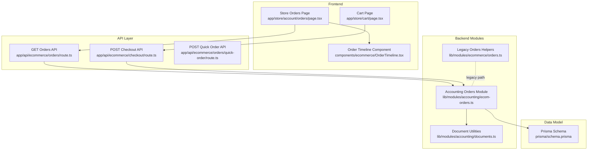

**Diagram sources**
- [app/store/account/orders/page.tsx:1-330](file://app/store/account/orders/page.tsx#L1-L330)
- [components/ecommerce/OrderTimeline.tsx:1-107](file://components/ecommerce/OrderTimeline.tsx#L1-L107)
- [app/api/ecommerce/orders/route.ts:1-64](file://app/api/ecommerce/orders/route.ts#L1-L64)
- [app/api/ecommerce/checkout/route.ts:1-100](file://app/api/ecommerce/checkout/route.ts#L1-L100)
- [lib/modules/ecommerce/orders.ts:1-176](file://lib/modules/ecommerce/orders.ts#L1-L176)
- [lib/modules/accounting/ecom-orders.ts:1-420](file://lib/modules/accounting/ecom-orders.ts#L1-L420)
- [lib/modules/accounting/documents.ts:1-144](file://lib/modules/accounting/documents.ts#L1-L144)
- [prisma/schema.prisma:1-200](file://prisma/schema.prisma#L1-L200)

**Section sources**
- [app/store/account/orders/page.tsx:1-330](file://app/store/account/orders/page.tsx#L1-L330)
- [components/ecommerce/OrderTimeline.tsx:1-107](file://components/ecommerce/OrderTimeline.tsx#L1-L107)
- [app/api/ecommerce/orders/route.ts:1-64](file://app/api/ecommerce/orders/route.ts#L1-L64)
- [app/api/ecommerce/checkout/route.ts:1-100](file://app/api/ecommerce/checkout/route.ts#L1-L100)
- [lib/modules/ecommerce/orders.ts:1-176](file://lib/modules/ecommerce/orders.ts#L1-L176)
- [lib/modules/accounting/ecom-orders.ts:1-420](file://lib/modules/accounting/ecom-orders.ts#L1-L420)
- [lib/modules/accounting/documents.ts:1-144](file://lib/modules/accounting/documents.ts#L1-L144)
- [prisma/schema.prisma:1-200](file://prisma/schema.prisma#L1-L200)

## Core Components
- Order timeline visualization: renders a localized, interactive timeline of order states with timestamps.
- Customer order retrieval: fetches paginated order history for authenticated customers.
- Checkout pipeline: converts cart items into a sales order document, validates availability and pricing, and clears the cart.
- Accounting integration: generates document numbers, confirms payments, updates statuses, and manages cancellations.
- Quick order: allows guest users to place a single-product order without session persistence.
- Data model: defines document types, statuses, and relationships used across the order lifecycle.

**Section sources**
- [components/ecommerce/OrderTimeline.tsx:1-107](file://components/ecommerce/OrderTimeline.tsx#L1-L107)
- [app/api/ecommerce/orders/route.ts:1-64](file://app/api/ecommerce/orders/route.ts#L1-L64)
- [app/api/ecommerce/checkout/route.ts:1-100](file://app/api/ecommerce/checkout/route.ts#L1-L100)
- [lib/modules/accounting/ecom-orders.ts:1-420](file://lib/modules/accounting/ecom-orders.ts#L1-L420)
- [app/api/ecommerce/orders/quick-order/route.ts:1-119](file://app/api/ecommerce/orders/quick-order/route.ts#L1-L119)
- [prisma/schema.prisma:1-200](file://prisma/schema.prisma#L1-L200)

## Architecture Overview
The system uses a dual-layer approach:
- Legacy path: maintains Order entities and helpers for backward compatibility.
- Accounting-first path: stores e-commerce orders as Document records (sales_order) with full ERP integration.

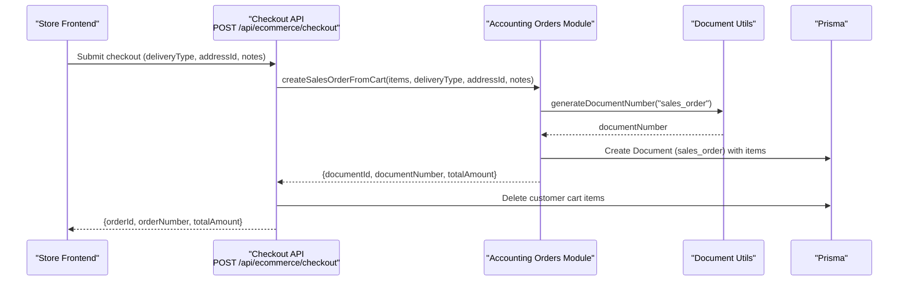

**Diagram sources**
- [app/api/ecommerce/checkout/route.ts:1-100](file://app/api/ecommerce/checkout/route.ts#L1-L100)
- [lib/modules/accounting/ecom-orders.ts:68-154](file://lib/modules/accounting/ecom-orders.ts#L68-L154)
- [lib/modules/accounting/documents.ts:69-78](file://lib/modules/accounting/documents.ts#L69-L78)
- [prisma/schema.prisma:38-63](file://prisma/schema.prisma#L38-L63)

## Detailed Component Analysis

### Order Lifecycle and States
- States: draft, confirmed, shipped, delivered, cancelled.
- Status mapping for UI: pending → draft, paid → confirmed, processing → confirmed, shipped → shipped, delivered → delivered, cancelled → cancelled.
- Timeline component visualizes ordered steps with icons and optional timestamps.

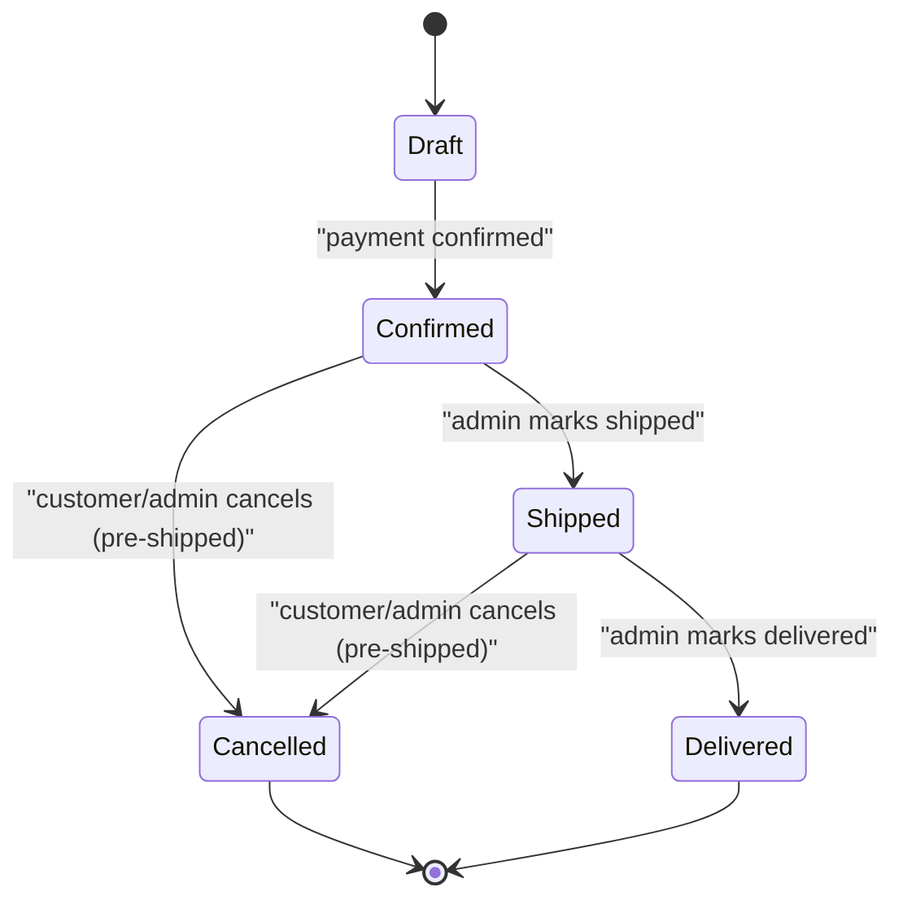

**Diagram sources**
- [lib/modules/accounting/documents.ts:37-43](file://lib/modules/accounting/documents.ts#L37-L43)
- [components/ecommerce/OrderTimeline.tsx:7-13](file://components/ecommerce/OrderTimeline.tsx#L7-L13)
- [app/store/account/orders/page.tsx:50-66](file://app/store/account/orders/page.tsx#L50-L66)

**Section sources**
- [lib/modules/accounting/documents.ts:37-43](file://lib/modules/accounting/documents.ts#L37-L43)
- [components/ecommerce/OrderTimeline.tsx:7-13](file://components/ecommerce/OrderTimeline.tsx#L7-L13)
- [app/store/account/orders/page.tsx:50-66](file://app/store/account/orders/page.tsx#L50-L66)

### Order Creation: Cart-to-Order Conversion
- Validates that the cart is not empty and products are available.
- Calculates item prices with discounts and variant adjustments.
- Creates a sales_order document with items and links to customer and counterparty.
- Clears the cart after successful order creation.

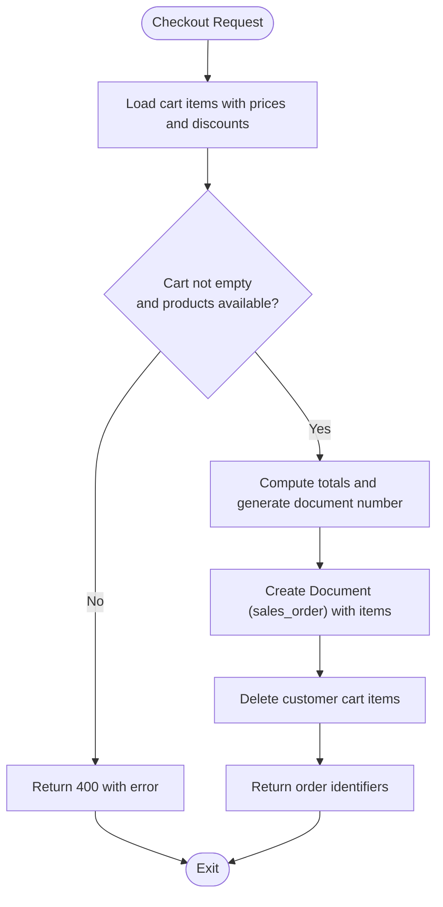

**Diagram sources**
- [app/api/ecommerce/checkout/route.ts:14-86](file://app/api/ecommerce/checkout/route.ts#L14-L86)
- [lib/modules/accounting/ecom-orders.ts:68-154](file://lib/modules/accounting/ecom-orders.ts#L68-L154)
- [lib/modules/accounting/documents.ts:69-78](file://lib/modules/accounting/documents.ts#L69-L78)

**Section sources**
- [app/api/ecommerce/checkout/route.ts:14-86](file://app/api/ecommerce/checkout/route.ts#L14-L86)
- [lib/modules/accounting/ecom-orders.ts:68-154](file://lib/modules/accounting/ecom-orders.ts#L68-L154)
- [lib/modules/accounting/documents.ts:69-78](file://lib/modules/accounting/documents.ts#L69-L78)

### Order Retrieval: Customer Account Access
- API endpoint retrieves customer orders as Document records and paginates results.
- Frontend page renders order cards with status badges, delivery type, item counts, and totals.
- Expands to show timeline, items, delivery address, and totals.

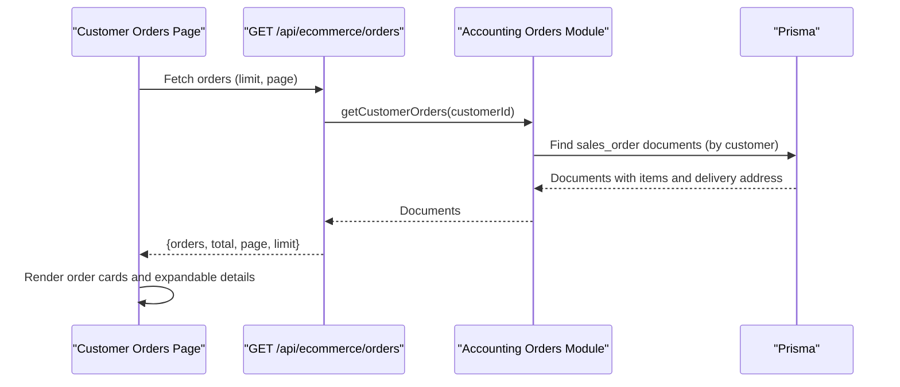

**Diagram sources**
- [app/api/ecommerce/orders/route.ts:8-57](file://app/api/ecommerce/orders/route.ts#L8-L57)
- [lib/modules/accounting/ecom-orders.ts:201-236](file://lib/modules/accounting/ecom-orders.ts#L201-L236)
- [app/store/account/orders/page.tsx:84-106](file://app/store/account/orders/page.tsx#L84-L106)

**Section sources**
- [app/api/ecommerce/orders/route.ts:8-57](file://app/api/ecommerce/orders/route.ts#L8-L57)
- [lib/modules/accounting/ecom-orders.ts:201-236](file://lib/modules/accounting/ecom-orders.ts#L201-L236)
- [app/store/account/orders/page.tsx:84-106](file://app/store/account/orders/page.tsx#L84-L106)

### Order Timeline Visualization
- Displays ordered steps: Created, Paid, Processing, Shipped, Delivered.
- Shows completion icons and optional timestamps for each step.
- Special rendering for cancelled orders.

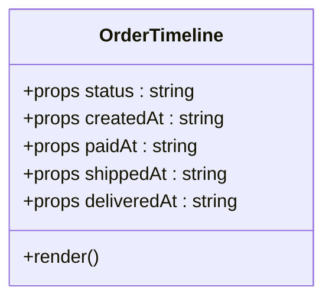

**Diagram sources**
- [components/ecommerce/OrderTimeline.tsx:15-29](file://components/ecommerce/OrderTimeline.tsx#L15-L29)

**Section sources**
- [components/ecommerce/OrderTimeline.tsx:15-29](file://components/ecommerce/OrderTimeline.tsx#L15-L29)

### Accounting Integration: Inventory Deductions and Financial Recording
- Document numbering follows ERP conventions (e.g., sales_order prefix).
- Payment confirmation updates document payment status and moves to confirmed state.
- Cancellation updates status and payment status accordingly.

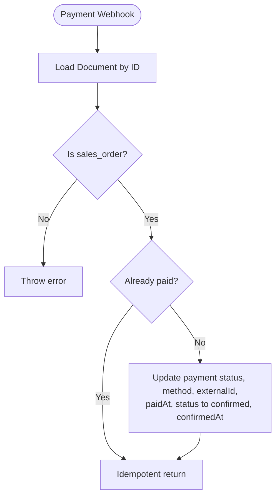

**Diagram sources**
- [lib/modules/accounting/ecom-orders.ts:160-196](file://lib/modules/accounting/ecom-orders.ts#L160-L196)
- [lib/modules/accounting/documents.ts:69-78](file://lib/modules/accounting/documents.ts#L69-L78)

**Section sources**
- [lib/modules/accounting/ecom-orders.ts:160-196](file://lib/modules/accounting/ecom-orders.ts#L160-L196)
- [lib/modules/accounting/documents.ts:69-78](file://lib/modules/accounting/documents.ts#L69-L78)

### Order Modification: Cancellations
- Customers can cancel orders if not shipped or delivered.
- Payment status is adjusted to refunded when cancelling paid orders.

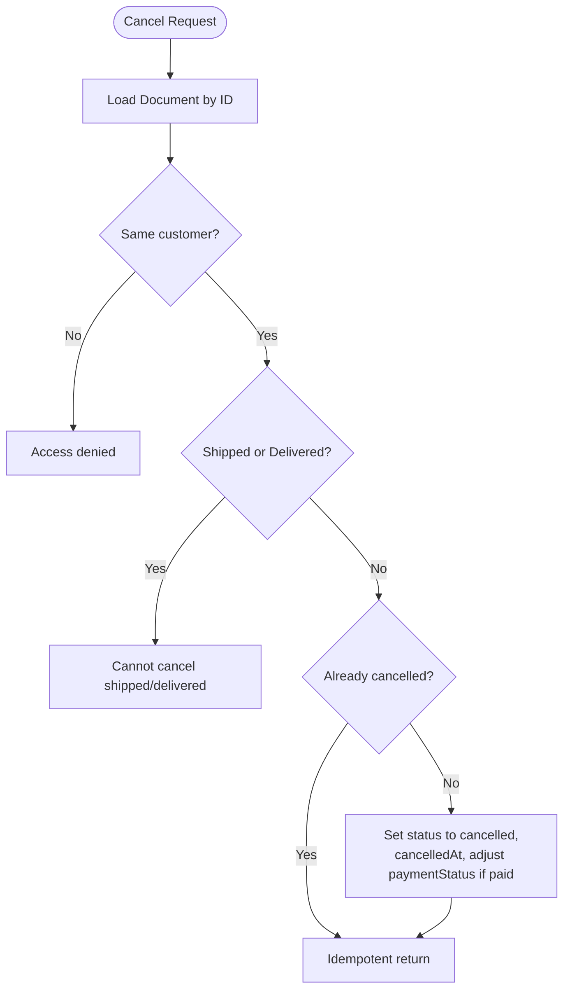

**Diagram sources**
- [lib/modules/accounting/ecom-orders.ts:286-315](file://lib/modules/accounting/ecom-orders.ts#L286-L315)

**Section sources**
- [lib/modules/accounting/ecom-orders.ts:286-315](file://lib/modules/accounting/ecom-orders.ts#L286-L315)

### Returns and Exchanges
- The accounting module defines document types including customer return and supplier return, indicating support for return workflows.
- No explicit API endpoints for initiating returns or exchanges were identified in the reviewed files; these would typically be implemented alongside return document creation and inventory adjustments.

**Section sources**
- [prisma/schema.prisma:46-63](file://prisma/schema.prisma#L46-L63)
- [lib/modules/accounting/ecom-orders.ts:1-420](file://lib/modules/accounting/ecom-orders.ts#L1-L420)

### Bulk Order Processing and Quick Order
- Quick order endpoint accepts a product ID, optional variant, quantity, and customer contact details, then creates a sales_order for a guest customer.
- The endpoint validates product availability and pricing, applies discounts and variant adjustments, and records notes for admin visibility.

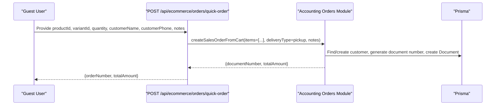

**Diagram sources**
- [app/api/ecommerce/orders/quick-order/route.ts:8-109](file://app/api/ecommerce/orders/quick-order/route.ts#L8-L109)
- [lib/modules/ecommerce/schemas/quick-order.schema.ts:3-10](file://lib/modules/ecommerce/schemas/quick-order.schema.ts#L3-L10)
- [lib/modules/accounting/ecom-orders.ts:68-154](file://lib/modules/accounting/ecom-orders.ts#L68-L154)

**Section sources**
- [app/api/ecommerce/orders/quick-order/route.ts:8-109](file://app/api/ecommerce/orders/quick-order/route.ts#L8-L109)
- [lib/modules/ecommerce/schemas/quick-order.schema.ts:3-10](file://lib/modules/ecommerce/schemas/quick-order.schema.ts#L3-L10)
- [lib/modules/accounting/ecom-orders.ts:68-154](file://lib/modules/accounting/ecom-orders.ts#L68-L154)

### Admin Order Management
- Redirects to the sales page for e-commerce orders.
- The accounting module supports retrieving all e-commerce orders with filtering by status, payment status, and search terms.

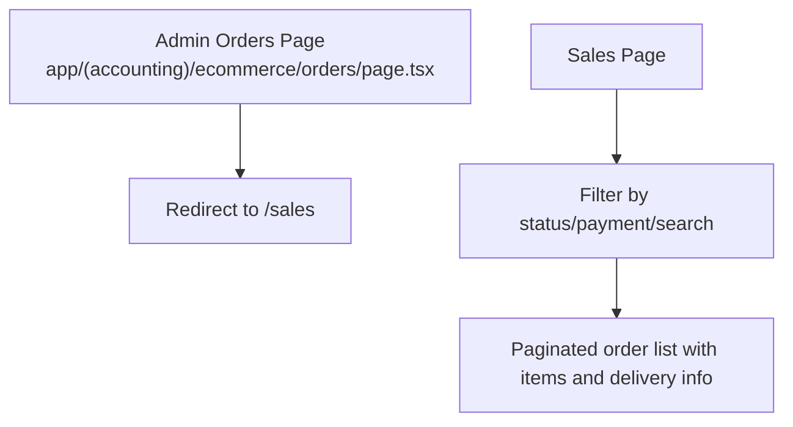

**Diagram sources**
- [app/(accounting)/ecommerce/orders/page.tsx:1-6](file://app/(accounting)/ecommerce/orders/page.tsx#L1-L6)
- [lib/modules/accounting/ecom-orders.ts:355-419](file://lib/modules/accounting/ecom-orders.ts#L355-L419)

**Section sources**
- [app/(accounting)/ecommerce/orders/page.tsx:1-6](file://app/(accounting)/ecommerce/orders/page.tsx#L1-L6)
- [lib/modules/accounting/ecom-orders.ts:355-419](file://lib/modules/accounting/ecom-orders.ts#L355-L419)

## Dependency Analysis
- Frontend depends on API routes for data and UI components for visualization.
- API routes depend on the accounting module for order creation and retrieval.
- The accounting module depends on document utilities for numbering and Prisma models for persistence.
- Legacy order helpers remain for backward compatibility.

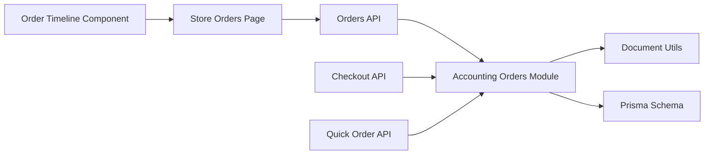

**Diagram sources**
- [app/store/account/orders/page.tsx:1-330](file://app/store/account/orders/page.tsx#L1-L330)
- [app/api/ecommerce/orders/route.ts:1-64](file://app/api/ecommerce/orders/route.ts#L1-L64)
- [lib/modules/accounting/ecom-orders.ts:1-420](file://lib/modules/accounting/ecom-orders.ts#L1-L420)
- [lib/modules/accounting/documents.ts:1-144](file://lib/modules/accounting/documents.ts#L1-L144)
- [prisma/schema.prisma:1-200](file://prisma/schema.prisma#L1-L200)

**Section sources**
- [app/store/account/orders/page.tsx:1-330](file://app/store/account/orders/page.tsx#L1-L330)
- [app/api/ecommerce/orders/route.ts:1-64](file://app/api/ecommerce/orders/route.ts#L1-L64)
- [lib/modules/accounting/ecom-orders.ts:1-420](file://lib/modules/accounting/ecom-orders.ts#L1-L420)
- [lib/modules/accounting/documents.ts:1-144](file://lib/modules/accounting/documents.ts#L1-L144)
- [prisma/schema.prisma:1-200](file://prisma/schema.prisma#L1-L200)

## Performance Considerations
- Pagination: The customer orders API paginates results server-side to avoid large payloads.
- Selective includes: Order retrieval limits selected fields to reduce payload size.
- Transactional writes: Document creation and updates occur in transactions to maintain consistency.
- Client-side caching: Consider caching order lists per customer session to reduce repeated network requests.

[No sources needed since this section provides general guidance]

## Troubleshooting Guide
- Authentication errors: Customer authentication failures redirect to the Telegram auth page and surface user-friendly messages.
- Validation errors: Checkout and quick order endpoints validate inputs and return structured errors.
- Empty cart: Checkout returns a 400 error when the cart is empty.
- Unavailable products: Checkout rejects orders containing unavailable products.
- Payment confirmation: Idempotent handling ensures multiple confirmations do not cause inconsistencies.
- Cancellations: Attempting to cancel shipped or delivered orders fails with a clear error.

**Section sources**
- [app/store/account/orders/page.tsx:92-96](file://app/store/account/orders/page.tsx#L92-L96)
- [app/api/ecommerce/checkout/route.ts:39-52](file://app/api/ecommerce/checkout/route.ts#L39-L52)
- [lib/modules/accounting/ecom-orders.ts:179-181](file://lib/modules/accounting/ecom-orders.ts#L179-L181)
- [lib/modules/accounting/ecom-orders.ts:299-301](file://lib/modules/accounting/ecom-orders.ts#L299-L301)

## Conclusion
The order management system integrates a modern accounting-first approach with a robust e-commerce frontend. It supports the full order lifecycle, real-time status tracking, and administrative oversight. While inventory and financial recording are handled via documents and counters, return/exchange workflows are indicated by document types and can be extended. Quick order and bulk processing capabilities streamline both guest and operator workflows.

[No sources needed since this section summarizes without analyzing specific files]

## Appendices

### Order History Management Example
- The customer orders page fetches recent orders, displays status badges, and expands to show the timeline, items, delivery address, and totals.

**Section sources**
- [app/store/account/orders/page.tsx:84-106](file://app/store/account/orders/page.tsx#L84-L106)
- [app/api/ecommerce/orders/route.ts:8-57](file://app/api/ecommerce/orders/route.ts#L8-L57)

### Notifications and Communication Workflows
- Notification templates and workflows are not present in the reviewed files. Implementations would typically integrate with email providers or messaging channels to notify customers about order confirmation, payment status, shipping, and delivery.

[No sources needed since this section provides general guidance]

### Data Model Highlights
- Document types include sales_order, outgoing_shipment, customer_return, etc.
- Document statuses include draft, confirmed, shipped, delivered, cancelled.
- Relationships tie documents to customers, counterparties, products, and variants.

**Section sources**
- [prisma/schema.prisma:38-63](file://prisma/schema.prisma#L38-L63)
- [prisma/schema.prisma:108-166](file://prisma/schema.prisma#L108-L166)
- [prisma/schema.prisma:229-250](file://prisma/schema.prisma#L229-L250)