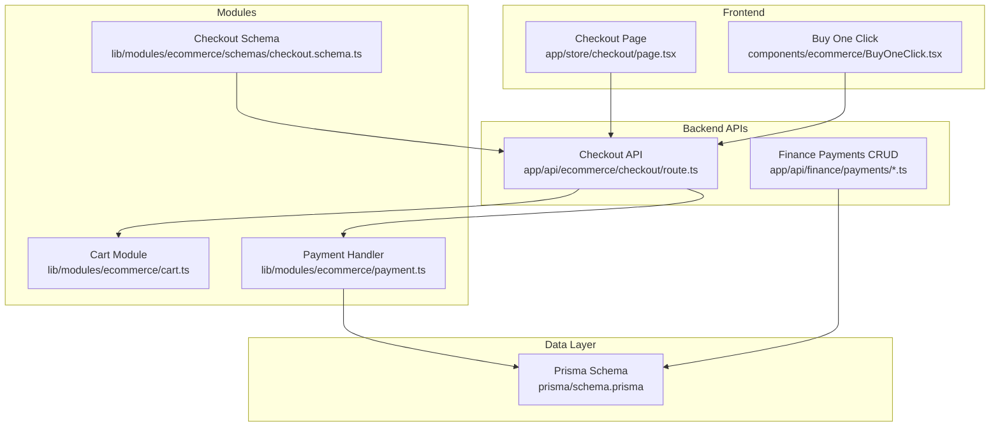
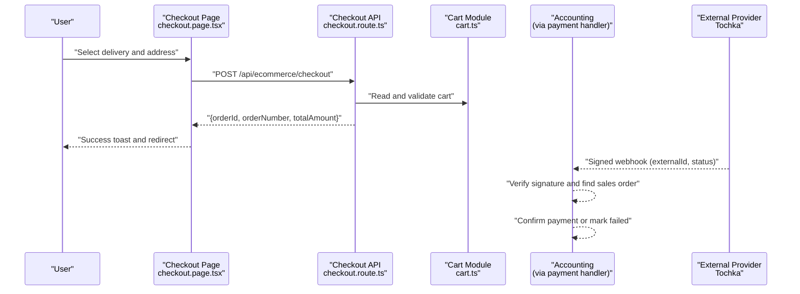
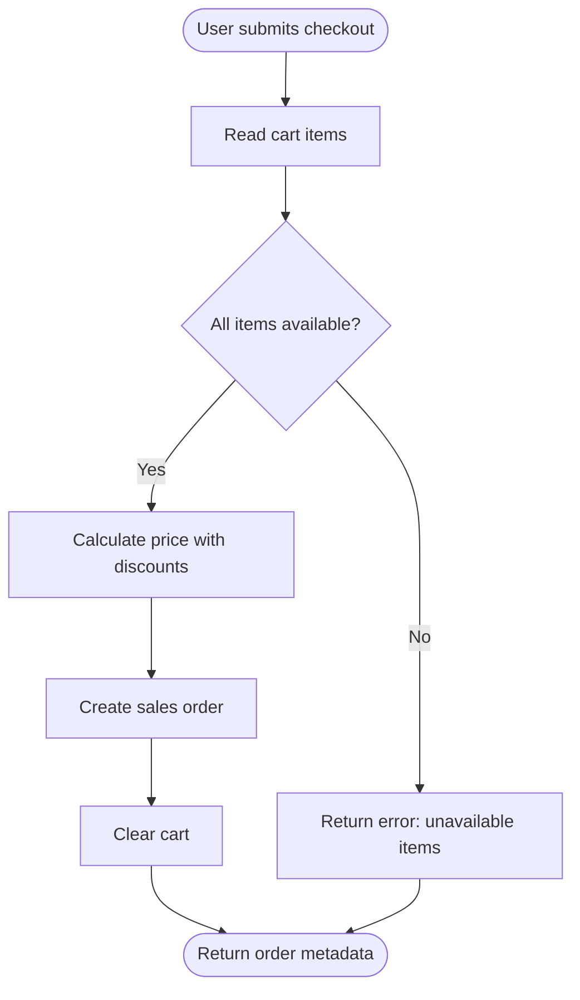
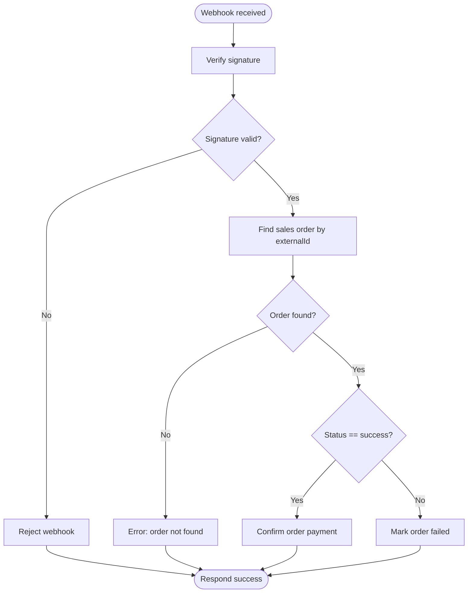
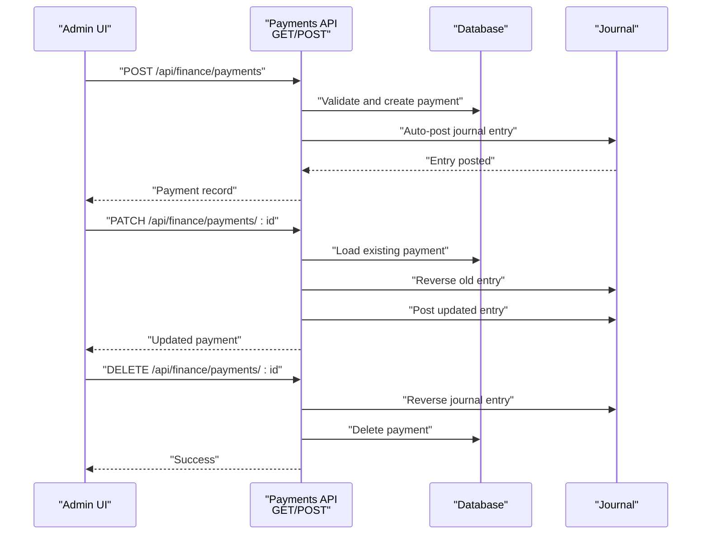
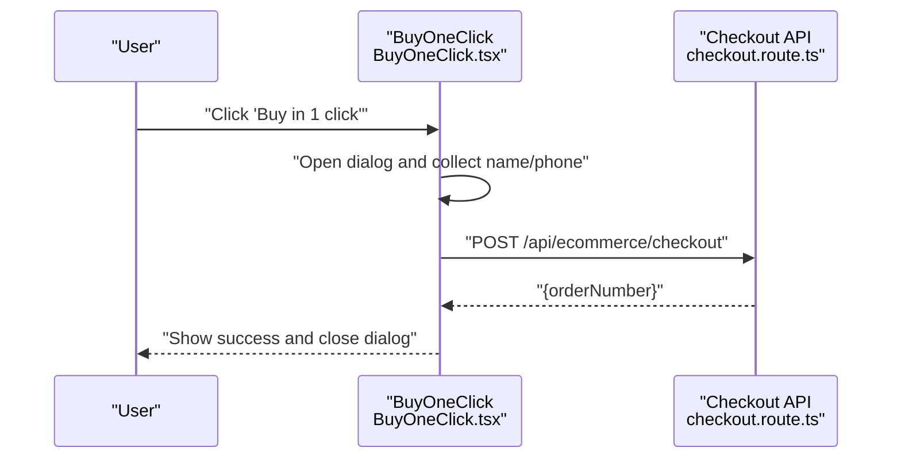
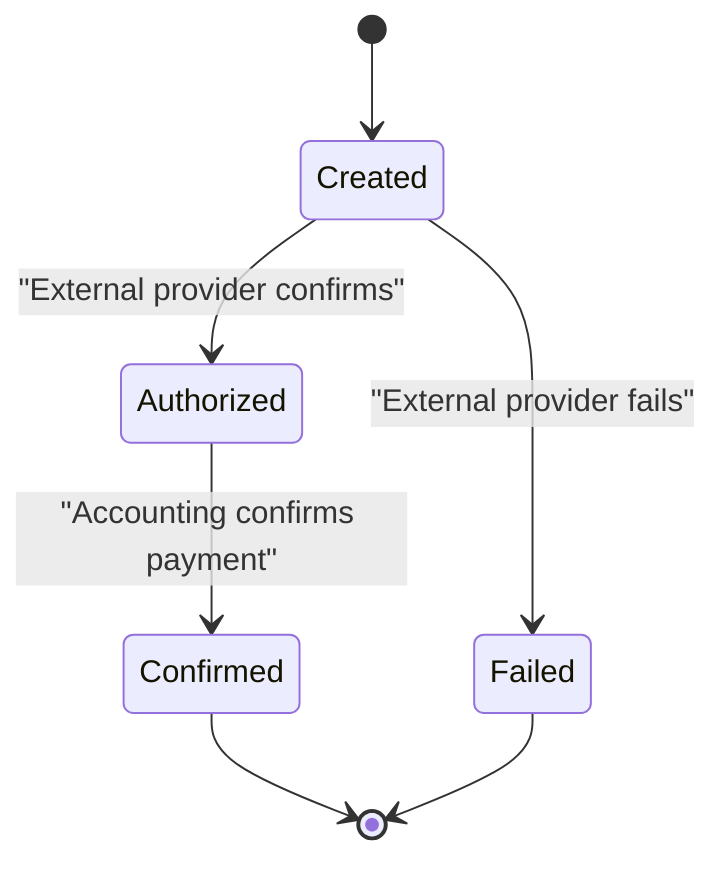
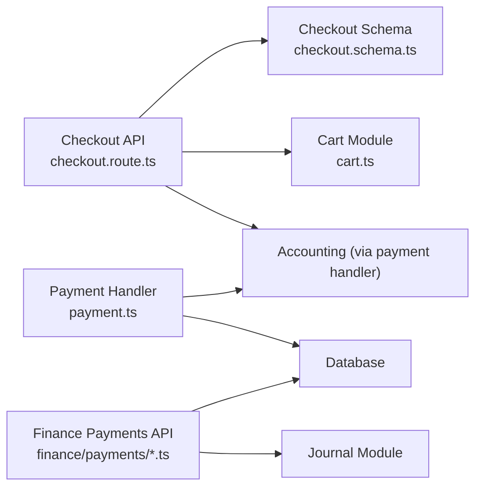

# Payment Integration

<cite>
**Referenced Files in This Document**
- [payment.ts](file://lib/modules/ecommerce/payment.ts)
- [checkout.route.ts](file://app/api/ecommerce/checkout/route.ts)
- [checkout.page.tsx](file://app/store/checkout/page.tsx)
- [cart.ts](file://lib/modules/ecommerce/cart.ts)
- [checkout.schema.ts](file://lib/modules/ecommerce/schemas/checkout.schema.ts)
- [BuyOneClick.tsx](file://components/ecommerce/BuyOneClick.tsx)
- [route.ts](file://app/api/finance/payments/route.ts)
- [route.ts](file://app/api/finance/payments/[id]/route.ts)
- [schema.prisma](file://prisma/schema.prisma)
</cite>

## Table of Contents
1. [Introduction](#introduction)
2. [Project Structure](#project-structure)
3. [Core Components](#core-components)
4. [Architecture Overview](#architecture-overview)
5. [Detailed Component Analysis](#detailed-component-analysis)
6. [Dependency Analysis](#dependency-analysis)
7. [Performance Considerations](#performance-considerations)
8. [Troubleshooting Guide](#troubleshooting-guide)
9. [Conclusion](#conclusion)
10. [Appendices](#appendices)

## Introduction
This document explains the payment integration system in the ERP, focusing on:
- Payment processing workflow: method selection, transaction initiation, and confirmation
- Webhook handling for external payment providers, including Tochka
- Synchronization of payment status between e-commerce orders and accounting financial records
- Buy-now, one-click purchasing and recurring payment support
- Security measures: PCI compliance posture, tokenization, and fraud prevention
- Examples of payment components, checkout forms, and payment status indicators
- Failure handling, retry mechanisms, and customer notifications
- Integration patterns with external payment providers and API authentication

## Project Structure
The payment integration spans frontend checkout pages, backend APIs, and accounting modules. Key areas:
- E-commerce checkout and cart logic
- Payment webhook handlers for external providers
- Finance payment records and journal posting
- One-click purchase UI component
- Prisma schema supporting idempotent webhook processing

**Diagram sources**
- [checkout.page.tsx:1-365](file://app/store/checkout/page.tsx#L1-L365)
- [BuyOneClick.tsx:1-166](file://components/ecommerce/BuyOneClick.tsx#L1-L166)
- [checkout.route.ts:1-100](file://app/api/ecommerce/checkout/route.ts#L1-L100)
- [cart.ts:1-97](file://lib/modules/ecommerce/cart.ts#L1-L97)
- [payment.ts:1-84](file://lib/modules/ecommerce/payment.ts#L1-L84)
- [checkout.schema.ts:1-9](file://lib/modules/ecommerce/schemas/checkout.schema.ts#L1-L9)
- [route.ts:1-113](file://app/api/finance/payments/route.ts#L1-L113)
- [route.ts:1-129](file://app/api/finance/payments/[id]/route.ts#L1-L129)
- [schema.prisma:1057-1066](file://prisma/schema.prisma#L1057-L1066)

**Section sources**
- [checkout.page.tsx:1-365](file://app/store/checkout/page.tsx#L1-L365)
- [checkout.route.ts:1-100](file://app/api/ecommerce/checkout/route.ts#L1-L100)
- [cart.ts:1-97](file://lib/modules/ecommerce/cart.ts#L1-L97)
- [payment.ts:1-84](file://lib/modules/ecommerce/payment.ts#L1-L84)
- [checkout.schema.ts:1-9](file://lib/modules/ecommerce/schemas/checkout.schema.ts#L1-L9)
- [route.ts:1-113](file://app/api/finance/payments/route.ts#L1-L113)
- [route.ts:1-129](file://app/api/finance/payments/[id]/route.ts#L1-L129)
- [schema.prisma:1057-1066](file://prisma/schema.prisma#L1057-L1066)

## Core Components
- Checkout API: Validates delivery type, address, and cart availability; creates a sales order and clears the cart
- Payment handler: Processes Tochka webhooks, verifies signatures, updates order payment status, and confirms payments via accounting
- Finance payments API: Manages cash/bank/card payments, auto-posts journal entries, supports updates and reversals
- Buy-one-click UI: Submits a quick order without requiring a full cart session
- Cart module: Adds items, calculates totals, validates stock availability
- Checkout schema: Zod validation for checkout requests

**Section sources**
- [checkout.route.ts:1-100](file://app/api/ecommerce/checkout/route.ts#L1-L100)
- [payment.ts:1-84](file://lib/modules/ecommerce/payment.ts#L1-L84)
- [route.ts:1-113](file://app/api/finance/payments/route.ts#L1-L113)
- [route.ts:1-129](file://app/api/finance/payments/[id]/route.ts#L1-L129)
- [BuyOneClick.tsx:1-166](file://components/ecommerce/BuyOneClick.tsx#L1-L166)
- [cart.ts:1-97](file://lib/modules/ecommerce/cart.ts#L1-L97)
- [checkout.schema.ts:1-9](file://lib/modules/ecommerce/schemas/checkout.schema.ts#L1-L9)

## Architecture Overview
End-to-end payment flow:
- Customer selects delivery type and address on the checkout page
- Frontend posts to the checkout API, which validates and constructs a sales order
- After payment completion, the external provider sends a signed webhook to the payment handler
- The handler verifies the signature, finds the order by external ID, and either confirms payment or marks failure
- Accounting confirms the order payment and updates financial records accordingly

**Diagram sources**
- [checkout.page.tsx:95-128](file://app/store/checkout/page.tsx#L95-L128)
- [checkout.route.ts:8-99](file://app/api/ecommerce/checkout/route.ts#L8-L99)
- [cart.ts:39-74](file://lib/modules/ecommerce/cart.ts#L39-L74)
- [payment.ts:20-74](file://lib/modules/ecommerce/payment.ts#L20-L74)

## Detailed Component Analysis

### Checkout Workflow
- Frontend collects delivery type, optional address, and notes
- Backend validates cart items, availability, and pricing with discounts
- Creates a sales order and clears the cart
- Returns order metadata for UI feedback

**Diagram sources**
- [checkout.page.tsx:95-128](file://app/store/checkout/page.tsx#L95-L128)
- [checkout.route.ts:14-86](file://app/api/ecommerce/checkout/route.ts#L14-L86)
- [cart.ts:39-74](file://lib/modules/ecommerce/cart.ts#L39-L74)

**Section sources**
- [checkout.page.tsx:95-128](file://app/store/checkout/page.tsx#L95-L128)
- [checkout.route.ts:8-99](file://app/api/ecommerce/checkout/route.ts#L8-L99)
- [checkout.schema.ts:1-9](file://lib/modules/ecommerce/schemas/checkout.schema.ts#L1-L9)
- [cart.ts:39-74](file://lib/modules/ecommerce/cart.ts#L39-L74)

### Payment Webhook Handling (Tochka)
- Signature verification using HMAC-SHA256 with a shared secret
- Lookup sales order by external ID
- On success: confirm payment via accounting module
- On failure: update order payment status to failed

**Diagram sources**
- [payment.ts:20-74](file://lib/modules/ecommerce/payment.ts#L20-L74)

**Section sources**
- [payment.ts:20-74](file://lib/modules/ecommerce/payment.ts#L20-L74)
- [schema.prisma:1057-1066](file://prisma/schema.prisma#L1057-L1066)

### Finance Payments API
- Supports listing payments with filters and pagination
- Creating payments with validation and auto-journal posting
- Updating payments with journal reversal and re-posting
- Deleting payments with journal reversal

**Diagram sources**
- [route.ts:26-112](file://app/api/finance/payments/route.ts#L26-L112)
- [route.ts:16-129](file://app/api/finance/payments/[id]/route.ts#L16-L129)

**Section sources**
- [route.ts:1-113](file://app/api/finance/payments/route.ts#L1-L113)
- [route.ts:1-129](file://app/api/finance/payments/[id]/route.ts#L1-L129)

### Buy-One-Click Purchase
- Opens a dialog to capture customer name and phone
- Submits a quick order request to the backend
- Provides immediate feedback and closes the dialog upon success

**Diagram sources**
- [BuyOneClick.tsx:39-75](file://components/ecommerce/BuyOneClick.tsx#L39-L75)
- [checkout.route.ts:8-99](file://app/api/ecommerce/checkout/route.ts#L8-L99)

**Section sources**
- [BuyOneClick.tsx:1-166](file://components/ecommerce/BuyOneClick.tsx#L1-L166)
- [checkout.route.ts:8-99](file://app/api/ecommerce/checkout/route.ts#L8-L99)

### Payment Status Synchronization
- Sales order payment status is updated by the webhook handler
- Successful payments trigger accounting confirmation, which posts journal entries and updates financial records
- The finance payments API maintains a separate ledger for cash/bank/card transactions

**Diagram sources**
- [payment.ts:44-73](file://lib/modules/ecommerce/payment.ts#L44-L73)
- [route.ts:75-112](file://app/api/finance/payments/route.ts#L75-L112)

**Section sources**
- [payment.ts:44-73](file://lib/modules/ecommerce/payment.ts#L44-L73)
- [route.ts:75-112](file://app/api/finance/payments/route.ts#L75-L112)

## Dependency Analysis
- Checkout API depends on:
  - Cart module for item validation and pricing
  - Accounting module to create sales orders
  - Validation schema for request parsing
- Payment handler depends on:
  - Database to locate orders by external ID
  - Accounting module to confirm payments
  - Environment variable for webhook signature verification
- Finance payments API depends on:
  - Database for persistence
  - Journal module for automatic posting and reversals

**Diagram sources**
- [checkout.route.ts:1-100](file://app/api/ecommerce/checkout/route.ts#L1-L100)
- [checkout.schema.ts:1-9](file://lib/modules/ecommerce/schemas/checkout.schema.ts#L1-L9)
- [cart.ts:1-97](file://lib/modules/ecommerce/cart.ts#L1-L97)
- [payment.ts:1-84](file://lib/modules/ecommerce/payment.ts#L1-L84)
- [route.ts:1-113](file://app/api/finance/payments/route.ts#L1-L113)
- [route.ts:1-129](file://app/api/finance/payments/[id]/route.ts#L1-L129)

**Section sources**
- [checkout.route.ts:1-100](file://app/api/ecommerce/checkout/route.ts#L1-L100)
- [payment.ts:1-84](file://lib/modules/ecommerce/payment.ts#L1-L84)
- [route.ts:1-113](file://app/api/finance/payments/route.ts#L1-L113)
- [route.ts:1-129](file://app/api/finance/payments/[id]/route.ts#L1-L129)

## Performance Considerations
- Minimize database queries in hot paths (e.g., batch reads for cart totals)
- Use pagination and filtering in finance payments listing to avoid large payloads
- Defer non-critical operations (like journal posting) to background tasks when possible
- Cache frequently accessed configuration (e.g., account codes) at startup

## Troubleshooting Guide
Common issues and resolutions:
- Checkout errors
  - Empty cart or unavailable items cause early validation failures
  - Use returned error messages to inform users and prevent submission loops
- Webhook signature verification failures
  - Ensure the shared secret environment variable is configured and matches provider settings
  - Log original payload and signature for debugging
- Order not found by external ID
  - Verify the provider’s external ID generation and storage in the order record
- Payment confirmation vs. failure
  - Confirm accounting confirmation is invoked on success
  - On failure, ensure payment status is updated to failed

Operational checks:
- Confirm webhook endpoint receives signed events and passes signature verification
- Validate that sales order lookup by external ID succeeds
- Ensure finance payment journal entries are created/updated/deleted consistently

**Section sources**
- [checkout.route.ts:39-51](file://app/api/ecommerce/checkout/route.ts#L39-L51)
- [payment.ts:20-27](file://lib/modules/ecommerce/payment.ts#L20-L27)
- [payment.ts:36-42](file://lib/modules/ecommerce/payment.ts#L36-L42)
- [route.ts:44-91](file://app/api/finance/payments/[id]/route.ts#L44-L91)

## Conclusion
The payment integration combines a straightforward checkout flow, robust webhook handling for external providers, and tight synchronization with accounting records. The system supports quick purchases, maintains idempotency for webhooks, and provides a clear audit trail through finance payments and journal entries. Security is addressed through signature verification and separation of concerns between frontend and backend.

## Appendices

### Payment Security Measures
- Signature verification for webhooks using HMAC-SHA256
- Environment-based secrets for provider authentication
- Strict request validation using Zod schemas
- Idempotent webhook processing via stored records

**Section sources**
- [payment.ts:20-27](file://lib/modules/ecommerce/payment.ts#L20-L27)
- [checkout.schema.ts:1-9](file://lib/modules/ecommerce/schemas/checkout.schema.ts#L1-L9)
- [schema.prisma:1057-1066](file://prisma/schema.prisma#L1057-L1066)

### Recurring Payments Support
- Not implemented in the current codebase
- Recommended extension points:
  - Add subscription model and scheduling jobs
  - Extend payment handler to recognize recurring external IDs
  - Integrate with provider webhooks for subscription lifecycle events

[No sources needed since this section provides general guidance]