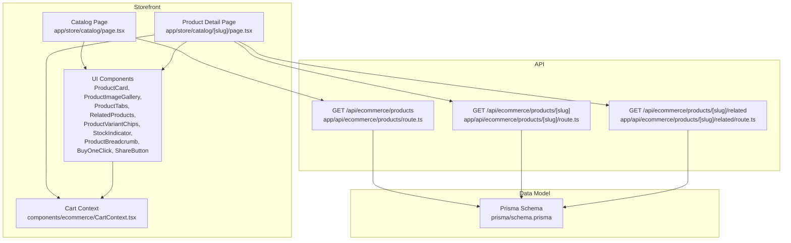
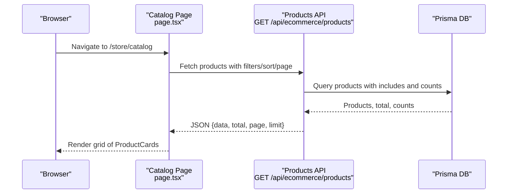
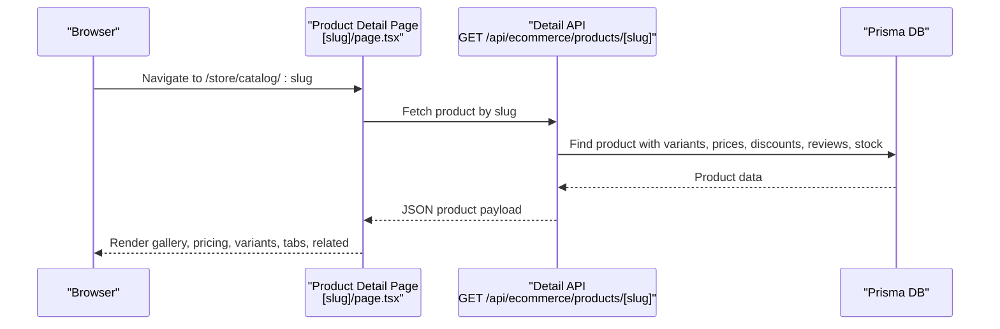
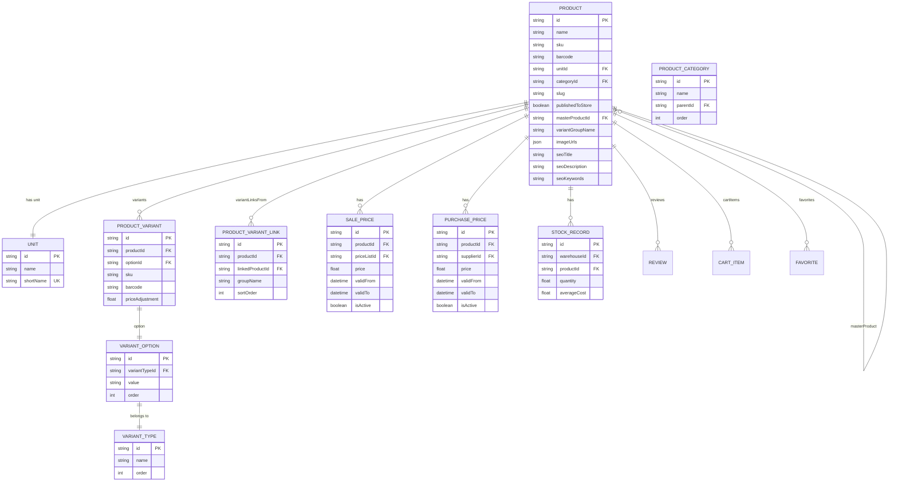
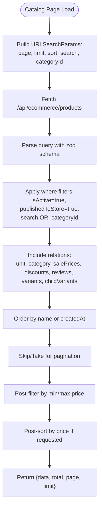
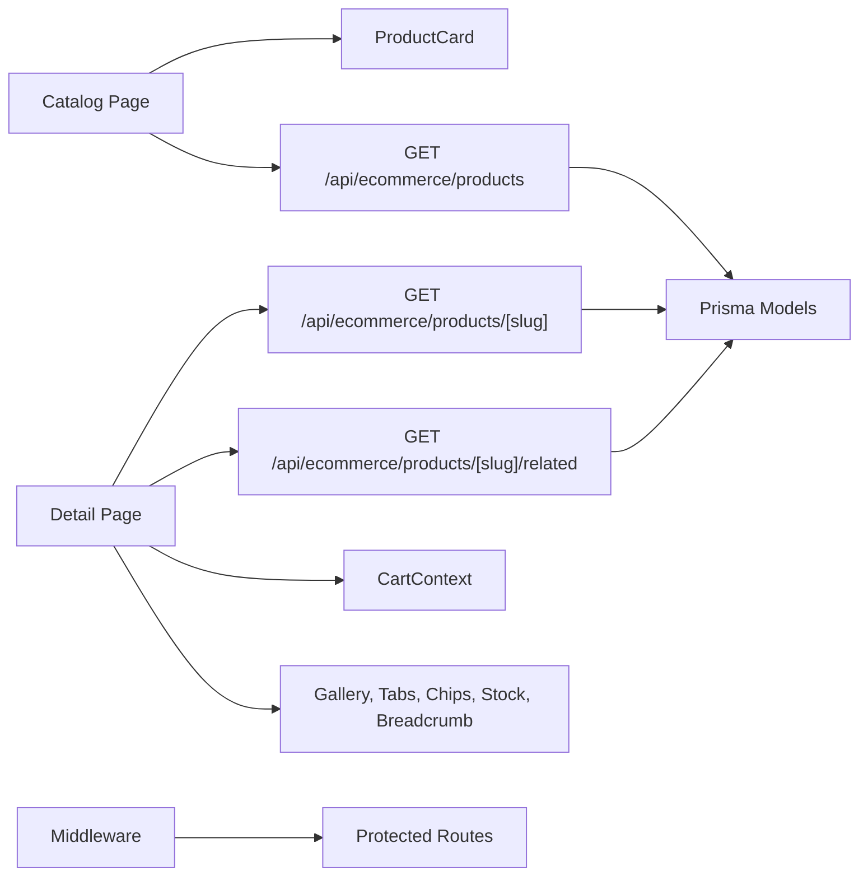

# Product Catalog

<cite>
**Referenced Files in This Document**
- [app/store/catalog/page.tsx](file://app/store/catalog/page.tsx)
- [app/store/catalog/[slug]/page.tsx](file://app/store/catalog/[slug]/page.tsx)
- [components/ecommerce/ProductCard.tsx](file://components/ecommerce/ProductCard.tsx)
- [components/ecommerce/ProductImageGallery.tsx](file://components/ecommerce/ProductImageGallery.tsx)
- [components/ecommerce/RelatedProducts.tsx](file://components/ecommerce/RelatedProducts.tsx)
- [components/ecommerce/ProductVariantChips.tsx](file://components/ecommerce/ProductVariantChips.tsx)
- [components/ecommerce/ProductTabs.tsx](file://components/ecommerce/ProductTabs.tsx)
- [components/ecommerce/ProductBreadcrumb.tsx](file://components/ecommerce/ProductBreadcrumb.tsx)
- [components/ecommerce/StockIndicator.tsx](file://components/ecommerce/StockIndicator.tsx)
- [components/ecommerce/CartContext.tsx](file://components/ecommerce/CartContext.tsx)
- [components/ecommerce/BuyOneClick.tsx](file://components/ecommerce/BuyOneClick.tsx)
- [components/ecommerce/ShareButton.tsx](file://components/ecommerce/ShareButton.tsx)
- [app/api/ecommerce/products/route.ts](file://app/api/ecommerce/products/route.ts)
- [app/api/ecommerce/products/[slug]/route.ts](file://app/api/ecommerce/products/[slug]/route.ts)
- [app/api/ecommerce/products/[slug]/related/route.ts](file://app/api/ecommerce/products/[slug]/related/route.ts)
- [middleware.ts](file://middleware.ts)
- [prisma/schema.prisma](file://prisma/schema.prisma)
- [lib/modules/ecommerce/schemas/products.schema.ts](file://lib/modules/ecommerce/schemas/products.schema.ts)
</cite>

## Table of Contents
1. [Introduction](#introduction)
2. [Project Structure](#project-structure)
3. [Core Components](#core-components)
4. [Architecture Overview](#architecture-overview)
5. [Detailed Component Analysis](#detailed-component-analysis)
6. [Dependency Analysis](#dependency-analysis)
7. [Performance Considerations](#performance-considerations)
8. [Troubleshooting Guide](#troubleshooting-guide)
9. [Conclusion](#conclusion)

## Introduction
This document describes the e-commerce product catalog system, covering the presentation layer (product cards, detailed views, category organization), the product data model (attributes, variants, pricing, inventory), slug-based routing and SEO, filtering and sorting, integration with the main product catalog and ERP, and performance optimizations. It also includes examples of product display components, image galleries, and related product recommendations.

## Project Structure
The product catalog spans frontend pages, UI components, and backend API routes backed by Prisma models. Key areas:
- Storefront catalog listing and detail pages
- Product display components (cards, galleries, tabs, breadcrumbs, stock indicators)
- E-commerce cart and quick-buy flows
- Backend product listing, detail retrieval, and related products
- Middleware enforcing authentication and CSRF protection for protected routes
- Prisma schema modeling products, variants, categories, pricing, and inventory

**Diagram sources**
- [app/store/catalog/page.tsx:23-275](file://app/store/catalog/page.tsx#L23-L275)
- [app/store/catalog/[slug]/page.tsx](file://app/store/catalog/[slug]/page.tsx#L44-L357)
- [components/ecommerce/ProductCard.tsx:27-88](file://components/ecommerce/ProductCard.tsx#L27-L88)
- [components/ecommerce/ProductImageGallery.tsx:15-134](file://components/ecommerce/ProductImageGallery.tsx#L15-L134)
- [components/ecommerce/ProductTabs.tsx:27-137](file://components/ecommerce/ProductTabs.tsx#L27-L137)
- [components/ecommerce/RelatedProducts.tsx:10-40](file://components/ecommerce/RelatedProducts.tsx#L10-L40)
- [components/ecommerce/ProductVariantChips.tsx:19-67](file://components/ecommerce/ProductVariantChips.tsx#L19-L67)
- [components/ecommerce/StockIndicator.tsx:10-32](file://components/ecommerce/StockIndicator.tsx#L10-L32)
- [components/ecommerce/ProductBreadcrumb.tsx:15-35](file://components/ecommerce/ProductBreadcrumb.tsx#L15-L35)
- [components/ecommerce/CartContext.tsx:56-194](file://components/ecommerce/CartContext.tsx#L56-L194)
- [components/ecommerce/BuyOneClick.tsx:26-165](file://components/ecommerce/BuyOneClick.tsx#L26-L165)
- [components/ecommerce/ShareButton.tsx:19-76](file://components/ecommerce/ShareButton.tsx#L19-L76)
- [app/api/ecommerce/products/route.ts:7-162](file://app/api/ecommerce/products/route.ts#L7-L162)
- [app/api/ecommerce/products/[slug]/route.ts](file://app/api/ecommerce/products/[slug]/route.ts#L6-L217)
- [app/api/ecommerce/products/[slug]/related/route.ts](file://app/api/ecommerce/products/[slug]/related/route.ts#L5-L104)
- [prisma/schema.prisma:108-166](file://prisma/schema.prisma#L108-L166)

**Section sources**
- [app/store/catalog/page.tsx:23-275](file://app/store/catalog/page.tsx#L23-L275)
- [app/store/catalog/[slug]/page.tsx](file://app/store/catalog/[slug]/page.tsx#L44-L357)
- [components/ecommerce/ProductCard.tsx:27-88](file://components/ecommerce/ProductCard.tsx#L27-L88)
- [components/ecommerce/ProductImageGallery.tsx:15-134](file://components/ecommerce/ProductImageGallery.tsx#L15-L134)
- [components/ecommerce/ProductTabs.tsx:27-137](file://components/ecommerce/ProductTabs.tsx#L27-L137)
- [components/ecommerce/RelatedProducts.tsx:10-40](file://components/ecommerce/RelatedProducts.tsx#L10-L40)
- [components/ecommerce/ProductVariantChips.tsx:19-67](file://components/ecommerce/ProductVariantChips.tsx#L19-L67)
- [components/ecommerce/StockIndicator.tsx:10-32](file://components/ecommerce/StockIndicator.tsx#L10-L32)
- [components/ecommerce/ProductBreadcrumb.tsx:15-35](file://components/ecommerce/ProductBreadcrumb.tsx#L15-L35)
- [components/ecommerce/CartContext.tsx:56-194](file://components/ecommerce/CartContext.tsx#L56-L194)
- [components/ecommerce/BuyOneClick.tsx:26-165](file://components/ecommerce/BuyOneClick.tsx#L26-L165)
- [components/ecommerce/ShareButton.tsx:19-76](file://components/ecommerce/ShareButton.tsx#L19-L76)
- [app/api/ecommerce/products/route.ts:7-162](file://app/api/ecommerce/products/route.ts#L7-L162)
- [app/api/ecommerce/products/[slug]/route.ts](file://app/api/ecommerce/products/[slug]/route.ts#L6-L217)
- [app/api/ecommerce/products/[slug]/related/route.ts](file://app/api/ecommerce/products/[slug]/related/route.ts#L5-L104)
- [middleware.ts:26-119](file://middleware.ts#L26-L119)
- [prisma/schema.prisma:108-166](file://prisma/schema.prisma#L108-L166)
- [lib/modules/ecommerce/schemas/products.schema.ts:3-12](file://lib/modules/ecommerce/schemas/products.schema.ts#L3-L12)

## Core Components
- Product listing page with search, filters, sorting, pagination, and category sidebar
- Product detail page with gallery, pricing, variants, stock indicator, tabs, related products, and actions
- Reusable UI components for cards, galleries, tabs, breadcrumbs, stock status, variant chips, and sharing
- Cart context for adding items, updating quantities, and removing items
- Quick buy flow for guest customers
- Backend APIs for listing, detail retrieval, and related products with robust filtering and sorting

**Section sources**
- [app/store/catalog/page.tsx:23-275](file://app/store/catalog/page.tsx#L23-L275)
- [app/store/catalog/[slug]/page.tsx](file://app/store/catalog/[slug]/page.tsx#L44-L357)
- [components/ecommerce/ProductCard.tsx:27-88](file://components/ecommerce/ProductCard.tsx#L27-L88)
- [components/ecommerce/ProductImageGallery.tsx:15-134](file://components/ecommerce/ProductImageGallery.tsx#L15-L134)
- [components/ecommerce/ProductTabs.tsx:27-137](file://components/ecommerce/ProductTabs.tsx#L27-L137)
- [components/ecommerce/RelatedProducts.tsx:10-40](file://components/ecommerce/RelatedProducts.tsx#L10-L40)
- [components/ecommerce/ProductVariantChips.tsx:19-67](file://components/ecommerce/ProductVariantChips.tsx#L19-L67)
- [components/ecommerce/StockIndicator.tsx:10-32](file://components/ecommerce/StockIndicator.tsx#L10-L32)
- [components/ecommerce/ProductBreadcrumb.tsx:15-35](file://components/ecommerce/ProductBreadcrumb.tsx#L15-L35)
- [components/ecommerce/CartContext.tsx:56-194](file://components/ecommerce/CartContext.tsx#L56-L194)
- [components/ecommerce/BuyOneClick.tsx:26-165](file://components/ecommerce/BuyOneClick.tsx#L26-L165)
- [components/ecommerce/ShareButton.tsx:19-76](file://components/ecommerce/ShareButton.tsx#L19-L76)

## Architecture Overview
The system follows a client-side Next.js app with serverless API routes. The frontend renders product listings and details, while the backend queries the database via Prisma. Authentication and CSRF protections are enforced by middleware for protected routes.

**Diagram sources**
- [app/store/catalog/page.tsx:37-79](file://app/store/catalog/page.tsx#L37-L79)
- [app/api/ecommerce/products/route.ts:7-162](file://app/api/ecommerce/products/route.ts#L7-L162)

**Section sources**
- [app/store/catalog/page.tsx:23-275](file://app/store/catalog/page.tsx#L23-L275)
- [app/api/ecommerce/products/route.ts:7-162](file://app/api/ecommerce/products/route.ts#L7-L162)
- [middleware.ts:26-119](file://middleware.ts#L26-L119)

## Detailed Component Analysis

### Product Presentation Layer
- Product cards: Display image, discount badge, rating, pricing, and unit. Link to detail page using slug or fallback to id.
- Product detail page: Renders gallery, pricing with discount overlay, variant chips, quantity selector, stock indicator, actions (add to cart, quick buy, favorites, share), tabs (description, characteristics, reviews), variant links, and related products.
- Gallery: Carousel with thumbnails and navigation arrows; handles single/multiple images and priority loading.
- Tabs: Description, characteristics, and reviews with verified purchase badges and formatted dates.
- Breadcrumb: Dynamic path based on category and product name.
- Stock indicator: Color-coded badges for out-of-stock, low stock, and in-stock.
- Variant chips: Grouped by variant type with selectable chips and optional price adjustments.
- Related products: Fetches up to six related items from the same category.

**Diagram sources**
- [app/store/catalog/[slug]/page.tsx](file://app/store/catalog/[slug]/page.tsx#L72-L95)
- [app/api/ecommerce/products/[slug]/route.ts](file://app/api/ecommerce/products/[slug]/route.ts#L14-L100)

**Section sources**
- [components/ecommerce/ProductCard.tsx:27-88](file://components/ecommerce/ProductCard.tsx#L27-L88)
- [components/ecommerce/ProductImageGallery.tsx:15-134](file://components/ecommerce/ProductImageGallery.tsx#L15-L134)
- [components/ecommerce/ProductTabs.tsx:27-137](file://components/ecommerce/ProductTabs.tsx#L27-L137)
- [components/ecommerce/ProductBreadcrumb.tsx:15-35](file://components/ecommerce/ProductBreadcrumb.tsx#L15-L35)
- [components/ecommerce/StockIndicator.tsx:10-32](file://components/ecommerce/StockIndicator.tsx#L10-L32)
- [components/ecommerce/ProductVariantChips.tsx:19-67](file://components/ecommerce/ProductVariantChips.tsx#L19-L67)
- [components/ecommerce/RelatedProducts.tsx:10-40](file://components/ecommerce/RelatedProducts.tsx#L10-L40)
- [app/store/catalog/[slug]/page.tsx](file://app/store/catalog/[slug]/page.tsx#L44-L357)

### Product Data Model and Variant Management
The Prisma schema defines:
- Product entity with name, SKU, barcodes, unit, category, SEO fields, slug, publish flag, variant hierarchy, and relations to variants, variants links, stock records, sale/purchase prices, discounts, reviews, favorites, and cart items.
- Variant types and options enabling multi-dimensional variants (e.g., size/color).
- Variant links for grouping related products under a group name.
- Units, categories, stock records, and movement logs.
- Pricing via sale prices and purchase prices with validity windows.
- Discounts with percentage or fixed value types.

**Diagram sources**
- [prisma/schema.prisma:108-166](file://prisma/schema.prisma#L108-L166)
- [prisma/schema.prisma:204-250](file://prisma/schema.prisma#L204-L250)
- [prisma/schema.prisma:289-303](file://prisma/schema.prisma#L289-L303)
- [prisma/schema.prisma:578-593](file://prisma/schema.prisma#L578-L593)
- [prisma/schema.prisma:560-576](file://prisma/schema.prisma#L560-L576)
- [prisma/schema.prisma:386-400](file://prisma/schema.prisma#L386-L400)

**Section sources**
- [prisma/schema.prisma:108-166](file://prisma/schema.prisma#L108-L166)
- [prisma/schema.prisma:204-250](file://prisma/schema.prisma#L204-L250)
- [prisma/schema.prisma:289-303](file://prisma/schema.prisma#L289-L303)
- [prisma/schema.prisma:578-593](file://prisma/schema.prisma#L578-L593)
- [prisma/schema.prisma:560-576](file://prisma/schema.prisma#L560-L576)
- [prisma/schema.prisma:386-400](file://prisma/schema.prisma#L386-L400)

### Slug-Based Routing and SEO
- Product detail uses dynamic route [slug] to resolve by slug or id.
- SEO fields (title, description, keywords) are returned in the detail API payload for rendering meta tags.
- Breadcrumb navigation reflects category and product name for improved UX and SEO.

**Section sources**
- [app/store/catalog/[slug]/page.tsx](file://app/store/catalog/[slug]/page.tsx#L44-L357)
- [app/api/ecommerce/products/[slug]/route.ts](file://app/api/ecommerce/products/[slug]/route.ts#L205-L210)
- [components/ecommerce/ProductBreadcrumb.tsx:15-35](file://components/ecommerce/ProductBreadcrumb.tsx#L15-L35)

### Filtering, Sorting, and Search
- Catalog page supports:
  - Search across name, SKU, and description
  - Category filtering
  - Sorting by name, newest, price ascending, price descending
  - Pagination with configurable limit
- Backend validates and applies filters/sorts; price sorting is applied post-fetch due to joined price tables.

**Diagram sources**
- [app/store/catalog/page.tsx:37-79](file://app/store/catalog/page.tsx#L37-L79)
- [app/api/ecommerce/products/route.ts:10-155](file://app/api/ecommerce/products/route.ts#L10-L155)
- [lib/modules/ecommerce/schemas/products.schema.ts:3-12](file://lib/modules/ecommerce/schemas/products.schema.ts#L3-L12)

**Section sources**
- [app/store/catalog/page.tsx:23-275](file://app/store/catalog/page.tsx#L23-L275)
- [app/api/ecommerce/products/route.ts:7-162](file://app/api/ecommerce/products/route.ts#L7-L162)
- [lib/modules/ecommerce/schemas/products.schema.ts:3-12](file://lib/modules/ecommerce/schemas/products.schema.ts#L3-L12)

### Integration with Main Product Catalog and ERP
- Product listing and detail APIs filter by isActive and publishedToStore flags to ensure only live items appear in the storefront.
- Variant hierarchy supports master products and child variants; pricing and stock are aggregated for display.
- Variant links enable grouping related variants by group name (e.g., color/size).
- Inventory synchronization:
  - Stock records are summed for availability
  - Child variants contribute to price range and stock visibility
- Pricing updates:
  - Latest active sale price is used
  - Discounts are applied to compute discounted price
  - Price adjustments per variant are considered in detail view

**Section sources**
- [app/api/ecommerce/products/route.ts:15-84](file://app/api/ecommerce/products/route.ts#L15-L84)
- [app/api/ecommerce/products/[slug]/route.ts](file://app/api/ecommerce/products/[slug]/route.ts#L14-L100)
- [prisma/schema.prisma:108-166](file://prisma/schema.prisma#L108-L166)
- [prisma/schema.prisma:289-303](file://prisma/schema.prisma#L289-L303)

### Examples of Product Display Components
- Product cards: [components/ecommerce/ProductCard.tsx:27-88](file://components/ecommerce/ProductCard.tsx#L27-L88)
- Image gallery: [components/ecommerce/ProductImageGallery.tsx:15-134](file://components/ecommerce/ProductImageGallery.tsx#L15-L134)
- Tabs: [components/ecommerce/ProductTabs.tsx:27-137](file://components/ecommerce/ProductTabs.tsx#L27-L137)
- Variant chips: [components/ecommerce/ProductVariantChips.tsx:19-67](file://components/ecommerce/ProductVariantChips.tsx#L19-L67)
- Stock indicator: [components/ecommerce/StockIndicator.tsx:10-32](file://components/ecommerce/StockIndicator.tsx#L10-L32)
- Breadcrumb: [components/ecommerce/ProductBreadcrumb.tsx:15-35](file://components/ecommerce/ProductBreadcrumb.tsx#L15-L35)
- Related products: [components/ecommerce/RelatedProducts.tsx:10-40](file://components/ecommerce/RelatedProducts.tsx#L10-L40)

**Section sources**
- [components/ecommerce/ProductCard.tsx:27-88](file://components/ecommerce/ProductCard.tsx#L27-L88)
- [components/ecommerce/ProductImageGallery.tsx:15-134](file://components/ecommerce/ProductImageGallery.tsx#L15-L134)
- [components/ecommerce/ProductTabs.tsx:27-137](file://components/ecommerce/ProductTabs.tsx#L27-L137)
- [components/ecommerce/ProductVariantChips.tsx:19-67](file://components/ecommerce/ProductVariantChips.tsx#L19-L67)
- [components/ecommerce/StockIndicator.tsx:10-32](file://components/ecommerce/StockIndicator.tsx#L10-L32)
- [components/ecommerce/ProductBreadcrumb.tsx:15-35](file://components/ecommerce/ProductBreadcrumb.tsx#L15-L35)
- [components/ecommerce/RelatedProducts.tsx:10-40](file://components/ecommerce/RelatedProducts.tsx#L10-L40)

## Dependency Analysis
- Frontend pages depend on UI components and CartContext for state management.
- Product detail depends on RelatedProducts and BuyOneClick for additional flows.
- API routes depend on Prisma models and validation schemas.
- Middleware enforces authentication and CSRF protection for protected routes.

**Diagram sources**
- [app/store/catalog/page.tsx:23-275](file://app/store/catalog/page.tsx#L23-L275)
- [app/store/catalog/[slug]/page.tsx](file://app/store/catalog/[slug]/page.tsx#L44-L357)
- [components/ecommerce/CartContext.tsx:56-194](file://components/ecommerce/CartContext.tsx#L56-L194)
- [app/api/ecommerce/products/route.ts:7-162](file://app/api/ecommerce/products/route.ts#L7-L162)
- [app/api/ecommerce/products/[slug]/route.ts](file://app/api/ecommerce/products/[slug]/route.ts#L6-L217)
- [app/api/ecommerce/products/[slug]/related/route.ts](file://app/api/ecommerce/products/[slug]/related/route.ts#L5-L104)
- [middleware.ts:26-119](file://middleware.ts#L26-L119)

**Section sources**
- [app/store/catalog/page.tsx:23-275](file://app/store/catalog/page.tsx#L23-L275)
- [app/store/catalog/[slug]/page.tsx](file://app/store/catalog/[slug]/page.tsx#L44-L357)
- [components/ecommerce/CartContext.tsx:56-194](file://components/ecommerce/CartContext.tsx#L56-L194)
- [app/api/ecommerce/products/route.ts:7-162](file://app/api/ecommerce/products/route.ts#L7-L162)
- [app/api/ecommerce/products/[slug]/route.ts](file://app/api/ecommerce/products/[slug]/route.ts#L6-L217)
- [app/api/ecommerce/products/[slug]/related/route.ts](file://app/api/ecommerce/products/[slug]/related/route.ts#L5-L104)
- [middleware.ts:26-119](file://middleware.ts#L26-L119)

## Performance Considerations
- Pagination and limits: Catalog uses configurable limit and pagination to cap payload sizes.
- Post-filtering and post-sorting: Price filters and price sorts are applied after fetching to leverage indexed fields efficiently.
- Includes and counts: Backend queries use includes for related data and counts for pagination to avoid N+1 queries.
- Client-side caching: Consider implementing SWR or React Query for repeated requests (e.g., product lists, related products).
- Image optimization: Next.js Image is used in cards and galleries; ensure appropriate widths and responsive behavior.
- Minimal re-renders: Use memoization for derived values (e.g., variant-adjusted price) and stable callbacks in CartContext.

[No sources needed since this section provides general guidance]

## Troubleshooting Guide
- Unauthorized access to protected routes: Middleware enforces customer_session cookie for storefront customer routes and e-commerce customer APIs.
- CSRF protection: ERP API routes enforce CSRF validation except for exempt paths.
- Product not found: Detail page handles 404 by redirecting to catalog and showing a toast.
- Cart operations: CartContext provides user feedback via toasts for add/remove/update failures.
- Rate limiting: Middleware integrates rate limiter for request throttling.

**Section sources**
- [middleware.ts:26-119](file://middleware.ts#L26-L119)
- [app/store/catalog/[slug]/page.tsx](file://app/store/catalog/[slug]/page.tsx#L80-L87)
- [components/ecommerce/CartContext.tsx:83-133](file://components/ecommerce/CartContext.tsx#L83-L133)

## Conclusion
The product catalog system combines a responsive frontend with robust backend APIs and a comprehensive data model supporting variants, pricing, inventory, and SEO. The architecture emphasizes clear separation of concerns, strong typing via Zod schemas, and practical UI components for a smooth shopping experience. Extending performance and caching strategies will further improve scalability for large catalogs.