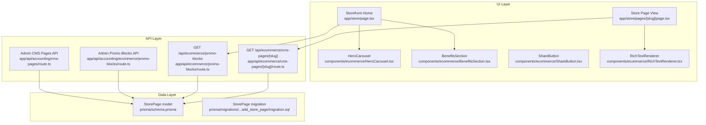
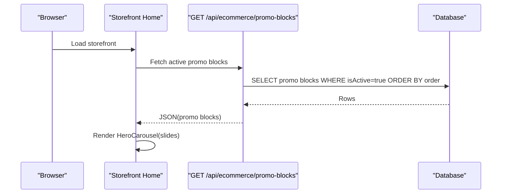
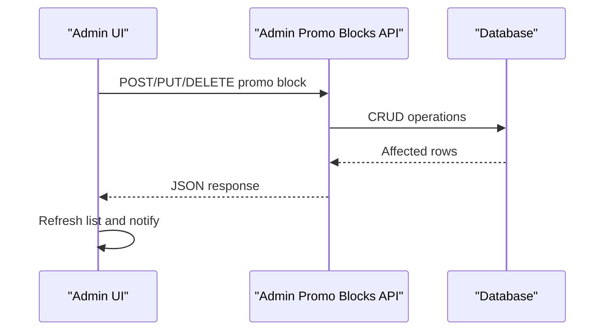
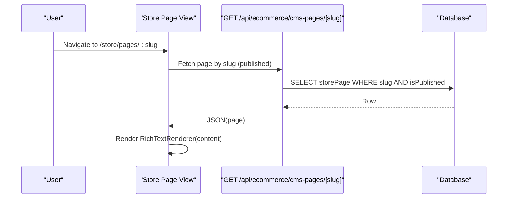
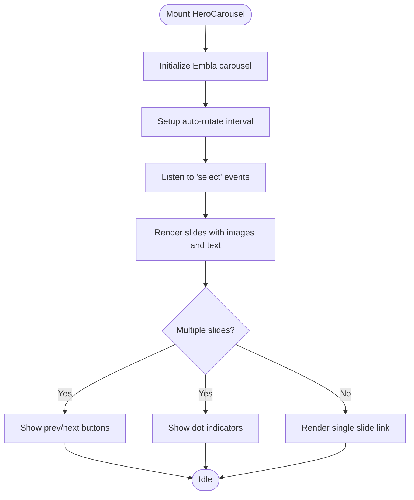
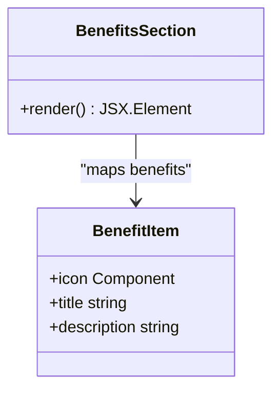
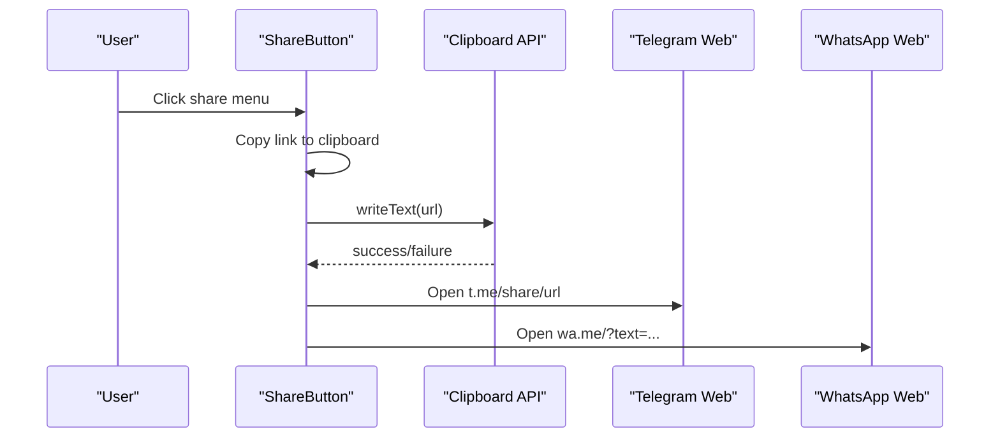
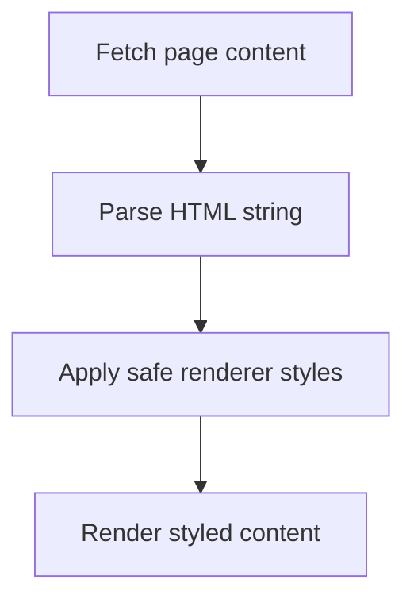
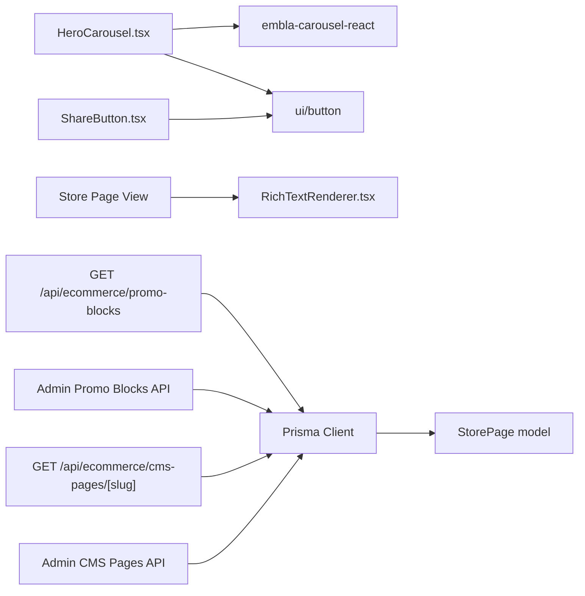

# Promotions & Content

<cite>
**Referenced Files in This Document**
- [storefront home](file://app/store/page.tsx)
- [hero carousel](file://components/ecommerce/HeroCarousel.tsx)
- [benefits section](file://components/ecommerce/BenefitsSection.tsx)
- [share button](file://components/ecommerce/ShareButton.tsx)
- [rich text renderer](file://components/ecommerce/RichTextRenderer.tsx)
- [store page view](file://app/store/pages/[slug]/page.tsx)
- [ecommerce promo blocks API](file://app/api/ecommerce/promo-blocks/route.ts)
- [accounting promo blocks API](file://app/api/accounting/ecommerce/promo-blocks/route.ts)
- [accounting promo blocks admin](file://app/(accounting)/ecommerce/promo-blocks/page.tsx)
- [ecommerce CMS pages API](file://app/api/ecommerce/cms-pages/[slug]/route.ts)
- [accounting CMS pages API](file://app/api/accounting/cms-pages/route.ts)
- [accounting CMS page admin](file://app/(accounting)/cms-pages/page.tsx)
- [store page model](file://prisma/schema.prisma)
- [store page migration](file://prisma/migrations/20260227_add_store_page/migration.sql)
- [ecommerce CMS schemas](file://lib/modules/ecommerce/schemas/cms.schema.ts)
- [ecommerce admin schemas](file://lib/modules/accounting/schemas/ecommerce-admin.schema.ts)
</cite>

## Table of Contents
1. [Introduction](#introduction)
2. [Project Structure](#project-structure)
3. [Core Components](#core-components)
4. [Architecture Overview](#architecture-overview)
5. [Detailed Component Analysis](#detailed-component-analysis)
6. [Dependency Analysis](#dependency-analysis)
7. [Performance Considerations](#performance-considerations)
8. [Troubleshooting Guide](#troubleshooting-guide)
9. [Conclusion](#conclusion)

## Introduction
This document explains the promotional content and marketing features of the store, including:
- The promotional block system for banners, offers, and special promotions
- The CMS page system for static content (terms, conditions, informational pages)
- The hero carousel for featured products and seasonal promotions
- The benefits section component for highlighting store features and guarantees
- Social sharing capabilities integrated with Telegram and WhatsApp

It also covers content management interfaces, dynamic content rendering, and outlines how scheduling and A/B testing could be implemented given the current architecture.

## Project Structure
The promotional and content features span three layers:
- UI components (React) for presentation and interactivity
- API routes (Next.js) for data retrieval and administrative operations
- Prisma models and migrations for persistent storage

**Diagram sources**
- [storefront home:25-94](file://app/store/page.tsx#L25-L94)
- [hero carousel:22-136](file://components/ecommerce/HeroCarousel.tsx#L22-L136)
- [benefits section:28-45](file://components/ecommerce/BenefitsSection.tsx#L28-L45)
- [share button:19-76](file://components/ecommerce/ShareButton.tsx#L19-L76)
- [store page view:19-96](file://app/store/pages/[slug]/page.tsx#L19-L96)
- [rich text renderer:10-33](file://components/ecommerce/RichTextRenderer.tsx#L10-L33)
- [ecommerce promo blocks API:6-20](file://app/api/ecommerce/promo-blocks/route.ts#L6-L20)
- [accounting promo blocks API:7-108](file://app/api/accounting/ecommerce/promo-blocks/route.ts#L7-L108)
- [accounting promo blocks admin](file://app/(accounting)/ecommerce/promo-blocks/page.tsx#L31-L365)
- [ecommerce CMS pages API:5-37](file://app/api/ecommerce/cms-pages/[slug]/route.ts#L5-L37)
- [accounting CMS pages API:7-40](file://app/api/accounting/cms-pages/route.ts#L7-L40)
- [store page model:832-848](file://prisma/schema.prisma#L832-L848)
- [store page migration:4-29](file://prisma/migrations/20260227_add_store_page/migration.sql#L4-L29)

**Section sources**
- [storefront home:25-94](file://app/store/page.tsx#L25-L94)
- [hero carousel:22-136](file://components/ecommerce/HeroCarousel.tsx#L22-L136)
- [benefits section:28-45](file://components/ecommerce/BenefitsSection.tsx#L28-L45)
- [share button:19-76](file://components/ecommerce/ShareButton.tsx#L19-L76)
- [store page view:19-96](file://app/store/pages/[slug]/page.tsx#L19-L96)
- [rich text renderer:10-33](file://components/ecommerce/RichTextRenderer.tsx#L10-L33)
- [ecommerce promo blocks API:6-20](file://app/api/ecommerce/promo-blocks/route.ts#L6-L20)
- [accounting promo blocks API:7-108](file://app/api/accounting/ecommerce/promo-blocks/route.ts#L7-L108)
- [accounting promo blocks admin](file://app/(accounting)/ecommerce/promo-blocks/page.tsx#L31-L365)
- [ecommerce CMS pages API:5-37](file://app/api/ecommerce/cms-pages/[slug]/route.ts#L5-L37)
- [accounting CMS pages API:7-40](file://app/api/accounting/cms-pages/route.ts#L7-L40)
- [store page model:832-848](file://prisma/schema.prisma#L832-L848)
- [store page migration:4-29](file://prisma/migrations/20260227_add_store_page/migration.sql#L4-L29)

## Core Components
- Promotional blocks carousel: Dynamically loads active promotional banners and renders a looping carousel with navigation and auto-rotation.
- Benefits section: Displays store guarantees and services in a responsive grid.
- CMS pages: Static informational pages rendered from persisted HTML content with SEO metadata.
- Social sharing: Provides copy-link and platform-specific sharing to Telegram and WhatsApp.

**Section sources**
- [hero carousel:22-136](file://components/ecommerce/HeroCarousel.tsx#L22-L136)
- [benefits section:28-45](file://components/ecommerce/BenefitsSection.tsx#L28-L45)
- [store page view:19-96](file://app/store/pages/[slug]/page.tsx#L19-L96)
- [share button:19-76](file://components/ecommerce/ShareButton.tsx#L19-L76)

## Architecture Overview
The system follows a clear separation of concerns:
- Presentation: React components render promotional content and CMS pages.
- Data fetching: Next.js API routes query the database and return structured JSON.
- Persistence: Prisma models define the schema for promotional blocks and CMS pages.

**Diagram sources**
- [storefront home:29-38](file://app/store/page.tsx#L29-L38)
- [ecommerce promo blocks API:6-20](file://app/api/ecommerce/promo-blocks/route.ts#L6-L20)

**Section sources**
- [storefront home:25-94](file://app/store/page.tsx#L25-L94)
- [ecommerce promo blocks API:6-20](file://app/api/ecommerce/promo-blocks/route.ts#L6-L20)

## Detailed Component Analysis

### Promotional Block System
Promotional blocks power the hero carousel and can be managed via an admin interface. The system supports:
- Creating, updating, deleting, and toggling activation of blocks
- Ordering blocks for display
- Linking blocks to internal or external destinations

- Data model: The model stores title, subtitle, image URL, optional link URL, sort order, and activation flag.
- Validation: Zod schemas enforce required fields and types for creation and updates.
- Access control: Admin endpoints require appropriate permissions.

**Diagram sources**
- [accounting promo blocks API:23-108](file://app/api/accounting/ecommerce/promo-blocks/route.ts#L23-L108)
- [ecommerce admin schemas:23-34](file://lib/modules/accounting/schemas/ecommerce-admin.schema.ts#L23-L34)

**Section sources**
- [accounting promo blocks admin](file://app/(accounting)/ecommerce/promo-blocks/page.tsx#L31-L365)
- [accounting promo blocks API:7-108](file://app/api/accounting/ecommerce/promo-blocks/route.ts#L7-L108)
- [ecommerce promo blocks API:6-20](file://app/api/ecommerce/promo-blocks/route.ts#L6-L20)
- [ecommerce admin schemas:23-34](file://lib/modules/accounting/schemas/ecommerce-admin.schema.ts#L23-L34)

### CMS Page System
CMS pages provide static content for informational and legal pages. Features:
- Listing pages filtered by publication and placement flags
- Rendering rich HTML content safely
- Managing SEO metadata and navigation visibility
- Slug-based routing for public pages

- Data model: Includes title, slug, content (HTML), SEO fields, publish flag, sort order, and footer/header visibility.
- Validation: Zod schemas validate creation and updates, including slug format and uniqueness checks.
- Public vs admin APIs: Public endpoint filters by publication; admin endpoint allows full CRUD with permission checks.

**Diagram sources**
- [store page view:19-96](file://app/store/pages/[slug]/page.tsx#L19-L96)
- [ecommerce CMS pages API:5-37](file://app/api/ecommerce/cms-pages/[slug]/route.ts#L5-L37)
- [accounting CMS pages API:7-40](file://app/api/accounting/cms-pages/route.ts#L7-L40)
- [ecommerce CMS schemas:3-25](file://lib/modules/ecommerce/schemas/cms.schema.ts#L3-L25)
- [store page model:832-848](file://prisma/schema.prisma#L832-L848)

**Section sources**
- [store page view:19-96](file://app/store/pages/[slug]/page.tsx#L19-L96)
- [rich text renderer:10-33](file://components/ecommerce/RichTextRenderer.tsx#L10-L33)
- [ecommerce CMS pages API:5-37](file://app/api/ecommerce/cms-pages/[slug]/route.ts#L5-L37)
- [accounting CMS pages API:7-40](file://app/api/accounting/cms-pages/route.ts#L7-L40)
- [ecommerce CMS schemas:3-25](file://lib/modules/ecommerce/schemas/cms.schema.ts#L3-L25)
- [store page model:832-848](file://prisma/schema.prisma#L832-L848)

### Hero Carousel Functionality
The hero carousel displays promotional slides with:
- Auto-rotation at intervals
- Looping behavior
- Navigation controls and indicators
- Single-slide fallback rendering

**Diagram sources**
- [hero carousel:22-136](file://components/ecommerce/HeroCarousel.tsx#L22-L136)

**Section sources**
- [hero carousel:22-136](file://components/ecommerce/HeroCarousel.tsx#L22-L136)

### Benefits Section Component
The benefits section presents store guarantees and services in a responsive grid layout with icons and descriptions.

**Diagram sources**
- [benefits section:28-45](file://components/ecommerce/BenefitsSection.tsx#L28-L45)

**Section sources**
- [benefits section:28-45](file://components/ecommerce/BenefitsSection.tsx#L28-L45)

### Social Sharing Capabilities
The share button integrates with:
- Clipboard API for copying links
- Telegram deep link sharing
- WhatsApp message sharing

**Diagram sources**
- [share button:19-76](file://components/ecommerce/ShareButton.tsx#L19-L76)

**Section sources**
- [share button:19-76](file://components/ecommerce/ShareButton.tsx#L19-L76)

### Dynamic Content Rendering
CMS content is stored as HTML and rendered safely using a dedicated renderer component that applies consistent typography and styles.

**Diagram sources**
- [store page view:19-96](file://app/store/pages/[slug]/page.tsx#L19-L96)
- [rich text renderer:10-33](file://components/ecommerce/RichTextRenderer.tsx#L10-L33)

**Section sources**
- [store page view:19-96](file://app/store/pages/[slug]/page.tsx#L19-L96)
- [rich text renderer:10-33](file://components/ecommerce/RichTextRenderer.tsx#L10-L33)

## Dependency Analysis
- UI components depend on:
  - Embla carousel for hero slides
  - UI primitives for buttons, menus, and dialogs
- API routes depend on:
  - Prisma client for database operations
  - Zod schemas for request validation
  - Authorization helpers for permission checks
- Data model depends on:
  - Unique constraints on slugs
  - Composite indexes for efficient queries

**Diagram sources**
- [hero carousel:22-136](file://components/ecommerce/HeroCarousel.tsx#L22-L136)
- [share button:19-76](file://components/ecommerce/ShareButton.tsx#L19-L76)
- [store page view:19-96](file://app/store/pages/[slug]/page.tsx#L19-L96)
- [rich text renderer:10-33](file://components/ecommerce/RichTextRenderer.tsx#L10-L33)
- [ecommerce promo blocks API:6-20](file://app/api/ecommerce/promo-blocks/route.ts#L6-L20)
- [accounting promo blocks API:7-108](file://app/api/accounting/ecommerce/promo-blocks/route.ts#L7-L108)
- [ecommerce CMS pages API:5-37](file://app/api/ecommerce/cms-pages/[slug]/route.ts#L5-L37)
- [accounting CMS pages API:7-40](file://app/api/accounting/cms-pages/route.ts#L7-L40)
- [store page model:832-848](file://prisma/schema.prisma#L832-L848)

**Section sources**
- [hero carousel:22-136](file://components/ecommerce/HeroCarousel.tsx#L22-L136)
- [share button:19-76](file://components/ecommerce/ShareButton.tsx#L19-L76)
- [store page view:19-96](file://app/store/pages/[slug]/page.tsx#L19-L96)
- [ecommerce promo blocks API:6-20](file://app/api/ecommerce/promo-blocks/route.ts#L6-L20)
- [accounting promo blocks API:7-108](file://app/api/accounting/ecommerce/promo-blocks/route.ts#L7-L108)
- [ecommerce CMS pages API:5-37](file://app/api/ecommerce/cms-pages/[slug]/route.ts#L5-L37)
- [accounting CMS pages API:7-40](file://app/api/accounting/cms-pages/route.ts#L7-L40)
- [store page model:832-848](file://prisma/schema.prisma#L832-L848)

## Performance Considerations
- Carousel auto-rotation: Consider pausing rotation on hover and unmounting intervals on unmount to avoid leaks.
- Image loading: Lazy-load images and use appropriate sizes to reduce bandwidth.
- API caching: Cache promotional blocks and CMS pages on the server-side where feasible.
- Pagination: For large lists, paginate admin views and CMS listings.
- Indexes: Leverage existing indexes on slugs and composite indexes for efficient filtering and sorting.

[No sources needed since this section provides general guidance]

## Troubleshooting Guide
- Promotional blocks not appearing:
  - Verify isActive flag and order field in the admin panel.
  - Confirm the public API returns results and there are no validation errors.
- CMS page not found:
  - Ensure the page is published and the slug matches exactly.
  - Check for case sensitivity and special characters in the slug.
- Share button fails:
  - Clipboard requires secure contexts; ensure HTTPS.
  - Platform links open external apps; verify availability in the user’s environment.

**Section sources**
- [ecommerce promo blocks API:6-20](file://app/api/ecommerce/promo-blocks/route.ts#L6-L20)
- [ecommerce CMS pages API:5-37](file://app/api/ecommerce/cms-pages/[slug]/route.ts#L5-L37)
- [share button:19-76](file://components/ecommerce/ShareButton.tsx#L19-L76)

## Conclusion
The store’s promotional and content systems are modular and extensible:
- Promotional blocks are easy to manage and render dynamically in the hero carousel.
- CMS pages support rich, SEO-friendly content with flexible placement controls.
- Social sharing integrates seamlessly with popular platforms.
- The architecture supports future enhancements such as content scheduling and A/B testing by extending models, API endpoints, and UI components.

[No sources needed since this section summarizes without analyzing specific files]