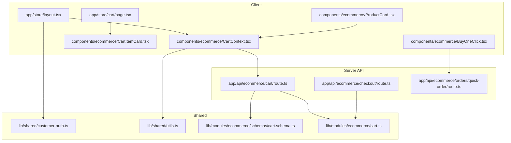
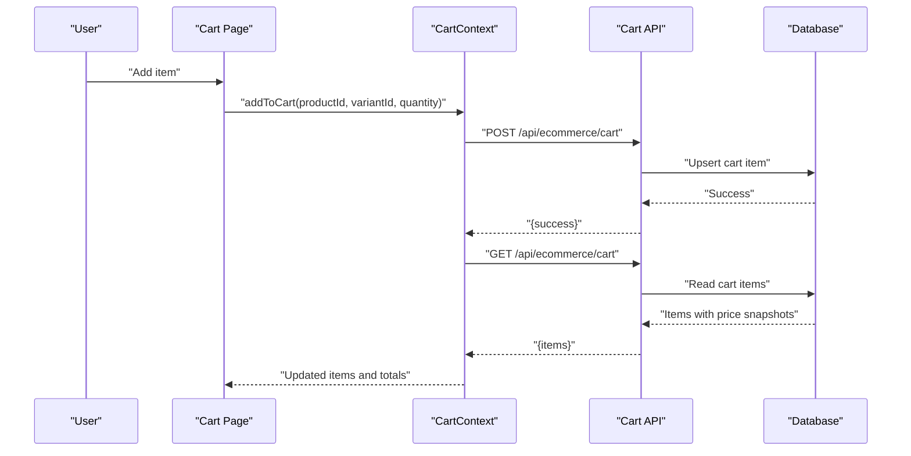
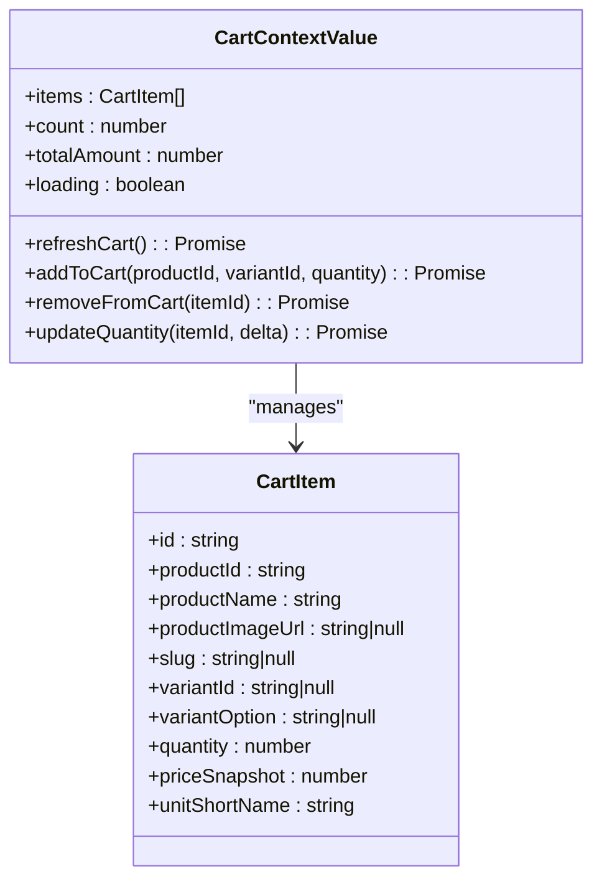
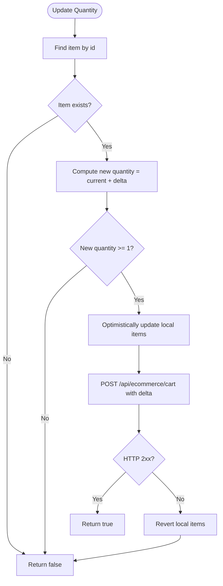
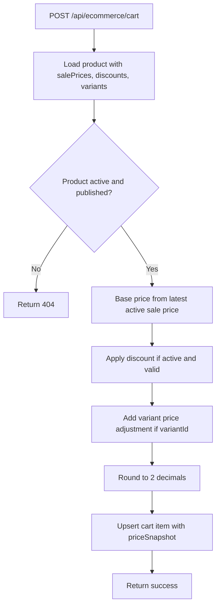
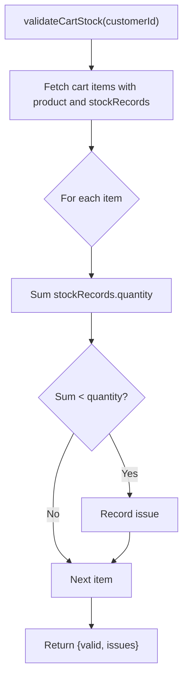
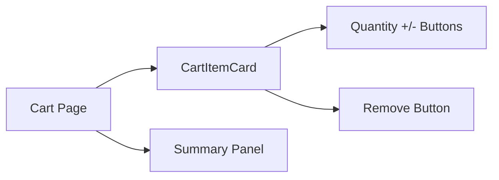
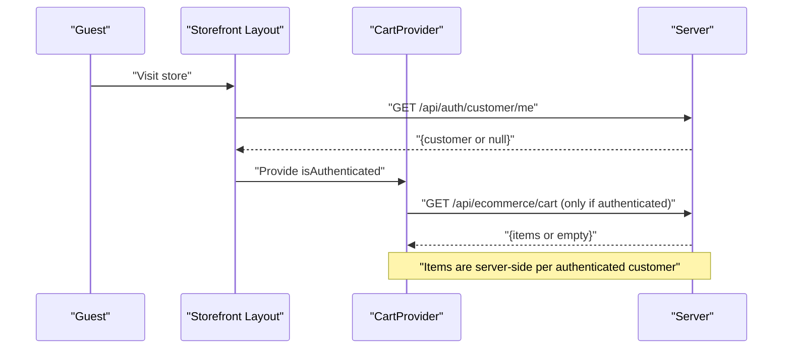
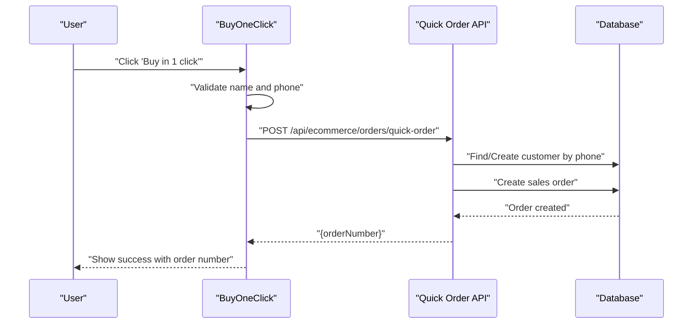
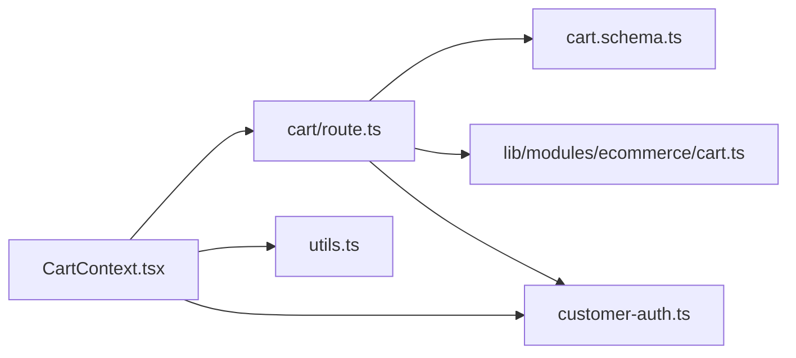

# Shopping Cart

<cite>
**Referenced Files in This Document**
- [CartContext.tsx](file://components/ecommerce/CartContext.tsx)
- [CartItemCard.tsx](file://components/ecommerce/CartItemCard.tsx)
- [cart\route.ts](file://app/api/ecommerce/cart/route.ts)
- [cart.schema.ts](file://lib/modules/ecommerce/schemas/cart.schema.ts)
- [cart.ts](file://lib/modules/ecommerce/cart.ts)
- [cart\page.tsx](file://app/store/cart/page.tsx)
- [layout.tsx](file://app/store/layout.tsx)
- [utils.ts](file://lib/shared/utils.ts)
- [customer-auth.ts](file://lib/shared/customer-auth.ts)
- [ProductCard.tsx](file://components/ecommerce/ProductCard.tsx)
- [BuyOneClick.tsx](file://components/ecommerce/BuyOneClick.tsx)
- [checkout\route.ts](file://app/api/ecommerce/checkout/route.ts)
- [orders\quick-order\route.ts](file://app/api/ecommerce/orders/quick-order/route.ts)
</cite>

## Table of Contents
1. [Introduction](#introduction)
2. [Project Structure](#project-structure)
3. [Core Components](#core-components)
4. [Architecture Overview](#architecture-overview)
5. [Detailed Component Analysis](#detailed-component-analysis)
6. [Dependency Analysis](#dependency-analysis)
7. [Performance Considerations](#performance-considerations)
8. [Troubleshooting Guide](#troubleshooting-guide)
9. [Conclusion](#conclusion)

## Introduction
This document explains the shopping cart functionality in the store front. It covers:
- Persistence model: server-side session-backed cart stored per authenticated customer
- Item lifecycle: add, remove, and quantity updates
- Context provider and state management patterns
- Integration with product data and pricing calculations
- Validation rules: product availability and stock checks
- UI components: cart page, item cards, and summary displays
- Cross-session behavior and guest vs registered user handling
- Performance considerations and memory management

## Project Structure
The cart feature spans client-side React components, a server-side API, and shared utilities for authentication and formatting.

**Diagram sources**
- [layout.tsx:248](file://app/store/layout.tsx#L248)
- [CartContext.tsx:56](file://components/ecommerce/CartContext.tsx#L56)
- [cart\page.tsx:13](file://app/store/cart/page.tsx#L13)
- [cart\route.ts:8](file://app/api/ecommerce/cart/route.ts#L8)
- [checkout\route.ts:32](file://app/api/ecommerce/checkout/route.ts#L32)
- [orders\quick-order\route.ts:35](file://app/api/ecommerce/orders/quick-order/route.ts#L35)
- [customer-auth.ts:5](file://lib/shared/customer-auth.ts#L5)
- [utils.ts:8](file://lib/shared/utils.ts#L8)
- [cart.schema.ts:4](file://lib/modules/ecommerce/schemas/cart.schema.ts#L4)
- [cart.ts:4](file://lib/modules/ecommerce/cart.ts#L4)

**Section sources**
- [layout.tsx:248](file://app/store/layout.tsx#L248)
- [CartContext.tsx:56](file://components/ecommerce/CartContext.tsx#L56)
- [cart\page.tsx:13](file://app/store/cart/page.tsx#L13)
- [cart\route.ts:8](file://app/api/ecommerce/cart/route.ts#L8)
- [customer-auth.ts:5](file://lib/shared/customer-auth.ts#L5)
- [utils.ts:8](file://lib/shared/utils.ts#L8)
- [cart.schema.ts:4](file://lib/modules/ecommerce/schemas/cart.schema.ts#L4)
- [cart.ts:4](file://lib/modules/ecommerce/cart.ts#L4)

## Core Components
- CartProvider: Manages cart state, fetches items for authenticated users, and exposes actions to add/remove/update items.
- CartItemCard: Renders a single cart item with quantity controls and removal action.
- Cart Page: Displays items and a summary panel with totals and navigation.
- API Routes: Provide GET/POST/DELETE endpoints for cart operations and integrate with product pricing and stock.
- Shared Utilities: Authentication session handling and formatting helpers.

Key responsibilities:
- Persistence: Server-side cart per authenticated customer via session cookie.
- Pricing: Calculates price snapshots with discounts and variant adjustments.
- Validation: Checks product availability and stock levels during checkout and order creation.

**Section sources**
- [CartContext.tsx:56](file://components/ecommerce/CartContext.tsx#L56)
- [CartItemCard.tsx:24](file://components/ecommerce/CartItemCard.tsx#L24)
- [cart\page.tsx:13](file://app/store/cart/page.tsx#L13)
- [cart\route.ts:8](file://app/api/ecommerce/cart/route.ts#L8)
- [utils.ts:8](file://lib/shared/utils.ts#L8)

## Architecture Overview
The cart system uses a hybrid approach:
- Client state: React context holds transient UI state and derived totals.
- Server state: Persistent cart stored in the database per authenticated customer.
- Session: Customer identity is established via a signed session cookie.

**Diagram sources**
- [CartContext.tsx:83](file://components/ecommerce/CartContext.tsx#L83)
- [cart\route.ts:56](file://app/api/ecommerce/cart/route.ts#L56)
- [cart\route.ts:8](file://app/api/ecommerce/cart/route.ts#L8)

## Detailed Component Analysis

### Cart Provider and State Management
- Context value includes items, counts, totals, loading flag, and actions: refreshCart, addToCart, removeFromCart, updateQuantity.
- For authenticated users, on mount it fetches items from the server; for guests, it initializes an empty cart.
- Derived totals are computed from priceSnapshot and quantity.

**Diagram sources**
- [CartContext.tsx:26](file://components/ecommerce/CartContext.tsx#L26)
- [CartContext.tsx:13](file://components/ecommerce/CartContext.tsx#L13)

**Section sources**
- [CartContext.tsx:56](file://components/ecommerce/CartContext.tsx#L56)
- [CartContext.tsx:175](file://components/ecommerce/CartContext.tsx#L175)

### Cart Item Management
- Add to cart: Validates request payload, resolves current price with discounts and variant adjustments, upserts cart item, and refreshes state.
- Remove from cart: Optimistically removes locally, calls DELETE endpoint, reverts on failure.
- Update quantity: Optimistically updates quantity, posts delta to server; reverts on failure.

**Diagram sources**
- [CartContext.tsx:136](file://components/ecommerce/CartContext.tsx#L136)
- [cart\route.ts:56](file://app/api/ecommerce/cart/route.ts#L56)

**Section sources**
- [CartContext.tsx:109](file://components/ecommerce/CartContext.tsx#L109)
- [CartContext.tsx:136](file://components/ecommerce/CartContext.tsx#L136)
- [cart\route.ts:56](file://app/api/ecommerce/cart/route.ts#L56)

### Pricing Calculations and Product Integration
- On add/update, the server fetches the product, applies active sale price and discounts, adds variant price adjustments, rounds to two decimals, and stores a price snapshot in the cart item.
- The client computes totalAmount from priceSnapshot × quantity.

**Diagram sources**
- [cart\route.ts:61](file://app/api/ecommerce/cart/route.ts#L61)
- [cart\route.ts:107](file://app/api/ecommerce/cart/route.ts#L107)

**Section sources**
- [cart\route.ts:61](file://app/api/ecommerce/cart/route.ts#L61)
- [cart\route.ts:107](file://app/api/ecommerce/cart/route.ts#L107)
- [utils.ts:8](file://lib/shared/utils.ts#L8)

### Validation Rules and Stock Availability
- Stock validation aggregates total stock records and compares against cart quantities.
- Checkout validates product availability and constructs order items using current pricing logic.

**Diagram sources**
- [cart.ts:77](file://lib/modules/ecommerce/cart.ts#L77)

**Section sources**
- [cart.ts:77](file://lib/modules/ecommerce/cart.ts#L77)
- [checkout\route.ts:43](file://app/api/ecommerce/checkout/route.ts#L43)

### Cart UI Components
- Cart Page: Shows loading skeleton, empty state, list of items rendered via CartItemCard, and a summary panel with counts, quantities, and total.
- CartItemCard: Displays image, product link, variant info, quantity controls (+/-), unit price, and subtotal; supports remove action.
- ProductCard: Used in catalog; integrates with cart via Add-to-Cart flows (see Quick Buy One Click below).

**Diagram sources**
- [cart\page.tsx:57](file://app/store/cart/page.tsx#L57)
- [CartItemCard.tsx:24](file://components/ecommerce/CartItemCard.tsx#L24)

**Section sources**
- [cart\page.tsx:13](file://app/store/cart/page.tsx#L13)
- [CartItemCard.tsx:24](file://components/ecommerce/CartItemCard.tsx#L24)
- [ProductCard.tsx:27](file://components/ecommerce/ProductCard.tsx#L27)

### Guest vs Registered User and Cross-Session Behavior
- Session: Customer identity is established via a signed session cookie with a fixed max age.
- Guest handling: The CartProvider treats non-authenticated users as having an empty cart; items are not persisted.
- Cross-session recovery: When a user authenticates, the client fetches their server-side cart; items persist after login.

**Diagram sources**
- [layout.tsx:219](file://app/store/layout.tsx#L219)
- [layout.tsx:248](file://app/store/layout.tsx#L248)
- [CartContext.tsx:60](file://components/ecommerce/CartContext.tsx#L60)
- [customer-auth.ts:5](file://lib/shared/customer-auth.ts#L5)

**Section sources**
- [layout.tsx:219](file://app/store/layout.tsx#L219)
- [customer-auth.ts:5](file://lib/shared/customer-auth.ts#L5)
- [CartContext.tsx:60](file://components/ecommerce/CartContext.tsx#L60)

### Quick Buy One Click Integration
- BuyOneClick opens a dialog to capture customer name and phone, then posts to a quick-order endpoint that finds or creates a guest customer and creates an order.
- This complements the cart by enabling immediate order placement without visiting the cart page.

**Diagram sources**
- [BuyOneClick.tsx:39](file://components/ecommerce/BuyOneClick.tsx#L39)
- [orders\quick-order\route.ts:72](file://app/api/ecommerce/orders/quick-order/route.ts#L72)

**Section sources**
- [BuyOneClick.tsx:39](file://components/ecommerce/BuyOneClick.tsx#L39)
- [orders\quick-order\route.ts:72](file://app/api/ecommerce/orders/quick-order/route.ts#L72)

## Dependency Analysis
- CartContext depends on:
  - Server API for cart operations
  - Shared utils for formatting
  - Customer authentication for session handling
- API routes depend on:
  - Shared customer-auth for session verification
  - Prisma models for cart and product queries
  - Zod schema for request validation

**Diagram sources**
- [CartContext.tsx:56](file://components/ecommerce/CartContext.tsx#L56)
- [cart\route.ts:8](file://app/api/ecommerce/cart/route.ts#L8)
- [cart.schema.ts:4](file://lib/modules/ecommerce/schemas/cart.schema.ts#L4)
- [cart.ts:4](file://lib/modules/ecommerce/cart.ts#L4)
- [utils.ts:8](file://lib/shared/utils.ts#L8)
- [customer-auth.ts:5](file://lib/shared/customer-auth.ts#L5)

**Section sources**
- [CartContext.tsx:56](file://components/ecommerce/CartContext.tsx#L56)
- [cart\route.ts:8](file://app/api/ecommerce/cart/route.ts#L8)
- [cart.schema.ts:4](file://lib/modules/ecommerce/schemas/cart.schema.ts#L4)
- [cart.ts:4](file://lib/modules/ecommerce/cart.ts#L4)
- [utils.ts:8](file://lib/shared/utils.ts#L8)
- [customer-auth.ts:5](file://lib/shared/customer-auth.ts#L5)

## Performance Considerations
- Client-side:
  - Use memoized callbacks (useCallback) for cart actions to avoid unnecessary re-renders.
  - Keep derived totals (count, totalAmount) recomputed only when items change.
  - Avoid heavy computations in render; compute totals once per batched update.
- Server-side:
  - Batch reads/writes for cart operations; leverage upsert to minimize round trips.
  - Limit discount/product fetches to necessary fields to reduce payload sizes.
  - Cache frequently accessed product metadata per request if needed.
- Memory:
  - Avoid storing large transient data in context; keep only essential cart state.
  - Clear or reset cart state on logout to prevent stale references.

## Troubleshooting Guide
Common issues and resolutions:
- Unauthenticated requests to cart API return 401; ensure the session cookie is present and valid.
- Adding items fails with validation errors; verify productId, variantId, and quantity meet schema requirements.
- Removing items fails locally; the client reverts the UI state; retry after network stability.
- Stock discrepancies at checkout; validateCartStock identifies over-allocation; adjust quantities accordingly.
- Formatting inconsistencies; use shared formatting utilities for currency and numbers.

**Section sources**
- [customer-auth.ts:85](file://lib/shared/customer-auth.ts#L85)
- [cart.schema.ts:4](file://lib/modules/ecommerce/schemas/cart.schema.ts#L4)
- [CartContext.tsx:109](file://components/ecommerce/CartContext.tsx#L109)
- [cart.ts:77](file://lib/modules/ecommerce/cart.ts#L77)
- [utils.ts:8](file://lib/shared/utils.ts#L8)

## Conclusion
The cart system combines a robust server-side persistence model with a responsive client-side UI. It enforces product availability and stock checks, captures price snapshots for consistency, and supports both authenticated and guest experiences. The modular design enables easy extension for features like promotions, minimum order thresholds, and advanced inventory policies.