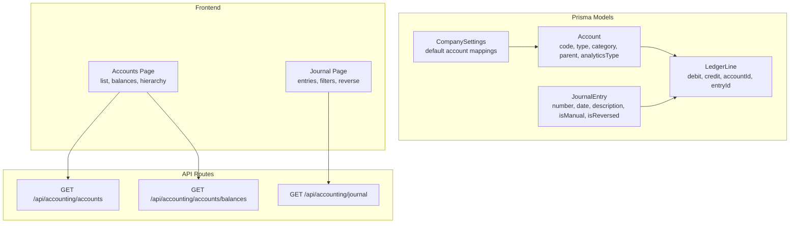
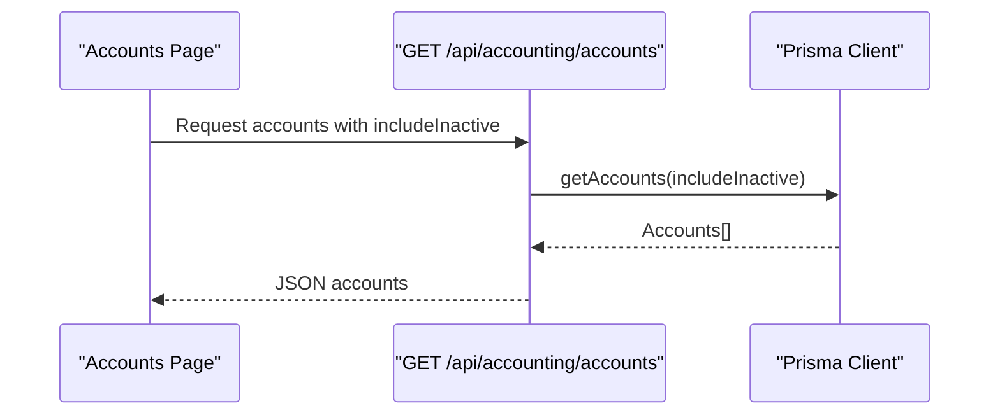
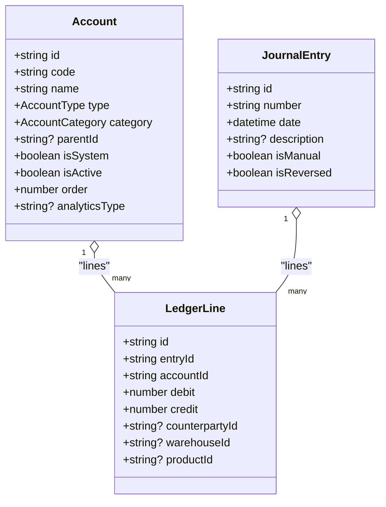
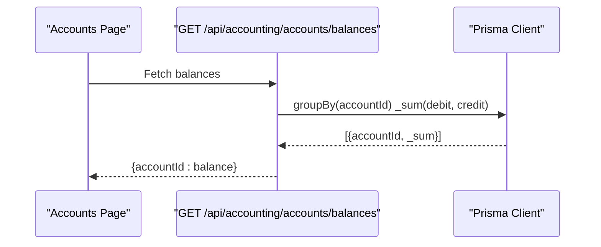
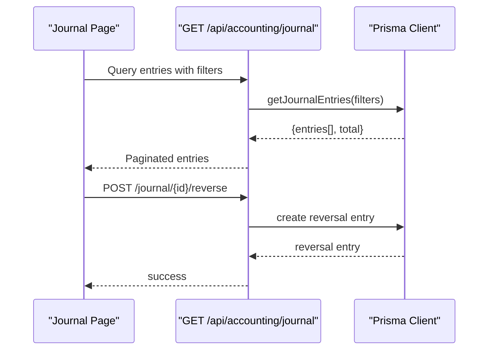
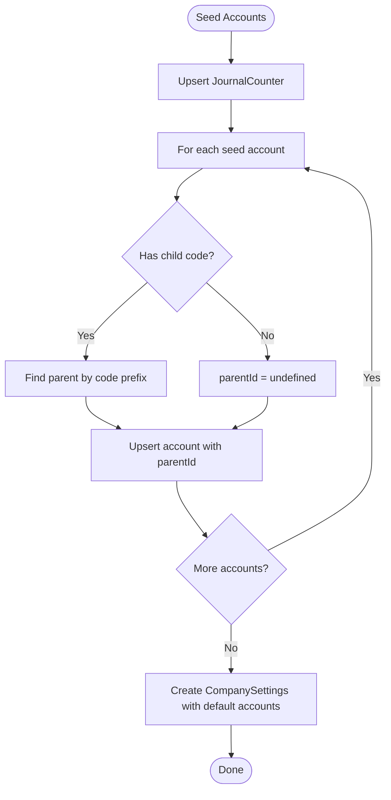
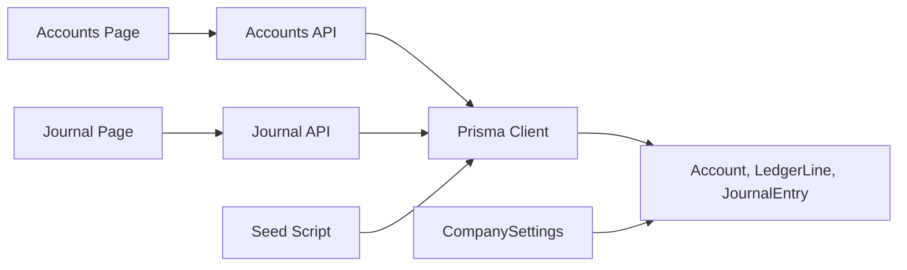

# Account Management

<cite>
**Referenced Files in This Document**
- [schema.prisma](file://prisma/schema.prisma)
- [seed-accounts.ts](file://prisma/seed-accounts.ts)
- [accounts/page.tsx](file://app/(finance)/finance/accounts/page.tsx)
- [journal/page.tsx](file://app/(finance)/finance/journal/page.tsx)
- [accounts/route.ts](file://app/api/accounting/accounts/route.ts)
- [accounts/balances/route.ts](file://app/api/accounting/accounts/balances/route.ts)
- [journal/route.ts](file://app/api/accounting/journal/route.ts)
</cite>

## Table of Contents
1. [Introduction](#introduction)
2. [Project Structure](#project-structure)
3. [Core Components](#core-components)
4. [Architecture Overview](#architecture-overview)
5. [Detailed Component Analysis](#detailed-component-analysis)
6. [Dependency Analysis](#dependency-analysis)
7. [Performance Considerations](#performance-considerations)
8. [Troubleshooting Guide](#troubleshooting-guide)
9. [Conclusion](#conclusion)
10. [Appendices](#appendices)

## Introduction
This document describes the account management system within the finance module. It covers the chart of accounts structure aligned with the Russian regulatory framework, account hierarchies, financial categorization, and the ledger model that supports double-entry bookkeeping. It also documents workflows for account creation, modification, and deletion, balance tracking, journal entry viewing and reversal, and reporting capabilities. Guidance is included for integrating accounts with financial transactions, grouping mechanisms, hierarchy navigation, validation rules, permissions, and audit trails.

## Project Structure
The account management system spans Prisma models, seeding logic, frontend pages, and API routes:
- Prisma schema defines the Account, LedgerLine, JournalEntry, and related enumerations and relationships.
- Seeding script initializes a standardized Russian chart of accounts and maps default accounts to company settings.
- Frontend pages render the chart of accounts and the journal of entries.
- API routes expose read-only endpoints for accounts and balances, and paginated journal queries with filters.

**Diagram sources**
- [schema.prisma](file://prisma/schema.prisma)
- [accounts/page.tsx](file://app/(finance)/finance/accounts/page.tsx)
- [journal/page.tsx](file://app/(finance)/finance/journal/page.tsx)
- [accounts/route.ts](file://app/api/accounting/accounts/route.ts)
- [accounts/balances/route.ts](file://app/api/accounting/accounts/balances/route.ts)
- [journal/route.ts](file://app/api/accounting/journal/route.ts)

**Section sources**
- [schema.prisma](file://prisma/schema.prisma)
- [seed-accounts.ts](file://prisma/seed-accounts.ts)
- [accounts/page.tsx](file://app/(finance)/finance/accounts/page.tsx)
- [journal/page.tsx](file://app/(finance)/finance/journal/page.tsx)
- [accounts/route.ts](file://app/api/accounting/accounts/route.ts)
- [accounts/balances/route.ts](file://app/api/accounting/accounts/balances/route.ts)
- [journal/route.ts](file://app/api/accounting/journal/route.ts)

## Core Components
- Chart of Accounts (Account)
  - Unique numeric or hierarchical codes (e.g., “41”, “41.1”).
  - Types: active, passive, active_passive.
  - Categories: asset, liability, equity, income, expense, off_balance.
  - Hierarchical parent-child relationships via parentId.
  - Analytics dimensions: optional counterparty, warehouse, product.
  - System vs user-defined accounts.
- Ledger and Journal
  - JournalEntry captures a posting with number, date, description, and source linkage.
  - LedgerLine records individual debit/credit postings per account with analytics.
  - Reversal support via isReversed and reversal relationships.
- Company Settings
  - Default account mappings for cash, bank, inventory, suppliers, customers, VAT, sales, COGS, profit, retained earnings.

**Section sources**
- [schema.prisma](file://prisma/schema.prisma)
- [seed-accounts.ts](file://prisma/seed-accounts.ts)

## Architecture Overview
The system follows a layered architecture:
- Data layer: Prisma models define the domain entities and relationships.
- Service layer: API routes delegate to modules that encapsulate business logic.
- Presentation layer: React pages render lists, balances, and journals with filtering and pagination.

**Diagram sources**
- [accounts/page.tsx](file://app/(finance)/finance/accounts/page.tsx)
- [accounts/route.ts](file://app/api/accounting/accounts/route.ts)

**Section sources**
- [accounts/page.tsx](file://app/(finance)/finance/accounts/page.tsx)
- [accounts/route.ts](file://app/api/accounting/accounts/route.ts)

## Detailed Component Analysis

### Chart of Accounts Model and Hierarchy
The Account entity defines the structure and classification of accounts:
- Uniqueness and ordering: code uniqueness and order field for presentation.
- Type and Category: drive debit/credit behavior and financial statement placement.
- Parent-Child: hierarchical grouping enabling drill-down views.
- Analytics: optional dimensions to attach counterparty, warehouse, or product to ledger lines.
- System flag: distinguishes seeded defaults from user-defined accounts.

**Diagram sources**
- [schema.prisma](file://prisma/schema.prisma)

**Section sources**
- [schema.prisma](file://prisma/schema.prisma)

### Account Balances Tracking
Balances are computed by aggregating ledger lines per account:
- Endpoint aggregates SUM(debit) and SUM(credit) grouped by accountId.
- Returns a map of accountId to balance (debit - credit).
- UI displays balances inline in the accounts list.

**Diagram sources**
- [accounts/balances/route.ts](file://app/api/accounting/accounts/balances/route.ts)
- [accounts/page.tsx](file://app/(finance)/finance/accounts/page.tsx)

**Section sources**
- [accounts/balances/route.ts](file://app/api/accounting/accounts/balances/route.ts)
- [accounts/page.tsx](file://app/(finance)/finance/accounts/page.tsx)

### Journal Entries and Reversals
The journal page presents posted entries with:
- Filters: date range, manual/auto, account code.
- Expandable rows showing debits and credits per line.
- Reversal capability: creates a reversing journal entry for a selected posting.

**Diagram sources**
- [journal/page.tsx](file://app/(finance)/finance/journal/page.tsx)
- [journal/route.ts](file://app/api/accounting/journal/route.ts)

**Section sources**
- [journal/page.tsx](file://app/(finance)/finance/journal/page.tsx)
- [journal/route.ts](file://app/api/accounting/journal/route.ts)

### Chart of Accounts Setup and Defaults
The seeding script establishes a standardized Russian chart of accounts and maps default accounts to company settings:
- Seeds major sections (assets, production stocks, finished goods, cash, settlements, capital, financial results).
- Creates hierarchical sub-accounts (e.g., “41” → “41.1”).
- Upserts accounts and sets parent relationships by parsing numeric codes.
- Creates default company settings with mapped accounts for cash, bank, inventory, suppliers, customers, VAT, sales, COGS, profit, retained earnings.

**Diagram sources**
- [seed-accounts.ts](file://prisma/seed-accounts.ts)

**Section sources**
- [seed-accounts.ts](file://prisma/seed-accounts.ts)

### Account Creation, Modification, and Deletion Workflows
- Creation
  - Use the seeding script for system accounts aligned with the Russian chart of accounts.
  - For user-defined accounts, create via backend service and ensure unique code and valid hierarchy.
- Modification
  - Update name, type, category, parent, analyticsType, order, and activation status.
  - Changing parent updates hierarchy; changing category/type affects financial statement placement.
- Deletion
  - Prevent deletion of accounts with existing ledger lines.
  - Archive inactive accounts rather than deleting to preserve audit trails.

[No sources needed since this section provides general guidance]

### Account Classification and Types
- Types
  - Active: increases on debit; typical asset accounts.
  - Passive: increases on credit; typical liability/equity accounts.
  - Active-passive: can increase on either side depending on operation.
- Categories
  - Asset, Liability, Equity, Income, Expense, Off-balance.
- Implication
  - Determines normal balance direction and placement on financial statements.

**Section sources**
- [schema.prisma](file://prisma/schema.prisma)

### Account Codes and Hierarchies
- Codes
  - Unique within the chart; hierarchical codes use dot notation (e.g., “41.1”).
- Parent-Child
  - Enforced via parentId; enables grouping and drill-down navigation.
- Analytics Dimensions
  - Optional: counterparty, warehouse, product to enrich reporting.

**Section sources**
- [schema.prisma](file://prisma/schema.prisma)

### Integration Between Accounts and Financial Transactions
- LedgerLines link JournalEntries to Accounts with debit/credit amounts.
- Analytics fields on LedgerLine connect to counterparties, warehouses, and products.
- CompanySettings maps default accounts for automatic posting during document processing.

**Section sources**
- [schema.prisma](file://prisma/schema.prisma)

### Account Grouping Mechanisms and Hierarchy Navigation
- Grouping
  - Parent-child relationships form natural groups for financial reporting.
- Navigation
  - Accounts page shows hierarchical indentation; clicking drills into journal entries for that account.

**Section sources**
- [accounts/page.tsx](file://app/(finance)/finance/accounts/page.tsx)

### Account Validation Rules
- Uniqueness
  - Account.code must be unique.
- Hierarchy
  - Parent must exist if parentId is set.
- Analytics
  - analyticsType must match supported dimensions.
- Activation
  - Inactive accounts can be hidden or shown via includeInactive flag.

**Section sources**
- [schema.prisma](file://prisma/schema.prisma)
- [accounts/route.ts](file://app/api/accounting/accounts/route.ts)

### Permissions and Audit Trails
- Permissions
  - API routes enforce roles for reading accounts and reports.
- Audit
  - JournalEntry tracks isManual/isReversed and reversal relationships.
  - LedgerLine stores analytics and amounts for traceability.

**Section sources**
- [accounts/route.ts](file://app/api/accounting/accounts/route.ts)
- [journal/route.ts](file://app/api/accounting/journal/route.ts)
- [schema.prisma](file://prisma/schema.prisma)

### Account Reporting Capabilities
- Balances
  - Per-account balances derived from aggregated ledger lines.
- Journal
  - Filtered, paginated view of entries with expandable details.
- Drill-down
  - Clicking an account navigates to journal filtered by that account code.

**Section sources**
- [accounts/balances/route.ts](file://app/api/accounting/accounts/balances/route.ts)
- [journal/page.tsx](file://app/(finance)/finance/journal/page.tsx)

### Examples of Account Management Scenarios
- Chart of Accounts Setup
  - Run the seeding script to initialize the Russian chart of accounts and default mappings.
- Account Reclassification
  - Change an account’s category/type to move it between financial statement sections; adjust parent to change grouping.
- Account Analysis
  - Use the journal page to filter by account code and analyze debits/credits over time.

**Section sources**
- [seed-accounts.ts](file://prisma/seed-accounts.ts)
- [journal/page.tsx](file://app/(finance)/finance/journal/page.tsx)

## Dependency Analysis
The following diagram shows key dependencies among components:

**Diagram sources**
- [accounts/page.tsx](file://app/(finance)/finance/accounts/page.tsx)
- [journal/page.tsx](file://app/(finance)/finance/journal/page.tsx)
- [accounts/route.ts](file://app/api/accounting/accounts/route.ts)
- [journal/route.ts](file://app/api/accounting/journal/route.ts)
- [schema.prisma](file://prisma/schema.prisma)
- [seed-accounts.ts](file://prisma/seed-accounts.ts)

**Section sources**
- [schema.prisma](file://prisma/schema.prisma)
- [seed-accounts.ts](file://prisma/seed-accounts.ts)
- [accounts/page.tsx](file://app/(finance)/finance/accounts/page.tsx)
- [journal/page.tsx](file://app/(finance)/finance/journal/page.tsx)
- [accounts/route.ts](file://app/api/accounting/accounts/route.ts)
- [journal/route.ts](file://app/api/accounting/journal/route.ts)

## Performance Considerations
- Indexing
  - Ensure indices on Account.code, Account.category+isActive, LedgerLine.accountId, JournalEntry.date/source.
- Aggregation
  - Balance computation uses grouped aggregation; keep indices optimized for SUM(group) operations.
- Pagination
  - Journal queries support pagination and filtering to avoid large result sets.

[No sources needed since this section provides general guidance]

## Troubleshooting Guide
- Accounts not visible
  - Toggle “show inactive” in the accounts list; verify includeInactive query parameter.
- Balances show zero
  - Confirm ledger lines exist for the account; check date range filters.
- Journal filters return empty
  - Adjust date range, manual/auto filter, or account code filter.
- Reversal fails
  - Ensure the entry is not already reversed; check permissions and network errors.

**Section sources**
- [accounts/page.tsx](file://app/(finance)/finance/accounts/page.tsx)
- [journal/page.tsx](file://app/(finance)/finance/journal/page.tsx)

## Conclusion
The account management system provides a robust, standards-aligned chart of accounts with hierarchical grouping, analytics-enabled ledger entries, and integrated journaling with reversal support. The seeded Russian chart of accounts ensures compliance, while flexible permissions, filters, and reporting enable efficient day-to-day accounting operations.

## Appendices

### Account Types and Categories Reference
- Types: active, passive, active_passive
- Categories: asset, liability, equity, income, expense, off_balance

**Section sources**
- [schema.prisma](file://prisma/schema.prisma)